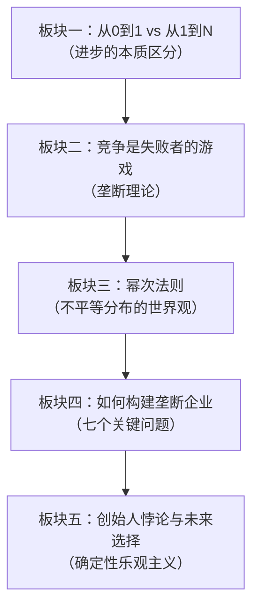
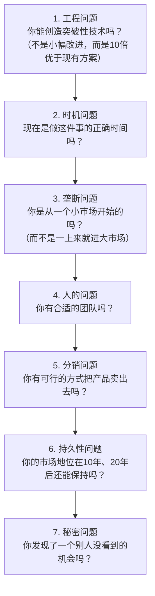
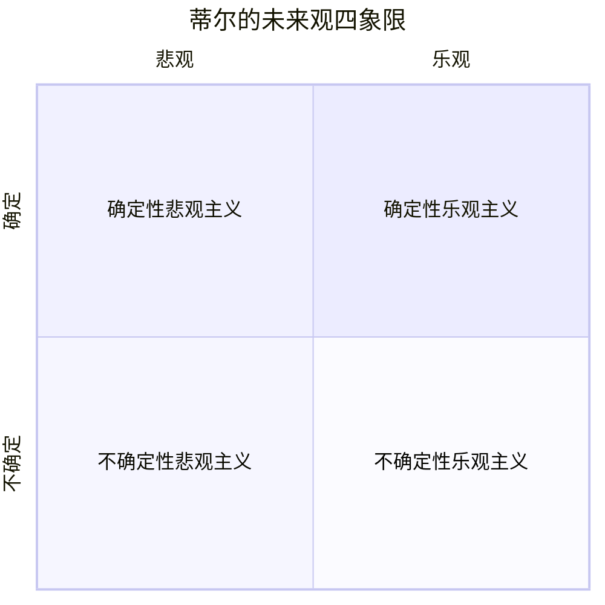
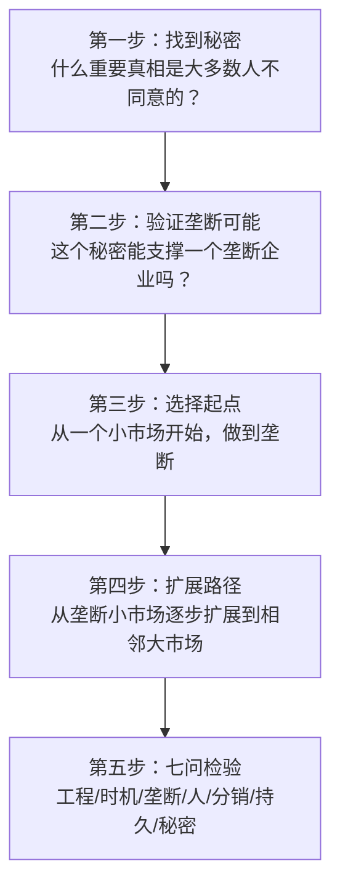

# 《从0到1》深度拆解

## 一、商业坐标定位

《从0到1》（*Zero to One: Notes on Startups, or How to Build the Future*）源自彼得·蒂尔（Peter Thiel）2012年在斯坦福大学开设的创业课程，由他的学生布莱克·马斯特斯（Blake Masters）整理课堂笔记后合著而成。蒂尔是PayPal联合创始人、Facebook首位外部投资人、Palantir联合创始人，是硅谷最具争议性和影响力的思想家之一。他属于"PayPal黑帮"（PayPal Mafia）的核心人物——这个群体后来缔造了YouTube、LinkedIn、Yelp、Tesla等一系列改变世界的公司。

本书的核心不是教你如何融资、如何写商业计划书，而是从根本上挑战你对"进步"的理解。蒂尔提出了一个极其锋利的区分：==从1到N是复制已有的东西（水平进步/全球化），从0到1是创造全新的东西（垂直进步/技术）==。他认为大多数人——包括大多数创业者——做的都是从1到N的事情，而真正改变世界的是从0到1。

与[[《穷查理宝典》]]中芒格的"多元思维模型"不同，蒂尔的思维方式更像一把手术刀——他不追求全面覆盖，而是在少数几个关键问题上切到骨头。与[[《第一性原理》]]张磊的长期主义投资哲学相比，蒂尔更激进、更具颠覆性——他不是在已有市场里找被低估的价值，而是主张创造一个==全新的市场==，让竞争本身变得无关紧要。

## 二、商业逻辑地图

全书可提炼为**五大思想板块**，层层递进：

**核心命题**：大多数人被"竞争"这个概念洗脑了，以为竞争是健康的、是市场经济的灵魂。蒂尔的反命题是：==竞争意味着没有利润、没有差异化、没有未来。真正成功的企业都是垄断者——它们创造了一个只有自己能玩的游戏==。你不应该在一个拥挤的赛道上试图比别人跑得快一点点，而应该创造一条只有你一个人在跑的赛道。

## 三、逐章深度拆解

### 主题一：「从0到1——进步的两种形态」

> [!tip] 全书的哲学基石

**【核心论点】**

蒂尔开篇就抛出他最著名的面试问题：=="有什么是你跟别人有不同看法，但你觉得很重要的真相？"==（What important truth do very few people agree with you on?）这个问题看似简单，实际上极难回答——因为它要求你同时具备独立思考的勇气和足够深入的洞察力。

蒂尔用这个问题引出全书的核心框架：

- **水平进步（从1到N）**：把已经存在的东西复制、推广、规模化。比如在中国成功的商业模式复制到印度，或者开第二家、第三家连锁店。全球化是水平进步的典型代表。
- **垂直进步（从0到1）**：创造全新的东西，做之前没人做过的事。技术创新是垂直进步的核心驱动力。

**【详细拆解】**

蒂尔认为，世界正面临一个危险的错觉：人们以为全球化就等于进步。中国用三十年走完了西方一百年的工业化道路——这很了不起，但本质上是"从1到N"，是在复制已被验证的路径。如果全世界都达到美国的生活水平，但使用的是同样的技术，地球的资源和环境根本承受不了。

==真正的进步必须来自技术突破——用更少的资源创造更大的价值==。蒂尔指出，除了计算机和互联网之外，过去四十年的技术进步远没有人们想象的那么大。你的祖父母如果穿越到今天，除了智能手机会让他们震惊之外，其他大部分东西——飞机、汽车、房屋、医疗——变化并没有那么大。

蒂尔将这种技术停滞称为"我们期待的是会飞的汽车，得到的却是140个字符"——暗指Twitter（现X）代表的信息技术进步虽然热闹，但与材料科学、能源技术、生物技术的停滞相比，远不足以改变世界的物质基础。

**【费曼式解读】**

想象你经营一家面包店。从1到N就是开更多的分店——第二家、第十家、第一百家。你在复制一个已知的成功模式。从0到1是发明一种全新的食物——一种之前世界上不存在的东西，解决一个之前没有被解决的问题。前者需要执行力，后者需要创造力。蒂尔的观点是：整个世界正在疯狂地开分店，但很少有人在真正发明新食物。

**【金句/关键概念】**

> ==每当我面试一个人，我都会问这个问题："有什么是你跟别人有不同看法，但你觉得很重要的真相？"好的回答是这种形式的："大多数人相信X，但事实是X的反面。"==

---

### 主题二：「竞争是失败者的游戏——垄断的道德正当性」

> [!warning] 全书最具颠覆性的章节

**【核心论点】**

蒂尔的核心论断之一：==竞争是一种意识形态，不是经济真相==。从小到大，你被教育"竞争是好的"——考试竞争、体育竞争、商业竞争。但蒂尔认为，竞争是一种破坏性的力量，它迫使参与者把所有精力放在打败对手上，而不是创造价值上。

蒂尔观察到一个讽刺的现象：

- **垄断企业假装自己不是垄断**。谷歌说自己只是"科技公司"的一员，跟苹果、微软、亚马逊竞争激烈——这样监管机构就不会来找麻烦。
- **竞争企业假装自己很特别**。一家小餐厅说自己是"帕洛阿尔托唯一的英式印度料理餐厅"——通过极其狭窄的品类定义来假装自己是这个"市场"的唯一玩家。

现实是：==垄断企业拥有巨额利润和定价权，可以把利润投入长期研发和员工福利；竞争企业利润微薄，疲于奔命，既无法善待员工也无法投资未来==。

**【详细拆解】**

蒂尔从多个角度论证"竞争为什么是坏的"：

1. **经济学角度**：在完全竞争市场中，供需达到均衡时利润为零。这意味着在一个真正竞争激烈的行业里，没有人赚钱。美国航空业在过去一百年里创造了数万亿美元的收入，但累计利润极其微薄——因为竞争太激烈了。而谷歌的搜索业务几乎没有竞争者，所以它的利润率高得惊人。

2. **心理学角度**：竞争让人上瘾。蒂尔用自己的经历说明——他在斯坦福法学院拼命竞争，争取最顶级的律所工作，最终如愿拿到了联邦最高法院书记员的面试机会，但没有被录取。多年后他回望这段经历，庆幸自己没有得到那份工作——如果得到了，他会在一条"别人定义的赛道"上跑完一生，永远不会创立PayPal。==竞争让你关注对手而不是价值，让你在别人的游戏里消耗生命==。

3. **战略角度**：蒂尔引用了莎士比亚的观点——竞争者之间越来越像。麦当劳和汉堡王、可口可乐和百事可乐——越是激烈竞争的对手，它们的产品和策略就越趋同。最终消费者分不清它们的区别，两家都只能靠价格战和营销战苟延残喘。

**【费曼式解读】**

想象一个考试。100个学生争夺第一名，每个人都在做同样的事——刷题、补课、熬夜。最终第一名比第二名高了0.5分，但他们付出的努力是相似的。蒂尔的建议不是"更努力地刷题"，而是"去考一个只有你一个人报名的考试"。当赛场上只有你一个选手时，你就是冠军——而且你可以把精力花在真正有意义的事情上，而不是跟别人比分数。

**【金句/关键概念】**

> ==竞争意味着大家都没有利润，没有差异化，还要为了生存苦苦挣扎。如果你能创造一个垄断企业，你不仅能赚取丰厚的利润，还能为世界创造全新的价值。==

---

### 主题三：「幂次法则——不平等是宇宙的默认设置」

> [!note] 改变你世界观的一章

**【核心论点】**

蒂尔认为，==幂次法则（Power Law）是宇宙中最重要但最被忽视的规律==。它意味着：在任何一个领域里，少数几个参与者占据了绝大部分的成果，而大多数参与者瓜分剩下的一小部分。

在风险投资中，这个规律表现得尤其极端：一家基金投资的所有公司中，表现最好的那一家公司的回报，往往超过其他所有公司的回报之和。这不是正态分布（大多数集中在中间），而是幂次分布（极少数巨大、绝大多数微小）。

**【详细拆解】**

蒂尔从风投实践中发现了幂次法则的残酷真相：

- Founders Fund（蒂尔的基金）投资了Facebook，仅这一笔投资的回报就超过了基金投了所有其他公司的回报总和。
- 在硅谷，前几名的风投基金赚走了行业绝大部分的利润。排名中等的基金甚至无法跑赢大盘。
- 幂次法则不仅存在于投资中，它存在于==几乎所有领域==：少数几个城市创造了大部分的经济产出；少数几个产品贡献了一家公司的大部分利润；少数几个员工创造了一家公司的大部分价值。

这对你的人生决策意味着什么？蒂尔的推论：

1. **选择比努力重要**。如果你在一个呈幂次分布的领域里，你的位置比你的勤奋程度重要得多。在一个爆发性增长的公司里做一个普通员工，可能比在一个停滞不前的公司里当CEO获得更多。
2. **不要多元化**。传统智慧说"不要把鸡蛋放在一个篮子里"，蒂尔说这在幂次法则的世界里是错误的建议。你应该找到那个最好的"篮子"，把所有鸡蛋放进去，然后看好它。
3. **做少数几件大事**。不要试图做十件"还行"的事，而是找到那一件能产生压倒性回报的事，然后全力以赴。

**【费曼式解读】**

想象你在播种。正态分布的世界像一块良田——每颗种子大概都能长出差不多高的庄稼。幂次分布的世界像热带雨林——1%的巨树抢占了90%的阳光，剩下99%的植物在树荫下艰难求生。蒂尔告诉你：商业世界是热带雨林，不是良田。==你的任务不是种更多的种子，而是确保自己成为那1%的巨树==。

**【金句/关键概念】**

> ==风险投资中最大的秘密是：一个基金中表现最好的那家公司的回报，等于或超过其他所有公司回报之和。这个规律告诉你，差异化不是优势，而是唯一的生存策略。==

---

### 主题四：「秘密——未被发现的真相」

> [!tip] 最具哲学深度的一章

**【核心论点】**

蒂尔把世界上的知识分成三类：

1. **惯例**（conventions）：所有人都知道的事情。比如"地球围绕太阳转"。
2. **秘密**（secrets）：有些人已经发现但大多数人还不知道的真相。
3. **谜**（mysteries）：目前没有人知道、也许永远无法知道的事情。

蒂尔的核心论断：==每一个伟大的企业都建立在一个秘密之上——一个被大多数人忽视或否认的重要真相==。

**【详细拆解】**

蒂尔观察到一个令人不安的文化现象：现代社会越来越不相信秘密的存在。人们倾向于认为，所有重要的东西都已经被发现了——"如果这个想法真的好，早就有人做了"。这种心态有四个来源：

1. **渐进主义**：教育系统教你按部就班地前进，不鼓励你追问底层的"为什么"。
2. **风险厌恶**：探索秘密意味着你可能是错的——而犯错的代价在社交层面越来越高。
3. **安逸**：如果你过得还不错，为什么要冒险去探索未知？
4. **扁平化世界的错觉**：在一个信息爆炸的世界里，人们以为所有信息都已经公开了。

但蒂尔指出，秘密仍然大量存在。Airbnb的秘密是：许多人愿意把自己的房子租给陌生人住，也有许多旅行者愿意住在陌生人家里——在Airbnb出现之前，大多数人会觉得这个想法疯了。Uber的秘密是：如果你能让叫车像按按钮一样简单，大量的私家车主愿意兼职当司机。

蒂尔区分了两种秘密：

- **关于自然的秘密**：通过研究物理世界来发现。这是科学家和工程师的领域。
- **关于人的秘密**：通过观察人们不愿说出口、不愿承认、或者尚未意识到的需求来发现。==许多最好的商业秘密藏在"人"的领域里==——人们在做什么但不愿承认？人们需要什么但说不出来？什么行为已经在发生但没有被规模化？

**【费曼式解读】**

想象你生活在一个所有人都不吃生鱼的社会里。大家觉得生鱼"恶心"、"不卫生"、"怎么可能好吃"。有一天你发现：其实生鱼片非常美味、营养丰富，而且日本人已经吃了几百年了。这就是一个"秘密"——一个大多数人因为偏见而看不到的真相。如果你基于这个秘密开了一家寿司店，你就创造了"从0到1"。

**【金句/关键概念】**

> ==如果你觉得没有什么秘密可以被发现了，你就不会去寻找。不去寻找，你就永远不会发现。这是一个自我实现的预言。==

---

### 主题五：「基础决定命运——创业的早期决策」

> [!note] 对创业者最实用的一章

**【核心论点】**

蒂尔援引了一个政治哲学的概念来说明创业早期决策的重要性：==每一家公司的创立都像一个国家的建国时刻==。你在早期做出的基本决定——联合创始人的选择、股权分配、企业文化、初始团队——将像宪法一样长期塑造这家公司的命运。而且这些决定一旦做出，改变的成本极高。

**【详细拆解】**

蒂尔列出了创业早期最关键的几个决策：

1. **联合创始人的选择**：蒂尔将选择联合创始人比作结婚。技术上的互补固然重要，但更重要的是==你们是否有足够深的信任和足够相似的价值观==。他见过太多创业团队因为创始人之间的冲突而崩溃——这种创伤比任何竞争对手造成的打击都更致命。

2. **股权与激励结构**：蒂尔强调，CEO的现金薪酬越低，公司越有可能成功。高薪酬意味着CEO在"维护现状"，低薪酬加股权意味着CEO在"创造未来"。这个信号会传递给整个团队——==如果CEO自己都不愿意用未来对赌，凭什么要求员工相信公司的未来？==

3. **初始团队的紧密性**：蒂尔认为早期团队应该像一个紧密的帮派——每个人全职投入、深度绑定。兼职员工、远程顾问、外包团队在创业早期都是危险信号，因为他们缺乏足够的利益绑定和文化认同。

4. **企业文化的刻意设计**：文化不是写在墙上的标语，而是==公司里的人实际上如何思考、如何行动、如何做决策的模式==。蒂尔的PayPal团队被外界称为"PayPal黑帮"不是偶然——他刻意招募了一群有共同世界观的人，让他们因为使命感而非仅仅因为薪水而聚在一起。

**【费曼式解读】**

建一栋大楼。地基打歪了1度，在第一层你几乎看不出来。但到了第五十层，整栋楼已经偏移了几米。创业也是一样——早期的每个"小决策"都会被时间放大。你现在随意分了股权，三年后估值到了一亿美元时，那个"随意"会变成"致命"。

**【金句/关键概念】**

> ==蒂尔定律（Thiel's Law）：一家创业公司搞砸的最大原因就是基础没打好。你在开始时做出的决定很难改变，所以在一开始就做对极其重要。==

---

### 主题六：「销售的隐秘艺术——分销被严重低估」

> [!warning] 技术创业者最容易忽视的章节

**【核心论点】**

蒂尔指出，硅谷有一种根深蒂固的偏见：技术人员瞧不起销售。工程师觉得好产品会"自己卖自己"。蒂尔认为这是一种危险的幻觉。==分销（distribution）和产品同等重要，甚至更重要。如果你发明了一个好产品但没有好的分销方式，你的生意就是坏的==。

**【详细拆解】**

蒂尔提出了一个非常实用的分销框架，根据客户终身价值（Customer Lifetime Value, CLV）的不同，你需要选择不同的分销渠道：

| 客户终身价值 | 分销方式 | 典型案例 |
|-------------|---------|---------|
| 极高（百万美元以上） | CEO亲自销售/复杂销售 | SpaceX卖火箭、Palantir卖数据平台 |
| 高（一万到十万美元） | 企业级销售团队 | 企业软件（Salesforce, Oracle） |
| 中（一百到一万美元） | 死亡地带——太贵不适合广告、太便宜不值得派销售 | 许多B2B中间产品 |
| 低（一百美元以下） | 市场营销/广告 | 消费品牌 |
| 极低（接近免费） | 病毒式传播 | Facebook, PayPal, 微信 |

蒂尔特别强调了"死亡地带"——==如果你的产品价格不够高，不值得派销售人员去卖；但又不够低，不适合用广告来推广。处于这个区间的产品非常危险，因为你找不到经济可行的分销方式==。

PayPal早期的增长策略是一个经典案例：他们给每个新注册用户10美元，给推荐人也是10美元。短期来看这在"烧钱"，但蒂尔算过一笔账——每个用户的获客成本是20美元，但每个用户的长期价值远超这个数字。更重要的是，这种激励机制创造了==指数级增长==，因为每个新用户都有动力去邀请更多人。

**【费曼式解读】**

你在森林里找到了一座金矿。你兴奋地开始挖矿，产出了大量黄金。但有一个问题——你找不到路把黄金运出森林。金矿有价值吗？有。但如果运不出去，这些价值就等于零。产品是金矿，分销是运出森林的路。很多创业者把所有精力放在"挖更多金子"上，却忘了"修路"。

**【金句/关键概念】**

> ==技术人员常犯的错误是高估了技术的重要性、低估了销售的重要性。最好的产品不一定赢，最好的分销经常赢。==

---

### 主题七：「七个关键问题——垄断企业的检查清单」

> [!tip] 全书最实用的决策工具

**【核心论点】**

蒂尔提出，每一个伟大的企业都需要能回答以下七个问题。如果你不能给出强有力的答案，你的创业计划就有致命缺陷。

**【详细拆解】**

蒂尔用**清洁技术泡沫**（2005-2011年）作为反面教材。当时数百家清洁技术公司拿到了大量风投资金，但几乎全部失败了，原因是它们在七个问题上几乎全部不及格：

- **工程**：大多数太阳能公司的技术只比现有方案好一点点（不是10倍）。
- **时机**：太阳能电池板的成本下降需要几十年，但公司的资金只够烧几年。
- **垄断**：数百家公司涌入同一个"太阳能"市场，没有差异化。
- **人**：很多创始人是MBA出身，穿西装打领带——蒂尔半开玩笑地说"==穿西装的人永远不应该被信任去做技术创业=="。
- **分销**：把太阳能卖给消费者需要上门推销——获客成本极高。
- **持久性**：中国厂商以更低的价格大量涌入，美国公司毫无护城河。
- **秘密**：每家公司都说"世界需要清洁能源"——这不是秘密，这是==共识==。而基于共识创建的公司注定不会垄断。

唯一的反例是Tesla。马斯克在每个问题上都给出了强有力的答案：技术上做出了远超竞品的电动跑车（Roadster）；从高端小众市场起步而非一上来就做大众市场；团队全是工程师而非MBA；品牌效应替代了传统广告……这就是Tesla存活并壮大的原因。

**【费曼式解读】**

想象你要在一个荒岛上建一个永久定居点。你需要回答七个问题：你能建出比帐篷好10倍的住所吗？现在岛上的条件允许建造吗？你是先建一间小屋再扩展，还是一上来就建一座城市？你的团队有建筑能力吗？你能让更多人愿意来这个定居点吗？这个定居点20年后还会存在吗？你发现了这个岛的什么独特优势？——如果你对这七个问题都有坚定的答案，你的"创业"就有坚实的基础。

**【金句/关键概念】**

> ==一家创业公司如果不能给出这七个问题的好答案，它就会遇到"厄运"——不管它看起来多么热门。==

---

### 主题八：「确定性乐观主义——你对未来的态度决定一切」

> [!abstract] 全书最深层的哲学命题

**【核心论点】**

蒂尔构建了一个2x2矩阵来描述人们对未来的四种态度：

| | 乐观 | 悲观 |
|------|------|------|
| **确定** | 1950-1960年代美国：相信未来会更好，并制定具体计划去实现（登月计划、州际公路系统） | 当今中国：知道未来会增长，但不确定自己能不能分到蛋糕，所以拼命储蓄 |
| **不确定** | 1982-至今美国：觉得未来会更好，但不知道具体怎么变好，所以把钱交给金融市场（"多元化投资组合"） | 当今欧洲：觉得未来不太行，但也不知道该怎么办 |

蒂尔认为，==当今美国（以及大部分发达国家）陷入了"不确定性乐观主义"的陷阱==：人们模糊地觉得未来会更好，但没有任何具体的计划去创造更好的未来。这种态度导致了：

- **金融取代技术**。最聪明的毕业生去华尔街而不是实验室，因为金融允许你"不确定"——你不需要知道哪个行业会成功，你只需要分散投资。
- **政治沦为管理**。政客不再提出宏大的愿景（登月！州际公路！），而是在修修补补中度日。
- **创业变成迭代**。"精益创业"教你不要做长期计划，而是快速迭代、根据数据调整——蒂尔认为这本质上是放弃了"确定性"，用"灵活性"来掩盖"没有方向"。

**【详细拆解】**

蒂尔对"精益创业"（Lean Startup）方法论的批评尤其值得注意。埃里克·莱斯（Eric Ries）的精益创业强调：不要过度规划，先做最小可行产品（MVP），然后根据市场反馈迭代。蒂尔的反驳是：

==精益创业是一种方法，不是一种目标==。它告诉你"如何不浪费资源"，但不告诉你"应该建造什么"。如果你不知道自己要去哪里，迭代只是在原地打转。苹果不是靠"最小可行产品"和"用户反馈"造出iPhone的——乔布斯有一个清晰的、具体的愿景，然后用多年时间去实现它。

蒂尔呼唤的是"确定性乐观主义"的回归：==相信你可以通过有计划的行动来塑造未来，而不是被动地等待未来发生==。

**【费曼式解读】**

四种态度的区别就像四种旅行者：确定性乐观者拿着地图和指南针，知道要去哪座山，也知道怎么到达。确定性悲观者知道暴风雨要来了，所以提前建好了避难所。不确定性乐观者觉得"出去走走总会遇到好风景"，但不带地图。不确定性悲观者坐在家里叹气，觉得外面什么都没有。蒂尔说，当今世界最缺的就是第一种人——那些==带着地图和指南针、确切知道自己要建造什么未来==的人。

**【金句/关键概念】**

> ==一个确定的计划——即使它是错的——也比没有计划好。因为有了计划你可以修正方向，而没有计划你只能随波逐流。==

---

### 主题九：「创始人悖论——伟大创业者的双面性」

> [!note] 全书的收尾思辨

**【核心论点】**

蒂尔在最后一章探讨了创始人的本质。他观察到，伟大的创始人往往具有极端的个人特质——他们不是"正常人"。蒂尔用了从古希腊到现代硅谷的大量例子来说明：==创始人往往同时是英雄和替罪羊，是局内人和局外人，是天才和疯子==。

**【详细拆解】**

蒂尔引用了文化人类学家勒内·吉拉尔（Rene Girard）的"替罪羊理论"。吉拉尔认为，在人类社会中，有一种根深蒂固的模式：社群会选出一个人同时承担"神圣"和"被诅咒"两种角色。国王和替罪羊往往是同一个人——被崇拜的程度与被攻击的程度成正比。

蒂尔把这个框架应用到了创始人身上：

- **霍华德·休斯**：从飞行英雄到疯狂隐士。
- **比尔·盖茨**：从改变世界的天才到反垄断诉讼的被告，再到慈善家。
- **史蒂夫·乔布斯**：被自己创立的公司赶走，然后回来拯救了它。

蒂尔的核心论点：==社会需要创始人，因为他们是从0到1的人——他们创造新事物。但社会也会攻击创始人，因为他们太特殊、太不合群、太挑战现状==。这种张力是不可避免的。伟大的创始人必须学会在这种悖论中生存——既保持自己的独特性，又不被公众的崇拜或攻击所吞噬。

**【费曼式解读】**

想象一个部落。最勇敢的猎人每次都带领大家去打猎，为部落提供食物。大家崇拜他。但当猎物减少、部落挨饿时，大家会把愤怒投向同一个人——"是他带我们走错了方向！"。创始人就是这个猎人——在好时候被封神，在坏时候被献祭。蒂尔的建议不是"避免成为猎人"，而是"理解这个循环，然后有意识地管理它"。

**【金句/关键概念】**

> ==创始人最大的危险不是来自外部竞争，而是来自自己的传奇叙事。不要相信关于你自己的神话——无论是正面的还是负面的。==

---

## 四、核心决策框架提炼

### 蒂尔的创业决策框架：从0到1检查清单

### 蒂尔的「垄断企业四要素」

> [!tip] 构建垄断的路线图
> 1. **专有技术**：至少比最接近的替代方案好10倍。不是好10%——是好10倍。小幅改进不够形成垄断。
> 2. **网络效应**：产品越多人用越好用。但网络效应不能从大市场开始——你必须先在一个小圈子里形成网络效应，然后扩展。Facebook先在哈佛，再到常春藤联盟，再到所有大学，最后才向所有人开放。
> 3. **规模经济**：规模越大，边际成本越低。软件是完美的规模经济——写一份代码和复制一百万份的成本几乎一样。
> 4. **品牌**：强大的品牌本身就是垄断。但蒂尔警告——品牌不能脱离实质。苹果的品牌建立在真正卓越的产品之上；如果一家公司试图"先建品牌再做产品"，结果往往是灾难。

---

## 五、幸存者偏差审查

> [!warning] 需要注意的局限

1. **蒂尔的个人滤镜**：蒂尔是一个成功的科技行业风险投资人和创业者。他的"从0到1"框架天然偏向技术创业领域。对于传统行业（餐饮、制造、零售），"垄断"的概念需要大幅修正。不是所有行业都存在"赢家通吃"的幂次分布。
2. **PayPal黑帮的特殊性**：蒂尔和他的朋友们确实创造了惊人的商业成就，但他们有极其特殊的起点——斯坦福、硅谷、互联网泡沫时代的第一批弄潮儿。他们的经验不一定可以直接复制到其他环境和时代。
3. **"确定性乐观"的危险面**：蒂尔批评精益创业的迭代方法，主张创始人应该有"确定的计划"。但历史上，过度确定的计划也导致了大量灾难（比如各种"十年大跃进"式的工程）。确定性乐观与盲目自信之间的界限并不总是清晰的。
4. **垄断的阴暗面**：蒂尔把垄断描绘成一种正面力量——垄断企业能善待员工、投资长期研发。但现实中，垄断也会导致价格控制、创新惰性、政治寻租。谷歌和Facebook的垄断地位是否真的对社会有利，仍有巨大争议。
5. **选择性案例**：蒂尔大量引用了成功案例（PayPal、Facebook、Tesla）和选定的失败案例（清洁技术），但这种叙述可能忽略了大量不符合其理论的案例。许多成功的企业并非"从0到1"型的垄断企业，而是在竞争激烈的市场中通过执行力取胜。

## 六、时效性评估

| 论点 | 时效性 | 说明 |
|------|--------|------|
| 从0到1 vs 从1到N的区分 | 永恒适用 | 创新与复制的根本区别不受时代限制 |
| 竞争是失败者的游戏 | 高度适用 | 在AI时代尤其成立——赢家通吃效应更加明显 |
| 幂次法则 | 永恒适用 | 数学规律，不受时代影响 |
| 秘密理论 | 永恒适用 | 只要有未被发现的真相，就有商业机会 |
| 七个关键问题 | 高度适用 | 需要根据新技术环境更新具体内容 |
| 清洁技术案例 | 时效递减 | 2020年代清洁技术已进入成熟期，蒂尔当初的批评部分失效 |
| 对精益创业的批评 | 需辩证看 | 精益创业在某些场景下仍然有效，不应全盘否定 |
| 确定性乐观主义 | 永恒适用 | 对"有计划地塑造未来"的呼唤不过时 |

## 七、类比迁移实战指南

**蒂尔的思维模型在日常中的应用**：

- **做职业选择时**：用幂次法则思考——不要在一个"正常分布"的行业里追求"好一点点"的表现。找到一个有可能呈幂次分布的机会（新行业、新技术、新市场），把自己放到那个曲线的左端。
- **评估一个商业计划时**：用"七个问题"逐一审查。特别注意"秘密问题"——如果创业者描述的机会是所有人都看得到的共识，那它很可能不是一个真正的机会。
- **面对竞争压力时**：问自己"我是在跟别人争一块有限的蛋糕，还是在创造一块新蛋糕？"如果是前者，考虑改变战场而非加大火力。
- **做投资决策时**：用"垄断四要素"检查——这家公司有专有技术吗？有网络效应吗？有规模经济吗？有真正的品牌壁垒吗？如果四个都没有，谨慎对待。
- **规划个人发展时**：用"秘密"框架思考——==你发现了什么大多数人不知道或不认同的真相？==你的独特洞察是什么？如果你的观点跟所有人都一样，你就不太可能创造独特的价值。
- **评估新技术/新趋势时**：用"从0到1"框架——这是真正的从0到1创新，还是从1到N的改良？AI对你所在行业的影响是颠覆性的（从0到1），还是优化性的（从1到N）？

## 八、费曼终极检验

彼得·蒂尔说了什么？一句话概括：==世界上有两种进步——复制已有的东西（从1到N）和创造全新的东西（从0到1）。大多数人和大多数公司都在做前者，但真正改变世界、创造巨大价值的是后者。要做到从0到1，你需要找到一个大多数人不知道的"秘密"（一个被忽视的重要真相），基于这个秘密创建一个垄断企业（在一个小市场上做到第一，然后逐步扩展），并且有一个确定的计划去实现它（不是随波逐流地"迭代"，而是带着清晰的愿景去建造）。在这个过程中，你要记住：竞争是失败者的游戏——不要试图在一个拥挤的赛道上比别人快一点点，而是创造一条只有你一个人在跑的赛道。世界的价值分布遵循幂次法则——少数人和少数公司创造了绝大部分的价值，所以你的目标不是"做得不错"，而是做到极致。最后，不要害怕做一个"不正常"的人——所有从0到1的创造者都有点疯狂，因为正常人只会做从1到N的事情==。
