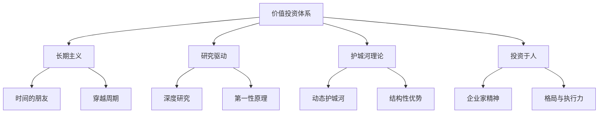

# 《价值》深度拆解

## 一、商业坐标定位（400字）

《价值：我对投资的思考》是高瓴资本创始人张磊于2020年出版的投资哲学著作。作为管理超过5000亿人民币资产的投资人，张磊在这本书中首次系统阐述了他的投资理念和方法论。

> [!abstract] 核心主题
> 本书的核心观点是：==投资的本质是对价值的发现和创造==。真正的投资不是零和博弈，而是通过资本配置帮助优秀企业成长，从而创造社会价值并分享增长红利。

张磊提出"长期主义"作为投资的核心理念，强调：
- **时间是好生意的朋友**：选择能够穿越周期的企业
- **研究驱动**：深入理解商业本质，而非追逐热点
- **与伟大格局观者同行**：投资于人，尤其是具有企业家精神的创始人

高瓴的投资案例横跨消费、医疗、科技等领域，包括腾讯、京东、百济神州、格力电器等，形成了独特的"中国式价值投资"实践。

在投资思想史上，本书融合了格雷厄姆的安全边际、巴菲特的护城河理论、芒格的多元思维模型，并结合中国市场特点进行了本土化创新。

---

## 二、商业逻辑地图（500字）

**核心框架：三个投资哲学支柱**

| 支柱 | 内涵 | 实践方式 |
|------|------|----------|
| 长期主义 | 用3年视角看问题，用10年视角做决策 | 忽略短期波动，关注长期价值创造 |
| 研究驱动 | 投资是认知的变现 | 深入行业研究，建立知识体系 |
| 与伟大格局观者同行 | 人是最重要的变量 | 投资于顶级企业家和团队 |

**高瓴的投资方法论**

| 维度 | 具体标准 |
|------|----------|
| 行业选择 | 长坡厚雪、结构性增长 |
| 企业选择 | 动态护城河、优秀管理层 |
| 时机选择 | 不择时，但择价 |
| 持有策略 | 长期持有，陪伴成长 |

---

## 三、逐章深度拆解（5000字）

### 主题1：「长期主义——时间的朋友」

**【第一性原理拆解】**

张磊将"长期主义"定义为高瓴的核心理念：

> [!tip] 长期主义的内涵
> 长期主义不是简单的"持有时间长"，而是一种思维方式：
> - 用长期视角评估价值
> - 愿意为长期利益牺牲短期收益
> - 相信复利的力量

**【DIKW四层提炼】**

| 层级 | 内容 |
|------|------|
| Data | 高瓴持有腾讯超过15年 |
| Information | 长期持有让高瓴分享了腾讯的完整成长 |
| Knowledge | 好公司的价值会随时间复利增长 |
| Wisdom | ==做时间的朋友，让时间成为价值创造的盟友== |

**【案例审查】**

高瓴投资京东的案例：
- 2010年投资京东3亿美元（当时最大单笔投资）
- 很多人认为京东亏损太多，质疑这笔投资
- 张磊的判断：京东的物流建设是长期护城河
- 结果：京东市值增长数十倍，物流成为核心竞争力

**【反脆弱压力测试】**

长期主义的局限：
- **需要资金性质匹配**：短期资金无法践行长期主义
- **判断错误代价高**：长期持有错误标的损失更大
- **机会成本**：可能错过其他机会

---

### 主题2：「研究驱动——投资是认知的变现」

**【第一性原理拆解】**

张磊强调：==投资回报是认知能力的副产品==。

研究的目的不是预测股价，而是：
1. 理解行业的本质规律
2. 判断企业的核心竞争力
3. 评估管理层的能力和诚信
4. 形成独立的投资判断

**【心智模型分析】**

高瓴的研究方法：

| 维度 | 研究问题 |
|------|----------|
| 行业 | 这个行业的终局是什么？谁会赢？ |
| 商业模式 | 公司如何创造价值？如何捕获价值？ |
| 护城河 | 竞争优势是什么？可持续吗？ |
| 管理层 | 创始人的格局和执行力如何？ |
| 估值 | 当前价格是否提供安全边际？ |

**【案例审查】**

高瓴投资百济神州的案例：
- 深入研究生物医药行业的发展趋势
- 理解创新药研发的长周期特性
- 判断中国医药创新的结构性机会
- 在公司早期就重仓投资，陪伴多年

> [!note] 研究的深度决定投资的高度
> 张磊说："我们在投资一家公司之前，通常会花几个月甚至几年时间研究这个行业。"

---

### 主题3：「动态护城河——超越巴菲特的静态护城河」

**【第一性原理拆解】**

张磊对巴菲特的"护城河"概念进行了发展：

> [!abstract] 动态护城河
> 传统护城河强调静态的结构性优势（品牌、专利、规模）。但在快速变化的时代，==真正的护城河是持续创新和进化的能力==。

**【DIKW四层提炼】**

| 层级 | 内容 |
|------|------|
| Data | 柯达拥有品牌和专利，但被数码相机颠覆 |
| Information | 静态护城河在技术变革面前可能失效 |
| Knowledge | 护城河需要动态维护和升级 |
| Wisdom | ==最深的护城河是企业的学习能力和进化能力== |

**【案例审查】**

| 企业 | 静态护城河 | 动态护城河 |
|------|------------|------------|
| 腾讯 | 用户规模、社交关系链 | 持续的产品创新、生态扩展 |
| 美团 | 商户网络、配送团队 | 算法优化、品类扩展 |
| 格力 | 品牌、渠道 | 需要向智能制造转型 |

**【苏格拉底追问】**

- Q：如何判断一个护城河是动态的？
- A：看企业是否在持续投资于未来，而非躺在现有优势上

- Q：动态护城河会不会太难判断？
- A：确实更难，所以更依赖对管理层的判断

---

### 主题4：「投资于人——寻找伟大格局观者」

**【第一性原理拆解】**

张磊反复强调：==投资的核心是投资于人==。

> [!tip] 什么是"伟大格局观"
> - 对行业和社会有深刻理解
> - 有长期愿景而非短期投机心态
> - 有强大的执行力将愿景变为现实
> - 有正确的价值观和商业伦理

**【案例审查】**

张磊投资刘强东的判断：
- 刘强东坚持自建物流，即使短期亏损
- 这显示了长期主义的思维方式
- 张磊认为这样的企业家值得长期陪伴

张磊不投资的类型：
- 只想赚快钱的企业家
- 对员工和合作伙伴缺乏诚信的人
- 没有长期愿景只做短期套利的人

**【心智模型分析——企业家评估框架】**

| 维度 | 正面特征 | 负面信号 |
|------|----------|----------|
| 格局 | 思考行业终局 | 只关注眼前利益 |
| 学习力 | 持续进化 | 固步自封 |
| 执行力 | 说到做到 | 只画大饼 |
| 价值观 | 为用户创造价值 | 只想着套利 |

---

### 主题5：「选择比努力重要——行业选择的逻辑」

**【第一性原理拆解】**

张磊强调"长坡厚雪"的行业选择标准：

> [!abstract] 长坡厚雪
> - **长坡**：行业有足够长的成长空间
> - **厚雪**：企业能够持续积累竞争优势

**【DIKW四层提炼】**

| 层级 | 内容 |
|------|------|
| Data | 消费、医疗、科技是高瓴重仓的三大领域 |
| Information | 这些行业有结构性增长机会 |
| Knowledge | 选择正确的行业比选择正确的公司更重要 |
| Wisdom | ==在鱼多的地方钓鱼== |

**【案例审查】**

高瓴的行业布局逻辑：

| 行业 | 长坡逻辑 | 厚雪逻辑 |
|------|----------|----------|
| 消费 | 中国消费升级、品牌化 | 品牌忠诚度、渠道壁垒 |
| 医疗 | 老龄化、医保改革 | 研发壁垒、监管壁垒 |
| 科技 | 数字化转型 | 网络效应、规模效应 |

---

### 主题6：「创造价值——投资不是零和游戏」

**【第一性原理拆解】**

张磊区分了两种投资思维：

| 思维方式 | 零和博弈 | 价值创造 |
|----------|----------|----------|
| 关注点 | 如何从他人手中赢钱 | 如何帮助企业成长 |
| 时间视角 | 短期 | 长期 |
| 与企业关系 | 对立 | 合作 |
| 社会价值 | 无/负 | 正向 |

**【DIKW四层提炼】**

| 层级 | 内容 |
|------|------|
| Data | 高瓴经常帮助被投企业对接资源 |
| Information | 投资人可以为企业创造价值，而非只是提供资金 |
| Knowledge | 价值投资的核心是与企业一起创造价值 |
| Wisdom | ==投资回报是帮助企业成功的副产品== |

**【案例审查】**

高瓴投资格力的案例：
- 不只是财务投资，而是帮助格力进行混改
- 引入数字化能力，帮助传统制造企业升级
- 目标是把格力打造成"新格力"

---

### 主题7：「投资人的自我修养」

**【第一性原理拆解】**

张磊对投资人提出了三个自我修养要求：

> [!tip] 三个修养
> 1. **诚实面对自己**：承认无知，承认错误
> 2. **独立思考**：不随波逐流，有自己的判断
> 3. **持续学习**：保持好奇心，不断拓展能力圈

**【案例审查】**

张磊的学习方法：
- 大量阅读（不只是商业书籍）
- 与不同行业的人交流
- 实地调研，"用脚做研究"
- 复盘投资决策，从错误中学习

**【苏格拉底追问】**

- Q：怎么判断自己是独立思考还是固执己见？
- A：独立思考建立在深入研究基础上，固执己见没有

- Q：如何扩展能力圈？
- A：承认边界，然后通过学习逐步拓展

---

### 主题8：「周期与反周期——穿越牛熊」

**【第一性原理拆解】**

张磊对市场周期的态度：

> [!abstract] 不择时，但择价
> - 不试图预测市场短期走势
> - 但在价格大幅低于价值时加仓
> - 在极度泡沫时保持谨慎

**【DIKW四层提炼】**

| 层级 | 内容 |
|------|------|
| Data | 2008年金融危机时高瓴逆势加仓 |
| Information | 市场恐慌时往往是好的买入时机 |
| Knowledge | 周期是价值投资者的朋友 |
| Wisdom | ==别人贪婪时恐惧，别人恐惧时贪婪== |

**【反脆弱压力测试】**

逆周期投资的风险：
- **抄底抄在半山腰**：市场可能继续下跌
- **资金管理**：需要有足够的现金储备
- **心理压力**：逆势投资需要强大的心理素质

---

## 四、核心决策框架提炼（800字）

### 框架1：高瓴投资检查清单

> [!abstract] 七问检验法
> 1. 这个行业有没有长期结构性增长机会？
> 2. 企业的护城河是什么？是否可持续？
> 3. 管理层是否具有长期主义思维？
> 4. 商业模式是否创造真正的用户价值？
> 5. 当前价格是否提供足够的安全边际？
> 6. 我们能为企业创造什么价值？
> 7. 如果持有10年，结果会怎样？

### 框架2：企业家评估模型

| 维度 | 评估要点 | 权重 |
|------|----------|------|
| 格局 | 是否思考行业终局和社会价值 | 25% |
| 学习力 | 是否持续进化、承认错误 | 25% |
| 执行力 | 是否能将愿景转化为现实 | 25% |
| 价值观 | 是否诚信、是否真正为用户创造价值 | 25% |

### 框架3：行业选择矩阵

| | 短坡 | 长坡 |
|---|------|------|
| **厚雪** | 谨慎投资 | 重点配置 |
| **薄雪** | 回避 | 选择龙头 |

---

## 五、幸存者偏差审查（600字）

### 局限1：时代红利

高瓴的成功很大程度上受益于：
- 中国经济高速增长
- 移动互联网红利
- 消费升级大趋势

> [!warning] 反思
> 在经济增速放缓的时代，同样的策略是否依然有效？

### 局限2：规模优势

高瓴作为超大型机构投资者：
- 可以获得普通投资者无法获得的信息
- 可以影响被投企业的战略
- 可以承受普通人无法承受的波动

### 局限3：选择性呈现

书中主要呈现成功案例，对失败案例着墨较少：
- 高瓴也有投资失败的案例
- 失败的教训可能更有价值

### 客观评价

尽管有这些局限，张磊的核心理念——长期主义、研究驱动、投资于人——对普通投资者依然有重要参考价值。关键是根据自己的实际情况进行调整。

---

## 六、时效性评估（500字）

### 仍然有效的原则

| 原则 | 验证 |
|------|------|
| 长期主义 | 短期交易者的平均收益低于长期持有者 |
| 研究驱动 | 深度研究是获得超额收益的基础 |
| 投资于人 | 管理层质量与企业长期表现高度相关 |

### 需要调整的应用

| 原则 | 调整建议 |
|------|----------|
| 中国消费升级 | 需关注消费分级、下沉市场 |
| 科技投资 | 需考虑地缘政治风险 |
| 医疗投资 | 需关注集采政策影响 |

---

## 七、类比迁移实战指南（500字）

### 迁移场景1：个人职业发展

| 书中原则 | 个人应用 |
|----------|----------|
| 长期主义 | 选择能长期积累的职业，而非短期高薪 |
| 研究驱动 | 深入理解行业，成为专家 |
| 动态护城河 | 持续学习，更新技能 |

### 迁移场景2：个人投资

| 书中原则 | 应用建议 |
|----------|----------|
| 长坡厚雪 | 选择长期增长的行业ETF |
| 不择时但择价 | 定投+熊市加仓 |
| 投资于人 | 研究公司管理层 |

---

## 八、费曼终极检验（400字）

**如果用一句话向朋友解释这本书的核心观点：**

> 投资的本质不是预测市场，而是发现并陪伴伟大企业的成长——用长期主义的心态、研究驱动的方法、与优秀的人同行。

**三个能立即应用的行动：**

1. **延长投资视角**：下次买股票时，问自己"如果持有10年，这家公司会怎样？"

2. **深度研究一个行业**：选择一个你感兴趣的行业，花3个月时间深入研究，建立自己的认知框架

3. **评估管理层**：在投资前，花时间了解公司创始人/CEO的背景、言行和决策历史

**这本书改变了什么认知：**

从"投资是预测股价"转向"投资是发现价值创造"。投资不是零和游戏，而是与优秀企业一起成长。

---

## 延伸阅读路线图

| 书籍 | 关联 |
|------|------|
| [[《穷查理宝典》]] | 芒格的多元思维模型 |
| [[《投资最重要的事》]] | 霍华德·马克斯的风险思考 |
| [[《巴菲特致股东的信》]] | 价值投资的源头 |
| [[《原则》]] | 达利欧的投资与人生原则 |
