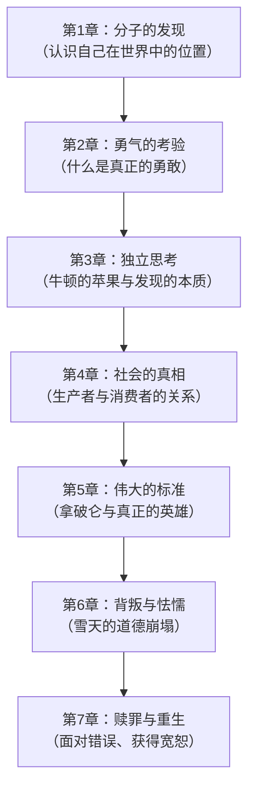
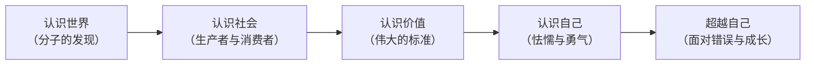

# 《你想活出怎样的人生》深度拆解

## 一、元信息速览

《你想活出怎样的人生》（*君たちはどう生きるか*）由日本作家、编辑吉野源三郎于1937年出版，是一部以少年成长为载体的哲学小说。主人公是15岁的"小哥白尼"（本田润一），他在舅舅的引导下，经历一系列日常事件，逐步思考人生中的重大命题：==个体与社会的关系、贫富差距的本质、勇气与怯懦的边界、真正的伟大意味着什么、生产者与消费者的道德位置==。

全书采用**双线叙事**——小哥白尼的亲身经历与舅舅的笔记本交替推进。舅舅不是直接给出答案，而是通过苏格拉底式的引导，让小哥白尼（也让你）自己去思考、去感受、去得出结论。这本书在日本被视为"每个年轻人都应该读的一本书"，宫崎骏同名电影亦受其启发。

本书的核心追问可以用一句话概括：==当你站在自己的人生中，你究竟要选择做一个什么样的人？==

## 二、全书逻辑地图

全书七个核心主题构成一条递进的成长线索：

**核心命题**：这七个主题从"认识世界"出发，经过"认识社会"和"认识伟大"，最终抵达"认识自己"——特别是在你最软弱、最想逃避的时刻，你做出的选择定义了你是谁。==全书的终极问题不是"世界是怎样的"，而是"你想成为怎样的人"==。

**黄金圈分析**：
- **Why**（为什么写这本书）：在1937年日本军国主义抬头的背景下，吉野源三郎希望通过一个少年的成长故事，传递独立思考、道德勇气与人道主义的价值
- **How**（如何传递）：通过小哥白尼的真实经历 + 舅舅的哲学笔记，以苏格拉底式对话引导读者自主思考
- **What**（具体内容）：七个成长事件，涵盖认识论、社会学、伦理学、勇气与宽恕

## 三、逐章深度拆解

### 第1章：「奇妙的经历——你是世界的一个分子」

> [!tip] 认识论的起点：从"自我中心"到"世界中心"

**【核心论点】**

小哥白尼在银座百货大楼的屋顶俯瞰城市，看到无数行人如蚂蚁般移动，突然产生了一个深刻的领悟：==每一个微小的人都在过着自己的生活，而自己也不过是这无数人中的一个"分子"==。舅舅在笔记本中将这种领悟命名为"分子的发现"。

**【详细拆解】**

这一章处理的是人生哲学中最基础的问题：**你在这个世界中处于什么位置？**

小哥白尼的日常经验和大多数人一样——世界以"我"为中心运转。你饿了，世界就是关于食物的；你考试了，世界就是关于分数的。但当他站在高处俯瞰时，视角发生了根本性的转换：你看到了"整体"，而你自己只是整体中的一个微小部分。

舅舅在笔记中进一步引导：哥白尼发现地球不是宇宙的中心，同样，==你也不是世界的中心==。这不是一种贬低，而是一种解放——当你停止把自己当作世界的中心，你才能真正开始理解世界。舅舅指出，大多数人终其一生都停留在"天动说"的阶段，以自己为中心来解读一切；而真正成熟的思考始于"地动说"——认识到自己是广大世界中的一个参与者，而非主宰者。

这是一种认识论上的"哥白尼革命"——从自我中心到去中心化。舅舅强调，能够意识到自己只是"分子"的人，反而获得了一种更深层的力量：你开始能够客观地看待事物，不再被自己的欲望和情绪完全左右。

**【费曼式解读】**

想象你在一架飞机上往下看一座城市。你看到密密麻麻的街道、无数的房屋、像蚂蚁一样移动的汽车。你知道每一辆车里都坐着一个人，那个人此刻正在担心自己的工作、自己的恋爱、自己孩子的成绩——每个人都觉得自己的问题是全世界最重要的事。但从飞机上看，他们都只是巨大城市里的一个小点。小哥白尼的"分子发现"就是这个意思：你不是不重要，但你也不是世界的中心。一旦你接受了这一点，你反而能看到更多。

**【金句/关键概念】**

> ==人应当像哥白尼一样，从以自己为中心的观点中解放出来，认识到自己不过是广袤世界中的一个分子。==

---

### 第2章：「勇敢的朋友——勇气不是不害怕」

> [!warning] 勇气的本质在于"明知害怕依然行动"

**【核心论点】**

小哥白尼的同学北见君面对高年级学生的霸凌，挺身而出进行反抗。这一事件让小哥白尼第一次思考：==什么是真正的勇敢？勇敢是不害怕，还是害怕了依然去做？==

**【详细拆解】**

北见君的故事揭示了勇气的核心悖论：如果一个人天生不知道恐惧，他的行为不能被称为"勇敢"，那只是"无知"。真正的勇敢是**在充分意识到危险和恐惧的情况下，依然选择做正确的事**。

舅舅在笔记中引导小哥白尼思考更深一层：北见君为什么能做到这一点？不是因为他比别人强壮（事实上他在体力上处于劣势），而是因为他内心有一个比恐惧更强大的东西——==对不正义的愤怒，以及对朋友的忠诚==。换句话说，勇气的来源不是力量的大小，而是你心中"什么比恐惧更重要"。

舅舅进一步追问：如果你目睹了北见君的行为，你会怎么做？你会加入他吗？这个问题在第2章只是一个种子，它将在第6章（雪天的事件）中以极其残酷的方式得到回答。

**【费曼式解读】**

消防员冲进着火的房子救人——他害怕吗？当然害怕。但他依然冲进去了。如果一个人完全感受不到恐惧就冲进去，那不是勇敢，那是不知道火会烧死人。勇敢的定义不是"没有恐惧"，而是"恐惧在左，正确的事在右，你选择了右边"。北见君面对比自己高大的霸凌者时，双腿可能在发抖，但他还是站了出来——这才是勇气。

**【金句/关键概念】**

> ==勇敢不是不感到恐惧，而是在恐惧面前依然选择行动。==

---

### 第3章：「牛顿的苹果——发现的本质是什么」

> [!note] 独立思考的第一课：看到所有人都看到的东西，想到别人没想到的事

**【核心论点】**

舅舅借牛顿与苹果的故事，引导小哥白尼理解：==真正的发现不在于看到新事物，而在于对所有人都看到的普通事物产生新的思考==。

**【详细拆解】**

苹果从树上掉下来，这件事在牛顿之前已经发生了无数次，无数人都看到过。但只有牛顿追问了一个看似幼稚的问题：为什么苹果向下掉而不是向上飞？舅舅指出，大多数人之所以无法做出发现，不是因为他们不聪明，而是因为他们把"习以为常"等同于"已经理解"。

这里有一个关键的认识论区分：**"知道"和"理解"是两回事**。你"知道"苹果会掉下来，但你不一定"理解"它为什么掉下来。大多数人一辈子都停留在"知道"的层面，从不追问"为什么"。舅舅鼓励小哥白尼保持这种追问的习惯——不要因为一件事"大家都这么认为"就停止思考。

舅舅还强调了另一个要点：==小哥白尼自己在银座屋顶产生的"分子"感悟，本质上和牛顿看到苹果是一回事==——你亲身体验了某种东西，然后对它进行了独立思考，得出了自己的结论。这种"从自己的体验中发现真理"的能力，比任何书本知识都重要。

**【费曼式解读】**

你每天都在用手机，你"知道"触屏一按就会响应。但你"理解"它为什么能响应吗？（电容触控、信号处理、操作系统调度……）大多数人对日常生活中99%的事物都停留在"知道"而非"理解"。牛顿的伟大不在于他看到了苹果——每个果农都看到了——而在于他是唯一一个不满足于"知道苹果会掉"的人，他非要"理解"为什么。你对世界保持多少"为什么"的追问，决定了你能理解多少。

**【金句/关键概念】**

> ==真正重要的不是别人教给你的知识，而是你自己从亲身体验中发现的真理。==

---

### 第4章：「贫穷的朋友——你是生产者还是消费者」

> [!abstract] 社会的真实结构：谁在劳动，谁在享用

**【核心论点】**

小哥白尼的同学浦川家里开豆腐店，家境贫寒。小哥白尼去浦川家做客，第一次看到了劳动生产的现场，由此引发了关于==生产者与消费者、劳动的尊严、社会不平等==的深层思考。

**【详细拆解】**

这一章是全书社会批判意识最强的部分。舅舅在笔记中引导小哥白尼思考一个核心问题：**你每天吃的饭、穿的衣服、用的东西，都是谁生产的？**

小哥白尼来自中产家庭，他从小习惯了"消费"——食物出现在餐桌上，衣服挂在衣柜里。他从未真正想过这些东西是怎么来的。但当他走进浦川的豆腐店，看到浦川的父母凌晨三四点就起来磨豆子、做豆腐，然后一整天站在店里卖，他受到了巨大的冲击。

舅舅进一步展开：这个世界上的人大致可以分为两种——==生产者和消费者==。生产者用自己的劳动创造出实际的物品和价值；消费者则享用这些物品。问题在于，在现实社会中，往往是劳动最辛苦的生产者获得最少的回报，而并不直接参与生产的人却享有最多的资源。

舅舅没有用激烈的阶级斗争语言，而是平静地引导小哥白尼思考：你现在是一个"消费者"，你享受着无数生产者的劳动成果。那么，你将来打算做一个什么样的人？你打算只是消费，还是也为这个世界生产一些有价值的东西？

这个追问的深层含义是：==你对这个社会的贡献方式，定义了你的人生价值==。

**【费曼式解读】**

你每天早上喝的那杯咖啡：有人在哥伦比亚的山坡上种咖啡豆，有人采摘、有人运输、有人烘焙、有人研磨、有人冲泡——你只需要付几块钱就能喝到。但你有没有想过，在这条长长的链条上，最辛苦的那个种植咖啡豆的农民得到了多少？小哥白尼在浦川的豆腐店里看到的，就是这条链条最开头的那个环节——那些凌晨就起来劳动的人。舅舅的追问是：你打算一辈子站在链条的末端喝咖啡，还是也在某个环节上创造一些有价值的东西？

**【金句/关键概念】**

> ==如果你一辈子只是在消费别人的劳动成果，却从未为这个世界创造过什么，你就还没有真正活过。==

---

### 第5章：「拿破仑与英雄——什么是真正的伟大」

> [!tip] 伟大的标准不是权力的大小，而是对人类福祉的贡献

**【核心论点】**

舅舅引导小哥白尼思考拿破仑的故事：拿破仑曾经是革命的英雄，但后来为了个人权力发动无数战争，导致无数人死亡。==一个人的伟大，应该用什么标准来衡量？==

**【详细拆解】**

这一章是全书价值观最鲜明的部分。舅舅提出了一个核心区分：**权力的大小不等于伟大的程度**。

拿破仑无疑是一个拥有巨大权力的人——他征服了半个欧洲，改变了历史的走向。但舅舅追问：一个用自己的权力导致了几十万人死亡的人，能被称为"伟大"吗？舅舅并没有简单地否定拿破仑——他承认拿破仑在法国大革命初期传播自由、平等、法治的理念，确实有其历史贡献。但当拿破仑从"为理念而战"转变为"为权力而战"时，他的伟大就开始瓦解了。

舅舅提出了自己的标准：==真正的伟大在于一个人是否推动了人类整体的进步和福祉==。一个默默无闻的科学家，如果发现了能治愈疾病的方法，他的伟大可能远超一个征服了大半个世界的将军。一个普通的教师，如果影响了几代学生的思想，他的伟大也不亚于任何政治家。

这里隐含着一个更深的追问：==你对"伟大"的定义，决定了你追求什么样的人生==。如果你认为伟大等于权力，你就会追求控制别人；如果你认为伟大等于对他人的贡献，你就会追求创造价值。

**【费曼式解读】**

想象两个人。一个是企业CEO，管理着一万名员工，年薪千万，照片上过杂志封面。另一个是乡村医生，一辈子在偏远山村看病，没人知道他的名字。哪个更"伟大"？如果你的标准是权力和名气，答案是CEO。但如果你的标准是"对具体的人产生了多少真实的帮助"，答案可能是那个乡村医生。舅舅让小哥白尼思考的是：你用什么标准来定义"伟大"，这个标准将决定你一辈子追求什么。

**【金句/关键概念】**

> ==真正的伟大不在于你拥有多少权力，而在于你是否用自己的力量推动了人类的福祉。==

---

### 第6章：「雪天的事件——你以为自己勇敢，直到考验到来」

> [!warning] 全书的高潮与转折：理想与行动之间的鸿沟

**【核心论点】**

在一个下雪天，小哥白尼的朋友们因为之前的约定（要一起抵抗高年级的霸凌）遭到了攻击。==小哥白尼在关键时刻却因为恐惧而退缩了，没有站出来帮助朋友，实质上背叛了自己的承诺。==

**【详细拆解】**

这是全书最具戏剧性、也最令人痛苦的章节。它的力量在于，前面五章积累的所有思考——勇气、正义、伟大——在这一刻全部接受了残酷的检验。

事情的经过是这样的：小哥白尼和朋友们约定，如果高年级学生再来欺负他们，大家要团结起来一起反抗。这个约定很容易许下——在安全的环境里谈论勇气是不费力气的。但当那一天真的到来，当高年级学生真的出现，当朋友们真的遭到攻击时，小哥白尼却被恐惧淹没了。他的双腿无法移动，他的嘴巴无法说话。他眼睁睁地看着朋友们在雪地里被推搡、被殴打，而自己像是被钉在原地。

事后，小哥白尼陷入了巨大的痛苦和自我厌恶中。他不是不知道应该怎么做——他非常清楚应该站出来。他也不是一个坏人——他真心爱他的朋友们。但在那个关键时刻，==他的身体和他的意志分裂了，恐惧战胜了一切理念和承诺==。

舅舅在笔记中没有安慰小哥白尼"你做得对"或"这不是你的错"。相反，舅舅平静而诚恳地承认：**你确实做错了。你背叛了你的朋友和你自己的承诺。**但舅舅接着说了更重要的话：==重要的不是你跌倒了，而是你跌倒之后做了什么==。

这一章揭示了一个关于人性的残酷真相：**知道正确的事和做正确的事之间，存在着一条巨大的鸿沟**。你可以在思想上完全赞同勇气的价值，但当考验到来时，你的恐惧、你的软弱、你的自我保护本能可能比你的理念更强大。这不是因为你虚伪——而是因为你是人。

**【费曼式解读】**

你站在游泳池的十米跳台上。在地面上你对朋友说"十米跳台有什么难的，我肯定能跳"。但当你真的站在十米高的地方，往下看到那片水面，你的腿突然变软了，心跳加速，所有"一定能跳"的信念瞬间蒸发。小哥白尼在雪天经历的就是这个：==在安全的地方谈论勇气很容易，但真正的考验只发生在恐惧降临的那一刻==。他没有跳下去——他退缩了。这让他痛苦万分，但这也是他成长的起点。

**【金句/关键概念】**

> ==人最痛苦的不是遭遇苦难，而是在关键时刻发现自己不是自己以为的那种人。==

---

### 第7章：「石阶上的回忆——面对错误与获得宽恕」

> [!note] 全书的终章：跌倒之后如何站起来

**【核心论点】**

在舅舅的引导下，小哥白尼最终鼓起勇气向朋友们承认了自己的怯懦，写了一封诚恳的道歉信。朋友们原谅了他。==全书以"面对自己的错误"和"在错误中成长"作为终极答案。==

**【详细拆解】**

雪天事件之后，小哥白尼陷入了长久的自我折磨。他不敢面对朋友，不敢去上学，整夜失眠，反复回想那个自己退缩的瞬间。他感到自己不配做朋友们的朋友，觉得自己是一个懦夫。

舅舅在这个时刻展现了全书最深刻的智慧。他没有说"你要坚强"，也没有说"忘记它吧"。他引导小哥白尼理解几个层次的道理：

**第一层：你的痛苦本身就证明你不是坏人。**如果你对自己的背叛毫无感觉，那才是真正可怕的。你之所以痛苦，是因为你内心深处知道什么是对的。==你的良心在疼——这是一个好信号，不是坏信号。==

**第二层：逃避错误比犯错本身更糟糕。**你已经在那个雪天犯了错。但如果你现在选择逃避——假装没事、不去道歉、不去面对——那才是真正的怯懦。第一次的退缩可以被理解（恐惧是人的本能），但==面对错误时的再次退缩就不再是本能，而是选择==。

**第三层：真正的勇气不是从不犯错，而是犯错之后敢于面对。**舅舅告诉小哥白尼，人生中你一定还会遇到类似的考验。也许下一次你依然会害怕，依然会犹豫。但==经历过这次痛苦之后，你对自己有了更诚实的认识，你知道了自己的软弱——这种知道本身就是一种力量==。

小哥白尼最终给朋友们写了一封信，坦诚地承认了自己的怯懦和背叛。朋友们在石阶上和他重逢，原谅了他。这个原谅不是廉价的——它建立在小哥白尼真诚面对自己错误的基础之上。

舅舅在最后的笔记中写道：这不是故事的结束。你将来还会面对无数的选择。但从今天起，你可以带着对自己更诚实的认识走下去。==你想活出怎样的人生——这个问题的答案不在于你是否完美，而在于你在犯错之后如何选择。==

**【费曼式解读】**

一个学徒工匠做了一件家具，中途刨歪了一刀，木板上留下了一道明显的瑕疵。他有两个选择：一是用木屑把瑕疵糊住假装没事（看起来还行，但他自己知道那里有个缺陷）；二是把这块板子展示给师傅看，承认"我刨歪了"，然后学习怎么修正或者重来。第一种选择更轻松，但他永远学不到东西，而且那件家具永远有一个隐藏的缺陷。第二种选择很痛苦（要承认自己不行），但他能真正成长。小哥白尼在第7章做的就是第二种选择——他把自己的"瑕疵"展示给朋友们看，并且从中学到了关于自己最重要的一课。

**【金句/关键概念】**

> ==你想活出怎样的人生？这个问题的答案不在于你从不失败，而在于每一次失败之后你是否有勇气面对自己。==

---

## 四、核心框架提炼

> [!abstract] 概念网络：全书的深层结构

通过黄金圈 + 概念网络 + 苏格拉底追问三重方法论，可以提炼出全书的核心框架：

**框架一：认知的四次跃迁**

| 阶段 | 核心转变 | 对应章节 |
|------|---------|---------|
| 认识世界 | 从自我中心到去中心化 | 第1章 |
| 认识他人 | 从旁观者到共情者 | 第2、4章 |
| 认识价值 | 从世俗标准到内在标准 | 第3、5章 |
| 认识自己 | 从自我想象到自我诚实 | 第6、7章 |

**框架二：苏格拉底追问链**

全书的七个章节可以串联成一条追问链：
1. 你在这个世界中是什么？（分子）→ 2. 面对不义你会怎么做？（勇气）→ 3. 你是在重复别人的想法还是独立思考？（发现）→ 4. 你是在消费还是在创造？（生产者）→ 5. 你追求的"伟大"是什么？（标准）→ 6. 当考验来临你真的能做到吗？（检验）→ 7. 做不到之后你怎么办？（面对）

==最终答案：你想活出怎样的人生，取决于你在每一个"做不到"的时刻之后做出的选择。==

**框架三：舅舅的教育哲学**

舅舅的引导方式本身就是一种方法论：
- **从不直接给答案**——只提出问题，让小哥白尼自己思考
- **从不说教**——用故事、类比和追问来替代说教
- **从不回避痛苦**——当小哥白尼犯错时，不粉饰太平，而是引导他直面错误
- **始终保持尊重**——把15岁的少年当作一个有能力思考严肃问题的人来对待

这是一种==苏格拉底式的教育==：教育者不是知识的灌输者，而是思考的助产士。

## 五、批判性思考

> [!warning] 审视这本书的局限与盲区

**1. 时代背景的烙印**

这本书写于1937年——日本全面侵华的前一年。吉野源三郎在军国主义气氛笼罩下写出这样一本强调独立思考、人道主义和道德勇气的书，本身就是一种了不起的行为。但也正因为时代背景，书中对"社会不平等"的讨论停留在相对温和的层面，没有触及日本当时最严峻的政治问题（战争与军国主义）。这可能是审查环境下的无奈之举。

**2. 舅舅角色的理想化**

舅舅在书中几乎是一个完美的引导者——他永远冷静、永远智慧、永远在最正确的时机说最正确的话。现实中的教育者很少能做到这一点。这本书展示了一种理想化的教育关系，但并未讨论：==如果你的人生中没有这样一个舅舅，你要怎么办？==

**3. 阶级视角的局限**

小哥白尼来自中产家庭，他对浦川家贫困的"发现"带有一种居高临下的视角——虽然善意但不自觉。书中没有深入讨论浦川本人如何看待自己的处境，贫穷者的主体性在叙事中是缺失的。

**4. 性别视角的缺失**

全书的主要人物几乎全是男性（小哥白尼、舅舅、北见、浦川），女性角色极为边缘化。母亲只出现在关怀小哥白尼的场景中，没有独立的思想和行动。这是1937年日本文学的普遍局限，但在今天的语境下值得注意。

**5. "面对错误"的叙事过于乐观**

小哥白尼写了道歉信，朋友们就原谅了他——这个结局温暖但简化了现实。在真实的人际关系中，背叛造成的伤害可能需要很长时间才能修复，也可能永远无法完全修复。书中对"宽恕"的处理带有一定的理想主义色彩。

这些局限并不削弱这本书的核心价值——它依然是关于独立思考、道德勇气和自我诚实的杰出作品。但保持批判性阅读的习惯，本身就是这本书所倡导的精神。

## 六、行动清单

基于全书的核心思想，以下是可以转化为行动的五个实践：

1. **每日"分子"练习**：每周选一天在人群密集处（地铁站、商场）驻足五分钟，观察周围的人，提醒自己：每个人都有自己完整的生活、担忧和快乐。你不是世界的中心，你是其中的一个分子。这个练习帮助你保持谦逊和共情。

2. **"牛顿的苹果"笔记**：准备一个笔记本，每天记录一件你"习以为常但其实不理解"的事。比如：为什么红灯停绿灯行？谁规定的？为什么大家都遵守？坚持追问"为什么"，训练独立思考的肌肉。

3. **"生产者审计"**：每月回顾一次：这个月你消费了什么？更重要的是——你为这个世界创造了什么？写了什么？做了什么？帮助了谁？如果答案是"只消费没创造"，思考下个月如何改变。

4. **"雪天预演"**：在安全的环境中，预想你可能面对的道德困境——如果你看到有人被欺负，你会怎么做？如果你发现公司在做不道德的事，你会说出来吗？不要只在脑子里想，把你的答案写下来。写下来不能保证你一定做到，但它比"到时候再说"要好得多。

5. **"道歉练习"**：想一想，你的人生中是否有过"雪天时刻"——你退缩了、你沉默了、你背叛了某个承诺？如果那个人还在你的生活中，考虑写一封诚实的信。不需要华丽的措辞，只需要坦诚——"那一天我应该站出来但我没有，我为此感到抱歉。"

## 七、延伸阅读路线图

- [[《窗边的小豆豆》]]（黑柳彻子）：同样以儿童视角探讨教育与成长，小林校长的教育理念与舅舅的苏格拉底式引导形成呼应
- [[《银河铁道之夜》]]（宫�的贤治）：日本经典文学中关于友谊、牺牲与生命意义的另一种探索
- [[《小王子》]]（圣埃克苏佩里）：用寓言方式讨论"什么是真正重要的事"，与本书的核心追问高度共鸣
- [[《苏菲的世界》]]（乔斯坦·贾德）：同样以年轻人为主角、以对话为手段的哲学入门作品
- [[《论教育》]]（卢梭）：舅舅的教育方法深受卢梭自然教育理念的影响——尊重儿童的天性，引导而非灌输
- [[《理想国》]]（柏拉图）：苏格拉底追问法的源头，本书的舅舅在方法论上是苏格拉底的后继者

## 八、费曼终极检验

如果你需要在五分钟内向一个从未读过这本书的朋友解释它说了什么，你可以这样说：

一个15岁的日本男孩"小哥白尼"，在舅舅的引导下经历了一系列成长事件。他先是在屋顶上发现自己不过是世界的一个"分子"，学会了去中心化地看世界。然后他看到朋友勇敢地反抗霸凌，思考了什么是真正的勇气。他从牛顿的苹果故事中学到了独立思考的重要性。他走进穷朋友家的豆腐店，第一次意识到劳动者的存在和社会的不平等。他从拿破仑的故事中思考了什么才是真正的伟大。

然后，最关键的时刻来了。在一个下雪天，朋友们遭到欺负，他却因为恐惧而退缩了——他背叛了自己的朋友和自己的承诺。他痛苦万分。但在舅舅的引导下，他最终鼓起勇气面对了自己的错误，向朋友们道歉，并获得了原谅。

==这本书的终极信息是：你想活出怎样的人生？答案不在于你从不犯错、从不软弱。答案在于——当你跌倒之后，你是选择逃避，还是选择站起来面对？你对这个问题的回答，决定了你成为什么样的人。==
