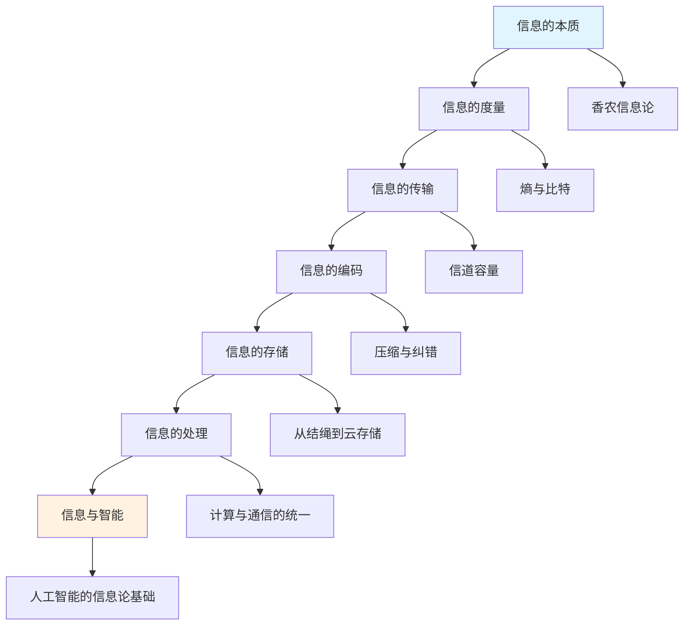
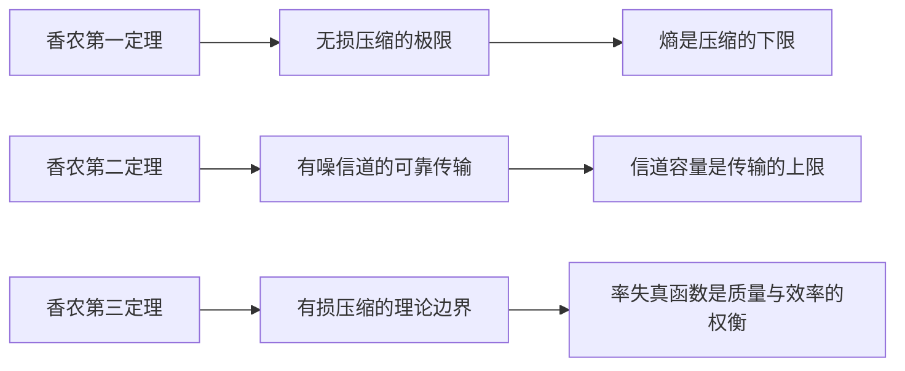
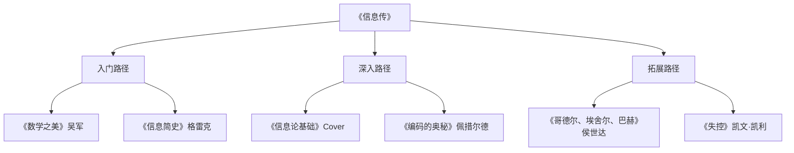

# 《信息传：决定我们未来发展的方法论》深度拆解

## 一、元信息/坐标定位

### 1.1 作者背景
吴军博士，前Google高级资深研究员，腾讯前副总裁，硅谷风险投资人。约翰·霍普金斯大学计算机科学博士，在自然语言处理、机器学习领域有深厚积累。他是跨界思考者的典型代表——既有一线技术研发经验，又具备商业投资眼光，更有科普写作的热情与能力。

### 1.2 写作脉络
本书是吴军"文明系列"的重要组成部分，与《数学之美》《浪潮之巅》《文明之光》形成互文。如果说《数学之美》聚焦于算法之美，本书则将视野拉升至==信息作为文明底层操作系统==的宏观层面。

### 1.3 核心定位
> [!abstract] 本书定位
> 这不仅是一部信息技术史，更是一部**信息哲学导论**。吴军试图回答：信息是什么？信息如何塑造人类文明？在信息时代，我们应该如何思考与行动？

### 1.4 阅读价值
- **对技术从业者**：建立信息论的完整认知框架
- **对决策者**：理解信息时代的底层逻辑
- **对普通读者**：获得一套理解世界的新透镜

**相关书籍**：[[《数学之美》]]、[[《浪潮之巅》]]、[[《信息简史》- 詹姆斯·格雷克]]

---

## 二、全书逻辑地图

> [!tip] 全书主线
> 吴军以==时间为经、概念为纬==，编织了一张信息文明的认知地图。从"信息是什么"的本体论追问开始，经过度量、传输、编码、存储、处理五大环节，最终抵达智能的彼岸。

**逻辑递进关系**：
1. **奠基层**：信息的本质与度量（解决"是什么"）
2. **技术层**：传输、编码、存储（解决"怎么做"）
3. **应用层**：处理与智能（解决"能做什么"）
4. **哲学层**：信息与文明的关系（解决"意味着什么"）

---

## 三、核心主题/逐章深度拆解

### 第一章：信息的本质——从混沌到秩序

#### 核心论点
> [!note] 核心观点
> 信息的本质是==消除不确定性==。在香农之前，"信息"只是日常用语；香农之后，"信息"成为可精确度量的物理量。

#### DIKW四层提炼

| 层次 | 内容 |
|------|------|
| **Data（数据）** | 香农1948年发表《通信的数学理论》，首次定义信息熵公式 H = -Σp(x)log₂p(x) |
| **Information（信息）** | 信息量与事件发生概率成反比——越意外的消息，信息量越大 |
| **Knowledge（知识）** | 信息论将"意义"与"传输"分离，使通信工程成为独立学科 |
| **Wisdom（智慧）** | 理解信息本质，就是理解不确定性管理——这是现代决策的基石 |

#### 费曼式解读

> [!tip] 如果我向10岁孩子解释
> 想象你在玩猜数字游戏。如果我说"这个数字在1到100之间"，你需要很多次才能猜中——这说明**不确定性很高**。每次你问"是否大于50"，我回答"是"或"否"，你就获得了**1比特信息**，不确定性减半。香农的天才在于：他发现所有信息都可以用"是/否"问题来衡量！

#### 关键概念深挖

**概念1：熵（Entropy）**
- 物理学中，熵是混乱程度的度量
- 信息论中，熵是不确定性的度量
- ==两者本质相通==：信息熵描述的是消息源的"可预测性"

**概念2：比特（Bit）**
- 1比特 = 一次二选一的信息量
- 这是信息的"原子单位"
- 香农选择二进制，因为它与布尔代数、电子开关完美匹配

**概念3：冗余（Redundancy）**
- 自然语言中存在大量冗余（英语约50%）
- 冗余是"低效"还是"保险"取决于场景
- ==冗余是可靠性的代价==

---

### 第二章：信息的度量——熵的力量

#### 核心论点
> [!note] 核心观点
> 熵不仅可以度量信息，还可以==预测系统行为==。理解熵，就是理解秩序与混乱的博弈。

#### DIKW四层提炼

| 层次 | 内容 |
|------|------|
| **Data** | 热力学第二定律：封闭系统的熵总是增加 |
| **Information** | 信息熵与热力学熵在数学形式上完全一致 |
| **Knowledge** | 生命是"负熵"的典型——通过消耗能量维持内部秩序 |
| **Wisdom** | 任何系统要保持活力，必须持续输入"负熵"（新信息、新能量） |

#### 费曼式解读

> [!tip] 房间与整理的比喻
> 你的房间不整理就会越来越乱——这就是熵增。你花时间整理房间——这是输入"负熵"。企业、个人、社会都是如此：==不主动输入秩序，就会被动走向混乱==。

#### 关键概念深挖

**概念：交叉熵与KL散度**
- 交叉熵衡量两个概率分布的差异
- 机器学习中的损失函数常用交叉熵
- ==模型训练本质上是最小化信息损失==

---

### 第三章：信息的传输——信道的边界

#### 核心论点
> [!note] 核心观点
> 任何信道都有容量极限，但香农证明：只要传输速率低于信道容量，就存在某种编码方式实现无差错传输。这是==信息论最惊人的结论==。

#### DIKW四层提炼

| 层次 | 内容 |
|------|------|
| **Data** | 香农信道容量公式：C = B log₂(1 + S/N) |
| **Information** | 带宽、信噪比共同决定信道极限 |
| **Knowledge** | 5G比4G快的根本原因：更宽带宽 + 更优编码 |
| **Wisdom** | 技术突破往往来自逼近理论极限的工程努力 |

#### 费曼式解读

> [!tip] 高速公路的比喻
> 信道像高速公路，带宽是车道数，信噪比是路况。车道再多，路况太差也跑不快。香农告诉我们：在给定车道和路况下，**存在一个理论最高车流量**，而且通过巧妙的交通管制（编码），可以无限接近这个极限！

#### 关键概念深挖

**概念：奈奎斯特采样定理**
- 采样频率必须≥信号最高频率的2倍
- CD音质44.1kHz采样，因为人耳极限约20kHz
- ==这是模拟与数字世界的桥梁==

---

### 第四章：信息的编码——压缩与纠错

#### 核心论点
> [!note] 核心观点
> 编码是信息论的核心技术。==无损压缩探索信息的理论极限，纠错编码对抗信道的物理缺陷==。

#### DIKW四层提炼

| 层次 | 内容 |
|------|------|
| **Data** | 哈夫曼编码、LZ系列算法、Reed-Solomon码 |
| **Information** | 压缩本质是消除冗余，纠错本质是添加冗余 |
| **Knowledge** | 看似矛盾的两个方向，服务于不同目标 |
| **Wisdom** | 效率与可靠性的权衡是所有工程的核心 |

#### 费曼式解读

> [!tip] 发电报的智慧
> 早期电报按字收费，人们用缩写省钱（压缩）。但缩写太多容易误解，所以重要信息要重复（纠错）。这就是压缩与纠错的日常版本！

#### 关键概念深挖

**概念1：霍夫曼编码**
- 高频字符用短码，低频字符用长码
- 这是==最优前缀码==
- ZIP、JPEG等格式的基础

**概念2：纠错码**
- ISBN校验码：最后一位可检测单个错误
- 二维码：大面积破损仍可识别
- ==冗余是可靠性的投资==

---

### 第五章：信息的存储——从石刻到云端

#### 核心论点
> [!note] 核心观点
> 存储技术的每次革命，都重新定义了人类文明的边界。==存储密度的增长比摩尔定律更快==。

#### DIKW四层提炼

| 层次 | 内容 |
|------|------|
| **Data** | 存储密度：纸张→磁带→硬盘→SSD→DNA存储，指数级增长 |
| **Information** | 存储成本下降驱动数据爆炸 |
| **Knowledge** | "云"本质是存储的去中心化与再中心化 |
| **Wisdom** | 存储越廉价，信息越有价值还是越没价值？ |

#### 费曼式解读

> [!tip] 图书馆的演变
> 古代图书馆是财富象征（亚历山大图书馆）。现在每个人口袋里的手机，存储容量超过古代所有图书馆总和。==存储民主化==改变了知识的权力结构。

---

### 第六章：信息的处理——计算的本质

#### 核心论点
> [!note] 核心观点
> 图灵机证明：==一切计算问题可以转化为符号操作==。计算机是信息处理的通用机器。

#### DIKW四层提炼

| 层次 | 内容 |
|------|------|
| **Data** | 图灵1936年提出图灵机概念 |
| **Information** | 图灵机是所有计算设备的抽象模型 |
| **Knowledge** | "程序"与"数据"本质上没有区别——都是信息 |
| **Wisdom** | 这解释了为什么AI可以学习：学习就是修改自身信息 |

#### 费曼式解读

> [!tip] 万能翻译官
> 图灵机就像一个万能翻译官：你给它任何语言的问题，它都能翻译成"移动、读写、跳转"三种基本操作。这说明==所有复杂问题都可以分解为简单操作的组合==。

---

### 第七章：信息与智能——通向AI之路

#### 核心论点
> [!note] 核心观点
> 人工智能的本质是==信息压缩与模式识别==。深度学习是对信息论思想的工程实现。

#### DIKW四层提炼

| 层次 | 内容 |
|------|------|
| **Data** | 神经网络通过反向传播调整权重 |
| **Information** | 模型训练是最小化预测分布与真实分布的交叉熵 |
| **Knowledge** | 大模型的"涌现"是统计规律的质变 |
| **Wisdom** | 智能可能就是对宇宙信息的高效压缩 |

#### 费曼式解读

> [!tip] 婴儿学语言
> 婴儿听大量语言后自动"压缩"出语法规则——这就是无监督学习。大语言模型做的事情类似：从海量文本中压缩出"语言的统计结构"。==智能 = 压缩==？

---

## 四、核心框架提炼

### 4.1 信息论的三大定理

### 4.2 信息时代的四大法则

> [!abstract] 核心框架
> 1. **熵增法则**：封闭系统趋向混乱，开放学习是对抗熵增的唯一方式
> 2. **带宽法则**：任何系统都有信息吞吐极限，识别瓶颈比提升单点更重要
> 3. **编码法则**：同样的信息，不同编码效率天差地别——表达方式决定传播效果
> 4. **冗余法则**：适度冗余是可靠性保障，过度冗余是资源浪费

### 4.3 吴军的方法论总结

| 维度 | 传统思维 | 信息论思维 |
|------|----------|------------|
| 看问题 | 关注现象 | ==关注信息流== |
| 做决策 | 追求确定性 | 管理不确定性 |
| 建系统 | 追求完美 | 追求鲁棒 |
| 学习 | 积累知识点 | 压缩知识结构 |

---

## 五、批判性思考

### 5.1 优势与贡献

> [!tip] 本书的独特价值
> 1. **跨学科整合**：将物理学、数学、工程学、哲学融为一体
> 2. **历史纵深感**：从结绳记事到量子通信，时间跨度惊人
> 3. **方法论自觉**：不仅讲"是什么"，更讲"如何思考"

### 5.2 局限与不足

> [!warning] 批判性审视
> 1. **技术乐观主义**：对信息技术的负面效应（隐私、垄断、注意力碎片化）着墨不多
> 2. **香农中心主义**：对其他信息论流派（如语义信息论）讨论有限
> 3. **还原论倾向**：将智能还原为信息压缩，可能过于简化

### 5.3 与其他思想的对话

| 观点 | 吴军立场 | 对立观点 |
|------|----------|----------|
| 智能本质 | 信息压缩 | 具身认知：智能需要身体 |
| 信息价值 | 消除不确定性 | 语义信息论：意义更重要 |
| 技术走向 | 持续进步 | 技术批判派：警惕异化 |

---

## 六、行动清单

### 6.1 认知升级
- [ ] 用"信息熵"思维重新审视日常决策：哪些选择真正降低了不确定性？
- [ ] 识别自己知识体系中的"冗余"与"噪音"
- [ ] 练习"压缩表达"：能否用更少的话传达同样的信息？

### 6.2 技能提升
- [ ] 学习基础信息论数学（推荐《信息论基础》Cover & Thomas）
- [ ] 了解一种压缩算法的原理（如LZ77）
- [ ] 理解机器学习中交叉熵损失函数的含义

### 6.3 思维习惯
- [ ] 遇到复杂问题，先问：==信息流是什么？瓶颈在哪里？==
- [ ] 定期输入"负熵"：阅读、交流、实践
- [ ] 用"编码优化"思维改进沟通：同样的意思，怎样表达更高效？

---

## 七、延伸阅读路线图

**推荐顺序**：
1. [[《数学之美》]] → 吴军的算法美学入门
2. [[《信息简史》]] → 更宏观的信息史视角
3. [[《编码的奥秘》]] → 从零理解计算机原理
4. [[《哥德尔、埃舍尔、巴赫》]] → 形式系统与心智的深度探索

---

## 八、费曼终极检验

> [!abstract] 用一段话向外行解释本书核心
>
> 香农发现了一个惊人的事实：**所有信息都可以用"是/否"来衡量**。一条消息的信息量，取决于它有多"意外"——越意外，信息量越大。这个发现催生了整个数字时代：手机、互联网、AI，都建立在这个洞见之上。
>
> 更深刻的是，信息论揭示了一个普遍规律：**任何系统都在对抗熵增**。宇宙趋向混乱，但生命、文明、个人成长，都是通过持续输入"负熵"来维持秩序。所以，==持续学习不是选择，而是生存的必需==。
>
> 吴军这本书，就是帮你建立这套"信息论世界观"——用信息的视角重新理解技术、商业、甚至人生。

---

> [!note] 阅读日期
> 2026-02-05 | 阅读时长：约6小时 | 推荐指数：⭐⭐⭐⭐⭐
