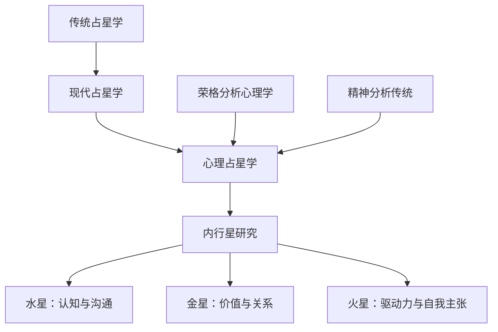
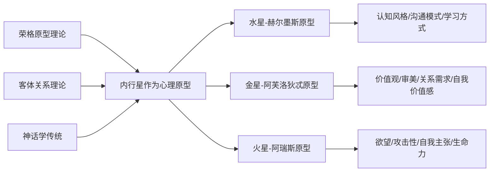

# 《内行星》读书笔记

> [!info] 基本信息
> - 作者：丽兹·格林（Liz Greene）& 霍华德·乔基斯（Howard Sasportas）
> - 系列：伦敦心理占星学中心（CPA）研讨会系列
> - 主题：水星、金星、火星的心理学意义
> - 方法论框架：[[费曼学习法]] + [[DIKW金字塔]] + [[反脆弱方法论]]

---

## 一、学科坐标定位（400字）

本书属于==心理占星学==的核心文献，出自伦敦心理占星学中心（Centre for Psychological Astrology，简称CPA）的研讨会记录。CPA由丽兹·格林与霍华德·乔基斯于1983年联合创立，其学术定位是将==荣格分析心理学==与占星学传统深度融合。

在占星学的学科谱系中，本书处于以下交叉位置：

> [!important] 学科定位
> 内行星（水星、金星、火星）在占星学中被称为"个人行星"，它们运行速度快、与日常心理功能直接关联。与外行星代表的集体无意识力量不同，内行星映射的是个体层面的==认知模式==（水星）、==价值取向与情感需求==（金星）、==行动力与欲望表达==（火星）。

本书的独特贡献在于：它不是简单地列举行星在各星座和宫位的"解释"，而是将每颗内行星视为一个==心理功能的原型==，探讨这些功能如何在个体心灵中运作、被压抑、被投射、以及如何整合。这使它区别于传统占星学的"食谱式"解读，也区别于纯粹的心理学理论——它在两者之间建立了桥梁。

在[[心理占星学]]的阅读序列中，本书适合在理解了基本星盘结构之后、深入外行星与相位分析之前阅读，是从"知道星盘符号"到"理解心理动力"的关键跳板。

---

## 二、理论框架地图（500字）

本书的理论框架建立在几个核心支柱之上：

> [!abstract] 核心理论假设
> 1. 每颗行星对应一种==基本心理功能==，这种功能是人类共有的（原型层面）
> 2. 行星所在的星座决定了该功能的==表达风格==
> 3. 行星所在的宫位指示该功能==活跃的生命领域==
> 4. 行星与其他行星的相位揭示了不同心理功能之间的==内在张力或协作==
> 5. 心理功能可以被意识整合，也可以被压抑而形成==阴影==或通过==投射==外化于他人

格林的方法论特别强调==神话叙事==作为理解行星原型的工具。她不满足于"水星代表沟通"这种简化表述，而是通过赫尔墨斯神话的丰富细节——偷窃、欺骗、引路、翻译、在不同世界之间穿梭——来展示水星功能的多层含义。

乔基斯的方法论则更偏向==发展心理学==的视角，关注这些心理功能在生命早期如何被塑造。例如，金星功能与早期母婴关系中的"被爱"体验密切关联；火星功能与儿童被允许（或被禁止）表达愤怒和主张自我的家庭环境息息相关。

两位作者的互补性构成了本书的方法论张力：格林提供==深度==（神话原型与无意识动力），乔基斯提供==广度==（发展历程与实际表现）。研讨会的对话形式保留了这种张力，读者可以看到两位作者在现场如何相互补充、有时甚至微妙地修正对方的观点。

---

## 三、逐章深度拆解（5000字）

### 第一部分：水星（Mercury）

> [!note] DIKW四层提炼

**Data（数据层）：**
水星是距离太阳最近的行星，在占星学中永远不会与太阳相距超过28度。在星盘中，水星代表思维方式、沟通风格、学习能力、信息处理方式。在神话中对应赫尔墨斯/墨丘利——众神的信使、灵魂引渡者、盗贼与商人的守护神。

**Information（信息层）：**
格林指出，水星-赫尔墨斯的核心功能是==连接与翻译==。赫尔墨斯在希腊神话中是唯一可以自由穿梭于奥林匹斯山、人间与冥界之间的神。这映射到心理层面：水星功能负责在意识与无意识之间、在自我与他者之间、在不同认知框架之间建立桥梁。

水星不仅仅是"沟通"——它更根本的功能是==命名与分类==。通过给事物命名，我们将混沌的感知体验转化为可操作的概念。格林强调，水星功能既是一种巨大的能力（使理性思维成为可能），也是一种潜在的局限（概念化可能切割活生生的体验）。

**Knowledge（知识层）：**
不同星座中的水星展现不同的认知风格：
- 火象星座中的水星倾向于==直觉式认知==，从整体图景出发，对细节可能缺乏耐心
- 土象星座中的水星倾向于==实践式认知==，需要可触摸、可验证的信息
- 风象星座中的水星最"自在"，擅长抽象思维和概念操作
- 水象星座中的水星将思维与==情感==深度交织，认知过程带有强烈的主观色彩

乔基斯从发展心理学角度补充：一个人的水星功能如何发展，很大程度上取决于早期环境是否鼓励好奇心和提问。在家庭中"不允许提问"或"某些话题禁止讨论"的孩子，其水星功能可能受到压抑。

**Wisdom（智慧层）：**
水星的深层智慧在于：==思维本身是一种工具，而不是现实==。格林通过赫尔墨斯"骗子"（trickster）的面向提醒我们，语言和概念可以揭示真相，也可以制造幻象。成熟的水星功能意味着能够运用思维而不被思维所困——这与佛教传统中"手指指月"的比喻不谋而合。

> [!tip] 费曼式解读
> 如果我要向一个完全不懂占星学的朋友解释水星功能，我会说：你知道你脑子里有一个"翻译官"吗？当你感受到一种复杂的情绪时，这个翻译官帮你把它变成文字；当你遇到一个新概念时，翻译官帮你把它和你已有的知识联系起来。这个翻译官就是水星功能。不同人的翻译官工作方式不同——有的快但粗糙，有的慢但精确，有的擅长处理情感信息，有的擅长处理抽象概念。星盘中水星的位置，描述的就是你这个翻译官的工作风格。

> [!warning] 反脆弱验证
> 格林的赫尔墨斯原型分析具有很强的解释力，但存在一个风险：将神话叙事等同于心理学解释。神话提供的是==隐喻性洞见==而非实证性证据。一个人的认知风格受到基因、神经发育、教育经历等多重因素影响，将其简化为"水星在哪个星座"显然是不充分的。然而，作为一种==自我反思的工具==，水星原型确实能帮助人们觉察到自己习以为常的思维模式，这种"觉察"本身具有治疗价值。

**类比迁移：** 水星的"连接与翻译"功能，可以类比为认知科学中的==工作记忆==——它不是储存信息的仓库，而是一个活跃的处理平台，负责在不同信息之间建立临时联系。

---

### 第二部分：金星（Venus）

> [!note] DIKW四层提炼

**Data（数据层）：**
金星是距离太阳第二近的行星，与太阳的最大距离不超过48度。在占星学中，金星统治金牛座和天秤座，代表价值观、审美、爱情、关系、自我价值感、享乐倾向。在神话中对应阿芙洛狄忒/维纳斯。

**Information（信息层）：**
格林对金星的分析从一个关键区分开始：阿芙洛狄忒不仅仅是"爱神"，更根本地说，她是==价值感的赋予者==。当我们说"我喜欢这个""这对我很重要""这很美"时，运作的就是金星功能。金星回答的核心问题是：==什么对我有价值？==

格林特别强调阿芙洛狄忒的两面性：她既是温柔美丽的爱神，也是具有巨大破坏力的力量。在神话中，阿芙洛狄忒的愤怒和嫉妒引发了无数灾难。这提示我们：金星功能不仅仅是"甜蜜与和谐"，它也包含==对失去所爱之物的恐惧==、==对自身价值的怀疑==、以及==因价值被否定而产生的深层愤怒==。

**Knowledge（知识层）：**
乔基斯将金星功能与==早期依恋体验==联系起来。一个人如何体验"被爱"和"有价值"，根源可以追溯到婴儿期与主要照顾者的互动。如果婴儿的需求得到稳定回应，金星功能倾向于健康发展——个体能够感受到自身的价值，也能够欣赏和珍视他人。如果早期体验中存在重大缺失，金星功能可能以扭曲的方式运作：

- ==过度取悦他人==以换取爱（金星的讨好模式）
- ==退缩和自我保护==，拒绝进入亲密关系（金星的回避模式）
- ==通过物质积累==来填补内在价值感的空洞（金星的物化模式）

金星在不同星座的表现差异巨大。例如，金星在白羊座直接、主动、追求新鲜感；金星在天蝎座深刻、强烈、需要绝对的情感真实。格林指出，理解自己的金星位置有助于认识到：==你对"爱"的定义可能与你的伴侣完全不同==，而这种差异不是对错问题，而是不同的心理需求。

**Wisdom（智慧层）：**
金星的深层智慧在于：==真正的自我价值感不能从外部获取==。无论是通过关系、金钱、美貌还是社会认可，外部来源提供的价值感都是脆弱的。格林暗示，金星功能的成熟意味着从"我因为被爱所以有价值"转化为"我因为存在本身就有价值"——这是一个从依赖到自足的心理旅程。

> [!tip] 费曼式解读
> 想象你心里有一个"品鉴师"。这个品鉴师决定了你觉得什么是美的、什么人吸引你、什么东西值得你花时间和精力。这个品鉴师还掌管着你的"自我价值银行"——你觉得自己配得上什么，不配得上什么。每个人的品鉴师都有不同的标准和偏好，这就是金星在不同星座和宫位的含义。问题在于，很多人的品鉴师在童年就被"设定"了——如果你小时候只有表现好才能获得爱，你的品鉴师可能会一直告诉你"你必须足够好才配被爱"。理解金星，就是理解并有可能重新校准你的品鉴师。

> [!warning] 反脆弱验证
> 将金星功能与依恋理论联系起来是有心理学基础支撑的——依恋研究确实表明早期关系模式深刻影响成年后的亲密关系。但需要注意：乔基斯的分析有时会过度简化因果链，仿佛一切关系问题都可以追溯到童年。实际上，成人依恋模式是可以改变的（所谓"获得性安全依恋"），且受到多种后续经历的影响。此外，占星学的金星位置并不能替代专业的依恋评估工具。

**类比迁移：** 金星功能可以类比为经济学中的==效用函数==——它是一套关于"什么有价值"的内在评价系统，决定了你的偏好排序和资源分配。

---

### 第三部分：火星（Mars）

> [!note] DIKW四层提炼

**Data（数据层）：**
火星是第一颗轨道在地球外侧的行星，传统上统治白羊座和天蝎座，代表行动力、欲望、攻击性、自我主张、竞争、性欲的主动面向。神话中对应阿瑞斯/马尔斯——战神。

**Information（信息层）：**
格林指出，火星-阿瑞斯在希腊神话中是一个被低估甚至被厌恶的神——其他奥林匹斯诸神大多不喜欢他，宙斯公开表示阿瑞斯是他最讨厌的儿子。这个神话细节具有深刻的心理学含义：==在许多文化和家庭中，攻击性和直接的欲望表达是被贬低和压抑的==。

火星功能的核心是==主张自我的存在和需求==。当一个婴儿因为饥饿而大哭时，运作的就是原始的火星能量——"我要！我需要！我在这里！"这种能量是生存所必需的，但在社会化过程中往往被过度压抑。

**Knowledge（知识层）：**
乔基斯特别关注火星功能在发展过程中的命运。他指出几种常见的失调模式：

- ==火星过度压抑==：个体无法说"不"，无法为自己的权益争取，习惯性地退让和妥协。被压抑的火星能量往往以==被动攻击==、==身体症状==（如慢性肌肉紧张、头痛）、或==抑郁==的形式表现出来
- ==火星过度膨胀==：个体以攻击性作为应对一切的默认模式，将世界视为战场，难以建立信任和亲密关系
- ==火星投射==：个体将自己的攻击性投射到外部世界，总是遇到"欺负自己的人"或"充满敌意的环境"

格林从原型层面补充：火星的健康表达不仅仅是"适度的自我主张"，更深层地说，火星代表==对生命的热情和投入==。一个与自己火星功能断裂的人，不仅难以愤怒，也难以真正热爱——因为火星的能量既是"我反对"的力量，也是"我渴望"的力量。

火星在不同星座中的表现：
- 火象星座中的火星直接、热烈、行动导向
- 土象星座中的火星缓慢但持久，擅长将欲望转化为持续的努力
- 风象星座中的火星通过思想和语言表达攻击性，可能倾向于辩论和智识竞争
- 水象星座中的火星深沉、强烈，但可能难以直接表达，容易转化为情绪暗流

**Wisdom（智慧层）：**
火星的深层教导是：==攻击性不是邪恶的，它是生命力的一个面向==。能够健康地说"不"、能够为自己的信念战斗、能够承认和表达愤怒——这些都是心理健康的标志。格林引用荣格的观点指出：一个真正善良的人，不是一个没有攻击性的人，而是一个==充分意识到自己的攻击性并选择如何使用它==的人。

> [!tip] 费曼式解读
> 想象你身体里住着一个"战士"。这个战士的工作是保护你、为你争取你需要的东西、在必要时和威胁你的力量对抗。如果这个战士被锁在地牢里（火星被严重压抑），你可能变成一个总是说"好"、总是让步的人，但你的身体和情绪会替战士说出"不"——通过头疼、焦虑或莫名其妙的愤怒爆发。如果这个战士接管了整个城堡（火星过度膨胀），你可能变成一个到处树敌的人。健康的状态是：你知道战士在那里，你可以在需要的时候召唤他，也可以在安全的时候让他休息。

> [!warning] 反脆弱验证
> 火星与攻击性的讨论在心理学中有广泛的理论基础，从弗洛伊德的攻击驱力理论到温尼科特对攻击性在发展中的正面作用的论述。本书的分析与这些传统是一致的。然而，将所有攻击性问题都框定为"火星功能失调"有过度简化的风险——攻击性的调节涉及神经生物学、社会学习、文化规范等多重因素，不能仅从一个占星符号来理解。

**类比迁移：** 火星功能可以类比为物理学中的==动能==——它是使事物从静止到运动的力量。没有动能，系统是死的；动能不受控制，系统会被摧毁。关键在于==方向和调节==。

---

### 研讨会互动部分

本书的独特之处在于保留了大量研讨会中的==问答互动==。这些互动提供了珍贵的案例分析材料，参与者带来自己或客户的真实星盘，格林与乔基斯现场解读。

> [!note] 关键洞见
> 在多个案例讨论中反复出现的主题：
> 1. 内行星的==相位模式==比单独的星座位置更能揭示心理动力。例如，金星与土星的四分相可能指向"爱与责任的冲突"或"在关系中感到被限制"
> 2. 内行星与外行星的相位尤其重要——个人行星被外行星"触及"时，个体层面的功能被注入了==集体性、超个人性的强度==
> 3. 星盘中被强调的内行星（如处于角宫、与多颗行星形成相位）往往对应个体心理生活中的==核心议题==

---

## 四、认知偏差/效应清单（800字）

> [!caution] 阅读本书时需要警惕的认知陷阱

1. **巴纳姆效应（Barnum Effect）**
   占星学描述天然具有一定的模糊性，容易让读者觉得"说的就是我"。在阅读水星、金星、火星在各星座的描述时，需要自问：==这个描述是否真的具有区分度==？如果把描述给另一个星座的人看，他们是否也会认同？

2. **确认偏差（Confirmation Bias）**
   读者倾向于记住与自己星盘一致的分析，忽略不一致的部分。例如，如果书中说"火星在巨蟹座的人难以直接表达愤怒"，而你恰好火星在巨蟹且确实如此，你可能会强化对占星学的信念——但你可能忽略了书中其他与你不符的描述。

3. **回溯偏差（Hindsight Bias）**
   格林和乔基斯在分析案例时，是在==已知结果==的情况下解释星盘。这使得解释看起来很有说服力，但如果让他们在不知情的情况下预测，准确性可能大打折扣。

4. **本质主义偏差（Essentialist Bias）**
   将星盘位置视为一种"本质"属性的倾向——"我就是这样因为我的金星在天蝎座"。这违背了本书的初衷：格林和乔基斯都强调星盘描述的是==潜能和倾向==，而非固定命运。

5. **投射认同（Projective Identification）**
   这不仅仅是一种偏差，也是本书讨论的核心心理机制之一。读者可能在阅读过程中将自己的心理内容投射到占星学框架上，用占星语言来==合理化==已有的心理模式，而非真正获得新的洞见。

6. **权威偏差（Authority Bias）**
   格林和乔基斯是心理占星学领域的权威人物，读者可能倾向于不加批判地接受他们的所有论述。需要记住：他们的分析是==有启发性的理论建构==，而非经过严格实证检验的科学结论。

7. **叙事偏差（Narrative Bias）**
   神话故事具有很强的感染力和说服力，但叙事的连贯性不等于逻辑的严密性。阿芙洛狄忒的神话故事很美、很有洞见，但它不能==证明==金星功能的存在。

---

## 五、自我诊断工具（500字）

> [!question] 基于本书内容的自我反思问卷

**水星功能自检：**
- 我习惯性的思维方式是什么？（直觉跳跃 / 线性逻辑 / 感受导向 / 实践导向）
- 我在沟通中最大的困难是什么？（表达不清 / 过度理性 / 回避冲突话题 / 难以倾听）
- 我是否有某些"不允许自己想"的领域？
- 我的好奇心在什么情况下被激活，什么情况下被关闭？

**金星功能自检：**
- 我如何定义"被爱"？这个定义从哪里来？
- 我的自我价值感主要依赖于什么？（成就 / 外貌 / 关系 / 内在感受）
- 在关系中，我倾向于过度付出还是过度索取？
- 我是否能够享受生活中的美好事物，还是总觉得"我不配"？

**火星功能自检：**
- 我能否轻松地说"不"？
- 当我愤怒时，我通常如何处理？（直接表达 / 压抑 / 被动攻击 / 转移到身体症状）
- 我是否有明确的个人目标并在积极追求？
- 在竞争情境中，我感到兴奋还是焦虑？

> [!tip] 使用建议
> 这些问题没有"正确答案"。它们的价值在于帮助你==觉察==自己的模式。如果某个问题让你感到不舒服或特别难以回答，那可能恰恰是值得深入探索的方向。建议配合自己的星盘使用——看看星盘中的行星位置是否与你的自我觉察相呼应，以及在哪些方面存在差异。差异之处往往是==盲点==或==成长空间==。

---

## 六、批判性审视（600字）

> [!danger] 本书的局限与不足

**方法论层面：**
1. 本书的核心方法论是==诠释学==的而非==实证==的。格林和乔基斯从未声称提供可证伪的科学理论，但也未充分讨论这一方法论的边界。读者需要自行判断"有启发性的诠释"与"可靠的知识"之间的距离。

2. 案例分析存在==选择偏差==。呈现的案例都是"占星学分析有效"的案例，我们不知道有多少参与者的经历与星盘分析不符。

**理论层面：**
3. 将荣格原型理论作为连接占星学与心理学的桥梁，继承了荣格理论本身的问题——原型概念缺乏清晰的操作定义和实证检验途径。

4. 对神话的使用有时显得==过度拟合==。不同文化中对同一行星的神话叙述差异很大（例如，罗马的马尔斯与希腊的阿瑞斯有显著区别），选择哪个版本的神话进行分析，本身就是一种带有理论预设的选择。

**实践层面：**
5. 研讨会形式虽然生动，但也导致论述不够系统。同一主题的讨论散布在不同章节中，需要读者自行整合。

6. 本书出版于1990年代，一些心理学引用已经过时。例如，关于性别与火星/金星的讨论带有时代局限性，现代性别研究的视角在书中缺位。

> [!success] 本书的持久价值
> 尽管存在上述局限，本书的核心贡献——==将行星符号作为自我反思的工具==——依然具有实践价值。即使我们对占星学的形而上学基础持怀疑态度，水星-金星-火星作为==认知、价值、行动==三种基本心理功能的框架，本身就是一个有用的自我探索地图。

---

## 七、行动改变指南（500字）

> [!example] 基于本书的实践行动方案

**第一阶段：觉察（1-2周）**
1. 找到自己星盘中水星、金星、火星的位置（星座、宫位、主要相位）
2. 阅读本书中相关章节的描述，用日记记录"哪些描述引起了我的共鸣，哪些不符"
3. 在日常生活中开始观察三种功能的运作：我如何思考（水星）？我被什么吸引（金星）？我如何追求目标和处理冲突（火星）？

**第二阶段：深化（3-4周）**
1. 选择一个最让你感到困扰的功能（通常是火星或金星），深入阅读相关章节
2. 回溯你的成长经历：这个功能在你的家庭中是如何被对待的？
3. 注意==投射==现象：你在他人身上最欣赏或最厌恶的品质，可能正是你自己被压抑或过度发展的功能

**第三阶段：整合（持续）**
1. 尝试有意识地在日常生活中实践"弱势功能"——如果你的水星功能强但火星功能弱，尝试在小事上练习说"不"
2. 将本书的洞见与其他自我成长工具结合（如[[正念冥想]]、心理咨询、[[阴影工作]]）
3. 定期重读相关章节——随着你的心理发展，同样的文字会呈现不同的含义

> [!important] 关键原则
> 占星学是==地图==，不是==领土==。地图可以帮助你导航，但如果你只盯着地图而不抬头看路，你会错过真实的风景。本书的最终目的不是让你成为一个占星学专家，而是帮助你更深入地认识自己。

---

## 八、费曼终极检验（400字）

> [!abstract] 用最简单的语言概括本书的核心

每个人的心灵中都有三种基本功能在运作：

==思考的功能==（水星）——你如何处理信息、表达想法、理解世界。它像一个翻译官，在你内心的不同部分之间传递信息。

==评价的功能==（金星）——你觉得什么有价值、什么是美的、谁值得你去爱。它是你心中的品鉴师，也掌管着你的自我价值感。

==行动的功能==（火星）——你如何追求你想要的东西、如何保护自己、如何表达你的意志和愤怒。它是你心中的战士。

这三种功能每个人都有，但每个人的"配方"不同——有人思维敏捷但行动力弱，有人价值感清晰但表达能力不足。这些功能在童年早期就开始被塑造，家庭环境可能滋养了某些功能而压抑了另一些。

本书的价值在于：通过占星学的符号系统和神话叙事，为这三种功能提供了丰富的隐喻和意象，帮助你认识自己的模式——尤其是那些你没有意识到的模式。但记住：==认识模式是为了获得选择的自由==，而不是为了给自己贴标签。

---

> [!quote] 相关阅读
> - [[《人格的发展》 - 丽兹·格林 & 霍华德·乔基斯]]
> - [[《人际关系占星学》 - 丽兹·格林]]
> - [[《内在的天空》 - 史蒂芬·弗里斯特]]
> - [[《逆行行星》 - 艾琳·乔莉文]]
