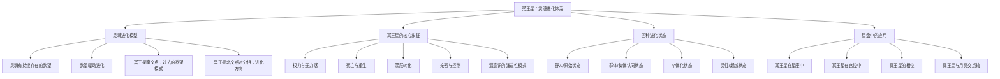

# 《冥王星：灵魂的演化之旅》 - 杰夫·格林

> [!info] 书籍信息
> **原书名**：Pluto: The Evolutionary Journey of the Soul (Volume I)
> **作者**：Jeff Green（Jeffrey Wolf Green）
> **出版**：1985年初版（Llewellyn Publications）
> **主题**：以冥王星为核心的进化占星学体系——用星盘解读灵魂的进化历程

---

## 一、学科坐标定位（400字）

本书是==进化占星学（Evolutionary Astrology）==的奠基之作。杰夫·格林创立了进化占星学这一分支，其核心前提是：==灵魂是真实存在的，它跨越多次生命进行演化，而星盘是灵魂当前演化状态的快照==。这一前提使进化占星学与心理占星学产生了根本性的区分——后者通常保持对"灵魂"和"转世"概念的中立立场。

> [!note] 学科交叉位置
> - **上游学科**：印度教/佛教的业力（karma）理论、瑜伽哲学（尤其是帕坦伽利的《瑜伽经》）、灵魂进化的神智学传统、荣格的集体无意识理论
> - **本学科**：进化占星学——将占星学重新定位为理解灵魂跨生命进化轨迹的工具。冥王星是这一体系的中心点，代表灵魂的核心欲望与进化意图
> - **下游应用**：灵魂层面的生命目的分析、关系业力解读、前世模式识别

格林的理论体系在占星学界是==独树一帜且颇具争议==的。支持者认为他提供了一种前所未有的深度来理解人类行为的"为什么"——不仅是今生的心理动力，还包括灵魂在多次转世中积累的模式。批评者则指出，"灵魂进化"和"前世"是不可验证的信仰前提，将其与占星学结合有将占星学进一步远离科学验证的风险。

无论立场如何，本书对冥王星象征意义的深度分析——==尤其是关于欲望、权力、转化和死亡/重生主题==——被广泛认为是占星学文献中最深刻的之一。

---

## 二、理论框架地图（500字）

> [!abstract] 核心理论支柱
> 1. **灵魂欲望是进化的引擎**：格林认为灵魂携带着两种基本欲望——一种是==回归源头/分离消融==的欲望（类似弗洛伊德的死亡驱力），另一种是==独立存在/自我实现==的欲望。这两种欲望的动态张力推动灵魂的进化
> 2. **冥王星=灵魂的核心**：在格林的体系中，冥王星不仅仅是一个行星象征——它代表==灵魂本身的进化意图==。冥王星在星盘中的位置揭示了灵魂在当前生命中需要面对的核心转化主题
> 3. **四种进化状态**：格林将灵魂进化分为四个大阶段（非线性的），同一个冥王星位置在不同进化状态的灵魂身上会有截然不同的表现
> 4. **南交点=过去，北交点=未来**：冥王星的南交点（Pluto's South Node，即冥王星所在位置的月亮南交点对分相）揭示灵魂在过去世积累的模式，而北交点的对分相指向进化方向
> 5. **强迫性重复与意识选择**：冥王星的心理特征是==强迫性重复==——灵魂倾向于反复创造同样的情境，直到通过意识觉察打破循环

---

## 三、逐章深度拆解（5000字）

### 第一部分：理论基础——灵魂、欲望与进化

#### 灵魂的两种基本欲望

> [!tip] DIKW四层提炼
> - **Data**：格林提出灵魂携带两种对立而互补的欲望
> - **Information**：第一种欲望是"回归源头"——与宇宙整体重新融合、消解个体边界。第二种欲望是"独立存在"——发展独特的个体性、与源头分离。==所有人类行为，在格林看来，最终都可以追溯到这两种基本欲望的某种组合==
> - **Knowledge**：这两种欲望不是"好"与"坏"的关系，而是进化的两个必要极点。过度认同"回归"欲望可能导致自我消融、成瘾、丧失个体性；过度认同"独立"欲望可能导致孤立、权力执迷、灵性干涸。==灵魂的进化就是在这两极之间找到动态平衡==
> - **Wisdom**：理解这两种欲望可以帮助我们理解人类行为中看似矛盾的模式——同一个人可能既极度渴望亲密又极度恐惧被吞噬，因为两种欲望同时在运作

**费曼式解读**：想象你是一滴水。作为一滴水，你有两种渴望。第一种是回到大海——融入广阔的整体，不再感到孤独和渺小。第二种是保持自己独特的形状——成为一滴与众不同的水珠。==冥王星的故事就是这滴水如何在"融入大海"和"做自己"之间寻找平衡的旅程==。有时候你太想融入了，就会迷失自己（成瘾、依赖）；有时候你太想独立了，就会感到孤独和空虚（权力执迷、控制欲）。

**反脆弱验证**：格林的二元欲望模型与弗洛伊德的"爱欲"（Eros）与"死亡驱力"（Thanatos）理论，以及叔本华的"生存意志"概念有结构性相似。荣格的"个体化"概念也涉及类似的张力——在集体认同与个人独特性之间寻找平衡。但格林将这一动力扩展到了"灵魂跨世进化"的维度，这一扩展缺乏经验证据支持，属于形而上学假设。

#### 四种进化状态

> [!tip] DIKW四层提炼
> - **Data**：格林提出灵魂进化的四种状态——野人状态、群体状态、个体化状态、灵性状态
> - **Information**：
>   - ==野人/原始状态==：灵魂的意识处于本能驱动的阶段，对自己行为的动机缺乏反思能力
>   - ==群体/集体认同状态==：灵魂通过认同某个群体（宗教、国族、社会阶层）来定义自我，对权威和传统高度服从
>   - ==个体化状态==：灵魂开始质疑集体规范，发展独立的价值观和身份。这是大多数"寻求占星咨询"的人所处的阶段
>   - ==灵性/超越状态==：灵魂超越了个体认同的需要，开始为更大的整体服务
> - **Knowledge**：格林强调，==同一个冥王星位置在不同进化状态的灵魂身上表现完全不同==。例如冥王星在天蝎座第八宫：野人状态可能表现为原始的权力争夺和性驱力；群体状态可能表现为对社会禁忌的严格遵守或狂热反叛；个体化状态可能表现为深刻的心理自我探索；灵性状态可能表现为协助他人进行深层转化的能力
> - **Wisdom**：进化不是线性的——==一个灵魂可能在某些领域处于个体化状态，在另一些领域仍处于群体状态==。理解这一点可以避免对自己和他人的简单化评判

**费曼式解读**：想象一个电子游戏有四个等级。第一级你只会本能反应——看到食物就吃、看到敌人就打。第二级你加入了一个团队——你按团队规则行事。第三级你开始独立思考——你可能离开团队去单独探索。第四级你不再需要游戏中的任何东西——你开始帮助其他玩家通关。==冥王星在你星盘中的表现，取决于你目前在哪个等级==。

**反脆弱验证**：四种进化状态的模型与多种发展理论有结构相似性——马斯洛的需求层次、科尔伯格的道德发展阶段、肯·威尔伯的意识发展谱。但格林的独特之处在于将其与==转世==概念结合，这超出了学术心理学的范畴。作为一种象征性的理解工具，它有启发性；作为字面的事实声明，它缺乏验证。

---

### 第二部分：冥王星在星盘中

#### 冥王星在十二星座

> [!tip] DIKW四层提炼
> - **Data**：冥王星绕行一圈约248年，在每个星座停留12-31年不等
> - **Information**：冥王星在星座中代表一整代人共享的==深层转化主题==。冥王星在狮子座一代（1937-1958）的集体课题是自我表达与创造力的转化；冥王星在天蝎座一代（1983-1995）的集体课题是权力、性与死亡的深层重构
> - **Knowledge**：格林对每个冥王星世代都进行了详细分析，指出其集体性的==强迫性模式和进化方向==。例如冥王星在处女座一代（1957-1972）的集体模式是对"纯净"和"完美"的强迫性追求，进化方向是学会接受不完美和整合对宫双鱼座的灵性维度
> - **Wisdom**：理解冥王星的世代维度有助于区分"属于我个人的深层模式"和"属于我这一代人的集体主题"。==你的某些"个人问题"可能其实是你这一代人共享的进化课题==

**费曼式解读**：冥王星在星座中就像给一整代人安装了同一个"操作系统的底层代码"。冥王星天蝎座一代的底层代码是"深挖真相、面对黑暗"——这就是为什么这一代人在成长过程中集体面对了HIV/AIDS危机、性别政治的觉醒、对权力滥用的揭露等议题。==你个人的冥王星故事是在这个集体底层代码上运行的个人程序==。

#### 冥王星在十二宫位

> [!tip] DIKW四层提炼
> - **Data**：冥王星在不同宫位指向灵魂在当前生命中需要进行深层转化的具体生命领域
> - **Information**：冥王星在第一宫：灵魂层面的身份转化——可能经历多次彻底的自我重塑；冥王星在第四宫：家庭和根源的深层清理——可能面对原生家庭中隐藏的权力动力；冥王星在第七宫：关系中的权力与亲密的极端体验——可能经历极度强烈或极具转化性的伴侣关系；冥王星在第十宫：职业和公共角色中的权力议题——可能在职场中面对复杂的权力格局
> - **Knowledge**：格林的宫位解读比大多数占星师更为深入，因为他加入了==进化的时间维度==。冥王星在第七宫不仅描述"这辈子的关系模式"，还暗示灵魂在过去世中关于关系的==未完成课题==。当前生命中反复出现的关系困境，被理解为灵魂试图完成进化任务的表现
> - **Wisdom**：==冥王星所在的宫位是你生命中最可能经历"死亡与重生"的领域==——不一定是物理死亡，而是旧的模式、身份或关系的彻底终结和新的开始

**费曼式解读**：冥王星在你星盘的宫位就像一个"黑洞"——它有极强的引力，把那个领域的一切都拉向极端。冥王星在第二宫（财务和价值观）的人可能经历从极富到极穷或反过来——金钱在他们生命中不是"中性"的，而是一个==极度充满张力的战场==。但这个黑洞的另一面是：==如果你能穿越它，你会获得关于那个领域最深刻的智慧==。

#### 冥王星与月亮交点轴

> [!tip] DIKW四层提炼
> - **Data**：在格林的体系中，冥王星与月亮南交点/北交点的关系是最核心的分析工具
> - **Information**：月亮南交点代表灵魂在过去世中熟悉的模式——舒适区也是困境的来源。月亮北交点代表灵魂在当前生命中需要发展的新方向。==冥王星的位置及其与交点轴的关系，揭示了灵魂为什么选择这种特定的进化路径==
> - **Knowledge**：格林的独特方法是：先看冥王星的宫位和星座（灵魂的核心欲望），再看冥王星的南交点位置（过去的欲望模式），然后看冥王星的北交点对分相（进化方向），最后看月亮交点轴如何与冥王星互动（过去习惯与未来成长的具体路径）
> - **Wisdom**：这一分析框架的核心智慧是：==你今生反复遇到的困境不是随机的——它是灵魂有意选择的"训练场"，目的是完成特定的进化任务==。这种理解可以将受害感转化为目的感

**费曼式解读**：想象你在玩一个角色扮演游戏。南交点是你上一次存档的位置——你在那里已经很擅长了，但也卡在了某个关卡。北交点是游戏指引你去的新区域。冥王星是你的"主线任务"——==不管你走到哪里，这个任务一直跟着你，直到你完成它==。

**反脆弱验证**：格林将"前世"作为字面真实的理论前提，这是他的体系中最具争议的部分。支持者认为这提供了传统心理学无法触及的深度；批评者认为这是不可验证的信仰声明，不属于可讨论真伪的领域。一种中间立场是：==将"前世"理解为一种强有力的心理隐喻==——它不一定字面为真，但作为组织和理解深层心理模式的工具，它可以具有实用价值。

---

### 第三部分：冥王星的相位

#### 冥王星与个人行星

> [!tip] DIKW四层提炼
> - **Data**：冥王星与太阳、月亮、水星、金星、火星的相位
> - **Information**：冥王星-太阳：核心身份中有极端的转化压力和权力议题；冥王星-月亮：情感世界中有深层的强迫性模式和极度的情感强度；冥王星-金星：爱与亲密关系中有占有欲、嫉妒和极度的亲密渴望
> - **Knowledge**：格林对冥王星相位的解读总是包含==进化的两极——一极是强迫性重复（灵魂过去模式的惯性），另一极是有意识的转化（灵魂的进化意图）==。冥王星-金星困难相位的人可能在关系中反复陷入权力游戏和占有欲的陷阱，但也有潜力发展出超越性的爱——==一种不再试图控制对方的、接纳对方完整存在的爱==
> - **Wisdom**：冥王星相位的核心教导是：==你最强烈的欲望所在，就是你最大的转化机会所在==。强迫性不是诅咒——它是灵魂在用极端的方式告诉你"这里有一个你需要面对的课题"

**费曼式解读**：冥王星和其他行星的相位就像你人生中的"压力测试"。如果冥王星和金星有困难相位，你的"爱情"就是你的压力测试区——你会在爱情中遇到最极端的体验、最深的痛苦，也有可能获得最深的转化。==不是因为你倒霉，而是因为你的灵魂选择了在这个领域"加速训练"==。

---

## 四、认知偏差/效应清单（800字）

### 1. 目的论偏差（Teleological Bias）
将所有事件都赋予"灵魂进化"的目的。格林的体系有将一切苦难合理化为"进化课题"的倾向。但并非所有苦难都有目的——==有些苦难可能就是没有意义的不幸==。需要保持对这一可能性的开放。

### 2. 无法证伪的框架
"前世"和"灵魂进化"是不可验证也不可证伪的概念。这意味着无论发生什么，都可以被纳入这个框架中加以"解释"。==一个解释一切的理论其实什么都没有解释==。

### 3. 回溯叙事偏差
格林的案例分析往往是事后用冥王星位置来"解释"已发生的事件。这种回溯性解释容易产生"果然如此"的虚假感——==但如果事先预测，准确率会是多少？==

### 4. 受害者-命运循环
虽然格林试图将"业力"从惩罚性框架中解放出来，但"你今生的苦难是前世课题的延续"这一叙事仍然可能被==用来为不公正辩护==——"你受苦是因为你的灵魂选择了这个体验"。这种说法对于遭受暴力、歧视或系统性不公正的人来说，是有害的。

### 5. 过度戏剧化偏差
冥王星的象征语言天然倾向于极端——"死亡"、"重生"、"权力"、"深渊"。这可能导致读者将普通的生活困难过度戏剧化，或者在没有极端体验时感到自己"没有活出冥王星"。

### 6. 灵性精英主义
四种进化状态的分层模型可能被用来评判他人——"他还在群体状态，我已经在个体化状态了"。这种隐性的==灵性等级制度==与真正的灵性成熟相矛盾。

### 7. 确认偏误
一旦知道自己的冥王星位置，容易选择性关注符合描述的体验而忽略不符合的。

---

## 五、自我诊断工具（500字）

> [!question] 冥王星模式自评
> 回答以下问题（1-5分）：
>
> **权力与控制**
> 1. 我在某些关系或领域中有明显的控制需求
> 2. 我曾经历过被他人控制或操纵的痛苦体验
> 3. 我对权力有复杂的感受——既渴望又恐惧
>
> **深层转化**
> 4. 我曾经历过至少一次彻底的"旧我死亡、新我诞生"的体验
> 5. 我对表面的解释不满足，总想挖到事物的最深层
> 6. 我被心理学、侦探/悬疑、死亡与重生等主题深深吸引
>
> **强迫性模式**
> 7. 我注意到自己在某些领域反复创造类似的困境
> 8. 我有某些强烈的欲望，即使理智上知道不健康也难以放弃
> 9. 我在亲密关系中经历过极度的强度——极度的亲密或极度的冲突
>
> **总分解读**：
> - **15分以下**：冥王星主题不太突出，或你的冥王星在星盘中相对安静
> - **15-30分**：冥王星主题中等活跃，你可能正在某个领域经历转化
> - **30-45分**：冥王星主题非常突出，你可能正处于深层转化期。本书的分析可能对你特别有共鸣

---

## 六、批判性审视（600字）

### 本书的优势

1. **深度无与伦比**：格林对冥王星象征意义的分析是占星学文献中最深刻的之一，无论你是否接受他的形而上学前提
2. **系统性强**：建立了一个完整的、内部逻辑自洽的分析框架——从理论基础到具体的星盘分析方法
3. **实用性**：冥王星在宫位、星座、相位中的详细解读为星盘分析提供了丰富的素材
4. **赋权性**：将困境重新框架为"灵魂选择的进化机会"，可以为处于痛苦中的人提供一种目的感

### 本书的局限

1. **形而上学前提不可验证**：灵魂、转世、业力等概念是信仰而非可检验的假说。==接受这些前提是进入格林体系的"入门价"，不接受的读者可能从一开始就无法与本书产生共鸣==
2. **为苦难辩护的危险**："你的灵魂选择了这个体验"这种说法在面对系统性不公正（种族歧视、性别暴力、经济剥削）时是不道德的简化
3. **过于冥王星中心**：格林的体系将冥王星置于星盘解读的绝对中心，这可能过度简化了占星学的多因素分析传统
4. **写作风格**：格林的写作有时较为密集和重复，对初学者不够友好

### 我不确定的部分

关于格林在本书中是否详细讨论了冥王星降级为矮行星（2006年）后对占星学的影响，我需要说明：本书初版于1985年，远在冥王星被重新分类之前。据我所知，格林本人并不认为天文分类的改变影响占星学的解读，但我不确定这一讨论是否出现在后续修订版中。

> [!warning] 使用边界
> 1. 本书的灵魂进化理论是一种==信仰框架==，而非科学理论。将其作为自我探索的工具是合理的，将其作为客观真理则需谨慎
> 2. "业力"叙事不应被用来为不公正辩护或劝说受害者"接受"不公正
> 3. 冥王星的"死亡与重生"主题可能触发深层情绪，请在有支持的环境中阅读

---

## 七、行动改变指南（500字）

### 第一步：识别你的冥王星主题

- 查找你的冥王星星座、宫位和主要相位
- 问自己：在冥王星所在宫位代表的生命领域，我是否经历过或正在经历极端的体验？
- 在这个领域，我有什么反复出现的模式？

### 第二步：识别强迫性重复

- 在你的"冥王星领域"中，你是否能识别出一种==反复出现的情境模式==？
- 这种模式中，你扮演的角色是什么？（控制者/被控制者/转化者）
- 问自己：==如果我的灵魂选择了这种模式，它试图通过这种方式学到什么？==（这个问题不需要"正确答案"，它的价值在于启发反思）

### 第三步：从强迫到选择

- 当你察觉到冥王星模式正在启动时（极度的控制欲、占有欲、权力游戏的冲动），尝试：
    - 暂停——不立即行动
    - 命名——"这是我的冥王星模式在运作"
    - 选择——==我现在可以做一个不同于惯性模式的选择吗？==

### 第四步：健康的冥王星表达

- **深度自我探索**：心理治疗、冥想、日记——任何帮助你接触深层无意识的实践
- **服务性转化工作**：将你的"深挖"能力用于帮助他人——心理咨询、研究、调查性工作
- **有意识的放手练习**：定期练习放下控制——让一些事情自然发展，不试图操控结果

### 长期实践

- 每年做一次"冥王星年度回顾"：过去一年中，在冥王星领域发生了什么转化？
- 注意冥王星行运（transit）——当行运冥王星触发你的出生星盘时，往往是深层转化的加速期

---

## 八、费曼终极检验（400字）

> [!success] 用最简单的话解释这本书
> **如果我要向一个12岁的孩子解释这本书，我会这样说：**
>
> 你知道在视频游戏里，你的角色有时候会"死"然后重新开始吗？但每次重新开始，你都比上一次更有经验、更厉害。
>
> 这本书说的是：==你的灵魂就像一个超级玩家，它不只玩一局游戏——它玩了很多很多局==（格林相信灵魂有很多次生命）。冥王星就是你的"主线任务"——那个不管你玩多少局都一直跟着你的核心挑战。
>
> 比如你的冥王星任务可能是"学会信任别人"。那你可能会一次又一次遇到信任被打破的情况。不是因为你倒霉，而是因为==你的灵魂选择了这个训练课程==。每次你被伤害、每次你重新站起来、每次你尝试以新的方式去信任——你都在完成一小部分任务。
>
> 这本书最重要的教导是：==你生命中最困难的部分，往往就是你灵魂最想成长的部分==。那些让你最痛苦的模式——反复出现的、你怎么也摆脱不了的——不是惩罚，而是灵魂给你的"训练关卡"。
>
> 但我要诚实地说：这本书的核心前提——灵魂存在并且会转世——是一种信仰，不是被科学证明的事实。==你可以把它当作一种理解生命困境的方式来使用，但不一定要把它当作唯一的真相==。
