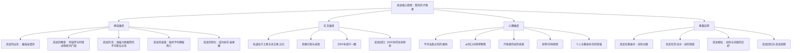

# 《凯龙星：灵魂的创伤与疗愈》 - 梅兰妮·瑞哈特

> [!info] 书籍信息
> **原书名**：Chiron and the Healing Journey
> **作者**：Melanie Reinhart
> **出版**：1989年初版，后经多次修订
> **主题**：凯龙星（Chiron）在占星学中的发现及其代表的"受伤的疗愈者"原型

---

## 一、学科坐标定位（400字）

本书是占星学界关于凯龙星最重要、最全面的专著之一。凯龙星（Chiron）于1977年被天文学家查尔斯·科瓦尔发现，轨道位于土星与天王星之间，这一天文位置被占星学家赋予了深刻的象征意义——==凯龙作为"已知"（土星）与"未知"（天王星）之间的桥梁==。

> [!note] 学科交叉位置
> - **上游学科**：荣格分析心理学（受伤的疗愈者原型）、创伤心理学、希腊神话学、萨满传统
> - **本学科**：心理占星学——将凯龙星纳入星盘解读，开创了小行星/半人马天体在心理占星中的应用先河
> - **下游应用**：创伤知情的心理咨询、疗愈性职业的自我理解、生命转折期分析

梅兰妮·瑞哈特是英国心理占星学界的重要人物，与CPA有密切联系。她将希腊神话中的凯龙（Chiron/Kheiron）——一个==不朽却永远带着无法愈合伤口的半人马==——与现代创伤心理学和灵性疗愈传统进行了深度对话。

本书的独特贡献在于它不仅仅是一本占星技术手册，更是一部关于==创伤如何转化为智慧==的心理-灵性论著。凯龙的核心悖论是：正是因为他自己的伤无法被治愈，他才成为最伟大的疗愈者和导师。这一悖论直接挑战了"你必须先治好自己才能帮助别人"的常见假设，提出了一个更深层的可能性——==伤口本身就是疗愈的源泉==。

---

## 二、理论框架地图（500字）

> [!abstract] 核心理论支柱
> 1. **受伤的疗愈者悖论**：凯龙的核心教导是——==你不需要完全治愈自己才能帮助别人。事实上，正是你对自己伤痛的深刻理解，赋予了你疗愈他人的能力==。这不是为回避自我疗愈找借口，而是承认某些伤口永远不会完全消失，但可以转化为智慧和慈悲
> 2. **桥梁功能**：凯龙在天文轨道上桥接土星与天王星，在心理上桥接"已知的自我"与"未知的可能性"。它指出我们必须穿越的伤口，恰恰是通向更高意识的门户
> 3. **遗弃与接纳**：凯龙神话以被母亲遗弃开始——这种最原初的伤痛成为他日后一切智慧的种子。星盘中凯龙的位置往往指向一种深层的"不被接纳"感，以及由此发展出的补偿性天赋
> 4. **放弃不朽的选择**：凯龙最终选择放弃不朽来换取死亡（解脱痛苦），这在心理层面象征==放下对"永恒解决方案"的执念，接受有限性本身==
> 5. **凯龙回归**：约50岁时凯龙回到出生位置，这是生命中的关键转折点——旧伤被重新激活，但也带来整合和转化的机会

---

## 三、逐章深度拆解（5000字）

### 第一部分：凯龙的神话与天文

#### 凯龙神话的心理解读

> [!tip] DIKW四层提炼
> - **Data**：希腊神话中，凯龙是克洛诺斯（土星）与水仙女菲吕拉的私生子。克洛诺斯以马的形态与菲吕拉交合，因此凯龙生为半人半马。母亲看到他的形态后厌恶地祈求变成一棵椴树，从而永远遗弃了他
> - **Information**：凯龙的出生故事包含了多层创伤：父亲的欺骗（克洛诺斯变形为马）、母亲的遗弃、混血身份的羞耻。但被遗弃的凯龙被阿波罗和阿耳忒弥斯收养教育，成为精通医术、音乐、占卜和武术的大师
> - **Knowledge**：瑞哈特解读这一神话为==创伤转化为天赋的原型故事==。凯龙的"不属于任何一方"（既不完全是人也不完全是马/神）恰恰使他能在不同世界之间充当桥梁。他的被遗弃感驱动了他对知识和技艺的追求——如果你不被爱，至少你可以变得有用
> - **Wisdom**：凯龙神话的最深层教导是：==伤口不是需要被修复的缺陷，而是灵魂独特形状的一部分==。试图完全消除伤口可能同时消除了与之相连的天赋

**费曼式解读**：想象一个小孩被父母遗弃在一座山上。这个小孩没有死——他被好心的老师收养了，学会了各种技能。长大后，他成了所有人都来求助的智者和医生。但他心里一直有一个洞——"为什么我的妈妈不要我？"这个洞永远填不满，但==正是因为他理解"被遗弃是什么感觉"，他才能真正帮助那些也在受苦的人==。如果他从来没受过伤，他可能会是一个聪明但冷漠的技术专家，而不是一个真正的疗愈者。

**反脆弱验证**：凯龙神话与荣格关于"受伤的疗愈者"的论述高度契合。荣格本人曾说，只有受过伤的医生才能真正治愈病人。当代心理治疗研究也表明，治疗师的"已加工的个人创伤经历"（注意是"已加工"而非"未处理"）可以增强治疗效能。但这里有一个重要边界——==未经处理的创伤不会自动变成治疗能力，它需要被有意识地面对和整合==。

**类比迁移**：这与[[金继]]（日本金缮修复术）的哲学高度相似——用金粉修复碎裂的陶器，不是假装它没有碎过，而是让裂痕成为新的美学元素。伤口经过整合后，不是消失了，而是变成了人格中最有力量的部分。

#### 天文维度：土星与天王星之间的桥梁

> [!tip] DIKW四层提炼
> - **Data**：凯龙于1977年被发现，轨道在土星和天王星之间，公转周期约50-51年，轨道高度偏心（椭圆形）
> - **Information**：在占星学的象征逻辑中，土星代表结构、边界、已知现实；天王星代表突破、解放、未知可能性。==凯龙作为两者之间的天体，象征着从已知到未知的过渡地带==
> - **Knowledge**：瑞哈特认为，凯龙在心理层面代表了我们必须穿越伤口才能到达更高意识的过程。土星式的防御和结构无法保护我们免于人生的深层痛苦；天王星式的突破和解放需要我们先正视那些痛苦。凯龙就是这个正视的过程
> - **Wisdom**：凯龙的偏心轨道意味着它在不同星座停留的时间差异极大——这被解读为==疗愈之旅不是均匀的、可预测的过程，而是充满了加速与减速、突破与回退==

**费曼式解读**：想象一座桥连接两座城市。一座叫"安全城"（土星）——那里一切有秩序但也有些无聊和压抑。另一座叫"自由城"（天王星）——那里充满新可能但也混乱和不可预测。凯龙就是这座桥，但==这座桥不是平坦的大路，而是一条需要你赤脚走过碎玻璃的小径==。走过之后你会到达自由城，但你的脚上会留下永久的伤痕——而这些伤痕恰恰让你更懂得路途的意义。

---

### 第二部分：凯龙在星盘中的表现

#### 凯龙在十二星座

> [!tip] DIKW四层提炼
> - **Data**：凯龙在每个星座停留时间不同（因偏心轨道），在白羊座停留时间最短，在天秤座附近最长
> - **Information**：凯龙所在星座描述了创伤的"主题色彩"——凯龙在白羊座：自我存在权利的创伤（"我有权活着吗？"）；凯龙在金牛座：物质安全与自我价值的创伤（"我值得拥有吗？"）；凯龙在双子座：沟通与被理解的创伤（"我说的有人听吗？"）
> - **Knowledge**：瑞哈特强调，凯龙星座不仅描述创伤，==同时描述了由创伤催生的补偿性天赋==。凯龙在双子座的人可能在早期经历了"不被理解"的痛苦，但正因如此发展出了非凡的沟通能力和对语言的敏感度。创伤和天赋是同一枚硬币的两面
> - **Wisdom**：知道你的凯龙星座，不是为了沉溺于"我受过什么伤"的叙事，而是为了==识别你的伤口如何已经在转化为你的力量==

**费曼式解读**：你的凯龙星座就像你身上一个"永远敏感的旧伤"。比如你小时候膝盖摔伤过——那里的皮肤永远比别处敏感，每次变天你都能感觉到。但也正因为那里特别敏感，==你对温度变化的感知能力比别人更强==。凯龙在占星学中就是这个道理——你最敏感的地方恰恰是你最有感知力的地方。

#### 凯龙在十二宫位

> [!tip] DIKW四层提炼
> - **Data**：凯龙在十二宫位中各有不同表现
> - **Information**：凯龙在第一宫：与身体和自我形象相关的深层伤口，可能表现为对外表或存在本身的不安；凯龙在第七宫：在亲密关系中反复被触发的伤口，但也正因此发展出深刻的关系智慧；凯龙在第十宫：在职业和社会角色中感到"不够格"或"冒名顶替"
> - **Knowledge**：瑞哈特认为，凯龙的宫位不仅指出伤痛所在的生命领域，还指出==你被"召唤"去成为疗愈者或向导的领域==。一个凯龙在第四宫的人可能在家庭中经历了深层痛苦，但也因此成为能够帮助他人处理家庭创伤的人
> - **Wisdom**：==你最大的伤口所在的领域，往往也是你能给予世界最大贡献的领域==。这不是浪漫化苦难，而是承认苦难可以被转化

**反脆弱验证**：这一"创伤即天赋"的框架需要谨慎使用。并非所有创伤都会自动转化为天赋——==创伤转化需要有意识的加工过程==（心理治疗、自我反思、支持性关系等）。未经处理的创伤更可能导致重复性伤害而非智慧。瑞哈特在书中也有这方面的提醒，但有时语气可能偏向过度乐观。

#### 凯龙的相位

> [!tip] DIKW四层提炼
> - **Data**：凯龙与其他行星的相位关系
> - **Information**：凯龙-太阳相位：核心身份认同中有一道深层裂缝，但也有独特的自我觉察能力；凯龙-月亮相位：情感安全感的早期创伤，但也有非凡的同理心；凯龙-土星相位：与权威和结构相关的伤口，但也可能成为"结构性疗愈"（如机构改革、制度建设）的推动者
> - **Knowledge**：瑞哈特特别深入地讨论了凯龙与外行星的相位。==凯龙-冥王星相位往往指向与权力、生死、深层转化相关的创伤==，这类人可能经历过极端的"破碎"体验，但也因此对生命的深层结构有不同寻常的洞察力。凯龙-海王星相位则指向灵性层面的创伤——信仰的破灭或灵性体验中的受伤
> - **Wisdom**：凯龙的相位描述了创伤与其他心理功能之间的"对话模式"。困难相位（四分、对冲）意味着更强烈的张力，但也意味着更大的转化潜力

**费曼式解读**：凯龙的相位就像你的"伤口"与你的其他"器官"之间的关系。如果凯龙和太阳有困难相位，就好比你的伤口长在心脏附近——非常要害，但==如果你学会了照顾它，你对心脏运作的理解会比任何心脏外科医生都深==。因为你每天都在和它打交道。

---

### 第三部分：凯龙的生命周期

#### 凯龙回归（约50岁）

> [!tip] DIKW四层提炼
> - **Data**：凯龙的公转周期约50-51年，因此每个人在约50岁左右会经历凯龙回到出生位置——称为"凯龙回归"
> - **Information**：凯龙回归是占星学中标志中年转折的关键时间节点之一（与土星第二次回归在时间上接近但不完全重合）。==在这个时期，早年的旧伤往往以新的形式被重新激活==
> - **Knowledge**：瑞哈特认为凯龙回归是一个"选择之门"——你可以选择带着伤口继续成长（像神话中凯龙选择放弃不朽），也可以选择固守旧的防御模式。这是一个深层的==存在性选择：你愿意为了成长而接受有限性吗？==
> - **Wisdom**：凯龙回归往往伴随着对"人生下半场"的重新定位。很多人在这个时期经历职业转向、关系重组、健康危机或灵性觉醒——所有这些都可以理解为旧伤寻求最终整合的过程

**费曼式解读**：50岁左右的"凯龙回归"就像人生的"期中考试"。之前你积累的所有创伤经验——有些处理了，有些没有——都会被出成考题。==这不是为了惩罚你，而是为了检验你学到了什么，以及你还需要学什么==。通过这场考试的人往往进入一种更平静、更有深度的人生下半场。

**反脆弱验证**：中年转折（midlife transition）在发展心理学中有充分的研究支持。埃里克·埃里克森将此阶段定义为"生产力vs停滞"的危机。丹尼尔·莱文森的成人发展理论也描述了类似的中年转折点。凯龙回归为这一已有研究提供了占星学的时间框架，但需注意，并非所有人在50岁都会经历显著的危机——个体差异很大。

#### 凯龙的其他周期节点

> [!tip] DIKW四层提炼
> - **Data**：凯龙的四分相周期大约在6-23岁（上弦四分）和不同年龄（下弦四分，因轨道偏心而变化大）出现
> - **Information**：瑞哈特追踪了凯龙在个人生命中的完整周期，标出了凯龙与出生位置形成关键角度的年龄节点
> - **Knowledge**：这些节点往往对应着生命中与核心创伤相关的关键事件或内在转变。==凯龙的周期提供了一种理解"为什么某些年龄特别关键"的框架==
> - **Wisdom**：了解凯龙周期不是为了恐惧即将到来的"困难时期"，而是为了以更有准备的心态迎接成长的邀请

---

## 四、认知偏差/效应清单（800字）

### 1. 浪漫化苦难偏差
本书最需要警惕的偏差。"创伤即天赋"的叙事虽然有力量，但可能被扭曲为==为苦难辩护或美化痛苦==。并非所有创伤都能或应该被"转化"——有些创伤需要的是专业治疗和社会支持，而非灵性化的重新解读。

### 2. 幸存者偏差
我们看到的"受伤的疗愈者"都是成功转化了创伤的人——但那些被创伤压垮的人不会出现在这个叙事中。凯龙原型描述的是一种可能性，而非必然性。

### 3. 回溯叙事偏差
事后将人生中的困难解读为"凯龙的功课"，容易产生"果然如此"的错觉。但任何足够模糊的框架都可以在事后为任何事件提供解释。

### 4. 自我实现预言
如果你相信自己的凯龙位置描述了你的"核心创伤"，你可能会==无意识地选择性关注那些符合描述的经历==，甚至无意识地创造出符合描述的情境。

### 5. 身份固化偏差
"我是一个受伤的疗愈者"如果变成了固定的自我定义，可能反而成为逃避真正改变的借口。==凯龙原型的价值在于它的过渡性——它指向一个方向，而非一个终点==。

### 6. 最小化偏差
在凯龙框架的另一个极端，人们可能过早地将严重的创伤经历"灵性化"，从而跳过必要的哀悼、愤怒和处理过程。"这是我灵魂的功课"有时是一种对痛苦的最小化。

### 7. 助人者的反向自恋
以"疗愈者"自居可能暗含一种隐性的优越感——"我比你更了解痛苦"。这种心理位置恰恰与凯龙原型中的谦卑品质相矛盾。

---

## 五、自我诊断工具（500字）

> [!question] 凯龙整合度自评
> 回答以下问题（1-5分，1=完全不是，5=非常是）：
>
> **创伤觉察**
> 1. 我能清晰地描述自己生命中最深层的伤口是什么，以及它如何影响我的行为模式
> 2. 我能在伤口被触发时意识到"这是旧伤在被激活"，而非完全陷入反应
> 3. 我已经为自己的核心创伤寻求过某种形式的帮助或处理（治疗、支持小组、深度反思等）
>
> **转化能力**
> 4. 我的痛苦经历已经在某种程度上帮助我理解和帮助了他人
> 5. 我能在帮助他人时保持健康的边界，不将自己的创伤投射到对方身上
> 6. 我能接受"有些伤口不会完全愈合"这个事实，而不感到绝望
>
> **有限性接纳**
> 7. 我能接受自己的有限性，而不将其视为失败
> 8. 我不再执着于"找到完美的解决方案"来消除所有痛苦
> 9. 面对人生的下半场（如果已过中年），我有一种"让出空间"的意愿
>
> **总分解读**：
> - **15分以下**：凯龙创伤可能仍在较大程度上无意识地运作，建议寻求专业支持
> - **15-30分**：正在积极整合凯龙经验，处于疗愈旅程的中段
> - **30-45分**：凯龙整合度较高，可能已经在某种程度上成为他人的"疗愈者"或"向导"

---

## 六、批判性审视（600字）

### 本书的优势

1. **开创性贡献**：本书在凯龙星发现后不久就建立了系统的象征解读框架，为整个占星学界提供了处理这一新天体的方法论
2. **神话学深度**：对凯龙神话的多层解读展现了瑞哈特在比较神话学和荣格心理学方面的深厚功底
3. **临床敏感性**：书中的案例分析展现了对创伤议题的高度敏感，没有轻率地美化苦难
4. **桥梁概念的力量**：将凯龙定位为土星与天王星之间的桥梁，提供了一个理解"转化必须穿越痛苦"的有力隐喻

### 本书的局限

1. **创伤理论的时代限制**：本书初版于1989年，当时创伤心理学尚未像今天这样发展。书中缺乏对复杂性创伤（C-PTSD）、躯体化创伤（如Peter Levine和Bessel van der Kolk的工作）的整合
2. **"受伤的疗愈者"原型的过度推广**：并非每个人都被"召唤"成为疗愈者。将凯龙星座/宫位自动解读为"你应该在这个领域疗愈他人"可能造成不必要的压力
3. **缺乏对创伤严重性的分层**：童年忽视与战争创伤的严重程度天差地别，但在凯龙的象征框架中可能被同一种语言描述，这种抹平差异的倾向需要警惕
4. **实证基础薄弱**：凯龙的占星解读建立在象征类推而非经验验证的基础上

### 我不确定的部分

关于瑞哈特在书中是否详细讨论了凯龙与其他半人马小行星（如Pholus、Nessus）的关系，我的记忆不完全确切。她可能在后续修订版中加入了这些内容，但我不确定在哪个版本中首次出现。建议参考最新修订版。

> [!warning] 使用边界
> 凯龙的创伤叙事可能触发读者未处理的伤痛记忆。如果阅读本书时出现了强烈的情绪反应或创伤闪回，请暂停阅读并寻求专业支持。==星盘解读不能替代创伤治疗==。

---

## 七、行动改变指南（500字）

### 第一步：识别你的凯龙主题

- 查找你的凯龙星座和宫位
- 反思：这个领域是否确实是你感到最敏感、最脆弱的地方？
- 同时问自己：==这个领域是否也是你特别有洞察力或帮助能力的地方？==

### 第二步：伤口地图

- 在日记中写下你生命中的3个最深层伤口
- 对每个伤口问三个问题：
    - 这个伤口教会了我什么？
    - 这个伤口是否已经在某种程度上转化为一种能力？
    - 这个伤口是否还需要更多的专业处理？

### 第三步：受伤的疗愈者练习

- 识别一个你帮助他人的领域
- 诚实地反思：我的帮助动机中有多少是==真正的慈悲==，有多少是==回避自己伤痛==的方式？
- 这个问题没有"正确答案"——目标是增加觉察而非自我评判

### 第四步：有限性冥想

- 每周花10分钟安静地与一个无法解决的问题共处
- 不试图解决它，不试图"转化"它，只是==让它存在==
- 这是凯龙最深层教导的实践——学会与不完美共存

### 长期实践

- 如果你即将或正在经历凯龙回归（约50岁），将此时期视为一次深度生命回顾的邀请
- 定期检查你的"助人边界"——你在帮助他人时是否照顾好了自己？

---

## 八、费曼终极检验（400字）

> [!success] 用最简单的话解释这本书
> **如果我要向一个12岁的孩子解释这本书，我会这样说：**
>
> 古希腊有一个故事：有一个半人半马的人叫凯龙。他从小就被妈妈遗弃了，但他没有变坏——他被好老师收养，学会了医术和各种技能，成了全希腊最厉害的老师和医生。后来他被一支毒箭射中了，伤口永远好不了，一直很疼。但奇怪的是，==正是因为他自己一直在受苦，他才能真正理解别人的痛苦，才能成为最好的疗愈者==。
>
> 这本书说的是：每个人心里都有一个"凯龙的伤口"——一个从小就在的、特别敏感的地方。可能是"觉得自己不够好"，可能是"怕被抛弃"，可能是其他什么。这个伤口不会完全消失。
>
> 但好消息是：==你不需要等到完全好了才能帮助别人==。事实上，正是因为你知道那种疼是什么感觉，你才能在别人疼的时候真正理解他们。
>
> 最后，凯龙选择了放弃永生来结束痛苦。这教给我们一个很深的道理：==有时候接受"事情不会完美"，反而比一直追求"完美的解决方案"更能带来平静==。
>
> 就像一个修补过的碗——裂缝还在，但用金粉修补后，它比原来还要美。你的伤口也是这样。
