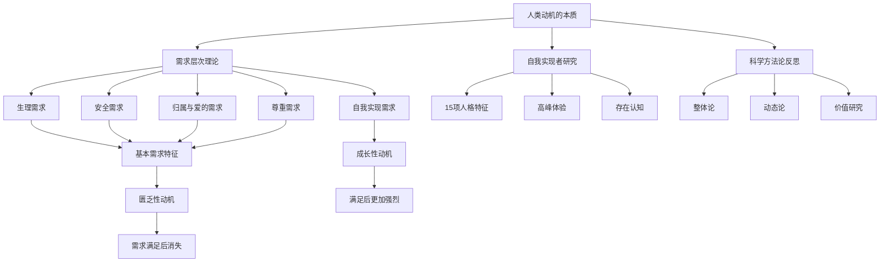
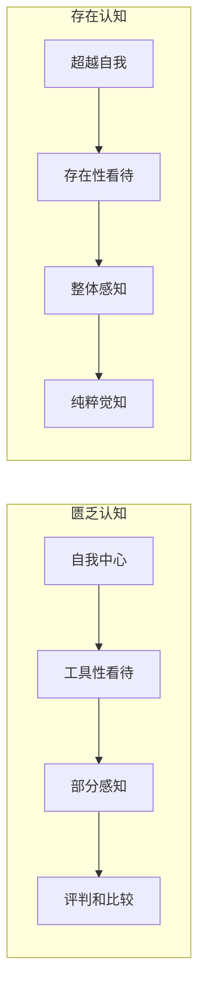

# 《动机与人格》深度读书笔记

## 一、元信息/坐标定位

### 作者背景
亚伯拉罕·马斯洛（Abraham Maslow，1908-1970）是美国心理学家，==人本主义心理学的奠基人之一==。他出生于纽约布鲁克林的一个俄罗斯犹太移民家庭，童年经历孤独和自卑。马斯洛最初在威斯康星大学师从行为主义心理学家哈里·哈洛研究灵长类动物行为，后来逐渐转向人本主义研究。他曾任布兰迪斯大学心理学系主任，并于1968年当选美国心理学会主席。

### 写作时代背景
《动机与人格》首版于1954年，修订版于1970年出版。这一时期正值==心理学的范式转型期==：行为主义统治了美国心理学界数十年，弗洛伊德的精神分析学派在欧洲和临床领域占主导地位。马斯洛对这两种范式都感到不满——行为主义过于机械化，精神分析过于关注病态。他提出的"第三势力"心理学试图建立一种关注人类积极潜能的新范式。

### 学科定位
本书是==人本主义心理学的奠基之作==，处于心理学史上的转折点。它挑战了当时主流的还原论、决定论心理学，提出了一种以人的成长、自我实现为核心的整体论心理学。本书的影响远超心理学领域，深刻影响了管理学、教育学、社会工作和组织行为学。

### 核心问题
马斯洛试图回答一个根本性问题：==什么驱动人类行为？人类能够达到的最高境界是什么？==他不满足于研究"正常人"或"病人"，而是要研究最优秀的人——自我实现者——以理解人类潜能的上限。

## 二、全书逻辑地图



全书的逻辑结构呈==三层递进==：

**第一层：动机理论基础**（第1-4章）
马斯洛首先批判了当时心理学的方法论局限，提出整体-动态的研究取向。然后建立了著名的需求层次理论，这是全书的核心框架。

**第二层：自我实现研究**（第5-11章）
在需求层次的基础上，马斯洛深入研究了处于最高层次的自我实现者。他通过对历史人物和当代杰出人士的研究，描绘了自我实现者的人格画像和独特体验（高峰体验）。

**第三层：方法论与哲学反思**（第12-18章）
马斯洛回到元理论层面，讨论了心理学研究的科学性问题、事实与价值的关系、以及心理健康的本质。这部分体现了他对整个心理学学科的重新定位。

## 三、核心主题/逐章深度拆解

### 第一部分：动机理论的重构

> [!abstract] 核心观点
> 传统动机理论将人类动机还原为孤立的、机械的驱力，这是根本性的错误。人类动机必须从整体、动态、发展的视角来理解。

**对行为主义的批判**

马斯洛指出行为主义的根本问题在于其==还原论倾向==：将复杂的人类行为还原为简单的刺激-反应链条，将人等同于实验室里的老鼠。这种方法论忽视了：

1. **行为的多重决定性**：同一行为可能由多种动机驱动
2. **动机的层级性**：某些需求比其他需求更基本
3. **文化与情境的作用**：人不是在真空中行动
4. **意识与意义的维度**：人会赋予行为意义

**整体-动态方法论**

马斯洛提出的替代方案强调：

- ==整体论==：研究完整的人，而非孤立的反应
- ==动态论==：关注动机的过程和发展，而非静态结构
- ==功能论==：询问行为的目的和功能
- ==文化敏感性==：将人置于其社会文化情境中理解

> [!note] 方法论启示
> 马斯洛并非否定科学方法，而是倡导扩展科学方法的边界，使其能够处理人类独有的现象如意义、价值、自我超越等。

### 第二部分：需求层次理论

> [!tip] 核心框架
> 人类需求按层次排列，较低层次的需求必须得到相对满足后，较高层次的需求才会成为主要的行为动力。

**五个层次的详细解析**

```mermaid
pyramid
    title 马斯洛需求层次
    "自我实现" : 20
    "尊重需求" : 20
    "归属与爱" : 20
    "安全需求" : 20
    "生理需求" : 20
```

**1. 生理需求（Physiological Needs）**

这是最基本的需求层次，包括食物、水、空气、睡眠、性等。马斯洛强调几个关键点：

- ==绝对优先性==：一个饥饿的人的全部意识都被食物占据
- ==满足后消退==：吃饱后，食物不再是动机来源
- ==相对性==：在现代社会，大多数人的生理需求已得到满足

> [!warning] 常见误解
> 生理需求不仅仅是"生存需求"。马斯洛指出，人体具有维持内稳态的智慧，对特定营养的渴望（如想吃咸的东西）反映了身体的需求。

**2. 安全需求（Safety Needs）**

当生理需求相对满足后，安全需求成为主导动机：

- 人身安全、稳定性、依赖性
- 免于恐惧、焦虑、混乱
- 对结构、秩序、法律、界限的需求
- 强有力的保护者

马斯洛通过==儿童研究==说明安全需求的重要性：儿童需要一个可预测、有序的世界。没有规则、没有边界的环境会让儿童感到焦虑而非自由。

**3. 归属与爱的需求（Belongingness and Love Needs）**

- 对群体归属的渴望
- 亲密关系的需求
- 给予爱与接受爱
- 避免孤独和疏离

> [!note] 爱的辨析
> 马斯洛区分了==匮乏之爱（D-love）==和==存在之爱（B-love）==。前者源于缺失，是为了填补空虚；后者源于丰盈，是自我实现者对他人存在本身的珍视。

**4. 尊重需求（Esteem Needs）**

马斯洛将尊重需求分为两类：

- **自尊**：对自己能力、成就、独立性的评价
- **他尊**：来自他人的认可、声望、地位

==健康的自尊==必须建立在真实的能力和成就之上，而非虚假的赞美或地位象征。马斯洛警告说，纯粹基于外部评价的自尊是脆弱的。

**5. 自我实现需求（Self-Actualization Needs）**

这是需求层次的顶峰，也是马斯洛最独创的贡献：

>"一个人能够成为什么，他就必须成为什么。"

自我实现是==实现个人潜能、成为最好的自己==的驱力。它不是一个固定的目标，而是一个持续的过程。

**层次理论的动态特征**

> [!warning] 常见误解澄清
> 需求层次不是刚性的阶梯，马斯洛本人强调以下灵活性：

1. **层次可以逆转**：长期被剥夺基本需求的人可能"固着"在该层次
2. **多层次并存**：人在同一时刻可以有多个层次的需求
3. **个体差异**：有些人可能将创造性需求置于安全需求之上
4. **无意识动机**：人们往往意识不到驱动自己的真正需求
5. **文化影响**：不同文化可能强调不同的需求

**匮乏性动机vs成长性动机**

这是马斯洛理论中至关重要的区分：

| 特征 | 匮乏性动机 | 成长性动机 |
|-----|----------|----------|
| 来源 | 缺乏、空虚 | 丰盈、溢出 |
| 满足后 | 动机消失 | 动机增强 |
| 目标 | 减少张力 | 追求卓越 |
| 对他人 | 工具性使用 | 存在性珍视 |
| 时间取向 | 未来导向 | 当下临在 |

### 第三部分：自我实现者研究

> [!abstract] 研究方法
> 马斯洛选取了他认为是"自我实现者"的历史人物和当代人士进行深度研究，包括林肯、杰斐逊、爱因斯坦、埃莉诺·罗斯福等。

**自我实现者的15项特征**

1. **更有效地感知现实**
   - 能够穿透表象看到本质
   - 对虚伪、欺骗高度敏感
   - 能够容忍不确定性和模糊性

2. **接纳自我、他人与自然**
   - 没有不必要的羞耻、内疚、焦虑
   - 接受人性的弱点而不苛责
   - 缺乏防御性和伪装

3. **自发性、简单性、自然性**
   - 行为不做作、不虚假
   - 内在生活比普通人更自发
   - 遵循社会惯例但不被其束缚

4. **以问题为中心**
   - 专注于自身之外的问题和使命
   - 有强烈的使命感和责任感
   - 超越自我的狭隘关注

5. **超然独处的需求**
   - 需要隐私和独处
   - 能够超然于环境之上
   - 在危机中保持冷静

6. **自主性与独立性**
   - 相对独立于环境和文化
   - 内在驱动而非外在驱动
   - 自我决定而非随波逐流

7. **持续的新鲜感**
   - 能够以新奇的眼光看待日常事物
   - 不将美好事物视为理所当然
   - 保持惊奇感和敬畏感

> [!tip] 核心洞见
> 自我实现者的一个悖论特征是：==他们既深深扎根于现实，又能超越现实==。他们接受世界的本来面目，同时又被改变世界的愿景所驱动。

8. **高峰体验**
   - 神秘体验或狂喜时刻
   - 感受到与宇宙的合一
   - 超越时间和空间的限制

9. **对人类的认同**
   - 深厚的同理心和同情心
   - 认同全人类而非特定群体
   - 真诚地想要帮助他人

10. **谦逊与尊重**
    - 能够向任何人学习
    - 没有种族、阶级、教育程度的偏见
    - 真诚的民主精神

11. **强烈的伦理感**
    - 明确的道德标准
    - 分得清对与错
    - 但伦理观可能与传统不同

12. **善意的幽默感**
    - 哲学性的幽默而非敌意性的
    - 能够自嘲
    - 不以嘲笑他人为乐

13. **创造力**
    - 不限于艺术领域
    - 日常生活中的创造性
    - 新鲜的、天真的看待事物的方式

14. **抵抗文化濡化**
    - 不盲从社会规范
    - 保持内在的自主性
    - 但不是为了反对而反对

15. **不完美性**
    - 自我实现者也有缺陷
    - 可能显得冷漠、缺乏耐心
    - 可能有普通人的恶习

### 第四部分：高峰体验与存在认知

> [!abstract] 核心概念
> 高峰体验是自我实现过程中的关键时刻，也是理解人类潜能上限的窗口。

**高峰体验的特征**

马斯洛通过大量访谈收集了人们的高峰体验描述，归纳出以下特征：

1. **完整性感知**：世界被感知为一个统一的整体
2. **专注与沉浸**：完全被体验所吸引，忘记自我
3. **独立于环境**：体验不依赖于外部条件
4. **超越时空**：在那一刻，时间停止，空间消融
5. **本质善意**：体验到存在的美好和善良
6. **自足圆满**：那一刻本身就是完整的，不需要其他任何东西

**存在认知（B-cognition）vs 匮乏认知（D-cognition）**



**存在价值（B-values）**

马斯洛识别出自我实现者所追求和珍视的价值：

- 真（Truth）
- 善（Goodness）
- 美（Beauty）
- 完整（Wholeness）
- 活力（Aliveness）
- 独特（Uniqueness）
- 完美（Perfection）
- 必然（Necessity）
- 完成（Completion）
- 公正（Justice）
- 秩序（Order）
- 简约（Simplicity）
- 丰富（Richness）
- 轻松（Effortlessness）
- 趣味（Playfulness）
- 自足（Self-sufficiency）

> [!note] 价值即需求
> 这些存在价值不仅是自我实现者珍视的，也是人类在最高发展水平上的==需求==。被剥夺这些价值会导致"超越性病态"——一种更高级的存在危机。

### 第五部分：科学与价值

> [!tip] 核心论点
> 心理学不应该回避价值问题。事实与价值的截然二分是一种错误，健康的人格发展本身就包含着对特定价值的肯定。

**科学心理学的局限**

马斯洛批判了当时心理学的"科学主义"：

1. **方法论狭隘**：只研究能够量化的东西
2. **价值中立的幻觉**：声称科学不涉及价值
3. **还原论**：将高级现象还原为低级元素
4. **原子论**：忽视整体和关系

**重新定义科学**

马斯洛并非反对科学，而是倡导扩展科学的边界：

- 科学研究的对象应该包括==主观体验、意义、价值==
- 科学方法应该灵活适应研究对象
- 科学应该服务于人类福祉

**事实-价值融合**

马斯洛提出了一个大胆的论点：==人类本性中内置着价值倾向==。如果我们能够充分发展人性，我们就会自然地倾向于特定的价值（存在价值）。因此：

- 心理健康本身就是一种价值判断
- 自我实现者的价值选择具有某种客观性
- 人类发展的方向是有"正确"和"错误"之分的

## 四、核心框架提炼

### 框架一：需求层次金字塔

这是马斯洛最广为人知的贡献，虽然他本人从未画过金字塔图。核心要点：

- ==层次性==：较低需求相对满足后，较高需求才会涌现
- ==普遍性==：这一层次结构适用于所有人类
- ==动态性==：不是刚性阶梯，存在例外和变化
- ==文化相对性==：满足需求的具体方式因文化而异

### 框架二：匮乏动机vs成长动机

这一区分解释了为什么有些人总是焦虑不安，而有些人能够安然自在：

- **匮乏动机者**：被缺乏所驱动，永远在追逐
- **成长动机者**：被丰盈所驱动，能够给予

这一框架可以应用于：
- 关系质量评估（依赖型vs独立型）
- 工作动机分析（恐惧驱动vs热爱驱动）
- 消费行为理解（补偿性消费vs表达性消费）

### 框架三：自我实现特征清单

马斯洛的15项特征提供了一个==人格发展的理想标杆==。虽然很少有人能完全具备所有特征，但它提供了：

- 个人发展的方向指引
- 评估心理健康的参照
- 理解杰出人物的框架

### 框架四：存在认知与存在价值

这一框架描述了人类认知和价值体验的最高可能性：

- **存在认知**：超越自我、整体感知、纯粹觉知
- **存在价值**：真、善、美等终极价值

应用场景：
- 审美体验分析
- 宗教和神秘体验理解
- 创造力研究
- 教育目标设定

## 五、批判性思考

### 方法论质疑

> [!warning] 样本偏见
> 马斯洛的自我实现者研究存在严重的==选择偏差==：
> - 他凭个人判断选择研究对象
> - 样本偏向白人、男性、西方文化背景
> - 没有明确的操作性定义和选择标准

研究的==可重复性==也成问题：其他研究者如何判断谁是"自我实现者"？马斯洛的标准是否具有普遍适用性？

### 文化普适性问题

马斯洛声称需求层次是普世的，但：

- ==集体主义文化==可能将归属需求置于个人成就之上
- ==禁欲主义传统==可能贬低生理需求的重要性
- "自我实现"这一概念本身就是==西方个人主义==的产物

跨文化心理学研究表明，需求的相对重要性在不同文化中确实存在差异。

### 精英主义倾向

马斯洛的理论被批评为具有==精英主义==色彩：

- 只有少数人能够达到自我实现
- 这是否意味着大多数人是"不完整的"？
- 这种发展阶段论是否带有价值判断？

马斯洛晚年也意识到这个问题，他开始研究"自我超越"而非仅仅"自我实现"。

### 实证基础薄弱

需求层次理论虽然直觉上很有吸引力，但==实证支持有限==：

- 严格的层次顺序未能得到一致验证
- 需求满足与幸福感的关系比理论预测复杂得多
- "自我实现"难以操作化测量

### 乐观主义的代价

马斯洛对人性的乐观看法可能==低估了人类的黑暗面==：

- 即使是"自我实现者"也可能做出不道德的事
- 社会结构和权力关系对人的影响被忽视
- 过于强调个人发展，忽视社会变革

### 与其他理论的张力

- **与弗洛伊德**：马斯洛低估了无意识和童年创伤的作用
- **与行为主义**：马斯洛的内省方法缺乏客观性
- **与存在主义**：马斯洛可能过于乐观，忽视了存在的焦虑和荒谬

## 六、行动清单

### 自我评估
- [ ] 识别当前主导自己的需求层次
- [ ] 区分自己的匮乏性动机和成长性动机
- [ ] 反思自己最近一次高峰体验

### 需求满足策略
- [ ] 确保生理需求得到充分满足（睡眠、营养、运动）
- [ ] 建立稳定的生活结构，满足安全需求
- [ ] 培养深度关系，满足归属需求
- [ ] 在真实成就基础上建立自尊，而非外部认可

### 走向自我实现
- [ ] 找到超越自我的使命或问题
- [ ] 培养独处的能力和习惯
- [ ] 练习以新鲜眼光看待日常事物
- [ ] 追求内在驱动而非外在奖励

### 高峰体验培育
- [ ] 记录自己的高峰体验，识别触发条件
- [ ] 创造有利于高峰体验的环境（自然、艺术、深度对话）
- [ ] 练习正念，培养存在认知的能力
- [ ] 接触并追求存在价值（真、善、美）

### 持续发展
- [ ] 定期反思自己是否在成长
- [ ] 寻找榜样——你认为谁是自我实现者？
- [ ] 接受自己的不完美，这是成长的起点
- [ ] 将自我实现视为过程而非目标

## 七、延伸阅读路线图

### 人本主义心理学深化
- [[《人的潜能与价值》 - 马斯洛等编]]：人本主义心理学论文集
- [[《成为一个人》 - 卡尔·罗杰斯]]：另一位人本主义大师的核心著作
- [[《存在心理学探索》 - 马斯洛]]：马斯洛晚期思想

### 需求与动机研究
- [[《驱动力》 - 丹尼尔·平克]]：现代动机科学的通俗解读
- [[《心流》 - 米哈里·契克森米哈赖]]：最优体验的心理学
- [[《活出生命的意义》 - 维克多·弗兰克尔]]：意义治疗与存在分析

### 批判性视角
- [[《文明及其不满》 - 弗洛伊德]]：对人性的悲观解读
- [[《超越自由与尊严》 - B.F.斯金纳]]：行为主义的辩护
- [[《规训与惩罚》 - 福柯]]：对人本主义的后现代批判

### 实践应用
- [[《重新定义公司》 - 埃里克·施密特]]：组织管理中的需求理论应用
- [[《正面管教》 - 简·尼尔森]]：教育中的人本主义方法
- [[《创业者的窘境》 - 诺姆·沃瑟曼]]：动机理论在创业中的应用

## 八、费曼终极检验

**如果要向一个完全没有心理学背景的朋友解释这本书，我会这样说：**

你有没有想过，是什么在驱动你每天的行动？马斯洛说，答案比你想象的要有层次得多。

想象一个金字塔。最底层是==生存需求==——饿了要吃，困了要睡。当这些得到满足，你不会继续想着吃更多，而是开始关心==安全==——稳定的工作、安全的住所、可预测的未来。

安全感有了之后，你开始渴望==爱和归属==——朋友、家人、亲密关系。然后是==尊重==——你希望自己有能力、有成就，也希望别人认可你。

但这还不是终点。马斯洛发现，有些人在满足了所有这些需求之后，仍然感到不满足。他们渴望成为"最好的自己"，发挥自己的潜能，找到人生的使命。这就是==自我实现==。

有趣的是，这些层次的动机性质不同。前四层是"匮乏性"的——你缺什么就想要什么，得到后就不再渴望。但自我实现是"成长性"的——你越是实现自己，就越想继续成长。

马斯洛还研究了那些他认为已经"自我实现"的人——林肯、爱因斯坦这些。他发现这些人有一些共同特征：他们更能接受现实、更少装腔作势、有超越自我的使命感、能够在日常生活中发现新鲜感、有深刻的"高峰体验"时刻。

这本书最重要的信息是：==人不仅仅是被缺乏所驱动的动物，人有向上成长、实现潜能的内在倾向==。心理学不应该只研究病态和问题，也应该研究人类能够达到的最高境界。

当然，这并不意味着每个人都能轻松达到自我实现。它需要基本需求的满足作为基础，需要有利的环境条件，也需要个人的努力和觉醒。但知道有这样一个可能性，本身就是有价值的——它为我们的成长提供了方向。
