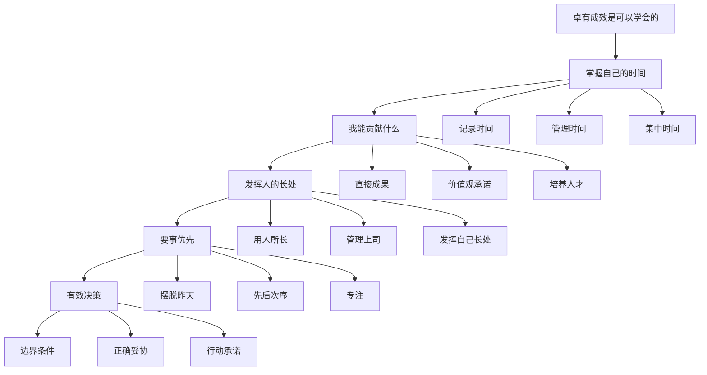
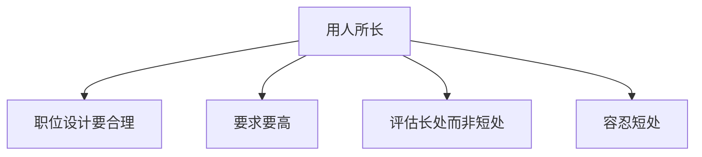
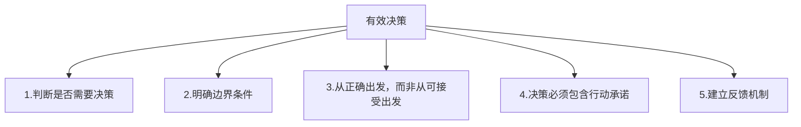
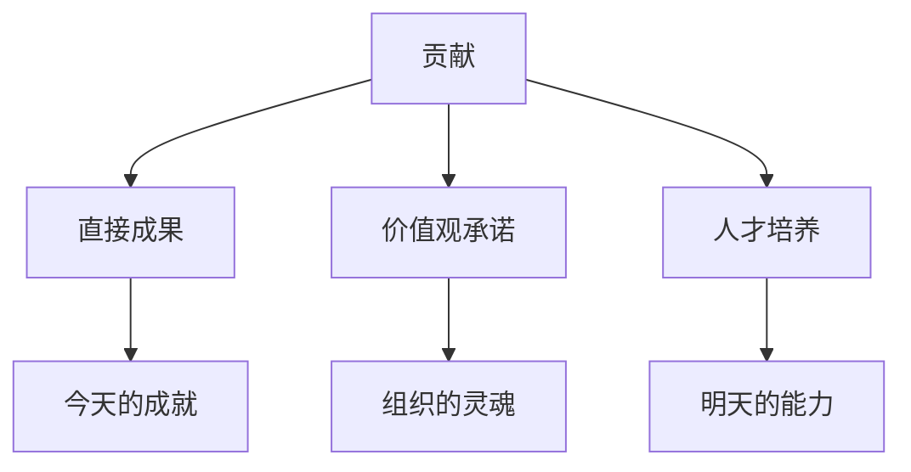

# 《卓有成效的管理者》深度读书笔记

## 一、元信息/坐标定位

### 作者背景

彼得·德鲁克（Peter F. Drucker，1909-2005），被誉为"现代管理学之父"。他在管理学领域的地位，相当于亚当·斯密之于经济学、弗洛伊德之于心理学。德鲁克一生著作等身，出版了39本著作，其中《卓有成效的管理者》是最具实操性的一本。他创造了"知识工作者"、"目标管理"等概念，深刻影响了20世纪下半叶的企业管理实践。

### 写作背景与动机

本书首版于1966年，正值知识经济萌芽期。德鲁克敏锐地观察到：在知识时代，==管理者的工作本质发生了根本变化==——从"让别人做事"变成"让自己做正确的事"。他写作此书的目的不是教人如何管理别人，而是教人如何管理自己，成为一个有效的贡献者。

### 本书定位

在管理学著作谱系中，《卓有成效的管理者》的独特之处在于它聚焦于==个人效能==而非组织效能。与[[原则]]关注决策系统不同，德鲁克更关注每日实践的基本功。与[[高效能人士的七个习惯]]相比，德鲁克的风格更朴实务实，少了一些心灵鸡汤的成分。

### 核心价值主张

> [!abstract] 核心观点
> 管理者的效能是可以学会的。==卓有成效不是天赋，而是一种习惯==，是通过持续练习可以掌握的实践。有效性是知识工作者的唯一产出方式。

---

## 二、全书逻辑地图

全书围绕一个核心问题展开：==在知识工作时代，如何让自己变得卓有成效？==

德鲁克给出的答案是五项基本实践：
1. 掌握自己的时间
2. 思考"我能贡献什么"
3. 发挥人的长处
4. 要事优先
5. 做出有效决策

这五项实践不是独立的，而是构成一个完整的系统。时间管理是基础，贡献意识是方向，用人所长是手段，要事优先是原则，有效决策是目标。

---

## 三、核心主题/逐章深度拆解

### 第一章：卓有成效是可以学会的

> [!note] 核心洞察
> 有效性是一种后天习惯，不是先天禀赋。==聪明才智与有效性没有必然联系==。

#### 为什么需要卓有成效

德鲁克区分了两种工作者：
- **体力工作者**：产出可以用数量和质量直接衡量
- **知识工作者**：产出无法直接衡量，只有通过"效能"才能体现价值

> [!tip] 知识工作者的特征
> 知识工作者不生产"东西"，他们生产"决策"、"判断"和"影响力"。他们的工作成果必须与他人的工作结合才能产生最终成果。

#### 管理者面临的四大挑战

1. **时间属于别人**：管理者的时间总是被别人占用
2. **被日常事务淹没**：除非主动改变，否则永远在"救火"
3. **受制于组织**：你的贡献必须被他人利用才有价值
4. **视野受限**：组织内部只有成本，外部才有成果

#### 有效性是可以学会的

德鲁克强调：==没有"天生有效"的人==。他见过很多聪明绝顶却毫无成效的人，也见过很多资质平平却成就非凡的人。区别在于他们是否养成了有效的工作习惯。

> [!abstract] 关键结论
> 有效性不需要特殊才能，只需要做到五件事：
> 1. 知道时间花在什么地方
> 2. 关注贡献
> 3. 发挥长处
> 4. 专注于少数事情
> 5. 做出有效决策

### 第二章：掌握自己的时间

> [!warning] 核心警告
> ==时间是最稀缺的资源==。如果不能管理时间，就无法管理任何事情。

#### 时间的三个特性

1. **供给完全没有弹性**：每个人每天都只有24小时
2. **没有替代品**：不能用金钱换取时间
3. **不可储存**：昨天的时间无法留到今天用

#### 时间管理的三个步骤

**第一步：记录时间**

> [!tip] 实操建议
> 用2-4周时间，实时记录你的时间使用情况（不是事后回忆）。你会惊讶地发现，你对自己时间使用的认知与实际情况有巨大差距。

德鲁克指出，大多数管理者估计自己花在重要事情上的时间，与实际记录相差2-3倍。

**第二步：管理时间**

记录之后，问自己三个诊断性问题：

1. **这件事如果完全不做，会有什么后果？** 如果答案是"没有后果"，就停止做它。
2. **这件事能否由别人代劳？** 能授权的就授权，管理者应该做只有自己能做的事。
3. **有什么事情是我在浪费别人的时间？** 直接问你的下属和同事。

**第三步：集中时间**

> [!warning] 关键警示
> ==知识工作需要整块的时间==。把时间切得太碎，等于没有时间。

德鲁克建议：每天至少保留一段==不受干扰的整块时间==（至少90分钟），用于最重要的工作。一些管理者选择清晨，一些选择深夜，还有一些选择周末。关键是要有这样的时间。

#### 时间浪费的常见原因

1. **缺乏系统或远见**：反复出现的"危机"说明没有预防机制
2. **人员过剩**：人太多反而需要更多协调时间
3. **组织不健全**：会议太多说明职责不清
4. **信息传递障碍**：信息以错误的形式传递给错误的人

### 第三章：我能贡献什么

> [!abstract] 核心问题
> ==有效的管理者不问"我能做什么"，而问"我应该贡献什么"==。

#### 贡献的三个方向

1. **直接成果**：组织最直接的产出（销售额、利润、研究成果等）
2. **价值观的承诺与维护**：组织的使命和原则
3. **培养明天的人才**：为组织的未来做准备

> [!note] 德鲁克的观察
> 大多数管理者向下看——关注自己的职权、权力和技术。有效的管理者向外看——关注对组织整体的贡献。

#### 正确的人际关系

德鲁克认为，良好的人际关系不是靠"人缘好"或"社交技巧"，而是靠==共同的贡献目标==。

有效的人际关系有四个要求：
1. **互相沟通**：贡献者会主动询问"你需要我做什么"
2. **团队合作**：以贡献为导向的人自然会寻求合作
3. **自我发展**：贡献者会不断提升自己以更好地贡献
4. **培养他人**：帮助他人做出贡献

#### 从专家到管理者的转变

> [!tip] 知识专家的困境
> 专家的知识只有在被他人利用时才能产生成果。==专家的责任是让外行人能够理解和运用自己的知识==。

德鲁克批评那些躲在专业术语背后的专家。真正有效的专家会问：为了让我的知识产生成果，谁需要了解什么？

### 第四章：发挥人的长处

> [!abstract] 核心原则
> ==有效的管理者用人所长，而不是用人所短。== 一个人的弱点几乎无法改变，但长处可以发挥到极致。

#### 用人所长的四个原则

**原则一：职位设计要合理**

> [!warning] 警示
> 如果一个职位接连让几个人失败，这个职位本身可能有问题。德鲁克称之为"寡妇制造者"——应该重新设计。

**原则二：对人的要求要高**

> [!tip] 实操建议
> 不要问"这个人能做什么"，要问"这个人能做出什么杰出贡献"。==设定的标准越高，最终的成就越大==。

**原则三：评估长处，而非短处**

德鲁克批评那种试图找出"全面发展的人"的做法。他说：==杰出的人总是偏才==。试图在所有方面都做到"及格"的人，在任何方面都不会杰出。

**原则四：容忍短处**

> [!note] 关键洞察
> 只有当一个人的短处妨碍他发挥长处时，才需要考虑。否则，==容忍短处是发挥长处的代价==。

#### 管理上司

> [!abstract] 核心观点
> ==管理上司是管理者的责任==。让上司发挥长处，是让自己有效的关键。

如何管理上司：
1. 了解上司的长处，在他擅长的领域与他配合
2. 了解上司的工作方式（读者型还是听者型？）
3. 让上司了解你能做什么、在做什么、需要什么

#### 发挥自己的长处

德鲁克建议：==不要试图改变自己的短处，而要把精力放在发挥长处上==。找到自己最能做出贡献的领域，然后在这个领域追求卓越。

### 第五章：要事优先

> [!abstract] 核心原则
> ==卓有成效的秘诀是专注==。一次只做一件事，而且是最重要的一件事。

#### 摆脱昨天

> [!warning] 关键警示
> 管理者最大的时间浪费，是在==已经不再有价值的事情上==继续投入。

德鲁克建议定期问自己：如果我们现在还没有做这件事，我们会开始做吗？如果答案是否定的，就应该停止。

**"有计划的放弃"**：为了做新事情，必须放弃旧事情。这不是懦弱，而是勇气。

#### 确定优先次序的原则

> [!tip] 四个原则
> 1. **重将来而非过去**：问"什么机会将引领未来"
> 2. **重机会而非问题**：问"如果这个机会成功，会有多大影响"
> 3. **选择自己的方向，而非随波逐流**
> 4. **目标要高，要有重大影响**

#### 专注的勇气

德鲁克说：==知道不做什么，比知道做什么更难==。大多数人的失败不是因为做错了事，而是因为做太多事。

> [!note] 核心洞察
> 专注不是关于时间管理的技巧问题，而是关于==勇气==的问题——放弃熟悉的旧事物，尝试不确定的新事物，这需要勇气。

### 第六章：决策的要素

> [!abstract] 核心观点
> ==有效的管理者不做太多决策==。他们做的是重要的决策，是关于原则和根本问题的决策。

#### 决策的五个要素

**要素一：判断是否需要决策**

德鲁克区分两类问题：
- **一般性问题**：需要建立规则或原则来解决
- **例外性问题**：只需要个案处理

> [!warning] 常见错误
> 把一般性问题当作一连串个案来处理，或者把真正的例外当作一般性问题来处理。

**要素二：明确边界条件**

> [!tip] 关键问题
> 这个决策必须满足什么条件？这个决策至少要达到什么目标？

边界条件不清楚，即使决策本身是正确的，也会失败。

**要素三：从正确出发，而非从可接受出发**

> [!abstract] 核心原则
> ==先确定什么是正确的，再考虑如何让人接受==。如果先考虑"可接受"，你永远不知道什么是正确的。

德鲁克说：妥协从来不可避免，但正确的妥协和错误的妥协有天壤之别。

**要素四：决策必须包含行动承诺**

> [!note] 关键检验
> 一个决策如果没有回答以下问题，就不是真正的决策：
> - 谁必须知道这个决策？
> - 谁必须采取什么行动？
> - 行动必须是什么样的，才能让执行者执行？

**要素五：建立反馈机制**

即使是最好的决策，也需要检验。德鲁克建议：==亲自去现场看==，不要依赖报告。报告是抽象的，现实是具体的。

### 第七章：有效的决策

> [!abstract] 核心观点
> ==决策是一种判断，是在多种选择中的选择==。有效的决策来自于不同意见的碰撞，而非共识。

#### 决策从意见开始

> [!note] 反直觉的观点
> 有效的决策者不从"事实"开始，而是从"意见"开始。因为==在社会事务中，没有事实，只有对事实的解读==。

正确的做法是：鼓励不同的意见，然后检验这些意见背后的假设。

#### 反对意见的价值

德鲁克说：==没有反对意见，就不要做决策==。

反对意见有三个功能：
1. 防止决策者被组织"绑架"
2. 提供替代方案
3. 激发想象力

#### 是否需要决策

> [!warning] 最后的检验
> 在做决策之前，问自己：如果我们什么都不做，会怎么样？

如果不做决策，情况会自行改善，或者至少不会恶化，那就不要做决策。==行动的代价必须超过不行动的代价==。

---

## 四、核心框架提炼

### 框架一：时间管理三步法

| 步骤 | 行动 | 关键问题 |
|------|------|----------|
| 记录 | 实时记录时间使用 | 我的时间实际花在哪里？ |
| 管理 | 剔除不必要的活动 | 这件事如果不做会怎样？ |
| 集中 | 保护整块时间 | 我是否有专注的时间？ |

### 框架二：贡献三维度

### 框架三：决策清单

> [!tip] 决策前必问的七个问题
> 1. 这是一般性问题还是例外性问题？
> 2. 边界条件是什么？
> 3. 什么是正确的决策（不考虑可接受性）？
> 4. 谁需要知道这个决策？
> 5. 谁需要采取什么行动？
> 6. 如何检验决策的效果？
> 7. 如果什么都不做会怎样？

### 框架四：用人四原则

1. 职位设计要合理（避免"寡妇制造者"）
2. 对人的要求要高（但基于其长处）
3. 评估长处而非短处
4. 容忍短处（除非妨碍长处发挥）

---

## 五、批判性思考

### 优势与贡献

1. **开创性**：首次系统阐述个人效能理论
2. **实用性**：提供可直接应用的方法和工具
3. **普适性**：适用于各种组织和层级
4. **简洁性**：核心原则简单易记

### 局限与不足

> [!warning] 批判性视角

**1. 时代背景的局限**
- 写于1966年，知识工作的形态已大不相同
- 没有预见到互联网、智能手机带来的注意力碎片化
- 对远程工作、灵活工作几乎没有涉及

**2. 过于理性化**
- 低估了情绪、直觉在决策中的作用
- 对人际关系的复杂性论述不足
- 假设人可以完全控制自己的时间和注意力

**3. 文化偏见**
- 主要基于美国和欧洲企业的经验
- 对集体主义文化的适用性有限
- "管理上司"的概念在等级森严的组织中难以实践

### 与其他思想的对话

与[[原则]]的对话：
- 达利欧强调系统和算法，德鲁克强调习惯和实践
- 两者都重视决策，但达利欧更量化，德鲁克更定性

与[[高效能人士的七个习惯]]的对话：
- 柯维的框架更全面（涵盖生活各方面），德鲁克更聚焦（专注于工作效能）
- 柯维更强调价值观和使命，德鲁克更强调贡献和成果

---

## 六、行动清单

### 立即可做（今天）

- [ ] 开始记录自己的时间使用（用2周时间持续记录）
- [ ] 问自己：我在这个岗位上应该贡献什么？
- [ ] 识别一件"如果不做也没关系"的事情，停止做它

### 短期实践（一周内）

- [ ] 为自己保护每天至少90分钟的专注时间
- [ ] 与上司沟通：了解他需要你贡献什么
- [ ] 识别自己最大的三个长处和三个短处

### 中期计划（一个月内）

- [ ] 建立定期的时间审计习惯（每月一次）
- [ ] 制定"不做清单"——列出应该放弃的事情
- [ ] 对当前面临的一个重大决策，用德鲁克的五要素框架分析

### 长期习惯（持续）

- [ ] 每周问自己：这周我做出了什么贡献？
- [ ] 每季度问自己：如果重新开始，我还会做现在正在做的事吗？
- [ ] 每年问自己：我的长处发挥得怎么样？

---

## 七、延伸阅读路线图

### 深化德鲁克思想

1. [[管理的实践]] - 彼得·德鲁克：德鲁克最重要的著作，管理学的奠基之作
2. [[创新与企业家精神]] - 彼得·德鲁克：关于创新的系统思考
3. [[21世纪的管理挑战]] - 彼得·德鲁克：德鲁克晚年对未来的预测

### 个人效能的其他视角

1. [[高效能人士的七个习惯]] - 史蒂芬·柯维：更全面的个人效能框架
2. [[深度工作]] - 卡尔·纽波特：专注力在数字时代的实践
3. [[原子习惯]] - 詹姆斯·克利尔：习惯养成的科学

### 决策与思维

1. [[思考，快与慢]] - 丹尼尔·卡尼曼：决策中的认知偏差
2. [[原则]] - 瑞·达利欧：系统化的决策框架
3. [[清单革命]] - 阿图·葛文德：简单工具的巨大力量

---

## 八、费曼终极检验

> [!abstract] 用最简单的话解释这本书

想象你是一个上班族，每天忙忙碌碌，晚上回家却想不起来自己做了什么有价值的事。德鲁克这本书就是写给你的。

他的核心观点很简单：==有效不是天赋，是习惯==。任何人都可以变得有效，只要做到五件事：

**第一，知道你的时间花在哪儿**。你以为自己每天工作8小时，但真正有产出的可能只有2小时。剩下的时间去哪了？开会、回邮件、被打断、发呆……先记录下来，才能改变。

**第二，问"我能贡献什么"**。大多数人问的是"我要做什么"或"公司让我做什么"。但有效的人问的是：我能为组织创造什么价值？这个问题改变了一切。

**第三，用人所长**。包括用别人的长处，用上司的长处，用自己的长处。==不要试图把自己或别人改造成"全面发展的人"==。杰出的人都是偏才。

**第四，一次只做一件事**。这是最难的。我们总想同时做很多事，结果什么都做不好。德鲁克说：==专注不是时间管理技巧，是一种勇气==——放弃其他事情的勇气。

**第五，做好重要的决策**。不是做很多决策，而是做少数几个真正重要的决策，而且做对。

如果我只能记住一句话，那就是：==管理者的工作不是"做事"，而是"做对的事"==。

这本书写于1966年，但今天读来依然不过时。因为它讲的不是技巧，而是关于工作的==基本态度==——你是为了忙碌而忙碌，还是为了成果而工作？

---

*最后更新：2026-02-05*
