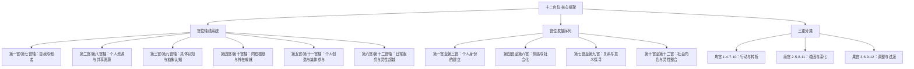

# 《占星十二宫位》 - 霍华德·乔基斯

## 一、学科坐标定位（400字）

霍华德·乔基斯（Howard Sasportas, 1948-1992）是英国心理占星学运动的重要人物，与利兹·格林共同创办了伦敦心理占星学中心（Centre for Psychological Astrology）。本书（The Twelve Houses）是对==占星学十二宫位系统最全面、最深刻的心理学解读==，被公认为该主题的权威参考书。

> [!info] 学科关系网
> 本书的理论根基来自：
> - 荣格分析心理学（原型、个体化、阴影）
> - 发展心理学（生命周期理论）
> - 人本主义心理学（自我实现、需求层次）
> - 传统占星学的宫位知识

在心理占星学的知识地图中，本书填补了一个关键空白。[[《心理占星学入门》 - 克莱尔·马丁]]对宫位只做了概览式的介绍，[[《占星相位研究》 - 苏·汤普金斯]]专注于行星间的关系，而乔基斯则将==整个焦点放在宫位系统==上，将其发展为一部关于生命领域和心理发展阶段的完整论述。

乔基斯的核心洞见是：十二宫位不仅仅是"生命的十二个领域"（传统理解），更是==心理发展的十二个维度==。从第一宫（自我的诞生）到第十二宫（自我的超越），十二宫勾勒出一条完整的个体化历程——灵魂从分化走向整合的旅程。

本书的独特价值在于它的==心理学深度==。乔基斯不是简单地罗列每个宫位的"关键词"，而是深入每个生命领域的心理动力学，探讨行星落入特定宫位时可能呈现的多层次心理面貌。

---

## 二、理论框架地图（500字）

> [!abstract] 框架核心逻辑
> 乔基斯将十二宫位理解为一个==螺旋上升的发展序列==。从第一宫的"我是谁"到第十二宫的"我与万物的联结"，每个宫位都是前一个宫位的自然延伸，同时也为下一个宫位做准备。对面的宫位形成轴线（如第一宫/第七宫），代表同一课题的两个互补维度。行星落入某个宫位，不只是说"你在某个领域会遇到某些事"，而是说"你的某种心理力量需要在这个生命维度中得到发展和整合"。

==费曼式一句话概括==：十二宫位就像一栋有十二个房间的房子——每个房间对应你生命的一个方面（身份、资源、沟通、家庭等），而行星是住在各个房间里的"房客"，它们的性格决定了每个房间的"氛围"。

乔基斯的方法论特色是==对立统一==的思维方式。他始终将对面的两个宫位放在一起讨论（1/7、2/8、3/9等），因为每对轴线都代表一个完整主题的两极——单独理解一个宫位是不完整的，你必须同时考虑它的对面宫位。

---

## 三、逐章深度拆解（5000字）

### 第一宫/第七宫轴线：自我与他者

> [!note] DIKW四层提炼
> - **Data**：第一宫（上升点）代表自我形象、身体外貌和对外呈现的人格面具；第七宫（下降点）代表一对一的亲密关系、伴侣以及"重要他人"
> - **Information**：第一宫描述的是你进入世界时所戴的"面具"——不是虚假的伪装，而是你与外界互动的第一层界面。第七宫描述的是你在亲密关系中被激活的心理模式——你被什么样的人吸引，以及你在关系中如何被改变
> - **Knowledge**：乔基斯的深层洞见是：第七宫所代表的关系模式本质上是==第一宫的投射==。你被吸引的伴侣类型往往体现了你自身未发展的面向。如果你的第一宫强调独立和果断，你的第七宫（对面）就暗示你需要通过关系来发展合作和妥协的能力
> - **Wisdom**：真正的个体化不是在"自我"和"关系"之间选一个，而是学会在保持自我完整性的同时，真正向他人敞开——这是1/7轴线的终极功课

**费曼式解读**

想象你站在一面镜子前。镜子里的你就是"第一宫"——你呈现给世界的形象。而你在镜子背面看到的那个影子——你不太认识的、通过别人才能看到的自己——就是"第七宫"。

乔基斯指出一个深刻的悖论：==我们最亲密的关系往往是认识自己的最佳途径==。为什么你总是被某种类型的人吸引？因为那个人体现了你内在某个未发展的面向。一个第一宫非常独立的人，往往会被非常依赖的伴侣吸引——不是因为"命运的安排"，而是因为他内在被压抑的依赖需求通过伴侣来表达。

**反脆弱验证**

投射理论是这个分析的核心，但投射不是关系中唯一的动力。有些关系中的吸引确实基于投射，但也有些关系基于==真实的互补和共同成长==。乔基斯有时过度强调投射机制，可能忽略了关系的其他维度。

**类比迁移**

1/7轴线之于心理成长，就像独奏与合奏之于音乐家——==你需要先有独奏的能力，才能在合奏中不迷失自己==；但你也需要合奏的经验，才能发现独奏时从未被激活的音乐性。

---

### 第四宫/第十宫轴线：根基与成就

> [!note] DIKW四层提炼
> - **Data**：第四宫（天底，IC）代表家庭、童年、内在的情感根基；第十宫（天顶，MC）代表事业、社会角色、公众形象
> - **Information**：第四宫是你的"心理地基"——早年家庭经验在你内心建造的结构。第十宫是你在世界上追求的"建筑"——事业成就、社会认可、人生方向
> - **Knowledge**：乔基斯的核心洞见是：你在第十宫追求的成就形式，与你在第四宫经历的家庭环境有==深刻的心理对应==。一个童年缺乏安全感的人可能在事业上追求绝对的稳定和控制；一个在过度控制的家庭中长大的人可能在事业上追求自由和叛逆
> - **Wisdom**：真正的人生建筑需要坚实的地基。如果你的第十宫成就建立在未被处理的第四宫创伤之上，那么成就再辉煌也会感到空虚——因为==你的外在建筑和内在地基之间存在结构性裂缝==

**费曼式解读**

第四宫是树根，第十宫是树冠。==你能长多高，取决于你的根有多深==。

乔基斯用大量案例展示了这个动力：一个人的月亮在第四宫暗示他的内在安全感与家庭、归属感紧密相连——无论他在社会上取得多大成就，他都需要一个温暖的"家"作为心理锚点。相反，冥王星在第四宫可能暗示童年家庭中存在权力动力学（控制、秘密、剧变），这种经历会深刻影响他成年后对亲密关系和事业的态度。

**反脆弱验证**

这个分析模型存在一个潜在问题：它可能会将==成年后的一切困难都追溯到童年家庭==。虽然发展心理学确实支持早年经验的深远影响，但人是复杂的系统，成年后的经验同样具有塑造性。乔基斯偶尔有过度强调"原生家庭决定论"的倾向。

**类比迁移**

4/10轴线之于人生，就像地基之于摩天大楼——==你不会因为看不到地基就认为它不重要==。很多"中年危机"本质上是第十宫的建筑开始出现裂缝，迫使人重新审视第四宫的地基。

---

### 第二宫/第八宫轴线：拥有与共享

> [!note] DIKW四层提炼
> - **Data**：第二宫代表个人财务、物质资源、自我价值感；第八宫代表共享资源、亲密关系中的权力动力、深层心理转化、死亡与重生
> - **Information**：第二宫关乎"我拥有什么"——不只是物质层面的，更是心理层面的"我有什么价值"。第八宫关乎"我在与他人的深度联结中如何被转化"——包括性亲密、财务共享、心理治疗和面对死亡
> - **Knowledge**：乔基斯指出，第二宫的自我价值感往往需要通过第八宫的深度体验来被==真正检验和深化==。一个人对自己的价值评估，在独处时是一回事，在深度关系中面对脆弱性时是另一回事
> - **Wisdom**：==真正的安全感不来自拥有更多，而来自知道即使失去一切你依然完整==——这是2/8轴线从物质安全到存在安全的进化

**费曼式解读**

第二宫是你的银行账户（物质的和心理的），第八宫是你和别人的联合账户。在第二宫，你问的是"我独自拥有什么"；在第八宫，你面对的是"当我和另一个人深度交融时，我还能保持自我吗？"

乔基斯精彩地分析了第八宫的多层含义。==性、金钱和死亡==看起来毫不相关，但在心理学层面它们共享一个主题：==与他者的深度融合中自我边界的消解和重建==。做爱时你暂时放下自我边界；共享财务时你放下物质边界；面对死亡时你放下对存在本身的执着。

**反脆弱验证**

第八宫是整个宫位系统中==最容易被过度神秘化==的宫位。乔基斯保持了相当好的心理学严谨性，但某些读者可能会将第八宫的"转化"含义过度浪漫化，忽略了这个宫位也涉及非常现实的主题（如遗产、税务、保险等）。

**类比迁移**

2/8轴线之于个人发展，就像学习游泳——==在浅水区你可以控制一切（第二宫），但真正学会游泳要到深水区（第八宫）==，在那里你必须放下对地面的执着。

---

### 第三宫/第九宫轴线：信息与智慧

> [!note] DIKW四层提炼
> - **Data**：第三宫代表日常沟通、短途旅行、兄弟姐妹、基础教育；第九宫代表高等教育、长途旅行、哲学、宗教信仰
> - **Information**：第三宫是"如何获取和传递信息"，第九宫是"如何将信息整合为意义和智慧"
> - **Knowledge**：乔基斯将这对轴线解读为==从数据到智慧的认知发展路径==。第三宫收集碎片化的事实，第九宫将这些事实编织成一幅有意义的世界图景
> - **Wisdom**：有信息而无智慧是危险的（第三宫失衡），有智慧而脱离具体事实同样危险（第九宫失衡）。真正的理解需要两者的平衡

**费曼式解读**

第三宫是Google搜索——快速获取具体信息。第九宫是大学教育——将信息整合为==系统性的世界观==。你需要两者：只有搜索能力会让你淹没在碎片中，只有理论框架会让你脱离现实。

**反脆弱验证**

乔基斯对这对轴线的分析相对直接，心理动力学的深度不如1/7或4/10轴线。第九宫的"哲学与信仰"维度在他的论述中有时显得==过于知识分子化==，可能未充分考虑非学术背景的个体如何体验第九宫主题。

**类比迁移**

3/9轴线之于认知发展，正如DIKW金字塔——==从数据（data）到信息（information）到知识（knowledge）到智慧（wisdom）的上升路径==。

---

### 第五宫/第十一宫轴线：创造与归属

> [!note] DIKW四层提炼
> - **Data**：第五宫代表创造力、恋爱、子女、自我表达、娱乐；第十一宫代表友谊、群体归属、社会理想、未来愿景
> - **Information**：第五宫是"我的个人创造力"，第十一宫是"我在集体中的位置"
> - **Knowledge**：乔基斯指出，个人创造力（第五宫）如果不与更大的群体和理想连接（第十一宫），就会变成自恋的自我表演；而群体认同（第十一宫）如果不以个人独特性（第五宫）为基础，就会变成随大流的平庸
> - **Wisdom**：==最有意义的创造是个人天赋为集体愿景服务==——这是5/11轴线的整合点

**费曼式解读**

第五宫是你在舞台上的独角戏——纯粹的自我表达，不管观众是谁。第十一宫是你在一个乐团中的演奏——你的个人才华服务于一个更大的作品。两者都有价值，但==真正的成就往往发生在个人才华与集体需求相遇的时刻==。

**反脆弱验证**

乔基斯对第五宫"子女"含义的心理学解读有时显得==过于象征化==。虽然在心理占星学中，第五宫的"子女"确实可以象征"内在的孩子"和创造性产出，但对于实际在养育孩子的人来说，第五宫的含义首先是非常具体的。

**类比迁移**

5/11轴线之于个人成长，就像艺术家之于社会——==纯粹为自己创作的艺术是练习，与世界对话的艺术才是作品==。

---

### 第六宫/第十二宫轴线：服务与超越

> [!note] DIKW四层提炼
> - **Data**：第六宫代表日常工作、健康、日常习惯、服务他人；第十二宫代表灵性、无意识、隐退、自我消融
> - **Information**：第六宫是"在日常中精进"——通过具体的工作和服务来完善自己。第十二宫是"超越日常"——放下个人努力，与更大的整体联结
> - **Knowledge**：乔基斯对第十二宫的分析是全书最具深度的部分之一。他将第十二宫理解为==个体化旅程的最后一站==——在经历了前十一个宫位的发展之后，灵魂在第十二宫面对的课题是放下一切已建构的自我，回归到存在的原始统一中
> - **Wisdom**：第十二宫不是终点，而是新循环的起点——==放下旧的自我，为新的自我诞生（回到第一宫）创造空间==

**费曼式解读**

如果从第一宫到第十一宫是一棵树从种子到果实的生长过程，那么第十二宫就是==果实落地、腐烂、回归泥土==的阶段。这不是毁灭，而是为下一个种子准备肥沃的土壤。

第六宫是"我能为这个世界做什么具体的事"，第十二宫是"我能把自己交还给什么更大的力量"。一个在第六宫过度运作的人可能成为工作狂，用忙碌来回避内在的空虚；一个在第十二宫失衡的人可能完全脱离现实，沉溺于幻想或逃避。

**反脆弱验证**

第十二宫是==最容易被误解的宫位==——既容易被过度浪漫化（"灵性的殿堂"），也容易被过度病理化（"疯狂和自我毁灭"）。乔基斯努力在这两极之间找到平衡，但他的分析有时仍然倾向于灵性化的一端。

**类比迁移**

6/12轴线之于生命，就像白天与夜晚——==白天你工作、行动、服务（第六宫），夜晚你休息、做梦、与无意识连接（第十二宫）==。两者缺一不可。

---

## 四、认知偏差/效应清单（800字）

> [!warning] 阅读本书时需要警惕的认知偏差

1. **宫位决定论（House Determinism）**
   - 表现：将宫位的含义过度具体化（"冥王星在第七宫=伴侣会控制你"），忽略意识水平的差异
   - 乔基斯的对策：他始终强调同一配置在不同意识水平上有不同的表达
   - 自检：你是否把宫位解读当成了==具体的事件预测==？

2. **童年归因偏差（Childhood Attribution Bias）**
   - 表现：将成年后的所有模式都追溯到第四宫（童年家庭），忽略成年后的经验和选择
   - 自检：第四宫确实重要，但你的故事不止于童年。==你现在做的选择同样在塑造你==

3. **投射万能化（Over-Projection）**
   - 表现：将关系中的一切问题都归因为"投射"（"我被这个人吸引是因为他体现了我的阴影"）
   - 自检：投射是关系中的重要动力，但不是唯一动力。==有时候你喜欢一个人就是因为他好==

4. **空宫焦虑（Empty House Anxiety）**
   - 表现：担心没有行星落入的宫位代表那个生命领域"不存在"或"有缺陷"
   - 乔基斯明确指出：==空宫不是缺失==，只是说明那个领域不是此生心理发展的主要焦点。空宫仍然由其守护星来管理

5. **第十二宫恐惧**
   - 表现：将第十二宫的行星视为"不幸"或"前世业力的负担"
   - 乔基斯的解读更为中性：第十二宫是==意识最深层的运作领域==，它的行星能量可能不容易被意识到，但不意味着是负面的

---

## 五、自我诊断工具（500字）

> [!tip] 基于本书的自我觉察练习

**练习一：宫位能量地图**

在一张纸上画出十二宫。在每个宫位中写下：
- 有哪些行星落入？
- 这些行星在你的日常生活中如何表现？
- 哪些宫位感觉"热闹"（多行星），哪些感觉"安静"（空宫）？
- ==你生命中最活跃的领域是否与行星最集中的宫位对应？==

**练习二：轴线平衡自检**

选择一条你最关心的轴线（如1/7关系轴或4/10家庭事业轴），问自己：
- 我是否在这条轴线的某一端过度投入，而忽略了另一端？
- 例如：我是否过度关注事业（第十宫）而忽略了内在情感需求（第四宫）？
- 如果我给另一端更多关注，我的生活会如何变化？

**练习三：第十二宫冥想**

找出你第十二宫中的行星（如果有的话）。每天花10分钟安静坐下，观察这些行星能量在你内在的微妙运作。==第十二宫的能量不喧闹==，它在静默中低语。日记记录你在冥想中感受到的内容。

---

## 六、批判性审视（600字）

> [!question] 本书的局限与需要补充的视角

**优势**

1. ==对十二宫位最全面、最深刻的心理学解读==，至今仍是该主题的权威参考
2. 轴线思维方式极有启发性——强调对立面的互补而非对抗
3. 案例丰富，理论结合实践
4. 对第十二宫的处理特别出色，既不过度浪漫化也不病理化

**局限**

1. **宫位制争议**：乔基斯使用Placidus宫位制，但不同宫位制可能导致行星的宫位归属完全不同。本书未充分讨论这个问题对于解读的==根本性影响==
2. **文化普遍性假设**：十二宫的"生命领域"划分（如第七宫=婚姻伴侣）带有明显的==西方文化假设==。在不同文化中，关系、家庭、事业的结构和意义可能非常不同
3. **心理分析偏向**：乔基斯的解读有时过于心理分析化，倾向于将一切追溯到童年经验和无意识动力，可能低估了==成年后的自主性和能动性==
4. **时代局限**：本书写于1980年代，部分对性别角色和家庭结构的假设可能不完全适用于当代社会

**需要交叉验证的领域**

- 对相位的深入理解需要结合[[《占星相位研究》 - 苏·汤普金斯]]
- 对外行星在宫位中的转化动力需要结合[[《占星、业力与转化》 - 史蒂芬·阿若优]]
- 对宫位的更传统理解可以参考罗伯特·汉德（Robert Hand）的著作

---

## 七、行动改变指南（500字）

> [!success] 读完本书后的具体行动步骤

**第一步：绘制你的"人生地图"**
- 在出生星盘上标注每个宫位中的行星
- 用不同颜色标注你感觉最活跃和最被忽略的宫位
- 这就是你的人生能量分布图

**第二步：识别失衡的轴线**
- 检查六条轴线，找到最失衡的那一条
- 你是否在某个方向上过度投入而忽略了对面？
- 制定一个具体的==再平衡计划==

**第三步：第四宫深潜**
- 花一周时间回顾你的童年家庭经验
- 写下你从家庭中继承了哪些模式——既包括滋养性的，也包括限制性的
- ==不是为了指责家庭，而是为了理解你的"地基"==

**第四步：第十二宫觉察**
- 如果你的第十二宫有行星，开始一个规律的冥想或日记练习
- 注意那些你"不太理解"但反复出现的内在状态
- 第十二宫的能量需要安静和接纳，而非分析和控制

**第五步：宫位行星对话**
- 选择一个你感到挑战的宫位配置
- 想象你和那颗行星进行一场对话——它想要什么？它害怕什么？它能教你什么？
- 将对话写下来，作为自我觉察的记录

---

## 八、费曼终极检验（400字）

> [!example] 如果我要向一个完全没读过这本书的朋友解释

"想象你的人生是一栋有十二个房间的大房子。每个房间代表你生命的一个方面——第一个房间是'我是谁'，第二个是'我拥有什么'，第三个是'我怎么思考和沟通'，第四个是'我的家庭和内在根基'，一直到第十二个房间'我与更大整体的联结'。

你出生星盘上的行星就像住在不同房间里的==房客==。太阳住在哪个房间，那个房间就是你人生的核心舞台。土星住在哪个房间，那个房间就是你需要最多努力和耐心的领域。

乔基斯最聪明的发现是：==对面的房间总是成对出现的==。你在'自我'房间（第一宫）发展的东西，需要在'关系'房间（第七宫）被检验。你在'家庭'房间（第四宫）建立的根基，支撑着你在'事业'房间（第十宫）能建多高的楼。

所以如果你觉得事业不顺（第十宫），也许该回去看看你的家庭根基（第四宫）是否稳固。如果你总是在关系中迷失自我（第七宫），也许该先回到第一宫，搞清楚'==我到底是谁=='。

这本书最有价值的一句话是：==没有一个房间是不重要的，也没有一个房间是你可以永远躲避的==。生命会推着你走进每一个房间，而你在每个房间里的体验，最终构成了一个完整的人生。"
