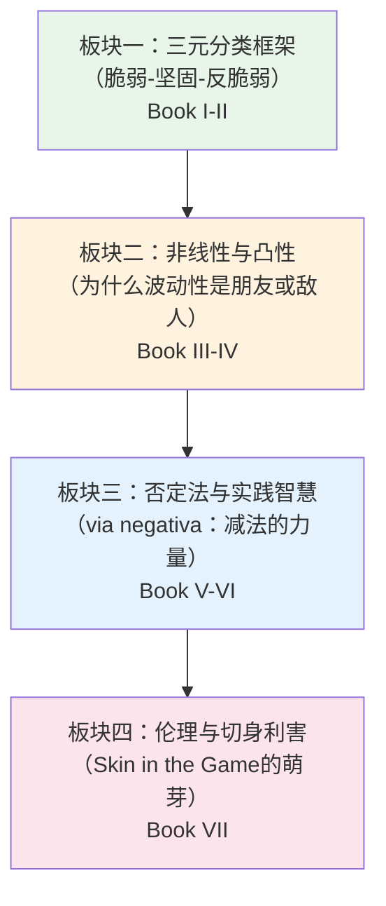
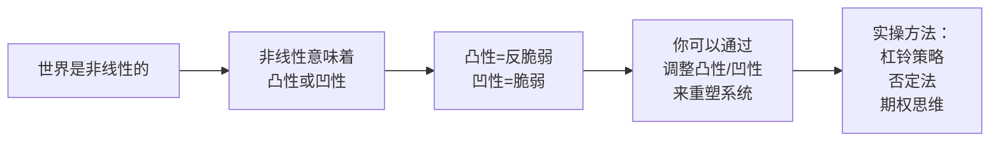
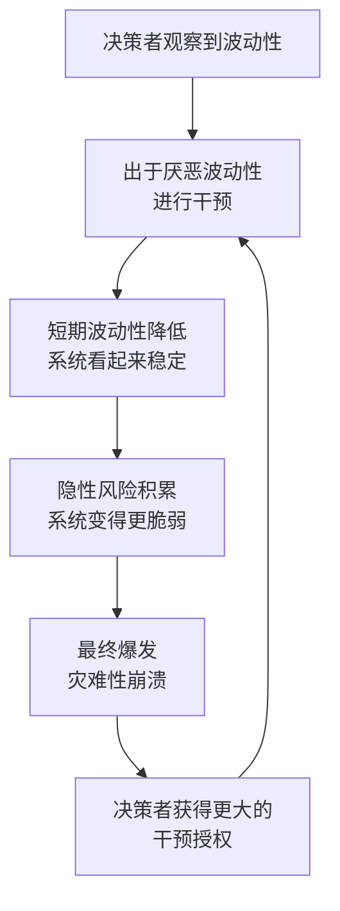
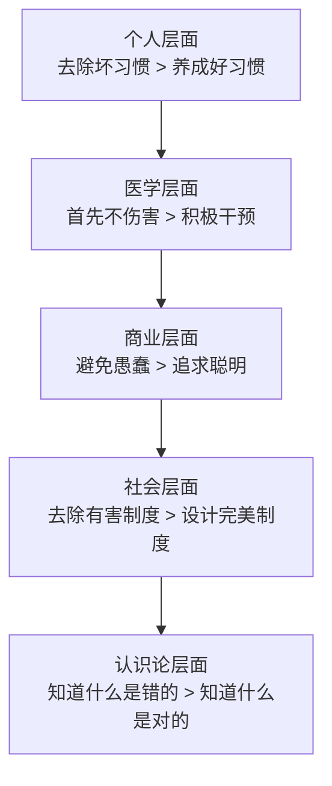
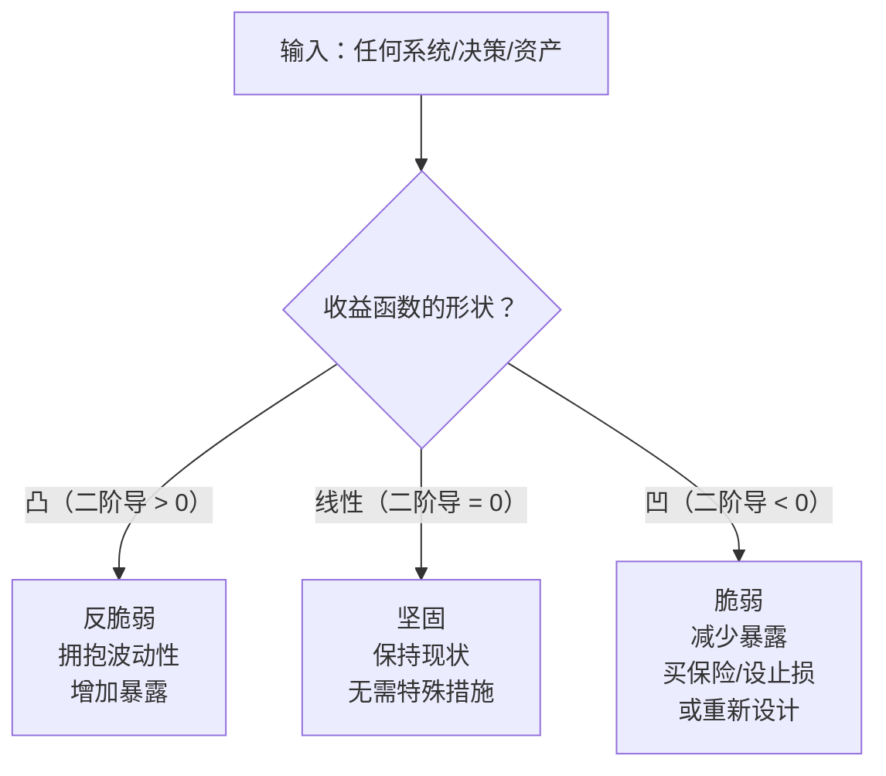
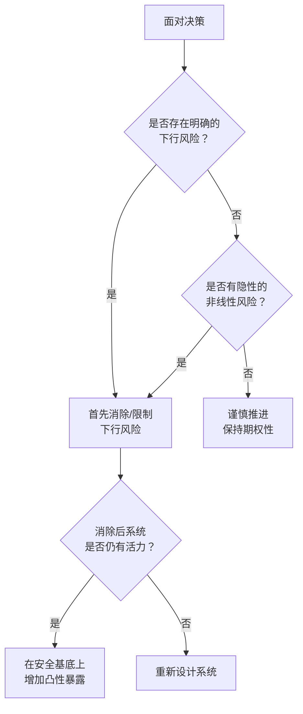

# 《反脆弱》深度拆解

## 一、经济学坐标定位

《反脆弱：从不确定性中获益》（*Antifragile: Things That Gain from Disorder*，2012）是纳西姆·尼古拉斯·塔勒布"不确定性"系列（*Incerto*）的第四部作品，也是整个系列的理论顶点。塔勒布是黎巴嫩裔美国学者，曾在华尔街做过二十余年的期权交易员和对冲基金经理，后转型为纽约大学坦登工程学院的风险工程教授。他的学术背景横跨金融数学、统计学和哲学认识论。

在经济学谱系中，这本书的位置极其独特——它==不属于任何主流经济学派==。塔勒布明确反对新古典经济学的理性人假设、高斯分布假设和均衡分析框架。他与行为经济学（[[《思考，快与慢》 - 丹尼尔·卡尼曼]]）有思想交叉——两人是私交好友——但塔勒布更关注的不是个体认知偏差，而是==系统层面对随机性、波动性和压力源的响应模式==。与奥地利学派（哈耶克、米塞斯）有精神共鸣，尤其在"分散决策优于集中计划""有机演化优于顶层设计"等命题上，但塔勒布从未自认为奥地利学派。

与"不确定性"系列前作的关系：《随机漫步的傻瓜》聚焦于人类对随机性的误判；《黑天鹅》揭示极端事件的不可预测性及其巨大影响；《反脆弱》则是==正面方案==——既然你无法预测黑天鹅，那就构建一个能从黑天鹅中获益的系统。它从"认识论批判"走向了"方法论建设"。

与[[《穷查理宝典》 - 查理·芒格]]的关系：芒格的多元思维模型和塔勒布的反脆弱理论在"冗余设计""安全边际""逆向思维"等维度高度共振，但芒格更偏向价值投资的确定性，塔勒布则拥抱不确定性本身。

**本书在经济思想史中的核心贡献**：塔勒布发明了"反脆弱"（antifragile）这个词——他指出人类语言中长期缺少一个词来描述"脆弱的反面"。==脆弱的反面不是坚固，而是反脆弱——一种在冲击、波动和压力中反而变得更强的属性==。这个概念框架的提出，为风险管理、系统设计、公共政策、医学、教育等领域提供了全新的分析透镜。

---

## 二、全书模型地图

全书分为七卷（Book），共25章，加上附录的技术性补充。可提炼为**四大理论板块**的递进结构：

**核心命题**：你不需要预测未来——你只需要判断一件事物是脆弱的还是反脆弱的。==脆弱性是可以测量的，而风险是不可测量的==。这个认知翻转是全书的元命题：把注意力从"预测事件"转移到"判断系统对事件的响应特征"。

**全书论证的深层逻辑线**：

---

## 三、逐章深度拆解

### 卷一：「反脆弱：一个导论」（第1-3章）

> [!abstract] 建立三元分类框架——全书的概念地基

**【Data层：关键事实】**

塔勒布从一个语言学观察切入：英语和大多数语言中存在"脆弱"（fragile）和"坚固"（robust/resilient），但==没有一个现成的词描述"因冲击而受益"这种属性==。他创造了"antifragile"来填补这个空缺。他用希腊神话中的达摩克利斯之剑（脆弱）、凤凰（坚固）和九头蛇海德拉（反脆弱——每砍掉一个头就长出两个）来建立直觉。

他列举了三元分类的实例：
- **脆弱的**：银行系统、过度优化的供应链、集中式官僚系统、负债过重的企业
- **坚固的**：混凝土、磐石、斯多葛哲学家的心态
- **反脆弱的**：生物进化、餐厅行业（单个餐厅脆弱，整个行业反脆弱）、人体骨骼（受压后变得更密实）、创业生态系统

**【Information层：关键洞察】**

三元分类的深意在于：==大多数人把"坚固"当作脆弱的反面，这是一个根本性的认知错误==。坚固只是中间态——它抵抗冲击但不从冲击中获益。真正与脆弱对称的是反脆弱。

塔勒布还指出一个关键的层级效应：==系统的反脆弱性往往建立在子单元的脆弱性之上==。进化是反脆弱的，但进化要求个体基因是脆弱的（会被淘汰）。餐厅行业是反脆弱的，但单个餐厅是脆弱的（大量倒闭）。硅谷创业生态系统是反脆弱的，但大多数创业公司是脆弱的。这个"层级转换"是理解全书的钥匙之一。

**【Knowledge层：结构化理解】**

三元分类的实质是对==系统对波动性的响应函数==的分类：
- 脆弱 = 波动性增加时，期望收益下降（凹函数）
- 坚固 = 波动性增加时，期望收益不变（线性函数）
- 反脆弱 = 波动性增加时，期望收益上升（凸函数）

这个数学化的重新表述将在后续章节（尤其是卷四）被完全展开。

**【Wisdom层：行动启示】**

你在做任何决策时，==先问自己三个问题==：这件事是脆弱的、坚固的、还是反脆弱的？如果它是脆弱的，你需要减少暴露还是改变结构？你能不能把它推向反脆弱的方向？

> [!tip] 第一性原理审查
> 塔勒布的第一性原理是：**自然界的默认运作方式是非线性的**。线性世界是人类简化模型的产物，不是现实。所有基于线性假设的预测（包括VaR风险模型、GDP预测、气象长期预测）都在隐含地假设脆弱性不存在。一旦你接受非线性作为第一性原理，"反脆弱"就不是一个奇特的概念，而是世界运作的基本模式之一。

> [!danger] 反脆弱压力测试
> 如果三元分类框架本身是错的呢？批评者可能说"反脆弱只是韧性（resilience）的另一种说法"。塔勒布的回应是：韧性是恢复原状，反脆弱是==变得比原来更好==。运动后肌肉纤维撕裂再修复会变得更强——这不是"恢复原状"，而是超越原状。这个区分在实证上是成立的（运动生理学、骨密度研究、免疫系统的适应性反应都支持这一点）。

> [!example] 心智模型照射
> **模型：帕累托分布 vs 高斯分布**。塔勒布的三元分类隐含了一个统计学立场：在帕累托分布（极端斯坦）的世界里，波动性和极端事件是常态，系统必须有能力应对——甚至从中获益。在高斯分布（平均斯坦）的世界里，波动性被驯化，异常值罕见，"坚固"就够了。塔勒布认为经济和社会系统属于极端斯坦，因此反脆弱性是生存的必要条件。

---

### 卷二：「现代化与否定反脆弱性」（第4-7章）

> [!warning] 揭示现代制度如何系统性地压制反脆弱性

**【Data层：关键事实】**

塔勒布在这一卷集中火力批判了几类"反脆弱性的敌人"：

1. **过度干预主义**（interventionism）：政府和央行试图消除经济波动——每次经济轻微下行就注入刺激——结果是压制了小的压力释放，==累积成一次巨大的系统性崩溃==。他以2008年金融危机为核心案例：格林斯潘时代的美联储通过反复降息来"熨平"经济周期，结果让风险在暗处积聚，最终以金融海啸的形式爆发。

2. **苏联-哈佛综合症**：自上而下的"科学化"规划——无论是苏联的计划经济还是哈佛MBA的企业管理——都倾向于消除噪声、追求效率、消除冗余。但==冗余不是浪费，冗余是保险==。你的两个肾脏不是"效率低下"的表现，而是生物进化对反脆弱性的投资。

3. **教鸟飞行的谬误**（lecturing birds how to fly）：学术界经常把"先有理论后有实践"的叙事强加于历史——比如声称工业革命是科学理论推动的。塔勒布通过大量案例指出，==实际的发明和进步大多来自试错和工匠传统，理论是事后的合理化==。蒸汽机的发明早于热力学理论，航空工程的实践早于空气动力学的数学化。

4. **代理人问题与切身利害**：没有"skin in the game"（切身利害）的决策者——如银行家用别人的钱冒险、政客用别人的命运做实验——会系统性地制造脆弱性。==他们获得上行收益，把下行风险转嫁给系统==。

**【Information层：关键洞察】**

塔勒布的核心洞察是：==系统需要压力源（stressors）来保持健康==。就像人体需要适度的运动压力来保持肌肉和骨骼健康、免疫系统需要接触病原体来建立免疫力、森林需要定期的小规模火灾来清除枯木（否则枯木积累会导致毁灭性的大火）。

他提出了"波动性的转移"概念：当你在短期内压制波动性时，你不是消灭了波动性，而是==把它转移到了未来、转移到了更大的尺度上==。就像服用止痛药掩盖症状——疼痛暂时消失了，但病因在恶化。2008年金融危机就是数十年压制小波动后的一次系统性爆发。

**【Knowledge层：结构化理解】**

这里可以提炼出一个核心框架——**干预主义的反脆弱性悖论**：

这形成了一个==正反馈的脆弱性螺旋==。塔勒布称之为"医源性损伤"（iatrogenics）的推广——医学中指医疗行为本身造成的伤害，他将这个概念推广到经济政策、教育、社会治理等所有领域。

**【Wisdom层：行动启示】**

在你自己的生活和事业中，问自己：==你是否在系统性地压制小的波动和不适？== 比如：通过过度计划来消除不确定性？通过过度保护来消除孩子面对挫折的机会？通过过度优化来消除组织中的冗余？如果是，你正在制造脆弱性。

> [!tip] DIKW金字塔映射
> - **Data**：2008年金融危机前，银行系统的杠杆率达到30:1甚至更高
> - **Information**：高杠杆+低波动的组合意味着系统正在积累隐性脆弱性
> - **Knowledge**：干预主义通过压制小波动来积累大波动——这是一个系统性的风险转移机制
> - **Wisdom**：在自己的决策中引入"受控的波动性"——允许小失败发生以避免大崩溃

> [!danger] 反脆弱压力测试
> 有人会反驳：难道央行就应该在经济衰退时袖手旁观吗？塔勒布并非主张完全不干预——他反对的是==系统性地、不对称地干预==（只在下行时干预，而在上行时不收紧）。他承认在极端情况下干预可能是必要的，但他认为当前的制度设计（道德风险、大而不能倒）使得干预本身成为脆弱性的最大来源。这个立场在2008年后得到了广泛的实证支持。

---

### 卷三：「一个非预测性的世界观」（第8-13章）

> [!abstract] 从预测转向定位——理性行动不依赖于预测能力

**【Data层：关键事实】**

这是全书最富方法论意义的部分。塔勒布在这里提出了几个关键概念：

1. **杠铃策略（Barbell Strategy）**：==把资源分配到两个极端，避免中间地带==。比如：将90%的资产放在极度安全的投资（如国债）中，将10%放在极度激进的投机（如风险投资、期权）中。不要把100%放在"中等风险"的投资中——因为"中等风险"在极端斯坦的世界里是一个幻觉。你以为你在中间，其实你不知道自己暴露在什么极端风险下。

2. **期权性（Optionality）**：==拥有选择权但没有义务==。期权的特征是不对称的收益结构——最大损失是有限的（期权费），最大收益是无限的。塔勒布把这个金融概念推广到了人生的一切领域：试错就是一种期权——每次尝试的成本有限（失败了也不至于致命），但一旦成功的收益可能巨大。

3. **绿色木材问题（Green Lumber Fallacy）**：一个著名的轶事——最成功的木材交易员误以为"green lumber"（未干燥的新木材）是"绿色的木材"。但他的无知不影响他赚钱，因为==赚钱需要的知识和叙述性知识是不同的==。塔勒布用这个例子说明：你不需要理解理论就能成功实践——实际上，过多的理论知识可能是一种干扰。

4. **甜葡萄效应与理性化**：与"酸葡萄"（得不到就说不好）相反，塔勒布提出"甜葡萄"——==主动放弃你不需要的东西，让失去变成收获==。他把这与斯多葛哲学联系起来：塞内加通过心理预演最坏情况来减少对损失的恐惧，从而获得一种"情感期权"——下行已被心理消化，上行则是惊喜。

**【Information层：关键洞察】**

杠铃策略的数学直觉是：==在非线性世界中，中间策略的期望收益往往低于极端策略的加权平均==。假设你有100万，方案A是全部投入中等风险资产（预期回报5%，但有被黑天鹅抹去的可能），方案B是90万投入无风险资产（回报1%）+10万投入高风险高回报资产（可能归零，也可能10倍）。方案B的下行被锁死（最多损失10万），但上行是开放的。

期权性的核心在于==不对称性==——你要寻找那些"失败了损失很小、成功了收获巨大"的局面。塔勒布称之为"正凸性"（positive convexity）。反过来，你要避免那些"成功了收获有限、失败了损失巨大"的局面——这就是"负凸性"（negative convexity），也就是脆弱性。

**【Knowledge层：结构化理解】**

塔勒布的决策框架可以总结为一张矩阵：

| | 下行有限 | 下行无限 |
|---|---|---|
| **上行有限** | 中性（无所谓） | ==极度危险（脆弱）== |
| **上行无限** | ==极度有利（反脆弱）== | 赌徒的游戏（避免） |

你要让自己尽可能多地处于"下行有限+上行无限"的象限。这就是期权思维的本质。

**【Wisdom层：行动启示】**

在职业生涯中：你可以保持一份稳定的工作（90%的安全基底），同时投入10%的时间和精力做高风险高回报的副业或创业尝试。不要辞职全身投入一个未经验证的想法（那是消除了安全基底的赌博），也不要100%躺在稳定工作里不做任何尝试（那是放弃了上行期权）。

> [!tip] 第一性原理审查
> 杠铃策略的第一性原理是**凸性偏好**：在不确定性高的环境中，凸函数的期望值严格高于函数在期望值处的值（这是詹森不等式的直接推论）。用人话说就是：==如果你的收益函数是凸的（反脆弱的），波动性越大对你越有利；如果是凹的（脆弱的），波动性越大对你越不利==。杠铃策略通过限制下行（凹的部分）并保持上行开放（凸的部分），在数学上最大化了你从不确定性中获益的能力。

> [!example] 心智模型照射
> **模型：实物期权理论（Real Options Theory）**。塔勒布的期权思维与金融学中的实物期权理论高度契合。一家企业进行小规模试点项目，就是在购买实物期权——投入有限（期权费），但如果试点成功，可以大规模推广（行使期权）。如果试点失败，损失仅限于试点成本。这与塔勒布的"理性试错"（rational tinkering）完全一致。

---

### 卷四：「可选择性、技术与反脆弱的智慧」（第14-18章）

> [!tip] 全书数学化程度最高的部分——凸性效应的系统阐述

**【Data层：关键事实】**

1. **詹森不等式的推广**：塔勒布把概率论中的詹森不等式（Jensen's Inequality）作为反脆弱性的数学骨架。对于凸函数f，E[f(x)] >= f(E[x])——==函数作用在随机变量上的期望值，大于等于函数作用在期望值上的值==。这意味着如果你的收益函数是凸的，随机性（波动性）是你的朋友。

2. **旅客问题**：一个旅客的平均旅行时间是1小时，但如果考虑交通波动（堵车、事故），实际到达时间的期望值总是==大于==1小时——因为交通延误的分布是非对称的（你可能提前5分钟到，但可能迟到2小时）。这就是凹性——波动性对旅客不利。反过来，如果你是一个有灵活性的人（比如你可以选择多条路线、可以改期），波动性对你有利——你总是能选择最好的结果。

3. **1/N策略与天真多样化**：塔勒布援引了实证研究表明，在投资组合构建中，简单的等权重分配（1/N策略）在样本外的表现往往优于复杂的均值-方差优化模型。原因是：复杂模型对参数估计误差敏感（脆弱），而简单策略对误差鲁棒（反脆弱）。

4. **"教鸟飞行"的详细论证**：塔勒布通过对技术史的梳理，论证了一个反直觉的命题——==技术进步主要不是来自理论的应用，而是来自实践者的试错；理论往往是事后的叙事合理化==。他列举了：喷气发动机（实践先于理论）、轮子（没有理论指导）、建筑（哥特式大教堂的建造者不懂材料力学）、医学（阿司匹林使用了几十年后才搞清楚其作用机制）。

**【Information层：关键洞察】**

凸性效应是一个==统一性框架==，它把之前零散的概念——杠铃策略、期权性、试错法、反脆弱性——整合为一个数学原理。你不需要记住所有这些概念的细节，你只需要问一个问题：==我的收益函数是凸的还是凹的？==

如果是凸的：增加波动性、增加尝试次数、增加随机暴露——你会受益。
如果是凹的：减少波动性、减少暴露、增加确定性——否则你会受损。

塔勒布的"教鸟飞行"论证的深层含义是：==试错法是一种具有凸性的知识生产方式==。每次试验的成本有限（失败了你知道此路不通），但偶尔的成功可能带来巨大的收益（一次成功的发明可能改变世界）。相反，自上而下的理论驱动方式具有凹性——一个错误的理论可能导致大规模的灾难性后果（比如基于错误理论的经济政策）。

**【Knowledge层：结构化理解】**

| 属性 | 凸性（反脆弱） | 凹性（脆弱） |
|---|---|---|
| 波动性增加时 | 期望收益上升 | 期望收益下降 |
| 错误的代价 | 小且有限 | 大且可能致命 |
| 正确的收益 | 大且开放 | 小且封顶 |
| 知识生产方式 | 试错、工匠传统 | 理论驱动、自上而下 |
| 典型策略 | 杠铃、期权 | 集中押注、优化 |
| 示例 | 风险投资组合、进化 | 银行杠杆、核电站 |

**【Wisdom层：行动启示】**

在评估任何机会或风险时，==画出你的收益曲线==。横轴是随机变量（市场、环境、不确定因素），纵轴是你的收益/损失。如果曲线是凸的——拥抱波动性。如果曲线是凹的——要么重新设计收益结构（比如买保险、设止损），要么减少暴露。

> [!danger] 反脆弱压力测试
> 塔勒布对"教鸟飞行"的论证是否过度了？批评者指出，现代药物研发、半导体设计、航天工程等领域确实是理论驱动的。塔勒布的回应是：他反对的不是理论本身，而是"理论→实践"这个因果叙事的垄断地位。他承认理论在某些领域有用，但坚持认为在复杂系统中（如经济、社会、生态），试错远比理论驱动更有效。这是一个有实证支持但需要具体情境判断的立场——==不应无条件推广到所有领域==。

---

### 卷五：「非线性与非线性」（第19-21章）

> [!abstract] 脆弱性检测启发法——不需要预测就能管理风险

**【Data层：关键事实】**

1. **脆弱性检测启发法**：塔勒布提出了一个实用工具——==你不需要知道黑天鹅何时到来，你只需要知道谁在面对黑天鹅时会崩溃==。具体方法：观察一个系统对变量的小幅变化如何反应。如果一个小幅变化就导致不成比例的损失，那个系统就是脆弱的。如果一个小幅变化导致不成比例的收益，那个系统就是反脆弱的。

2. **非线性的来源**：塔勒布分析了几个典型的非线性来源——规模效应（城市人口翻倍，基础设施需求可能增加三倍）、挤压效应（高峰期的交通：车辆增加10%，通行时间可能增加50%）、阈值效应（温度从35°C升到37°C和从37°C升到39°C对人体的影响完全不同）。

3. **大的是脆弱的**：塔勒布论证了一个重要命题——==规模越大，对波动性的敏感度越高（脆弱性越强）==。一家小银行倒闭不会引发系统性危机，但雷曼兄弟的倒闭引发了全球金融海啸。一个小国的政策失误影响有限，但一个大国或一个全球化系统的政策失误可能是灾难性的。

**【Information层：关键洞察】**

脆弱性检测的核心突破在于：==它把风险管理从预测范式转移到了测量范式==。你不需要预测地震何时发生（这是不可能的），你只需要知道哪些建筑在地震中会倒塌（这是可以测量的）。同理，你不需要预测金融危机何时到来，你只需要知道哪些机构在危机中会破产。

"大的是脆弱的"这个命题包含了一个对现代经济学的根本挑战：==规模经济的收益曲线在某个点之后会翻转==。企业做大的效率收益在达到某个阈值后，会被复杂性、协调成本和脆弱性的增加所抵消——甚至被远远超过。

**【Knowledge层：结构化理解】**

脆弱性检测可以形式化为一个==二阶效应分析==：

如果变量x变化Δx时，系统收益的变化不成比例：
- Δ损失 > k·Δx（k是某个常数）→ 脆弱（凹性）
- Δ收益 > k·Δx → 反脆弱（凸性）
- Δ收益 ≈ k·Δx → 坚固（线性）

你在看到的不是一个简单的线性关系，而是加速度——==变化的变化==。

**【Wisdom层：行动启示】**

在评估你的生活、事业或投资的脆弱性时：对关键变量进行小幅的"压力测试"。比如：如果你的收入下降10%，你的生活质量是下降10%（线性，坚固）还是下降30%（加速下降，脆弱）？如果一个关键客户流失，你的公司是轻微受损还是面临生存危机？如果答案是后者，你有脆弱性暴露，需要重新设计结构。

> [!tip] DIKW金字塔映射
> - **Data**：雷曼兄弟破产导致全球金融系统冻结
> - **Information**：大型金融机构的倒闭有非线性的系统性后果
> - **Knowledge**：规模与脆弱性正相关——"大而不能倒"实际上是"大而必然倒"
> - **Wisdom**：在设计系统时主动限制规模、保持模块化、允许局部失败

---

### 卷六：「否定法」（第21-24章）

> [!tip] 减法的力量——少即是多的哲学根基

**【Data层：关键事实】**

1. **Via Negativa（否定法）**：塔勒布从神学（否定神学：通过说明上帝"不是什么"来接近上帝的本质）借用了这个概念，将其推广为一个通用决策原则——==通过去除有害的东西来改善，而不是通过添加新东西来改善==。

2. **减法知识优于加法知识**：塔勒布论证说，==我们知道什么是错的远比知道什么是对的更可靠==。你不知道什么食物会让你健康（营养学研究充满矛盾），但你相当确定吸烟和过量饮酒是有害的。你不知道什么经济政策会带来繁荣，但你知道恶性通货膨胀和过度管制是有害的。

3. **医源性损伤**：塔勒布用大量医学史案例说明医疗干预的负面效果——放血疗法在几百年里杀死的人可能比它治愈的人多。他的论点不是反对医学，而是说==在健康人或轻症患者身上，干预的预期损害很可能超过预期收益==。只有在严重疾病时（下行风险已经很大），干预的预期收益才明显超过预期损害。

4. **林迪效应（Lindy Effect）**：对于非易损品（书籍、技术、思想），==已经存活的时间越长，预期剩余寿命越长==。一本已经流传500年的书预计还能再流传500年；一本新书的预期寿命很短。这个效应适用于思想、技术、文化传统——但不适用于有自然寿命的事物（如生物体）。

**【Information层：关键洞察】**

否定法的深刻之处在于它揭示了==知识的不对称性==。"吸烟有害"这种否定性知识比"跑步有益"这种肯定性知识在统计上要可靠得多、稳健得多。原因在于：证伪比证实容易得多（波普尔的科学哲学）；消除明确的害处比添加不确定的好处更有效。

林迪效应是一个==预测非易损品寿命的启发法==，它为塔勒布的反预测立场提供了一个例外：你虽然不能预测具体事件，但你可以根据已存活时间来估算非易损品的预期剩余寿命。一种已经使用了3000年的技术（如轮子、书写）大概率会继续存在；一种仅存在了5年的技术有相当概率会消失。

**【Knowledge层：结构化理解】**

否定法的应用层级：

林迪效应的应用矩阵：

| 类别 | 适用 | 不适用 |
|---|---|---|
| 书籍/思想 | 适用 | — |
| 技术 | 适用 | — |
| 企业 | 部分适用 | — |
| 生物体 | — | 不适用（有自然寿命） |
| 易腐品 | — | 不适用 |

**【Wisdom层：行动启示】**

==在做决策时，先做减法==。不是问"我应该做什么"，而是问"我应该停止做什么"。在投资中，巴菲特的"不亏钱规则"就是否定法的体现——避免大的亏损比追求大的收益更重要。在健康管理中，戒除明确有害的行为（吸烟、久坐、过量糖摄入）比追求某种神奇的补充剂更有效。在事业中，避免灾难性的错误比追求完美的决策更重要。

> [!example] 心智模型照射
> **模型：查理·芒格的"反向思维"（Inversion）**。芒格说"告诉我我会死在哪里，我就不去那里"——这与塔勒布的否定法完全共振。两人的共同洞察是：==在复杂系统中，避免失败比追求成功更可行、更可靠==。这与工程学中的故障模式分析（FMEA）也高度一致：先找出所有可能的故障模式并消除，比设计一个"完美"的系统更有效。

> [!danger] 反脆弱压力测试
> 林迪效应在多大程度上是可靠的？批评者指出：打字机存活了100多年但在20年内就被电脑淘汰了。塔勒布的回应是：林迪效应是一个==概率性陈述==，不是一个确定性预测。它说的是"已存活越久的东西，预期剩余寿命越长的概率越大"，而不是"已存活越久的东西永远不会消失"。此外，林迪效应适用于一般类别（"手写文字"而非"钢笔"），更细分的子类别可能在具体的技术替代中消失。这个限定条件是重要的。

---

### 卷七：「脆弱性与反脆弱性的伦理」（第25章及后记）

> [!warning] 全书的伦理收尾——指向下一本书《切身利害》

**【Data层：关键事实】**

塔勒布在最后一卷将反脆弱理论延伸到了伦理领域。他的核心伦理命题：==如果你的行为可能造成的伤害由别人承担，而收益由你享受，你就在制造不道德的脆弱性==。

他特别批判了三类人：
1. **没有"切身利害"的专家**：预测错了不承担后果的经济学家和分析师
2. **转嫁风险的金融从业者**：银行家用储户和纳税人的钱冒险
3. **制造脆弱性的政策制定者**：中央集权的规划者把失败后果推给社会

他提出了"汉谟拉比法典"原则——古巴比伦法律规定如果建筑师建造的房屋倒塌压死了屋主，建筑师要被处死。这确保了==建造者和使用者之间的风险对称==。

**【Information层：关键洞察】**

这一卷的核心洞察是：==反脆弱性有一个伦理维度——你不能通过让别人变得脆弱来让自己反脆弱==。代理人问题（agency problem）的本质就是反脆弱性的不当转移——代理人把上行收益留给自己，把下行风险转嫁给委托人。

塔勒布认为，这个伦理原则也解释了为什么小型和分散化的系统往往优于大型集中化的系统——在小型系统中，决策者和后果承担者往往是同一个人（有切身利害），而在大型系统中，决策者和后果承担者分离（没有切身利害）。

**【Knowledge层：结构化理解】**

伦理-反脆弱性矩阵：

| | 获取上行收益 | 承担下行风险 |
|---|---|---|
| **道德的** | 是 | ==是==（风险对称） |
| **不道德的** | 是 | ==否==（风险转嫁） |
| **英雄的** | ==否== | 是（为他人承担风险） |

塔勒布最敬佩的是第三类——为他人承担下行风险而不索取上行收益的人（英雄、创业者、消防员）。他最鄙视的是第二类——享受上行收益但把下行风险转嫁给别人的人（享受政府纾困的银行家）。

**【Wisdom层：行动启示】**

在你的每一个决策中问自己：==如果这个决策失败了，谁承担后果？是我自己还是别人？== 如果后果主要由别人承担，你有义务要么重新分配风险，要么放弃这个决策。这不仅是伦理要求，也是系统性的反脆弱性设计——只有当决策者自身暴露在后果之下时，系统才能从错误中学习和进化。

> [!tip] 第一性原理审查
> "切身利害"原则的第一性原理是**信息对称要求**。当决策者不承担后果时，系统失去了一个关键的负反馈回路——错误决策不会被修正，因为决策者没有感受到痛苦。进化能工作，正是因为不适应的个体被淘汰——如果不适应的个体可以把淘汰压力转嫁给其他个体，进化就会失灵。同理，如果失败的企业可以被纾困，市场竞争就失灵了。

---

## 四、核心经济框架提炼

### 框架一：三元分类 × 凸性分析

全书的元框架可以浓缩为一个核心操作：==对任何系统或决策，判断其收益函数的凸凹性==。

### 框架二：杠铃策略的通用化

杠铃策略不仅适用于投资，它是一个==通用的资源配置原则==：

- **投资杠铃**：90%安全资产 + 10%高风险高回报资产
- **职业杠铃**：稳定的主业 + 高探索性的副业/创业尝试
- **知识杠铃**：经过林迪效应验证的经典知识 + 最前沿的实验性知识（忽略中间的流行知识）
- **社交杠铃**：少数深度关系 + 大量弱连接（忽略中间的"泛泛之交"）
- **时间杠铃**：极度专注的深度工作时段 + 完全放松的闲散时段（忽略中间的"假装在工作"）

### 框架三：否定法决策树

### 框架四：代理人-脆弱性检验

在评估任何经济制度或商业安排时，问三个问题：
1. 决策者是否有切身利害（skin in the game）？
2. 收益和风险是否对称分配？
3. 失败信号是否能传导到决策层？

如果三个答案中有一个是"否"，这个系统==正在积累脆弱性==。

---

## 五、预测与现实对照

塔勒布在本书中（2012年出版）做出的几个关键判断，以及其后的现实对照：

| 塔勒布的判断 | 后续现实 | 验证程度 |
|---|---|---|
| 大型银行系统性风险未被消除，"大而不能倒"问题会持续 | 2023年硅谷银行、签名银行、第一共和银行连续倒闭，引发区域性银行危机 | ==部分验证==：银行系统脆弱性依然存在 |
| 过度优化的全球化供应链是脆弱的 | 2020-2022年新冠疫情导致全球供应链大面积中断 | ==强验证==：正是塔勒布所预警的脆弱性爆发 |
| 央行持续量化宽松会积累系统性风险 | 2022年全球通胀飙升、加息导致资产价格剧烈调整 | ==部分验证==：长期低利率的后果确实在显现 |
| 依赖预测模型的风险管理会在极端事件中失败 | 多个量化基金在极端市场条件下遭受重大损失 | ==持续验证==：模型风险（model risk）仍是金融行业的核心问题 |
| 小型和分散化系统比大型集中化系统更具韧性 | 分布式系统（去中心化金融、远程办公）在疫情中表现出显著优势 | ==部分验证==：但大型科技平台也展示了规模优势 |

> [!warning] 实证结论与价值判断的区分
> 上表中的"验证"是基于事后对照的归纳判断，不是严格的因果证明。塔勒布自己会反对过度从事后数据中提取因果叙事。他的核心主张不是"我预测了X会发生"，而是"具有Y特征的系统在面对Z时会表现出脆弱性"——这是一个结构性判断，不是时间性预测。

---

## 六、学派争鸣

### 塔勒布 vs 主流经济学（新古典/新凯恩斯）

| 议题 | 主流经济学 | 塔勒布 |
|---|---|---|
| 分布假设 | 高斯分布（正态分布） | ==帕累托分布（肥尾分布）== |
| 风险管理 | VaR、CAPM、有效市场假说 | 脆弱性检测、杠铃策略 |
| 预测 | 定量预测模型 | ==预测在极端斯坦不可行== |
| 干预 | 反周期政策、央行调控 | 最小化干预、允许小的失败 |
| 理性人假设 | 理性经济人（homo economicus） | 人类在不确定性下的行为远非理性 |
| 效率观 | 效率是核心追求 | ==冗余是必要的保险== |

### 塔勒布 vs 行为经济学（卡尼曼）

塔勒布与卡尼曼是好友和思想盟友，但有重要分歧：
- 卡尼曼的焦点是==个体认知偏差==，塔勒布的焦点是==系统对波动性的响应==
- 卡尼曼主张通过"减偏"（debiasing）来改善决策，塔勒布认为减偏在实践中几乎不可能——==更有效的方式是改变你的收益结构而不是改变你的认知==
- 卡尼曼的前景理论依赖于实验室实验，塔勒布质疑实验室结果能否推广到真实世界的极端情境

### 塔勒布 vs 芒格/巴菲特

塔勒布和芒格在很多底层理念上共振（安全边际、反向思维、怀疑过度自信），但策略取向不同：
- 芒格/巴菲特追求的是==在确定性中赚钱==——找到有护城河的好企业，低价买入，长期持有
- 塔勒布追求的是==在不确定性中赚钱==——通过期权性和凸性，在极端事件中获利
- 芒格追求"少数大注"（集中投资），塔勒布追求"大量小注"（分散试错）

### 塔勒布 vs 有效市场假说（法玛）

塔勒布对尤金·法玛的有效市场假说（EMH）的批判最为尖锐。EMH的核心假设是价格充分反映了所有可用信息，塔勒布认为这在极端斯坦的世界里是危险的幻觉——==市场可能在99%的时间看起来有效，但在1%的极端时刻完全失效，而恰恰是那1%决定了你的生死==。

---

## 七、实践决策指南

### 个人财务

1. **杠铃配置你的资产**：把大部分资产放在极安全的地方（现金、短期国债），把一小部分放在极高风险但上行开放的投资中。==避免"中等风险"的投资==，因为在肥尾分布的世界里，你对中等风险的风险估计几乎必然是错的。

2. **否定法管理支出**：与其追求更高的收入，先消除那些确定无疑在损害你财务健康的行为——高利率信用卡债务、冲动消费、没有意义的订阅。

3. **减少脆弱性暴露**：确保你的固定支出远低于你的最低可预期收入。==储蓄不是为了回报，而是为了反脆弱性==——它是你的期权费，购买的是在危机中有选择权的自由。

### 职业发展

4. **构建职业期权性**：不要把职业前途押在一个单一技能或单一雇主上。培养多种技能组合，维护多个收入来源的可能性。==你的职业应该是一个杠铃==——有一个稳定的基底，同时有多个上行期权。

5. **理性试错法**：在做重大职业转换之前，先做小规模的测试。写一个副业项目、做一次兼职咨询、参加一个行业活动——这些都是低成本的"期权"，帮你在不冒大风险的情况下获取信息。

6. **林迪效应筛选知识**：在学习和技能投资中，==优先学习经过长时间检验的知识==（数学、写作、基本经济学原理、心理学基础），而不是追逐最新的流行趋势。一项已经有价值100年的技能大概率在未来100年里仍然有价值。

### 商业决策

7. **为你的企业做脆弱性扫描**：识别你的关键依赖——单一大客户、单一供应商、单一技术平台、单一渠道。==每一个"单一"都是一个脆弱性来源==。通过分散化来降低脆弱性。

8. **保持组织冗余**：不要把效率优化推到极限。保留一定的人员冗余、现金冗余、时间冗余。==冗余在正常时期看起来像浪费，在危机中就是救命的保险==。

9. **允许可控的失败**：在组织中建立"快速失败"（fail fast）的文化。鼓励小规模实验，容忍小的亏损和失败。这是用小的成本购买"学习期权"——每次失败都给你关于什么不起作用的信息。

10. **确保决策者有切身利害**：如果管理者的薪酬与公司的长期表现不挂钩、如果顾问的建议失败了他不承担后果、如果基金经理用客户的钱冒险——==这些都是脆弱性的制度根源==。尽可能让决策者和后果承担者是同一群人。

### 认知与学习

11. **用否定法管理信息**：与其追求"读更多"，不如先停止读那些确定无价值的东西——社交媒体上的噪声、短期新闻、没有经过林迪效应检验的"新理论"。==减少信息输入的噪声比增加信号更有效==。

12. **拥抱实践知识**：不要等到"完全理解理论"才开始行动。塔勒布的"教鸟飞行"告诉你：==在复杂领域，试错中学到的远比理论学习多==。先做起来，在实践中修正。

---

## 八、费曼终极检验

> [!abstract] 如果你要向一个聪明的外行人解释《反脆弱》的核心思想，你会怎么说？

想象你有一个包裹要寄出去。你在包裹上贴了一个标签："脆弱——小心轻放"。这意味着这个包裹害怕被摇晃、被摔。

现在想象另一种包裹，上面的标签写的是："请用力摇晃——越摇越好"。这种包裹不仅不怕被摇，它==因为被摇而变得更好==。塔勒布说这种东西在我们的语言里连个名字都没有——所以他发明了一个词叫"反脆弱"。

你的骨骼就是反脆弱的——承受压力后会变得更密实。你的免疫系统也是——接触过病原体后会变得更强。你的肌肉是——锻炼撕裂肌纤维后重新生长得更粗壮。进化本身是最大的反脆弱系统——通过淘汰不适应的个体，让整个物种变得更强。

现在关键来了：我们的经济系统、企业组织、风险管理方式，在过去几十年里被设计成了一个==害怕摇晃的包裹==——而不是一个越摇越好的包裹。我们拼命追求稳定、消除波动、消除冗余、追求效率——但这样做的结果是，我们把小的、可承受的波动压制下去了，却让系统变得对大的、灾难性的冲击毫无抵抗力。就像你一直不让森林有小火灾，枯木堆积了几十年，最终一把大火把整片森林烧光。

塔勒布的处方很简单：==不要试图预测黑天鹅——你做不到。相反，让你自己变成那种"越摇越好"的包裹==。怎么做？

第一，杠铃策略：把90%的身家放在绝对安全的地方，10%放在可能暴涨也可能归零的地方。这样你永远不会被摧毁（下行有限），但偶尔能捡到大便宜（上行无限）。

第二，否定法：不要问"我应该做什么"，先问"我应该==停止做什么=="。去掉明确有害的东西，比添加不确定有益的东西更可靠。

第三，保持期权性：让自己处在一种"失败了损失很小，成功了收获很大"的位置。每一次低成本的尝试都是一张彩票，但它是一张有正期望值的彩票。

第四，确保你有切身利害：如果你给别人建议但自己不承担后果、如果你用别人的钱冒险——你就在制造系统性的脆弱性。真正的智慧是把自己的皮肤放在游戏里。

==这就是全书的本质：在一个你无法预测的世界里，你唯一的理性策略不是更好地预测，而是构建一个不需要预测就能繁荣的系统。==

---

> [!quote] 全书最核心的一句话
> ==「风（波动性）吹灭蜡烛（脆弱的），却使篝火（反脆弱的）越烧越旺。你要成为篝火，渴望风。」==
> —— 纳西姆·尼古拉斯·塔勒布，《反脆弱》

---

**相关阅读**：[[《黑天鹅》 - 纳西姆·塔勒布]] | [[《随机漫步的傻瓜》 - 纳西姆·塔勒布]] | [[《切身利害》 - 纳西姆·塔勒布]] | [[《思考，快与慢》 - 丹尼尔·卡尼曼]] | [[《穷查理宝典》 - 查理·芒格]]
