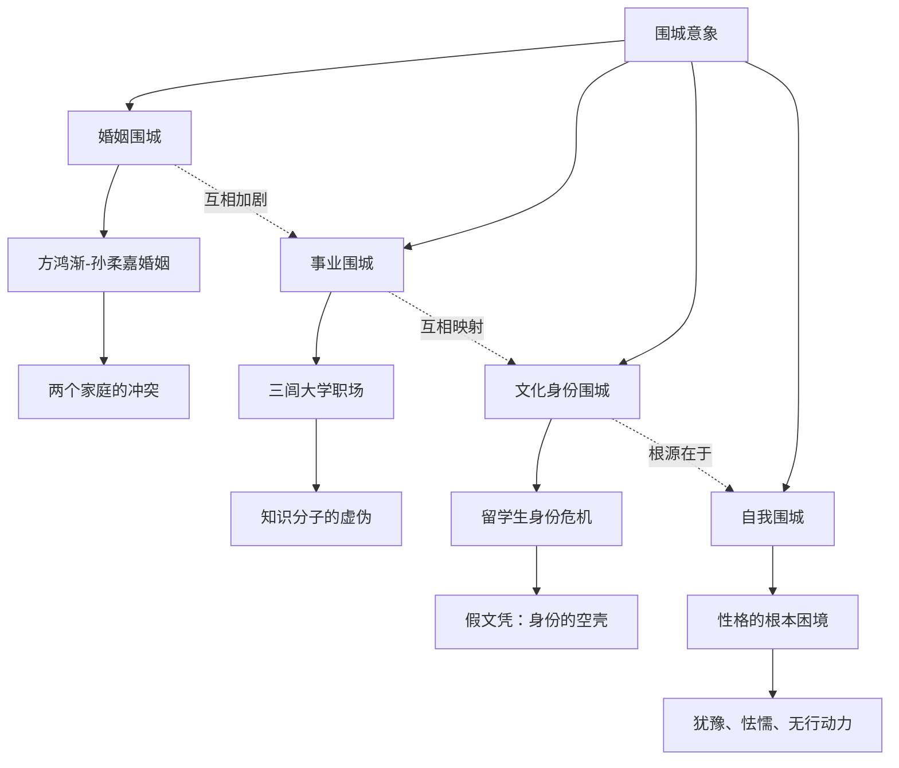
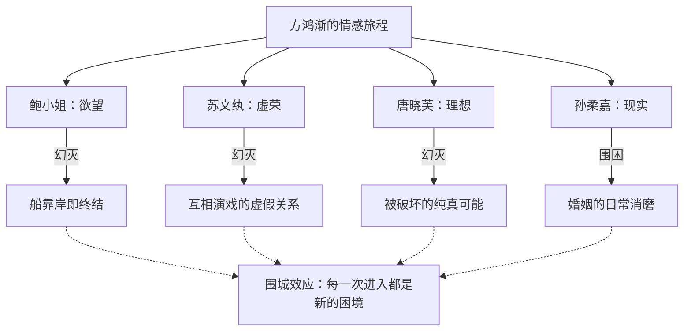
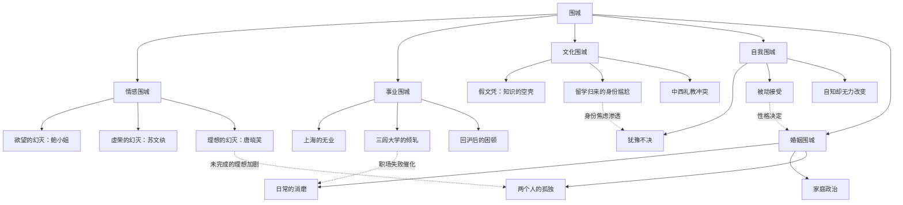

## 一、文学坐标定位

> [!abstract] 速览
> 《围城》是钱钟书创作于1944-1946年间的长篇小说，1947年由上海晨光出版公司出版。小说以留学归来的方鸿渐为主线，讲述了他从归国船上到上海、再到内地三闾大学、最终回到上海的一段人生旅程。在这段旅程中，方鸿渐经历了与鲍小姐、苏文纨、唐晓芙、孙柔嘉四个女性的情感纠葛，也经历了职场的尔虞我诈、婚姻的围困与幻灭。

钱钟书（1910-1998），字默存，号槐聚，江苏无锡人。清华大学外文系毕业，后赴英国牛津大学留学，获副博士学位，又赴法国巴黎大学研究。他是20世纪中国最渊博的学者之一，兼通中西文学、哲学、心理学，著有学术巨著《管锥编》《谈艺录》及散文集《写在人生边上》、短篇小说集《人·兽·鬼》。《围城》是他==唯一的长篇小说==，却足以奠定他在中国现代文学史上的独特地位。

《围城》在中国文学脉络中是一部极其独特的存在。它不属于任何流派——不是鲁迅式的启蒙叙事，不是茅盾式的社会写实，不是沈从文式的田园抒情，也不是张爱玲式的都市传奇。它最接近的西方传统是==知识分子讽刺小说==，可以与英国的伊夫林·沃（Evelyn Waugh）、赫胥黎（Aldous Huxley）的作品对话，也与塞万提斯的[[《堂吉诃德》]]中对理想主义者的反讽遥相呼应。在法国文学中，它与福楼拜对庸人的冷峻解剖（尤其是[[《包法利夫人》]]）有着气质上的亲缘。

小说的时代背景是==抗战时期==（约1937年前后），但钱钟书刻意回避了战争的正面描写。战争只是远处的隆隆雷声，前景中上演的是知识分子的虚荣、怯懦、自欺与互相倾轧。这一选择本身就是一种态度：当民族叙事要求所有文学都为抗战服务时，钱钟书选择了写人性本身的"围城"——那些不因战争而起、也不因和平而灭的困境。

---

## 二、叙事结构解析

> [!note] 空间移动式结构
> 《围城》的叙事结构不是传统的线性情节推进，而是以空间的移动为骨架：归国的船上 → 上海 → 前往三闾大学的旅途 → 三闾大学 → 返回上海（婚后生活）。每一个空间转换都对应着方鸿渐人生的一个阶段和一重"围城"。

这种结构的精妙之处在于它呈现了一个==逐步收窄的空间==：从大海上的开阔，到上海的都市社交圈，到内地小城的大学，再到一间公寓里的夫妻对峙。空间越来越小，方鸿渐的自由度也越来越低——这正是"围城"意象的空间化表达。

**为什么这样写？** 钱钟书没有选择传统的"成长小说"结构（主人公历经磨难最终成熟），也没有选择"幻灭小说"的典型结构（从高处坠落）。方鸿渐从来就不在"高处"——他一开始就是个拿假文凭的庸人。钱钟书给他的不是"跌落"，而是==一次次侧向的滑动==——从一个围城滑入另一个围城，每一次移动都以为是出路，每一次到达都发现是新的困境。

小说共九章，大致可分为四个板块：

1. **第一至四章：上海社交围城**——方鸿渐归国后在上海的社交生活，与苏文纨、唐晓芙的情感纠葛。这一板块的核心是==情感的围城==：你得不到的永远在骚动，你得到的未必是你要的。
2. **第五章：旅途——人生的寓言**——从上海到三闾大学的漫长旅途，是全书最精彩的篇章之一。旅途本身就是人生的隐喻：颠簸、意外、同伴之间的龃龉、到达目的地时的失望。
3. **第六至七章：三闾大学——职场围城**——知识分子在象牙塔内的勾心斗角、嫉妒倾轧。这一板块最集中地体现了钱钟书对知识分子的讽刺。
4. **第八至九章：婚姻围城**——方鸿渐与孙柔嘉结婚后的生活，两个家庭的冲突，夫妻关系的磨损与崩裂。

> [!important] 结尾的钟声
> 小说的结尾是一段极为著名的文字：那只祖传的老钟从容自在地打起来，仿佛积蓄了半天的时间，等夜深人静，搬出来一一细数。方鸿渐和孙柔嘉吵完架，各自睡去，而那座老钟敲出的时间，==比他们手表上的时间慢了五个钟头==。这个结尾的寓意极其丰富：老钟属于另一个时代，它敲出的时间不属于"现在"——就像方鸿渐的人生，总是与当下错位，总是在过时的期待和已逝的可能之间摇摆。

**苏格拉底追问**：为什么钱钟书选择让小说结束在一个钟声而不是一个事件上？因为方鸿渐的困境不是某个具体事件造成的，也不可能被某个事件解决。钟声敲出的是==时间本身的嘲讽==——它不在乎你经历了什么，它只管自顾自地走。小说不需要一个"结局"，因为围城没有出口——钟声之后，明天还会来，新的一天会带来新的争吵、新的失望、新的围困。

---

## 三、核心意象与主题网络

### 核心意象：围城

> [!tip] 黄金圈拆解
> - **Why**：钱钟书为什么选择"围城"作为核心意象？因为他观察到人性中一个根本性的悖论——人总是想进入自己所不在的状态，又想逃离自己所在的状态。这个悖论不限于婚姻，它贯穿了人生的所有领域：事业、情感、社交、自我认知。
> - **How**：通过方鸿渐的每一次"选择"（实际上是被推动）来呈现围城效应——每一个他进入的空间（恋爱、大学、婚姻）都在进入之后变成了牢笼。
> - **What**：书中借苏文纨之口引用法国谚语："婚姻是一座被围困的城堡，城外的人想冲进去，城里的人想逃出来。"

**文本细读**："围城"这个意象在小说中至少有四重展开：

1. **婚姻的围城**——这是最表层的含义。方鸿渐稀里糊涂地和孙柔嘉结了婚，婚后发现两人在性格、家庭背景、生活习惯上的重重矛盾。婚姻不是爱情的完成，而是幻想的终结。

2. **事业的围城**——方鸿渐在上海找不到体面的工作，去了三闾大学以为找到了栖身之所，却发现大学里的人际关系比上海更复杂、更压抑。逃离三闾大学后回到上海，又陷入更深的职业困境。

3. **文化身份的围城**——方鸿渐是留学生，但他的留学是失败的（买了假文凭），他既不是真正的"西化人"，也无法回到传统中国人的角色中。他被困在中西文化的夹缝里，两边都不属于。

4. **自我的围城**——这是最深层的含义。方鸿渐最根本的围城是他自己——他的犹豫、怯懦、虚荣和缺乏行动力，构成了一座他永远无法逃出的内心城堡。外部环境可以改变，但他无法改变自己。

**概念网络**：

**苏格拉底追问**：围城是客观存在的，还是主观构建的？换言之，是环境困住了方鸿渐，还是方鸿渐困住了自己？钱钟书的回答似乎是两者兼有，但后者更根本。因为小说中也有不被困住的人——赵辛楣虽然也经历挫折，但他的行动力和务实让他总能找到出路。围城对不同的人有不同的厚度：对懦弱的人，它是铜墙铁壁；对果断的人，它不过是一道矮墙。

---

### 主题一：知识分子的虚荣与空洞

> [!tip] 黄金圈拆解
> - **Why**：钱钟书为什么要如此尖刻地讽刺知识分子？因为他自己就是知识分子中的一员，他比任何人都更了解这个群体的弱点——他们用学问装饰虚荣，用清高掩盖无能，用言辞代替行动。
> - **How**：通过极度精准的细节描写和无处不在的机智比喻，让每个知识分子角色的虚伪在读者面前无处遁形。
> - **What**：假文凭、伪学术、虚假的文化优越感、知识分子之间的互相鄙视。

**文本细读**：方鸿渐的假文凭是这一主题最精妙的象征。他在欧洲留学四年，换了三所大学，什么学位也没拿到。回国前花钱买了一张"克莱登大学"的假博士文凭。这个细节的讽刺层次极为丰富：

- 第一层：方鸿渐知道文凭是假的，但他需要它来应对社会期待——这揭示了==学历的社会性本质==，文凭不是知识的证明，而是身份的通行证。
- 第二层：他明明知道是假的，却在被人戳穿时感到羞耻和愤怒——他对自己的欺骗已经产生了一种奇怪的"所有权"感，仿佛用了假文凭就有了真文凭的尊严。
- 第三层：讽刺的极致在于——在三闾大学，那些拿着真文凭的教授们，其学术水平和人格品质未必比方鸿渐的假文凭更"真"。韩学愈同样有假文凭且面不改色地使用它，李梅亭满口道德文章实则猥琐龌龊。==真文凭包裹的可能是同样空洞的内核==。

三闾大学的段落是钱钟书对学术界讽刺的集中火力。校长高松年是个政客型的学者，表面上道貌岸然，实则权谋算计；韩学愈阴沉刻板，靠盗用他人成果维持学术声誉；李梅亭贪财好色，道德上的虚伪到了滑稽的地步；汪处厚附庸风雅，写旧诗以自抬身价。这些人凑在一起，构成了一幅==知识分子的群丑图==。

**苏格拉底追问**：钱钟书的讽刺是否过于刻薄，以至于缺少了同情？这个问题需要放在他的写作立场上来理解。钱钟书不是从外部审视知识分子——他就是这个群体中的人。他的讽刺带有一种==自剖的勇气==：当他写方鸿渐的虚荣时，他未必不在审视自己；当他写知识分子的可笑时，他包含了"我们都是可笑的"这一层自觉。这种讽刺不是居高临下的俯视，而是==同一水平线上的侧目==。

---

### 主题二：爱情——欲望、幻想与错位

> [!tip] 黄金圈拆解
> - **Why**：钱钟书为什么要安排方鸿渐经历四段不同的情感关系？因为这四段关系恰好构成了爱情中四种不同的困境模式，合在一起完成了对浪漫爱情神话的全面解构。
> - **How**：通过精确的心理描写和反讽的叙事语调，让每一段关系的真相在读者面前层层揭开。
> - **What**：鲍小姐（欲望）、苏文纨（虚荣）、唐晓芙（理想化）、孙柔嘉（现实）。

**文本细读**：

**鲍小姐**——船上的短暂风流，代表的是纯粹的==肉体欲望==。钱钟书写这段关系时带有强烈的喜剧色彩：鲍小姐因为穿着暴露被人背后叫做"局部的真理——因为真理是赤裸裸的"。这段关系在船靠岸的那一刻就结束了——鲍小姐的未婚夫来接她，方鸿渐像个多余的人站在一旁。这个开头就定下了全书的情感基调：==所有的关系都将以某种方式让方鸿渐感到多余==。

**苏文纨**——留洋归来的博士，自视甚高，在方鸿渐和赵辛楣之间制造暧昧以满足虚荣心。方鸿渐对苏文纨没有真正的爱情，但他缺乏拒绝的勇气。苏文纨代表的是==社交性的情感==——她追求的不是方鸿渐这个人，而是被追求的感觉；方鸿渐也不是爱上了她，而是不好意思不"被爱"。这段关系的荒诞在于：==两个人都在演戏，但各自演的是不同的剧本==。

**唐晓芙**——苏文纨的表妹，是全书中唯一被钱钟书赋予了真正美好品质的女性角色。她天真、聪慧、率直，是方鸿渐唯一真心爱过的人。但这段感情因为苏文纨的从中破坏和方鸿渐自身的种种缺陷而夭折。唐晓芙代表的是==理想化的爱情==——正因为它没有实现，所以保持了完美。钱钟书在这里暗示：==也许最美好的爱情就是不曾实现的爱情，因为只有未完成的东西才不会让你失望==。

杨绛曾透露，钱钟书最初想让方鸿渐和唐晓芙在一起，但她劝说如果两人结了婚，唐晓芙也会变成另一个令人失望的妻子。这个创作背后的考量恰恰验证了"围城"的逻辑——任何理想一旦实现，就不再是理想。

**孙柔嘉**——方鸿渐最终的妻子。她看似柔弱温顺，实则是全书中最有心计、最懂得操纵的人。她通过一系列不动声色的布局，让方鸿渐在不知不觉中走入了婚姻。孙柔嘉代表的是==现实的婚姻==——不是基于爱情，而是基于策略和妥协。婚后两人的争吵、冷战、互相伤害，构成了全书最真实也最令人窒息的部分。

> [!warning] 四段关系的递进逻辑
> 鲍小姐（欲望的幻灭）→ 苏文纨（虚荣的幻灭）→ 唐晓芙（理想的幻灭）→ 孙柔嘉（现实的围困）。这是一条不断下行的弧线——从最高的欲望投射到最低的日常磨损。钱钟书通过这四段关系完成了对"爱情"的==系统性祛魅==。

**概念网络**：

**苏格拉底追问**：方鸿渐对唐晓芙的感情是"真爱"吗？还是因为唐晓芙未曾得到，所以被他的记忆理想化了？钱钟书似乎有意留下这个歧义。如果你相信那是真爱，小说就成了一个"错过真爱"的悲剧；如果你怀疑那只是又一个幻想，小说就成了一个更彻底的讽刺——方鸿渐连自己的感情都看不清。

---

### 主题三：语言与真实——说出的与隐藏的

> [!tip] 黄金圈拆解
> - **Why**：钱钟书为什么在这部小说中如此密集地使用机智的比喻和格言？因为语言本身就是小说的主题之一——知识分子靠语言生存，但语言恰恰是他们用来掩盖真相的工具。
> - **How**：通过叙述者全知视角的评论性语言，不断揭穿人物用语言构建的假象。
> - **What**：满纸锦绣的比喻、尖刻的警句、人物对话中的言外之意。

**文本细读**：《围城》的语言是其最令人瞩目的特征之一。钱钟书的比喻密度之高、角度之刁、精度之准，在中国现代文学中无人能及。几个经典例子：

- 形容张先生的脸："又老又丑，那两条法令纹把嘴包括在内，象括弧里的话，不过是附带的。"——这个比喻不仅精准地勾勒了面部特征，还暗示了这个人的存在本身是"附带的"，是"括弧里的话"。
- 形容学问："理想中的学问跟实际不大一样——正像理想中的恋爱跟实际不大一样。"——这句话本身就是一个"围城"式的洞察。
- 写方鸿渐对苏文纨的态度："他并不想占有苏小姐，但他也不愿被苏小姐占有。他只要保持现状——对她若即若离。"——这精准地概括了方鸿渐的性格核心：==永远处于中间状态，既不进也不退==。

**为什么这样写？** 钱钟书的语言策略是双重的。表面上，这些机智的比喻和格言是装饰性的——它们让阅读充满快感，让读者为作者的才华叫好。但深层上，这种语言策略==本身就是一种讽刺形式==。钱钟书用最华丽的语言来描写最庸俗的人物和最空虚的生活，这种语言与内容之间的反差，构成了一种更高级的讽刺——仿佛在说：你看，连描述这些人都需要消耗这么多才华，这些人本身配得上这些描述吗？

**苏格拉底追问**：钱钟书的语言风格是否"过于聪明"——以至于读者注意到的是作者的才华而不是故事本身？这是对《围城》最常见的批评之一。持此观点者认为钱钟书太爱炫技，比喻喧宾夺主。但另一种理解是：这种"炫技"是刻意的——钱钟书用语言的过剩来呼应知识分子生活的空洞，==越是华丽的包装，越凸显内容的匮乏==。

---

### 主题四：文化冲突——中西之间的尴尬

> [!tip] 黄金圈拆解
> - **Why**：为什么钱钟书要在小说中不断呈现中西文化的碰撞和错位？因为这正是那个时代知识分子最深层的身份焦虑——他们学了西方的知识，却无法在中国的土壤上扎根；他们保留了中国的习性，却又以西方的标准要求自己。
> - **How**：通过人物对话中频繁的中英文夹杂、对西方文化的似是而非的引用、以及归国留学生在本土社会中的格格不入。
> - **What**：方鸿渐的留学经历、三闾大学中的"博士文凭"崇拜、日常社交中的中西礼仪冲突。

**文本细读**：方鸿渐在留学期间"既不抄敦煌卷子，又不访《永乐大典》，既不找太平天国文献，又不学作无寄宿费的学者"。他在欧洲学到的不是学问，而是一种==模糊的文化姿态==——能说几句外语，知道一些西方文化常识，足以在中国的社交圈里充当"留学生"的角色。

三闾大学对"博士文凭"的崇拜则是文化错位的另一面。大学里的人际排序很大程度上取决于你在哪个国家留学、拿的是什么学位。这种崇拜的荒诞在于：它崇拜的不是知识本身，而是==知识的外在标记==。一张文凭——不管是真的还是假的——都比真正的学识更有用。

方鸿渐的父亲方遯翁代表了传统中国文化的另一极。他是旧式的士绅，坚守中国传统的礼教观念，对方鸿渐的"新派"做法既不理解也不欣赏。方鸿渐夹在父亲的旧式权威和妻子的新式自主之间，两边都无法满足。

**概念网络**：文化冲突在《围城》中不是一个抽象的议题，而是渗透在每一个人物关系和每一个日常细节中。它与"围城"主题的关系是：==文化本身也是一种围城==——中国文化和西方文化各自是一座城，知识分子站在两座城之间的空地上，哪座都进不去，哪座都出不来。

---

### 主题五：婚姻——围城中的围城

> [!tip] 黄金圈拆解
> - **Why**：婚姻为什么是"围城"最核心的隐喻？因为婚姻是人类社会中最持久、最亲密、也因此最容易产生幻灭的制度性关系。它把两个原本独立的人绑在一起，同时暴露了他们所有的弱点。
> - **How**：钱钟书用了将近三分之一的篇幅来描写方鸿渐和孙柔嘉的婚后生活，让日常琐事的磨损一点一点地瓦解婚姻的表面。
> - **What**：婆媳矛盾、经济压力、性格冲突、两个家庭的权力争夺。

**文本细读**：方鸿渐和孙柔嘉的婚姻解体过程被钱钟书写得极为真实和残忍。他们的争吵不是因为什么大事——往往是因为一句话的语气、一个不经意的表情、一次对亲戚的不够尊重。这种==琐碎的累积==比任何戏剧性的冲突都更具毁灭性，因为它无法被"解决"——你可以解决一个问题，但你无法解决两个人性格的不兼容。

方鸿渐的婆婆（孙柔嘉的姑母陆太太）的介入，是婚姻关系中的重要催化剂。中国传统家庭中，婚姻从来不仅仅是两个人的事——它是两个家庭的联姻。方鸿渐不仅要面对妻子，还要面对妻子背后的整个家族势力。这种==家庭政治==的压力，让本已脆弱的夫妻关系更加不堪重负。

孙柔嘉在婚后展现出的强势和控制欲，与婚前的温顺柔弱形成了鲜明对比。这是"围城"效应在人物层面的体现：你在城外看到的那个人，和你在城内与之共处的那个人，==是不同的==。不是因为她变了，而是因为婚前她没有必要展示全部的自己——或者说，是你没有机会看到。

**苏格拉底追问**：方鸿渐和孙柔嘉的婚姻是否还有别的可能性？如果方鸿渐更果断、更有主见，这段婚姻能否维持？钱钟书似乎认为答案是否定的——不是因为这两个具体的人不合适，而是因为==婚姻这种制度本身就包含着围城的逻辑==。任何两个人足够近距离地生活在一起，足够长的时间，都会发现对方的不可忍受之处。

---

## 四、人物分析

### 方鸿渐——"没有用的好人"

方鸿渐是中国现代文学中最真实的"反英雄"之一。钱钟书在他身上集中了知识分子最典型的弱点：==有见识而无行动力，有自知而无改变力，有良心而无勇气==。

方鸿渐的"好"是真实的——他不像李梅亭那样虚伪贪婪，不像韩学愈那样阴险狡诈，也不像高松年那样虚与委蛇。他有基本的善良和正直。但他的"好"是==无用的==——它不能帮他找到工作，不能帮他赢得爱情，不能帮他在尔虞我诈的环境中生存。

杨绛对方鸿渐的评价——"他是个无用之人，但不讨厌"——精确地概括了这个角色的本质。方鸿渐的悲剧不是一个坏人受到惩罚，而是一个==不够好也不够坏的人==在一个需要你要么足够精明要么足够超脱的世界里无处容身。

> [!note] 方鸿渐与中国现代文学中的"多余人"传统
> 方鸿渐可以追溯到俄国文学中的"多余人"传统——从普希金的奥涅金到屠格涅夫的罗亭，这些人物都有一个共同特征：教育赋予了他们高于环境的意识，但没有赋予他们改变环境（或改变自己）的能力。在中国现代文学中，鲁迅笔下的知识分子（如《在酒楼上》的吕纬甫）也有类似特征。但方鸿渐与他们不同的是：他甚至没有那种"曾经有过理想"的悲壮——他从一开始就是混沌的、随波逐流的。

### 孙柔嘉——被低估的"围城建筑师"

孙柔嘉是全书中最复杂的女性角色。表面上她柔弱寡言，是被方鸿渐"选择"的妻子。但仔细阅读就会发现，从旅途中开始，她就在有意无意地编织一张网，把方鸿渐引入婚姻。她制造被李梅亭骚扰的恐惧感以获得方鸿渐的保护，她在大学中表现出的孤立无助激起方鸿渐的同情——这些是否出于算计？钱钟书刻意保持了模糊。

婚后的孙柔嘉展现出极强的控制欲和不安全感。她与方鸿渐的每一次争吵都可以被读作一种权力争夺：谁在这段关系中说了算？方鸿渐的家庭还是她的家庭？方鸿渐的朋友（尤其是赵辛楣）还是她的姑母？

但钱钟书没有将孙柔嘉简单地写成一个"心机女"。她的控制欲和不安全感有着真实的来源：她出身普通，没有苏文纨的家世和学历，也没有唐晓芙的天然魅力。她能依靠的只有自己的心智和策略。==在一个对女性极不公平的时代，她的"心计"也许是她唯一的武器==。

### 赵辛楣——围城的旁观者

赵辛楣是方鸿渐的镜像和对照。他同样是留学归来的知识分子，但他比方鸿渐更果断、更务实、更有行动力。他追求苏文纨不成，转身就能放下；他在三闾大学受排挤，干脆离开另谋出路。他是那种==不会被困在围城里的人==——不是因为他比别人更聪明，而是因为他不纠结。

赵辛楣对方鸿渐的友谊是小说中为数不多的温暖关系。两人从最初因为苏文纨的"情敌"关系到后来的真诚友谊，这条线索为小说的讽刺基调提供了一丝缓冲。

### 苏文纨——虚荣的精致标本

苏文纨是钱钟书笔下知识女性虚荣的典型。她的博士学位是真的，但她对学问的态度是装饰性的——学问是她的首饰，用来增加社交身价。她在方鸿渐和赵辛楣之间游移，享受被两个男人追求的快感。当方鸿渐拒绝她时，她的愤怒不是出于爱情的受伤，而是出于==虚荣心的受挫==——她无法忍受自己被拒绝。

她最终嫁给了曹元朗——一个平庸的"新古典主义"诗人。这个结局本身就是最大的讽刺：一个自视甚高的女博士，最终嫁给了一个远不如方鸿渐（更不用说赵辛楣）的男人。围城效应再次生效：==当你错过了你想要的，你往往不得不接受你不想要的==。

---

## 五、风格与语言

> [!note] 钱钟书的语言风格
> 《围城》的语言可以用三个词概括：**机智、尖刻、密集**。这是一种高度知识分子化的语言——充满典故、双关、跨文化的引用和令人叫绝的比喻。

**比喻系统**：钱钟书的比喻有几个显著特征——

1. **跨领域取喻**：他喜欢用一个领域的事物来比喻另一个完全不相关的领域。比如用"括弧"来形容法令纹，用"政治家的大话"来形容天气预报的不准确。这种跨领域的比喻制造了一种==智识上的快感==——读者在两个看似无关的事物之间发现了隐秘的联系。

2. **贬低性比喻**：他的比喻大多具有讽刺功能——它们不是用来美化对象，而是用来==暴露==对象。形容一个人的尴尬不是说"他脸红了"，而是用一个让人忍俊不禁的比喻来让这份尴尬变得可笑。

3. **格言密度**：小说中穿插着大量类似格言警句的评论。如"结婚仿佛金漆的鸟笼，笼子外面的鸟想住进去，笼内的鸟想飞出来"；"对于丑人，细看是一种残忍"；"忠厚老实人的恶毒，像饭里的沙砾或者出骨鱼片里未净的刺，给人一种不期待的伤痛"。这些格言不是孤立的警句，它们与叙事深度嵌合，是==叙事的一部分而不是叙事的装饰==。

**叙事语调**：《围城》采用全知视角，但这个全知叙述者绝不是中立的——他带有极强的评论性和判断性。他不仅知道人物在做什么，还知道人物==自以为==在做什么，并且乐于指出两者之间的差距。这种叙事语调的效果是：读者始终处于一种"优越"的位置上——你知道的比人物多，你看到了人物看不到的自己的可笑。但这种"优越"最终也会反弹——当你掩卷之后，你会开始怀疑：==我是否也像方鸿渐一样，被困在自己看不见的围城里？==

**为什么这样写？** 钱钟书的语言策略与小说的主题深度契合。围城中的人之所以被困，很大程度上是因为他们==看不清自己==。而钱钟书的叙事语言恰恰提供了一面无情的镜子——它让一切自欺变得透明。这种语言不是为了让读者"欣赏"，而是为了让读者"看见"。

---

## 六、文学批评多视角

**存在主义视角**：方鸿渐可以被视为一个存在主义式的人物——他面对的是选择的焦虑和自由的重负。但与萨特笔下自觉承担自由的人物不同，方鸿渐是一个==拒绝选择的人==。他的每一次"选择"都是被动的——被推入恋爱、被推入旅途、被推入婚姻。萨特会说他活在"自欺"（mauvaise foi）中——他把自己当作一个没有自由的物体，以逃避选择的责任。围城不是外部强加的，而是==他用自己的不选择为自己建造的==。

**社会历史视角**：《围城》是抗战时期中国知识分子生存状态的一面镜子。这些留学归来的"精英"，既无法在旧式社会中找到位置，也无法真正融入他们所学习的西方文化。他们的知识是脱节的，他们的身份是漂浮的。三闾大学可以被读作整个中国高等教育在战争年代的缩影——资源匮乏、人才错配、学术政治化。

**女性主义视角**：《围城》中的女性角色呈现了复杂的面相。苏文纨的虚荣、孙柔嘉的心计、唐晓芙的理想化——这些特征在多大程度上是钱钟书对女性的真实观察，在多大程度上是男性叙事者的偏见？一个值得注意的细节是：小说中没有任何一个女性角色拥有独立于男性关系之外的完整人格呈现。她们都是通过与方鸿渐的关系来被定义的。这可以被读作一种时代的局限，也可以被读作叙事视角的有意选择——因为小说始终以方鸿渐为焦点，==我们看到的女性是方鸿渐眼中的女性，而不是她们完整的自己==。

**解构主义视角**：《围城》本身可以被读作一个自我解构的文本。小说用最精致的语言来描写最空虚的生活，用最聪明的叙述者来讲述最愚蠢的人物，用最丰富的文化引用来揭示知识的无用。这种==内容与形式的反讽张力==，使得《围城》不仅仅是一部讽刺小说，而是一部关于讽刺本身的小说——它追问：当你用语言来揭露虚伪时，语言本身是否也是另一种虚伪？

---

## 七、概念网络总图

---

## 八、跨时空共鸣

《围城》写于1940年代，但它对当下的读者依然具有穿透力，甚至比它出版时更加切中时弊。

**学历崇拜**：方鸿渐的假文凭在今天的"学历社会"中有着惊人的当下感。当"名校"变成一种社交货币，当"留学经历"成为一种阶层标签，方鸿渐的困境就是千万人的困境——==你的文凭定义了你，但你的文凭可能并不代表你==。

**社交焦虑**：小说中知识分子之间的互相攀比、表演、暗自较劲，在社交媒体时代被放大了无数倍。每一条朋友圈、每一个LinkedIn简历、每一次社交场合的自我呈现，都是一座微型的围城——你展示的自己和真实的自己之间的距离，就是城墙的厚度。

**婚姻困境**：在一个离婚率不断攀升的时代，"围城"对婚姻的描写比以往任何时候都更加引发共鸣。当代人面对的婚姻围城也许更加复杂——不仅有传统的家庭压力、经济压力，还有个人主义兴起后对"自我实现"的期待与婚姻的妥协本质之间的矛盾。

**选择困难**：方鸿渐的犹豫不决在"选择过剩"的现代社会中获得了新的意义。当面对无数选项——职业、伴侣、生活方式、城市——时，很多人和方鸿渐一样，不是因为没有选择而痛苦，而是因为==有太多选择而无法选择==。围城的当代版本不是"进不去出不来"，而是"每一个方向看起来都一样，所以站在原地不动"。

---

## 九、费曼终极检验

> [!abstract] 用最简单的话概括
> 如果你要向一个没读过《围城》的朋友解释这本书，可以这样说：

有一个叫方鸿渐的人，留学回来，拿了个假文凭。他先爱了一个得不到的女人，然后娶了一个他不够爱的女人。他去了一所大学教书，发现那里全是勾心斗角。他结了婚，发现婚姻全是争吵。

这本书的名字叫《围城》——城外的人想进去，城里的人想出来。方鸿渐这辈子一直在进城出城，但不管在哪里，他都觉得不对。

这本书最厉害的地方不是故事本身，而是==钱钟书看人的眼光==。他把每一个人物的虚荣、自欺、怯懦都看得清清楚楚，然后用最聪明、最刻薄、最好笑的话说出来。你读的时候会一直笑——笑别人的可笑，笑作者的聪明。但读完之后你会开始不笑了，因为你会发现：方鸿渐的那些弱点，你身上也有。你以为你是城外的人在看笑话，结果发现==你也在城里==。

---

## 延伸阅读路线图

> [!note] 推荐阅读路径

- [[《写在人生边上》]] — 钱钟书的散文集，可以看到他在散文中同样机智尖刻的思维风格
- [[《人·兽·鬼》]] — 钱钟书的短篇小说集，包含若干与《围城》主题相关的作品
- [[《洗澡》]] — 杨绛的长篇小说，描写知识分子在政治运动中的遭遇，与《围城》互为对照
- [[《包法利夫人》]] — 福楼拜的经典，在"幻灭"主题上与《围城》深度共鸣
- [[《堂吉诃德》]] — 塞万提斯对理想主义者的反讽，是《围城》在精神气质上的远祖
- [[《了不起的盖茨比》]] — 菲茨杰拉德对美国梦的解构，与钱钟书对知识分子梦想的解构形成跨文化对话
- [[《儒林外史》]] — 吴敬梓的讽刺杰作，是中国文学中知识分子讽刺传统的源头
