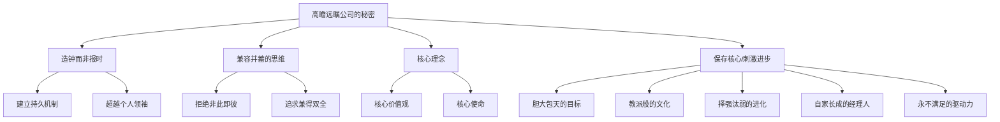
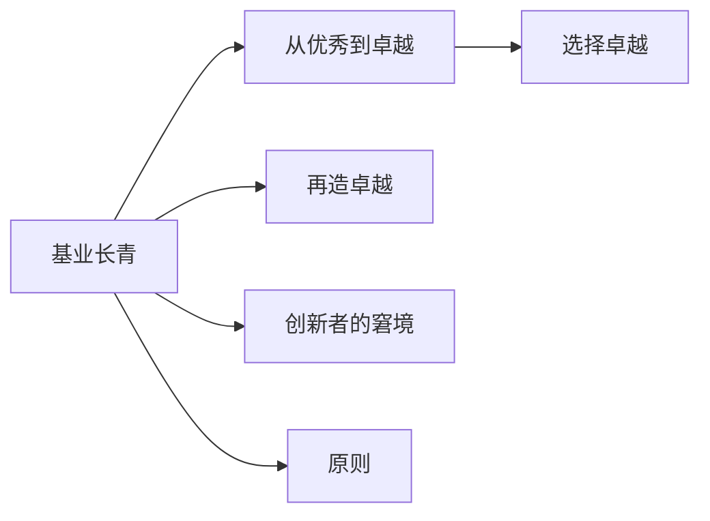

# 《基业长青》深度拆解

## 一、商业坐标定位（400字）

《基业长青》（Built to Last）是吉姆·柯林斯与杰里·波拉斯历时六年研究的结晶，1994年出版后成为商业管理领域的里程碑著作。这本书试图回答一个根本性问题：**为什么有些公司能够持续卓越数十年甚至上百年，而大多数公司却昙花一现？**

> [!abstract] 研究方法
> 作者采用严谨的对照研究法，选取了18家"高瞻远瞩公司"（visionary companies）与18家"对照公司"进行配对比较。这些高瞻远瞩公司平均创立于1897年，历经多次经济危机、战争和技术变革依然屹立不倒。

本书的核心洞见颠覆了许多传统管理观念：
- 不是伟大的产品或创意造就伟大公司，而是==伟大的组织机制==
- 不是魅力型领袖最重要，而是==造钟而非报时==的能力
- 不是追求利润最大化，而是==核心理念的坚守==

在商业思想史上，本书与德鲁克的管理学、波特的竞争战略形成三足鼎立。它将研究焦点从"如何成功"转向"如何持续成功"，开创了企业长寿学的先河。

---

## 二、商业逻辑地图（500字）



本书的逻辑结构可以概括为**"一个悖论 + 四大支柱"**：

**核心悖论**：高瞻远瞩公司同时做到了看似矛盾的两件事——==保存核心==与==刺激进步==。它们像中国太极图一样，在稳定与变革之间保持动态平衡。

**四大支柱**：

| 支柱 | 含义 | 关键机制 |
|------|------|----------|
| 造钟思维 | 建立能自主运转的组织 | 制度设计、文化传承 |
| 兼容并蓄 | 拒绝二元对立思维 | "而且"而非"或者" |
| 核心理念 | 超越利润的存在意义 | 价值观+使命 |
| 刺激进步 | 持续自我革新 | BHAG、进化机制 |

这四大支柱相互强化：核心理念提供方向，造钟思维确保传承，兼容并蓄允许灵活应变，刺激进步保持活力。

---

## 三、逐章深度拆解（5000字）

### 主题1：「翻转12个迷思——破除管理直觉的陷阱」

**【第一性原理拆解】**

作者首先挑战了12个流行的管理迷思，这些迷思的底层假设是：**成功来自于某个单一的决定性因素**。但数据显示，高瞻远瞩公司的成功是系统性的，而非单点突破。

> [!warning] 12大迷思一览
> 1. 需要伟大的创意才能创办伟大公司 ❌
> 2. 需要魅力型领袖 ❌
> 3. 最成功的公司以追求利润为首要目标 ❌
> 4. 有一套放之四海皆准的"正确"价值观 ❌
> 5. 唯一不变的是变化 ❌
> 6. 绩优公司不敢冒险 ❌
> 7. 高瞻远瞩公司是每个人的理想工作场所 ❌
> 8. 成功来自高明的战略规划 ❌
> 9. 应该从外部聘请CEO推动变革 ❌
> 10. 最重要的是击败竞争对手 ❌
> 11. 鱼与熊掌不可兼得 ❌
> 12. 愿景来自愿景声明 ❌

**【心智模型分析】**

这12个迷思背后隐藏着一个认知偏差——**归因谬误**。人们倾向于将复杂的成功归因于简单可见的因素（如领袖魅力、伟大创意），而忽视了更深层的组织机制。

以"伟大创意"迷思为例：
- ==索尼==创立时没有特定产品，只是想建立一个工程师乐园
- ==惠普==创业时根本不知道要做什么产品
- ==3M==最初是开采矿石的失败企业

**【费曼式解读】**

想象你要培养一个能持续获胜的足球队。迷思思维会说："找一个梅西就够了"。但高瞻远瞩思维会说："建立一个青训体系、战术体系、球探体系，让球队在任何球员离开后都能保持竞争力。"

---

### 主题2：「造钟而非报时——从依赖英雄到建立机制」

**【第一性原理拆解】**

==报时==：领袖告诉大家现在几点了（依赖个人判断）
==造钟==：建立一个能自主运转的时钟（依赖组织机制）

底层假设审查：
- 报时思维假设：组织需要英明领袖持续指引方向
- 造钟思维假设：组织应该具备自我导航能力

**【案例审查】**

| 公司 | 造钟行为 | 结果 |
|------|----------|------|
| 沃尔玛 | 山姆·沃尔顿建立"周六晨会"、损耗分享计划等制度 | 创始人去世后公司持续增长 |
| 迪士尼 | 华特·迪士尼创建迪士尼大学、幻想工程部 | 创始人去世后依然创造经典 |
| 福特 | 亨利·福特过度依赖个人决策 | 福特二世接班后经历严重危机 |

> [!tip] 关键洞见
> 沃尔玛的山姆·沃尔顿和福特的亨利·福特都是商业天才，但沃尔顿专注于建立机制，福特专注于个人控制。这种差异决定了两家公司的长期命运。

**【反脆弱压力测试】**

造钟思维在以下情况可能失效：
- **快速变化的行业**：机制可能赶不上变化速度
- **初创阶段**：资源有限时可能需要先"报时"生存
- **危机时刻**：紧急情况可能需要强势领导快速决策

**【黄金圈解读】**

- **Why**：个人终将离去，组织需要永续
- **How**：建立制度、文化、流程、培训体系
- **What**：成文的制度、传承的仪式、系统的培训

---

### 主题3：「利润之上的追求——核心理念的力量」

**【第一性原理拆解】**

作者提出一个反直觉的发现：**高瞻远瞩公司的投资回报率远超对照公司，但它们并不以利润最大化为首要目标。**

这里的底层逻辑是：
- 利润是结果，不是目的
- 核心理念提供持久的动力和方向
- 员工和客户能感知到企业的真诚

**【心智模型分析——飞轮效应】**

```
核心理念 → 吸引认同的人才 → 创造卓越产品 → 赢得客户忠诚 → 获得利润 → 再投资于使命 → 强化核心理念
```

这个飞轮一旦转动起来，就会形成正向循环。

**【DIKW四层提炼】**

| 层级 | 内容 |
|------|------|
| Data | 强生在泰诺中毒事件中召回全部产品，损失1亿美元 |
| Information | 强生的"信条"将客户安全置于利润之上 |
| Knowledge | 核心理念在危机时刻是决策的指南针 |
| Wisdom | ==真正相信某些东西比利润更重要的公司，最终会获得更多利润== |

**【反脆弱压力测试】**

核心理念失效的边界条件：
- 理念与市场现实严重脱节时
- 理念沦为口号而无人真正践行时
- 外部环境剧变，理念需要重新诠释时

> [!note] 案例：强生信条
> 强生的"信条"明确将责任顺序排列为：客户 → 员工 → 社区 → 股东。这不是公关话术，而是真正指导决策的准则。泰诺事件中，强生没有犹豫就选择了召回。

---

### 主题4：「保存核心/刺激进步——动态平衡的艺术」

**【第一性原理拆解】**

这是全书最核心的悖论：==高瞻远瞩公司同时做到了极端保守和极端激进==。

- **保存核心**：核心价值观和使命几乎从不改变
- **刺激进步**：战略、产品、流程持续大胆革新

底层假设：核心与非核心是可以清晰区分的。区分标准是：**如果这个东西改变了，公司还是同一家公司吗？**

**【案例审查】**

| 公司 | 不变的核心 | 变化的一切 |
|------|------------|------------|
| 迪士尼 | 带给人们快乐、注重细节、反对愤世嫉俗 | 从动画到主题公园到邮轮 |
| 3M | 创新、诚信、个人主动性 | 从矿业到砂纸到便利贴到医疗 |
| IBM | 尊重个人、追求卓越、服务客户 | 从打字机到大型机到PC到云服务 |

**【苏格拉底追问】**

- Q：如果核心理念太抽象，怎么落地？
- A：通过具体的机制和仪式来强化，如惠普的"惠普之道"培训

- Q：如果市场证明核心理念是错的呢？
- A：真正的核心理念应该是永恒的人性价值，而非具体的商业判断

- Q：新员工如何理解并认同核心理念？
- A：通过"教派般的文化"机制进行筛选和熏陶

---

### 主题5：「胆大包天的目标（BHAG）——刺激进步的引擎」

**【第一性原理拆解】**

BHAG（Big Hairy Audacious Goals）是刺激进步的首要机制。其底层假设是：**人类需要超越日常的宏大目标来激发潜能**。

BHAG的特征：
- 清晰到无需解释
- 困难到需要非凡努力
- 令人兴奋到能激发热情
- 有时间期限

**【案例审查】**

| 公司 | BHAG | 结果 |
|------|------|------|
| 波音 | 1950年代：进入商用喷气机市场（豪赌707） | 改变航空业格局 |
| 索尼 | 1950年代：改变日本产品质量低劣的形象 | 成为品质代名词 |
| 福特 | 让普通人都能买得起汽车 | T型车革命 |
| 沃尔玛 | 到2000年成为1250亿美元的公司 | 提前实现 |

**【反脆弱压力测试】**

BHAG的风险：
- **过度冒险**：波音在707上押上全部身家，如果失败公司会破产
- **目标僵化**：环境变化后不调整目标
- **数字陷阱**：将BHAG简化为财务数字而失去激励意义

> [!warning] 幸存者偏差提醒
> 我们只看到了豪赌成功的案例。那些同样大胆但失败的公司，已经从历史中消失。BHAG需要与核心能力匹配，而非盲目冒险。

**【费曼式解读】**

BHAG就像登月计划——一个清晰、大胆、激动人心的目标，能让整个组织朝同一个方向努力。肯尼迪说"十年内把人送上月球并安全返回"，每个NASA员工都知道自己在为什么而工作。

---

### 主题6：「教派般的文化——核心理念的守护机制」

**【第一性原理拆解】**

高瞻远瞩公司的文化像"教派"一样强烈，这背后的假设是：**强文化能够自动筛选和同化，保持组织的纯粹性**。

教派般文化的特征：
- 强烈信奉核心理念
- 严格的"符合度"筛选
- 对员工要求极高
- 内部人士与外界有明显区隔

**【心智模型分析】**

这种文化机制类似于免疫系统：
- 识别"自己人"和"外来者"
- 同化可以同化的
- 排斥无法融入的

**【案例审查】**

| 公司 | 教派特征 | 效果 |
|------|----------|------|
| 迪士尼 | 员工叫"演员"、顾客叫"客人"、有迪士尼大学 | 服务体验高度一致 |
| 诺世全 | 严格的招聘流程、新人培训长达数月 | 极低离职率、高客户满意度 |
| P&G | "宝洁化"培训、独特的内部语言 | 管理人才的黄埔军校 |

**【反脆弱压力测试】**

教派文化的风险：
- **创新抑制**：过于同质化可能扼杀异见
- **适应性下降**：在剧变时代可能反应迟钝
- **人才流失**：不适应的优秀人才会离开

> [!tip] 平衡之道
> 高瞻远瞩公司的解决方案是：==核心理念层面像教派，运营层面允许实验==。迪士尼坚持"快乐"理念，但允许各种新的娱乐形式探索。

---

### 主题7：「择强汰弱的进化——让市场选择最佳方案」

**【第一性原理拆解】**

高瞻远瞩公司不依赖精确的战略规划，而是采用"进化式"方法：**大量尝试，保留有效的，淘汰无效的**。

底层假设：未来是不可预测的，但可以通过快速试错来适应。

**【DIKW四层提炼】**

| 层级 | 内容 |
|------|------|
| Data | 3M的便利贴是失败胶水实验的意外产物 |
| Information | 3M鼓励员工用15%的时间自由探索 |
| Knowledge | 系统化的"有计划的意外"机制能产生创新 |
| Wisdom | ==不是预见未来，而是创造一个能适应任何未来的组织== |

**【案例审查】**

| 公司 | 进化机制 | 成果 |
|------|----------|------|
| 3M | 15%自由时间、创新奖励 | 便利贴、数万种产品 |
| 强生 | 分权制、内部创业 | 从婴儿爽身粉到医疗器械帝国 |
| 万豪 | 不断尝试新业务形态 | 从根啤店到酒店帝国 |

**【苏格拉底追问】**

- Q：这不是在鼓励浪费资源吗？
- A：失败的尝试是学习成本，而非浪费。关键是快速失败、快速学习。

- Q：如何区分"有纪律的尝试"和"盲目乱试"？
- A：尝试必须在核心理念框架内进行，且有清晰的评估标准。

---

### 主题8：「自家长成的经理人——传承的保障」

**【第一性原理拆解】**

研究发现：==高瞻远瞩公司的CEO几乎都是内部培养的==。18家公司在总共长达1700年的历史中，只有4次从外部聘请CEO。

底层假设：
- 内部人更理解和认同核心理念
- 领导力发展需要长期培养
- 外部空降CEO往往带来文化冲突

**【案例审查】**

| 公司 | CEO来源 | 结果 |
|------|---------|------|
| GE | 100%内部培养，有系统的继任计划 | 韦尔奇等传奇CEO |
| 宝洁 | 自1837年以来全部内部晋升 | 持续的品牌创新 |
| IBM（反例） | 1990年代聘请外部CEO郭士纳 | 成功转型，但属于例外 |

**【反脆弱压力测试】**

内部培养的局限：
- **危机时刻**：可能需要外部人打破惯性
- **行业剧变**：内部人可能缺乏新视角
- **人才断层**：培养体系失效时无人可用

> [!note] IBM的例外
> IBM在1990年代濒临破产时聘请郭士纳是正确的选择。但这恰恰证明了规律：当公司偏离了核心理念（变得官僚傲慢），可能需要外部力量来重塑。

---

### 主题9：「永不满足——持续改进的驱动力」

**【第一性原理拆解】**

高瞻远瞩公司有一个共同特征：==永远觉得不够好==。这种"永不满足"的驱动力来自内部，而非外部竞争压力。

底层假设：卓越是一种习惯，而非终点。

**【心智模型分析——飞轮效应】**

```
高标准 → 自我批评 → 持续改进 → 更高成就 → 更高标准
```

**【案例审查】**

- **宝洁**：即使是市场领导者，也持续投入研发挑战自己的产品
- **万豪**：比尔·万豪即使年过八旬，仍亲自检查酒店细节
- **波音**：在747成功后立即投入777研发，不给自己喘息

**【黄金圈解读】**

- **Why**：卓越是对核心理念的承诺，不是为了击败对手
- **How**：建立自我评估机制、高标准的绩效文化
- **What**：持续的产品迭代、流程优化、人才发展

---

## 四、核心决策框架提炼（800字）

### 框架1：核心理念检验四问

> [!abstract] 四问清单
> 1. 如果环境变化让坚持这个理念需要付出代价，你还会坚持吗？
> 2. 如果明天醒来有足够的钱退休，你还会继续践行这个理念吗？
> 3. 你希望这个理念100年后依然有效吗？
> 4. 这个理念是否源自内心而非外部压力？

如果四个问题的答案都是"是"，那才是真正的核心理念。

### 框架2：BHAG设计五要素

| 要素 | 说明 |
|------|------|
| 清晰 | 不需要解释就能理解 |
| 激动人心 | 能激发情感和承诺 |
| 时间限定 | 有明确的截止日期 |
| 大胆 | 50%-70%的成功概率 |
| 一致 | 与核心理念保持一致 |

### 框架3：保存核心/刺激进步检查清单

**保存核心检查：**
- [ ] 核心价值观是否清晰成文？
- [ ] 新员工是否接受核心理念培训？
- [ ] 决策时是否参照核心理念？
- [ ] 违背核心理念的行为是否被纠正？

**刺激进步检查：**
- [ ] 是否有正在进行的BHAG？
- [ ] 是否有鼓励实验的机制？
- [ ] 是否有自我挑战的文化？
- [ ] 是否持续投资于未来？

---

## 五、幸存者偏差审查（600字）

本书虽然开创性地使用了对照研究法，但仍存在一些方法论局限：

### 局限1：样本选择偏差

作者在1990年代初选取的"高瞻远瞩公司"中，部分后来遭遇了严重挫折：
- **摩托罗拉**：在智能手机时代被边缘化
- **福特**：2008年金融危机中几近破产
- **索尼**：在数字时代失去领先地位

> [!warning] 反思
> 这提醒我们：即使是最卓越的公司，也无法保证永续。本书的原则是必要条件，而非充分条件。

### 局限2：归因复杂性

商业成功是多因素的结果，很难确定哪些因素是决定性的：
- 高瞻远瞩公司的成功，有多少归功于本书总结的原则？
- 有多少归功于行业机遇、经济周期、地理优势？

### 局限3：时代局限性

本书研究的主要是工业时代的公司，在数字时代：
- 组织边界变得模糊
- 变化速度大大加快
- "基业长青"的定义本身在变化

### 客观评价

尽管有这些局限，本书的核心洞见依然有效：
- **造钟思维**在任何时代都比依赖英雄更可持续
- **核心理念**在变化中提供稳定的锚点
- **保存核心/刺激进步**的平衡永远是组织面临的核心张力

---

## 六、时效性评估（500字）

### 仍然有效的原则

| 原则 | 当代验证 |
|------|----------|
| 造钟而非报时 | 苹果在乔布斯去世后依然强大，证明库克时代的制度建设有效 |
| 核心理念 | 亚马逊的"顾客至上"理念贯穿其所有创新 |
| BHAG | SpaceX的"让人类成为多行星物种"是当代BHAG的典范 |

### 需要调整的应用

| 原则 | 调整建议 |
|------|----------|
| 内部培养CEO | 在快速变化的科技行业，适度引入外部视角可能有益 |
| 教派文化 | 在多元化时代，需要在文化凝聚力和包容性之间找到平衡 |
| 择强汰弱 | 在敏捷时代，需要更快的迭代周期 |

### 新时代的补充思考

1. **平台生态**：当代高瞻远瞩公司往往是平台，其"核心"可能是连接能力而非单一产品
2. **使命驱动**：Z世代员工更看重企业的社会使命
3. **组织弹性**：疫情证明了组织适应性的重要性

---

## 七、类比迁移实战指南（500字）

### 迁移场景1：个人发展

| 书中原则 | 个人应用 |
|----------|----------|
| 造钟而非报时 | 建立个人知识管理系统和习惯系统，而非依赖意志力 |
| 核心理念 | 明确个人价值观和人生使命，作为决策的指南针 |
| BHAG | 设定10年人生目标，而非只看眼前 |
| 保存核心/刺激进步 | 坚守价值观的同时持续学习新技能 |

### 迁移场景2：家庭建设

| 书中原则 | 家庭应用 |
|----------|----------|
| 核心理念 | 家庭使命宣言：我们家庭代表什么？ |
| 教派文化 | 家庭传统和仪式（如每周家庭会议） |
| 内部培养 | 着力培养下一代的领导力和责任感 |

### 迁移场景3：创业团队

**第一年**：先明确核心理念，而非产品
**第二年**：建立基础机制（决策流程、文化规范）
**第三年**：设定BHAG，激发团队潜能
**持续**：在核心理念框架内大胆实验

---

## 八、费曼终极检验（400字）

**如果用一句话向朋友解释这本书的核心观点：**

> 伟大公司的秘密不是伟大的产品或领袖，而是建立了一个能够自我进化的组织——它有不变的灵魂（核心理念）和变化的身体（战略与产品）。

**三个能立即应用的行动：**

1. **写下你的核心理念**：无论是公司还是个人，花30分钟写下3-5条你愿意永远坚守的价值观

2. **设定一个BHAG**：选择一个让你既兴奋又害怕的10年目标，写在显眼的地方

3. **审视你的"机制"**：列出你目前依赖的"报时"行为（依赖个人记忆、判断、意志力的事），思考如何转化为"造钟"机制（系统、流程、习惯）

**这本书改变了什么认知：**

从"追求成功"转向"追求能够持续成功的机制"。成功可能是运气，但持续成功一定是设计。

---

## 延伸阅读路线图



| 书籍 | 关联 |
|------|------|
| [[《从优秀到卓越》]] | 柯林斯续作，聚焦"优秀→卓越"的跨越 |
| [[《再造卓越》]] | 柯林斯研究企业衰败的五个阶段 |
| [[《创新者的窘境》]] | 解释为什么大公司会被颠覆 |
| [[《原则》]] | 达利欧版的"核心理念+机制设计" |
| [[《好战略坏战略》]] | 关于战略设计的深入探讨 |
