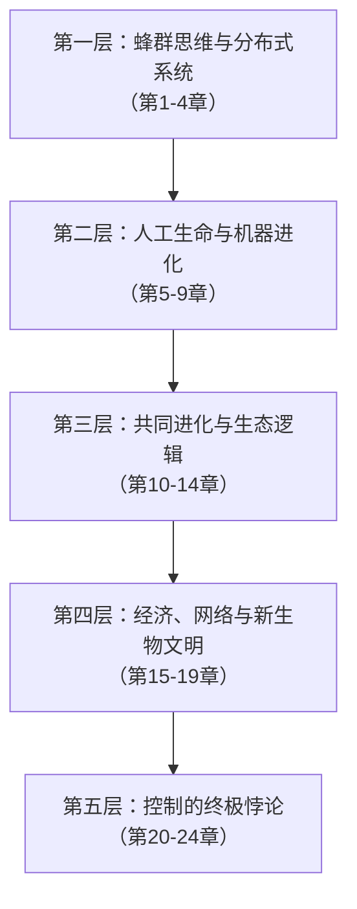

# 《失控：全人类的最终命运和结局》深度拆解

## 一、科学坐标定位

《失控》（*Out of Control: The New Biology of Machines, Social Systems, and the Economic World*）由凯文·凯利（Kevin Kelly）于1994年出版，是一部跨越生物学、计算机科学、经济学、生态学和哲学的思想巨著。凯利时任《连线》杂志执行主编，他花费数年时间走访全球前沿实验室和研究者，将分散在不同学科中的一个共同趋势编织成一幅宏大图景：==自然界与人工系统正在走向融合，而这个融合的核心逻辑是「分布式控制」与「涌现」==。

这本书的学科坐标处于**控制论（Cybernetics）的延伸地带**——它继承了维纳（Norbert Wiener）的反馈理论，但走得更远，主张最深刻的控制恰恰来自「放弃控制」。它同时与[[复杂性科学]]（圣塔菲研究所）、[[人工生命]]（Chris Langton）、[[进化论]]和[[生态学]]深度交叉。在科学史上，这本书是将「复杂适应系统」思想大规模引入公众视野的里程碑式作品。

## 二、知识架构地图

全书24章，逻辑上可以提炼为**五个递进的思想层次**：



**核心命题**：你以为控制是自上而下的指挥，但自然界最强大的系统——蜂群、生态圈、大脑、市场——全部是==自下而上、无中心、分布式==的。真正的「控制」来自放手，真正的「秩序」来自混沌边缘。

凯利将这一命题在生物学（蜂群、生态系统）、技术（机器人、虚拟现实）、经济学（自由市场、网络经济）和哲学（意识、自由意志）四个维度反复论证，形成一个闭合的思想网络。

## 三、逐章深度拆解

### 主题一：「蜂群思维——去中心化的智慧」

> [!tip] 对应章节
> 第1章「人造与天生」、第2章「蜂群思维」

**【布鲁姆认知阶梯】**

- **记忆**：一个蜂群有上万只蜜蜂，没有任何一只蜜蜂在"指挥"，但蜂群整体却能做出精确决策——选择巢穴位置、调节温度、分配采蜜路线。
- **理解**：蜂群的智慧不在任何个体中，而是从个体之间简单交互中「涌现」出来的。每只蜜蜂只遵循几条简单规则（跳舞传递信息、局部感知邻居状态），但整体却表现出远超个体能力的集体智能。
- **应用**：这个原理被直接应用于分布式计算、群体机器人（swarm robotics）、去中心化网络（如互联网本身的路由协议）。
- **分析**：蜂群思维的关键特征是凯利总结的「群氓的集体智慧」四要素——没有强制性的中心控制；个体之间独立运作；个体遵循简单规则；整体行为通过局部交互涌现。
- **评价**：蜂群模型的威力在于**鲁棒性**——去掉任何一只蜜蜂，系统几乎不受影响。但代价是**效率较低且不可精确预测**。你无法命令蜂群在特定时间到达特定地点。

**【第一性原理回溯】**

凯利在这里的第一性原理是：==复杂的整体行为不需要复杂的个体规则==。这是对笛卡尔还原论的一个根本性挑战——传统思维认为要理解复杂系统就要拆解它的组件，但蜂群告诉你，拆解之后你什么也看不到，智慧只存在于"之间"。

**【费曼式类比】**

想象一个大型广场上有一万个人，每人只知道两条规则：(1) 和最近的人保持一臂距离；(2) 缓慢朝光源移动。没有任何人喊口令，但你从高空俯瞰，会看到人群如流水般优美地绕过障碍物、汇聚到光源。这就是涌现——没有指挥家的交响乐。不过需要注意，这个类比的局限在于蜜蜂的交互规则实际上比两条复杂得多，而且经历了数百万年的进化优化。

**【概念网络】**

`蜂群思维` → `涌现` → `分布式系统` → `去中心化控制` → `鲁棒性 vs 效率的权衡`

---

### 主题二：「活系统的九律——从机器到生命体」

> [!tip] 对应章节
> 第2-4章的核心提炼

**【布鲁姆认知阶梯】**

- **记忆**：凯利提出了活系统（vivisystem）的核心特征，他将自然生命系统的逻辑抽象为一组普适法则。
- **理解**：活系统的九条规律包括——分布式、自下而上的控制；递增收益；模块化生长；边界最大化（利用边缘效应）；鼓励犯错（容忍试错）；不求最优而求多目标；不谋全局而求局部最优再涌现出全局；追求持久的不均衡态（远离死寂的平衡）；变自生变（变化能催生新的变化）。
- **应用**：这九条法则成为后来很多技术系统设计的隐性指导原则——开源软件的开发模式、维基百科的编辑机制、加密货币的共识协议，都能找到这些法则的影子。
- **分析**：这九条法则的共同底色是对「工程思维」的反叛。传统工程追求精确控制、最优解、层级管理，而活系统恰恰相反——它拥抱混乱、容忍浪费、放弃中央管理。

**【第一性原理回溯】**

根本假设：==最有生命力的系统不是被设计出来的，而是被「生长」出来的==。设计意味着蓝图先行、自上而下；生长意味着种子先行、自下而上。这个假设在生物学中显然成立（没有谁设计了热带雨林），凯利的激进主张是它在技术世界同样成立。

**【费曼式类比】**

你想建一座花园。工程思维是画好图纸、规划每棵树的位置、浇水施肥按时间表执行。活系统思维是撒下多种种子，提供充足的水和阳光，然后看哪些种子发芽、哪些彼此共生、哪些自然淘汰——最终长出来的花园一定不是你预期的，但很可能比你设计的更丰富、更有韧性。类比的局限：真实的工程项目（造桥、造飞机）仍然需要精确设计，活系统法则更适用于软件生态、组织管理、创新策略等「软性系统」。

**【概念网络】**

`活系统九律` → `自下而上 vs 自上而下` → `生长 vs 设计` → `鲁棒性` → `远离平衡态`

---

### 主题三：「人工生命——当机器开始进化」

> [!tip] 对应章节
> 第5-7章「共同创造」「收割自然」「网络经济」

**【布鲁姆认知阶梯】**

- **记忆**：凯利深入探访了人工生命研究的先驱们，包括Chris Langton的虚拟生命实验、Tom Ray的Tierra数字生态系统、Karl Sims的进化虚拟生物。
- **理解**：人工生命（Artificial Life，简称ALife）的核心理念是：生命不是一种特定的物质（碳基），而是一种==信息组织方式==。如果你能在计算机中重现生命的组织逻辑——自我复制、变异、竞争、适应——那么计算机中的「数字生物」就是真正的生命，而非生命的模拟。
- **应用**：遗传算法（Genetic Algorithm）直接脱胎于这一思想——让程序像生物一样繁殖、变异、自然选择，最终"进化"出解决方案。今天的神经网络架构搜索（NAS）就是这个思路的延伸。
- **分析**：Tom Ray 的 Tierra 系统中出现了令人惊叹的现象：数字生物自发进化出「寄生虫」——一段代码学会了借用别的代码的复制功能来复制自己。随后又进化出「抗寄生虫」机制。这个过程完全没有被编程，是纯粹的涌现。

**【第一性原理回溯】**

这里的第一性原理是达尔文的自然选择，但凯利将其抽象为一个更底层的命题：==只要有复制、变异和选择压力这三个条件，进化就会发生——无论载体是碳基分子还是硅基代码==。这个命题目前是主流的理论假说，但「数字生命是否算真正的生命」在哲学上仍有争议。

**【费曼式类比】**

想象你有一百万个乐高玩家，每人随机拼一个作品。你选出最有趣的十个，把它们的零件打散重新组合（交叉），偶尔随机换几块零件（变异），再让这一百万人在新零件基础上重新拼。重复一万轮后，你会得到极其精巧的作品——没有任何设计师，只有选择和变异。这就是人工生命的核心逻辑。

**【概念网络】**

`人工生命` → `进化算法` → `自我复制 + 变异 + 选择` → `涌现` → `「生命是信息模式」假说`

---

### 主题四：「共同进化——你改变我，我改变你」

> [!tip] 对应章节
> 第8-11章「封闭系统」「冒出来」「工业生态学」「网络经济」

**【布鲁姆认知阶梯】**

- **记忆**：共同进化（coevolution）是指两个或多个物种/系统在互相作用中共同演化。经典案例是花与蜂——花进化出鲜艳颜色吸引蜂，蜂进化出长口器采蜜，双方在互动中不断升级。
- **理解**：凯利将共同进化的概念从生物学拓展到技术和经济领域。他认为==技术不是人类单方面的发明，而是技术与人类的共同进化==。汽车改变了城市布局，城市布局又改变了汽车的设计需求。互联网改变了人类的社交方式，新的社交方式又驱动互联网的技术演进。
- **应用**：凯利讨论了「生物圈二号」（Biosphere 2）实验——在亚利桑那沙漠中建造的一个封闭生态系统。实验最终失败了，因为设计者低估了共同进化的复杂性：没有风的吹拂，树木变得脆弱（缺乏应力刺激）；授粉昆虫种群崩溃导致植物无法繁殖。
- **分析**：共同进化的深层启示是——==你不能孤立地优化系统的某一部分==。当你改变A，A所处的网络中的B、C、D都会响应，它们的响应又会反过来改变A的环境。优化是一个永无止境的追逐赛，而非一个终点。

**【第一性原理回溯】**

共同进化的第一性原理可以追溯到一个朴素事实：在现实世界中，==没有任何系统是孤立的==。每个系统的「环境」本身也是由其他系统构成的，而那些系统也在演化。这意味着适应度景观（fitness landscape）本身在不断变形——你正在攀爬的山峰在你脚下不停移动。

**【费曼式类比】**

想象两个人在冰面上跳舞。A的每个动作都会改变冰面的状态（留下划痕、改变摩擦力），B必须根据变化后的冰面调整舞步，而B的调整又进一步改变冰面。两个人的舞蹈是彼此共同创造的，谁也无法独立预测最终的轨迹。

**【概念网络】**

`共同进化` → `适应度景观` → `生物圈二号` → `系统思维` → `不可孤立优化`

---

### 主题五：「边缘上的进化——混沌与秩序之间」

> [!tip] 对应章节
> 第12-14章「进化的进化」「上帝的游戏」「在形式的图书馆中」

**【布鲁姆认知阶梯】**

- **记忆**：凯利引用了圣塔菲研究所（Santa Fe Institute）的核心发现：最有创造力的系统运作在==混沌的边缘==（edge of chaos）——既不完全有序（僵死），也不完全混沌（溃散），而是在两者之间的狭窄地带。
- **理解**：完全有序的系统（如晶体）高度可预测但不能适应变化；完全混沌的系统（如沸腾的水）没有稳定结构可以累积信息。只有在两者之间，系统才能既保持结构又不断创新。生命、市场、文明——所有最有趣的现象都发生在这个「边缘」。
- **应用**：Stuart Kauffman的NK模型证明，当系统组件之间的连接密度恰到好处时（不太稀疏也不太密集），系统会自发地组织到混沌边缘。这个发现暗示混沌边缘不是需要精心调校才能到达的状态，而是复杂系统的某种「吸引子」——系统自然会演化到那里。
- **分析**：凯利进一步讨论了「进化的可进化性」（evolvability of evolution）——进化不仅改变了物种，还改变了进化机制本身。有性生殖就是一个例子：从无性生殖到有性生殖，进化"发明"了一种更高效的进化方式。

**【第一性原理回溯】**

底层命题是：==秩序可以从无序中自发产生，不需要外部设计者==。这就是「自组织」（self-organization）的核心思想，由Ilya Prigogine的耗散结构理论提供了物理学基础——远离平衡态的开放系统，在能量流过时可以自发形成有序结构。

**【费曼式类比】**

想象调收音机。完全安静是一种状态（有序但无趣），完全噪音也是一种状态（混乱且无用）。但在某个频率上，你突然听到音乐——信号就藏在噪音与沉默之间的那个窄窄的区间。生命就是宇宙在混沌与秩序之间调出来的那首歌。

**【概念网络】**

`混沌边缘` → `自组织` → `耗散结构` → `进化的可进化性` → `NK模型` → `圣塔菲研究所`

---

### 主题六：「网络经济与递增收益」

> [!tip] 对应章节
> 第15-17章

**【布鲁姆认知阶梯】**

- **记忆**：凯利在本书中预见性地描述了网络经济的核心特征——网络中的价值不遵循递减收益（diminishing returns），而是遵循==递增收益（increasing returns）==。传真机只有一台时毫无价值，每多一台传真机，所有已有传真机的价值都增加。
- **理解**：递增收益颠覆了古典经济学的基本假设。在传统经济中，第一百万个面包的边际效益低于第一个。但在网络中，第一百万个用户的加入让网络对每个已有用户都更有价值——这就是网络效应。凯利认为这种逻辑不仅适用于通信网络，还适用于生态网络、知识网络和社交网络。
- **应用**：这个洞察在1994年就预言了后来互联网经济的核心特征——赢家通吃、先发优势、免费策略（先做大网络再考虑变现）。
- **分析**：凯利将经济系统类比为生态系统：不同的公司像不同的物种，占据不同的生态位，通过竞争与共生共同进化。垄断就像生态系统中的顶级捕食者——它不是设计出来的，而是涌现出来的。

**【第一性原理回溯】**

底层逻辑：==连接创造价值==。单个节点的价值有限，但节点之间的连接数量随节点数呈指数增长（Metcalfe定律：网络价值 ≈ n²）。当连接本身成为价值源泉时，整个经济逻辑就从「稀缺性定价」翻转为「丰裕性定价」。

**【费曼式类比】**

一部电话是一块砖头。两部电话是一条线。一百万部电话是一个世界。每增加一部电话，不是增加了一条线，而是增加了九十九万九千九百九十九条潜在连接。这就是为什么网络价值不是线性增长，而是爆炸式增长。

**【概念网络】**

`递增收益` → `网络效应` → `Metcalfe定律` → `生态经济` → `赢家通吃`

---

### 主题七：「人造与天生的融合——新生物文明」

> [!tip] 对应章节
> 第18-21章

**【布鲁姆认知阶梯】**

- **记忆**：凯利提出了本书最核心的预言：==人造世界和天生世界正在趋同==。机器变得越来越像生命体（学习、适应、进化），生命体越来越被理解为一种机器（基因编辑、合成生物学）。两者将在未来的某个时点融合。
- **理解**：这个趋同不是隐喻，而是结构性的。凯利列举了大量证据：机器人开始用进化算法自己"长出"行走能力，而不是被工程师编程；建筑开始模仿生物的自适应结构；软件开始像生态系统一样自我修复。与此同时，生物学家开始用工程语言描述生命——基因是"代码"，细胞是"工厂"，大脑是"计算机"。
- **应用**：凯利预见了后来被称为「仿生学」（biomimicry）的领域——从壁虎脚趾学习黏附技术、从白蚁巢穴学习通风设计、从群鸟飞行学习无人机编队。
- **分析**：这种融合的深层含义是：我们对「生命」的定义需要扩展。如果一个机器系统能自我复制、自我修复、自我进化，你很难说它"不是"生命。凯利认为未来的世界不是"自然 vs 人工"的二元对立，而是一个连续光谱。

**【第一性原理回溯】**

这里的根本假设是：==生命的本质不在于它的材料（碳 vs 硅），而在于它的组织方式（信息模式）==。如果这个假设成立，那么「人工生命」就不是一个隐喻，而是一个技术可行的目标。这个假设目前仍属于前沿理论立场，在哲学上存在争议——一些思想家认为碳基化学的特殊性质对生命来说是不可替代的。

**【费曼式类比】**

你觉得"书"一定是纸做的吗？当电子书出现时，人们争论"这还算书吗？"——但最终大家接受了书的本质是「内容的组织方式」，而非纸张。凯利对生命的论断与此类似：生命的本质是信息的组织方式，而非碳原子。

**【概念网络】**

`人造与天生融合` → `生命的信息定义` → `仿生学` → `合成生物学` → `连续光谱（非二元对立）`

---

### 主题八：「失控的意义——放弃控制即获得控制」

> [!tip] 对应章节
> 第22-24章

**【布鲁姆认知阶梯】**

- **记忆**：全书最后，凯利回到书名"失控"的终极含义：==最高级的控制是放弃控制==。试图精确控制一个复杂系统（经济、生态、技术演进），注定会失败或制造更大的问题。你能做的最好的事，是设置初始条件和简单规则，然后让系统自己演化。
- **理解**：这不是虚无主义或放任主义。"放弃控制"不是"什么都不做"，而是从「指挥者」转变为「园丁」——你不决定每棵树长在哪里，但你选择种什么种子、提供什么土壤、设置什么边界。这是一种更高层次的参与方式。
- **应用**：维基百科是"失控"的经典案例——没有总编辑，任何人都能编辑，看起来一定会崩溃。但因为它设置了正确的初始规则（版本追溯、社区治理、争议解决流程），它成为了人类历史上最全面的百科全书。
- **分析**：凯利承认"失控"有其代价——分布式系统更慢、更浪费、更不可预测。但他认为这些代价是值得的，因为只有"失控"系统才能应对真正的复杂性和不确定性。一个精密设计的系统在预期环境中表现完美，但在意外面前脆弱不堪；一个"失控"系统在日常中显得笨拙，但在危机中展现出惊人的适应力。

**【第一性原理回溯】**

终极命题：==复杂性不可被消除，只能被驾驭，而驾驭复杂性的唯一方式是让系统自身拥有适应和进化的能力==。这个命题与Ashby的「必要多样性定律」一脉相承——要控制一个系统，控制器的复杂性必须不低于被控系统。当被控系统足够复杂时，唯一可行的"控制器"就是系统自身。

**【费曼式类比】**

你带一个两岁的孩子在客厅玩，你可以把所有危险物品搬走（设置环境），但你不需要也不可能控制孩子的每一步移动。这就是"失控式管理"——控制边界而非控制过程。如果你试图控制孩子的每一步，结果不是安全，而是孩子永远学不会自己走路。

**【概念网络】**

`失控` → `园丁 vs 指挥者` → `必要多样性定律` → `反脆弱` → `控制边界而非过程`

---

## 四、科学模型提炼

凯利在全书中反复运用的核心科学模型可以提炼为以下框架：

### 模型一：涌现金字塔

```
简单规则（个体层面）
       ↓ 大量交互
复杂模式（群体层面）
       ↓ 环境反馈
自适应行为（系统层面）
       ↓ 时间积累
进化（物种/文明层面）
```

> [!note] 核心洞察
> 每一层的现象都无法从下一层的规则中直接推导出来——这就是涌现。你知道水分子的一切物理特性，仍然无法预测「湿」这个宏观属性。

### 模型二：控制光谱

| 集中控制 ← → 分布式控制 |
|---|
| 高效率 ← → 高鲁棒性 |
| 可预测 ← → 可适应 |
| 脆弱 ← → 反脆弱 |
| 工厂 ← → 生态系统 |

凯利的核心论点是：人类文明正在从光谱的左端（工业时代的集中控制）向右端（信息时代的分布式控制）移动。

### 模型三：共同进化螺旋

技术改变人类行为 → 人类行为改变技术需求 → 技术再次演化 → 人类行为再次改变 → ……

这是一个没有终点的螺旋，每一圈都产生新的复杂性和新的可能性。

### 模型四：混沌边缘的甜蜜点


所有有趣的事情——生命、意识、市场、文化——都发生在 B 区域。

## 五、科学前沿状态

凯利在1994年提出的很多观点，在过去三十年中得到了不同程度的验证或发展：

**已验证的预见**：
- 网络效应和递增收益——被互联网经济完美验证（Google、Facebook、Amazon）
- 分布式系统的优势——区块链、开源软件、维基百科
- 人工进化的威力——深度学习、神经架构搜索、AlphaGo中的自我博弈
- 仿生学的兴起——现已成为独立的工程学科

**仍在探索的前沿**：
- 人工生命是否能产生"真正的"意识——至今没有定论
- 混沌边缘理论的数学严格化——仍在发展中
- 生物与机器的深度融合——脑机接口（Neuralink等）正在推进但远未成熟

**需要修正的观点**：
- 凯利对去中心化的乐观可能过度——现实中的互联网反而出现了高度集中化（FAANG垄断）
- "失控"在某些场景下可能带来严重风险——如社交媒体算法的"涌现"行为导致极化和假信息传播

## 六、认知升级清单

读完《失控》，你的思维工具箱中应该增加这些"镜头"：

> [!abstract] 认知升级
> 1. **涌现镜头**：遇到复杂现象时，先问"这是不是从简单规则中涌现出来的？"而非急于寻找中央控制者
> 2. **分布式思维**：设计系统时考虑"能不能让各部分自主决策、只通过简单规则协调？"
> 3. **共同进化意识**：分析任何变化时考虑"这会引发什么连锁反应？我所处的环境会如何响应并反过来改变我？"
> 4. **混沌边缘直觉**：判断组织或系统是否处于最佳状态——太有序（官僚化）或太混乱（无章法）都不好，最佳状态在两者之间
> 5. **生长 vs 设计心态**：对于复杂项目，考虑"我能不能先种种子、设规则、看它怎么长？"而非一开始就画完整蓝图
> 6. **反控制直觉**：当你发现自己想要精确控制某件复杂的事时，后退一步问"我是不是应该做园丁而不是指挥官？"

## 七、跨学科启发

《失控》的思想对以下领域有直接启发：

- **组织管理**：从层级制到网络化组织（如海尔的"人单合一"模式），与凯利的分布式控制思想高度一致
- **产品设计**：最小可行产品（MVP）+ 快速迭代的方法论，本质上就是"生长而非设计"
- **教育**：从填鸭式教学转向项目制学习（PBL），让知识从学生的探索中涌现
- **城市规划**：简·雅各布斯（[[《美国大城市的死与生》]]）的城市有机生长论与凯利的活系统思想异曲同工
- **投资思维**：市场是一个共同进化系统，任何"必胜策略"一旦被广泛采用就会自我抵消（与[[《反脆弱》]]的思路相通）
- **人工智能**：当下大模型训练中的涌现能力（emergence in LLMs）——模型在达到一定规模后突然展现出未被训练过的能力——正是凯利描述的涌现现象在AI领域的惊人呈现

## 八、费曼终极检验

如果要用一段话向一个完全不了解这本书的朋友解释《失控》的核心思想：

你知道蜂群吗？几万只蜜蜂，没有领导，每只蜜蜂只会几个简单动作，但整个蜂群却能找到最好的食物源、建造精美的巢穴、在危险面前快速响应。凯文·凯利花了一整本书告诉你一个道理：==这个世界上最强大的系统——大脑、互联网、市场经济、生态圈——全都是这样运作的：没有指挥官，没有蓝图，只有无数个体遵循简单规则、彼此互动，然后复杂的智慧就"冒"出来了==。他管这叫「涌现」。更疯狂的是，他说人类造的东西——机器人、软件、公司——也正在变成这样。未来不是人控制机器，也不是机器控制人，而是两者共同进化成一种我们现在还想象不到的新东西。这本书的名字叫「失控」，因为凯利最大的发现就是：==想要控制一切的冲动恰恰是最大的失控，而真正的掌控来自放手让系统自己生长==。
