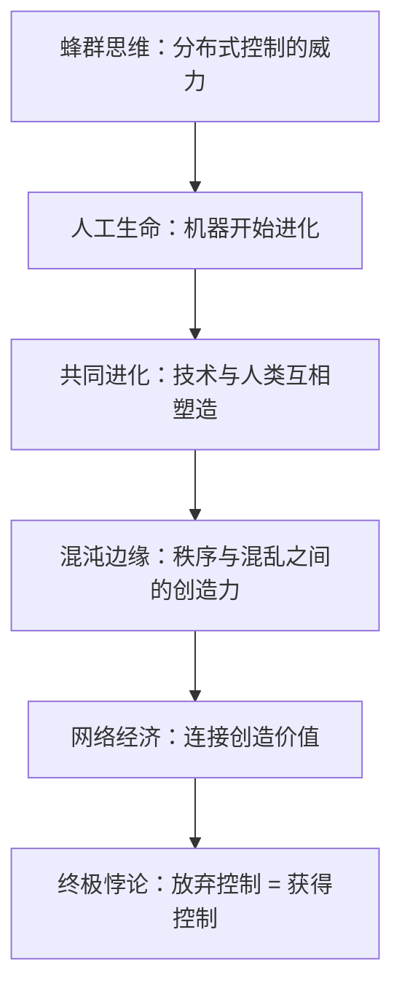

# 《失控》精华读书笔记

## 一、30秒速览

《失控》（1994）是凯文·凯利的代表作，核心论点只有一句话：==世界上最强大的系统——蜂群、大脑、市场、互联网——全部是无中心、自下而上、自组织的，真正的控制来自放弃控制==。全书24章横跨生物学、计算机科学、经济学和哲学，用蜂群思维、人工生命、共同进化、混沌边缘、网络效应等概念，论证了一个趋势：人造世界正在变得越来越像自然生命，而这种融合的结果将彻底重塑人类文明的组织方式。

## 二、全书逻辑骨架

全书的逻辑链是：先用蜂群证明分布式系统的优越性 → 再用人工生命证明进化可以脱离碳基载体 → 然后用共同进化说明一切系统都在互相塑造 → 接着用混沌边缘理论解释创新发生在哪里 → 用网络经济说明连接比节点更重要 → 最后归结为「失控」的哲学——==最高级的控制是成为园丁而非指挥官==。

## 三、核心章节拆解

### 1. 蜂群思维：没有指挥家的交响乐

蜂群有上万只蜜蜂，没有一只在指挥，但整体能精确决策。凯利从中提炼出「群氓的集体智慧」四要素：无中心控制、个体独立运作、遵循简单规则、整体行为通过局部交互涌现。

> [!tip] 费曼式类比
> 一万个人站在广场上，每人只遵循两条规则——和邻居保持一臂距离、缓慢朝光源移动。没有人喊口令，但从高空看，人群如流水般绕过障碍、汇聚到光源。这就是涌现。

这个模型的优势是极度鲁棒——去掉任何一只蜜蜂系统不受影响。代价是效率较低、结果不可精确预测。

### 2. 活系统九律：生长，而非设计

凯利将生命系统的核心逻辑抽象为九条法则：分布式控制、递增收益、模块化生长、边界最大化、鼓励犯错、不求最优求多目标、局部最优涌现全局、追求持久的不均衡态、变自生变。

这九条法则的共同底色是对传统工程思维的反叛——传统工程追求精确控制和最优解，活系统拥抱混乱和试错。核心洞察：==最有生命力的系统不是被设计出来的，而是被生长出来的==。

### 3. 人工生命：生命是信息模式

Chris Langton 和 Tom Ray 等研究者在计算机中创建了能自我复制、变异和竞争的数字生物。Tierra系统中甚至自发进化出了「数字寄生虫」。凯利由此论证：==只要有复制、变异和选择压力三个条件，进化就会发生，无论载体是碳还是硅==。

> [!tip] 费曼式类比
> 一百万个乐高玩家各拼一个作品，你选出最好的十个，拆散重组加随机变化，再拼下一轮。一万轮后你会得到精巧绝伦的作品——没有设计师，只有进化。

### 4. 共同进化：没有孤立的优化

花与蜂共同进化——花变鲜艳吸引蜂，蜂长长口器采蜜。凯利将此推广到技术领域：汽车改变了城市布局，新布局又改变了汽车需求。==你不能孤立地优化系统的某一部分==，因为环境本身也在响应你的改变。

「生物圈二号」实验的失败完美证明了这一点——没有风的吹拂，树木变得脆弱；授粉昆虫崩溃导致植物无法繁殖。共同进化的复杂性远超预期。

### 5. 混沌边缘：创造力的甜蜜点

完全有序的系统（晶体）不能适应变化，完全混沌的系统（沸腾的水）无法累积信息。最有创造力的系统运作在两者之间的「混沌边缘」。Stuart Kauffman的研究表明，复杂系统会自发演化到这个状态——它是一种吸引子。

> [!tip] 费曼式类比
> 调收音机：完全安静是死寂，完全噪音是白噪。在某个频率上你突然听到音乐——信号就藏在噪音与沉默之间的窄窄区间。

### 6. 网络经济：连接比节点重要

传真机只有一台时毫无价值，每增加一台，所有已有传真机都增值。这就是递增收益，颠覆了古典经济学的递减收益假设。凯利在1994年就预见了互联网经济的核心逻辑——赢家通吃、先发优势、免费策略。

### 7. 人造与天生的融合

机器变得越来越像生命体（学习、适应、进化），生命越来越被理解为机器（基因是代码、细胞是工厂）。凯利认为未来不是"自然 vs 人工"的二元对立，而是一个连续光谱。生命的本质不在材料，而在==信息的组织方式==。

### 8. 失控的真意：园丁而非指挥官

"放弃控制"不是什么都不做，而是从指挥者转变为园丁——你选择种什么种子、提供什么土壤、设置什么边界，然后让系统自己生长。维基百科就是这种模式的胜利。

## 四、方法论提炼

凯利在《失控》中隐含的思维方法论：

| 传统思维 | 失控思维 |
|---------|---------|
| 设计蓝图 → 执行 | 设置规则 → 让系统生长 |
| 自上而下控制 | 自下而上涌现 |
| 追求最优解 | 追求适应性 |
| 消灭不确定性 | 利用不确定性 |
| 孤立优化部分 | 理解共同进化 |
| 精确预测 | 拥抱涌现 |

核心方法论公式：==简单规则 × 大量个体 × 充分交互 × 足够时间 = 涌现==

这个公式适用于理解生态系统、市场经济、开源社区、神经网络训练、城市有机生长等一切复杂适应系统。

## 五、批判与反思

> [!warning] 需要注意的局限
> 1. **过度乐观**：凯利对去中心化的颂扬忽视了现实中的权力集中——互联网本应去中心化，却产生了前所未有的科技巨头垄断
> 2. **选择性案例**："失控"成功的案例（维基百科、开源）被大量引用，但"失控"失败的案例（社交媒体极化、假信息泛滥）同样触目惊心
> 3. **不适用于所有场景**：造桥、航空、医疗等安全攸关的领域仍然需要精确的自上而下控制，活系统思维并非万能
> 4. **时间尺度问题**：进化和涌现需要大量时间，在商业竞争和技术开发的时间窗口内，有时你等不起"自然生长"
> 5. **可验证性不足**：很多论断属于哲学性推断而非科学假说，难以用实验证伪

但这些批评不影响《失控》作为"思想地图"的巨大价值——它提供的不是精确的操作手册，而是一套观察复杂世界的全新镜头。

## 六、行动指南

> [!abstract] 你可以立即做的事
> 1. **设计项目时**：先问"我能不能只设定规则和边界，让结果自己涌现？"而非一开始就画完整蓝图
> 2. **管理团队时**：从指挥官模式切换到园丁模式——选好人（种子）、创造环境（土壤）、设定原则（边界），然后放手
> 3. **分析问题时**：遇到复杂现象先问"这是从什么简单规则中涌现出来的？"而非寻找单一因果
> 4. **判断趋势时**：留意共同进化效应——任何重大变化都会引发环境响应，形成新的变化
> 5. **评估系统时**：检查它是否处于"混沌边缘"——太有序（官僚化）和太混乱（无章法）都是危险信号

## 七、费曼终极版

《失控》说了什么？一句话：==世界上最聪明的系统都没有大脑，最好的控制方式就是不控制==。蜂群没有蜂王在思考，市场没有人在指挥，大脑没有一个神经元是"老板"。它们的智慧不在任何个体身上，而是从无数个体的简单互动中"冒"出来的。凯利花了一整本书论证：人造的世界也正在走向同样的逻辑——从精确设计到自然生长，从中央控制到分布协作，从追求最优到拥抱涌现。这个趋势是不可逆的，因为在一个日益复杂的世界里，唯一能应对复杂性的东西，就是复杂性本身。
