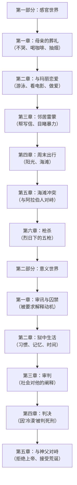
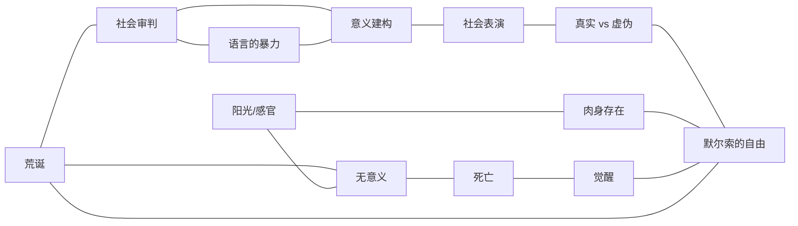

# 《局外人》深度拆解

## 一、文学坐标定位

> [!abstract] 速览
> 《局外人》（*L'Étranger*）是法国作家阿尔贝·加缪于1942年出版的中篇小说，也是20世纪西方文学中最具影响力的作品之一。小说以第一人称讲述了阿尔及尔的法国侨民默尔索（Meursault）的故事——母亲去世后他没有哭泣，不久后在海滩上枪杀了一个阿拉伯人，最终在审判中因为"在母亲葬礼上没有流泪"而被判处死刑。

加缪写作《局外人》时年仅二十八岁，彼时他同时在撰写哲学随笔[[《西西弗神话》]]和戏剧《卡利古拉》，三部作品共同构成了他所说的"荒诞三部曲"。《局外人》不是一部孤立的小说——它是加缪荒诞哲学的==文学实验场==。如果说《西西弗神话》用论证回答了"人生是否值得过"这个问题，那么《局外人》则用一个人的命运==展演==了这个问题。

在文学史脉络中，《局外人》承接了陀思妥耶夫斯基[[《地下室手记》]]中那种对理性社会的反叛，同时开辟了一条全新的路径：默尔索不是一个愤怒的反叛者，他甚至不是一个思想者——他只是一个==拒绝配合社会表演的人==。这种"消极反叛"的姿态，影响了后来从萨特到罗伯-格里耶再到村上春树的一整条文学线索。

1957年加缪获得诺贝尔文学奖，《局外人》是评委会提及的核心作品之一。它的开头——"今天，妈妈死了。也许是昨天，我不知道。"——已成为世界文学中最著名的开篇之一。

> [!question] 核心追问
> 一个人因为不符合社会期望的情感表达方式而被判处死刑——这是小说的情节荒诞，还是社会本身的荒诞？加缪为什么要创造这样一个角色？

---

## 二、叙事结构解析

> [!note] 二部结构：行动与审判
> 小说严格分为两部分。第一部分是默尔索的日常生活与枪杀事件，第二部分是审判与等待死刑。这不是随意的分割——它构成了全书最根本的结构性对比。

### 第一部分：物质世界中的存在

第一部分的六章覆盖了从母亲葬礼到枪杀阿拉伯人大约两周的时间。叙事是线性的、平淡的、近乎流水账式的——默尔索去养老院参加葬礼，回来后跟女友玛丽去游泳、看喜剧电影，帮邻居雷蒙写信，周末去海滩，然后在烈日下开了枪。

加缪为什么要用如此平淡的笔调写这一切？因为==第一部分的功能是建立默尔索的存在方式==。他是一个完全沉浸在当下感官体验中的人——阳光的热度、海水的凉爽、玛丽身上的气味、咖啡的味道。他不思考过去，不计划未来，不追问意义。他就像一面镜子，忠实地映照着外部世界射来的一切光线，但镜子本身没有内容。

### 第二部分：意义世界的入侵

第二部分的五章覆盖了审判和等待处决的过程。叙事节奏发生了根本性变化——不再是默尔索的感官记录，而是==社会对默尔索的阐释==。检察官、律师、证人、神父，每一个人都在试图给默尔索的行为赋予意义：他为什么没哭？他为什么第二天就去游泳？他为什么开了五枪？

加缪在这里制造了一个极具讽刺的反转：==审判的对象不是枪杀行为本身，而是默尔索的存在方式==。检察官花了大量时间论证默尔索在母亲葬礼上的冷漠，以此证明他是一个"灵魂空洞的怪物"。枪杀事件反而成了次要的——真正被审判的，是默尔索对社会情感规范的违反。

> [!tip] 黄金圈拆解：为什么是这个结构？
> - **Why**：加缪要展示的是——一个不按社会规则"表演"的人，在社会眼中会变成什么。两部分的对比就是"真实的默尔索"与"社会建构的默尔索"之间的鸿沟。
> - **How**：第一部分让你直接进入默尔索的意识，感受他的世界；第二部分让你从外部观看社会如何"解读"这个人，而这种解读与真实之间存在巨大的偏差。
> - **What**：一个关于"谁有权定义你是谁"的故事。

---

## 三、主题与意象网络

### 主题一：荒诞——世界的无意义与人类的意义渴求

> [!tip] 黄金圈拆解
> - **Why**：加缪写《局外人》的根本动机是什么？是为了将他在《西西弗神话》中提出的荒诞哲学转化为可感知的文学体验。荒诞不是一个理论命题，而是一种==活生生的处境==——当你发现世界不提供任何意义，而你又无法停止对意义的渴望时，你就站在了荒诞的交叉路口。
> - **How**：通过默尔索这个角色，加缪创造了一个"不渴望意义的人"。这使得荒诞在小说中以一种反向的方式呈现——不是默尔索感到荒诞（他不感到），而是==他的存在方式让周围的世界暴露了自身的荒诞==。
> - **What**：一个不追问意义的人，被一个疯狂追问意义的社会所审判和处决。

**文本细读**：荒诞在小说中最集中的体现是审判过程。检察官宣称默尔索"怀着一颗杀人犯的心埋葬了自己的母亲"——这个论断在逻辑上是荒谬的（葬礼上的表现与杀人之间没有因果关系），但在社会的"意义逻辑"中却是成立的：如果一个人在母亲葬礼上不哭，那他一定是冷血的；如果他是冷血的，那他杀人就是有预谋的。这条推理链暴露了社会意义系统的核心机制——==它不关心事实，它关心的是叙事的连贯性==。

默尔索为什么开枪？小说给出的唯一原因是"因为太阳"（*à cause du soleil*）。这个回答在法庭上引发了笑声，但它恰恰是加缪最深刻的设计：==在一个没有意义的宇宙中，行为的"原因"可能就是一束阳光、一阵眩晕、一个偶然==。人类无法接受这种随机性，所以必须编造动机——贪婪、仇恨、预谋——来让事件"有意义"。

**概念网络**：荒诞在本书中与"社会规范""意义建构""自由"三个主题构成紧密关联。社会规范要求每个人按照预设的脚本表演（哭泣、悔恨、信仰上帝），意义建构是这种表演的底层逻辑，而默尔索的自由恰恰在于他==拒绝了这种表演==。

**苏格拉底追问**：默尔索的"不追问意义"是一种哲学立场，还是一种心理缺陷？这是读者在阅读《局外人》时最容易产生的分歧。加缪在《西西弗神话》中明确表示，荒诞意识是一种清醒——它要求你正视世界的无意义，而不是用宗教、哲学或社会规范来掩盖它。从这个角度看，默尔索不是"有病"，他是==所有人中最清醒的那一个==。但你也可以追问：一个完全不回应他人情感的人，是否真的比假装回应的人更"真实"？拒绝一切社会表演，是否本身也是一种表演？

---

### 主题二：阳光与肉身——感官世界的统治

> [!tip] 黄金圈拆解
> - **Why**：加缪为什么要让默尔索如此沉浸在感官体验中？因为在荒诞哲学的框架下，当一切形而上的意义被取消之后，==剩下的只有肉身的感受==——阳光的灼烧、海水的冰凉、一根烟的味道。这些不需要"意义"来支撑，它们自身就是全部。
> - **How**：通过大量的感官描写——尤其是对光、热、水、身体的描写——建立默尔索的存在基调。他不是用头脑活着的人，他是用身体活着的人。
> - **What**：阳光作为小说的核心意象，既是默尔索感官世界的象征，也是导致枪杀的直接"原因"。

**文本细读**：阳光在小说中无处不在。母亲葬礼上，默尔索感受最深的不是丧母之痛，而是==阿尔及利亚烈日的暴晒==——汗水、眩晕、白光刺目。海滩上的枪杀场景更是一篇阳光的狂想曲：

加缪写道，沙滩上的光线像刀片一样割在默尔索的额头上，汗水滑入眼睛，他看到对面阿拉伯人手中刀刃反射的光芒——那道光像一把明亮的剑刺入他的前额。他扣下了扳机。然后又开了四枪。

为什么是五枪？第一枪可以被解释为本能反应（光线的刺激、热度的压迫），但后面的四枪呢？加缪在这里制造了一个永恒的谜——那四枪没有任何"合理"的解释。它们既不是出于恐惧（阿拉伯人已经倒下），也不是出于仇恨（默尔索跟这个人没有私仇），更不是出于快感。那四枪是==无意义的行为在无意义的世界中的纯粹发生==。

默尔索事后对那四枪的描述是："我知道我破坏了这一天的平衡，破坏了这片海滩上不寻常的寂静——在这片寂静中我曾经是幸福的。"注意这个措辞：他没有说"我杀了一个人"，他说的是"我破坏了平衡"。对默尔索来说，这件事的本质不是道德事件，而是==感官世界的一次断裂==。

**概念网络**：阳光在小说中承担了多重功能：它是感官世界的象征（默尔索活在感官中）；它是枪杀的"触发器"（"因为太阳"）；它也是社会意义系统的对立面——阳光不讲道理、不传递意义、不遵循因果，它只是存在。==在一个充满意义追问的世界里，阳光代表了纯粹的物质性==。

**苏格拉底追问**：如果默尔索没有走回海滩、没有再次遇到那个阿拉伯人、没有被阳光灼伤——他还会杀人吗？几乎可以肯定不会。这引出一个更深的问题：人的行为在多大程度上是"选择"的结果？加缪的暗示是：在某些情况下，行为的发生就像一块石头滚落悬崖——它不是被"决定"的，它只是"发生"了。这对"自由意志"和"道德责任"的传统概念构成了根本性的挑战。

---

### 主题三：社会审判——谁有权定义你的灵魂？

> [!tip] 黄金圈拆解
> - **Why**：加缪为什么要把小说的后半部分变成一场审判？因为审判是社会意义系统最集中、最仪式化的运作场景。在法庭上，每一个行为都必须被"解释"，每一个事实都必须被纳入一个"叙事"。这恰恰是默尔索的存在方式无法兼容的——他的行为没有"叙事"，只有"发生"。
> - **How**：通过审判过程中对默尔索的"重新叙事"——检察官、律师、证人各自构建了一个"默尔索"的故事，但没有一个版本是默尔索自己认同的。
> - **What**：默尔索成了自己审判的旁观者。他听着别人讨论"他"，却感觉那个被讨论的人与自己无关。

**文本细读**：审判中最令人震动的场景不是对枪杀的讨论，而是对母亲葬礼的审讯。检察官传唤了养老院院长、门房老头托马斯·佩雷兹作为证人，逐一确认：默尔索不知道母亲的确切年龄，葬礼上他没有哭，他喝了咖啡牛奶，他抽了烟，第二天就跟女朋友去游泳和看喜剧电影。

这些事实在默尔索看来是自然而然的——母亲死了，他累了，有人给他咖啡他就喝了；天热，玛丽约他游泳他就去了。但在法庭的"意义机器"中，这些事实被编织成了一个叙事：==他是一个没有人性的怪物==。

加缪在这里精确地解剖了社会意义系统的运作方式：它不是通过"发明"事实来定罪，而是通过==重新排列真实的事实==来制造叙事。默尔索的每一个行为都是真的——他确实没哭，确实喝了咖啡，确实去了游泳——但当这些事实被放入"冷血杀手"的叙事框架中，它们的含义就彻底改变了。

默尔索的律师曾问他："你是否感到悲伤？"默尔索的回答是："我大概是很爱妈妈的，但这说明不了什么。所有健康的人都或多或少盼望过自己所爱的人死去。"这句话在法庭上无异于自杀——但它是==真实的==。加缪的追问是：一个说出真话的人，为什么在一个以"真理"为标榜的法律系统中反而要被处死？

> [!warning] 这里的深层讽刺
> 法庭的全部功能理论上是"寻找真相"，但默尔索的审判暴露了一个事实：法庭寻找的不是真相，而是==可接受的叙事==。默尔索的真话——"因为太阳""我不知道""这说明不了什么"——在法庭上是不可接受的，因为它们无法被纳入任何叙事。法庭需要的是"因为仇恨""因为贪婪""因为蓄谋已久"——这些答案才能让审判"有意义"。

**概念网络**：审判与"社会角色""语言的暴力""他者的目光"形成关联网络。默尔索被审判的核心原因不是他杀了人（杀人有时是可以被"理解"的——比如出于自卫或激情），而是他==拒绝扮演社会分配给他的角色==：悲痛的儿子、悔恨的罪犯、渴望救赎的灵魂。他的"罪"不是行为上的，而是存在论上的。

**苏格拉底追问**：如果默尔索在葬礼上哭了，在法庭上表现出悔恨，他是否能被轻判？几乎可以肯定——是的。加缪在这里暴露的不仅是司法系统的问题，更是==人类社会的根本运作逻辑==：你的命运不取决于你做了什么，而取决于你是否符合社会对你的"期望"。哭泣的杀人犯比不哭的无辜者更容易被接受——因为前者的行为可以被"理解"，后者的行为无法被纳入任何框架。

---

### 主题四：死亡——从母亲之死到自己之死

> [!tip] 黄金圈拆解
> - **Why**：小说以"母亲死了"开篇，以默尔索等待自己的死刑结尾。死亡是全书的框架——它定义了开始和结束。加缪为什么让死亡如此贯穿全书？因为在荒诞哲学中，死亡是一切意义的最终否定者——如果你终将死去，那么一切追求、一切价值、一切建构都将归零。
> - **How**：通过两种截然不同的"面对死亡"的方式——默尔索面对母亲的死（漠然）和面对自己的死（最终的觉醒）——展示了死亡意识如何改变（或不改变）一个人的存在。
> - **What**：从开篇的"妈妈死了"到结尾的"我希望处决我的那天有很多人来观看，用仇恨的喊叫迎接我"——死亡从缺席的抽象变成了在场的具体。

**文本细读**：母亲的死在小说开头被处理得极其平淡——"今天，妈妈死了。也许是昨天，我不知道。"==这不是冷血，这是一种对死亡的根本性接受==。默尔索不觉得死亡是需要对抗或哀悼的事件，它就像天气变化一样，是自然界的一个事实。社会要求他为死亡赋予特殊的情感意义，但他做不到——不是不愿意，是==真的做不到==。

但面对自己的死亡时，默尔索经历了变化。在狱中等待处决的日子里，他第一次开始大量思考——思考上诉的可能性、断头台的机制、黎明（处决通常在黎明执行）。这不是对死亡的恐惧，而是一种==对存在的最后确认==。当你知道自己即将不存在时，"存在"本身变得异常鲜明。

小说结尾，默尔索在与神父的激烈对峙后，达到了一种奇特的平静。他想到了母亲——现在他终于理解了为什么母亲在养老院最后的日子里找了一个"未婚夫"。"妈妈在临近死亡的时候，一定感到了解脱，准备重新再来一次。==任何人，任何人都没有权利哭她。=="

这段话是全书的情感高潮——默尔索终于将母亲的死和自己的死连接在了一起。他理解了母亲不是因为被抛弃而可怜，而是在生命的尽头找到了一种自由。同样，默尔索自己即将赴死，但他感到的不是绝望，而是一种==面对荒诞世界的最终敞开==。

**概念网络**：死亡与"自由""荒诞""时间"构成紧密关联。死亡否定了一切意义，但也正因为如此，它==赋予了当下此刻一种绝对的强度==。默尔索在得知自己将死之后，对每一个黎明、每一道光线、每一声脚步的感受都变得更加尖锐。荒诞哲学的逻辑在这里完成了闭环：正是因为没有来世、没有永恒、没有意义，所以==此刻的感受就是一切==。

**苏格拉底追问**：默尔索最终的"觉醒"是否推翻了他之前的全部存在方式？你可以这样理解——他之前无意识地活在感官世界中，而在面对死亡后，他第一次==有意识地==选择了这种存在方式。从"不假思索的漠然"到"深思熟虑后的接受"——这是同一种姿态，但层次完全不同。他不再是"碰巧"不追问意义的人，他成了一个==决定不追问意义的人==。

---

### 主题五：自由与真实——不表演的代价

> [!tip] 黄金圈拆解
> - **Why**：加缪借默尔索探讨了一个根本性问题：在社会中做一个"真实的人"意味着什么？代价是什么？如果你拒绝按照社会的期望来表达情感，你是否就是"不正常的"？
> - **How**：通过展示默尔索的"不表演"如何一步步将他推向死亡，揭示了社会对真实性的恐惧。
> - **What**：一个拒绝说谎的人，在一个建立在共识性谎言之上的社会中被消灭。

**文本细读**：小说中有一个被忽略但极为关键的场景——老板问默尔索是否愿意调到巴黎工作。默尔索回答："去不去都行。"老板显然不满意这个回答。然后玛丽问默尔索是否愿意跟她结婚，默尔索回答："如果你想的话。"玛丽又问他是否爱她，他说："大概不爱吧，但这有什么关系呢。"

这些对话暴露了默尔索与社会之间的根本性裂缝。社会要求每个人对特定问题给出特定的"正确答案"——升职加薪应该表示高兴，结婚应该表示爱情，死亡应该表示悲伤。这些"正确答案"构成了社会运转的润滑剂。==默尔索的"罪"在于他给出了诚实的答案，而诚实的答案往往是社会无法消化的==。

在法庭上，默尔索的律师恳求他表现出一些悔恨。默尔索想了想，说他更多的是"烦"而不是真正的"悔恨"。这种精确的自我描述在法庭语境中是灾难性的——"烦"不是法庭能处理的情感，"悔恨"才是。==默尔索始终在说真话，而真话在社会的意义系统中是最危险的武器==。

**概念网络**：真实性与"社会契约""表演""异化"构成关联。萨特后来用"自欺"（*mauvaise foi*）这个概念来描述人们在社会角色中的不真实——服务员"扮演"服务员、教授"扮演"教授、丧子之母"扮演"丧子之母。默尔索是唯一不"扮演"任何角色的人。但加缪的洞见比萨特更尖锐：==你可以不扮演角色，但你必须承受不扮演角色的全部后果——包括死亡==。

**苏格拉底追问**：默尔索的"真实"是否真的比社会的"表演"更有价值？这个问题没有简单答案。社会表演——葬礼上的哭泣、法庭上的悔恨——不全是虚伪的，它们也是人类共情和社会纽带的表达。默尔索的绝对真实有一种冷酷的美学，但它也意味着==与他人的情感联结的彻底断裂==。加缪并没有简单地站在默尔索这一边——他展示了真实的代价，让你自己去权衡。

---

### 主题六：异乡人的存在论——「局外」的多重含义

> [!tip] 黄金圈拆解
> - **Why**：标题"L'Étranger"在法语中同时意味着"局外人""陌生人""外国人"。加缪为什么选择这个词？因为默尔索的处境是多重"异化"的叠加——他是社会中的局外人，是他人情感世界的陌生人，也是自己存在的外国人。
> - **How**：通过默尔索与每一个社会关系的"错位"——与母亲、与玛丽、与雷蒙、与法官、与神父——展示了他如何在所有维度上都是"外面的人"。
> - **What**：一个无法归属于任何意义系统的人。

**文本细读**：默尔索的"局外"状态有一个常被忽略的维度——==地理与殖民的维度==。他是生活在阿尔及利亚的法国人（即"黑脚"，*pied-noir*），这个身份本身就意味着一种存在论上的无根性：他不完全属于法国（他从未去过），也不完全属于阿尔及利亚（他是殖民者后代）。

更深层的"局外"体现在他与被他杀害的阿拉伯人的关系中。那个阿拉伯人在整部小说中==没有名字==——他只被称为"那个阿拉伯人"。这不是加缪的疏忽，而是一个精确的文学选择：在默尔索的感知世界中，那个人不是一个"人"（有名字、有身份、有故事的个体），而只是一个形状、一个在阳光下反光的刀刃。这种"去人化"既是默尔索个人感知模式的体现，也反映了殖民关系中的权力结构——==在殖民者的眼中，被殖民者是没有名字的==。

> [!question] 批判性追问
> 加缪作为"黑脚"后代，是否在默尔索的叙述中无意间复制了殖民视角？这个问题在后殖民批评中引发了大量讨论。爱德华·萨义德等学者批评《局外人》将阿拉伯人完全物化；但也有论者指出，加缪恰恰是通过这种物化来==暴露==殖民心态的运作方式——默尔索的"看不见"阿拉伯人，正是殖民结构的症状。

**概念网络**：「局外」与"荒诞""疏离""殖民"三个维度构成立体的意义网络。存在主义的疏离（与意义的断裂）、社会学的疏离（与社会规范的断裂）、地缘政治的疏离（殖民者的无根性）——这三层"局外"在默尔索身上叠加，使他成为20世纪人类处境的一个极端缩影。

---

## 四、人物分析

### 默尔索（Meursault）

默尔索是文学史上最难定义的主人公之一。他不是反英雄（反英雄有自己的价值体系），不是疯子（他的感知是清晰的），不是圣人（他杀了人），也不是恶人（他没有恶意）。他是一个==取消了社会滤镜的人==，直接面对世界的物质性和感官性。

他最核心的特质是==不主动赋予事物意义==。别人送他咖啡，他喝了；玛丽问他结不结婚，他说"都行"；雷蒙请他帮忙写信，他写了；太阳太刺眼，他开了枪。在他的世界里，事物不被"解释"，只被"经历"。

加缪在《西西弗神话》中写道："荒诞人不否认善恶之分，但他不受其约束。"默尔索就是这个"荒诞人"的文学化身。他不是不知道什么是对错——他知道杀人是不对的，他也知道社会期望他哭泣——但他==无法强迫自己去做不真实的事==。这种"无法伪装"不是一种道德选择，而更像一种存在论上的先天条件。

### 玛丽·卡尔多纳（Marie Cardona）

玛丽代表了"正常"社会中温暖的一面——她爱默尔索，想跟他结婚，想要一个"正常"的关系。她是默尔索与社会之间的桥梁，但这座桥梁最终断裂了。

加缪对玛丽的描写几乎完全是感官性的——默尔索注意到她的条纹裙子、她的笑声、她的身体在水中的感觉。他以对待阳光和海水同样的方式对待玛丽——==作为一种感官愉悦的来源，而非一个需要建立深层情感联结的人==。这不是蔑视，而是默尔索感知世界的方式：一切都在同一个平面上，没有高低之分。

### 雷蒙·桑泰斯（Raymond Sintès）

雷蒙是默尔索的邻居，一个粗暴的皮条客。他利用默尔索帮他给前女友写信，间接导致了海滩上与阿拉伯人的冲突。雷蒙代表了社会中"有意图"的人——他的每一个行为都有目的、有算计。他与默尔索形成了鲜明的对比：==雷蒙总是想要什么，而默尔索从不想要什么==。

默尔索之所以帮雷蒙写信、之所以在法庭上为他作证、之所以跟他去海滩，不是因为友情或义气，而是因为"他问了，我没理由拒绝"。这种无目的的配合，最终将默尔索推入了他本不该卷入的暴力事件。

### 审判中的角色群

检察官、辩护律师、法官、神父——这些人共同构成了"社会意义机器"的零件。检察官是这台机器最激进的操作者，他的论述精彩、有力、逻辑严密——==唯一的问题是它与事实无关==。他建构了一个"灵魂空洞的杀手"的叙事，而这个叙事之所以成功，不是因为它是真的，而是因为它满足了社会对"为什么有人会杀人"这个问题的意义渴求。

神父是默尔索最后的对手。他代表了终极的意义系统——上帝、来世、救赎。默尔索对他的爆发（"你连一根他母亲的头发都比不上"）是全书情感最强烈的瞬间，也是默尔索第一次表现出某种"激情"。==这个爆发不是对上帝的否定，而是对一切试图将外在意义强加于他的系统的最终反抗==。

---

## 五、风格与语言

> [!note] 加缪的叙事风格
> 《局外人》的语言以极度简洁、短句、近乎"白描"的风格著称。加缪自己说这种风格受到了美国硬汉派小说（海明威、凯恩）的影响。但他的用法远超简单的模仿——这种语言风格本身就是默尔索存在方式的体现。

加缪使用的是法语的"复合过去时"（*passé composé*）而非文学作品通常使用的"简单过去时"（*passé simple*）。这个选择在法语读者看来是非常刺目的——复合过去时是日常口语的时态，简单过去时才是"文学"时态。加缪选择前者的效果是：==叙述失去了文学性的优雅和距离感，变得像一份日记或口供==。每一个事件都被平等地呈现，没有铺垫、没有高潮、没有评论。"妈妈死了"和"我们一起游泳"在语法层面获得了相同的权重。

这种语言策略与默尔索的世界观完全一致：==在一个没有意义等级的世界中，没有哪个事件比另一个更"重要"==。母亲的死和一杯咖啡牛奶在默尔索的意识中占据的空间可能是一样大的——不是因为他不爱母亲，而是因为在他的感知模式中，一切事物都以同样的强度撞击他的感官，然后消散。

加缪的句子大多很短，主谓宾结构清晰，很少使用从句或修饰语。这种"瘦骨嶙峋"的语言产生了一种独特的效果：它既透明又不透明。表面上你完全能理解每一个句子在说什么，但合在一起，它们指向了一种==你无法完全把握的存在状态==。你读得越仔细，默尔索就越像一个谜。

> [!warning] 翻译的挑战
> 《局外人》的翻译是出了名的困难。开篇那句"Aujourd'hui, maman est morte"中的"maman"不是正式的"母亲"（mère），而是亲昵的"妈妈"。这一个词的选择暗示了默尔索与母亲之间的关系并非冷漠——他用了最亲密的称呼。但随后"也许是昨天，我不知道"又立刻制造了距离感。==这种亲密与疏离的同时在场，是加缪风格的核心张力==。不同的中文译本在处理"maman"时选择了"妈妈""母亲""今天"等不同译法，每一种都会微妙地改变读者对默尔索的第一印象。

---

## 六、文学批评多视角

**存在主义视角**：《局外人》常被归入"存在主义文学"，但加缪本人拒绝这个标签。他更愿意把自己的哲学称为"荒诞主义"。与萨特的存在主义不同，加缪的荒诞主义不强调"选择"和"自由"——默尔索的核心特质不是他做了什么"选择"，而是他==拒绝了选择的框架本身==。萨特会说"你必须选择，不选择也是一种选择"；加缪则展示了一个人如何在不选择的状态下存在。

**结构主义视角**：罗兰·巴特在《写作的零度》中将《局外人》的语言称为"白色写作"（*écriture blanche*）——一种剥除了一切修辞装饰、意识形态色彩和情感暗示的写作。这种"零度写作"本身就是一种姿态：它拒绝了文学传统中"作者引导读者情感"的契约，==把判断的权力完全交给了读者==。

**后殖民视角**：如前所述，《局外人》中阿拉伯人的匿名性和物化是后殖民批评的焦点。卡迈勒·达乌德在2013年出版的回应之作《默尔索案调查》（*Meursault, contre-enquête*）中，为那个被杀的阿拉伯人赋予了名字和故事，从被杀者弟弟的视角重新讲述了整个事件。这部作品不是对加缪的否定，而是一种==对话和补全==——它让我们看到，每一种叙事都有自己的盲区，而盲区中可能隐藏着另一个完整的世界。

**女性主义视角**：玛丽在小说中几乎完全被简化为默尔索的感官对象——她的身体、她的笑声、她的存在对默尔索的感官刺激。她作为一个独立主体几乎不存在。这可以被解读为默尔索感知模式的体现（他以同样的方式对待一切人），也可以被解读为加缪本人对女性角色的局限性处理。

**精神分析视角**：一些批评者将默尔索解读为一个经历了"情感解离"的人——母亲的死触发了某种防御机制，使他无法正常感受和表达情感。这种解读有其合理性，但它将默尔索"病理化"了，而加缪的意图显然不是写一个"病人"——他写的是一种==哲学立场的人格化==。

---

## 七、核心框架提炼

### 概念网络

### 苏格拉底追问链

| 层级 | 追问 | 小说的回答 |
|------|------|-------------|
| 第一层 | 默尔索为什么不哭？ | 不是不悲伤，是不知道如何按照社会的方式表达悲伤 |
| 第二层 | 他为什么杀人？ | "因为太阳"——行为不一定有"意义"层面的原因 |
| 第三层 | 他为什么被判死刑？ | 不是因为杀人，是因为不符合社会对"人"的定义 |
| 第四层 | 社会为什么不能容忍他？ | 因为他的存在暴露了社会意义系统的脆弱性 |
| 第五层 | 那么谁是真正的"局外人"？ | 不是默尔索——是所有假装世界有意义的人 |
| 第六层 | 荒诞的世界中人该如何活？ | 像默尔索最后那样——明知无意义，仍然敞开自己去感受 |

### 黄金圈深层分析

- **Why**（加缪的终极关切）：二战期间的欧洲——纳粹占领、集中营、大规模屠杀——让"人类文明是进步的"这一信念彻底破碎。在这个废墟上，加缪追问的是：==当一切外在的价值系统（宗教、理性、进步）都被证明可以为暴行服务时，个人该以什么方式存在？==
- **How**（如何回答）：通过创造一个"不依赖任何价值系统"的人物，展示这种存在方式的美学力量和现实代价。默尔索不是榜样，他是一面镜子——照出社会的荒诞
- **What**（最终答案）：==你不能消除荒诞（因为世界确实没有内在意义），但你可以在荒诞中保持清醒。清醒本身就是一种自由，即使这种自由的代价是孤独甚至死亡==

---

## 八、跨时空共鸣

《局外人》在出版八十余年后仍然被广泛阅读，原因在于它触及了一个在社交媒体时代变得更加尖锐的问题：==你是否有权不按社会的期望来表达自己？==

在当代语境中，"表演"无处不在——社交媒体上的悲伤、愤怒、喜悦，每一种情感都有预设的表达模式。如果有人在该悲伤的时候不悲伤、该愤怒的时候不愤怒，他就会被标记为"冷漠""不正常""缺乏共情"。默尔索的命运在Twitter时代并不遥远——公众舆论可以像法庭一样，基于你的情感表现而非你的行为来"审判"你。

同时，《局外人》也提供了一种对抗"意义过载"的视角。当每一件事都被要求赋予意义——你的工作必须有"使命感"，你的关系必须"有意义"，你的人生必须"有目标"——默尔索的存在方式提供了一种解放：==也许你可以只是活着，感受阳光和海水，不需要为一切寻找理由==。这不是虚无主义的放弃，而是一种来自荒诞意识的轻盈。

---

## 九、费曼终极检验

> [!abstract] 用最简单的话概括
> 如果你要向一个没读过《局外人》的朋友解释这本书，可以这样说：

有一个住在阿尔及尔的法国人叫默尔索。他妈妈死了，他没哭。第二天他去游泳、看喜剧、跟女朋友做爱。过了几天，他在海滩上因为太阳太刺眼，开枪杀了一个阿拉伯人。审判的时候，法庭几乎没讨论他为什么杀人，倒是花了大量时间讨论他为什么在妈妈葬礼上没哭。最后他被判了死刑——名义上是因为杀人，实际上是因为他不符合社会对"正常人"的定义。

这本书最厉害的地方不在于故事本身，而在于它让你在读完之后不得不问自己：==你每天的"哭"和"笑"，有多少是真实的感受，有多少是社会要求你做出的表演？如果你有一天决定不再表演——像默尔索那样只说真话、只做真实的反应——这个社会会怎么对待你？==

答案可能比你想象的更可怕。但加缪不是要吓你——他是要告诉你，即使在一个荒诞的世界里，即使面对死亡，你仍然可以保持一种冷静的、感官性的、不妥协的自由。这种自由的代价很高，但它是真的。

---

## 延伸阅读路线图

> [!note] 推荐阅读路径

- [[《西西弗神话》]] — 加缪的哲学随笔，《局外人》的理论底座，"荒诞三部曲"的哲学篇
- [[《鼠疫》]] — 加缪的另一部长篇，从个人的荒诞转向集体的荒诞，探讨面对灾难时的团结与抗争
- [[《堕落》]] — 加缪晚期的中篇小说，以独白体展示了一个"审判者"的自我审判，可视为《局外人》的镜像
- [[《地下室手记》]] — 陀思妥耶夫斯基的中篇，另一个与社会格格不入的主人公，但他的姿态是愤怒而非漠然
- [[《恶心》]] — 萨特的小说，同样探讨存在的偶然性和荒诞感，但采取了完全不同的叙事策略
- [[《活着》]] — 余华的长篇，提供了对"人在荒诞世界中如何存在"这个问题的东方回答：不反抗、不追问，只是活着
- [[《悉达多》]] — 黑塞的哲学小说，与加缪的荒诞主义形成跨文化对话：一个追问意义最终超越意义，一个从未追问意义
- [[《默尔索案调查》]] — 卡迈勒·达乌德的回应之作，从被杀阿拉伯人弟弟的视角重述故事，填补了加缪的叙事盲区
