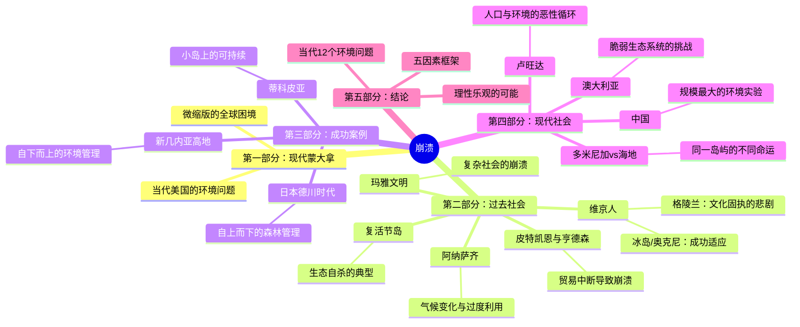
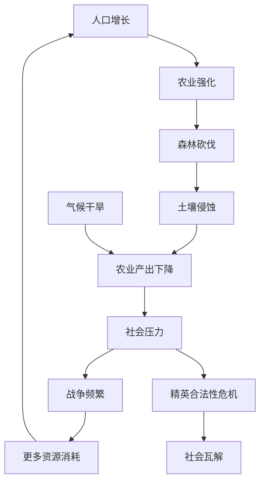
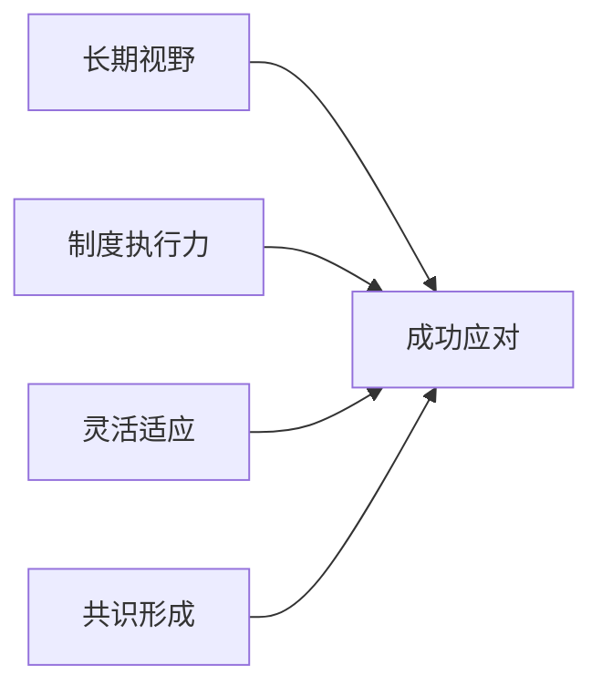

# 《崩溃》深度拆解

## 一、史学坐标定位（400字）

《崩溃：社会如何选择成败兴亡》（Collapse: How Societies Choose to Fail or Succeed）是普利策奖得主、加州大学洛杉矶分校地理学教授贾雷德·戴蒙德的又一力作，2005年出版。如果前作《枪炮、病菌与钢铁》解释"为什么有些社会崛起"，本书则从相反角度探讨"为什么有些社会崩溃"。

> [!abstract] 核心主题
> 戴蒙德研究了历史上多个社会的崩溃案例——从复活节岛到玛雅文明，从维京格陵兰到卢旺达——试图回答一个关键问题：==为什么有些社会在面对环境危机时走向崩溃，而另一些社会却能成功生存？==

本书的学术定位独特：它既不是纯粹的历史著作，也不是环保主义宣传册，而是用比较方法论，从生态学、人类学、历史学的交叉视角，建立了一套分析社会兴衰的框架。戴蒙德的野心是：==找到社会崩溃的共同模式，为当代文明提供镜鉴==。

本书提出了影响社会存亡的五因素框架：
1. **环境破坏**：人类对生态系统的损害
2. **气候变化**：自然气候波动的影响
3. **敌对邻居**：外部军事威胁
4. **友好贸易伙伴的减少**：关键资源供给中断
5. **社会对环境问题的反应**：制度与文化因素

---

## 二、全书逻辑地图（500字）

戴蒙德采用==比较案例研究法==，在全书中运用了一个核心分析框架：每个社会的命运都是五个因素相互作用的结果。其中，第五个因素——"社会如何应对问题"——是最关键的，因为它是唯一完全在人类控制之下的变量。

全书的论证逻辑是：
1. **建立模式**：通过历史案例，识别崩溃的共同模式
2. **分析变量**：找出导致不同结果的关键差异
3. **提炼框架**：形成可应用于当代的分析工具
4. **发出警示**：指出当代文明面临的相似风险

---

## 三、逐章深度拆解（5500字）

### 第一部分：「蒙大拿的天空下——现代社会的缩影」

**【核心论点】**

戴蒙德选择美国蒙大拿州作为开篇，并非偶然。这个看似田园诗意的地方，实际上正在经历环境退化、经济困境和价值冲突——这是全球问题的微缩版。

**【详细拆解】**

蒙大拿面临的问题：
- **矿业遗留的毒污染**：一个多世纪的采矿留下了重金属污染
- **森林管理困境**：过度伐木与野火风险的平衡
- **土壤盐碱化**：农业灌溉导致的土地退化
- **外来物种入侵**：打破生态平衡
- **水资源争夺**：农业、城市、生态用水的冲突

> [!tip] 费曼式解读
> 蒙大拿就像一面镜子：它拥有美国最纯净的自然，却也面临最棘手的环境困境。这告诉我们：==即使在发达国家，环境问题也没有简单的解决方案==。关键不是有没有意识到问题，而是各利益方能否达成共识并采取行动。

**【金句/关键概念】**

> "蒙大拿提醒我们：环境问题不只是贫穷落后社会的专利，它同样困扰着世界上最富裕的国家。"

---

### 第二部分第1章：「复活节岛——最纯粹的生态自杀」

**【核心论点】**

复活节岛是戴蒙德最重要的案例，因为它是一个"对照实验"——一个完全孤立的小岛，没有外敌入侵，没有贸易伙伴中断，社会崩溃完全是内部环境破坏的结果。

**【详细拆解】**

复活节岛的悲剧脉络：

| 阶段 | 时间 | 状况 |
|------|------|------|
| 繁荣期 | 公元900-1600年 | 人口增长，建造石像 |
| 危机期 | 1600-1700年 | 森林消失，资源耗尽 |
| 崩溃期 | 1700年后 | 战争、人相食、文明瓦解 |

为什么会走到这一步？

1. **石像竞赛的陷阱**：各部落竞相建造更大的摩艾石像，这需要大量木材用于运输
2. **资源依赖的脆弱性**：没有树木就无法造船，无法出海捕鱼
3. **无处可逃**：孤立的地理位置意味着没有移民的选项
4. **精英的短视**：酋长们关心的是眼前的权力竞争，而非长期生存

> [!warning] 苏格拉底追问
> **Q：砍倒最后一棵树的人在想什么？**
>
> 戴蒙德推测了几种可能：
> - "技术会拯救我们"（盲目乐观）
> - "没有证据表明树木正在减少"（否认现实）
> - "我的利益比长期生存更重要"（理性但自私）
> - "神会保佑我们"（宗教迷信）
>
> 这些思维模式，在当代社会中依然存在。

**【费曼式解读】**

想象你生活在一个没有邻居的农场，所有资源都要自给自足。你知道农场的树木有限，却还是把树全砍了来建一座纪念碑——因为隔壁村子（其实没有隔壁村子）建了一座。这就是复活节岛的悲剧。它告诉我们：==人类完全有能力毁灭自己，而且往往是在竞争中集体走向毁灭==。

**【金句/关键概念】**

> "复活节岛是地球的缩影。我们也生活在一个孤立的岛上——它叫地球——没有外星人会来拯救我们。"

---

### 第二部分第2章：「维京格陵兰——文化固执的代价」

**【核心论点】**

如果复活节岛展示的是"生态自杀"，维京格陵兰则展示了另一种崩溃模式：==不是缺乏资源，而是拒绝适应==。与此同时，同样环境下的因纽特人却生存下来。

**【详细拆解】**

维京人与因纽特人的对比：

| 维度 | 维京人 | 因纽特人 |
|------|--------|----------|
| 居住时间 | 约450年（约985-1450年） | 至今 |
| 食物来源 | 牛羊畜牧（不适合北极） | 海豹、鲸鱼（适应环境） |
| 技术适应 | 拒绝学习因纽特技术 | 几千年的北极生存经验 |
| 文化态度 | 视因纽特人为"劣等民族" | 实用主义 |
| 最终命运 | 灭绝 | 生存 |

为什么维京人拒绝适应？

1. **宗教认同**：他们是基督徒，吃海豹被视为野蛮行为
2. **文化优越感**：不屑于向"原始人"学习
3. **社会结构**：教会和酋长的投资都在畜牧业上，转型会损害既得利益
4. **身份认同**：放弃欧洲生活方式意味着"不再是维京人"

> [!abstract] 第一性原理拆解
> 维京格陵兰的崩溃揭示了一个深刻的悖论：==有时候，正是让一个社会成功的东西——强烈的文化认同、社会凝聚力——反而阻止了它在新环境下的适应==。
>
> 用现代术语说，这叫"路径依赖"或"创新者的窘境"。

**【费曼式解读】**

想象一个来自南方的家庭搬到阿拉斯加。他们坚持穿丝绸衣服、种植水稻、拒绝学习本地人的取暖方法——因为"那是野蛮人的做法"。结果可想而知。维京格陵兰的故事告诉我们：==生存比体面重要，适应比坚守重要==。当环境改变时，固守旧习的代价可能是灭亡。

**【金句/关键概念】**

> "维京人宁可作为基督徒饿死，也不愿作为'野蛮人'活下去。"

---

### 第二部分第3章：「玛雅文明——复杂社会的崩溃」

**【核心论点】**

玛雅文明的崩溃不是简单的一因一果，而是多重因素的叠加：人口过剩、环境退化、气候变化、战争频繁、政治失灵。

**【详细拆解】**

玛雅崩溃的复合因素：

玛雅案例的独特启示：

1. **复杂性不等于韧性**：玛雅有先进的天文、数学、建筑，却无法应对环境危机
2. **精英的脱节**：国王们忙于建造神庙和发动战争，而非解决农业问题
3. **局部理性导致系统崩溃**：每个城邦的决策可能是理性的，但加起来是灾难
4. **崩溃可以是渐进的**：玛雅不是突然消失，而是几个世纪内逐渐衰落

> [!note] 以史鉴今
> 玛雅的故事与当代社会的相似性惊人：
> - 复杂的技术系统
> - 精英与大众的脱节
> - 对增长的无限追求
> - 对环境成本的忽视
> - 竞争性的"军备竞赛"（石碑/金字塔/武器）

**【费曼式解读】**

玛雅的崩溃就像一场慢动作的车祸。所有人都能看到危险在逼近，但每个人都认为"还有时间"、"问题会自己解决"、"别人会处理的"。这告诉我们：==在复杂系统中，每个人的理性选择加起来可能是集体的非理性；每个人的"再等等"加起来就是"来不及了"==。

---

### 第三部分：「成功案例——日本德川时代的森林管理」

**【核心论点】**

并非所有社会都走向崩溃。日本德川时代（1603-1867年）提供了一个成功的反例：通过==强有力的制度设计==，成功逆转了森林危机。

**【详细拆解】**

德川时代的森林危机与应对：

| 阶段 | 状况 | 应对 |
|------|------|------|
| 危机期（17世纪） | 城市建设、造船导致森林急剧减少 | 意识到问题 |
| 转型期（1700年前后） | 制定严格的森林法规 | 制度创新 |
| 恢复期（18-19世纪） | 森林覆盖率回升 | 持续执行 |

成功的关键因素：

1. **自上而下的权威**：幕府有强制执行的能力
2. **自下而上的参与**：村庄层面的自我管理
3. **长期视野**：统治者关心子孙后代
4. **替代方案**：发展煤炭等替代能源
5. **监测系统**：详细的森林普查和登记

> [!tip] 第一性原理拆解
> 德川案例证明了一个关键洞见：=="公地悲剧"不是命中注定的==。关键在于：
> - **产权明晰**：谁拥有、谁负责
> - **监测到位**：能发现违规行为
> - **惩罚可信**：违规必受罚
> - **利益一致**：长期利益与短期利益对齐

**【费曼式解读】**

想象一个公寓楼，每个住户都可以免费用水，结果所有人都浪费水，最后水源枯竭。德川幕府的做法是：安装水表、按量收费、严惩偷水。听起来简单，但需要强大的执行力。日本的成功告诉我们：==环境保护不是道德问题，是制度设计问题==。

---

### 第四部分：「现代案例——海地与多米尼加」

**【核心论点】**

海地与多米尼加共享同一个岛屿（伊斯帕尼奥拉岛），自然条件相似，但命运截然不同。这个"自然实验"揭示了==制度和政策选择==的决定性作用。

**【详细拆解】**

两国对比：

| 维度 | 多米尼加 | 海地 |
|------|----------|------|
| 森林覆盖率 | 约28% | 约1% |
| GDP人均 | 约$8,000 | 约$800 |
| 环境政策 | 建立保护区体系 | 几乎没有 |
| 政治稳定 | 相对稳定 | 长期动荡 |

为什么同一岛屿有如此不同的命运？

1. **历史遗产**：法国殖民（海地）vs 西班牙殖民（多米尼加）模式不同
2. **独裁者的偶然选择**：特鲁希略（多米尼加独裁者）碰巧喜欢森林
3. **人口压力**：海地人口密度更高
4. **制度路径**：多米尼加较早建立了国家公园系统

> [!warning] 苏格拉底追问
> **Q：同一座岛，为什么一边绿色葱茏，一边光秃秃？**
>
> 从卫星图上，你能清楚看到两国的边界——不是因为有墙，而是因为一边有树，另一边没有。这证明：==环境问题的根源不是自然，而是人的选择==。

**【金句/关键概念】**

> "从太空看，伊斯帕尼奥拉岛最显眼的特征是两国边界——一条由森林与荒漠组成的分界线。"

---

### 第五部分：「当代世界面临的12个环境威胁」

**【核心论点】**

戴蒙德认为，当代社会同时面临==12个相互关联的环境问题==，每一个都足以造成严重危机，它们的叠加可能导致全球性崩溃。

**【详细拆解】**

12个问题清单：

| 序号 | 问题 | 现状 |
|------|------|------|
| 1 | 自然栖息地破坏 | 每年丧失约1%的原始森林 |
| 2 | 野生食物资源枯竭 | 海洋渔业已超负荷 |
| 3 | 生物多样性丧失 | 第六次大灭绝正在进行 |
| 4 | 土壤侵蚀 | 全球约1/4土地已退化 |
| 5 | 化石能源枯竭 | 石油峰值已过或即将到来 |
| 6 | 淡水资源短缺 | 多地已过度抽取地下水 |
| 7 | 光合作用上限 | 人类已利用约50%的陆地光合产物 |
| 8 | 化学污染 | 持久性有机污染物全球扩散 |
| 9 | 外来物种入侵 | 每年造成数千亿美元损失 |
| 10 | 温室气体排放 | 气候变化已不可逆转 |
| 11 | 人口增长 | 预计2050年达90亿 |
| 12 | 人均消费增长 | 发展中国家追赶发达国家 |

> [!abstract] 关键洞见
> 这次与历史上所有崩溃都不同：
> - 以前是**局部崩溃**：一个社会崩溃，其他社会可以继续
> - 现在是**全球关联**：气候变化、物种灭绝、海洋污染都是全球性的
> - ==第一次，人类有能力让整个物种（自己）灭绝==

---

## 四、核心框架提炼（800字）

### 框架1：崩溃的五因素模型

| 因素 | 定义 | 可控性 | 当代对应 |
|------|------|--------|----------|
| 环境破坏 | 人类对生态系统的损害 | 高 | 污染、毁林、资源耗竭 |
| 气候变化 | 自然气候波动 | 低 | 全球变暖（部分人为） |
| 敌对邻居 | 外部军事威胁 | 中 | 地缘政治冲突 |
| 贸易伙伴减少 | 关键资源供给中断 | 中 | 供应链断裂 |
| 社会反应 | 制度与文化适应 | 高 | 政策选择、国际合作 |

### 框架2：社会失败的四种思维陷阱

1. **"以前没问题"陷阱**：基于过去经验的错误外推
2. **"技术会拯救我们"陷阱**：对技术进步的盲目乐观
3. **"这是他们的问题"陷阱**：把外部性推给他人
4. **"经济更重要"陷阱**：短期经济利益优先于长期生存

### 框架3：成功应对的关键要素

- **长期视野**：领导者关心子孙后代
- **制度执行力**：有能力落实决策
- **灵活适应**：愿意改变传统做法
- **共识形成**：社会各方利益对齐

---

## 五、批判性思考（800字）

### 本书的贡献

1. **比较方法的力量**：通过跨文化、跨时代的比较，发现共同模式
2. **环境史的视角**：将环境因素纳入历史解释的核心
3. **实用主义的警示**：不是学术象牙塔，而是面向公众的警钟

### 本书的局限

1. **因果过度简化**：复杂社会的崩溃往往有多重原因，环境只是其一
2. **幸存者偏差**：成功案例可能有独特条件，难以复制
3. **环境决定论倾向**：低估了技术进步和制度创新的潜力
4. **证据的选择性**：为了论证需要，可能强调某些证据、忽视另一些

### 与其他思想的对话

| 观点 | 戴蒙德 | 反对者 |
|------|--------|--------|
| 环境约束 | 是硬约束 | 可被技术突破 |
| 增长极限 | 存在 | 创新无限 |
| 历史教训 | 可借鉴 | 今非昔比 |
| 全球合作 | 必要 | 难以实现 |

> [!warning] 批判性思考
> 戴蒙德的论述虽然有力，但也需要警惕两种极端：
> - **环境悲观主义**：认为崩溃不可避免
> - **技术乐观主义**：认为技术能解决一切
>
> 真相可能在两者之间：==崩溃是可能的，但不是必然的；技术有用，但不是万能的==。关键变量是人类的集体选择。

---

## 六、行动清单（500字）

### 个人层面

1. **消费意识**
   - 了解商品的环境足迹
   - 减少一次性产品使用
   - 支持可持续生产的企业

2. **信息素养**
   - 学会区分环境问题的科学与炒作
   - 警惕"没有证据"不等于"没有问题"
   - 理解概率和长期风险

3. **公民参与**
   - 支持环境政策的政治候选人
   - 参与社区层面的环保行动
   - 用消费者权力推动企业改变

### 思维层面

| 旧思维 | 新思维 |
|--------|--------|
| "以后再说" | "现在就开始" |
| "不关我事" | "我是系统的一部分" |
| "技术会解决" | "技术+制度+行为" |
| "经济vs环境" | "没有环境就没有经济" |

### 社会层面

- **长期主义**：在决策中考虑几代人之后的影响
- **预防原则**：对不可逆损害采取预防措施
- **外部性内化**：让污染者付费
- **国际合作**：全球问题需要全球方案

---

## 七、延伸阅读路线图（300字）

### 戴蒙德的其他著作

| 书籍 | 主题 | 与本书关系 |
|------|------|------------|
| [[《枪炮、病菌与钢铁》]] | 为什么某些社会崛起 | 姐妹篇：崛起vs崩溃 |
| 《第三种黑猩猩》 | 人类的演化 | 人性的生物学基础 |
| 《昨日之前的世界》 | 传统社会的智慧 | 现代社会能学到什么 |

### 相关主题延伸

| 方向 | 推荐书籍 |
|------|----------|
| 气候变化 | 《气候变化的政治》 |
| 生物多样性 | [[《第六次大灭绝》]] - 伊丽莎白·科尔伯特 |
| 系统性风险 | [[《黑天鹅》]] - 塔勒布 |
| 资源约束 | 《增长的极限》 - 罗马俱乐部 |
| 制度设计 | 《公共事物的治理之道》 - 奥斯特罗姆 |

---

## 八、费曼终极检验（400字）

### 一句话总结

> 社会崩溃不是命中注定的——它是选择的结果。历史上有些社会成功应对了环境挑战，关键在于：==他们是否愿意正视问题、改变行为、建立有效的制度==。

### 能否向外行解释清楚？

想象地球是一艘宇宙中的孤船，船上的资源有限，乘客不断增加，废物不断累积。历史上有些小船（社会）沉了——有的是因为疯狂砍树造石像（复活节岛），有的是因为太骄傲不肯学游泳（维京格陵兰），有的是因为船长们忙着打架顾不上漏水（玛雅）。但也有些船修好了漏洞、学会了节约（德川日本）。

现在，我们所有人都在同一艘大船上。以前小船沉了，其他船还可以继续航行。但这一次，==只有一艘船，要么一起活，要么一起沉==。

### 三个核心问题

1. **我们的"复活节岛石像"是什么？**
   我们在为什么消耗不可持续的资源？GDP数字？消费主义？军备竞赛？

2. **我们有什么"维京人式的固执"？**
   什么文化观念、既得利益阻碍了我们适应新现实？

3. **我们需要什么样的"德川式制度"？**
   什么样的全球治理体系能让人类集体理性行动？

> "我们是第一代能够毁灭地球的人类，也是最后一代能够拯救它的人类。"
