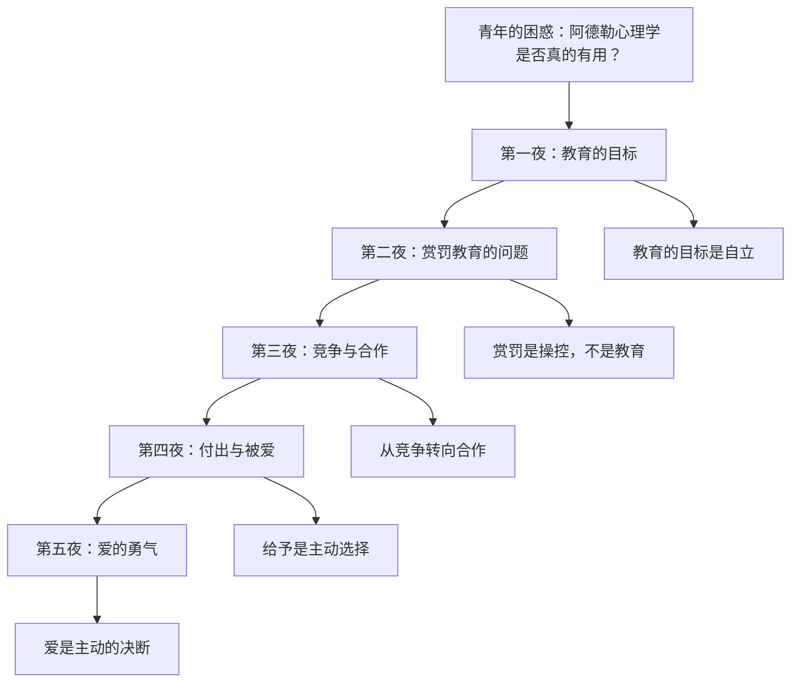
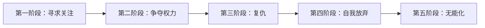
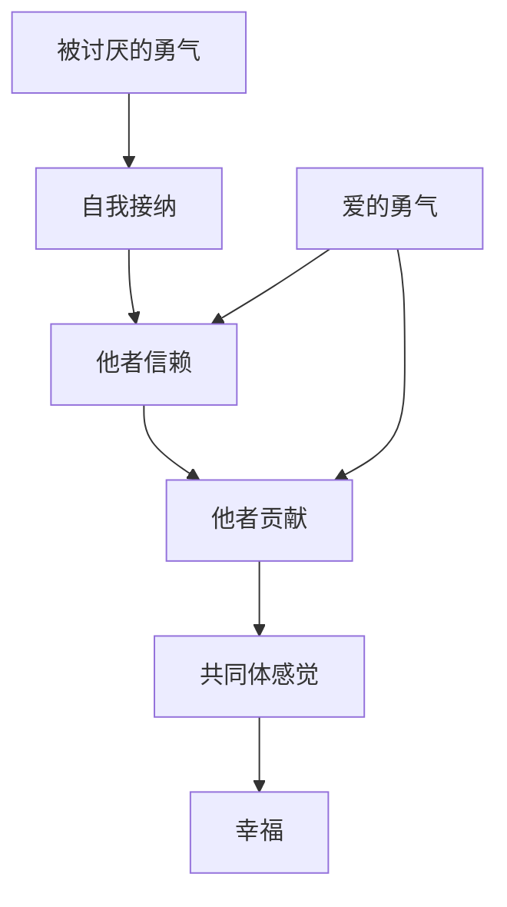

# 《幸福的勇气》深度拆解

## 一、心理学坐标定位（400字）

《幸福的勇气》是日本哲学家岸见一郎与古贺史健合著的阿德勒心理学系列第二部，2016年出版。作为《被讨厌的勇气》的续作，本书延续了青年与哲人的对话形式，但聚焦于一个更具体的场景：==如何将阿德勒心理学应用于教育和人际关系的实践中？==

> [!abstract] 核心主题
> 如果说《被讨厌的勇气》是关于"认识自己"，那么《幸福的勇气》就是关于"与他人建立关系"。本书的核心命题是：**真正的幸福来自于"被讨厌的勇气"之后的"爱的勇气"**。

本书的核心框架：
- **教育的本质是什么**
- **如何建立真正的尊重关系**
- **爱的真正含义**
- **从"自立"走向"共同体感觉"**

> [!tip] 方法论选择
> 本书属于心理学/自我成长类，采用==费曼学习法 + DIKW金字塔 + 反脆弱思维==进行拆解，侧重认知纠偏和实践应用。

---

## 二、全书逻辑地图（500字）

**全书论证链条**：

1. **问题提出**：青年成为教师后，发现阿德勒心理学在实践中处处碰壁
2. **重新审视教育**：教育的目标不是让孩子听话，而是帮助他们自立
3. **批判赏罚**：奖励和惩罚都是操控手段，破坏平等关系
4. **超越竞争**：人生不是与他人的竞争，而是自我超越
5. **理解爱**：真正的爱不是"被爱"，而是"去爱"的主动选择
6. **勇气的最终形态**：幸福需要"爱的勇气"——选择与他人建立深度联结

---

## 三、逐章深度拆解

### 第一夜：「可恶的他人，可怜的自己」

**【核心论点】**

青年带着三年教育实践的挫败感回来质疑哲人：阿德勒心理学是否只是纸上谈兵？哲人的回应是：==问题不在于理论，而在于你是否真正理解了"尊重"的含义==。

**【DIKW四层提炼】**

| 层级 | 内容 |
|------|------|
| Data | 青年在教育实践中遇到挫折，学生不听话 |
| Information | 他试图用阿德勒的方法却失败了 |
| Knowledge | 失败的原因是他把学生当作需要"矫正"的对象 |
| Wisdom | ==尊重是把对方当作独立的人，而非改造的对象== |

**【费曼式解读】**

想象你在教一个孩子骑自行车。如果你的目标是"让他按我说的做"，你会不断纠正、批评、控制。但如果你的目标是"帮助他学会自己骑"，你会在旁边支持，让他自己摸索，摔倒了鼓励他站起来。

教育的本质不是塑造，而是==支持自立==。

**【关键概念】**

> "尊重就是实事求是地看待一个人，认识到他独特的个性。"

---

### 第二夜：「为何要否定"赏罚"」

**【核心论点】**

赏罚教育是最普遍的教育方式，但阿德勒认为这是一种==操控==，而非真正的教育。无论是奖励还是惩罚，都在向孩子传递一个信息：==你需要满足我的期望才能获得认可==。

**【第一性原理拆解】**

> [!tip] 赏罚的本质
> - **奖励的问题**：让孩子为了奖励而行动，而非为了事情本身
> - **惩罚的问题**：让孩子为了逃避惩罚而顺从，而非真正理解
> - **共同问题**：两者都建立了不平等的"操控-被操控"关系

**【DIKW四层提炼】**

| 层级 | 内容 |
|------|------|
| Data | 用奖励让孩子做作业，用惩罚阻止孩子玩手机 |
| Information | 短期有效，但长期会产生依赖或反抗 |
| Knowledge | 赏罚破坏了孩子的内在动机 |
| Wisdom | ==教育应该培养"即使无人监督也会自律"的能力== |

**【费曼式解读】**

假设你每次按时完成工作，老板就给你一颗糖。起初你可能会更努力，但很快你会发现：
1. 没有糖就不想工作了
2. 糖的激励效果越来越弱
3. 你开始怨恨这种交易关系

这就是赏罚的陷阱——它把==内在动机外在化==了。

**【关键概念】**

> "表扬是'有能力的人对没有能力的人的评价'，本质上是一种居高临下的态度。"

---

### 第三夜：「由竞争原理到协作原理」

**【核心论点】**

传统教育强调竞争：考试排名、比较优劣。但阿德勒认为，==竞争心理是许多问题行为的根源==。真正的成长来自于合作，而非竞争。

**【DIKW四层提炼】**

| 层级 | 内容 |
|------|------|
| Data | 学校里有排名、分数、比较 |
| Information | 这培养了孩子的竞争意识 |
| Knowledge | 竞争让人把他人视为敌人，而非伙伴 |
| Wisdom | ==把人生看作"与昨天的自己比"而非"与他人比"== |

**【问题行为的五个阶段】**

> [!warning] 问题行为的根源
> 所有问题行为都可以追溯到一个核心需求：==归属感==。当孩子无法通过正当方式获得归属感时，就会用问题行为来引起注意。

**【费曼式解读】**

想象一个班级是一艘船。如果每个人都想当船长，船就会陷入混乱。但如果大家都知道自己是船员，各司其职，船就能平稳前进。

竞争心理让每个人都想当船长。但实际上，==每个岗位都有价值==，重要的是大家一起把船开好。

---

### 第四夜：「付出，然后才有收获」

**【核心论点】**

本章讨论的核心问题是：==如何建立真正的"共同体感觉"？==答案是：通过"给予"而非"索取"。

**【DIKW四层提炼】**

| 层级 | 内容 |
|------|------|
| Data | 很多人抱怨"我付出了这么多，为什么得不到回报" |
| Information | 这种"付出感"本身就是问题 |
| Knowledge | 真正的给予不期待回报，是主动的选择 |
| Wisdom | ==贡献感带来的满足，本身就是回报== |

**【信任vs信赖】**

> [!note] 关键区分
> - **信任**：基于条件的，"如果你表现好，我就信任你"
> - **信赖**：无条件的，"无论你做什么，我都相信你"

**【费曼式解读】**

借钱给朋友时：
- **信任**：需要他写借条，约定还款日期
- **信赖**：不需要任何担保，相信他会处理好

阿德勒说的"共同体感觉"建立在==信赖==的基础上。这很冒险，但只有无条件的信赖才能建立真正的联结。

---

### 第五夜：「选择爱的人生」

**【核心论点】**

全书的高潮：==幸福的关键是"爱的勇气"==。这里的爱不是被动的感受，而是主动的决断。

**【DIKW四层提炼】**

| 层级 | 内容 |
|------|------|
| Data | 人们常说"我还没遇到对的人" |
| Information | 这是把爱当作被动的"遭遇" |
| Knowledge | 但爱实际上是主动的"决断" |
| Wisdom | ==不是"因为爱所以在一起"，而是"决定在一起所以去爱"== |

**【爱的本质】**

> [!abstract] 爱的三个层次
> 1. **自我中心的爱**：我爱你，因为你让我感觉好
> 2. **条件式的爱**：我爱你，如果你满足我的期望
> 3. **无条件的爱**：我选择爱你，是我的主动决断

**【费曼式解读】**

很多人在等待"对的人"出现，就像等待一辆特定的公交车。但阿德勒说：==与其等待"对的人"，不如成为"对的人"==。

爱不是命运的安排，而是你的选择。当你决定去爱一个人，你就在创造爱。

**【金句】**

> "如果能拥有被讨厌的勇气，那么与人建立联系的勇气——也就是爱的勇气——也将油然而生。"

---

## 四、核心框架提炼（800字）

### 阿德勒幸福公式

### 四个核心概念的关系

| 概念 | 含义 | 实践 |
|------|------|------|
| **自我接纳** | 接受真实的自己，包括不完美 | 不苛责自己，也不自我膨胀 |
| **他者信赖** | 无条件相信他人 | 即使可能被背叛，也选择相信 |
| **他者贡献** | 为他人和共同体做贡献 | 贡献本身就是回报 |
| **共同体感觉** | 感到自己是"我们"的一部分 | 从"我"转向"我们" |

### 从《被讨厌的勇气》到《幸福的勇气》

> [!tip] 两本书的递进关系
> - **《被讨厌的勇气》**：学会"分离课题"，不为他人的评价而活
> - **《幸福的勇气》**：在分离课题的基础上，主动选择"爱与联结"

这两者不是矛盾的。==分离课题是为了不被他人操控，而爱是你主动选择的联结==。

---

## 五、批判性思考（800字）

### 优势与贡献

1. **将抽象理论落地**：通过教育场景，让阿德勒心理学变得可操作
2. **挑战常识**：对赏罚教育的批判，震撼但有启发
3. **重新定义爱**：把爱从被动的"命运"变为主动的"选择"

### 局限与反思

> [!warning] 需要审慎思考的问题
> 1. **理想化倾向**：完全否定赏罚是否过于极端？
> 2. **文化差异**：阿德勒的个体主义是否适合东亚文化？
> 3. **实践难度**："无条件信赖"在现实中是否可行？

### 与其他理论的对话

| 理论 | 与阿德勒的异同 |
|------|----------------|
| **马斯洛需求层次** | 阿德勒强调"归属感"，与马斯洛的"社交需求"相似 |
| **斯多葛哲学** | 两者都强调"关注你能控制的"，但阿德勒更强调与他人的联结 |
| **存在主义** | 都强调"选择"和"责任"，但阿德勒更乐观 |

---

## 六、行动清单（500字）

### 认知层面

- [ ] **重新定义教育**：教育的目标不是"让孩子听话"，而是"帮助孩子自立"
- [ ] **审视赏罚习惯**：觉察自己在日常中使用奖励/惩罚的时刻
- [ ] **区分信任与信赖**：思考自己对他人的相信是有条件的还是无条件的

### 行动层面

- [ ] **练习"横向关系"**：与孩子、下属、同事建立平等的关系
- [ ] **给予不求回报**：做一件对他人有帮助的事，不期待任何回报
- [ ] **主动选择爱**：在重要关系中，从"他应该对我好"转为"我选择对他好"

### 长期修炼

- [ ] **培养贡献感**：每天问自己"今天我为共同体做了什么贡献？"
- [ ] **接受不完美**：允许自己和他人犯错，这是成长的一部分

---

## 七、延伸阅读路线图（300字）

| 书籍 | 关联 |
|------|------|
| [[《被讨厌的勇气》]] | 本书的前作，阿德勒入门必读 |
| [[《自卑与超越》]] | 阿德勒的代表作，理论源头 |
| [[《非暴力沟通》]] | 实践横向关系的沟通方法 |
| [[《正面管教》]] | 将阿德勒理论应用于育儿 |
| [[《爱的艺术》]] | 弗洛姆对爱的深刻分析 |

---

## 八、费曼终极检验（400字）

**如果用一句话向朋友解释这本书的核心观点：**

> 《被讨厌的勇气》教你不为他人的评价而活，而《幸福的勇气》教你在独立的基础上主动选择爱——真正的幸福不是"被爱"，而是"去爱"的勇气。

**这本书改变了什么认知：**

1. **关于教育**：从"如何让孩子听话"转向"如何帮助孩子自立"
2. **关于爱**：从"等待被爱"转向"主动选择去爱"
3. **关于幸福**：从"获得"转向"贡献"

**留下的思考：**

阿德勒的理论很美好，但实践起来确实困难。完全的"无条件信赖"可能会让人受伤，但如果永远不敢信赖，也永远无法建立深度的联结。或许关键不在于"是否会受伤"，而在于==你是否愿意为了可能的深度联结而承担受伤的风险==。

这就是"幸福的勇气"的真正含义——==敢于去爱，即使可能会失去==。
