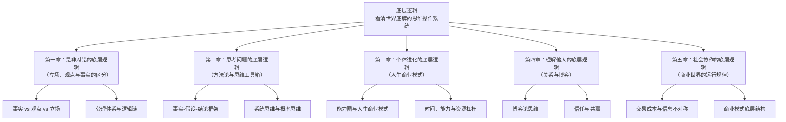
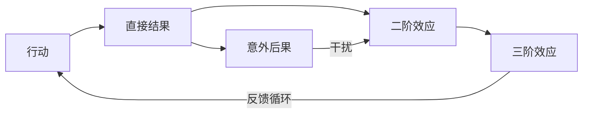
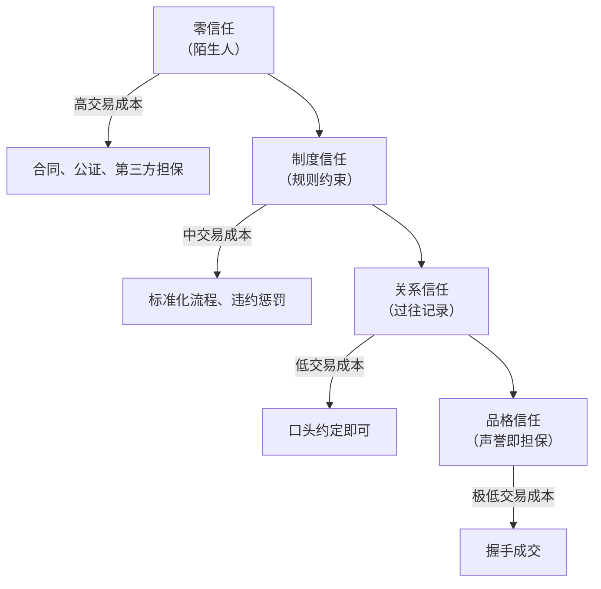
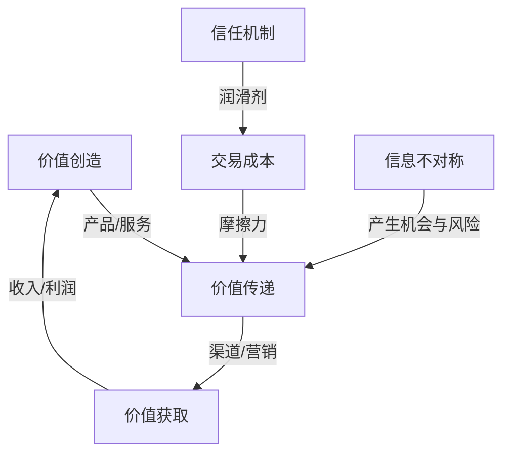

## 一、商业坐标定位

> [!abstract] 速览
> 《底层逻辑：看清这个世界的底牌》是中国商业顾问刘润的代表作，首次出版于2021年。刘润曾任微软中国战略合作总监，后创办"润米咨询"，是中国最具影响力的商业知识传播者之一。他的"5分钟商学院"系列课程在得到App上拥有超过50万订阅用户。

本书的核心主张是：==你看到的每一个现象背后，都有一套"底层逻辑"在支撑==。表面上千变万化的商业世界，底下运行的是数量有限的基本规律。你掌握了这些底层逻辑，就能在不同场景中举一反三——而不是每遇到一个新问题就从零开始。

与一般的商业畅销书不同，本书不是讲"术"（具体技巧），而是讲"道"（思维方式的底层操作系统）。全书分为五个篇章，分别对应五个维度的底层逻辑：是非对错、思考问题、个体进化、理解他人、社会协作。

> [!warning] 阅读提示
> 刘润的写作风格是"咨询师式"的——他擅长用简洁的类比和公式把复杂概念变得通俗易懂。这种简化有巨大的传播力，但也意味着某些论述在学术严谨性上有所牺牲。本笔记会在每个主题下进行第一性原理审查和反脆弱压力测试，帮你区分哪些是经得起推敲的底层逻辑，哪些是需要加条件限定的简化模型。

---

## 二、全书模型地图

> [!note] 核心框架

全书的论证逻辑链：

1. **先校准认知工具**：你要分清事实、观点和立场，否则你连问题都看不清
2. **再升级思考方式**：用系统思维、概率思维等工具箱来分析问题
3. **然后理解自己**：你的人生本质上是一种商业模式，由时间、能力和资源构成
4. **接着理解他人**：人际关系的本质是价值交换和信任博弈
5. **最终理解社会**：商业世界的底层是交易成本、信息不对称和利益结构

---

## 三、逐章深度拆解

### 主题一：「是非对错的底层逻辑」——事实、观点与立场的三层分离

**DIKW四层提炼**

- **Data**：刘润开篇就提出一个核心区分——==一句话到底是事实（fact）、观点（opinion）还是立场（stance）==。他举例："今天气温35度"是事实，"今天很热"是观点，"我们应该放假"是立场。很多争论不是因为人们想法不同，而是因为他们在不同层面对话——一个人在陈述事实，另一个人在表达立场，双方根本不在同一个频道。
- **Information**：当你把事实、观点和立场混为一谈时，你的判断就会被污染。商业决策中最常见的错误之一，就是把立场伪装成事实——比如"这个市场没有机会"（这是立场，不是事实。事实是市场数据，你的结论只是基于你的解读的观点）。
- **Knowledge**：刘润由此引出一条判断标准——==有价值的讨论应该建立在事实之上，经过逻辑推导形成观点，最后再确定立场==。大多数人反过来了——先有立场，再找支持立场的"事实"。
- **Wisdom**：你与世界的关系，首先取决于你能不能看清"什么是"（is），而不是急于判断"应该是什么"（ought）。

**第一性原理审查**：刘润对"事实-观点-立场"的三层区分并非原创——它来自逻辑学和新闻学的基本训练。但刘润的贡献在于把这个学术概念用极其通俗的方式传递给商业读者。底层假设是"人们之所以做出错误判断，主要因为认知混乱"——这在很多情况下成立，但也有局限：有时候人们明知道事实是什么，仍然选择从立场出发行动，因为利益驱动比认知清晰更强大。

**反脆弱压力测试**：这个框架的弱点在于——"事实"本身有时也不那么纯粹。在复杂商业环境中，很多"事实"其实是被选择性呈现的数据。数据本身是客观的，但"选择呈现哪些数据"这个行为已经包含了立场。因此，这个框架更适合用作==自我审查工具==（我现在说的到底是事实还是观点？），而不适合天真地假设"只要找到事实，答案就清楚了"。

> [!tip] 核心公式
> **一个人的判断质量 = 事实的准确度 x 逻辑的严密度 x 立场的中性度**
> 三者中任何一个被污染，结论都不可信。

**费曼式解读**：想象你戴着一副有色眼镜看世界——红色镜片让一切看起来偏红（立场），镜片上的灰尘模糊了细节（观点混淆为事实），而镜片的度数不对让远处的东西变形（逻辑错误）。刘润说的是：==先摘下眼镜，用裸眼看清楚事实是什么，然后再决定戴不戴眼镜、戴什么颜色的眼镜==。

---

### 主题二：「思考问题的底层逻辑」——概率思维、系统思维与动态博弈

**DIKW四层提炼**

- **Data**：刘润在第二章引入了几个核心思维工具。首先是"假设-验证-结论-调整"的科学思考循环——你面对任何问题，不是直接下结论，而是先形成假设、用数据验证、得出初步结论、再根据新信息调整。其次是概率思维——==用概率而非确定性来看待世界==。
- **Information**：大多数人的思考方式是"线性因果"（A导致B），而真实世界是"系统性因果"（A与B、C、D相互影响，形成反馈循环）。你以为降价会增加销量（线性思维），但降价可能同时损害品牌形象、引发竞争对手价格战、降低利润率导致无法投入研发（系统思维）。
- **Knowledge**：刘润提出==要区分"充分条件"和"必要条件"==。很多人犯的错误是把"必要条件"当成"充分条件"——比如"努力是成功的必要条件"变成了"只要努力就能成功"。真正的底层逻辑是：成功 = 正确的方向 x 足够的努力 x 适当的运气。
- **Wisdom**：你的决策质量取决于你的思维工具箱有多丰富。只有一种思维方式，就像只有一把锤子——看什么都像钉子。

**第一性原理审查**：刘润在这一章的核心假设是"好的思考方式可以学习和训练"。这个假设基本成立——心理学研究表明，批判性思维和概率思维确实可以通过训练提升。但需要注意的是，==知道好的思维方式和实际使用好的思维方式之间有巨大鸿沟==。丹尼尔·卡尼曼在[[《思考，快与慢》]]中指出，即使是了解认知偏误的专家，在实际决策中仍然会犯这些错误。思维方式的升级不是一次性的知识获取，而是持续的刻意练习。

**反脆弱压力测试**：概率思维的一个陷阱是"赌场谬误的反面"——当你开始用概率思考一切时，你可能会忽略小概率事件的巨大影响（黑天鹅效应）。纳西姆·塔勒布的思想在这里形成了重要补充：概率思维在"平均斯坦"（正态分布的世界）中很有用，但在"极端斯坦"（幂律分布的世界，如科技行业、金融市场）中，你需要的不是计算概率，而是建立对极端事件的抵抗力（反脆弱性）。

> [!note] 系统思维的核心模型

> 刘润的系统思维强调：==你做的每一个决策都有多阶效应，只看第一阶就行动是线性思维的陷阱==。

**费曼式解读**：一个池塘里有一片荷叶，每天面积翻倍。第30天荷叶铺满整个池塘。问题：荷叶铺满半个池塘是第几天？答案是第29天。大多数人凭直觉猜第15天——因为线性思维让你以为"一半的结果需要一半的时间"。但指数增长不是线性的。刘润的概率思维和系统思维本质上在说同一件事：==你的直觉在面对非线性世界时会严重失灵，你需要用更好的工具来替代直觉==。

---

### 主题三：「个体进化的底层逻辑」——人生商业模式

**DIKW四层提炼**

- **Data**：刘润提出了一个大胆的类比——==每个人都是一家公司==。你的"人生商业模式"由三个要素决定：能力、效率和杠杆。能力决定你能创造什么价值，效率决定你能多快创造这些价值，杠杆决定你能把价值放大多少倍。
- **Information**：大多数人把全部精力放在"能力"上——学更多技能、考更多证书。但刘润指出，==能力的提升是线性的，而杠杆的提升是指数的==。一个能力很强但没有杠杆的人（比如一个优秀的个体手艺人），收入被时间天花板锁死。一个能力一般但懂得使用杠杆的人（比如一个平台创始人），收入可以指数级增长。
- **Knowledge**：刘润总结了四种杠杆——人力杠杆（雇人）、资本杠杆（用钱生钱）、产品杠杆（创造可复制的产品）、影响力杠杆（品牌和流量）。产品杠杆和影响力杠杆是最强大的，因为它们的边际成本趋近于零。一本书、一门在线课程、一个软件产品——一旦创造出来，服务第一个人和服务第一百万个人的成本几乎相同。
- **Wisdom**：==不要只问"我怎么提升能力"，更要问"我怎么选择杠杆"==。在能力相同的情况下，杠杆的选择决定了你的人生天花板。

> [!tip] 人生商业模式公式
> **你的价值产出 = 核心能力 x 做事效率 x 杠杆倍数**
>
> | 杠杆类型 | 边际成本 | 天花板 | 典型案例 |
> |---------|---------|-------|---------|
> | 无杠杆（纯劳动） | 高 | 极低 | 按时计费的自由职业者 |
> | 人力杠杆 | 中 | 中 | 传统企业管理者 |
> | 资本杠杆 | 中低 | 高 | 投资者 |
> | 产品杠杆 | 极低 | 极高 | 软件公司、内容创作者 |
> | 影响力杠杆 | 极低 | 极高 | 品牌创始人、KOL |

**第一性原理审查**：刘润的"人生即公司"类比是一个有力的思维工具，但它有一个重要的隐含假设——==人生的核心目标是价值产出的最大化==。这个假设在商业语境中是自然的，但在人生的完整图景中，它忽略了幸福感、关系质量、健康、意义感等无法用"产出"衡量的维度。一个选择做乡村教师的人，按照"人生商业模式"的标准是"低效"的，但他的人生可能比一个成功的创业者更有意义。底层逻辑不应变成唯效率论。

**反脆弱压力测试**：杠杆是一把双刃剑。刘润强调了杠杆的放大效应，但对杠杆的风险面讨论不足。资本杠杆在市场下行时会放大亏损；人力杠杆在管理不善时会造成组织熵增；影响力杠杆在出现公关危机时会反向摧毁你。==一个健康的人生商业模式，不仅要有杠杆，还要有"熔断机制"——当杠杆反向运作时，你的核心能力仍然能保底==。

**费曼式解读**：你在一条河里划船（没有杠杆，纯劳动力）。你划得再快，速度也有上限。如果你装上一个帆（产品杠杆），风来了你就能比任何划桨的人都快——风不是你的力气，但帆把风的力量变成了你的速度。如果你造了一艘大船雇人划桨（人力杠杆），你可以坐在船上指挥。如果你建了一个港口（平台杠杆），所有路过的船都要在你这里停靠。刘润的核心信息：==别一辈子只顾埋头划桨，抬头看看有没有风、能不能装帆==。

---

### 主题四：「理解他人的底层逻辑」——博弈、信任与利益结构

**DIKW四层提炼**

- **Data**：刘润在这一章讨论了人际交往和商业合作的底层逻辑。他的核心观点是：==一切合作的基础是信任，而信任的本质是"你相信对方不会利用信息不对称来伤害你"==。他从博弈论的角度分析了一次博弈与重复博弈的区别——在一次博弈中（你们只打一次交道），欺骗的诱惑很大；在重复博弈中（你们会反复打交道），诚实和合作是最优策略。
- **Information**：刘润用一个精妙的框架解释了商业世界中的信任梯度：陌生人之间靠==制度信任==（合同、法律）；熟人之间靠==关系信任==（过往交往记录）；最高级别是==品格信任==（你的人品和声誉本身就是担保）。信任层级越高，交易成本越低，合作效率越高。
- **Knowledge**：在商业中，很多看似"道德问题"的冲突，本质上是"利益结构问题"。一个员工偷懒不是因为他品德差，而是因为激励机制没有设计好——他的利益与公司的利益没有绑定。刘润引用了经济学中的"委托-代理问题"——当你（委托人）雇一个人（代理人）为你做事时，他的利益不一定和你的利益一致。
- **Wisdom**：==别用道德来解决利益结构问题，也别用利益结构来解释道德问题==。看清你面对的是哪种问题，用对应的工具去解决。

> [!note] 信任与交易成本模型

**第一性原理审查**：刘润将博弈论引入人际关系分析是恰当的——罗伯特·阿克塞尔罗德（Robert Axelrod）在《合作的进化》中通过计算机锦标赛证明了"以牙还牙"（Tit for Tat）策略在重复博弈中的优越性。但刘润的框架有一个简化之处：==现实世界中，你常常无法确定当前的博弈是"一次性"还是"重复性"的==。互联网降低了声誉的传播成本（差评系统、社交媒体），使得很多看似一次性的博弈实际上变成了重复博弈——这是一个对合作有利的结构性变化。

**反脆弱压力测试**：信任模型的一个关键风险是"信任过度"。在高信任关系中，人们倾向于降低警惕，而这恰恰给了有意利用信任的人以可乘之机。历史上大量的商业欺诈（如庞氏骗局）都是建立在高度信任基础上的。因此，底层逻辑不应该是"建立信任就万事大吉"，而应该是==信任但验证（Trust but verify）==——保持高度信任的同时，建立制度化的检查机制。

**费曼式解读**：两个人在荒野中相遇，各自带着食物和水。如果他们只会见这一面，抢劫对方可能是"理性选择"（一次博弈）。但如果他们知道明天还会在这里相遇、后天也会、大后天也会——那合作、交换、互助就变成了"理性选择"（重复博弈）。刘润告诉你的是：==尽量把你的商业关系设计成重复博弈，因为在重复博弈中，诚实本身就是最优策略==。

---

### 主题五：「社会协作的底层逻辑」——交易成本、边际效应与商业模式

**DIKW四层提炼**

- **Data**：刘润在最后一章回到宏观视角，讨论了商业世界运行的底层规律。他提出了几个核心概念：交易成本（完成一笔交易所需的除产品本身之外的全部成本）、边际成本（多生产/服务一个单位所增加的成本）、机会成本（选择A就意味着放弃B的代价）和沉没成本（已经投入且无法收回的成本）。
- **Information**：==一个商业模式是否成立，核心看两件事：你创造的价值是否足够大，以及你的交易成本是否足够低==。很多好产品死于交易成本——消费者知道你好但找到你太难（搜索成本高），或者买到你的流程太复杂（购买成本高），或者用了你之后不确定能不能退（信任成本高）。
- **Knowledge**：刘润对沉没成本的讨论特别精彩——他指出==沉没成本不是成本，它是已经失去的财富，不应该影响你的未来决策==。很多人在亏损的项目上继续投入，不是因为这个项目还有希望，而是因为"已经投了这么多不甘心"——这就是沉没成本谬误。同理，你花了四年学一个不喜欢的专业，不代表你毕业后必须从事这个行业。
- **Wisdom**：商业世界的底层逻辑可以浓缩为一句话——==创造价值，降低成本，分配利润==。一切商业行为，从路边摊到跨国公司，底层都是这三件事。

> [!tip] 四种"成本思维"速查表
> | 成本类型 | 定义 | 决策原则 | 常见错误 |
> |---------|------|---------|---------|
> | 交易成本 | 促成交易的非产品成本 | 降低它，让交易更容易发生 | 只关注产品质量，忽略交易摩擦 |
> | 边际成本 | 多一个单位的增量成本 | 追求边际成本趋近于零的商业模式 | 用高边际成本模式去追求规模 |
> | 机会成本 | 做A而放弃B的代价 | 每个决策都要问"我放弃了什么" | 只看选择了什么，不看放弃了什么 |
> | 沉没成本 | 已投入且无法收回的成本 | 完全忽略它，只看未来收益 | "已经投了这么多，不能浪费" |

**第一性原理审查**：刘润在这一章使用的概念全部来自经济学基本原理（科斯的交易成本理论、边际分析等），学术根基是扎实的。他的贡献不在于原创性，而在于把这些散落在经济学教科书中的概念用一条清晰的逻辑链串联起来，让非经济学背景的读者也能理解。底层假设是"理性经济人"——人们追求利益最大化。这个假设在分析商业行为时基本成立，但在分析个人决策时需要加入行为经济学的修正（人是有限理性的）。

**反脆弱压力测试**：沉没成本的论述是正确的，但在实际操作中，"忽略沉没成本"远比刘润说的困难。心理学研究表明，沉没成本偏差与人类的损失厌恶紧密相连——它不是一个理性错误，而是一个==情感陷阱==。仅仅告诉一个人"沉没成本不是成本"并不足以让他改变行为，你还需要给他提供情感上的替代方案（比如"放弃这个项目不是承认失败，而是为更好的机会腾出空间"）。

**费曼式解读**：你在一家餐厅已经吃了很难吃的半份饭菜。你会把剩下的吃完吗？很多人会——因为"已经花了钱"。但你的钱已经花了，不管你吃不吃剩下的，钱都不会回来。继续吃只会让你多受一份罪（胃不舒服）。理性的选择是站起来走，去找一家好吃的。刘润说的沉没成本逻辑就是这个：==当你发现一条路走不通时，及时止损本身就是盈利——因为你释放了时间和精力去走更好的路==。

---

### 主题六：「变量思维」——区分存量与增量、流量与留量

**DIKW四层提炼**

- **Data**：刘润在书中用了大量篇幅讨论"存量"与"增量"的概念。存量是你已经积累的东西（客户、资金、能力），增量是新增的部分。他指出==大多数人只关注增量，而忽略了存量的经营==。
- **Information**：在互联网行业有一个著名的类比：流量与留量。花钱买来的用户是"流量"，真正留下来持续使用你的产品的是"留量"。很多公司花大量预算获取新用户（增量），却不花时间留住老用户（存量）。但数据显示，留住一个老客户的成本只有获取一个新客户成本的五分之一到七分之一。
- **Knowledge**：刘润将这个逻辑延伸到个人成长——你的"存量"是你已有的知识、技能和关系网络，你的"增量"是你今天新学到的东西。==真正的成长不是不断追逐新的增量，而是在增量与存量之间建立连接==——让新知识融入你已有的知识体系，形成复利效应。
- **Wisdom**：盲目追逐增量是一种焦虑的表现。扎实经营存量、让存量产生复利，才是长期主义的核心。

**第一性原理审查**：存量与增量的区分在经济学中是基本概念（stock vs. flow），刘润的使用是准确的。将其类比到个人成长领域也是合理的——学习科学中的"间隔重复"和"知识网络"理论都支持"存量经营"的重要性。但需要注意的是，==过度强调存量经营可能导致"路径依赖"==——你可能因为在某个领域已经投入太多（存量太大）而不愿意转向更有前景的新领域。健康的策略应该是"在存量经营的基础上保持增量的探索性"。

**反脆弱压力测试**：在快速变化的行业（如科技行业），存量可能会迅速贬值——你积累了十年的某项技能可能因为技术变革而变得毫无价值。因此，存量经营的底层逻辑需要一个重要的补充条件：==你经营的存量必须是"可迁移的"——即使具体的技术过时了，底层的思维能力和方法论仍然有用==。

---

### 主题七：「公平与效率」——理解规则的底层设计

**DIKW四层提炼**

- **Data**：刘润讨论了一个永恒的命题——公平与效率之间的张力。他指出，在商业世界中，==公平不是"每个人得到一样的东西"，而是"每个人得到与他贡献匹配的东西"==。前者是"结果公平"，后者是"过程公平"。
- **Information**：一家公司如果追求绝对的结果公平（大锅饭），效率会下降——因为努力工作的人没有多得，偷懒的人也没有少得，激励失灵。但如果完全追求效率（赢者通吃），会导致贫富分化和团队瓦解——底层的人失去参与的动力。
- **Knowledge**：好的制度设计需要在公平与效率之间找到动态平衡。刘润提出的框架是：==在创造价值时追求效率（让能干的人多干），在分配价值时兼顾公平（让所有人都觉得合理）==。
- **Wisdom**：很多管理问题的根源不在于"人不行"，而在于"规则不行"——你设计了一套鼓励内卷的规则，就会收获互相拆台的团队。

**第一性原理审查**：公平与效率的权衡是经济学和政治哲学的经典命题。从阿瑟·奥肯（Arthur Okun）的《平等与效率》到约翰·罗尔斯的《正义论》，无数学者讨论过这个问题。刘润的简化框架在企业管理层面有实用价值，但他的"过程公平"概念需要一个前提假设：==起点是相对公平的==。如果一个人因为出身、教育、资源的差异，在起点上就远远落后于其他人，那么"过程公平"实际上会固化已有的不平等。

**反脆弱压力测试**：在实际管理中，"创造价值时追求效率、分配价值时兼顾公平"说起来容易做起来难。核心难点在于==如何准确衡量每个人的贡献==——在一个复杂的团队项目中，个人贡献往往难以量化。设计师的审美贡献和程序员的代码贡献如何比较？管理者的协调贡献和执行者的落地贡献如何权衡？这些问题没有标准答案，刘润的框架提供了方向但缺乏操作细节。

---

### 主题八：「复利思维」与「概率权」——时间视角下的决策逻辑

**DIKW四层提炼**

- **Data**：刘润在书中反复强调一个概念——==做时间的朋友==。他从数学的角度解释了复利的力量：即使每天只进步1%，一年之后你将变成原来的37倍（1.01的365次方 ≈ 37.8）。反之，每天退步1%，一年之后你几乎归零（0.99的365次方 ≈ 0.03）。
- **Information**：但复利的前提条件是==持续性和方向一致性==。如果你今天进步1%、明天退步2%、后天换个方向，复利效应就无法积累。这就是为什么"坚持做一件正确的事"比"聪明地做很多事"更有力量。
- **Knowledge**：刘润引入"概率权"的概念——==当一个决策的期望值为正时，即使单次可能亏损，长期重复做这个决策你一定会赢==。这就是为什么赌场永远赢——不是因为它每把都赢，而是因为规则设计使得每把的期望值对它有利，大数定律保证长期结果趋近于期望值。你要做的是成为"赌场"而不是"赌徒"——设计一套期望值为正的决策系统，然后持续执行。
- **Wisdom**：==短期看，运气很重要。长期看，复利和概率吞噬一切==。

> [!abstract] 复利 + 概率权的统一公式
> **长期成功 = 正确方向（期望值为正）x 持续重复（大数定律）x 时间（复利效应）**
>
> 三个要素缺一不可：
> - 方向错了（期望值为负），越坚持越惨
> - 不持续（三天打鱼两天晒网），复利无法积累
> - 时间不够（急于求成），大数定律来不及发挥作用

**第一性原理审查**：复利和概率论的数学原理是完全可靠的——这是数学事实，不需要假设。但刘润将"数学复利"类比到"个人成长复利"时引入了一个隐含假设：==个人成长是可以持续累加的==。在现实中，个人能力的增长往往是S曲线而非指数曲线——早期增长很慢，中期加速增长，后期趋于平台期。每天进步1%的比喻在数学上成立，但在人生中不太可能持续365天线性进步。更准确的模型应该是"阶梯式进步"——在每个阶段内积累，然后跳跃到新的平台。

**反脆弱压力测试**：复利思维有一个关键的隐藏条件——==你必须活到收获复利的那一天==。很多人被复利思维激励着做长期投入，但在复利兑现之前就因为现金流断裂、健康问题或外部冲击而被迫退出。因此，复利思维必须配合"底线思维"——在追求长期复利的同时，确保短期生存不受威胁。

---

## 四、核心商业框架提炼

> [!note] 刘润底层逻辑的统一框架

**万物商业模型**：

**决策思维工具箱总结**：

| 工具 | 适用场景 | 核心问题 |
|------|---------|---------|
| 事实-观点-立场分离 | 任何判断和讨论 | "我现在说的到底是事实还是观点？" |
| 系统思维 | 复杂问题分析 | "除了直接结果，还有哪些二阶、三阶效应？" |
| 概率思维 | 不确定环境下的决策 | "期望值是多少？我能承受最坏结果吗？" |
| 沉没成本意识 | 是否继续投入 | "如果忽略已投入的，我现在还会做同样的选择吗？" |
| 机会成本意识 | 资源分配决策 | "我选择A意味着放弃了什么？" |
| 杠杆思维 | 个人和商业效率 | "怎么用更少的投入撬动更大的产出？" |
| 博弈思维 | 人际和商业合作 | "对方的利益结构是什么？这是一次博弈还是重复博弈？" |

---

## 五、预测与现实对照

| 刘润的核心主张 | 可验证程度 | 说明 |
|--------------|-----------|------|
| 底层逻辑比表面方法论更持久 | 基本成立 | 趋势来去，但经济学基本原理（交易成本、边际效应）不变 |
| 人生是一种商业模式 | 部分成立 | 作为思维工具有启发，但不能完全将人生还原为商业逻辑 |
| 杠杆比能力更重要 | 语境依赖 | 在商业中基本成立；在需要深度专业技能的领域（医学、科研），能力仍是第一位 |
| 信任降低交易成本 | 经济学共识 | 大量实证研究支持 |
| 沉没成本不应影响决策 | 理论正确 | 但行为经济学表明人们极难做到 |
| 复利是最强大的力量 | 数学成立 | 但从数学复利到人生复利的类比需要加条件限定 |

---

## 六、学派争鸣

> [!note] 不同声音

**支持者观点**：
- 刘润的最大贡献是==降低了商业思维的学习门槛==——他把经济学、管理学、博弈论的核心概念翻译成了普通人能听懂的语言
- "底层逻辑"的框架比单纯教"技巧"更有长期价值——技巧会过时，逻辑不会
- 他的"人生商业模式"概念帮助很多人重新审视自己的时间和精力分配

**批评者观点**：
- 本书的概念大部分并非原创——事实与观点的区分来自逻辑学、交易成本来自科斯、博弈论来自纳什、复利来自数学。刘润的角色更像是"翻译者"而非"发现者"
- "底层逻辑"这个概念本身有过度简化之嫌——暗示世界可以用几条简单规律来解释，而现实远比任何模型复杂
- 商业类比有时过度延伸——不是所有人际关系都可以用"交易成本"来分析，不是所有人生选择都应该用"机会成本"来评估
- 刘润的自媒体商业模式本身就是"影响力杠杆"的实践，书中理论与个人商业利益之间存在一定的利益相关性

**平衡看法**：==把《底层逻辑》当作一本思维升级的"入门指南"而非"终极答案"==。它的价值在于帮你建立一套基本的分析框架——当你遇到商业问题时，能够用交易成本、博弈论、概率思维等工具来拆解。但这套工具箱需要不断补充和升级——从[[《思考，快与慢》]]学习认知偏误的深度分析，从[[《穷查理宝典》]]学习跨学科思维的更丰富实践，从实际商业经验中检验和修正这些"底层逻辑"。

---

## 七、实践决策指南

> [!tip] 可操作的行动步骤

1. **建立"事实审查"习惯**：每天练习区分你听到的信息是事实、观点还是立场。在微信群、新闻、会议中，标注每一条信息的类型。一周后你会发现，==你接收到的信息中，真正的事实可能不到20%==。

2. **绘制你的"人生商业模式画布"**：
   - 你的核心能力是什么？（你比大多数人做得好的事）
   - 你当前的效率如何？（时间利用率、产出质量）
   - 你使用了什么杠杆？（如果答案是"没有"，这就是你最大的突破点）
   - 画出来，贴在书桌前，每季度审视一次。

3. **执行"沉没成本断舍离"**：列出你正在做但已经怀疑没有价值的事情（拖了很久的项目、不喜欢但"已经学了很久"的技能、消耗能量但"认识了这么久不好断"的社交）。问自己一个问题：==如果今天是第一天，你还会做这个选择吗==？如果不会，考虑止损。

4. **设计你的"期望值正"系统**：找到一件期望值为正的事情（长期来看收益大于成本），然后建立日常系统来持续执行。不要追求每天都赢，只要确保在大量重复后，总收益为正。

5. **对每个重要决策做"二阶效应分析"**：做决策前，强制自己写下：直接效果是什么？二阶效应是什么？三阶效应是什么？有没有可能的反馈循环？这个练习一开始很慢，但几个月后会成为你的本能。

6. **构建"重复博弈"关系网**：有意识地把一次性交往转变为长期关系。在每次商业合作后，思考"我们还能在什么事情上再次合作？"==重复博弈是信任的最佳培养皿==。

---

## 八、费曼终极检验

> [!abstract] 一句话概括

刘润的核心信息用一句话说就是：==世界的表面千变万化，但底下运行的规律就那么几条——你学会了这几条，就拿到了看世界的"X光机"==。

具体来说：
- 任何争论，先问"这是事实还是观点"——90%的争论会因此消解
- 任何决策，先问"沉没成本有没有干扰我"——已经花的钱和时间不应该绑架你的未来
- 任何合作，先问"对方的利益结构是什么"——不要用道德来解释利益问题
- 任何选择，先问"我的机会成本是什么"——你选择了什么，意味着你放弃了什么
- 任何成长，先问"我的杠杆是什么"——埋头苦干是美德，但加上杠杆才是智慧
- 任何投资，先问"期望值是正还是负"——短期看运气，长期看概率

这本书不会让你一夜暴富，也不会给你具体的商业技巧。它给你的是一副"思维眼镜"——让你在面对纷繁复杂的商业世界时，能够穿透现象看到本质。==但请记住，眼镜再好，你还是要自己走路==。底层逻辑给你的是"看清路"的能力，至于走哪条路、怎么走，那是你自己的选择。

---

## 延伸阅读路线图

> [!note] 推荐阅读路径

- [[《思考，快与慢》]] — 丹尼尔·卡尼曼的认知偏误深度研究，弥补刘润在行为经济学方面的简化
- [[《穷查理宝典》]] — 芒格的多元思维模型，比刘润更丰富的跨学科思维实践
- [[《反脆弱》]] — 塔勒布的反脆弱理论，补充刘润在风险和不确定性方面的讨论
- [[《原则》]] — 达利欧的决策框架，将底层逻辑系统化为可执行的原则清单
- [[《博弈论与经济行为》]] — 冯·诺伊曼和摩根斯坦的经典之作，博弈论的学术源头
- [[《影响力》]] — 西奥迪尼的经典，从心理学角度理解人际影响和决策偏差
- [[《第一性原理》]] — 张磊的投资哲学，另一个视角的"底层逻辑"
