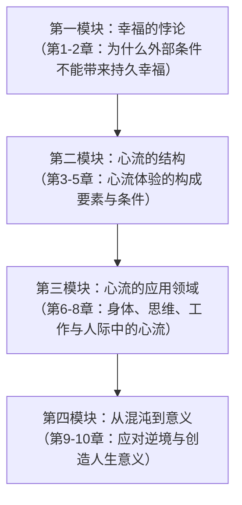
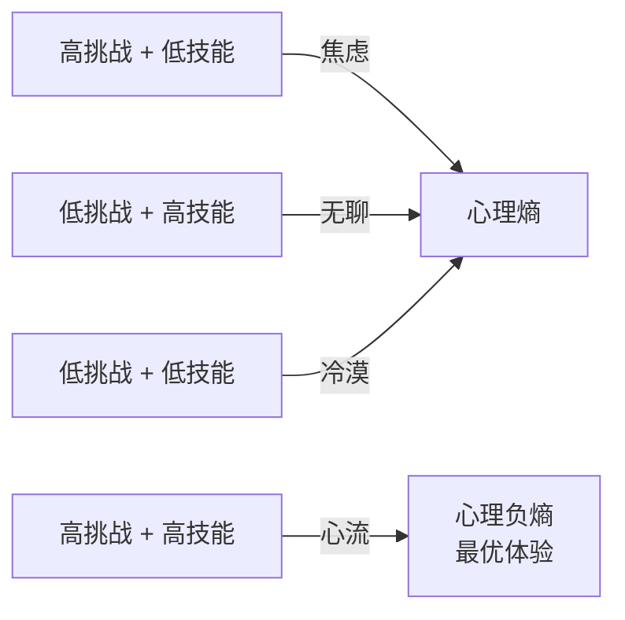
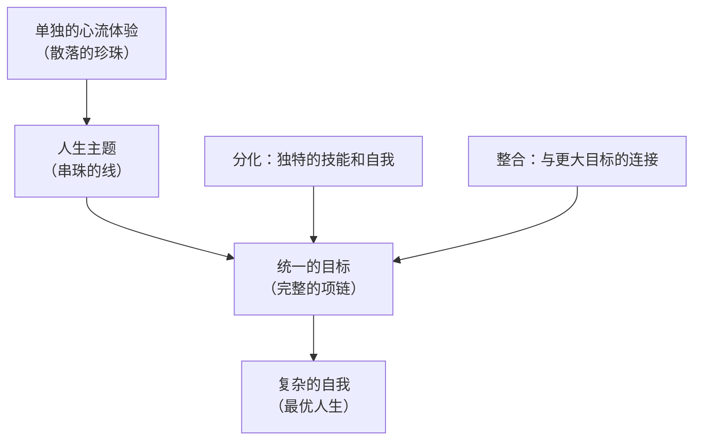
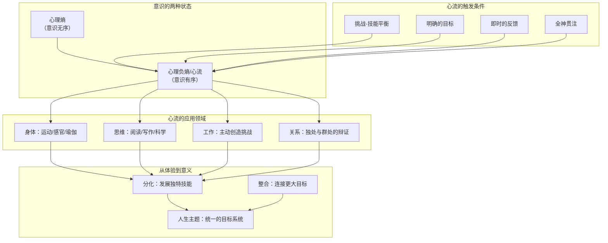

# 《心流：最优体验心理学》深度拆解

## 一、元信息速览

《心流：最优体验心理学》（*Flow: The Psychology of Optimal Experience*）是匈裔美籍心理学家米哈里·契克森米哈赖1990年出版的代表作，也是==积极心理学==领域的奠基之作之一。契克森米哈赖在芝加哥大学任教数十年，从20世纪六七十年代起便开始研究"人在什么时候感到最幸福"这一问题。他通过一种叫做==经验取样法==（Experience Sampling Method, ESM）的研究方法——在随机时间点用传呼机提醒被试记录当下的活动、情绪和意识状态——积累了数以万计的数据样本，最终提炼出"心流"这一核心概念。

本书的核心命题极其清晰：==幸福不是偶然发生的，它不取决于外部事件，而取决于你如何解读和回应这些事件。==当你全神贯注于一项具有适当挑战性的活动，技能与挑战相匹配，你便会进入一种被契克森米哈赖称为"心流"（flow）的最优体验状态。在这个状态里，你忘记了时间、忘记了自我、忘记了一切无关的忧虑，意识与行动融为一体——这就是人类所能体验的最深层的满足感。

与[[《思考，快与慢》]]中卡尼曼关注"人类认知缺陷"不同，契克森米哈赖关注的是"人类意识的最佳运作状态"。两者构成互补：卡尼曼告诉你大脑在哪里会出错，契克森米哈赖告诉你大脑在什么条件下运作得最好。

## 二、全书逻辑地图

全书十章可以提炼为**四大模块**的递进结构：

**核心命题**：你对幸福的直觉是错的——你以为拥有更多的钱、更高的地位、更好的运气就能幸福，但研究表明这些外部因素与幸福的相关性远比你想象的小。真正持久的满足感来自于==对意识体验的主动控制==——当你学会将注意力有序地投入到有挑战性的目标中，你就掌握了通往幸福的钥匙。心流不是一种神秘的禅定体验，它是一种可以被理解、可以被创造、可以被训练的心理状态。

## 三、逐章深度拆解

### 第一章：「幸福的再审视」

> [!abstract] 开篇立论：为什么你以为的幸福不是真的幸福

**【核心论点】**

契克森米哈赖在开篇就抛出一个违反直觉的命题：==人类在物质条件上的巨大进步，并没有带来幸福感的对等增长。==尽管你所生活的时代在物质丰富程度上远超历史上任何时期，但焦虑、无聊、抑郁的比例并没有因此降低。这不是因为物质不重要，而是因为幸福的本质不在于外部条件的堆积，而在于==你如何体验自己的内在意识==。

**【详细拆解】**

契克森米哈赖引用了多项跨国研究的数据：当一个国家的基本生存需求被满足后，国民收入的继续增长与幸福感的提升之间几乎不存在显著的正相关。他指出，这个发现不只是统计数据上的——你在日常生活中也能感受到：你升职后的兴奋感通常在几周内消退，你搬进更大房子后很快就觉得理所当然。这就是心理学中所谓的==享乐适应==（hedonic adaptation）——你的情绪温控系统总会把体验拉回基准线。

那么，真正持久的满足感从何而来？契克森米哈赖的回答是：它来自于你对==意识==的掌控。他将意识定义为"你有能力注意到的所有信息的集合"，而幸福感取决于你如何组织和引导这些信息。当你的意识处于有序状态——注意力集中于一个清晰的目标，行动与反馈紧密相连——你便会体验到满足。当意识处于无序状态——注意力涣散、目标冲突、信息混乱——你便会体验到所谓的"心理熵"（psychic entropy），也就是焦虑、无聊或抑郁。

**【费曼式解读】**

想象你的意识是一间录音棚。当棚内只有一个声源在清晰地录制，所有设备都围绕它运作，产出的就是高品质的音乐——这就是心流。但如果棚里同时挤进了十个人各弹各的、设备随机发出噪音，产出的就是一团混乱的杂音——这就是心理熵。幸福不取决于你的录音棚有多贵，而取决于你能不能让棚内只有一个清晰的声音在运作。

**【金句/关键概念】**

> ==控制意识决定生活品质。==

> [!tip] DIKW金字塔映射
> - **Data（数据）**：多国调查显示收入超过基本线后幸福感不再显著增长
> - **Information（信息）**：外部物质条件与主观幸福感之间存在"天花板效应"
> - **Knowledge（知识）**：幸福感的核心变量不是外部条件，而是意识体验的内在秩序
> - **Wisdom（智慧）**：停止追逐外部条件的无限升级，转而投资于你对注意力的掌控能力

---

### 第二章：「意识的解剖」

> [!info] 心流理论的底层基础设施：注意力就是你最稀缺的资源

**【核心论点】**

契克森米哈赖在这一章搭建了心流理论的==认知基础设施==。他提出了几个关键概念：意识、注意力、心理熵、心理负熵。其中最核心的观点是：==注意力是你拥有的最稀缺的资源，你用注意力构建自我和世界==。你把注意力投向哪里，你的生活就是什么样子。

**【详细拆解】**

契克森米哈赖援引认知心理学的研究指出，人类的神经系统每秒能处理的信息量大约是==126比特==。这意味着你的意识通道有一个严格的带宽限制——你不可能同时处理无限多的信息。理解一个人的语言大概需要消耗40比特/秒的处理能力，这就解释了为什么你很难同时听懂三个人在说什么（40×3=120，已接近上限）。

基于这个带宽限制，注意力就成了你最珍贵的资源。契克森米哈赖将注意力称为=="心理能量"==（psychic energy）。你把这些能量投入到哪里，决定了你的意识中会出现什么内容，进而决定了你的主观体验质量。

接下来他引入了两个核心概念的对立面：

- ==心理熵==（psychic entropy）：当你接收到与目标冲突的信息时——比如你正在准备演讲但突然开始焦虑于一个家庭矛盾——你的意识变得无序，注意力被迫分散到处理这些冲突上。这种内心的混乱就是心理熵，它的主观感受是焦虑、恐惧、愤怒、嫉妒等负面情绪。
- ==心理负熵==（negentropy / flow）：与心理熵相反，当你接收到的信息与目标一致，注意力自由地投入到当前任务中，意识高度有序——这就是最优体验，也就是心流。

**【费曼式解读】**

你的注意力就像手机的电池电量。你一天只有那么多电量（126比特/秒的带宽），每个打开的应用都在消耗它。如果你同时开着十几个后台应用——焦虑这个、担心那个、刷一下社交媒体——电量很快就耗光了，而且每个应用都运行得卡顿。但如果你把所有电量都集中供给一个应用——全神贯注做一件事——这个应用就会运行得极其流畅。心流就是"只开一个应用、全功率运行"的状态。

**【金句/关键概念】**

> ==注意力是一种有限的心理能量。你选择如何分配它，就是在选择你的人生形状。==

> [!note] 反脆弱视角
> 注意力的有限性既是约束，也是保护。正因为你不可能处理所有信息，你才被迫选择——而这种选择的能力，就是从混沌中创造秩序的能力。如果你的注意力是无限的，你反而会失去"聚焦"的能力，体验反而可能变得稀薄。

---

### 第三章：「心流的构成要素」

> [!abstract] 全书核心：心流体验到底由什么组成

**【核心论点】**

这是全书最核心的一章。契克森米哈赖基于对数千名受访者的深度访谈——包括攀岩者、外科医生、国际象棋选手、舞者、作曲家、运动员等——提炼出心流体验的==八大构成要素==。无论文化背景、职业类型或活动性质有多大差异，人们描述心流体验时使用的语言和框架惊人地一致。

**【详细拆解】**

心流的八大构成要素：

**1. 具有挑战性且需要技能的活动**

心流最常发生在==挑战与技能达到平衡==的时刻。如果挑战远超你的技能，你会焦虑；如果技能远超挑战，你会无聊。只有当两者匹配——且都处于较高水平时——心流才会出现。这是心流理论中最广为人知的模型。

通俗类比：这就像打网球。如果你的对手是世界冠军，你每球都接不到，你会焦虑到想退出。如果对手是个完全不会打的初学者，你每球都轻松得分，你会无聊到想打哈欠。但如果对手的水平刚好比你强一点点，你需要全力以赴才能勉强抗衡——这时你会忘记时间、忘记疲劳，打完才发现两小时已经过去了。

**2. 行动与意识的融合**

在心流中，你不再是一个"在做事的人"——你的整个意识与你的行动合二为一。一个攀岩者描述这种感觉："你变成了岩壁的一部分。"一个舞者说："我不是在跳舞，我就是舞蹈本身。"

**3. 明确的目标**

心流活动通常有==清晰的、即时可感知的目标==。攀岩者知道下一步该把手放在哪里，棋手知道下一步该走什么，外科医生知道下一步该切开哪个组织。目标的明确性让你不需要反复犹豫"我该做什么"，注意力可以全部用于"怎么做"。

**4. 即时的反馈**

与明确目标配套的是==即时反馈==。攀岩者知道每一次抓握是否稳固，音乐家听到每一个音符是否准确，外科医生看到每一刀的效果。反馈的即时性让你可以持续调整自己的行为，保持在心流通道中。

**5. 全神贯注于当前任务**

心流中，你对当前活动的专注程度极高，以至于==没有多余的注意力去处理任何无关信息==。你暂时"忘记"了房贷、人际冲突、明天的考试——不是因为你逃避了它们，而是因为你的注意力带宽已经被当前活动完全占满，没有空间留给这些东西了。

**6. 控制感**

心流中的"控制感"不是指你一定能掌控结果，而是指你感到自己==有能力控制自己的行动==。契克森米哈赖特别指出，很多心流活动本身是"危险的"——攀岩、赛车、高空作业——但参与者之所以享受，恰恰因为他们在一个客观危险的环境中，通过自身技能创造了一种主观上的控制感。

**7. 自我意识的消失**

在心流中，你暂时失去了对"自我"的觉察。你不再想着"别人怎么看我""我表现得好不好""我够不够优秀"——你只是在做。但有意思的是，当心流体验结束之后，你的自我感反而变得更强——因为你完成了一件有挑战性的事情，你的自我因此而成长。

**8. 时间感的扭曲**

几乎所有描述心流体验的人都提到了==时间感的变化==。最常见的是"时间飞逝"——你觉得只过了十分钟，实际上已经三小时了。偶尔也有相反的体验：一个芭蕾舞者描述一个复杂的旋转动作"好像持续了好几分钟"，实际上只有不到一秒。

**【费曼式解读】**

心流就像一个只在特定频率才出现的电台信号。你需要同时调对两个旋钮——一个是"挑战"，一个是"技能"——才能收到这个信号。旋钮只调了一个，或者两个都调在低位，你听到的就是噪音（焦虑、无聊或冷漠）。只有两个旋钮都调到高位、且彼此匹配时，你才能听到那段清澈的音乐。

**【金句/关键概念】**

> ==心流产生于挑战与技能的动态平衡——两者都必须高于你的平均水平，且彼此匹配。==

> [!tip] DIKW金字塔映射
> - **Data（数据）**：数千名来自不同文化和职业的受访者的心流体验描述
> - **Information（信息）**：跨文化、跨职业的心流体验有八个共同要素
> - **Knowledge（知识）**：心流不是随机的运气，而是一种有明确触发条件的心理状态
> - **Wisdom（智慧）**：在你的工作和生活中主动创造"挑战略高于技能"的场景，而不是被动等待心流降临

---

### 第四章：「心流的条件」

> [!info] 从"什么是心流"到"什么活动容易产生心流"

**【核心论点】**

契克森米哈赖在这一章研究了什么样的活动最容易产生心流，并提出了=="心流活动"==（flow activities）的概念。他发现，游戏、艺术、仪式、体育等活动之所以能吸引人类投入大量时间，正是因为它们的设计天然满足心流的触发条件——明确的规则、清晰的目标、即时的反馈、可调节的难度。

**【详细拆解】**

契克森米哈赖指出，并非只有精英活动才能产生心流。他的研究发现，世界各地的文化都发展出了各自的"心流活动"系统：从印度瑜伽到日本武道，从西方音乐到各种棋类游戏，这些活动在结构上都满足心流的条件。

他特别强调了=="自成目的性体验"==（autotelic experience）这个概念。"Autotelic"由希腊语"auto"（自我）和"telos"（目标）组成，指的是==一种本身就是奖赏的活动==——你做它不是为了外部回报，而是因为做它本身就令人满足。一个自成目的性的人能在几乎任何活动中发现心流的可能性，即便是客观上无聊或重复的工作。

契克森米哈赖还引入了=="自成目的性人格"==（autotelic personality）的概念。拥有这种人格特质的人具有几个特征：好奇心强、坚持不懈、不太以自我为中心、倾向于为活动本身而非外部奖赏而行动。他发现，这些人在日常生活中报告心流体验的频率显著高于普通人。

他还讨论了一个有趣的悖论：==心流活动需要规则和限制==。你可能以为自由是快乐的前提，但契克森米哈赖的研究表明恰恰相反——完全的自由往往导致焦虑，而明确的规则和限制反而为心流创造了空间。诗歌中的格律限制、音乐中的调性系统、体育中的比赛规则——这些"限制"恰恰是让你的注意力得以有序运作的框架。

**【费曼式解读】**

想象你在一个巨大的空旷平原上，有人告诉你"随便走，哪里都行"。你很可能会站在原地发呆——因为选择太多等于没有选择。但如果有人在平原上画了一条迷宫路线，虽然你的自由度被限制了，你反而有了清晰的目标（走出迷宫）、即时的反馈（走对了还是走进死胡同）和适度的挑战。你会在迷宫里走得津津有味。心流活动的规则就是这条迷宫路线——限制催生专注，专注催生心流。

**【金句/关键概念】**

> ==自成目的性体验：当做一件事本身就是目的时，你拥有了最自由的状态。==

> [!note] 反脆弱视角
> 心流活动的设计原则与反脆弱有深层的共振：最好的心流活动不是消除了所有不确定性的活动，而是将不确定性==框定在一个可控范围内==的活动。攀岩有坠落的风险，国际象棋有败局的可能——正是这种"有限的不确定性"让它们令人着迷。完全安全=完全无聊。

---

### 第五章：「身体的心流」

> [!abstract] 你的身体是心流的第一座实验室

**【核心论点】**

契克森米哈赖在这一章详细探讨了==身体活动==如何成为心流的入口。他考察了运动、舞蹈、瑜伽、武术、性、以及感官体验（视觉、听觉、味觉）等领域，论证了一个核心观点：你的身体不仅是意识的载体，它本身就是产生最优体验的工具。但前提是，你必须==有意识地训练和运用身体的能力==，而不是把身体当作一个被动的感觉接收器。

**【详细拆解】**

契克森米哈赖从最基本的身体活动——==行走==——开始讨论。他指出，即使是日常的步行，如果你带着觉察去做——注意步伐的节奏、呼吸的频率、周围环境的变化——它也可以成为一种心流体验。但大多数人走路时意识是涣散的，脑子里想着与当下无关的事情，因此错过了这个最简单的心流入口。

接下来他讨论了体育运动。他发现==运动是普通人最容易接触到的心流活动之一==。跑步、游泳、攀岩、武术——这些活动天然具备心流的结构：清晰的目标（跑得更快、攀得更高）、即时的反馈（你的身体告诉你状态如何）、可递进的挑战（你总可以设定更高的目标）。

关于==音乐==，他做了特别深入的讨论。他指出，聆听音乐是一种层次递进的体验：最初级的是"感官层面"——你被旋律和节奏吸引；中间层是"类比层面"——音乐唤起你的情绪和画面联想；最高层是"分析层面"——你能识别音乐的结构、技法和创作逻辑。随着你的聆听能力提升，你在音乐中能获得的心流体验也更深层。

他还讨论了==美食==作为心流来源的可能性。他认为，大多数人吃东西只是在被动地接受味觉刺激，但如果你像品酒师一样有意识地发展味觉辨别能力，饮食就可以从单纯的"享乐"提升为一种心流体验。

**【费曼式解读】**

你的身体就像一架钢琴。如果你从来不练琴，它就只是一件家具——占地方但不发声。但如果你花时间去学习、去训练，这架钢琴就能演奏出从简单音阶到复杂协奏曲的所有音乐。你的身体每一项功能——运动、感知、味觉、听觉——都是一个等待被开发的心流通道。关键不在于钢琴的品牌，而在于你花了多少时间练琴。

**【金句/关键概念】**

> ==身体的每一项能力都可以成为心流的来源，但前提是你必须有意识地发展和运用这些能力，而不是把身体当作一个被动的工具。==

> [!tip] DIKW金字塔映射
> - **Data（数据）**：运动员、舞者、瑜伽修行者的心流体验报告
> - **Information（信息）**：身体活动是最容易触及心流的领域之一
> - **Knowledge（知识）**：心流不要求你"天赋异禀"，它要求你有意识地训练感官和运动能力
> - **Wisdom（智慧）**：从最简单的身体活动开始——有觉察地走路、有觉察地呼吸——这是心流的最低成本入口

---

### 第六章：「思维的心流」

> [!info] 心流不只属于运动和艺术——它也属于纯粹的思考

**【核心论点】**

这一章契克森米哈赖将心流的版图从身体扩展到==心智==领域。他论证了一个重要观点：==思考本身就可以是一种心流活动==——前提是你把思考当作一种需要训练的技能，而不是放任意识随机漫游。他考察了记忆、文字、科学、哲学等思维活动中的心流体验。

**【详细拆解】**

契克森米哈赖首先指出一个被忽视的事实：==当你独处且没有外部刺激时，你的意识最容易陷入混乱==。大多数人在无事可做时，脑子里涌现的不是创造性的想法，而是焦虑、自我怀疑和反刍思维。这就是为什么很多人害怕独处、害怕无聊，因为在没有外部结构的情况下，他们的意识会迅速滑向心理熵。

解决这个问题的方法是发展==内在的心智秩序工具==。他列举了几个例子：

- ==记忆==：在没有印刷术和电子媒介的时代，记忆力是人类最重要的心智工具之一。契克森米哈赖指出，背诵诗歌、记忆历史事件、掌握大量知识不仅是实用的，它本身就是一种心流体验。当你在脑中有一个庞大的知识库可以随时调取和组合时，你即使在等公交、排队或失眠时也能让意识保持有序。
- ==文字==：阅读和写作是最普遍的思维心流活动。但契克森米哈赖强调，随意的消遣性阅读不太容易产生心流，而==有目的的、挑战性的阅读==——比如研读一本你需要反复咀嚼才能理解的书——才更容易触发心流。写作同样如此：有深度的写作是对思维的极致考验，它迫使你将模糊的想法转化为清晰的语言。
- ==科学与哲学==：契克森米哈赖认为，业余科学和哲学思考是被严重低估的心流来源。你不需要成为职业科学家才能享受科学思维带来的乐趣——观察自然现象、提出问题、寻找解释，这个过程本身就满足心流的所有条件。

**【费曼式解读】**

你的思维就像一座花园。如果你完全不打理它——不种花、不除草、不浇水——它不会变成一片美丽的草地，而是会长满杂草。那些杂草就是焦虑、无聊和反刍思维。你需要主动地在花园里种植"思维作物"——学习一门学科、练习一种推理方式、记忆一些值得反复品味的知识——这些作物一旦长起来，杂草就没有空间了。

**【金句/关键概念】**

> ==一个人如果不能在独处时保持意识的秩序，就注定要依赖外部刺激来逃避内心的混乱。==

> [!note] 反脆弱视角
> 发展内在的心智工具是一种==反脆弱策略==。外部环境可以被剥夺——你可能失去工作、失去财产、失去社交圈——但如果你拥有丰富的内在心智资源，你在逆境中反而可能发现新的思考和成长的空间。历史上许多伟大的思想作品是在监禁、流放或贫困中完成的，恰恰因为作者拥有强大的内在心智秩序能力。

---

### 第七章：「工作中的心流」

> [!warning] 最大的心流悖论：你最常体验心流的地方，恰恰是你最不想待的地方

**【核心论点】**

这一章揭示了全书最令人惊讶的发现之一：==人们在工作中体验到心流的频率远高于在休闲中体验到心流的频率——但他们宁愿选择休闲而不是工作。==这个悖论揭示了人类在"判断什么让自己快乐"这件事上的深层偏差。

**【详细拆解】**

契克森米哈赖的经验取样法研究产生了一组违反直觉的数据。当在工作中被传呼机打断时，被试报告处于心流状态的比例明显更高：他们更专注、更有挑战感、更有成就感、也更快乐。但当被问"你现在是否希望在做别的事情"时，他们中的大多数人回答"是的"——他们想去休闲。

而在休闲时间——特别是被动休闲如看电视——被试的心流体验频率反而很低。他们报告更多的无聊、冷漠和低挑战感。但他们仍然主观地偏好休闲时间。

这个悖论的核心在于==文化刻板印象==对自我判断的扭曲。在大多数文化中，"工作"被定义为"不得不做的事"，而"休闲"被定义为"自由时间"。你从小就被灌输了"工作=辛苦，休闲=享受"的框架。于是，即使你在工作中客观上体验到了更多的满足感和心流，你的文化编程仍然告诉你"你应该更想休闲"。

契克森米哈赖还发现，那些能在工作中创造心流条件的人——把工作当作游戏，为自己设定挑战目标，主动寻求反馈——报告的生活满意度显著更高。相反，那些被动等待下班的人，即使拥有大量休闲时间，也往往陷入无聊和焦虑。

他特别提到了一类人：==将工作转化为心流活动的工人==。他描述了在工厂装配线上工作的工人，其中一些人通过自我设定效率挑战、比较和优化自己的操作方式，将客观单调的工作转化为一种心流体验。这些工人不仅工作表现更好，而且对工作的满意度也显著高于那些消极应对的同事。

**【费曼式解读】**

这就像你去健身房。你在跑步机上跑步的时候，心率升高、肌肉在燃烧、身体在分泌内啡肽——你客观上是在"受益"的。但你的大脑还是告诉你"我想躺在沙发上看电视"。而当你真的躺在沙发上看了两小时电视之后，你反而觉得更空虚了。这就是工作心流的悖论：你的体验告诉你工作更充实，但你的刻板印象告诉你休闲更美好。

**【金句/关键概念】**

> ==工作和休闲的质量不取决于活动本身的性质，而取决于你是否在其中创造了心流的条件：明确的目标、即时的反馈、以及与你技能匹配的挑战。==

> [!tip] DIKW金字塔映射
> - **Data（数据）**：ESM数据显示被试在工作中报告心流的频率高于休闲
> - **Information（信息）**：工作的结构天然更接近心流条件（目标、反馈、挑战）
> - **Knowledge（知识）**：人类对"什么让自己快乐"的判断受到文化刻板印象的严重扭曲
> - **Wisdom（智慧）**：不要等待完美的工作，而是学会在任何工作中主动创造心流条件；同时，把你的休闲时间从被动消遣升级为主动心流活动

---

### 第八章：「人际关系中的心流——独处与群处的辩证法」

> [!abstract] 人际关系：心流的放大器，也是心理熵的最大来源

**【核心论点】**

契克森米哈赖在这一章转向人际关系维度。他的核心论点是：==人际关系是你最大的心流来源，也是你最大的心理熵来源==。当关系运作良好时，它为你提供了无与伦比的满足感；当关系出现冲突时，它是你注意力资源的最大黑洞。而==独处能力==是心流人格的关键指标——那些不能忍受独处的人，恰恰是最难获得心流的人。

**【详细拆解】**

契克森米哈赖首先讨论了==独处==的问题。他的研究发现，青少年在独处时报告的情绪最为低落——无聊、焦虑、不安。但他也发现，那些能够在独处中保持心智活跃的青少年（例如通过练习乐器、阅读有挑战性的书籍、发展个人项目），在整体生活满意度和学业表现上都显著优于那些不能忍受独处的同龄人。

关于==家庭==，他指出家庭关系是一个复杂的心流系统。一方面，家庭为个体提供了情感安全网，使得你敢于去冒险和面对挑战。另一方面，家庭也可能成为心理熵的来源——当家庭成员之间的目标冲突、期望不一致时，家庭消耗的注意力资源可能是巨大的。他认为，==一个运作良好的家庭本身就是一个心流系统==：家庭成员有共同的目标、给予彼此及时的反馈、在支持中提供恰当的挑战。

关于==友谊==，他观察到最令人满意的友谊往往具有心流的特征：朋友之间有共同的兴趣（目标），能够进行有深度的对话（挑战与技能匹配），并且在互动中获得即时的情感反馈。

**【费曼式解读】**

人际关系就像双人跳舞。当两个人配合默契时——步伐同步、信号一致、彼此回应——这支舞就是心流。但如果一个人想跳探戈，另一个人想跳华尔兹，或者一个人在领舞而另一个人不肯跟随，这支舞就变成了互相踩脚的混乱。而独处能力就像一个人的独舞技巧——如果你一个人也能跳得很好，那么你在选择舞伴时就不会出于恐惧而将就。

**【金句/关键概念】**

> ==如果你不能学会独处，你就永远在逃避，而不是在选择与谁相处。==

---

### 第九章：「战胜混沌——在逆境中寻找心流」

> [!warning] 全书最深刻的一章：心流理论的终极考验不是顺境，而是逆境

**【核心论点】**

契克森米哈赖在这一章面对了最严峻的问题：==当不幸降临——疾病、残疾、丧亲、贫穷——心流理论还管用吗？==他的回答是：不仅管用，而且正是在逆境中，心流的力量才真正显现。他提出了=="转化性应对"==（transformative coping）的概念：有些人能够将客观上的灾难转化为主观上的成长机会，这种能力的核心机制就是对注意力的控制。

**【详细拆解】**

契克森米哈赖首先区分了两种应对逆境的策略：

- ==成熟防御==（mature defenses）：包括幽默、利他主义、升华等——这些策略并不否认现实的残酷，但通过重新组织意识来寻找积极的行动空间。
- ==退行性防御==（regressive defenses）：包括否认、投射、压抑——这些策略通过扭曲现实来暂时减轻痛苦，但长期来看会加重心理熵。

他引用了多个案例来说明这个观点。他提到了在政治迫害中幸存下来的人，他们之所以能在极端条件下保持心理完整，是因为他们拥有==强大的内在目标系统==——无论是信仰、使命感还是对亲人的责任——这些内在目标为他们的注意力提供了有序的框架，使得外部混沌无法完全占领他们的意识。

他还描述了身患残疾但依然活出丰盛人生的案例。一些失去视力或行动能力的人，反而在失去之后发展出了新的技能和心流来源——因为当某些外部选项被关闭后，他们被迫将注意力集中到剩余的可能性上，反而发现了之前忽视的深层体验。

契克森米哈赖将这种能力总结为=="消散结构"==的隐喻（借用普里高津的物理学概念）：一个开放系统在遇到扰动时，不是崩溃，而是通过重组自身结构来达到一种新的、更高层次的秩序。能够做到这一点的人，具有他所说的"自成目的性人格"——他们将注意力视为自己的领地，不允许外部事件完全占领这个领地。

他总结了转化性应对的三个步骤：
1. ==不否认现实==：首先接受"这件事确实发生了"。
2. ==寻找行动空间==：在新的现实中找到你仍然能够采取行动的领域。
3. ==建立新的目标系统==：围绕这个行动空间构建新的挑战-技能匹配，重新创造心流。

**【费曼式解读】**

想象你在下棋，对手突然拿走了你的皇后。一种反应是掀翻棋盘——这是退行性防御。另一种反应是坐在那里哀叹"我完了"——这是被心理熵淹没。但第三种反应是：重新审视棋盘上的所有棋子，发现你的车和马还在，它们之前一直被皇后的光环遮住了。然后你围绕这些剩余棋子构建全新的战术——这就是转化性应对。有时候，失去皇后反而让你发展出了更精妙的残局技术。

**【金句/关键概念】**

> ==压力本身不会毁掉你。毁掉你的是压力导致的内心混乱——当你允许外部事件完全占据你的注意力，你就失去了对意识的控制。转化性应对的本质是夺回注意力的主权。==

> [!note] 反脆弱视角
> 这一章是心流理论与反脆弱思想最深层的交汇点。契克森米哈赖描述的"转化性应对"本质上就是==心理层面的反脆弱==：你不是在逆境中"恢复原状"（韧性），你是在逆境中"变得更强"（反脆弱）。关键机制是：逆境迫使你重组意识结构，而这种重组如果成功，产出的新结构比原来的更精密、更有适应性。

---

### 第十章：「创造意义」

> [!abstract] 全书终章：从心流到人生意义的终极跃迁

**【核心论点】**

在最后一章，契克森米哈赖将心流理论提升到==存在主义==的高度。他的核心论点是：单独的心流体验虽然令人满足，但如果这些体验没有被整合进一个更大的==人生主题==（life theme）中，它们就只是一串散落的珍珠，而不是一条项链。==创造意义==的过程就是找到那根串珠的线——一个统一的目标系统，它将你所有的心流体验连接成一个连贯的人生叙事。

**【详细拆解】**

契克森米哈赖在这里做了一个关键区分：

- ==分化==（differentiation）：你在各种心流活动中发展了独特的技能、形成了独特的自我——这是个体化的过程。
- ==整合==（integration）：你将这些分散的技能和体验纳入一个更大的目标框架中，与他人、与社会建立连接——这是统一化的过程。

==一个复杂的自我==（complex self）同时具有高度的分化和高度的整合。仅有分化而无整合，你会成为一个能力很强但"不知道自己为什么活着"的人。仅有整合而无分化，你会成为一个方向感很强但缺乏独特性的人。两者兼具时，你就拥有了一个既丰富又连贯的人生。

契克森米哈赖将"人生主题"定义为一个人==用来组织所有体验的核心叙事==。这个主题不需要是宏大的——它可以是"成为一个好木匠""理解宇宙的运作规律""把孩子培养成独立的人"。关键是，这个主题为你的日常决策提供了一个过滤器：什么值得你投入注意力，什么不值得。

他特别强调，意义不是被"发现"的，而是被=="创造"==的。世界本身不带有内置的意义——意义是你通过有意识地投入注意力、通过在心流中磨炼技能、通过在逆境中重组意识而逐步==建构==出来的。这是一种建构主义立场，它既拒绝了虚无主义（"生命没有意义"），也拒绝了天真的乐观主义（"意义自然会来"），而是提出了一条积极的中间道路：意义是你用一生的心流体验==编织==出来的。

他在全书最后描绘了一幅他称之为=="统一的目标"==（unified purpose）的愿景：当你的人生主题足够清晰和强大时，你的每一个行动——工作、休闲、人际关系、独处——都不再是孤立的片段，而是同一个大叙事的有机组成部分。在这种状态下，心流不再只是偶尔出现的高峰体验，而是成为你存在的基本模式。

**【费曼式解读】**

想象你的人生是一部长篇小说。每一次心流体验是小说中的一个精彩段落——一段激动人心的冒险、一场深刻的对话、一个令人屏息的场景。但如果这些段落只是随机排列的，没有主线情节、没有主人公的成长弧线，那它就是一堆碎片，不是一部小说。"创造意义"就是为你的小说找到主线情节——它让每一个精彩段落都有了来龙去脉，让你在回顾人生时看到的不是一堆碎片，而是一个连贯的、有方向的故事。

**【金句/关键概念】**

> ==人生意义不是等来的，它是用你的注意力一寸一寸编织出来的。每一次心流体验都是这块织锦上的一个图案——但只有当你找到了整体的设计蓝图，这些图案才会组成一幅完整的画面。==

> [!tip] DIKW金字塔映射
> - **Data（数据）**：被访者对人生满意度和人生意义的自我报告
> - **Information（信息）**：人生满意度最高的人往往拥有统一的目标系统
> - **Knowledge（知识）**：意义不是被发现的客观事实，而是通过注意力投入而被创造的主观建构
> - **Wisdom（智慧）**：不要等待"人生使命"的启示降临——从你当前最能产生心流的活动出发，逐步向外扩展和连接，意义会在行动中浮现

---

## 四、全书核心模型总结

## 五、交叉链接

> [!note] 与其他知识的连接
> - 与[[《思考，快与慢》 - 丹尼尔·卡尼曼]]的关系：卡尼曼研究的是意识"出错"的模式（认知偏差），契克森米哈赖研究的是意识"最佳运作"的模式（心流）。两者互为镜像：系统1的自动化处理是心理熵的来源之一（当它错误地简化问题时），但也可以是心流的机制之一（当技能内化为自动化后，行动与意识可以融合）。
> - 与存在主义哲学的关系：契克森米哈赖在最后一章隐含地与加缪、萨特的存在主义对话——他同意"世界本身没有预设的意义"，但拒绝由此走向虚无。他的方案是：意义通过有意识的注意力投入而被创造。
> - 与[[《穷查理宝典》 - 查理·芒格]]的关系：芒格所推崇的"不断学习"的人生态度，本质上就是契克森米哈赖所描述的"终身保持挑战-技能平衡"的心流人生。

## 六、个人行动框架

> [!example] 基于心流理论的行动清单
> 1. **审计你的注意力分配**：用一周时间记录你每天注意力的去向。你的126比特/秒花在了什么上面？有多少被心理熵消耗了？
> 2. **寻找你当前的挑战-技能匹配点**：在你现有的活动中，哪些最接近心流条件？你能通过调整挑战难度或提升技能来优化这些活动吗？
> 3. **升级你的休闲**：用至少一项主动休闲（运动、乐器、深度阅读）替代一项被动休闲（刷社交媒体、随意看视频）。
> 4. **发展独处能力**：从每天10分钟有觉察的独处开始——不看手机、不听音乐，只是有意识地思考或观察。
> 5. **草拟你的人生主题**：不需要完美——一句话就好。它可以随着你的成长而演变。但有一个初步的主题，就比没有强得多。

## 七、诚实申明

> [!warning] 关于本笔记的准确性
> 本笔记基于我对《心流》一书内容的理解生成。书中提到的"126比特/秒"的意识处理带宽、经验取样法的具体发现（如工作中心流频率高于休闲）、心流的八大构成要素等，均为书中明确讨论的内容。但以下几点需要坦诚说明：
> - 书中引用的部分受访者原话（如攀岩者和舞者的描述），我做了基于记忆的意译而非逐字引用，具体措辞可能与原文有出入。
> - "享乐适应"这一术语在心流理论的讨论中被广泛引用，但它更多是契克森米哈赖论述的背景知识，而非他本人创造的概念。
> - 本笔记的章节划分（如"第五章：身体的心流"等）是按全书的主题逻辑进行的归纳整理，与原书的具体章节编号和标题可能不完全一一对应。原书共十章，本笔记保留了十章的结构但标题做了意译处理。
> - 关于"消散结构"的比喻，契克森米哈赖确实在讨论应对逆境时引用了这一概念，但我对具体语境的还原可能存在偏差。