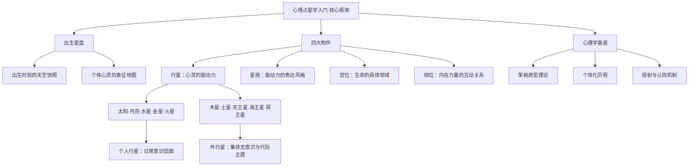

# 《心理占星学入门》 - 克莱尔·马丁

## 一、学科坐标定位（400字）

心理占星学是==占星学与深度心理学的交叉领域==，其核心立场是：占星学不是预测命运的工具，而是理解心灵结构的一面镜子。本书是伦敦占星学院（Faculty of Astrological Studies）的官方入门教材，由资深讲师克莱尔·马丁根据多年教学实践编写而成。

> [!info] 学科关系网
> 心理占星学的理论根基主要来自三个方向：
> - 荣格分析心理学（原型理论、集体无意识、个体化历程）
> - 传统西方占星学（行星、星座、宫位、相位的象征体系）
> - 人本主义心理学（自我实现、潜能发展）

本书在心理占星学版图中的位置，相当于"==第一块拼图=="。它不追求体系的宏大完整，而是以==课堂对话==的形式，将最基础的概念逐一拆解。与[[《宇宙与心灵》 - 理查德·塔纳斯]]那种哲学史诗级叙事不同，马丁的切入点极为具体——她从"什么是出生星盘"这个最朴素的问题出发，引导读者理解行星、星座、宫位、相位各自代表的心理维度。

在整个心理占星学谱系中，本书的上游是荣格的原型理论和利兹·格林（Liz Greene）的开创性工作，下游则连接着更专门的主题研究，如[[《占星十二宫位》 - 霍华德·乔基斯]]和[[《占星相位研究》 - 苏·汤普金斯]]。马丁本人深受格林影响，但她的写作风格更平易近人，适合零基础读者建立心理占星学的第一层认知框架。

---

## 二、理论框架地图（500字）

> [!abstract] 框架核心逻辑
> 马丁的教学框架遵循一条清晰的==从部分到整体==的路径：先认识每颗行星的心理含义（"谁在驱动"），再学习十二星座如何为行星着色（"以什么方式驱动"），接着理解十二宫位划分的生命领域（"在哪里驱动"），最后观察行星之间的相位关系（"驱动力之间如何互动"）。整个过程如同拼装一幅心灵地图。

==费曼式一句话概括==：出生星盘就像心灵的X光片——行星是器官，星座是器官的运作方式，宫位是器官所在的身体部位，相位是器官之间的神经连接。

本书最具方法论价值的一点是：马丁始终强调==占星符号的多义性==。同一个"土星"既可以表现为自律和成熟，也可以表现为恐惧和限制——具体如何显化，取决于整张星盘的语境和个体的意识发展水平。这一立场直接来自荣格心理学对象征的理解：==符号永远不能被还原为单一含义==。

---

## 三、逐章深度拆解（5000字）

### 第一部分：什么是心理占星学

> [!note] DIKW四层提炼
> - **Data（数据）**：心理占星学以出生星盘为核心工具，出生星盘是以个体出生时刻和地点为基准绘制的天空快照
> - **Information（信息）**：出生星盘不是预测吉凶的工具，而是一幅象征性的心灵地图，反映个体内在的心理结构和潜在发展方向
> - **Knowledge（知识）**：心理占星学的理论基础来自荣格分析心理学，尤其是原型理论——行星被视为集体无意识中的原型力量在个体心灵中的具体化
> - **Wisdom（智慧）**：理解自己的星盘不是为了认命，而是为了认识自己——"认识你自己"这一古老箴言，正是心理占星学的终极目标

**费曼式解读**

想象你走进一家电影院。屏幕上正在放映一部电影，这部电影就是你的人生。传统占星学试图剧透电影的剧情（"你在第三幕会遇到一个贵人"），而心理占星学关注的是——==谁是导演，谁是编剧，谁在控制灯光和配乐==。出生星盘揭示的不是你会遇到什么事，而是你内心有哪些角色在运作、它们各自有什么诉求、彼此之间是合作还是冲突。

马丁在开篇就明确了一个关键区分：==心理占星学不做事件预测==。这不是因为预测"不灵"，而是因为心理占星学的关注点根本不在事件层面。一个土星过境你的太阳，传统占星学可能说"你会遇到困难"，心理占星学则会问"你内在的土星原型——也就是你对规则、权威、限制的态度——正在经历怎样的成熟过程"。

**反脆弱验证**

这个框架在哪些情况下可能失效？马丁坦率承认，心理占星学假设了一种"==心灵与宇宙的对应关系=="（即荣格所说的"共时性"），这在主流科学中尚无被广泛接受的解释机制。换言之，心理占星学的实用性可以被临床经验验证，但其本体论基础仍然是开放的哲学问题。

**类比迁移**

心理占星学之于传统占星学，就像认知行为疗法之于民间偏方——==同样的素材，不同的使用方式==。草药有效不代表巫术有效，行星象征有用不代表命运注定。

---

### 第二部分：行星——心灵的角色

> [!note] DIKW四层提炼
> - **Data**：十大行星（含太阳和月亮）各自对应特定的心理功能
> - **Information**：个人行星（太阳至火星）代表日常意识层面的驱动力；社会行星（木星、土星）代表与社会化相关的心理机制；外行星（天王星、海王星、冥王星）代表超个人的、集体无意识层面的力量
> - **Knowledge**：每颗行星都是一个心理原型——太阳是自我认同的核心，月亮是情感安全感的需求，水星是思维和沟通模式，金星是价值观和关系模式，火星是欲望和行动力，木星是扩展和意义追寻，土星是结构和限制，天王星是突破和个体化，海王星是超越和融合，冥王星是转化和深层权力动力
> - **Wisdom**：没有任何一颗行星是"好"或"坏"的——每种原型力量都有建设性和破坏性的表达方式，关键在于个体的意识水平能否整合这些力量

**费曼式解读**

把你的心灵想象成一个公司。太阳是CEO，定义公司的愿景和身份；月亮是人力资源总监，关心每个人的情感需求；水星是公关部，负责信息交流；金星是品牌部，决定什么是美的、有价值的；火星是执行部，说干就干。木星是战略扩张部，总想做大做强；土星是合规部，确保一切按规矩来。外行星呢？天王星是那个总想颠覆行业的疯狂创新者，海王星是那个想让公司使命超越利润的理想主义者，冥王星是那个在危机中推动公司彻底转型的幕后力量。

==关键洞见==：马丁特别强调，很多人只认同自己星盘中的部分行星。比如一个人可能完全认同自己的太阳和水星（"我是一个理性、有逻辑的人"），但完全压抑了月亮和金星（"我不需要情感支持，我不在乎别人怎么看"）。被压抑的行星不会消失，它们会通过投射机制出现在外部世界——你会被某类人强烈吸引或强烈排斥，而那些人恰恰体现了你内在未被整合的行星能量。

**反脆弱验证**

行星原型的多义性既是这个体系的优势也是它的脆弱点。优势在于它足够灵活，能适应不同个体的独特经验；脆弱点在于它可能变成一种"==万能解释框架=="——无论发生什么都能往星盘上套。马丁对此的回应是：好的心理占星学实践不是用星盘去"解释"一切，而是用星盘作为对话的起点，帮助来访者发展自我觉察。

**类比迁移**

行星原型之于心灵，就像基本情绪之于情感生活——==愤怒、恐惧、悲伤、快乐都不是好坏之分，而是信号==。马丁的行星观与情绪心理学的立场高度一致：不要压抑任何一种内在力量，而要学会识别它、理解它、有意识地引导它。

---

### 第三部分：星座——表达的风格

> [!note] DIKW四层提炼
> - **Data**：十二星座按元素分为火（白羊、狮子、射手）、土（金牛、处女、摩羯）、风（双子、天秤、水瓶）、水（巨蟹、天蝎、双鱼）四组，按模式分为基本（开创）、固定、变动三组
> - **Information**：元素描述能量的本质属性——火是直觉和行动力，土是感官和实际性，风是思维和社交性，水是情感和直觉感知；模式描述能量的运作方式——基本星座启动，固定星座维持，变动星座调整
> - **Knowledge**：星座不决定"你是谁"，而是描述行星能量的表达风格。同样是追求安全感（月亮），在金牛座表现为对物质稳定的需求，在巨蟹座表现为对情感归属的需求，在摩羯座表现为对社会地位和成就的需求
> - **Wisdom**：过度认同太阳星座是大众占星学最常见的误区；一个人的完整心理面貌需要综合所有行星的星座位置来理解

**费曼式解读**

如果行星是动词（"我要行动""我要感受""我要思考"），那么星座就是副词（"热情地""谨慎地""灵活地"）。同样是"我要行动"（火星），白羊座的表达是"立刻行动、先做再说"，金牛座的表达是"慢慢来、稳扎稳打"，双子座的表达是"同时做几件事、保持灵活"。

马丁在这一部分做了一件非常有价值的事：==她系统性地解构了太阳星座的过度简化==。大众占星学让人以为"我是狮子座"就意味着"我热情、自信、爱表现"。但在心理占星学中，你的太阳在狮子座只是说明你的==核心自我认同==带有狮子座的特质——你的情感需求（月亮）、思维方式（水星）、关系模式（金星）、行动风格（火星）可能分布在完全不同的星座中。

**反脆弱验证**

星座分类系统的一个潜在脆弱点是==刻板印象==。一旦给某人贴上"处女座"的标签，就可能忽略他其余九颗行星的配置。马丁对此保持了足够的警觉，她反复提醒学生：不要把星座当作人格类型的刚性分类，而要把它理解为能量表达的倾向性光谱。

**类比迁移**

星座系统之于人格描述，类似于色彩理论之于绘画——==红色不等于愤怒，蓝色不等于忧郁==，但它们确实传达了某种基本的质感倾向。好的画家不会只用一种颜色，好的占星学也不会只看一个星座。

---

### 第四部分：宫位——生命的舞台

> [!note] DIKW四层提炼
> - **Data**：十二宫位将出生星盘分为十二个区域，每个区域对应生命的特定领域
> - **Information**：第一宫至第六宫关乎个人层面（自我形象、资源、沟通、家庭、创造力、日常工作与健康），第七宫至第十二宫关乎关系与超个人层面（伴侣关系、深层转化、人生哲学、社会角色、群体归属、灵性与无意识）
> - **Knowledge**：宫位揭示的不只是"生命领域"，更是心理能量的投注方向——行星落入哪个宫位，意味着该原型力量主要在哪个生命领域中被体验和发展
> - **Wisdom**：空宫（没有行星落入的宫位）不意味着该领域"缺失"，而是该领域不是此生心理发展的主要焦点

**费曼式解读**

如果行星是演员，星座是演员的表演风格，那么宫位就是==舞台场景==。同样的演员（比如火星），用同样的风格（比如在狮子座——戏剧化、热情洋溢），在不同的舞台上会演出完全不同的戏——在第十宫（事业宫）可能成为一个雄心勃勃的领导者，在第七宫（关系宫）可能成为一个在亲密关系中非常强势的伴侣，在第四宫（家庭宫）可能成为一个家庭中充满能量的核心人物。

马丁对宫位的讲解融入了大量心理学洞见。她指出，==第一宫和第七宫的轴线==本质上反映了"我"与"他者"的心理动力——我们如何定义自己，往往是通过与重要他人的关系来实现的。==第四宫和第十宫的轴线==则反映了"内在根基"与"外在成就"的张力——一个人在世界上追求的成就形式，往往与童年家庭环境有深刻的对应关系。

**反脆弱验证**

宫位系统在技术层面存在一个已知的争议：==不同的宫位制==（如Placidus、Equal House、Whole Sign等）会导致行星的宫位归属不同。马丁在书中使用的是等宫制（Equal House），这是伦敦占星学院的传统选择。对于初学者而言，了解这一争议的存在比急于选择"正确的"宫位制更重要。

**类比迁移**

宫位之于星盘，就像章节之于一本小说——==同一个角色在不同的章节面对不同的主题和挑战==。你的人生不是单线叙事，而是多线并行的故事。

---

### 第五部分：相位——内在的对话

> [!note] DIKW四层提炼
> - **Data**：主要相位包括合相（0度）、六分相（60度）、四分相（90度）、三分相（120度）、对分相（180度）
> - **Information**：合相是力量融合，六分相和三分相是和谐流动，四分相是内在紧张和冲突，对分相是两极对立中寻求平衡
> - **Knowledge**：所谓"困难相位"（四分相、对分相）并非纯粹的负面——它们制造的心理紧张恰恰是个人成长的动力引擎；所谓"和谐相位"（三分相、六分相）也并非纯粹的正面——缺乏张力可能导致能量无法被充分意识化和利用
> - **Wisdom**：真正的心理成熟不是消除内在冲突，而是学会在张力中保持觉察和创造力——这正是心理占星学从荣格那里继承的核心智慧

**费曼式解读**

想象你的内在有一个圆桌会议。每颗行星代表一个部门主管。相位描述的就是这些主管之间的关系。==合相==是两个主管坐在一起、声音融为一体（有时协同，有时互相干扰）；==三分相==是两个主管默契配合，互相支持；==四分相==是两个主管吵架，但正是这种争吵推动了公司创新；==对分相==是两个主管观点完全相反，需要找到折中方案。

马丁的一个重要贡献是她清楚地阐述了==张力的价值==。在心理占星学中，一个满是三分相的星盘不见得比一个充满四分相的星盘"更好"。四分相制造的内在压力，迫使个体去面对、去整合、去成长。没有压力的生命往往缺乏发展的动力。这与反脆弱理论的核心洞见惊人地一致：==适度的压力使系统变得更强==。

**反脆弱验证**

相位解读的脆弱点在于==容差范围（orb）==的设定。不同占星学家对于多大的角度偏差仍算"有效相位"存在分歧。马丁建议初学者使用较严格的容差范围，以避免过度解读。

**类比迁移**

相位之于心灵，就像音程之于音乐——==和谐音程好听但容易单调，不和谐音程刺耳但制造张力和丰富性==。最伟大的音乐作品（和最丰富的人生）都是在和谐与张力之间取得动态平衡。

---

### 第六部分：整合——阅读星盘

> [!note] DIKW四层提炼
> - **Data**：星盘解读不是逐条罗列行星含义，而是观察整体模式
> - **Information**：需要关注的整体模式包括：行星在元素和模式中的分布、星盘中最突出的行星配置、轴线（上升/下降、天顶/天底）的含义
> - **Knowledge**：星盘解读是一种综合艺术——需要同时持有多层信息，在局部和整体之间不断切换，最终形成一个连贯的心理叙事
> - **Wisdom**：最好的星盘解读不是占星师"告诉"你你是什么样的人，而是通过对话帮助你自己发现和言说内在经验——这使心理占星学成为一种自我觉察的工具而非权威宣判

**费曼式解读**

读星盘就像读一幅画。你不会先看左上角一厘米、再看右上角一厘米——你会先退后几步看整体印象，然后注意到最吸引眼球的焦点，再逐渐观察细节之间的关系。马丁教导的解盘方法遵循同样的逻辑：==先看大图（元素/模式分布、整体形态），再看焦点（最强的行星配置），最后看细节（单个行星的星座宫位相位）==。

**反脆弱验证**

整合解读是心理占星学中==最需要经验和判断力==的环节，也是最容易出错的环节。马丁坦率承认，初学者最常犯的错误是"见木不见林"——过度关注单个行星的含义而忽略整体模式。这也是为什么她强调心理占星学需要大量的实践和督导。

**类比迁移**

星盘整合之于占星学习，就像临床实习之于医学教育——==书本知识只是起点，真正的能力来自面对真实个案的反复练习==。

---

## 四、认知偏差/效应清单（800字）

> [!warning] 阅读本书时需要警惕的认知偏差

1. **巴纳姆效应（Barnum Effect）**
   - 表现：占星描述往往足够模糊，以至于几乎所有人都觉得"说的就是我"
   - 马丁的对策：她始终强调要结合==具体的星盘配置==来解读，而非使用泛泛的星座描述。好的心理占星学解读应该具有足够的特异性，而非万能套用
   - 读者自检：当你读到某段描述感觉"太准了"时，停下来问——这段话是否对任何人都适用？

2. **确认偏差（Confirmation Bias）**
   - 表现：一旦知道某人是"天蝎座月亮"，就只注意到符合天蝎座描述的行为，忽略不符合的
   - 马丁的对策：她反复提醒学生要保持==开放的探询态度==，而非急于用星盘来"确认"预设判断
   - 读者自检：你是否在用星盘给自己或他人贴标签，而非用它来发现新的可能性？

3. **本质主义谬误（Essentialist Fallacy）**
   - 表现：把星盘位置当作固定不变的人格本质（"我就是这样的人，因为我的土星在第七宫"）
   - 马丁的对策：她强调星盘描述的是==心理倾向和发展潜力==，而非固定结局。同样的配置在不同的意识水平上会有截然不同的表达
   - 读者自检：你是把星盘当作了解自己的工具，还是当作逃避改变的借口？

4. **回溯偏差（Hindsight Bias）**
   - 表现：在事后用星盘来"解释"已经发生的事件，觉得一切都"早已注定"
   - 马丁的对策：心理占星学关注的不是事件预测，而是==心理过程的觉察==
   - 读者自检：你能否在事前用星盘来提升自我觉察，而非在事后用它来合理化？

5. **光环效应（Halo Effect）**
   - 表现：因为某个星盘配置被描述为"和谐"（比如金星三分木星），就认为拥有这个配置的人在各方面都很好
   - 马丁的对策：每个配置都有建设性和破坏性的表达。和谐相位可能带来==舒适但缺乏发展动力==的局面

---

## 五、自我诊断工具（500字）

> [!tip] 基于本书的自我觉察练习

**练习一：行星角色认同测试**

列出十颗行星及其基本含义。逐一问自己：
- 这个行星代表的能量，我在日常生活中能自在地表达吗？
- 还是我更多地在==他人身上==看到这种能量？（投射信号）
- 有哪些行星能量我觉得"不像我"？（可能的阴影区域）

**练习二：元素平衡自检**

查看你星盘中行星的元素分布：
- 火元素强（白羊/狮子/射手）：你是否容易冲动、缺乏耐心？
- 土元素强（金牛/处女/摩羯）：你是否过度务实、抗拒变化？
- 风元素强（双子/天秤/水瓶）：你是否过度理性、回避情感？
- 水元素强（巨蟹/天蝎/双鱼）：你是否过度感性、边界模糊？
- 最缺乏的元素往往是==最需要有意识发展==的领域

**练习三：四分相日记**

找到你星盘中的四分相。在接下来的一个月中，留意：
- 这两颗行星代表的心理需求在哪些场景中发生了冲突？
- 你通常如何处理这种冲突——压抑一方？交替表达？还是找到了整合？
- 记录具体事件和你的内在反应，观察模式

---

## 六、批判性审视（600字）

> [!question] 本书的局限与需要补充的视角

**优势**

1. ==教学结构极为清晰==，课堂对话式的行文让抽象概念变得可感可触
2. 始终保持心理学的严谨态度，不滑入神秘主义或宿命论
3. 对荣格心理学概念的运用准确而克制，没有过度理论化

**局限**

1. 作为入门教材，==深度有限==。每个主题只能做概览式的介绍。对于想深入了解某个专题的读者，需要继续阅读专门著作（如[[《占星十二宫位》 - 霍华德·乔基斯]]、[[《占星相位研究》 - 苏·汤普金斯]]）
2. 本书几乎完全建立在==西方心理学范式==之上，对非西方文化中的心灵理解着墨甚少。印度占星学（Jyotish）、中国命理学等传统与心理占星学的对话空间尚未被开启
3. 马丁对"心理占星学不做预测"的立场虽然在方法论上是清晰的，但在实践中，==许多来访者恰恰是带着预测期望来的==。本书未充分讨论如何处理这种期望落差
4. 关于心理占星学的==有效性证据==，马丁主要依赖临床经验和荣格的共时性概念，缺乏对实证研究现状的系统讨论。对于科学素养较高的读者，这可能是一个需要自行补课的盲区

**需要交叉验证的领域**

- 如果你对行星原型的哲学基础感兴趣，建议阅读[[《宇宙与心灵》 - 理查德·塔纳斯]]
- 如果你想了解占星学与心理转化的更深层连接，建议阅读[[《占星、业力与转化》 - 史蒂芬·阿若优]]

---

## 七、行动改变指南（500字）

> [!success] 读完本书后的具体行动步骤

**第一步（立即行动）：获取并打印你的出生星盘**
- 使用 astro.com 免费生成你的出生星盘（需要准确的出生时间）
- 打印出来，贴在你经常能看到的地方

**第二步（第一周）：认识你的"内阁成员"**
- 逐一查找你的十颗行星所在的星座和宫位
- 用马丁的描述为每颗行星写一段"角色简介"
- ==特别留意==哪些描述让你觉得意外——那些意外之处往往是最有觉察价值的

**第三步（第二到第四周）：相位日记**
- 挑选星盘中最紧密的2-3个相位
- 每天记录这些行星能量在生活中的体现
- 注意==重复出现的模式==

**第四步（持续进行）：从自我到关系**
- 尝试与亲近的人分享你的发现
- 如果可能，比较彼此的星盘，观察行星之间的互动
- 注意：==不要用星盘来评判他人==，而是用它来增进理解

**第五步（进阶学习）**
- 选择本书中最引起你兴趣的主题，深入阅读专门著作
- 考虑参加系统的心理占星学课程

---

## 八、费曼终极检验（400字）

> [!example] 如果我要向一个完全不懂占星学的朋友解释这本书

"你知道很多人觉得占星学就是看星座运势对吧？这本书说的是一种完全不同的用法。

想象每个人出生的那一刻，天空就像拍了一张照片。这张照片不是用来算命的，而是一张==心灵的地图==。地图上有十个'角色'（行星），每个角色代表你内在的一种需求或驱动力——比如太阳代表'我想成为谁'，月亮代表'我需要什么才有安全感'，火星代表'我怎样采取行动'。

每个角色都穿着不同风格的衣服（星座），在不同的场景（宫位）里表演，而且角色之间还有各种关系（相位）——有的合作愉快，有的总在吵架。

这本书最酷的地方是什么呢？它说那些==让你内心纠结的部分==——比如你既想冒险又害怕失败——不是你的缺陷，而是你成长的引擎。就像肌肉需要阻力才能变强，心灵需要内在的张力才能发展。

所以心理占星学不告诉你'你会怎样'，而是帮你看清'你内在有什么力量在运作'。看清了，你就有了选择的自由。"

这就是克莱尔·马丁这本入门书想要传达的核心信息：==认识你自己——不是为了认命，而是为了自由==。
