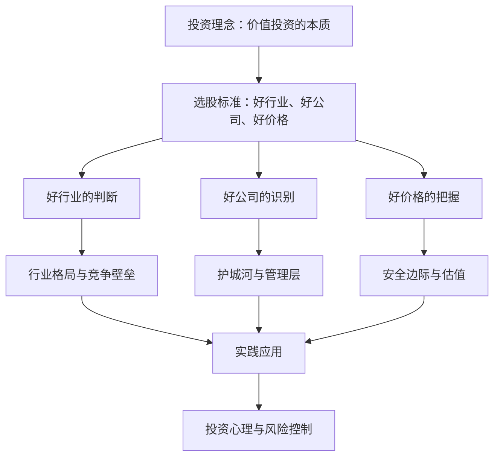
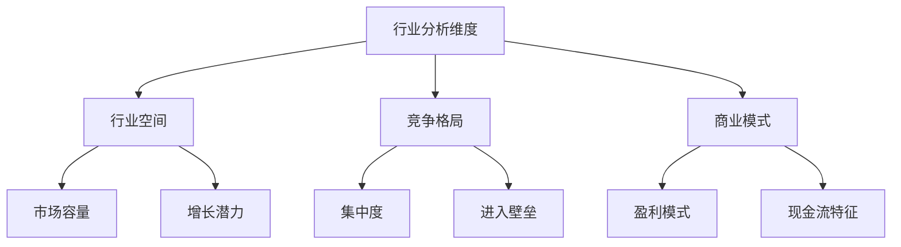
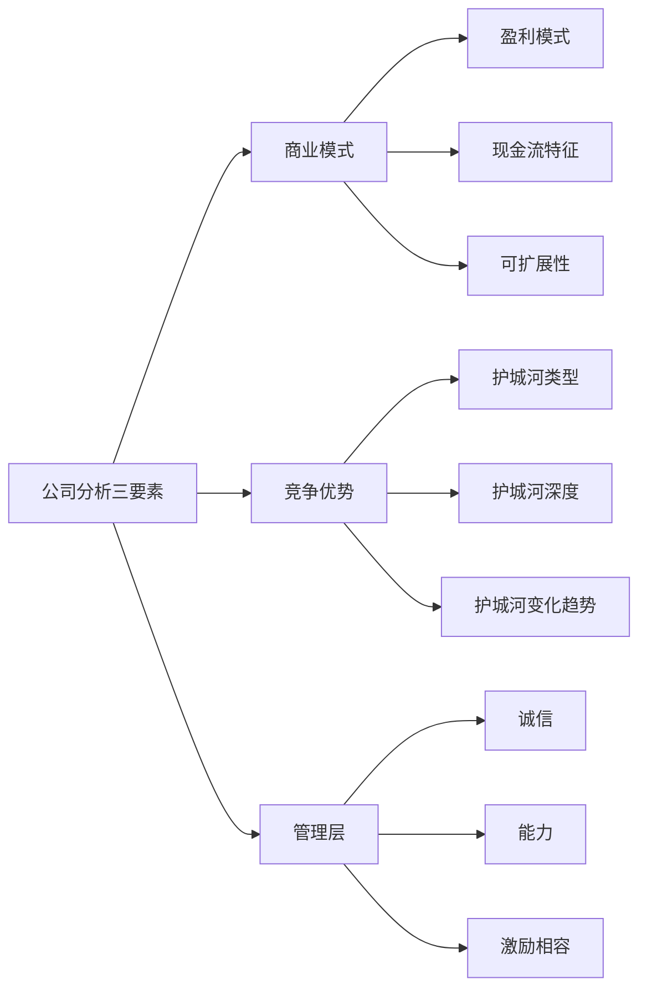
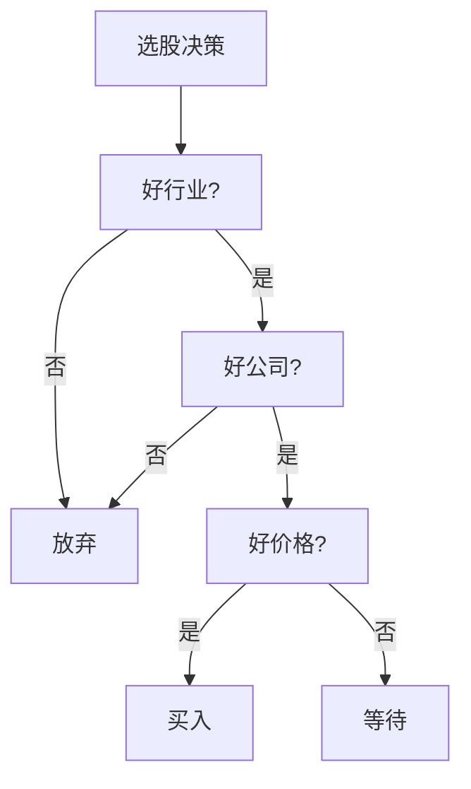

# 《投资中最简单的事》深度读书笔记

## 一、元信息/坐标定位

### 作者背景
邱国鹭是中国价值投资的代表人物之一，高毅资产董事长。他曾任南方基金投资总监、普林瑟斯资本管理公司基金经理，拥有超过20年的A股和美股投资经验。其投资业绩长期跑赢市场，被誉为"==中国巴菲特==的践行者"。邱国鹭的投资风格是典型的价值投资，注重安全边际、行业格局和管理层质量。

### 写作背景与时代语境
本书初版于2014年，正值中国股市从低谷走向新一轮牛市的前夜。经历了2007-2008年的大起大落后，中国投资者开始反思"炒股"与"投资"的区别，对价值投资的兴趣日渐浓厚。作者希望用==中国市场的实际案例==来阐释价值投资理念，而非简单照搬巴菲特的美国经验。

### 学科定位
本书属于==投资哲学与实务操作==的交叉领域。它不是学院派的金融理论著作，而是一位实战投资者的经验总结。在投资著作谱系中，它填补了"价值投资中国本土化"的空白，与《聪明的投资者》《巴菲特致股东的信》形成对话。

### 核心问题域
- 在A股这种"政策市""散户市"中，价值投资是否适用？
- 如何识别真正有护城河的好公司？
- 什么时候买、什么价格买才能有足够的安全边际？

> [!abstract] 一句话定位
> 这是一本将价值投资理念与A股实践相结合的投资指南，用"大道至简"的思维方式，回答了"买什么、何时买、何时卖"的核心问题。

---

## 二、全书逻辑地图

**全书逻辑主线**：本书遵循"理念→方法→实践→心理"的递进结构。

**第一部分（第1-2章）**：建立投资理念，区分投资与投机，阐释价值投资在A股的适用性。

**第二部分（第3-5章）**：构建选股框架——"好行业、好公司、好价格"三维标准。

**第三部分（第6-8章）**：深入探讨行业分析、公司分析和估值方法的具体技术。

**第四部分（第9-11章）**：讨论投资心理、仓位管理和风险控制的实操经验。

**第五部分（第12章）**：总结投资哲学，强调"简单"和"常识"的重要性。

> [!tip] 阅读建议
> 先通读全书建立框架，再重点精读第3-5章的选股方法。书中的案例分析虽有时效性，但背后的思维方式值得反复品味。

---

## 三、核心主题/逐章深度拆解

### 第一章：投资理念——以实业的眼光做投资

#### 核心论点
投资的本质是==成为企业的股东，分享企业的价值创造==。股价短期是投票机，长期是称重机。散户亏钱的根本原因是把投资当成了投机，关注的是股价波动而非企业价值。

#### DIKW四层提炼
| 层次 | 内容 |
|------|------|
| **Data** | A股散户亏钱比例高达70-80%；机构投资者平均跑赢市场 |
| **Information** | 散户亏钱是因为追涨杀跌，机构赚钱是因为坚守纪律 |
| **Knowledge** | 长期收益 = 企业盈利增长 + 估值变化 + 分红 |
| **Wisdom** | 投资是认知的变现，你赚不到认知之外的钱 |

#### 费曼式解读
> [!note] 用大白话解释
> 假设你朋友开了家奶茶店，问你要不要入股。你会怎么想？肯定是看==这店能不能赚钱==——地段好不好、产品有没有竞争力、成本控制得怎么样。你不会每天问"今天我的股份值多少钱"，因为你知道这是长期生意。买股票也一样，你买的是==企业的一部分==，关注点应该是企业能不能持续赚钱，而不是明天股价涨不涨。

#### 关键概念
- **投资vs投机**：投资关注企业价值，投机关注价格波动
- **内在价值**：企业未来现金流的折现值
- **安全边际**：买入价格低于内在价值的幅度

---

### 第二章：价值投资在A股的适用性

#### 核心论点
很多人认为A股是"政策市""散户市"，价值投资不适用。但作者用数据和案例证明：==长期来看，A股同样是称重机==。那些"十年十倍"的大牛股，几乎都是基本面优秀的好公司。

#### DIKW四层提炼
| 层次 | 内容 |
|------|------|
| **Data** | 2003-2013年，消费股平均涨幅超过10倍，远超大盘 |
| **Information** | A股不是没有价值投资机会，而是散户没有耐心等待 |
| **Knowledge** | 价值投资适用性 = 市场有效程度 × 投资者耐心 |
| **Wisdom** | 别人贪婪时恐惧，别人恐惧时贪婪——这条原则全球适用 |

#### 费曼式解读
> [!note] 用大白话解释
> 有人说"A股都是庄家控盘、内幕交易，价值投资没用"。那请问：==茅台、格力、美的这些股票，20年涨了几十倍，是庄家拉的吗？==不是，是因为它们的利润实实在在增长了几十倍。短期确实有噪音，但长期看，好公司的股价一定会反映出来。价值投资在A股的问题不是"不适用"，而是"太难坚持"。

#### 关键概念
- **市场有效性**：价格反映所有信息的程度
- **均值回归**：过高或过低的估值最终会回到合理水平
- **长期持有**：穿越周期波动，享受企业成长

> [!warning] 投资陷阱
> 不要用"A股特殊论"为自己的投机行为找借口。说"价值投资在A股不适用"的人，往往是因为自己做不到。

---

### 第三章：好行业——选择赛道比选手更重要

#### 核心论点
投资首先要选对行业。有些行业"==躺着就能赚钱=="（如高端白酒），有些行业"累死累活还亏钱"（如航空业）。行业格局决定了企业盈利的天花板和地板。

#### DIKW四层提炼
| 层次 | 内容 |
|------|------|
| **Data** | 白酒行业净利润率可达30%+，航空业好年份也只有5-10% |
| **Information** | 行业特性决定了盈利能力的上限 |
| **Knowledge** | 好行业 = 需求增长 + 供给有限 + 竞争格局好 |
| **Wisdom** | 在月亮上做生意，比在地球上做容易 |

#### 费曼式解读
> [!note] 用大白话解释
> 想象两个人开店：一个在==北京三里屯卖奢侈品==，一个在==河北农村开杂货店==。第一个人不太努力也能赚钱，第二个人累死累活可能还亏钱。为什么？地段（行业）决定了生意的难度。投资也一样，==选对行业比选对公司更重要==。茅台的员工不一定比钢铁厂的员工更努力，但茅台的股东比钢铁股东赚得多得多。

#### 关键概念
- **行业壁垒**：新进入者难以克服的障碍
- **定价权**：企业能否自主提价而不损失客户
- **行业集中度**：龙头企业的市场份额

**好行业特征清单**：
1. 需求稳定增长，不受周期剧烈波动
2. 供给端有壁垒，不易被新进入者颠覆
3. 行业格局稳定，龙头地位稳固
4. 现金流充沛，不需要持续大量资本投入

---

### 第四章：好公司——识别真正的护城河

#### 核心论点
好公司要有==护城河（moat）==——持续的竞争优势。护城河有四种类型：品牌、网络效应、成本优势、转换成本。很多所谓的"好公司"其实没有真正的护城河。

#### DIKW四层提炼
| 层次 | 内容 |
|------|------|
| **Data** | 具有宽护城河的公司，ROE长期保持15%以上 |
| **Information** | 护城河是持续高回报的来源 |
| **Knowledge** | 护城河 = 竞争对手难以复制的优势 |
| **Wisdom** | 判断护城河的标准是：假设有100亿，能不能打败它？ |

#### 费曼式解读
> [!note] 用大白话解释
> 想象你有100亿资金，想打败某家公司。如果==你打不过==，它就有护城河。比如茅台——你有100亿能造出茅台的品牌吗？不能，因为品牌需要时间积累。比如腾讯——你有100亿能让大家都用你的社交软件吗？很难，因为大家的朋友都在微信上。这就是护城河的力量。反过来，如果你有100亿肯定能打败它，那这公司的护城河就是假的。

#### 关键概念
- **品牌护城河**：消费者认可的品牌溢价（茅台、爱马仕）
- **网络效应**：用户越多越有价值（微信、淘宝）
- **成本优势**：低成本生产的能力（福耀玻璃）
- **转换成本**：用户更换的代价高（企业软件）

> [!tip] 判断护城河的三问
> 1. 这个优势能持续多久？（5年？10年？20年？）
> 2. 竞争对手模仿的难度有多大？（需要多少钱、多少时间？）
> 3. 这个优势是在加强还是在削弱？

---

### 第五章：好价格——安全边际的艺术

#### 核心论点
即使是好公司，==买贵了也会亏钱==。安全边际是价值投资的核心——以低于内在价值的价格买入，为判断错误留出余地。估值不是精确的科学，而是模糊的艺术。

#### DIKW四层提炼
| 层次 | 内容 |
|------|------|
| **Data** | 买入估值高20%，长期年化收益率可能低5个百分点 |
| **Information** | 买入价格决定了你的收益下限 |
| **Knowledge** | 安全边际 = 内在价值 - 买入价格 |
| **Wisdom** | 模糊的正确胜过精确的错误 |

#### 费曼式解读
> [!note] 用大白话解释
> 假设你想买一套房子，觉得它值500万。卖家开价600万，你买不买？==太贵了==，即使房子是好房子。如果卖家急用钱，450万肯定卖，你买不买？==可以考虑==，因为有50万的"安全垫"。股票投资也一样，好公司太贵的时候要等，好公司打折的时候要敢买。==便宜是硬道理==，这就是安全边际。

#### 关键概念
- **安全边际**：买入价格低于内在价值的幅度
- **估值方法**：PE、PB、DCF等估值工具的适用场景
- **相对估值**：与历史估值、同业估值的比较

**常用估值参考框架**：
| 估值指标 | 适用场景 | 警示区间 |
|---------|---------|---------|
| PE（市盈率） | 盈利稳定的公司 | >30倍需谨慎 |
| PB（市净率） | 重资产行业 | >5倍需谨慎 |
| PEG | 成长型公司 | >1.5需谨慎 |
| 股息率 | 成熟型公司 | <2%可能偏贵 |

---

### 第六章：行业选择的深度分析

#### 核心论点
行业分析要抓住==关键成功因素（KSF）==。不同行业的KSF不同：白酒看品牌、家电看渠道、银行看风控。理解行业的本质规律，才能判断企业的竞争优势是否可持续。

#### DIKW四层提炼
| 层次 | 内容 |
|------|------|
| **Data** | 中国白酒行业CR3（前三名市占率）不到30%，仍有整合空间 |
| **Information** | 行业集中度提升是确定性趋势 |
| **Knowledge** | 行业投资价值 = 空间 × 增速 × 格局 × 盈利能力 |
| **Wisdom** | 理解行业本质比追热点更重要 |

#### 费曼式解读
> [!note] 用大白话解释
> 每个行业都有自己的"==游戏规则=="。白酒的规则是"品牌为王"——茅台、五粮液建立了几十年的品牌，新玩家很难挑战。家电的规则是"渠道为王"——美的、格力在全国有几万个专卖店，新品牌铺不动。互联网的规则是"赢家通吃"——微信占了就没第二家什么事了。你得先搞清楚这个行业的游戏规则，才能判断谁会赢。

#### 关键概念
- **KSF（关键成功因素）**：决定行业竞争胜负的核心要素
- **产业链分析**：上下游的议价能力和利润分配
- **竞争格局演变**：从分散到集中的行业演变规律

---

### 第七章：公司分析的核心要点

#### 核心论点
分析公司要抓住三个核心：==商业模式、竞争优势、管理层==。商业模式决定能赚多少钱，竞争优势决定能赚多久，管理层决定能赚多少留给股东。

#### DIKW四层提炼
| 层次 | 内容 |
|------|------|
| **Data** | 管理层持股比例与长期股价正相关 |
| **Information** | 管理层利益与股东利益的一致性是关键 |
| **Knowledge** | 公司价值 = 商业模式价值 × 竞争优势持续性 × 管理层效率 |
| **Wisdom** | 与诚实能干的人共事，比什么都重要 |

#### 费曼式解读
> [!note] 用大白话解释
> 选公司就像选合伙人。==商业模式==是他做什么生意——卖烟酒的和卖蔬菜的天花板不一样。==竞争优势==是他凭什么做得比别人好——有独家资源？有技术专利？还是品牌响亮？==管理层==是他人品和能力如何——会不会把赚的钱分给你？会不会乱投资把钱亏光？三个问题都回答好了，这公司大概率是好公司。

#### 关键概念
- **商业模式**：企业创造、传递、获取价值的逻辑
- **ROE（净资产收益率）**：衡量公司盈利能力的核心指标
- **管理层激励**：管理层利益与股东利益的一致程度

> [!warning] 警惕"伪成长"
> 有些公司增长很快，但都是靠烧钱、靠并购、靠政府补贴，而非真正的内生增长。==看利润更要看现金流==，没有现金流支撑的利润都是假的。

---

### 第八章：估值方法的实战应用

#### 核心论点
估值不是精确计算，而是==给合理区间==。不同类型的公司适用不同的估值方法。最重要的不是算出精确数字，而是判断"贵还是便宜"。

#### DIKW四层提炼
| 层次 | 内容 |
|------|------|
| **Data** | A股历史PE中枢约为15-20倍，低于12倍为历史低点 |
| **Information** | 估值是相对的，要与历史和同业比较 |
| **Knowledge** | 合理估值 = 基本面价值 + 市场情绪溢价/折价 |
| **Wisdom** | 宁可错过，不可买错；宁可买贵，不可买差 |

#### 费曼式解读
> [!note] 用大白话解释
> 估值就像给二手车定价。你不会精确说"这车值123,456元"，而是说"==8-10万是合理的=="。同样，给股票估值也别追求精确。茅台现在30倍PE，贵不贵？看历史——2014年只有10倍，现在确实不便宜。看同业——国际烈酒公司大多20-25倍，茅台有溢价但也差不多到头了。这就够了，不需要精确到小数点后两位。

#### 关键概念
- **绝对估值**：DCF等基于现金流折现的方法
- **相对估值**：PE、PB等基于比较的方法
- **估值锚点**：历史估值区间、同业估值水平

---

### 第九章：投资心理——知易行难

#### 核心论点
投资最大的敌人不是市场，而是==自己的情绪==。贪婪和恐惧是人性的弱点，价值投资者需要逆人性操作：别人恐惧时贪婪，别人贪婪时恐惧。

#### DIKW四层提炼
| 层次 | 内容 |
|------|------|
| **Data** | 股市大跌时基金赎回量激增，大涨时申购量激增——完美反向指标 |
| **Information** | 散户总是高买低卖，所以总是亏钱 |
| **Knowledge** | 投资收益 = 认知 × 纪律 × 耐心 |
| **Wisdom** | 投资比的不是谁更聪明，而是谁更有纪律 |

#### 费曼式解读
> [!note] 用大白话解释
> 2015年股市5000点的时候，营业厅人满为患；2018年跌到2500点的时候，营业厅空无一人。==大家都在高点冲进去、低点割肉跑==，这不亏才怪。理性上我们都知道"低买高卖"，但情绪上做不到——涨的时候怕错过、跌的时候怕继续跌。价值投资难就难在：要在众人狂热时保持冷静，在众人绝望时保持乐观。

#### 关键概念
- **锚定效应**：被买入价格"锚定"，影响后续决策
- **损失厌恶**：亏损的痛苦是盈利快乐的2倍
- **逆向投资**：与市场情绪相反操作

> [!tip] 克服情绪的方法
> 1. 制定投资纪律并严格执行
> 2. 减少看盘频率
> 3. 建立投资清单，按清单操作
> 4. 与志同道合的人交流，避免被噪音影响

---

### 第十章：仓位管理与风险控制

#### 核心论点
投资不是只考虑收益，更要考虑==风险调整后的收益==。仓位管理是风险控制的核心——不要把所有鸡蛋放在一个篮子里，但也不要分散到自己无法跟踪。

#### DIKW四层提炼
| 层次 | 内容 |
|------|------|
| **Data** | 集中投资（5-10只股票）的长期收益优于过度分散 |
| **Information** | 适度集中可以提高研究深度和收益质量 |
| **Knowledge** | 仓位 = 确定性 × 赔率 × 流动性 |
| **Wisdom** | 看好的仓位重一点，看不清的仓位轻一点 |

#### 费曼式解读
> [!note] 用大白话解释
> 仓位管理像==下注的艺术==。德州扑克高手怎么赢钱？牌好的时候下大注，牌差的时候小赌怡情或者弃牌。==确定性高的机会要敢于重仓==，模棱两可的机会小仓位试水，看不懂的就别参与。很多人的问题是：牌好的时候不敢下注，牌差的时候还死扛——这不亏才怪。

#### 关键概念
- **凯利公式**：根据胜率和赔率计算最优仓位
- **止损与止盈**：何时该认错、何时该止盈
- **分散投资**：适度分散风险，但不过度分散

**仓位管理原则**：
1. 单只股票仓位不超过30%
2. 单一行业仓位不超过40%
3. 持股数量控制在5-15只
4. 留有10-20%现金应对机会

---

### 第十一章：卖出的艺术

#### 核心论点
很多人只研究"买什么"，却忽视"何时卖"。卖出有三种情况：==基本面恶化、估值过高、发现更好的机会==。不要因为涨太多而卖，也不要因为跌太多而卖。

#### DIKW四层提炼
| 层次 | 内容 |
|------|------|
| **Data** | 长期持有优质股票的收益远高于频繁交易 |
| **Information** | 频繁交易的最大敌人是交易成本和判断错误 |
| **Knowledge** | 卖出决策 = 基本面变化 + 估值变化 + 机会成本 |
| **Wisdom** | 买入需要勇气，持有需要耐心，卖出需要智慧 |

#### 费曼式解读
> [!note] 用大白话解释
> 什么时候该卖？三种情况：第一，==当初买的逻辑不成立了==——比如你因为某公司新产品看好它，结果新产品失败了，那就该卖。第二，==实在太贵了==——再好的公司，100倍PE也太离谱了。第三，==有更好的机会==——同样的钱，投A能赚20%，投B只能赚10%，那把B换成A。注意，"涨多了"不是卖的理由，"跌多了"也不是持有的理由。

#### 关键概念
- **投资逻辑失效**：买入的核心理由不再成立
- **估值泡沫**：价格远超内在价值
- **机会成本**：持有这只股票的代价是什么

> [!warning] 卖出误区
> 1. ==浮盈就卖==：股票涨了20%就卖，结果错过10倍股
> 2. ==浮亏死扛==：亏了就不卖，等着回本，结果越亏越多
> 3. ==跟风卖出==：别人卖我也卖，完全没有自己的判断

---

### 第十二章：投资中最简单的事

#### 核心论点
投资不需要高智商，需要的是==正确的理念、简单的方法、足够的耐心==。坚持做正确的事，让复利发挥魔力。投资中最简单的事，往往也是最难坚持的事。

#### DIKW四层提炼
| 层次 | 内容 |
|------|------|
| **Data** | 巴菲特90%以上的财富是50岁以后赚的——复利需要时间 |
| **Information** | 长期投资的关键是"活下来"，然后是"不犯大错" |
| **Knowledge** | 投资成功 = 正确方法 × 长期坚持 × 复利积累 |
| **Wisdom** | 最简单的事往往最难做到，因为人性天然追求复杂 |

#### 费曼式解读
> [!note] 用大白话解释
> 投资最简单的事是什么？==找到好公司、以合理价格买入、长期持有==。就这三句话。但99%的人做不到。为什么？因为大家总觉得要搞点复杂的——技术分析、打板追涨、短线波段...结果搞来搞去还是亏钱。巴菲特的方法小学生都能听懂，但全世界能做到的没几个人。==大道至简，知易行难==。

#### 关键概念
- **复利效应**：时间是价值投资最好的朋友
- **能力圈**：只投自己看得懂的公司
- **长期主义**：用实业的眼光做长期投资

---

## 四、核心框架提炼

### 框架一：选股三维框架

**应用场景**：股票筛选和投资决策的核心流程。

### 框架二：护城河类型矩阵

| 护城河类型 | 特征 | 典型案例 | 持久性 |
|-----------|------|---------|--------|
| ==品牌== | 消费者认可、溢价能力 | 茅台、可口可乐 | 非常高 |
| ==网络效应== | 用户越多越有价值 | 微信、淘宝 | 高 |
| ==成本优势== | 规模效应或资源禀赋 | 福耀玻璃、海螺水泥 | 中等 |
| ==转换成本== | 用户更换代价高 | 用友、金蝶 | 中等 |

**应用场景**：判断公司竞争优势的类型和可持续性。

### 框架三：投资检查清单

**买入前必答题**：
- [ ] 这是好行业吗？（竞争格局、增长空间）
- [ ] 这是好公司吗？（护城河类型和深度）
- [ ] 这是好价格吗？（安全边际是否足够）
- [ ] 我真的懂这个公司吗？（能力圈内吗）
- [ ] 如果股价腰斩，我敢加仓吗？（信心检验）

> [!abstract] 框架整合
> 三维框架用于筛选，护城河矩阵用于分析，检查清单用于最终决策。三者结合形成完整的投资分析体系。

---

## 五、批判性思考

### 理论贡献与局限

**贡献**：
1. 将价值投资理念与A股实践结合，提供本土化的投资指南
2. 语言朴实、案例丰富，适合普通投资者阅读
3. 强调"简单"和"常识"，纠正过度复杂化的投资倾向

**局限**：
1. ==案例有时效性==，部分公司已发生重大变化
2. 对成长股投资的讨论不够深入
3. 对量化投资、被动投资等新趋势着墨较少

### 争议性观点

> [!warning] 需要批判性审视的论断
> 1. "集中投资优于分散"——风险承受能力因人而异
> 2. "技术分析无用"——短期交易者有不同看法
> 3. "长期持有必胜"——前提是选对公司、买对价格

### 与其他思想的对话

| 本书观点 | 对立/补充观点 | 来源 |
|---------|--------------|------|
| 选股优于择时 | 资产配置比选股更重要 | [[大卫·史文森]] |
| 集中投资 | 适度分散更安全 | [[马科维茨]] |
| 基本面决定一切 | 市场情绪短期影响巨大 | [[行为金融学]] |

### 个人批判性问题

1. 在A股注册制改革背景下，"好公司长期一定涨"的假设是否仍成立？
2. 对于普通投资者，被动指数投资是否是更明智的选择？
3. 价值投资是否需要进化以适应科技股主导的新时代？

---

## 六、行动清单

### 学习阶段（第1-2周）
- [ ] 建立自己的"能力圈"清单——哪些行业我真正懂？
- [ ] 学习阅读财务报表的基本技能
- [ ] 研读3-5家自己熟悉的公司的年报

### 实践阶段（第3-4周）
- [ ] 用三维框架分析5只备选股票
- [ ] 为每只股票建立投资档案（商业模式、护城河、估值）
- [ ] 设定合理的买入价格区间

### 执行阶段（长期）
- [ ] 严格按照检查清单进行买入决策
- [ ] 每季度复盘持仓，检查投资逻辑是否变化
- [ ] 记录投资决策日记，定期回顾反思

> [!tip] 关键成功因素
> ==少做多想==。减少交易频率，增加思考深度。每年能找到2-3个好机会就足够了。

---

## 七、延伸阅读路线图

### 经典著作
- [[聪明的投资者]] - 格雷厄姆：价值投资的奠基之作
- [[巴菲特致股东的信]] - 巴菲特：价值投资的最佳教材

### 本土实践
- [[时间的玫瑰]] - 但斌：中国价值投资的另一种视角
- [[金融的逻辑]] - 陈志武：理解中国资本市场的背景

### 行为金融
- [[思考，快与慢]] - 卡尼曼：理解投资中的心理偏误
- [[非理性繁荣]] - 席勒：理解市场泡沫的形成机制

### 进阶阅读
- [[证券分析]] - 格雷厄姆：深入学习估值方法
- [[投资最重要的事]] - 霍华德·马克斯：风险控制的哲学

---

## 八、费曼终极检验

### 如果要用5分钟向一个完全不懂投资的朋友解释这本书，我会这样说：

"你知道为什么大多数人炒股都亏钱吗？因为他们把买股票当成了==赌博==——今天涨了高兴，明天跌了难受，天天盯着那几毛钱的波动。

这本书告诉你，买股票其实是==当老板==。你买茅台的股票，就是茅台的股东，茅台赚钱你也跟着赚。所以关键不是明天股价涨不涨，而是这家公司能不能持续赚钱。

怎么找能持续赚钱的公司？作者给了三个标准：

第一，==好行业==。有的行业躺着赚钱（白酒），有的行业累死累活还亏钱（航空）。先选对赛道。

第二，==好公司==。在好行业里，也有好坏之分。好公司有'护城河'——别人想抢它生意但抢不走。茅台的品牌、腾讯的用户，都是护城河。

第三，==好价格==。再好的公司，太贵也不能买。好比一套值500万的房子，600万买就是亏的。

选好公司，等到合理价格，买入，长期持有。就这么简单。==难的是什么？难的是大家做不到。==

股市涨的时候所有人都冲进去，跌的时候所有人都跑。这本书说，==应该反过来==——大家恐慌的时候，好公司打折卖，反而应该买；大家疯狂的时候，股价虚高，反而应该卖。

最后一句话：==投资的本质是认知变现==。你对公司的理解有多深，决定了你能赚多少钱。别想走捷径，老老实实研究公司，这是最'简单'也是最难的事。"

---

> [!abstract] 全书一句话总结
> ==投资中最简单的事是"好行业、好公司、好价格"，最难的事是"知行合一、长期坚持"——大道至简，简在理念，难在人性。==
