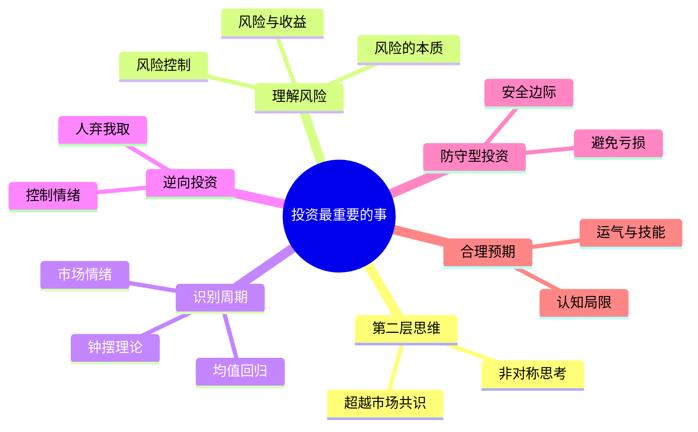
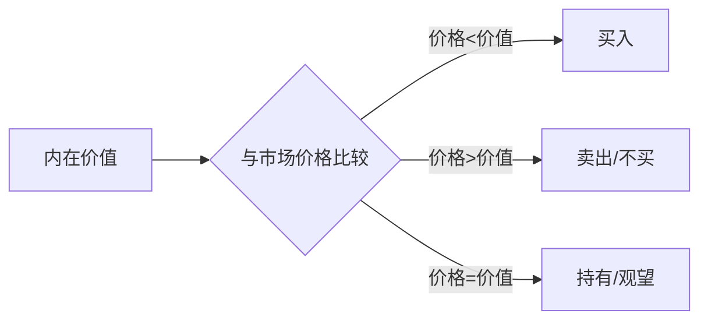
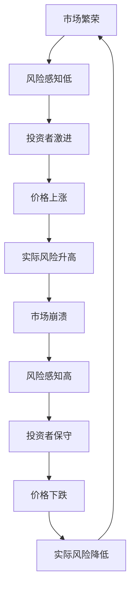
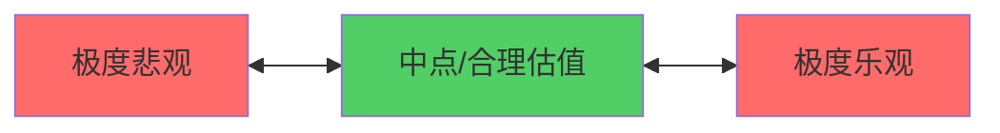
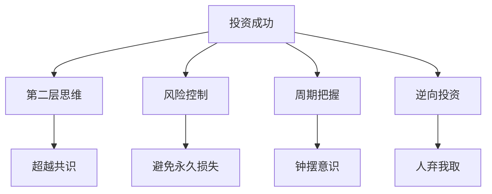

# 《投资最重要的事》深度拆解

## 一、元信息/坐标定位

### 作者背景
==霍华德·马克斯==是橡树资本管理公司（Oaktree Capital Management）的联合创始人兼联席董事长。橡树资本是全球最大的不良债务投资机构之一，管理资产超过1500亿美元。马克斯毕业于沃顿商学院和芝加哥大学布斯商学院，在投资界拥有超过50年的经验。

### 写作背景
本书出版于2011年，是马克斯数十年投资智慧的结晶。更重要的是，这本书脱胎于他从1990年开始撰写的==投资备忘录==（Memos）。这些备忘录在华尔街广为流传，连巴菲特都说："我第一时间打开并阅读的邮件，就是霍华德·马克斯的备忘录。"

### 学科定位
本书属于投资哲学与风险管理领域，但它不是一本技术分析或财务分析的书籍。它关注的是==投资者的思维方式和心理素质==，是一本关于"投资之道"而非"投资之术"的著作。

### 核心价值主张
> [!abstract] 核心观点
> 投资成功的关键不在于"买好的"，而在于"买得好"。控制风险、理解周期、逆向思考是获得长期超额收益的核心要素。

### 目标读者
专业投资者、基金经理、希望提升投资思维的个人投资者，以及对风险管理和市场周期感兴趣的读者。

---

## 二、全书逻辑地图

本书的逻辑结构可以概括为==从认知升级到风险理解，从周期把握到逆向行动==：

**第一层：思维升级**——引入"第二层思维"的概念，强调投资者必须超越市场共识，进行更深入的思考。

**第二层：风险本质**——重新定义风险，解释为什么风险不等于波动性，以及如何正确理解和管理风险。

**第三层：周期规律**——阐述市场周期的必然性和"钟摆"特性，帮助投资者识别市场所处的位置。

**第四层：逆向实践**——将前述理论转化为逆向投资的实践方法。

**第五层：防守哲学**——强调防守型投资的重要性，避免大额亏损是获得长期成功的关键。

> [!note] 阅读建议
> 建议重点阅读第3章（准确估计价值）、第6章（识别风险）、第8章（关注周期）和第11章（逆向投资）。这四章构成了马克斯投资哲学的核心。

---

## 三、核心主题/逐章深度拆解

### 第一章：学习第二层思维

#### 1.1 第一层思维与第二层思维的区别

马克斯开篇就指出，投资的目标是取得==高于平均水平的收益==。但如果你的思维方式和大众一样，你的收益也只能是平均水平。

> [!tip] 第二层思维示例
> **第一层思维**："这是一家好公司，让我们买它的股票吧。"
> **第二层思维**："这是一家好公司，但每个人都认为它很好，所以股价被高估了。让我们卖出。"

第二层思维的特点是：
- ==非线性==：不是简单的"好公司→买入"
- ==考虑共识==：思考市场已经定价了什么
- ==概率思维==：考虑各种可能的结果及其概率
- ==反身性==：考虑自己的行动对结果的影响

#### 1.2 投资是一门艺术

马克斯强调，投资不是科学，而是艺术。科学可以重复实验，但投资世界是不可重复的。

> [!warning] 常见误区
> 很多投资者追求"正确"的投资方法，但马克斯认为：**没有永远正确的投资方法，只有在特定环境下合适的方法**。

### 第二章：理解市场有效性及局限性

马克斯认可有效市场假说的核心洞见：==市场大多数时候是有效的，战胜市场是困难的==。但他也指出，市场并非完全有效。

市场有效的来源：
- 大量投资者在研究和竞争
- 信息传播速度快
- 套利行为消除定价错误

市场无效的来源：
- 人类情绪会导致过度反应
- 信息不对称依然存在
- 制度因素导致的系统性偏差

> [!abstract] 马克斯的策略
> 不要在最有效的市场（如大型股票）寻找机会，而要在相对无效的领域（如不良债务、新兴市场、小型股）寻找被错误定价的资产。

### 第三章：准确估计价值

==价值投资是马克斯投资哲学的基石==。其核心逻辑是：

> [!tip] 核心区分
> =="买好的资产"和"买得好"是两回事==。好资产如果价格过高，就不是好投资；差资产如果价格足够低，可能是极好的投资。

### 第四章：价格与价值的关系

短期内，价格可能大幅偏离价值。但==长期来看，价格必然回归价值==。

价格偏离价值，主要是心理因素造成的：
- **贪婪**使人们愿意支付过高的价格
- **恐惧**使人们在低价时不敢买入
- **从众**使偏离自我强化

> [!warning] 情绪的陷阱
> "在别人贪婪时恐惧，在别人恐惧时贪婪"——这句话说起来容易，做起来极难。

### 第五章：理解风险

这是本书==最重要的章节之一==。马克斯对风险的理解与传统金融学有重大差异。

> [!abstract] 风险的本质
> 传统金融学用**波动性**（标准差）衡量风险。但马克斯认为，真正的风险是**永久性损失资本的概率**。

波动性不是风险，因为：
- 波动是暂时的，如果你能持有到价值回归，波动不会伤害你
- 下跌不等于损失，只有在低点卖出才会造成损失
- 上涨的波动难道也是"风险"吗？

> [!warning] 风险的悖论
> ==风险最高的时候，往往是看起来最安全的时候==。

### 第六章：识别风险

马克斯识别了多种风险来源：

**1. 高价格风险**
==最大的风险来自于买入价格过高==。

**2. 基本面风险**
企业可能因为竞争、技术变革、管理失误等原因，导致内在价值下降。

**3. 杠杆风险**
杠杆放大收益也放大损失。更重要的是，杠杆会迫使你在最坏的时机卖出。

**4. 流动性风险**
在你需要卖出时，可能找不到买家。

**5. 心理风险**
你可能因为情绪原因，在错误的时机做出错误的决策。

> [!tip] 马克斯的风险评估方法
> 1. 列出可能出错的所有情况
> 2. 评估每种情况的概率
> 3. 评估每种情况的损失程度
> 4. 考虑最坏情况下你能否承受
> 5. 如果最坏情况你承受不了，不要投资

### 第七章：控制风险

马克斯提出了一个重要观点：==优秀投资者的标志不是高收益，而是风险调整后的高收益==。

> [!note] 风险控制的悖论
> 好的风险控制往往是"看不见"的。如果风险没有发生，你无法证明你控制了风险；只有当风险发生、而你安然度过时，风险控制的价值才会显现。

### 第八章：关注周期

==周期不会消失，这是马克斯最坚定的信念之一==。

> [!abstract] 周期的驱动因素
> 周期是人类心理的必然产物。贪婪与恐惧交替主导市场，导致价格在过高和过低之间波动。

"这次不一样"是投资界最危险的四个字。

#### 钟摆理论

钟摆的特点：
- ==很少停留在中点==
- **在两极之间摆动**
- **摆动速度在中点最快**
- **在极端位置停留时间最短**——但这正是最好的投资时机

### 第九章：意识到钟摆的摆动

马克斯提供了一些识别市场位置的信号：

**市场过热的信号：**
- 每个人都乐观
- 新投资者大量涌入
- 杠杆率上升
- 风险溢价下降
- "这次不一样"的声音增多

**市场过冷的信号：**
- 每个人都悲观
- 投资者大量撤出
- 杠杆被迫降低
- 风险溢价上升
- "永远不会好了"的声音增多

> [!warning] 不要预测拐点
> 马克斯强调，你无法准确预测周期的拐点。但你可以判断**市场处于周期的什么位置**。

### 第十章：抵御消极影响

马克斯列举了影响投资决策的负面情绪：

- **贪婪**：追求快速致富
- **恐惧**：不敢在低点买入
- **从众**：跟随大众而非独立思考
- **嫉妒**：看到别人赚钱就坐不住
- **自负**：过度自信于自己的判断
- **投降**：在底部放弃

> [!tip] 马克斯的建议
> 1. **承认自己会受情绪影响**
> 2. **建立纪律性的投资流程**
> 3. **保持适度的怀疑**
> 4. **学习历史**

### 第十一章：逆向投资

==逆向投资是马克斯投资哲学的核心实践==。

逻辑链条：
1. 市场经常过度反应
2. 过度反应创造了定价错误
3. 要利用这些错误，你必须与大众相反
4. 因此，逆向投资是必要的

> [!abstract] 逆向投资的本质
> "在别人沮丧地抛售时买入，在别人兴奋地买入时抛售，需要最大的勇气，但它能带来最大的收益。"

逆向投资的困难：

**心理困难**：
- 当你买入时，价格在下跌，你会怀疑自己
- 当你卖出时，价格在上涨，你会觉得卖早了
- 你的行为与周围所有人相反，会感到孤独

> [!warning] 逆向不等于与众不同
> 逆向投资不是为了与众不同而与众不同。关键是要有独立的判断，而这个判断恰好与大众不同。

### 第十二章至第二十章：实践与总结

后面的章节主要是对前述概念的深化和实践应用，包括：

- **寻找便宜货**：如何在市场中找到被低估的资产
- **耐心等待机会**：不要为了行动而行动
- **认识预测的局限性**：承认未来是不可知的
- **正确认识运气**：区分技能和运气
- **防御型投资**：强调避免损失的重要性
- **避免错误**：总结常见的投资错误
- **增值的含义**：定义什么是真正的投资增值
- **合理预期**：保持现实的收益预期

---

## 四、核心框架提炼

### 马克斯投资哲学体系

### 框架一：投资决策矩阵

| 维度 | 问题 | 行动指引 |
|------|------|----------|
| 价值 | 内在价值是多少？ | 多方法验证，保守估计 |
| 价格 | 当前价格与价值的关系？ | 只在价格<价值时买入 |
| 周期 | 市场处于周期什么位置？ | 接近顶部保守，接近底部激进 |
| 情绪 | 市场情绪如何？ | 与主流情绪相反 |
| 风险 | 最坏情况能否承受？ | 如果不能承受，不投资 |

### 框架二：风险评估清单

1. **价格风险**：买入价格是否合理？
2. **基本面风险**：企业/资产的内在价值会恶化吗？
3. **杠杆风险**：是否使用了过多杠杆？
4. **流动性风险**：需要时能否顺利卖出？
5. **心理风险**：我能否在最坏情况下保持冷静？

### 框架三：周期定位工具

**市场情绪温度计**：
- **极度狂热**（90-100°）：立即减仓
- **乐观**（70-90°）：谨慎，不追高
- **中性**（40-70°）：正常操作
- **悲观**（20-40°）：开始关注机会
- **极度恐惧**（0-20°）：积极买入

---

## 五、批判性思考

### 5.1 本书的优势

**深刻的风险理解**：马克斯对风险的理解远超传统金融学，更加贴合投资实践的本质。

**周期思维的系统性**：钟摆理论和周期分析框架极具实用性。

**诚实与谦逊**：马克斯坦承投资的不确定性，承认自己也会犯错。

### 5.2 本书的局限

> [!warning] 需要注意的问题

**难以量化**：马克斯的很多建议（如"判断周期位置"）都是定性的，难以精确量化。

**对专业投资者更适用**：很多策略需要专业知识和资源，普通投资者难以复制。

**事后验证困难**：风险控制的价值往往在事后才能验证。

**时机问题**：逆向投资的最大问题是时机。太早逆向可能在你正确之前就被淘汰。

### 5.3 与其他投资思想的比较

与[[《穷查理宝典》 - 彼得·考夫曼]]相比，马克斯更专注于风险和周期，芒格的视野更加宏观。

与[[《聪明的投资者》 - 本杰明·格雷厄姆]]相比，马克斯继承了格雷厄姆的价值投资理念，但加入了更多对周期和心理因素的思考。

与[[《周期》 - 霍华德·马克斯]]相比，这本书更加全面，而《周期》则是对周期思想的深化。

---

## 六、行动清单

### 立即行动（本周）

- [ ] 审视自己当前的投资组合，评估每项投资的买入理由
- [ ] 建立一个"市场情绪日记"，每周记录市场的情绪状态
- [ ] 阅读马克斯最近的投资备忘录（可在橡树资本官网获取）

### 短期行动（1-3个月）

- [ ] 学习基本的估值方法（DCF、相对估值等）
- [ ] 研究一个你不熟悉的"冷门"投资领域
- [ ] 建立投资决策清单，强制自己在投资前回答关键问题

### 长期行动（1年以上）

- [ ] 建立投资日记，记录每个投资决策的理由和结果
- [ ] 研究历史上的市场周期（如1929、2000、2008）
- [ ] 培养耐心，训练自己等待真正的好机会

---

## 七、延伸阅读路线图

### 第一层：马克斯的其他著作
- [[《周期》 - 霍华德·马克斯]] - 对周期思想的深化
- 橡树资本投资备忘录 - 马克斯思想的实时应用

### 第二层：价值投资经典
- [[《聪明的投资者》 - 本杰明·格雷厄姆]] - 价值投资源头
- [[《穷查理宝典》 - 彼得·考夫曼]] - 跨学科思维
- [[《巴菲特致股东的信》 - 沃伦·巴菲特]] - 价值投资实践

### 第三层：行为金融学
- [[《思考，快与慢》 - 丹尼尔·卡尼曼]] - 认知偏误的学术基础
- [[《非理性繁荣》 - 罗伯特·席勒]] - 市场泡沫研究
- [[《动物精神》 - 阿克洛夫与席勒]] - 情绪与经济

---

## 八、费曼终极检验

> [!abstract] 如果要向一个10岁的孩子解释这本书的核心思想：

想象你在玩一个叫"买卖苹果"的游戏。

==第一个秘密==：不要只想"这是好苹果还是坏苹果"，要想"这个价格买苹果合不合算"。一个完美的苹果如果卖100块，太贵了；一个有点瑕疵的苹果如果只要1块，可能是好买卖。

==第二个秘密==：小心！当所有人都在抢苹果、说苹果会越来越贵的时候，你要特别小心——这时候苹果可能已经太贵了。相反，当所有人都在扔掉苹果、说苹果一文不值的时候，可能是买苹果的好时候。

==第三个秘密==：最重要的不是赚多少钱，而是不要亏大钱。如果你有10块钱，亏了5块，你需要赚回100%才能回本。但如果你一直小心谨慎，虽然每次赚得少一点，但长期下来反而赚得更多。

==第四个秘密==：没有人能预测苹果明天会涨价还是跌价。但你可以判断现在苹果是贵了还是便宜了。如果看起来很便宜，就多买一些；如果看起来很贵，就少买或者卖掉。

**这就像打牌**：你不能控制发什么牌，但你可以决定怎么打手里的牌。好的投资者不是每次都赢，而是在不确定的情况下做出最聪明的选择。
