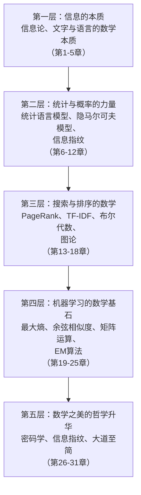
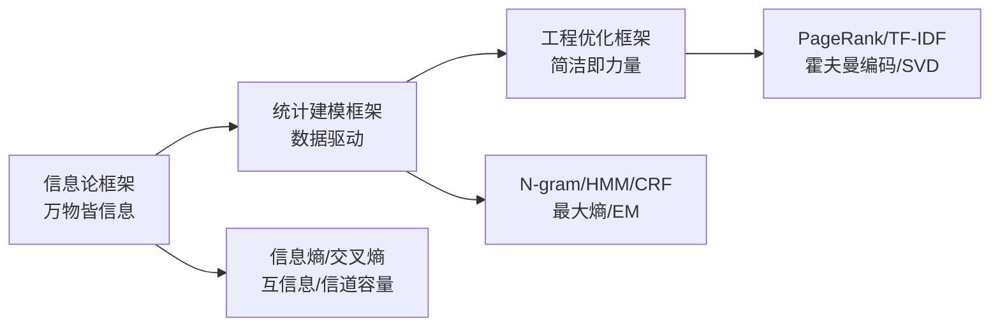

# 《数学之美》深度拆解

## 一、元信息速览

> [!abstract] 速览
> 《数学之美》由吴军博士撰写，最初以博客专栏形式发表于Google黑板报（2006年），后整理扩充为书，第一版出版于2012年，第二版2014年修订，第三版2020年再版。吴军曾任Google研究员、腾讯副总裁，在自然语言处理和搜索引擎领域有深厚的工程实践背景。本书的核心使命是：==用通俗语言揭示数学思想如何在信息技术（尤其是搜索引擎、自然语言处理、语音识别、机器翻译等领域）中发挥决定性作用==。全书约30章（各版本略有调整），涵盖信息论、统计语言模型、布尔代数、图论、PageRank、隐马尔可夫模型、维特比算法、最大熵模型、余弦相似度、矩阵运算、密码学等核心数学工具，并以Google、百度等公司的真实工程案例作为注解。本书不是一本数学教科书，而是一本==数学思想与工程实践之间的桥梁读物==，适合有基本数学素养的读者理解技术背后的原理之美。

---

## 二、全书逻辑地图

> [!note] 全书架构
> 全书表面上按章节独立成篇，但底层存在一条清晰的思想主线：**从信息的本质出发，经由数学建模，抵达工程应用的优雅实现**。

**核心命题**：你以为自然语言、搜索引擎、机器翻译这些技术靠的是某种「人工智能的魔法」，但吴军告诉你，它们的根基是==几个简洁而深刻的数学原理==。统计胜过规则，简单模型加大数据胜过复杂模型加小数据，数学的美在于它能用最少的假设解释最多的现象。全书贯穿一个方法论立场：==大道至简——真正有效的方案往往是数学上最简洁的方案==。

---

## 三、逐章深度拆解

### 第1-2章：「文字和语言 vs 数字和信息」

**【核心论点】**

语言和文字的本质是信息编码。从古埃及的象形文字到现代的Unicode，人类一直在做同一件事：用符号系统对现实世界的信息进行编码。而数学，尤其是==信息论==，提供了理解这些编码系统的终极框架。

**【详细拆解】**

吴军从罗塞塔石碑的故事讲起——一块刻有三种文字（象形文字、通俗体、希腊文）的石碑让商博良破解了古埃及文字。这个故事的数学本质是什么？是==冗余信息==。三种文字表达同一内容，提供了相互校验的信息，使得破解成为可能。

你可以从这个故事中提炼出信息科学的第一条原理：信息的可靠传输依赖于冗余。这与香农后来提出的信道编码定理（Channel Coding Theorem）在本质上一脉相承——你要在有噪声的信道中可靠地传递信息，就必须引入冗余（纠错码）。

吴军进一步指出，中文和英文在信息编码上有本质差异。中文是表意文字，每个字承载的信息量大，但字符集庞大；英文是表音文字，基础字符少（26个字母），但需要更多字符来表达同样的信息。这不是优劣之分，而是==信息编码策略的不同权衡==。

**【费曼式解读】**

想象你在玩一个猜词游戏。对方心里想了一个汉字，你要通过是/否问题猜出来。常用汉字约7000个，理论上你需要大约13个问题（因为 $2^{13} = 8192 > 7000$）。但如果你知道对方想的是一个关于"水"的字，候选范围缩小到几百个，你只需要约9个问题。==信息就是消除不确定性的东西==——这正是香农对信息的定义。每一个线索都在减少你的不确定性，每减少一半的可能性，就获得了1比特的信息。

**【金句/关键概念】**

- ==信息的本质是消除不确定性==
- 冗余不是浪费，是信息可靠传输的保障
- `信息熵` → `编码效率` → `自然语言的统计特性`

---

### 第3-5章：「统计语言模型与香农的信息论」

**【核心论点】**

自然语言处理从「规则方法」转向「统计方法」，是这个领域最重要的范式转换。统计语言模型用概率来描述语言现象，而信息论为此提供了理论基础。

**【详细拆解】**

吴军讲述了自然语言处理领域的一场「范式战争」。20世纪50-80年代，主流方法是基于规则的——语言学家试图用语法规则来让计算机「理解」语言。这条路越走越窄，因为自然语言的规则太多、例外更多。

转折点来自统计方法的兴起。弗里德里克·贾里尼克（Fred Jelinek）在IBM带领团队，提出了一个革命性的主张：==不需要让计算机理解语言，只需要让它计算概率==。一句话是否通顺，不需要分析语法结构，只需要计算这个词序列出现的概率是否足够高。

统计语言模型的核心是N-gram模型。给定前面N-1个词，预测下一个词出现的概率。比如二元模型（bigram）就是：给定前一个词，下一个词最可能是什么？"中华"后面跟"人民"的概率很高，跟"牛肉"的概率也不低，但跟"量子"的概率就很低。

香农的信息论为统计语言模型提供了理论框架。信息熵衡量语言的不确定性——英语的信息熵约为每字母1.0-1.5比特（远低于理论上限 $\log_2 26 \approx 4.7$ 比特），说明英语有大量冗余和可预测性。这正是自动补全、拼写纠错能够工作的数学基础。

吴军还介绍了==交叉熵==（Cross Entropy）的概念——它衡量的是一个语言模型对真实语言的近似程度。交叉熵越低，模型越好。这个指标后来成为评估所有语言模型（包括今天的大语言模型）的标准尺度。

**【费曼式解读】**

假设你正在用手机输入法打字。你输入了"今天天气"四个字，输入法自动提示"真好"、"不错"、"怎么样"。它是怎么做到的？它并不「理解」天气，它只是在一个巨大的文本数据库中统计过：在"今天天气"后面，"真好"出现了3000次，"不错"出现了2500次，"怎么样"出现了2000次。它把频率当作概率，把概率当作预测——这就是统计语言模型的全部秘密。

你可能会问：这种「不理解只统计」的方法真的有效吗？答案是：==在大多数工程场景下，统计方法的效果远超规则方法==。贾里尼克有一句著名的玩笑话："每开除一个语言学家，语音识别的准确率就上升一点。"虽然刻薄，但道出了一个真理——规则的复杂性是无底洞，而统计的力量随数据增长而增长。

**【金句/关键概念】**

- ==一个正确的统计模型加上足够的数据，胜过一个精巧但脆弱的规则系统==
- 贾里尼克名言："每开除一个语言学家，语音识别准确率就提高一点"
- `N-gram模型` → `信息熵` → `交叉熵` → `困惑度(Perplexity)`

---

### 第6-8章：「隐马尔可夫模型与维特比算法」

**【核心论点】**

隐马尔可夫模型（HMM）是处理序列数据的核心工具，它的妙处在于：你观察到的是「表面现象」，而真正驱动现象的「隐藏状态」需要通过概率推断来还原。维特比算法则提供了在所有可能的隐藏状态序列中，找到最优解的高效方法。

**【详细拆解】**

吴军用通信的场景来引入HMM：发送者想传递一个信息（隐藏状态），但信道有噪声，接收者收到的是被噪声干扰后的信号（观察值）。接收者的任务是从失真的信号中「还原」原始信息。

HMM的三个核心要素：（1）隐藏状态集合（你看不见的）；（2）观察值集合（你能看见的）；（3）状态之间的转移概率和从状态到观察值的发射概率。

在语音识别中：你说了一句话（隐藏状态是你想表达的词序列），麦克风录下了声波信号（观察值是声学特征），系统的任务是从声学特征中推断出你说了什么词。在中文输入法中：你输入了一串拼音（观察值），系统需要推断你想打的汉字序列（隐藏状态）。

维特比算法（Viterbi Algorithm）是解决HMM解码问题的经典算法。它的核心思想是==动态规划==——不需要穷举所有可能的状态序列（指数级复杂度），而是利用「最优子结构」的性质，逐步构建最优路径，将复杂度降到多项式级别。

吴军强调了维特比本人的贡献——安德鲁·维特比不仅提出了这个算法，还创办了高通公司（Qualcomm），将CDMA技术商业化。这个故事本身就是「数学之美」的绝佳注脚：==一个数学算法可以催生一个价值千亿的产业==。

**【费曼式解读】**

想象你在一个浓雾弥漫的城市里，试图追踪一个人的行走路线。你看不见这个人（隐藏状态），但你能听到他的脚步声从不同方向传来（观察值）。你知道城市的街道地图（状态转移概率——他从A路口走到B路口的可能性），也知道声音在不同距离和方向上的衰减规律（发射概率——他在某个位置时脚步声听起来是什么样的）。维特比算法帮你在所有可能的路线中，找到最可能的那一条——而且它的聪明之处在于，它不会傻傻地尝试每一条路线，而是在每个路口只保留到达该路口的最优路径，丢弃其余的。

**【金句/关键概念】**

- ==HMM的哲学：世界的真相是隐藏的，你能观察到的只是被噪声干扰后的表象==
- 维特比算法：动态规划思想在序列问题中的经典应用
- `隐藏状态` → `观察值` → `转移概率` → `发射概率` → `维特比解码`

---

### 第9-12章：「搜索引擎的数学——布尔代数、TF-IDF与信息指纹」

**【核心论点】**

搜索引擎看似是一个工程产品，但其核心是几个数学模型的精妙组合：布尔代数处理查询逻辑，TF-IDF衡量词的重要性，信息指纹实现高效去重和匹配。

**【详细拆解】**

**布尔代数与搜索**：乔治·布尔在19世纪中叶建立了布尔代数——用0和1表示真和假，用AND、OR、NOT进行逻辑运算。一个多世纪后，这套体系成为搜索引擎查询的数学基础。当你在搜索框中输入"数学 美"，搜索引擎本质上是在做一个布尔AND运算——找出同时包含"数学"和"美"的文档。

**TF-IDF**：这是搜索引擎中衡量一个词对某篇文档重要性的经典公式。TF（Term Frequency，词频）衡量这个词在本文档中出现的频率；IDF（Inverse Document Frequency，逆文档频率）衡量这个词在所有文档中的稀缺程度。一个词在当前文档中出现得多（TF高），同时在其他文档中出现得少（IDF高），那这个词对当前文档的区分度就高。

吴军强调了IDF背后的信息论直觉：==一个词的IDF本质上就是它的信息量==。"的"、"是"这类词到处出现，IDF极低，信息量几乎为零；而"隐马尔可夫"只在特定文档中出现，IDF极高，信息量很大。

**信息指纹**：如何判断两个网页是否内容重复？逐字比较太慢。吴军介绍了信息指纹（fingerprint）技术——用哈希函数将一篇文档映射为一个短字符串（指纹），两篇文档的指纹相同则内容（极大概率）相同。这里用到了密码学中的哈希函数特性：对输入的微小改变会导致输出的剧烈变化，且几乎不可逆。

**【费曼式解读】**

TF-IDF可以这样理解：想象你在图书馆找一本关于"量子纠缠"的书。你拿起一本书翻了翻，发现"量子纠缠"这个词出现了50次（TF高），而且你知道整个图书馆只有3本书提到了"量子纠缠"（IDF高）。你可以非常确信这本书就是关于量子纠缠的。相反，如果一本书里"研究"这个词出现了100次，但图书馆的每本书都有"研究"——这个词对你找书毫无帮助。==重要性 = 出现频率 × 稀缺程度==。

**【金句/关键概念】**

- ==TF-IDF的信息论本质：一个词越稀缺，承载的信息量越大==
- 布尔代数：19世纪的纯粹数学，21世纪的搜索基石
- `TF-IDF` → `余弦相似度` → `向量空间模型` → `信息检索`

---

### 第13-15章：「PageRank——互联网的民主投票」

**【核心论点】**

Google的成功不仅在于搜索到相关文档，更在于对文档进行==质量排序==。PageRank算法用线性代数中的矩阵特征向量来解决这个问题，其核心思想是：一个网页的重要性取决于有多少重要网页链接到它。

**【详细拆解】**

在Google之前，搜索引擎主要靠关键词匹配来排序，效果差强人意。拉里·佩奇和谢尔盖·布林提出了PageRank：==把互联网看作一个有向图，每个网页是节点，每个超链接是边。一个网页的重要性（PageRank值）等于所有链向它的网页的PageRank值的加权和==。

这立即形成了一个「先有鸡还是先有蛋」的问题：要计算A的PageRank，需要知道链向A的网页的PageRank；而那些网页的PageRank又需要知道链向它们的网页的PageRank……解决方案是==迭代计算==：先给所有网页赋予相同的初始值，然后反复迭代，直到收敛。线性代数告诉你，这个过程一定会收敛（在满足一定条件时），收敛的结果就是转移矩阵的主特征向量。

吴军进一步解释了PageRank的经济学和社会学类比：它就像学术界的==引用网络==。一篇论文被Nature引用一次，胜过被无名小刊引用一百次——因为Nature本身就是高PageRank的节点。这个思想甚至可以追溯到社会学中的「声望理论」。

但吴军也坦诚指出了PageRank的局限：它容易被链接农场（link farm）操纵，只反映链接结构而不反映内容相关性，且计算成本高（需要处理整个互联网的链接图）。Google在实践中结合了数百个其他信号来进行综合排序。

**【费曼式解读】**

想象一个学术圈的「推荐系统」。每位教授可以推荐其他教授，你要给所有教授排个"学术声望榜"。规则很简单：==被推荐越多的教授越有声望，但被声望高的教授推荐比被声望低的教授推荐更有价值==。你一开始觉得这是个死循环——要算声望得先知道谁有声望。但实际操作中，你只需要先假设所有人声望相等，然后根据推荐关系反复调整，几轮之后排名就稳定了。这就是PageRank。

**【金句/关键概念】**

- ==PageRank的哲学：重要性不是自封的，而是被他人赋予的==
- 互联网是一个巨大的有向图，数学方法可以从中提取结构性信息
- `有向图` → `转移矩阵` → `特征向量` → `迭代收敛` → `网页排名`

---

### 第16-19章：「最大熵模型、余弦相似度与矩阵运算」

**【核心论点】**

当你对一个问题知之甚少时，最诚实的做法是选择==最大熵==的分布——即在满足已知约束的前提下，选择最「均匀」的概率分布。余弦相似度和矩阵运算则为文本相似性计算和降维提供了几何直觉。

**【详细拆解】**

**最大熵模型**：这是本书中最深刻的数学思想之一。最大熵原理的哲学根基是：==不要假设你不知道的东西==。如果你知道北京明天是晴天的概率是30%，但不知道阴天和雨天各占多少，最大熵的做法是假设阴天和雨天各占35%——而不是随意猜一个分布。在自然语言处理中，最大熵模型可以统一处理各种特征，而不需要对特征之间的关系做任何假设。

吴军指出，最大熵模型的训练过程虽然计算量大，但它有一个巨大的理论优势：==它和逻辑回归（Logistic Regression）在数学上是等价的==。这意味着你可以用最大熵的哲学来理解逻辑回归，也可以用逻辑回归的高效算法来实现最大熵模型。

**余弦相似度**：如何衡量两篇文档的相似程度？把每篇文档表示为一个高维向量（每个维度对应一个词，值为该词的TF-IDF权重），然后计算两个向量的夹角余弦。余弦值为1表示方向完全相同（内容高度相似），为0表示完全正交（毫无关联）。

**矩阵运算与SVD**：吴军介绍了奇异值分解（SVD）在信息检索中的应用——潜在语义索引（LSI）。一个「文档-词语」矩阵通过SVD分解后，可以发现隐藏的语义关联：虽然两篇文档没有共同的关键词，但如果它们的词语在语义上相关，SVD能捕捉到这种深层联系。

**【费曼式解读】**

最大熵原理用一个比喻就能理解：你要往一个正方形的盒子里倒沙子，已知左半边的沙子高度是10厘米。右半边呢？最大熵原理说：既然你不知道，就假设它也是10厘米——即均匀分布。你可能觉得这太「笨」了，但它恰恰是最「诚实」的——任何其他假设都隐含了你并不拥有的信息。==在信息不足的情况下，均匀是最不撒谎的选择==。

余弦相似度可以这样想象：你和朋友的阅读品味可以用一个「向量」来表示——比如（科幻=5, 言情=1, 历史=3）和（科幻=4, 言情=2, 历史=4）。这两个向量的「方向」很接近（你们的品味相似），虽然「长度」不同（你们的阅读量可能不同）。余弦相似度只看方向，不看长度。

**【金句/关键概念】**

- ==最大熵原理：在无知面前，保持诚实==
- 余弦相似度：忽略量的差异，聚焦方向的相似
- `最大熵` → `逻辑回归` → `特征工程` → `分类问题`
- `向量空间模型` → `余弦相似度` → `SVD` → `潜在语义分析`

---

### 第20-24章：「EM算法、条件随机场与信息论的深层应用」

**【核心论点】**

当数据中存在「看不见的变量」时，EM算法提供了一种优雅的迭代求解框架。条件随机场（CRF）则在序列标注任务中超越了HMM。这些工具的共同数学基础是==概率图模型==。

**【详细拆解】**

**EM算法**：全称Expectation-Maximization（期望最大化）算法。它解决的问题是：当你的模型中有一些变量是观察不到的（隐变量），你无法直接用最大似然估计来求解参数。EM算法的策略是交替进行两步——E步：在当前参数下，猜测隐变量的期望值；M步：在猜测的隐变量值下，更新参数使似然最大化。反复交替，直到收敛。

吴军用一个直观的例子解释：假设你有两枚硬币，不知道哪枚偏心，也不知道每次抛的是哪枚硬币（隐变量）。你只看到了结果序列（正正反正反反……）。EM算法帮你同时推断出每次用的是哪枚硬币，以及每枚硬币的偏心程度。

**条件随机场（CRF）**：HMM假设观察值之间是独立的（给定隐藏状态），这个假设在很多场景下过于简化。CRF放弃了这个假设，允许你在整个序列的全局范围内考虑特征的关联，因此在中文分词、命名实体识别等任务中表现优于HMM。

**信息论的深层应用**：吴军回到信息论，讨论了互信息（Mutual Information）、相对熵（KL散度）等概念。互信息衡量两个变量之间的关联程度，可用于特征选择——选择与目标变量互信息最大的特征。相对熵衡量两个概率分布之间的「距离」，是评估模型好坏的根本工具。

**【费曼式解读】**

EM算法可以想象成这样一个场景：你在一个房间里，有两个看不见的音响（隐变量）在播放不同的音乐，你只能听到混合后的声音（观察值）。EM的做法是：先猜每个时刻你听到的主要是哪个音响（E步），然后根据这个猜测去调整你对两个音响音乐风格的理解（M步），如此反复，直到你能准确分辨出两个音响各自在播什么。==先猜再改，反复逼近真相==。

**【金句/关键概念】**

- ==EM算法的哲学：当你看不清全貌时，先猜一个合理的，然后不断修正==
- CRF相比HMM：从局部视野升级到全局视野
- `EM算法` → `隐变量` → `迭代优化` → `收敛保证`
- `CRF` → `全局特征` → `序列标注` → `中文分词`

---

### 第25-28章：「密码学、编码与数学的工程之美」

**【核心论点】**

密码学是数学之美的极致体现——它利用数论中「正向计算容易、逆向计算困难」的不对称性来构建安全体系。编码理论（信源编码和信道编码）则是信息论在工程中最直接的应用。

**【详细拆解】**

**公钥密码学**：吴军介绍了RSA算法的数学基础。两个大质数相乘很容易（计算机瞬间完成），但把一个大数分解为两个质因数极其困难（即使最快的计算机也需要天文数字的时间）。这种==计算复杂度的不对称性==是整个现代密码学的基石。你的银行密码、网上购物的加密传输，全都建立在「大数分解很难」这一数学事实之上。

**信源编码**：霍夫曼编码是最经典的无损压缩算法——出现频率高的字符用短编码，出现频率低的字符用长编码。这与摩尔斯电码的设计思想一致（e是最常见的英文字母，所以用最短的编码：一个点）。吴军指出，==霍夫曼编码是最优的前缀码==，这是一个可以严格证明的数学结论。

**信道编码**：信道编码的目标是在有噪声的信道中可靠传输信息。吴军介绍了汉明码（Hamming Code）等纠错码的基本原理——通过添加校验位来检测和纠正传输错误。香农的信道编码定理给出了理论极限：==在任何信道中，存在一个最大传输速率（信道容量），只要实际速率低于这个极限，就总能找到一种编码方案使得错误率任意接近于零==。

**【费曼式解读】**

公钥密码学可以这样理解：想象你有一把特殊的锁，==任何人都能锁上它（公钥加密），但只有你有钥匙能打开它（私钥解密）==。你可以把这把锁公开发给全世界——任何人想给你发秘密信息，就用这把锁锁好寄给你。即使信被截获，截获者没有钥匙也打不开。这把「锁」的数学基础就是大质数相乘容易、大数分解困难。

霍夫曼编码可以想象为：你要给一群人发电报，但按字符收费。聪明的做法是：给最常说的词分配最短的代号。"你好"用1个字符，"反垄断"用5个字符——因为"你好"的使用频率远高于"反垄断"。这样总费用最少。

**【金句/关键概念】**

- ==密码学的安全性建立在数学难题之上，而非秘密保管之上==
- 信息论给出了通信的理论极限，工程的目标是逼近这个极限
- `公钥密码` → `大数分解` → `RSA` → `数字签名`
- `霍夫曼编码` → `信息熵下界` → `最优前缀码`

---

### 第29-31章：「大道至简——数学思维的哲学升华」

**【核心论点】**

全书的终章回到哲学层面：==真正有效的数学模型是简洁的==。奥卡姆剃刀原理在工程中的体现是——当两个模型效果相当时，选择更简单的那个。数学之美的本质不在于复杂的公式，而在于用最少的原理解释最多的现象。

**【详细拆解】**

吴军总结了全书的核心方法论：在自然语言处理和搜索引擎的发展史上，==简单模型+大数据的组合反复击败了复杂模型+小数据的组合==。二元语法模型（bigram）虽然简陋，但在大数据加持下，效果往往好于精心设计的句法分析器。Google的成功不是因为它用了最复杂的算法，而是因为它在简单算法上投入了最大规模的数据和计算资源。

吴军也讨论了数学家和工程师的思维差异：数学家追求最优解和理论上的完美，工程师追求在约束条件下的最优权衡。真正的「数学之美」是两者的交汇——用数学的简洁性指导工程的复杂性。

他回顾了本书涉及的核心人物：香农、维特比、贾里尼克、布尔、佩奇与布林……这些人的共同特点是：==他们都看到了表象背后的数学结构，并用简洁的数学工具解决了看似不可能的问题==。

**【费曼式解读】**

整本书可以浓缩为一个原则：==当你面对一个复杂问题时，不要急于构建一个复杂的解决方案==。先问自己：这个问题的数学本质是什么？有没有一个已知的简洁数学工具可以直接使用？物理学家经常说"如果你的理论需要太多参数，那说明你还没有理解这个现象"。同样，如果你的算法需要太多规则和特例，那说明你还没有找到问题的数学本质。

**【金句/关键概念】**

- ==大道至简：最有效的方案往往是数学上最简洁的方案==
- "简单模型 + 大数据 > 复杂模型 + 小数据" —— 吴军的工程信条
- `奥卡姆剃刀` → `模型选择` → `正则化` → `过拟合与欠拟合`

---

## 四、核心框架提炼

> [!important] 数学之美的三层框架

**第一层：信息论框架——万物皆信息**

香农的信息论是全书的理论基石。你可以用一句话概括：==信息就是消除不确定性的东西，而数学提供了衡量和操控信息的工具==。信息熵衡量不确定性，交叉熵衡量模型质量，互信息衡量关联强度，信道容量衡量传输极限。整个信息技术产业，从通信到搜索到机器学习，都是在这个框架内运作。

**第二层：统计建模框架——从规则到概率**

这是全书最重要的方法论转换。传统思路是「理解然后处理」——先弄懂语言的语法规则，再让计算机按规则处理语言。统计思路是「不理解但能处理」——不需要理解语言的深层结构，只需要从大量数据中学习统计规律。这个框架包含：N-gram模型、HMM、最大熵模型、CRF、EM算法……它们的共同哲学是：==让数据说话，而不是让人类的先验知识说话==。

**第三层：工程优化框架——简洁即力量**

吴军反复强调的工程哲学：在理论上最优的方案在工程中未必最好。==工程的艺术在于，在精度、速度、可扩展性和实现复杂度之间找到最佳平衡点==。PageRank不是最精确的网页排名算法，但它简单、可并行计算、且效果足够好。霍夫曼编码不是压缩比最高的算法，但它解码快、实现简单。

**框架的当代延伸**：吴军写作本书时（2012-2020），深度学习正在席卷整个领域。书中的许多经典方法（HMM、CRF、最大熵模型）正在被神经网络模型取代。但吴军的核心论点并没有过时——深度学习的成功恰恰印证了「简单模型+大数据」的哲学。一个Transformer模型本质上就是矩阵乘法和注意力机制的组合——数学上并不复杂，但在海量数据和算力的加持下，展现出惊人的能力。

---

## 五、批判性思考

> [!warning] 需要审视的局限

**1. 「统计万能论」的边界**

吴军在书中强烈倾向于「统计方法优于规则方法」的立场，这在工程实践中大体成立，但并非没有盲区。统计方法的前提是==有足够多的高质量训练数据==。在小样本、高风险的领域（如医疗诊断、法律判决），纯统计方法的可靠性存疑。此外，统计模型的「黑箱」特性使得其决策过程难以解释和审计，这在需要可解释性的场景中是一个严重缺陷。

**2. 对数学难度的刻意平滑**

为了面向大众读者，吴军对很多数学概念进行了大幅简化。这既是本书的优点（降低了门槛），也是局限（可能给读者一种「我懂了」的错觉）。例如，书中对HMM和EM算法的介绍跳过了大量数学细节——真正理解这些工具需要扎实的概率论和线性代数基础。读者不应将本书作为学习这些工具的唯一来源。

**3. Google中心主义的叙事偏向**

吴军的职业背景使得全书的案例高度集中在Google和搜索引擎领域。这意味着：（1）对其他公司和研究机构的贡献着墨较少；（2）对搜索引擎之外的应用场景覆盖不足；（3）对Google方法论的呈现可能过于正面。读者需要意识到这种叙事选择带来的偏向。

**4. 时代局限性**

本书第一版（2012年）写于深度学习大爆发之前，虽然后续版本有所补充，但全书的知识框架仍然以传统统计学习方法为主。2017年之后，Transformer架构、预训练大模型（BERT、GPT系列）彻底重塑了自然语言处理的技术格局。书中花大量篇幅讨论的HMM、CRF、最大熵模型等，在工业实践中已经被神经网络方法大面积替代。==书中的数学思想仍然有效，但具体技术方案需要结合当前进展来理解==。

**5. 「大道至简」的适用边界**

「简单模型+大数据」的信条在很多场景下成立，但也有反例。AlphaGo和大语言模型的成功表明：==在某些任务上，复杂模型+大数据+大算力的组合能实现简单模型根本无法达到的性能==。「大道至简」作为审美偏好是美的，但作为工程指导原则需要具体问题具体分析。

---

## 六、行动清单

> [!todo] 分层行动指南

**认知层：理解数学思维**
- [ ] 学习信息论基础：阅读香农1948年原始论文《通信的数学理论》的科普版解读，理解信息熵的定义和直觉
- [ ] 掌握概率思维：在日常决策中练习用条件概率（贝叶斯思维）替代直觉判断
- [ ] 理解「统计 vs 规则」的范式差异：在你的专业领域中识别哪些问题适合统计方法、哪些适合规则方法

**技能层：掌握核心工具**
- [ ] 用Python实现一个简单的N-gram语言模型（基于任何中文语料库），亲手体验统计语言模型的效果
- [ ] 用scikit-learn实现TF-IDF + 余弦相似度的文档检索系统
- [ ] 理解并实现PageRank算法的简化版本（在一个小规模的有向图上）
- [ ] 学习HMM和维特比算法的数学推导（推荐李航《统计学习方法》对应章节）

**应用层：迁移到实际问题**
- [ ] 在你的工作或学习中找到一个可以用统计方法替代规则方法的问题，尝试实施
- [ ] 用信息论的视角重新审视你日常接触的信息——哪些信息的「信息熵」高（真正有价值），哪些是冗余噪声
- [ ] 将「大道至简」原则应用于你的项目：审视现有方案中是否存在不必要的复杂性

---

## 七、延伸阅读路线图

> [!tip] 推荐阅读路径

**入门巩固**：
- [[《信息简史》]] - 詹姆斯·格雷克：从更宏大的历史视角理解信息论的来龙去脉
- 《统计自然语言处理基础》 - Manning & Schutze：将吴军科普的内容系统化、形式化

**深度进阶**：
- 《统计学习方法》 - 李航：HMM、CRF、最大熵模型等的严格数学推导
- 《模式识别与机器学习》（PRERTA） - Bishop：概率图模型和EM算法的完整理论体系
- 《信息论基础》 - Cover & Thomas：信息论的标准教科书

**当代延伸**：
- 《深度学习》 - Goodfellow, Bengio & Courville：理解深度学习如何在数学之美的基础上继续前进
- 关注大语言模型（LLM）的最新进展，理解Transformer架构如何用注意力机制重新定义了序列建模

**跨学科拓展**：
- [[《失控》]] - 凯文·凯利：从另一个角度（复杂系统）理解信息与秩序的关系
- 《哥德尔、艾舍尔、巴赫》 - 侯世达：数学、音乐、艺术中的自指与递归之美

---

## 八、费曼终极检验

> [!question] 能否用简单语言向外行解释清楚？

**如果你只有5分钟向一个完全不懂技术的朋友解释这本书，你可以这样说：**

你每天用的搜索引擎、手机输入法、语音助手，背后都不是什么神秘的"人工智能"，而是几个数学公式在工作。

第一个关键公式来自信息论：==信息就是消除不确定性的东西==。你输入"今天天"三个字，输入法就知道下一个字大概率是"气"——因为它统计过几亿条文本，发现"今天天"后面99%的情况跟着"气"。你打的每一个字，都在帮系统缩小猜测范围——这就是信息的本质。

第二个关键思想是"统计胜过规则"。早期人们试图教计算机语法规则来处理语言，结果发现自然语言的规则太多、例外更多。后来有人说：==别教规则了，给计算机看一亿篇文章，让它自己统计概率吧==。效果立刻好了几个数量级。你的手机输入法之所以越来越准，就是因为它见过的文本越来越多。

第三个关键思想是PageRank——Google用来给网页排名的算法。原理简单到令人吃惊：==一个网页被越多的重要网页链接，它自己就越重要==。就像学术界，被大牛引用的论文，自然比只被无名小卒引用的论文更重要。

吴军写这本书想告诉你的是：数学不是考试中那些令人头疼的公式，而是人类理解世界最强大的工具。==真正有效的数学往往出人意料地简洁——简洁到你会觉得"就这？"——但这种简洁恰恰是美的极致==。

> [!note] 坦诚说明
> 本笔记基于对《数学之美》一书核心内容的理解和重组。由于各版本（第一版、第二版、第三版）章节编排有所调整，本笔记的章节划分以主题为线索进行了合并和重新组织，可能与你手中版本的具体章节编号不完全对应。书中部分内容（如个别章节的具体数据和案例细节）依赖记忆，如有出入请以原书为准。