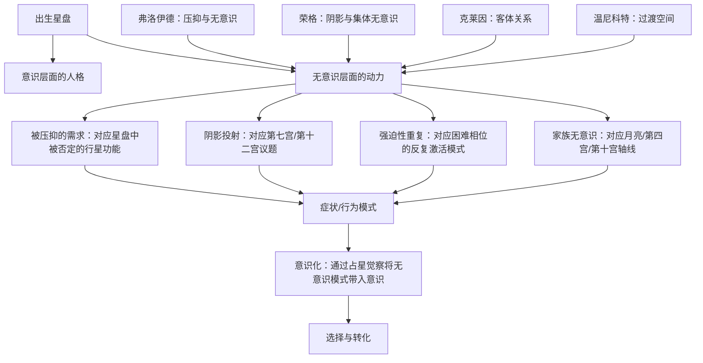

## 一、学科坐标定位

> [!info] 学科交叉位置
> 本书属于==伦敦心理占星学中心==（Centre for Psychological Astrology）系列研讨会记录，位于==深度心理学==（精神分析+荣格分析心理学）与==占星学==的深层交汇处。

丽兹·格林和霍华德·萨司波塔斯是伦敦心理占星学中心的两位核心导师。格林的强项是荣格分析心理学和神话学，萨司波塔斯的强项是人本主义心理学和占星学的实践应用。两人的合作产生了一种互补效应：格林提供理论深度，萨司波塔斯提供实践温度。

本书的核心议题是：==无意识==如何通过占星学可见的行星配置来运作？具体来说，出生星盘中的某些配置如何对应个体无意识中的动力模式——包括被压抑的需求、被否认的冲动、未被整合的心理功能，以及弗洛伊德所说的"强迫性重复"（Repetition Compulsion）？

在学科谱系中，本书是格林在[[土星：从新观点看老恶魔]]中建立的心理占星学框架的深化和拓展。如果说《土星》主要借用了荣格的阴影理论，本书则将==弗洛伊德==的无意识动力学、==克莱因==的客体关系理论、以及==温尼科特==的过渡客体理论都纳入了占星学的解释框架。这种理论整合在心理占星学文献中是罕见的。

需要坦诚说明：本书源于研讨会记录，因此文风是对话式和发散式的，不像格林独著的作品那样结构紧凑。这既是它的魅力（保留了思想交锋的现场感），也是它的局限（某些论点的展开不够系统）。

## 二、理论框架地图

本书的理论框架可以概括为四层无意识动力模型：

**第一层：个人无意识的压抑内容。** 星盘中被"否定"的行星功能（比如一个火星被土星严重压制的人，其攻击性和主张性可能被压入无意识）会以扭曲的方式表达——比如被动攻击、身体症状或对攻击性人物的投射。

**第二层：阴影投射。** 你无法接受的自身面向会被投射到他人身上。星盘中的==第七宫==（他人/伴侣）和==第十二宫==（隐藏/无意识）与投射动力特别相关。

**第三层：强迫性重复。** 星盘中的困难相位（特别是涉及外行星的紧张相位）对应一种无意识的"剧本"，个体在不自觉中反复上演这个剧本——反复吸引同类型的困境，直到模式被意识化。

**第四层：家族无意识。** ==月亮==、==第四宫==（家庭根基）和==第十宫==（父母形象/社会角色）的配置揭示了家族中代际传递的无意识模式——你的某些心理困境可能不是你"个人的"，而是从家族系统中继承的。

## 三、逐章深度拆解

### 第一部分：什么是无意识？——占星学视角

> [!note] DIKW四层提炼
> - **Data**：弗洛伊德将无意识定义为被意识排斥的心理内容；荣格将其扩展为包含个人无意识和集体无意识两个层面
> - **Information**：格林在书中提出，出生星盘本身就是一张"无意识地图"——你不可能同时意识到星盘中所有行星的能量，那些你意识不到的部分就构成了你的无意识
> - **Knowledge**：从占星学角度看，无意识不是一个固定的"地方"，而是一个动态的过程——今天是无意识的东西，明天可以被意识化；今天你以为完全理解的东西，明天可能显示出无意识的面向
> - **Wisdom**：自我认识是一个永无终点的过程。星盘是一个比你的意识更大的整体——你永远不可能"完全"意识到星盘的全部含义

**费曼式解读：** 想象你的星盘是一幅巨大的画，而你的意识是一束手电筒光。你只能照亮画的一部分——那就是你意识到的自己。手电筒没照到的部分（无意识）并没有消失，它仍然在那里，仍然影响着你——只是你看不见它。

格林和萨司波塔斯提出了一个关键的操作性洞见：==你在星盘中最容易忽视或否定的部分，往往就是你最重要的无意识动力所在==。比如，一个太阳在白羊座但火星被土星严重压制的人，可能完全不认同自己的攻击性和竞争需求——他"意识"中的自己是和善的、不争的。但他的攻击性并没有消失，它只是进入了无意识，然后以扭曲的方式表达：可能是对攻击性他人的强烈反感（投射），可能是莫名的愤怒爆发（压抑失败），也可能是慢性的身体紧张（躯体化）。

**反脆弱验证：** 格林将星盘等同于"无意识地图"的做法，理论上是优雅的，但在操作层面面临一个困难：如何确定星盘中哪些部分是"无意识的"？如果这个判断依赖于占星师的主观解读，那么"无意识"可能变成一个不可证伪的万能解释——任何不符合预期的行为都可以被归因于"无意识的另一面"。格林在书中对此有所讨论，但解决方案不够明确。

**类比迁移：** 格林将星盘视为意识与无意识的全景图的做法，类似于精神分析中将梦境视为无意识的"皇家大道"——两者都是将一种象征性的材料（梦/星盘）用作通向无意识的窗口。区别在于梦是个体自己产生的，而星盘是外在天文数据，这使得占星学的"无意识窗口"比梦更具争议性。

### 第二部分：压抑与星盘中的困难相位

> [!note] DIKW四层提炼
> - **Data**：星盘中的困难相位（主要是四分相90度和对冲180度）传统上被视为"紧张"或"挑战"，特别是涉及土星、天王星、海王星、冥王星的困难相位
> - **Information**：格林和萨司波塔斯将这些困难相位解读为"内在冲突的结构图"——两颗行星代表的心理需求相互矛盾，个体倾向于认同其中一方而压抑另一方
> - **Knowledge**：被压抑的一方不会消失，它会以三种方式"回来"：投射到外在关系中、通过身体症状表达、或在行运触发时爆发性地显现
> - **Wisdom**：困难相位不是"坏配置"，而是内在对话的邀请——两种看似矛盾的需求需要找到共存的方式，而非让一方消灭另一方

**费曼式解读：** 以==金星四分冥王星==为例。金星代表你对爱、和谐、美好关系的需求。冥王星代表深层的权力、控制、占有和转化的冲动。当这两者形成四分相（90度紧张角度）时，你内在有一种冲突："我想要甜蜜和谐的爱"（金星）vs."我想要深入到底、掌控一切的爱"（冥王星）。

大多数人会选择认同其中一方。如果你认同金星而压抑冥王星，你可能表现为一个追求美好和谐关系的人，但在关系中反复"遇到"控制型的伴侣（冥王星被投射到了伴侣身上）。如果你认同冥王星而压抑金星，你可能表现为一个在关系中追求绝对控制的人，但内心深处极度渴望温柔和接纳。

格林的核心建议是：不要选择站在任何一方，而是学会==同时==容纳两种需求——既要温柔也要深度，既要和谐也要真实。这正是荣格所说的"超越功能"（Transcendent Function）——在对立面之间找到一个新的、更高层面的综合。

**反脆弱验证：** 格林对困难相位的心理学解读非常具有深度，但也需注意：同一个金星-冥王星四分相在不同人身上的表现可能差异极大。格林用"意识水平"来解释这种差异，但"意识水平"本身是一个难以独立测量的变量。

**类比迁移：** 格林对困难相位的"内在对话"解读，与格式塔心理治疗中的"空椅技术"（Empty Chair Technique）有直接对应——让冲突的两个内在声音各自"说话"，然后寻找整合。

### 第三部分：投射与关系——第七宫和第十二宫

> [!note] DIKW四层提炼
> - **Data**：第七宫在占星学中代表伴侣、关系和"他者"；第十二宫代表隐藏、无意识和"自我撤销"
> - **Information**：格林论证：第七宫中的行星往往代表你倾向于在伴侣身上"寻找"而非在自身"发展"的特质；第十二宫中的行星代表你几乎完全否认的自身面向
> - **Knowledge**：关系问题的深层根源往往不在于"找错了人"，而在于你将自身未整合的心理功能投射到伴侣身上，然后要求伴侣"替你"活出那部分
> - **Wisdom**：真正的关系成长不是找到完美匹配的人，而是收回你投射到伴侣身上的自身面向，成为一个更完整的个体

**费曼式解读：** 想象你的星盘是一个圆桌，上面坐着所有行星代表的"内在人物"。有些人物你很熟悉（你意识到的自己），有些你不太认识（无意识面向）。第七宫里的"人物"是你最容易投射到伴侣身上的——你不在自己内部认领他们，而是在外部寻找一个能"扮演"他们的人。

比如，第七宫有==火星==的人可能不太认同自己的攻击性和竞争欲。结果是什么？他们经常被吸引到攻击性强的伴侣身上——不是巧合，而是因为他们需要伴侣来"替他们"活出火星。这种安排在一开始可能感觉互补和完整，但最终会出问题——因为你不能永远让别人替你活你自己的一部分。

==第十二宫==的投射更深层。格林将第十二宫描述为"心灵的地下室"——你把最不愿面对的东西都锁在这里。第十二宫的行星代表的功能往往被个体完全否认，它们只有在极端情况下（比如重大的行运触发）才会从地下室"逃出来"，而且通常以令人困惑或恐惧的方式出现。

**反脆弱验证：** 格林关于第七宫和第十二宫的投射理论在临床观察中有强烈共鸣，但也有其局限。最主要的局限是：如何区分"投射"和"真实的关系动力"？如果一个人的伴侣确实具有攻击性，如何判断这是"投射吸引"还是仅仅是偶然？格林的框架倾向于将大部分关系模式都解读为投射，这可能过度简化了关系动力的复杂性。

**类比迁移：** 第七宫和第十二宫的投射理论与客体关系理论中的"投射性认同"（Projective Identification）概念高度相关。投射性认同不仅仅是你"想象"伴侣具有某种特质，而是你通过无意识的互动方式，实际上"诱导"伴侣表现出你所投射的特质。格林在书中隐约触及了这一概念，但没有充分展开。

### 第四部分：强迫性重复——行星模式的"剧本"效应

> [!note] DIKW四层提炼
> - **Data**：弗洛伊德观察到，人们倾向于在不自觉中反复上演相同的痛苦模式——他称之为"强迫性重复"
> - **Information**：格林将星盘中的困难配置（特别是涉及外行星的紧张相位）视为"无意识剧本"的结构图——个体不自觉地反复创造触发这些配置的外在情境
> - **Knowledge**：强迫性重复的功能不是"惩罚"，而是无意识试图通过重新创造原始困境来获得"这次不同的结局"——一种笨拙但真诚的自我疗愈尝试
> - **Wisdom**：打破强迫性重复的关键不是"避免"困难情境，而是在下一次重复发生时带着更多的意识进入它——意识本身就是转化的力量

**费曼式解读：** 想象你小时候经历了一种特定的痛苦模式——比如被一个你信任的人背叛。你的无意识"记住"了这个模式，但它不像意识那样"回忆"——它通过"重新创造"来"记住"。所以你成年后，不自觉地反复选择可能背叛你的人，反复进入可能被背叛的情境。

这看起来像是自毁行为，但格林和萨司波塔斯提出了一种更同情的解读：无意识在试图"重修"那段历史。它反复创造类似的情境，希望"这一次"你能处理得不同——能够设立边界、能够提前识别危险信号、或能够在受伤后更好地恢复。问题是，如果这个过程完全在无意识中运行，你只是在盲目地重复而没有学到任何东西。

星盘在这里的作用是一面"镜子"——它让你看到你的"剧本"的结构。当你能够命名自己的剧本（"啊，这是我的月亮-冥王星四分相的模式——被亲密关系中的权力动态所困"），你就从被剧本控制变为能够有意识地选择如何回应。这就是格林所说的：==意识化（making conscious）本身就是最强大的转化力量==。

**反脆弱验证：** 强迫性重复是精神分析中一个被广泛观察到的临床现象，格林将其与占星学配置对应的做法在理论上有说服力。但操作层面的困难在于：如何从星盘中准确识别哪些配置对应强迫性重复模式？并非所有困难相位都会表现为重复模式，格林对此的区分标准不够明确。

**类比迁移：** 格林对强迫性重复的占星学解读，与认知行为治疗中的"核心信念"（Core Beliefs）概念有结构相似性——两者都认为人有深层的、通常不自觉的模式在驱动行为选择，打破这些模式的关键都是"意识化"（CBT中称为"认知重构"）。

### 第五部分：家族无意识——月亮、第四宫与代际传递

> [!note] DIKW四层提炼
> - **Data**：月亮在占星学中代表母亲、情感安全、早年养育；第四宫代表家庭根基和心理底层；第十宫代表父亲形象和社会角色
> - **Information**：格林论证：月亮和第四宫-第十宫轴线不仅描述你个人的早年经历，也携带了家族系统中代际传递的无意识模式
> - **Knowledge**：你的某些心理困境可能不是你"个人"的——它们可能是从父母甚至祖父母那里无意识地继承的。你在"替"家族系统表达它未完成的主题
> - **Wisdom**：理解自己的心理模式不仅需要向内看，也需要向"后"看——看到你身后的家族脉络。你不是一个孤立的心灵，而是一条心理河流中的一段

**费曼式解读：** 想象你出生在一个家庭里。这个家庭有自己的"情感规则"——有些情绪是被允许表达的，有些是被禁止的。比如，你的祖母经历了战争创伤但从未处理；你的母亲在一个"不许悲伤"的家庭中长大，自己也学会了压抑悲伤；然后你出生了——你的==月亮在天蝎座四分冥王星==——你从小就感受到一种深重的、无法命名的悲伤，但它不完全是"你的"悲伤，它是家族三代人累积的未处理的情感。

格林和萨司波塔斯认为，星盘中月亮相关的配置揭示的正是这种代际传递的情感模式。这不是说行星"导致"了代际传递，而是说行星配置与家族无意识之间存在一种共时性的对应。

**反脆弱验证：** 代际创伤传递是当代精神创伤研究中一个日益受到重视的课题，有初步的实证支持（包括表观遗传学层面的研究）。格林将其与占星学星盘配置做对应的做法在理论上是有趣的，但因果机制不明确——是行星配置"预示"了代际传递，还是两者之间只是一种象征性的平行？

**类比迁移：** 格林的家族无意识理论与系统家庭治疗中的"代际传递"（Intergenerational Transmission）概念、以及海灵格家族系统排列中的"家族纠缠"（Family Entanglement）有直接对应。三种框架都认为个体的心理困境可能根植于家族系统中未完成的主题。

## 四、认知偏差/效应清单

> [!warning] 阅读本书时需警惕的认知偏差

1. **过度病理化偏误**：格林的深度心理学取向可能导致将正常的心理现象过度解读为"无意识冲突"。不是所有困难都有深层无意识根源。

2. **投射概念的滥用**：一旦学会"投射"概念，读者可能将所有人际困难都归因于投射，忽略了真实的外在因素。

3. **确认偏误**：无意识理论特别容易受确认偏误影响——因为"无意识"的内容按定义是你不知道的，所以几乎任何解读都无法被个体直接否定。

4. **叙事引力偏误**：精彩的心理学叙事（如"强迫性重复"）可能让读者过度将自己的经历塞入这些叙事框架中。

5. **基本归因错误**：将所有行为模式归因于个人的无意识动力，忽略情境和社会结构因素。

6. **回溯偏误（Retrospective Bias）**：回顾性地将过去的经历与星盘配置"匹配"是极为容易的，但这种匹配的预测价值有限。

7. **权威效应**：格林和萨司波塔斯在心理占星学领域的权威地位可能抑制了读者的批判性思考。

8. **过度决定论偏误**：将星盘视为无意识的"完整地图"可能导致一种新的决定论——从天文决定论变成了心理-天文决定论。

## 五、自我诊断工具

> [!tip] 你对无意识动力学的理解深度

- [ ] 你能否区分弗洛伊德的"个人无意识"和荣格的"集体无意识"在占星学中的不同对应方式？
- [ ] 你能否举例说明星盘中一个困难相位如何通过"投射"和"强迫性重复"两种不同的无意识机制运作？
- [ ] 你能否识别你自己星盘中可能对应"投射"倾向的配置（第七宫/第十二宫的行星）？
- [ ] 你能否解释"意识化本身就是转化力量"这一命题的心理学逻辑？
- [ ] 你能否对格林的"星盘即无意识地图"这一前提提出至少一个认识论质疑？

**深度自检：** 阅读本书后，你是否开始在生活中"看到"无意识动力的运作？如果是，请同时问自己：你"看到"的是真实的无意识模式，还是你将本书的理论框架"投射"到了自己的生活上？理论的解释力和理论的正确性是两回事。

## 六、批判性审视

> [!danger] 本书的局限与可商榷之处

**优势：**
- 在心理占星学文献中罕见地整合了弗洛伊德、荣格和客体关系理论
- 对投射、强迫性重复和代际传递的占星学解读具有极强的临床启发性
- 研讨会对话形式保留了思想交锋的生动性

**局限：**

1. **不可证伪性的加剧。** 当"无意识"被引入占星学解读时，理论的不可证伪性显著增加——因为无意识内容按定义是你不知道的，所以几乎任何占星解读都可以被"保护"在"你没意识到但它确实在运作"的说辞下。

2. **研讨会形式的散漫。** 对话式文风虽然生动，但导致某些重要论点没有被充分展开和论证，读者需要自己重构论证链条。

3. **心理学理论的简化使用。** 格林将弗洛伊德、荣格、克莱因、温尼科特的理论并行使用，但对这些理论之间的内在矛盾没有给予足够的关注。这些理论在学术心理学中是互相竞争的范式，不能简单地"混搭"使用。

4. **缺乏对文化因素的系统考虑。** 本书主要基于西方中产阶级的心理学框架和案例，对文化差异的影响关注不足。

5. **实证支持的缺失。** 与格林的其他著作一样，本书的论证完全基于理论推演和临床印象，没有系统的实证研究支持。

## 七、行动改变指南

> [!success] 基于本书的实践建议

1. **无意识面向审查：** 查看你星盘中哪些行星功能你最不认同。那些你觉得"不像我"的行星特质，可能正是你最重要的无意识内容。

2. **第七宫投射检视：** 查看你第七宫中的行星。你的伴侣身上是否反复出现这些行星的特质？如果是，尝试在自身内部发展这些特质。

3. **重复模式日志：** 连续三个月记录你在关系或工作中遇到的"又来了"的感觉。这些重复的困境可能对应你星盘中的某个困难相位。尝试命名这个模式。

4. **家族情感考古：** 与家人（特别是长辈）交谈，了解家族中曾经发生过但很少被提及的情感事件（失去、创伤、未实现的愿望）。检查这些家族主题是否与你星盘中月亮相关的配置产生共鸣。

5. **意识化练习：** 选择星盘中一个你最排斥的配置，每天花几分钟"与它对话"。不是试图改变它，而是试图理解它在你生活中以什么方式运作。理解本身就是开始转化。

## 八、费曼终极检验

> [!abstract] 如果只用三段话向外行解释这本书

**第一段（是什么）：** 你知道有些行为模式是你无法控制的吗？比如你总是被同一类型的人吸引，或者你总在关系到了某个阶段就逃跑。心理学把这些叫做"无意识模式"——你不知道它们存在，但它们在暗中驱动你的选择。格林和萨司波塔斯这本书探讨的是：占星学能不能帮你"看见"这些隐藏的模式？

**第二段（核心论点）：** 他们的回答是肯定的。出生星盘中的某些配置——特别是紧张的行星相位、第七宫和第十二宫的行星——可以被解读为你无意识动力的"结构图"。比如，你第七宫有火星但你从不认为自己有攻击性，结果你总是遇到攻击性很强的伴侣——因为你把自己不接受的攻击性"投射"到了伴侣身上。这本书最核心的信念是：==当你能命名你的无意识模式，它就开始失去对你的控制力==。意识化本身就是最强大的转化力量。

**第三段（为什么重要）：** 这本书的价值在于将深度心理学的洞见与占星学的象征系统做了一次深层次的整合。对于已经熟悉占星学的读者，它提供了一个远比"水星在处女座所以你注重细节"更深刻的理解层次。当然，它也有明显的局限——无意识理论与占星学的结合大大增加了理论的不可证伪性，而且作者们对不同心理学流派的"混搭"使用也值得更严格的审视。但作为一种自我理解的工具，"你的星盘不仅描述你知道的自己，也描述你不知道的自己"这个洞见，具有独特的实践价值。
