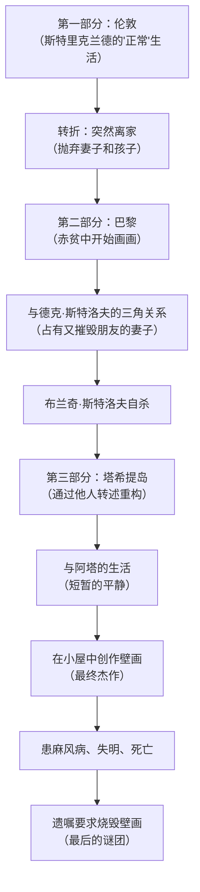
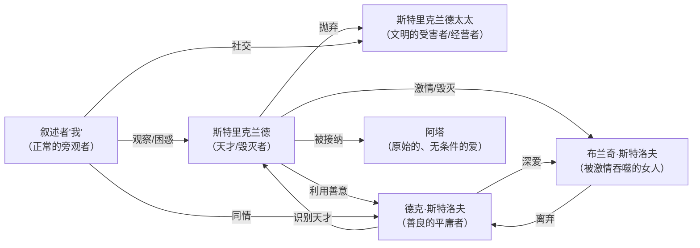
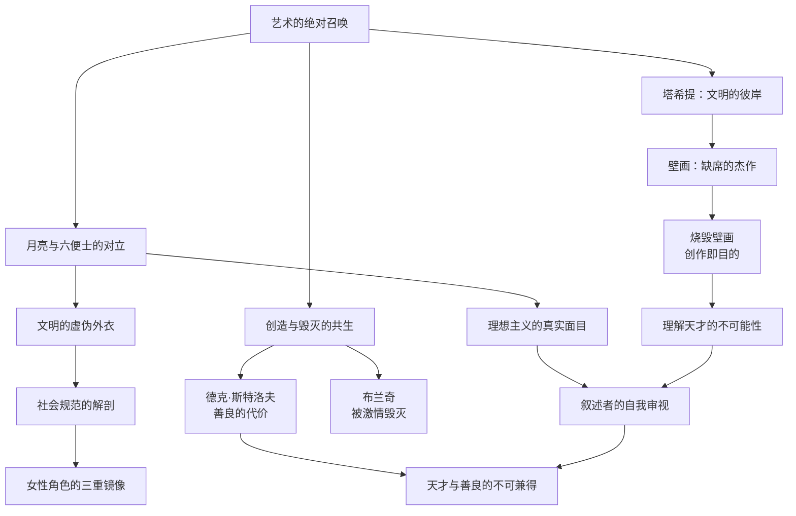

# 《月亮与六便士》深度拆解

## 一、文学坐标定位

> [!abstract] 速览
> 《月亮与六便士》（*The Moon and Sixpence*）是英国作家毛姆于1919年出版的长篇小说。小说以第一人称叙述者的视角，讲述了伦敦证券经纪人查尔斯·斯特里克兰德在四十岁时突然抛妻弃子、远赴巴黎学画，最终流落塔希提岛，在贫病交加中完成了自己的杰作，死后作品被世人奉为天才之作的故事。

毛姆的创作灵感来源于法国后印象派画家保罗·高更的生平。高更同样是在中年放弃了证券经纪人的稳定生活，前往巴黎和南太平洋追求绘画。但毛姆反复强调，斯特里克兰德不是高更——他只是借用了高更人生的某些外部框架，将其改造为一个关于==艺术的绝对召唤与人类道德之间根本冲突==的寓言。

在世界文学脉络中，这部小说可以与[[《悉达多》]]中的精神求道、陀思妥耶夫斯基笔下被魔鬼驱使的人物、以及托尔斯泰对"何为真正的生活"的追问形成对话。但毛姆的独特之处在于：他不做道德判断。他既不赞美斯特里克兰德的天才，也不谴责他的残忍——他只是==呈现==，然后把判断的权利交给你。

本书标题本身就是一个隐喻：==月亮代表崇高的理想与艺术追求，六便士代表世俗的生活与物质现实==。大多数人低头捡六便士，少数人抬头追月亮——但毛姆的追问远比这个二元对立深刻得多。

---

## 二、叙事结构解析

> [!note] 不可靠叙述者的精密设计
> 毛姆选择了一个极为精妙的叙事策略：让一个平庸的、具有正常道德感的"我"来讲述一个不平庸的、超越道德的天才的故事。

小说的叙事结构不是线性的时间推进，而是一种==拼图式的人物重构==。叙述者"我"是一位年轻作家，他在伦敦社交圈中认识了斯特里克兰德夫妇，后来在巴黎重遇已经抛弃家庭的斯特里克兰德，最终通过各种间接信息拼凑出斯特里克兰德在塔希提岛的最后岁月。

这一结构设计至少有四重功能：

1. **距离感的控制**：叙述者从未真正理解斯特里克兰德，他甚至承认自己不理解。这种坦诚的不理解反而比全知叙述更有说服力——你感觉自己是在和叙述者一起困惑，而不是被一个全知的作者灌输结论。

2. **判断的悬置**：叙述者是一个有教养、有同情心、遵守道德规范的人。他对斯特里克兰德的行为感到震惊、反感，但又不得不承认其作品中有一种令人敬畏的力量。这种矛盾心理恰恰是毛姆要传递给你的。

3. **信息的不完整性**：叙述者只掌握片段信息，他没有见证斯特里克兰德在塔希提岛的大部分生活，只能通过布吕诺船长等人的转述来拼凑。这使得斯特里克兰德始终保持着一层==神秘感==——你永远无法完全理解他，就像你永远无法完全理解天才。

4. **反讽的空间**：叙述者的"正常"与斯特里克兰德的"异常"形成了持续的张力。叙述者代表的是社会共识、道德常识、中产阶级的价值观——而斯特里克兰德的存在，是对这一切的根本否定。

**黄金圈分析**：
- **Why**（为什么用这种结构）：毛姆需要一种叙事方式，让读者既能近距离观察天才，又无法完全理解天才。全知叙述会使斯特里克兰德变得可解释、可驯服——而毛姆要的恰恰是==不可驯服==
- **How**（如何实现）：通过一个"正常人"叙述者的视角、拼图式的信息拼接、多个转述者的声音叠加
- **What**（具体呈现）：三个地理空间（伦敦、巴黎、塔希提）对应三个人生阶段，信息的可靠性从第一部分的直接观察逐渐退化到第三部分的间接转述

==核心命题：叙事结构本身就是主题的一部分——对天才的理解永远是间接的、不完整的、充满误读的。==

---

## 三、主题与意象网络

### 主题一：「艺术的绝对召唤——当创造欲吞噬一切」

> [!tip] 黄金圈拆解
> - **Why**：毛姆要探讨一个极端问题——如果艺术的召唤是绝对的、不可抗拒的，那么它是否可以压倒一切道德义务？一个人有没有权利为了艺术毁掉所有人（包括自己）的生活？
> - **How**：通过塑造一个极端人物来逼迫你面对这个问题。斯特里克兰德不是一个"在艺术和生活之间寻找平衡"的温和艺术家——他是一个被艺术完全占据、对其他一切都丧失感知能力的人。
> - **What**：一个四十岁的男人抛弃一切去画画，不是因为他想成名，不是因为他不爱家人，而是因为他"不得不画"——就像一个人不得不呼吸。

**文本细读**：

斯特里克兰德对绘画的态度，与通常意义上的"追求理想"有本质区别。通常我们说一个人追求理想，意味着他做出了一个理性选择——权衡利弊之后决定走一条更有价值的路。但斯特里克兰德的情况不是这样的。当叙述者在巴黎追问他为什么离家时，他没有给出任何崇高的理由，他只说了一句话：==「我必须画画。」==

这句话的关键词不是"画画"，而是"必须"。这不是选择，而是驱迫。斯特里克兰德被一种他自己也无法解释的力量驱使着。他对画画没有浪漫化的想象——他不享受画画的过程，他不在乎画出来的东西好不好，他甚至不在乎别人是否看到他的画。他只是被一种无法抗拒的内在力量推着往前走。

毛姆通过叙述者的困惑传递了一个深刻的观察：==真正的创造欲不是一种爱好、一种追求、一种选择——它是一种疾病，一种附身，一种宿命==。你不是决定去画画，你是被画画抓住了。正如叙述者反复感叹的，斯特里克兰德不像一个追求艺术的人，更像一个被恶魔附身的人——他不是在走向什么，他是在被什么东西拖着走。

**概念网络**：「创造欲」在本书中与「毁灭」形成了不可分割的共生关系。斯特里克兰德的创造不是在现有生活之上叠加一层新内容，而是要把现有生活全部推倒——推倒家庭、推倒社会关系、推倒道德约束、推倒身体健康——然后在废墟上建造自己的东西。这暗示了一个令人不安的可能性：==真正伟大的创造，可能必然伴随着巨大的毁灭。==

**苏格拉底追问**：如果斯特里克兰德的画最终被证明是平庸的，他的所作所为是否就变成了不可原谅的？换句话说，"天才"这个事后认定的标签，是否构成了对他残忍行为的道德辩护？毛姆巧妙地拒绝了这种辩护——叙述者在不知道斯特里克兰德最终作品质量的情况下就已经感受到了他身上那种不可抗拒的力量。也就是说，==即使他的画不好，那种驱迫力本身也是真实的==。这就把问题从"天才是否有特权"转移到了"人是否有权利服从自己最深处的召唤，即使这种服从会伤害他人"。

**费曼式解读**：想象一个人发现自己的身体里长了一棵树。这棵树不断生长，撑破他的皮肤，刺穿他的骨骼。他可以选择做手术砍掉它——但如果砍掉，他就死了，因为这棵树已经和他的生命系统缠绕在一起。斯特里克兰德的创造欲就是这棵树。它不是他选择种下的，它自己长出来了。它在毁灭他——但它也是他。

---

### 主题二：「月亮与六便士——理想主义的真实面目」

> [!tip] 黄金圈拆解
> - **Why**：毛姆要颠覆你对"追求理想"的浪漫化想象。大多数人以为追求理想是崇高的、美的、值得赞美的。毛姆告诉你：真正的理想主义可能是丑陋的、残忍的、令人厌恶的。
> - **How**：让追求理想的人成为一个道德上几乎不可接受的角色——他不仅抛妻弃子，还霸占朋友的妻子、导致她的自杀、对所有人冷漠至极。
> - **What**：月亮（理想）不是一个温柔的意象，它是冰冷的、遥远的、不关心你的死活的。

**文本细读**：

标题"月亮与六便士"来自一个评论者对毛姆另一部作品的批评——说主人公"像所有仰望月亮的人一样，看不见脚下的六便士"。毛姆借用了这个意象，但赋予了它远比字面意思更深的含义。

通常的理解是：月亮 = 崇高的理想，六便士 = 庸碌的现实。追月亮的人是英雄，捡六便士的人是凡人。但毛姆的小说瓦解了这个简单对立。在斯特里克兰德身上，追月亮的行为并不崇高——它是暴力的、自私的、对他人造成巨大伤害的。而六便士的生活（斯特里克兰德太太在伦敦的体面生活、德克·斯特洛夫的温馨小家）也并不卑微——它包含了真实的爱、善意和人际温暖。

==毛姆真正的追问不是"你选择月亮还是六便士"，而是"你凭什么认为选择月亮就比选择六便士更高尚"==。

斯特里克兰德太太在丈夫离去后，表面上维持着受伤的尊严，实际上很快适应了新生活，甚至在社交圈中利用"被天才抛弃的女人"这个身份获得了某种特殊地位。叙述者对此有一个尖刻的观察：她的痛苦是真实的，但她对痛苦的展示是经过精心计算的。这个细节说明了什么？==即使是看起来最世俗的人，也在用自己的方式经营着某种"表演"——只不过她的表演符合社会期待，而斯特里克兰德的表演打破了社会期待。==

**概念网络**：「月亮」与「六便士」不是二选一的关系，而是一种==互相定义==的关系。没有六便士的存在，月亮就失去了它的超越性——月亮之所以令人向往，恰恰是因为六便士构成了它的反面。而六便士之所以显得卑微，也是因为月亮的存在提供了参照。毛姆的高明在于：他让你看到两者之间的张力，却不帮你做选择。

**苏格拉底追问**：追求月亮是否需要牺牲六便士？换个方式问：有没有可能既追月亮又不伤害他人？小说给出的暗示是否定的——至少对斯特里克兰德这种极端类型来说是否定的。但这是否意味着所有伟大的艺术都需要以人性为代价？毛姆没有给出定论，但他通过德克·斯特洛夫的角色提供了一个反例：斯特洛夫是一个善良到极点的人，也是一个真正热爱艺术的人，但他自己的画却是平庸的。这是否暗示，==善良和天才之间存在某种不可调和的矛盾==？

---

### 主题三：「文明的虚伪外衣——社会规范的解剖」

> [!tip] 黄金圈拆解
> - **Why**：毛姆是一个深刻的社会观察者，他要揭示维多利亚式英国社会那层体面外衣下的虚伪、算计和自欺。
> - **How**：通过斯特里克兰德的"出走"作为一个破坏性事件，暴露周围所有人在面对这一事件时的真实反应——这些反应往往与他们声称的价值观相矛盾。
> - **What**：斯特里克兰德太太的"体面痛苦"、社交圈的八卦与审判、叙述者自己的道德困惑。

**文本细读**：

小说开头用了相当长的篇幅描写伦敦的文学社交圈。斯特里克兰德太太热衷于举办文学沙龙，在家中招待作家和艺术家。叙述者以微妙的讽刺笔调描写这些聚会：太太们谈论艺术和文学，但她们真正关心的不是艺术本身，而是与艺术家交往带来的社会地位。

当斯特里克兰德离家出走的消息传开后，社交圈的反应极具讽刺性。人们首先假设他是为了一个女人离开的——因为在他们的认知框架中，一个男人抛弃家庭只有一个理由。当得知他是为了画画时，大多数人的反应不是理解或同情，而是==困惑和恼怒==——这个行为超出了他们的认知框架，因此他们本能地将其归类为"疯了"。

毛姆通过这些社交场景揭示了一个深层的社会机制：==社会不是通过法律来约束人的，而是通过"可理解性"来约束人的==。你可以做任何坏事，只要这些坏事在社会的认知框架内（出轨、贪财、争权），人们就能"理解"你，从而在某种程度上"接受"你。但如果你做了一件他们完全无法理解的事（一个四十岁的证券经纪人突然去画画），你就成了一种威胁——不是因为你的行为本身多么可怕，而是因为你动摇了他们赖以安身的那套解释系统。

**概念网络**：「文明的虚伪」与「艺术的真实」构成了全书最核心的对比之一。伦敦社交圈代表的是一种精致的伪善——人们假装关心艺术，实际上关心的是社会地位；假装有道德，实际上道德只是维护体面的工具。斯特里克兰德的可怕之处不在于他不道德，而在于他==不演戏==。他不假装爱妻子，不假装关心朋友，不假装对社会规范有任何尊重。在一个人人都在演戏的社会里，一个不演戏的人是最大的威胁。

**苏格拉底追问**：斯特里克兰德的"真实"是否比社会的"虚伪"更有价值？这个问题没有简单答案。社会的虚伪是有功能的——它维持了人与人之间的基本信任、合作和温情。如果每个人都像斯特里克兰德一样"真实"，社会将无法运转。毛姆的立场可能更接近于：==虚伪和真实都是人类生存的策略，没有哪一个天然地更高级==。

---

### 主题四：「女性角色的三重镜像」

> [!tip] 黄金圈拆解
> - **Why**：毛姆通过三个主要女性角色——斯特里克兰德太太、布兰奇·斯特洛夫、阿塔——展示了女性与男性天才之间三种截然不同的关系模式，同时也对"爱情"这个概念进行了多层次的解剖。
> - **How**：三个女性形成了一个光谱——从最"文明"的到最"原始"的，从最注重表面的到最接近本能的。
> - **What**：斯特里克兰德太太代表社会化的爱（爱的是社会身份），布兰奇代表被激情摧毁的爱，阿塔代表无条件的、近乎动物性的接纳。

**文本细读**：

**斯特里克兰德太太**是毛姆笔下最复杂的"普通人"之一。她体面、聪明、善于社交，是一个合格的中产阶级妻子。当丈夫离去后，她的反应经历了几个阶段：震惊、屈辱、自怜，然后是一种精明的自我重新包装。叙述者注意到，她很快学会了用"被天才丈夫抛弃的女人"这个身份来获取社会同情。这不是纯粹的虚伪——她的痛苦是真实的——但她确实在痛苦中找到了一种==社会资本==。

毛姆对斯特里克兰德太太的描写中有一句极具穿透力的话：叙述者说她是那种==永远不会原谅伤害她的人的女人——不是因为她恨他，而是因为原谅意味着承认自己不再受伤，那她就失去了受害者的身份==。

**布兰奇·斯特洛夫**是全书最悲剧性的角色。她是德克·斯特洛夫的妻子，一个曾经被人伤害过的女人，在斯特洛夫的温柔保护下重建了生活。但当斯特里克兰德出现在她的生活中时，她被一种不可抗拒的力量吸引了——不是因为斯特里克兰德爱她（他对她毫无感情），而是因为他身上有一种==毁灭性的力量==，这种力量对某些女性有致命的吸引力。布兰奇最终离开了善良的丈夫，投向了冷酷的斯特里克兰德，然后在被斯特里克兰德抛弃后服毒自杀。

毛姆对布兰奇命运的处理引发了一个深刻的问题：==为什么一个理性的人会被一个明显会摧毁自己的人吸引？==毛姆暗示，这与理性无关——它是一种本能层面的反应，一种对原始力量的臣服。布兰奇与斯特洛夫在一起时是安全的，但安全并不等于活着。斯特里克兰德让她感受到了某种她在安全中从未体验过的东西——哪怕那个东西最终杀死了她。

**阿塔**是塔希提岛上的土著女子，她与斯特里克兰德的关系是全书中唯一没有被摧毁的男女关系。阿塔不要求斯特里克兰德爱她、理解她或承诺什么。她只是在他身边，为他提供食物和安静，让他画画。当斯特里克兰德患了麻风病后，阿塔没有离开，她照顾他直到他死去。

毛姆对阿塔的描写有一种矛盾的色彩：一方面，阿塔的无条件接纳让斯特里克兰德第一次获得了创作的平静；另一方面，这种描写也带有殖民时代的"高贵野蛮人"色彩——好像只有"未开化"的女性才能接受天才的存在。

**概念网络**：三个女性角色构成了一个递进序列。斯特里克兰德太太用社会规范来框定爱，布兰奇用激情来定义爱，阿塔则取消了对爱的定义——她不分析、不追问、不期待，她只是在那里。这个序列暗示了毛姆对"爱"的理解：==越是被社会化、被语言化、被概念化的爱，越是脆弱和虚假。最真实的爱可能是无法用语言表达的。==

---

### 主题五：「德克·斯特洛夫——善良的代价」

> [!tip] 黄金圈拆解
> - **Why**：毛姆需要一个角色来代表"普通人的善良"在天才面前的无力与尊严。斯特洛夫是全书中最让人心疼的角色，因为他拥有所有"正确"的品质——善良、慷慨、忠诚、真正热爱艺术——但这些品质没有保护他，反而成了他被利用的原因。
> - **How**：让斯特洛夫一步一步地被斯特里克兰德摧毁——先是他的善意被利用（收留生病的斯特里克兰德），然后是他的妻子被夺走，最后是他的尊严被碾碎。
> - **What**：一个善良的平庸画家，以他能给予的最大善意对待一个天才，但天才对他的善意无动于衷、甚至加以利用。

**文本细读**：

斯特洛夫在小说中的处境是这样的：他是一个在巴黎画画的荷兰画家，自己的画技平庸，但他有一双真正能识别天才的眼睛。他是第一个认识到斯特里克兰德是天才的人。这个设定本身就极具讽刺性——==一个没有天才的人，比任何人都更能辨认天才==。

当斯特里克兰德在巴黎贫病交加时，是斯特洛夫不顾妻子的反对，把斯特里克兰德接到自己家中照顾。他为什么要这么做？不是因为他愚蠢，不是因为他看不到风险，而是因为他真正相信天才是人类最宝贵的东西——他不能眼看着一个天才死在阁楼上。

这是全书最残忍的讽刺之一：==斯特洛夫对天才的信仰，最终毁灭了他自己的生活==。他救活了斯特里克兰德，但斯特里克兰德夺走了他的妻子。他爱艺术胜过爱自己，但艺术回报给他的是毁灭。

布兰奇离开后，斯特洛夫做了一件让叙述者和读者都感到震撼的事：他请求布兰奇留在这个家里，自己搬出去。也就是说，他宁愿放弃自己的家，也不愿让布兰奇流落街头——即使她是因为另一个男人才离开他的。这种善良已经超越了尊严的范畴，变成了某种令人难以理解的东西。

毛姆没有嘲笑斯特洛夫的善良。他对斯特洛夫的描写中有一种痛惜——你能感觉到毛姆本人也被斯特洛夫的善良打动了，但他同时清楚地知道：==在这个世界上，善良不是一种保护，它是一种暴露==。善良的人把自己打开了，而打开自己的人最容易受伤。

**概念网络**：斯特洛夫与斯特里克兰德构成了全书最核心的对位关系。斯特里克兰德有天才但没有善良，斯特洛夫有善良但没有天才。毛姆的残酷之处在于：==世界记住了斯特里克兰德，遗忘了斯特洛夫==。善良不会进入艺术史，天才的冷酷反而成了传奇的一部分。

**苏格拉底追问**：斯特洛夫的善良是否有一种自我毁灭的倾向？他是否在潜意识层面需要被利用、被伤害？毛姆没有做精神分析式的解读，但他暗示了一种可能性：斯特洛夫的善良中有一种对自身平庸的补偿——他无法通过自己的画作参与伟大，所以他通过帮助天才来间接参与伟大。这使他的善良变得更加复杂——它不是纯粹的利他，它里面有一丝对自身不足的弥补。

---

### 主题六：「塔希提——文明的彼岸与最终的创作」

> [!tip] 黄金圈拆解
> - **Why**：毛姆需要一个地点来象征斯特里克兰德的精神归宿——一个远离欧洲文明、接近原始生命力的地方。塔希提岛不仅是一个地理空间，它是斯特里克兰德整个生命逻辑的终点。
> - **How**：通过布吕诺船长等人的回忆和叙述来重构斯特里克兰德在岛上的最后岁月，让读者看到他在文明之外找到了什么。
> - **What**：斯特里克兰德在塔希提岛获得了他在伦敦和巴黎都无法获得的东西——一种与自然和原始生命力直接接触的状态，在这种状态中他完成了自己的终极作品。

**文本细读**：

斯特里克兰德抵达塔希提岛后，他的生活方式发生了根本变化。在伦敦，他是一个被社会规范束缚的证券经纪人；在巴黎，他是一个在文明社会边缘挣扎的穷画家；在塔希提，他终于找到了一种与他的内在需求匹配的外在环境。

塔希提岛提供了几样关键的东西：第一，==物质需求的极简化==——在热带岛屿上，你不需要太多东西就能生存，这意味着你不需要为生计工作太多时间；第二，==社会规范的松弛==——岛上的人不用欧洲的标准来评判行为，一个行为怪异的白人画家不会遭到道德审判；第三，==自然的压倒性在场==——热带的色彩、光线、植被、大海，这些自然元素为斯特里克兰德的绘画提供了直接的感官素材。

斯特里克兰德的最后杰作——画在小屋墙壁上的壁画——是全书最神秘、最令人震撼的意象。布吕诺船长描述看到壁画时的感受：他说自己被一种原始的、令人恐惧的美所震撼，好像看到了创世的瞬间。但叙述者自己从未见过这幅壁画——它在斯特里克兰德死后被阿塔按照他的遗嘱烧毁了。

**这是一个极其重要的叙事设计**：毛姆让斯特里克兰德的终极作品永远缺席。你永远无法看到那幅壁画，你只能通过别人的描述来想象它。这与整本书的认识论结构是一致的——==你永远无法直接接触天才的本质，你只能通过间接的、不完整的、经过他人意识过滤的信息来接近它==。

**概念网络**：塔希提与伦敦构成了小说的两极。伦敦代表文明、秩序、社会规范、虚伪、安全；塔希提代表原始、混沌、本能、真实、危险。斯特里克兰德从伦敦到塔希提的旅程，也是从文明到原始、从社会到自然、从语言到感官的旅程。但毛姆并没有简单地美化原始——斯特里克兰德在塔希提患上了麻风病，失明，在痛苦中死去。==回归原始不是田园诗，它是一种代价极高的选择==。

**苏格拉底追问**：斯特里克兰德为什么要求烧毁壁画？这是全书最大的谜团之一。几种可能的解释：（1）壁画是画给自己的，不是画给观众的，一旦完成，它的使命就结束了；（2）他知道壁画一旦进入"艺术市场"，就会被文明社会的评价体系所驯服——变成博物馆里的展品、拍卖行的商品——这是他所不能接受的；（3）创造本身就是目的，作品只是创造过程的副产品，保留副产品没有意义。无论哪种解释，烧毁壁画这个行为都指向了一个核心命题：==对斯特里克兰德来说，重要的从来不是作品，而是创作行为本身==。

---

### 主题七：「叙述者——普通人的自我审视」

> [!tip] 黄金圈拆解
> - **Why**：叙述者"我"不仅是一个叙事功能，他本身就是一个主题性角色。通过他的反应、困惑和自我怀疑，毛姆展示了一个"正常人"面对天才时的复杂心理状态。
> - **How**：让叙述者不断地在道德判断和审美敬畏之间摇摆，让他成为读者的替身——你通过他的眼睛看斯特里克兰德，同时也在看他（和你自己）。
> - **What**：一个有教养、有同理心、但最终选择了"六便士"的人，诚实地记录了自己与"月亮"的相遇。

**文本细读**：

叙述者是全书中最容易被忽视的角色，但他实际上承载了毛姆最深层的自我反思。叙述者是一个年轻的作家——这与毛姆自己的身份重合。他有足够的文学敏感度来感知斯特里克兰德身上的不凡，但他没有足够的勇气去做同样的事。他选择了一条可以理解的、符合社会期待的人生道路——做一个成功的作家、一个得体的社会成员。

叙述者对斯特里克兰德的态度始终是矛盾的。从道德上，他厌恶斯特里克兰德的冷酷和自私。从审美上，他被斯特里克兰德身上那种不可驯服的力量所吸引。这种矛盾从未被解决——直到小说结尾，叙述者仍然无法对斯特里克兰德做出一个确定的判断。

毛姆通过叙述者传递了一个核心的自我追问：==你是否因为缺乏勇气而选择了安全的生活？你所谓的"道德感"，是否不过是懦怯的美化？==叙述者从未直接提出这个问题，但这个问题弥漫在整部小说中。每一次他对斯特里克兰德表示道德上的反对，你都能感觉到他内心的另一个声音在说：但你不得不承认，他做了你不敢做的事。

**概念网络**：叙述者与斯特里克兰德构成了"镜像"关系。他们都是与文字/艺术打交道的人，但一个选择了在社会框架内写作，另一个彻底打碎了社会框架去创作。叙述者是"被驯化的创造者"，斯特里克兰德是"野生的创造者"。毛姆通过这组对比追问：==创造力是否需要以社会化为代价？一个完全融入社会的人，还能创造出真正伟大的东西吗？==

---

## 四、人物关系网络

**核心关系动力学**：

斯特里克兰德是整个关系网络的中心——但不是因为他主动建立关系，而是因为他像一个引力场一样不由自主地将人吸入又抛出。他对所有关系的态度都是一样的：==无所谓==。他不爱谁，也不恨谁，他只是不在乎。这种彻底的不在乎反而产生了一种奇特的力量——因为在一个所有人都在乎"别人怎么看我"的世界里，一个完全不在乎的人是令人着迷的。

---

## 五、风格与语言

> [!note] 毛姆的叙事风格
> 毛姆被称为"最会讲故事的作家"，他的语言特征是：清晰、精准、不炫技、暗藏刀锋。

毛姆的写作风格在英国文学中是独特的。与同时代的弗吉尼亚·伍尔夫的意识流或乔伊斯的语言实验相比，毛姆的语言看起来是"保守"的——他使用清晰的句子、传统的叙事结构、可理解的情节。但这种"保守"是有意为之的。毛姆认为，==文学的目标不是展示作者的技巧，而是让读者清楚地看到作者想让他们看到的东西==。

在《月亮与六便士》中，毛姆的语言有几个显著特征：

**1. 讽刺的精确性**

毛姆的讽刺不是夸张的、漫画式的，而是精密的、手术刀式的。比如他描写斯特里克兰德太太时说：她那种文学品味表现在，她总是在某位作家成名之前就发现了他——更准确地说，是在他即将成名的那个时刻发现了他。这一句话就揭示了斯特里克兰德太太的社交策略——她追求的不是文学本身，而是"发现者"的地位。

**2. 格言式的穿插**

毛姆经常在叙述中穿插格言式的观察，这些观察往往偏离当下的情节，指向某种普遍的人性真理。比如他写道：==「一般人都不是他们想要做的那种人，而是他们不得不做的那种人。」==这类句子既是对斯特里克兰德命运的注脚，也是对所有人生存状态的概括。

**3. 坦诚的自限**

叙述者经常承认自己不理解、不确定、可能是错误的。这种自限不是谦虚——它是毛姆认识论立场的体现。他认为，对他人内心世界的任何断言都是傲慢的。==你能描述一个人的行为，但你永远不能声称理解他的动机。==

---

## 六、文学批评多视角

**存在主义视角**：斯特里克兰德可以被视为一个存在主义式的英雄——他通过一个极端的"选择"（抛弃一切去画画）来定义自己的存在。但与萨特或加缪笔下的人物不同，斯特里克兰德的"选择"看起来更像是一种被动的服从——他不是"选择"了画画，而是画画"选择"了他。这使得他的存在主义色彩带有一种宿命论的底色。

**后殖民视角**：小说的第三部分——塔希提岛的叙事——可以从后殖民的角度进行批判性阅读。斯特里克兰德在殖民地找到了他在宗主国找不到的"自由"和"真实"，这种叙事结构隐含着一种殖民主义的想象：==异域是西方人精神救赎的场所，土著是未被文明"污染"的纯真存在==。阿塔的角色尤其值得审视——她的"无条件接纳"是否被过度浪漫化了？她自己的主体性在叙述中几乎完全缺席。

**精神分析视角**：斯特里克兰德的中年出走可以被解读为一次"中年危机"的极端表现——压抑了四十年的本我终于冲破了超我的控制。他对绘画的痴迷具有强迫症的特征，他对人际关系的冷漠具有反社会人格的特征。但精神分析的解读有一个风险：它可能把天才"病理化"，把一种超越常规理解的存在降格为一种可以被诊断和治疗的"病症"。

**女性主义视角**：三个主要女性角色（斯特里克兰德太太、布兰奇、阿塔）可以被解读为男性凝视下的三种女性类型——社交型、激情型、顺从型。她们都是围绕男性主人公定义的，缺乏独立的主体性。布兰奇的自杀尤其引发争议——一个女性因为被男性抛弃而选择死亡，这种叙事是否强化了"女性依附于男性"的刻板印象？

---

## 七、概念关系网络总图

==这张图的核心逻辑是：从「艺术的绝对召唤」出发，向两个方向展开——一个方向是它对外部世界的冲击（毁灭家庭、毁灭善人、毁灭女性），另一个方向是它的内在逻辑最终指向的地方（塔希提、壁画、烧毁壁画）。两条线最终汇合于一个认识论的困境：我们永远无法真正理解天才。==

---

## 八、跨时空共鸣

《月亮与六便士》出版于1919年，但它提出的问题在今天比一百年前更尖锐。

在一个所有人都被要求"做自己"的时代，斯特里克兰德的故事提醒你：==真正的"做自己"可能不是一件美好的事情==。它可能意味着伤害你爱的人，摧毁你已有的一切，走上一条没有回头路的道路。社交媒体上的"做自己"是经过滤镜美化的——斯特里克兰德的"做自己"是血淋淋的。

在一个崇尚"斜杠青年""追求热爱"的时代，毛姆的小说也提出了一个不舒服的问题：==你所谓的"热爱"，是真正的内在召唤，还是对"追求热爱"这个文化叙事的消费？==斯特里克兰德不享受画画——他在画画中受苦。他不觉得自己在追求什么崇高的东西——他只是无法不画。如果你的"热爱"让你感到快乐和充实，那它可能只是一个高级的爱好。真正的召唤更接近一种诅咒。

同时，斯特洛夫的故事也对当代的"善良"文化提出了警示。在一个人人高喊"善良"的时代，毛姆提醒你：==善良如果没有力量的支撑，就只是软弱的美化==。斯特洛夫的善良是真实的，但正是这种不设防的善良让他成了被利用的对象。真正有效的善良，可能需要搭配一定程度的清醒和边界感。

---

## 九、费曼终极检验

> [!abstract] 用最简单的话概括
> 如果你要向一个没读过《月亮与六便士》的朋友解释这本书，可以这样说：

有一个在伦敦做证券经纪人的中年男人，日子过得好好的——体面的工作、体面的太太、体面的社交。然后有一天，他突然把这一切全扔了，跑去巴黎画画。不是因为有了情人，不是因为发了疯，就是因为他"不得不画"。

他画得很烂（一开始），他穷得要死，他对所有人都冷漠到残忍的程度——朋友救了他的命，他转头就抢了朋友的老婆，把人家搞自杀了，然后他也无所谓。最后他跑到南太平洋的一个小岛上，娶了一个当地姑娘，在一间小屋子里画了一幅巨大的壁画——据说看过的人都被震得说不出话来。然后他得了麻风病，瞎了，死了。死之前让人把那幅画一把火烧了。

这本书的厉害之处不在于故事本身——它在于你读完之后会问自己一个问题：==如果你心里也有一个东西在叫你，叫你放弃现在的一切去做那个东西，你敢不敢？你舍不舍得？==

大多数人的答案是不敢、不舍得。这没什么可耻的——叙述者自己也不敢。但毛姆让你看到了一个真的敢的人是什么样子。那个样子不美好，不值得羡慕，甚至让人厌恶。但你没办法否认，它是真实的——比我们大多数人精心经营的体面生活更真实。

月亮很远、很冷、很美。六便士很近、很暖、很实在。毛姆不告诉你应该选哪个。他只是告诉你：不管你选了哪个，都要付出代价。

---

## 十、延伸阅读路线图

> [!note] 推荐阅读路径

- [[《人性的枷锁》]] — 毛姆的半自传体长篇小说，更全面地展示了他对人生意义的追问
- [[《刀锋》]] — 毛姆晚年巨作，与本书构成姊妹篇：同样是一个人放弃世俗生活去追求精神真实
- [[《悉达多》]] — 黑塞的精神求道小说，与斯特里克兰德的追寻形成跨文化对话
- [[《生命中不能承受之轻》]] — 昆德拉对"选择"与"命运"的哲学小说
- [[《局外人》]] — 加缪的存在主义经典，莫尔索的冷漠与斯特里克兰德的冷漠可以对比
- [[《海上钢琴师》]] — 另一个关于"天才与世界无法兼容"的故事
- [[《梵高传》]] — 关于另一位后印象派天才的真实传记，与本书的虚构叙事形成互文
