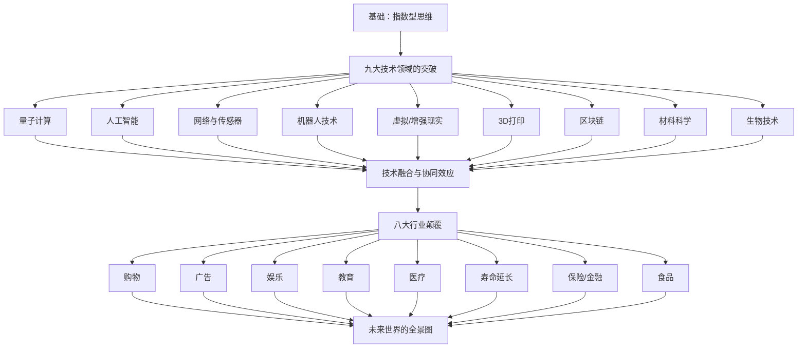
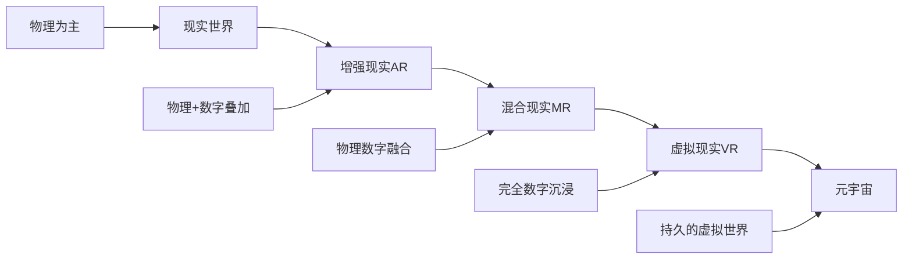
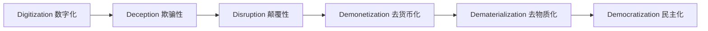

# 《未来呼啸而来》深度读书笔记

## 一、元信息/坐标定位

### 作者背景
==彼得·戴曼迪斯（Peter Diamandis）==是奇点大学联合创始人、X Prize基金会主席，被《财富》杂志评为"世界50位最伟大领导者"之一。他创办了20多家公司，是"指数型思维"的布道者。==史蒂芬·科特勒（Steven Kotler）==是畅销书作家、Flow Research Collective创始人，专注于巅峰表现和未来技术研究。两人此前合著的《富足》《创业无畏》均为纽约时报畅销书。

### 写作背景与时代语境
本书写于2020年，正值全球科技加速融合的关键节点。AI、量子计算、生物技术、材料科学等领域同时达到拐点，而新冠疫情又意外加速了数字化进程。作者试图描绘的是：==当多个指数型技术同时成熟并相互融合时，会产生怎样的"组合爆炸"效应==。

### 学科定位
本书属于==技术预测与未来学==领域，但区别于传统的线性趋势外推，它采用"技术融合"视角，强调指数型增长和跨领域协同。在未来学谱系中，它延续了库兹韦尔《奇点临近》的技术乐观主义传统，但更强调融合而非单一技术突破。

### 核心问题域
- 当AI、生物技术、纳米技术等同时成熟时，世界会发生什么？
- 指数型变化如何颠覆传统行业？
- 个人和组织如何在加速变化的时代生存和发展？

> [!abstract] 一句话定位
> 这是一本关于"技术融合引爆未来"的预言书，揭示了当九大指数型技术同时成熟并相互催化时，人类文明将经历的剧烈重构。

---

## 二、全书逻辑地图

**全书逻辑主线**：本书采用"技术→融合→应用→影响"的递进结构。

**第一部分（第1-2章）**：建立"指数型思维"的认知基础，解释为什么人类大脑难以理解指数增长，以及技术融合如何产生"组合爆炸"。

**第二部分（第3-11章）**：逐一深入分析九大指数型技术的最新突破、发展轨迹和未来潜力。

**第三部分（第12-19章）**：探讨技术融合如何颠覆八大传统行业——购物、广告、娱乐、教育、医疗、寿命延长、保险/金融、食品。

**第四部分（第20-21章）**：描绘2030年世界的全景图，讨论威胁与风险，以及个人和组织的应对策略。

> [!tip] 阅读建议
> 技术章节可选择性阅读，重点关注第12-19章的行业颠覆分析，这是本书最有价值的部分。最后一章"2030年的一天"是精华浓缩。

---

## 三、核心主题/逐章深度拆解

### 第一章：技术融合——当指数遇见指数

#### 核心论点
单一技术的指数增长已经很惊人，但==当多个指数型技术同时成熟并相互融合时，产生的是"指数的指数"效应==。这种融合不是简单的叠加，而是相互催化、相互加速。

#### DIKW四层提炼
| 层次 | 内容 |
|------|------|
| **Data** | 过去100年的技术进步超过之前2000年的总和；未来20年的变化将超过过去100年 |
| **Information** | 技术进步正在加速，而且加速度本身也在增加 |
| **Knowledge** | 融合效应 = 技术A × 技术B × ... × 技术N（乘法而非加法） |
| **Wisdom** | 未来不是线性外推的，而是指数跃迁的 |

#### 费曼式解读
> [!note] 用大白话解释
> 想象你有一张纸，对折一次厚度翻倍。对折42次后，厚度能从地球到月球！这就是==指数增长==的魔力。但本书说的更疯狂：不是一张纸在折，而是==9张纸同时在折，而且它们还会互相帮忙==——AI让生物技术更快发现药物，生物技术让材料科学有了新灵感，材料科学又让AI芯片更强大……这就是"融合"的力量。

#### 关键概念
- **指数型技术**：性能每1-2年翻倍的技术（遵循摩尔定律或类似规律）
- **技术融合**：多个指数型技术相互结合、相互加速的现象
- **颠覆性创新**：彻底改变游戏规则、使现有玩家出局的创新

---

### 第二章：指数型思维——人脑的认知局限

#### 核心论点
人类大脑是在线性世界中进化的，==天生不擅长理解指数增长==。这种认知局限导致我们系统性地低估技术变革的速度和规模，被作者称为"进化适应不良"。

#### DIKW四层提炼
| 层次 | 内容 |
|------|------|
| **Data** | 人类祖先一天移动距离约10公里，大脑为此优化了10万年 |
| **Information** | 大脑对线性变化敏感，对指数变化钝感 |
| **Knowledge** | 直觉判断 ≠ 指数现实 → 系统性误判 |
| **Wisdom** | 要做好未来准备，首先要认识到自己的认知局限 |

#### 费曼式解读
> [!note] 用大白话解释
> 你走30步，大概走了30米。这是==线性==。但如果你每一步距离翻倍（1米、2米、4米...），30步后你已经绕地球26圈了！问题是，我们的大脑是"30步≈30米"的思维方式，所以当AI能力每18个月翻倍时，我们总觉得"也就那样"，直到突然发现ChatGPT能写诗了、能编程了，措手不及。

#### 关键概念
- **线性思维**：假设未来是过去的直线延伸
- **指数思维**：理解复利效应和拐点突变
- **欺骗性阶段**：指数曲线初期看起来像缓慢的线性增长

> [!warning] 认知陷阱
> 指数曲线有一个"欺骗性阶段"：0.01→0.02→0.04→0.08看起来都是"几乎为零"，但突然就变成1→2→4→8→16爆发了。很多人在"几乎为零"阶段离场，错过了爆发。

---

### 第三章：量子计算——计算的范式革命

#### 核心论点
量子计算不是传统计算的升级版，而是==完全不同的计算范式==。它利用量子叠加和纠缠，能够同时处理天文数字级别的可能性，将彻底改变密码学、药物发现、材料模拟等领域。

#### DIKW四层提炼
| 层次 | 内容 |
|------|------|
| **Data** | 谷歌"悬铃木"量子计算机用200秒完成了经典超级计算机1万年的计算 |
| **Information** | 量子计算在特定问题上具有指数级优势 |
| **Knowledge** | 量子优势 = 问题并行化程度 × 量子比特数量 × 纠错能力 |
| **Wisdom** | 量子计算是解锁下一代AI和材料科学的钥匙 |

#### 费曼式解读
> [!note] 用大白话解释
> 传统计算机像一个==勤奋的学生==，要找迷宫出口就一条路一条路试。量子计算机像==分身术大师==，能同时派出无数分身尝试所有路径，瞬间找到答案。但这个"分身术"很脆弱，稍有干扰就散功（量子退相干），所以目前只能在特定条件下使用。

#### 关键概念
- **量子比特（Qubit）**：可以同时处于0和1状态的量子位
- **量子叠加**：一个量子系统同时处于多种状态
- **量子纠缠**：两个量子粒子即使相距遥远也保持关联

---

### 第四章：人工智能——第二次认知革命

#### 核心论点
AI正在从"弱人工智能"向"强人工智能"演进，将成为==历史上最具颠覆性的通用技术==。它不仅会替代体力劳动，更会替代脑力劳动，重新定义"人的价值"。

#### DIKW四层提炼
| 层次 | 内容 |
|------|------|
| **Data** | GPT-3拥有1750亿参数；AlphaFold预测蛋白质结构准确率达到原子级别 |
| **Information** | AI能力正在以超摩尔定律的速度增长 |
| **Knowledge** | AI影响范围 = 可数据化程度 × 模式识别价值 × 自动化潜力 |
| **Wisdom** | AI不会让人类失业，但会让不会使用AI的人失业 |

#### 费曼式解读
> [!note] 用大白话解释
> 第一次认知革命是==语言的发明==，让人类能够传递经验。这一次，AI是==外挂的大脑==——它能记住所有论文、看过所有X光片、学会所有法律条文。医生+AI比单独的医生或单独的AI都厉害，就像计算器出现后，人+计算器比单独的人或单独的计算器都强。关键是学会"驾驭"这个外挂。

#### 关键概念
- **窄AI/弱AI**：只能处理特定任务的人工智能
- **通用AI/强AI**：具备人类级别通用智能的系统
- **AI辅助**：人类与AI协作，各取所长

---

### 第五章：网络与传感器——万物互联的神经网络

#### 核心论点
5G、卫星互联网和无处不在的传感器正在构建一个==全球规模的数字神经系统==。当1000亿设备互联时，世界将获得前所未有的感知和响应能力。

#### DIKW四层提炼
| 层次 | 内容 |
|------|------|
| **Data** | 2030年预计有1000亿台设备联网；5G延迟降至1毫秒 |
| **Information** | 网络正在从"连接人"变成"连接万物" |
| **Knowledge** | 物联网价值 = 连接密度 × 数据颗粒度 × 实时性 |
| **Wisdom** | 未来的基础设施是数据的高速公路 |

#### 费曼式解读
> [!note] 用大白话解释
> 你的身体有数十亿神经元，能实时感知温度、疼痛、位置。现在，==整个地球也在长出"神经系统"==——传感器是"神经末梢"，5G/卫星是"神经纤维"，云计算是"大脑"。以后你的冰箱知道鸡蛋快没了自动下单，你的汽车知道前方堵车自动改路线，城市知道哪里有犯罪苗头提前预警。

#### 关键概念
- **物联网（IoT）**：物理设备通过网络互联互通
- **边缘计算**：在数据源头附近进行处理，减少延迟
- **数字孪生**：物理世界在数字空间的实时镜像

---

### 第六章：机器人技术——物理世界的AI化身

#### 核心论点
机器人是==AI在物理世界的延伸==。随着传感器、机械设计和AI的突破，机器人正在从工厂走向家庭、医院、农田，成为人类的"第二副身体"。

#### DIKW四层提炼
| 层次 | 内容 |
|------|------|
| **Data** | 波士顿动力的机器人能后空翻；达芬奇手术机器人完成了1000万+手术 |
| **Information** | 机器人正在从"重复劳动"走向"灵活操作" |
| **Knowledge** | 机器人能力 = 感知能力 × 运动能力 × 决策能力 |
| **Wisdom** | 机器人不是替代人类，而是扩展人类的能力边界 |

#### 费曼式解读
> [!note] 用大白话解释
> 汽车是腿的延伸，望远镜是眼睛的延伸，计算机是大脑的延伸。==机器人是"全身的延伸"==——它替你做手术（比你手更稳）、替你搬重物（比你力气大）、替你去危险地方（不会受伤）。特斯拉的"擎天柱"想做的，是一个通用的"替身"，什么脏活累活都能干。

#### 关键概念
- **协作机器人（Cobot）**：设计用于与人类安全协作的机器人
- **软体机器人**：用柔软材料制造，能适应复杂环境
- **自主机器人**：无需人类控制，自主完成任务

---

### 第七章：虚拟与增强现实——沉浸式体验革命

#### 核心论点
VR/AR不只是娱乐工具，而是==下一代计算平台==。当视觉、听觉、触觉都能被模拟时，"真实"与"虚拟"的界限将消融，人类将获得全新的体验和工作方式。

#### DIKW四层提炼
| 层次 | 内容 |
|------|------|
| **Data** | VR头显分辨率已接近人眼极限；触觉手套能模拟物体触感 |
| **Information** | 沉浸式技术正在接近"骗过大脑"的临界点 |
| **Knowledge** | 沉浸感 = 视觉保真度 × 延迟最小化 × 交互自然度 |
| **Wisdom** | 体验将成为比实物更有价值的商品 |

#### 费曼式解读
> [!note] 用大白话解释
> 现在你想学开飞机，得真的去开——贵、危险、耗时。以后呢？戴上VR头盔，你就"坐在"驾驶舱里，看到的、听到的、甚至手握操纵杆的触感都和真的一样。==大脑分不清真假，所以你学到的技能是真的==。这就是为什么VR不只是"玩游戏"，而是学习、工作、社交的全新方式。

#### 关键概念
- **VR（虚拟现实）**：完全沉浸在计算机生成的环境中
- **AR（增强现实）**：在现实世界叠加数字信息
- **元宇宙**：持久的、共享的虚拟世界

---

### 第八章：3D打印——分布式制造革命

#### 核心论点
3D打印正在从原型制作走向==正式生产==，将彻底改变"规模经济"的逻辑。当任何复杂物品都能在本地按需打印时，全球供应链将被重塑。

#### DIKW四层提炼
| 层次 | 内容 |
|------|------|
| **Data** | 全球最大的3D打印建筑用时仅47天；SpaceX用3D打印制造火箭发动机 |
| **Information** | 3D打印正在从"塑料玩具"走向"金属零件"和"人体器官" |
| **Knowledge** | 3D打印价值 = 复杂度红利 + 定制化红利 + 分布式红利 |
| **Wisdom** | 未来的工厂在每个人的桌上 |

#### 费曼式解读
> [!note] 用大白话解释
> 传统制造像"雕刻"——从一大块材料上削减成想要的形状，浪费很多。3D打印像"堆积木"——==一层一层加上去==，要什么形状就什么形状，几乎不浪费。更厉害的是，传统工厂做复杂零件很贵，3D打印做复杂零件反而更便宜（因为不需要模具）。所以飞机发动机、医疗植入物、甚至人体器官都在用3D打印。

#### 关键概念
- **增材制造**：3D打印的正式名称，逐层添加材料
- **按需制造**：不需要库存，订单来了再生产
- **生物打印**：用活细胞打印组织和器官

---

### 第九章：区块链——去中心化的信任机器

#### 核心论点
区块链的本质是==无需中介的信任机制==。它不仅仅是加密货币的底层技术，更是重塑产权、合同、身份、投票等社会基础设施的可能性。

#### DIKW四层提炼
| 层次 | 内容 |
|------|------|
| **Data** | 全球区块链市场规模年增长率超过60%；DeFi锁仓资金超过千亿美元 |
| **Information** | 区块链解决的是"陌生人之间如何信任"的问题 |
| **Knowledge** | 区块链价值 = 去中介节省 + 透明性溢价 + 不可篡改保障 |
| **Wisdom** | 信任成本降低的地方，就是新商业机会涌现的地方 |

#### 费曼式解读
> [!note] 用大白话解释
> 你把钱存银行，是因为相信银行不会卷款跑路——==银行是"信任中介"==。但你得付手续费、等待审核、接受银行的规则。区块链说：如果有一个账本，==全网几万台电脑同时记录，谁也改不了、删不掉==，那还需要银行吗？这就是"去中心化信任"。现在已经可以用智能合约自动执行协议，不需要律师公证。

#### 关键概念
- **分布式账本**：数据存储在网络的多个节点上
- **智能合约**：自动执行的代码化协议
- **去中心化金融（DeFi）**：无需银行的金融服务

---

### 第十章：材料科学——原子级别的设计

#### 核心论点
我们正在进入==按原子设计材料==的时代。石墨烯、碳纳米管、超材料等新型材料将赋予产品前所未有的性能，彻底改变能源、电子、医疗等领域。

#### DIKW四层提炼
| 层次 | 内容 |
|------|------|
| **Data** | 石墨烯强度是钢的200倍、重量只有钢的1/6 |
| **Information** | 材料性能的瓶颈正在被逐一突破 |
| **Knowledge** | 新材料价值 = 性能突破 × 成本下降 × 规模化能力 |
| **Wisdom** | 材料是其他所有技术的"地基" |

#### 费曼式解读
> [!note] 用大白话解释
> 你知道为什么飞机不能飞太快吗？因为材料撑不住。为什么电池不能更耐用？材料限制。为什么药物有副作用？材料不够精准。==材料是一切技术的"原材料"==。现在，我们能够像搭乐高一样在原子层面设计材料，想要什么性能就设计什么结构。这就像从"只能用现成砖块盖房"变成"可以定制每块砖的形状"。

#### 关键概念
- **石墨烯**：单层碳原子构成的二维材料，性能极端
- **超材料**：人工设计的、自然界不存在的材料
- **纳米材料**：尺寸在纳米级别的材料，具有独特性质

---

### 第十一章：生物技术——重新编程生命

#### 核心论点
生物技术正在从"读取"DNA走向=="编写"DNA==。基因编辑、合成生物学、干细胞技术将使人类能够设计生命、延长寿命、甚至创造全新的生命形式。

#### DIKW四层提炼
| 层次 | 内容 |
|------|------|
| **Data** | 基因测序成本从30亿美元降至不到1000美元；CRISPR专利争夺涉及数十亿美元 |
| **Information** | 生命正在变得可编程 |
| **Knowledge** | 生物技术能力 = 读取能力 × 理解能力 × 编写能力 |
| **Wisdom** | 谁掌握了编辑生命密码的能力，谁就掌握了终极力量 |

#### 费曼式解读
> [!note] 用大白话解释
> DNA就像生命的"==源代码=="。过去我们只能"阅读"它（测序），后来能"复制粘贴"（克隆），现在能"编辑修改"（CRISPR）。想象你能打开一个Word文档，找到错别字（致病基因）然后改正，身体就不会生那个病了。这不是科幻，已经有人用这个方法治好了镰刀细胞贫血症。

#### 关键概念
- **CRISPR**：精准的基因编辑工具，像"基因剪刀"
- **合成生物学**：用工程方法设计和构建新的生物系统
- **基因治疗**：通过修改基因来治疗疾病

> [!warning] 伦理警示
> 生物技术的力量也意味着风险：基因编辑婴儿、生物武器、基因歧视等问题需要全社会共同面对。

---

### 第十二章至第十九章：八大行业颠覆

#### 购物的未来
==无摩擦零售==：AI预测你需要什么→自动采购→无人机配送→VR试穿→3D打印定制。亚马逊的无人商店只是开始，未来是"想到就有"。

#### 广告的未来
==精准到恐怖==：AI比你更了解你的欲望，在你意识到需求之前就推送。但这也意味着隐私的终结和"过滤气泡"的加深。

#### 娱乐的未来
==沉浸式体验==：VR让你走进电影、AI让每个人都有专属内容、区块链让创作者直接变现。"好莱坞"将被去中心化。

#### 教育的未来
==个性化+沉浸式==：AI了解每个学生的学习风格、VR提供体验式学习、全球名师在线可及。传统学校的形式将被颠覆。

#### 医疗的未来
==预测+个性化+再生==：传感器持续监测→AI早期预警→基因疗法精准治疗→3D打印器官替换。从"治疗疾病"转向"维护健康"。

#### 寿命延长
==衰老将成为可治疗的疾病==：基因编辑、干细胞、纳米机器人将逐一攻克衰老的机制。活到120岁可能成为常态。

#### 保险与金融
==去中介化==：区块链智能合约自动理赔、AI评估风险、DeFi提供全球金融服务。传统银行和保险公司面临生存危机。

#### 食品的未来
==实验室生产==：细胞培养肉、垂直农场、精准发酵将使食品生产脱离土地和气候限制。畜牧业可能成为历史。

> [!tip] 行业应用启示
> 这八章的核心洞察：==每个行业都将被"数据化+智能化+去中介化"三重力量改造==。问自己：我的行业中，什么环节可以被AI替代？什么摩擦可以被区块链消除？什么体验可以被VR/AR增强？

---

## 四、核心框架提炼

### 框架一：6D框架——指数型技术的发展轨迹

- **数字化**：一旦某领域可以用0和1表示，就上了指数快车
- **欺骗性阶段**：指数早期增长缓慢，容易被忽视
- **颠覆性突破**：跨过拐点后快速颠覆现有格局
- **去货币化**：技术使产品/服务成本趋近于零
- **去物质化**：手机取代了相机、地图、手电筒...
- **民主化**：曾经只有少数人享用的能力普及到所有人

### 框架二：技术融合矩阵

| 技术A × 技术B | 应用示例 |
|--------------|---------|
| AI × 生物技术 | AlphaFold预测蛋白质结构 |
| AI × 机器人 | 自动驾驶汽车 |
| VR × 网络 | 元宇宙社交 |
| 3D打印 × 材料科学 | 定制人体器官 |
| 区块链 × 传感器 | 供应链溯源 |
| 量子计算 × AI | 药物发现加速 |

### 框架三：行业颠覆预警模型

评估你的行业被颠覆的可能性：
1. **数据化程度**：核心流程能否被数据描述？（高=危险）
2. **信息不对称**：行业是否依赖信息差赚钱？（是=危险）
3. **中介密集度**：价值链上有多少"中间人"？（多=危险）
4. **客户痛点**：现有体验是否存在明显摩擦？（是=机会）

> [!abstract] 框架整合
> 6D框架判断技术成熟度，融合矩阵发现交叉机会，颠覆预警模型评估行业风险。三者结合可用于战略规划。

---

## 五、批判性思考

### 理论贡献与局限

**贡献**：
1. 首次系统梳理九大技术的交叉融合效应，提供了全景式认知框架
2. 将技术预测与商业应用紧密结合，具有实践指导价值
3. 文笔生动，将复杂技术解释得通俗易懂

**局限**：
1. ==技术乐观主义倾向明显==，对风险和负面影响讨论不足
2. 时间预测过于激进，很多"2030年"的预言可能推迟
3. 缺乏对发展中国家和技术鸿沟的深入讨论

### 争议性观点

> [!warning] 需要批判性审视的论断
> 1. "寿命延长到150岁将在20年内实现"——目前缺乏足够证据
> 2. "AI将在所有领域超越人类"——忽视了具身智能和常识推理的困难
> 3. "去中心化将消灭大公司"——低估了网络效应和规模效应

### 与其他思想的对话

| 本书观点 | 对立/补充观点 | 来源 |
|---------|--------------|------|
| 技术将解决人类问题 | 技术可能制造更大问题 | [[技术垄断]] - 波斯曼 |
| 指数增长将持续 | 物理定律设置了天花板 | [[增长的极限]] - 梅多斯 |
| 去中心化是趋势 | 权力会以新形式集中 | [[监控资本主义]] - 祖博夫 |

### 个人批判性问题

1. 技术融合带来的系统性风险（如AI+生物技术的潜在滥用）如何监管？
2. 技术民主化是否会加剧而非缩小社会不平等？
3. 当"真实"和"虚拟"边界消融，人类的身份认同如何重构？

---

## 六、行动清单

### 个人层面
- [ ] 选择1-2个指数型技术领域深入学习（推荐：AI和生物技术）
- [ ] 订阅前沿科技资讯（Wired、MIT Technology Review）
- [ ] 尝试使用AI工具辅助工作和学习
- [ ] 思考：我的职业在10年后是否存在？

### 职业层面
- [ ] 评估所在行业的6D阶段
- [ ] 识别可能颠覆行业的技术融合组合
- [ ] 发展"人机协作"能力而非与AI竞争
- [ ] 构建跨学科知识网络

### 组织层面
- [ ] 建立技术雷达，持续追踪指数型技术
- [ ] 设立创新实验室，探索技术融合应用
- [ ] 培养组织的指数型思维文化
- [ ] 制定行业颠覆情景的应对预案

> [!tip] 核心行动原则
> ==不要预测未来，要参与创造未来==。最好的应对策略不是被动等待，而是主动探索和实验。

---

## 七、延伸阅读路线图

### 基础认知
- [[奇点临近]] - 库兹韦尔：指数型思维的源头之作
- [[第四次工业革命]] - 施瓦布：世界经济论坛视角的技术变革

### 深度探索
- [[生命3.0]] - 泰格马克：AI与人类未来的哲学思考
- [[基因传]] - 悉达多·穆克吉：基因科学的完整历史

### 批判性视角
- [[技术垄断]] - 波斯曼：对技术乐观主义的反思
- [[监控资本主义时代]] - 祖博夫：技术巨头如何利用我们的数据

### 实践应用
- [[指数型组织]] - 伊斯梅尔：如何构建快速增长的组织
- [[创业无畏]] - 戴曼迪斯：在指数时代创业的方法论

---

## 八、费曼终极检验

### 如果要用5分钟向一个完全不懂科技的朋友解释这本书，我会这样说：

"你知道'摩尔定律'吗？就是==计算机每两年性能翻一倍==。这个规律持续了60年，所以你手机的计算能力比当年送人类上月球的计算机还强大。

但这本书说的更疯狂：不是只有计算机在翻倍，==AI在翻倍、基因技术在翻倍、3D打印在翻倍、VR在翻倍...九个领域同时在翻倍==。而且它们还会'互相帮忙'——AI让基因研究更快，基因研究让AI芯片更好，芯片让AI更强...这是指数的指数。

结果是什么？

你想象一下：10年后，你早上起床，==AI管家==根据你的基因和昨晚睡眠数据定制早餐；你戴上==VR眼镜==就能"坐在"巴黎咖啡馆和客户开会；你妈需要的药，医院根据她的基因==定制打印==，疗效提升10倍；你爸的心脏有问题，可以==用他自己的细胞培养一个新的==...

听起来像科幻对吧？但书里的每一项技术，==现在都已经在实验室里跑通了==。只是成本还贵、规模还小。而按照过去60年的规律，再过10-20年，它们都会变得又便宜又好用。

这本书就是告诉你：==未来不是慢慢来的，是呼啸而来的==。你可以害怕、可以兴奋，但不能假装看不见。现在开始了解和准备，还来得及。"

---

> [!abstract] 全书一句话总结
> ==当九大指数型技术同时成熟并相互融合时，它们将产生"指数的指数"效应，在未来20年彻底重塑人类的工作、生活和生命本身——而这场变革，已经开始了。==
