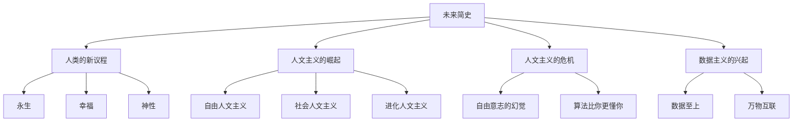

# 《未来简史》深度拆解

## 一、史学坐标定位（400字）

《未来简史》是尤瓦尔·赫拉利继《人类简史》后的第二部著作，2015年出版。如果说《人类简史》讲的是"我们从哪里来"，那么本书回答的是"我们将往何处去"。

> [!abstract] 核心主题
> 赫拉利提出一个大胆预测：==人类在21世纪的三大议程将是——长生不老、幸福快乐、化身为神==。但在追求这些目标的过程中，人类可能会失去自己。

本书的核心论点是：
- **人文主义**正在被**数据主义**取代
- **自由意志**可能只是一个幻觉
- **人类可能分化为两个物种**：被算法淘汰的"无用阶级"和掌握技术的"超人类"

赫拉利融合了历史学、生物学、计算机科学和哲学，构建了一个关于未来的宏大叙事。

---

## 二、叙事结构地图（500字）

**核心框架：三次认知革命**

| 革命 | 时间 | 核心变化 |
|------|------|----------|
| 认知革命 | 7万年前 | 人类获得讲故事的能力 |
| 科学革命 | 500年前 | 人类发现自己的无知 |
| 数据革命 | 21世纪 | 算法取代人类决策 |

---

## 三、核心主题深度拆解（5000字）

### 主题1：「人类的新议程——从生存到升级」

**【DIKW四层提炼】**

| 层级 | 内容 |
|------|------|
| Data | 过去人类主要死于饥荒、瘟疫、战争 |
| Information | 现在这三大问题基本被控制 |
| Knowledge | 人类将追求新的目标 |
| Wisdom | ==当生存不再是问题，人类将追求永生、幸福和神性== |

**【苏格拉底追问链】**

| 追问 | 赫拉利的回答 |
|------|-------------|
| 为什么是这三个议程？ | 这是人类欲望的逻辑延伸 |
| 这真的是人类想要的吗？ | 不是每个人都这么想，但精英阶层会推动 |
| 有什么反例？ | 宗教原教旨主义者可能反对 |

---

### 主题2：「人文主义的危机——自由意志的幻觉」

**【第一性原理拆解】**

赫拉利挑战人文主义的基础假设：

> [!warning] 自由意志可能是幻觉
> 神经科学研究表明，大脑做出决定的信号比我们"意识到"决定早了几百毫秒。我们以为的"自由选择"可能只是生化算法的输出。

**【DIKW四层提炼】**

| 层级 | 内容 |
|------|------|
| Data | 利贝特实验显示决定先于意识 |
| Information | "自由意志"可能是事后解释 |
| Knowledge | 人类决策可能被算法预测 |
| Wisdom | ==如果算法比你更了解你，它为什么不能替你做决定？== |

**【心智模型照射】**

人文主义vs数据主义：

| 议题 | 人文主义 | 数据主义 |
|------|----------|----------|
| 权威来源 | 人类的感受和选择 | 数据和算法 |
| 最高价值 | 人的尊严和自由 | 信息流动和处理效率 |
| 谁做决策 | 人类个体 | 算法 |

---

### 主题3：「算法时代——当机器比你更懂你」

**【第一性原理拆解】**

赫拉利预测的未来：

> [!abstract] 外部算法取代内在感受
> 当亚马逊推荐系统比你更知道你喜欢什么书，当Spotify比你更了解你的音乐品味，当健康AI比你更清楚你的身体状况——"聆听内心"的人文主义建议就过时了。

**【案例审查】**

| 领域 | 现在 | 未来（赫拉利预测） |
|------|------|-------------------|
| 医疗 | 医生问诊 | AI诊断更准确 |
| 教育 | 标准化课程 | 个性化学习路径 |
| 职业 | 自我探索 | 算法推荐职业 |
| 婚姻 | 浪漫爱情 | 算法匹配 |

---

### 主题4：「无用阶级——技术性失业的威胁」

**【DIKW四层提炼】**

| 层级 | 内容 |
|------|------|
| Data | 自动化正在取代越来越多的工作 |
| Information | 不仅是体力劳动，也包括认知劳动 |
| Knowledge | 未来可能出现大规模"无用阶级" |
| Wisdom | ==经济价值与政治权力挂钩，无用意味着无权== |

**【苏格拉底追问链】**

- Q：新技术总是创造新工作，这次为什么不同？
- A：AI可能在各领域同时超越人类，没有"逃生舱"

- Q：人不能转型吗？
- A：转型需要时间，而技术变化太快

---

### 主题5：「数据主义——新的宇宙宗教」

**【第一性原理拆解】**

==数据主义==是赫拉利描述的新世界观：

> [!tip] 数据主义的信条
> 宇宙由数据流构成。任何现象或实体的价值取决于它对数据处理的贡献。

**【心智模型照射】**

数据主义的核心原则：
1. **信息自由流动**：阻碍数据流动是最大的罪
2. **万物互联**：一切都应该联网、产生数据
3. **算法优化**：追求数据处理的效率最大化

**【反脆弱压力测试】**

数据主义的局限：
- **意识问题未解决**：我们不知道机器是否有意识
- **数据可以被操纵**：垃圾进，垃圾出
- **人文价值被忽视**：效率不是一切

---

## 四、历史模式识别（800字）

### 模式1：信仰的更替

| 时代 | 主导信仰 | 权威来源 |
|------|----------|----------|
| 神权时代 | 神的旨意 | 圣典、祭司 |
| 人文主义时代 | 人的感受 | 内心、自由选择 |
| 数据主义时代 | 数据 | 算法、大数据 |

### 模式2：人类的自我定义不断被颠覆

1. **哥白尼革命**：地球不是宇宙中心
2. **达尔文革命**：人类不是上帝特别创造的
3. **数据革命**：人类可能只是信息处理的载体

---

## 五、史学方法论审查（600字）

### 赫拉利方法论的特点

| 特点 | 说明 | 风险 |
|------|------|------|
| 宏大叙事 | 跨越数万年的历史 | 可能过度简化 |
| 跨学科 | 融合历史、生物、计算机 | 可能不够专业 |
| 思想实验 | 大量假设性推演 | 可能过于投机 |

### 批评者的观点

- **技术决定论**：赫拉利可能低估了政治、文化的抵抗
- **预测的局限**：未来是不可预测的
- **过度悲观**：人类适应能力可能被低估

---

## 六、以史鉴今（600字）

### 个人层面的启示

| 趋势 | 应对建议 |
|------|----------|
| 算法取代决策 | 培养算法无法替代的能力（创造力、共情） |
| 终身学习 | 适应能力比专业知识更重要 |
| 数据隐私 | 意识到你的数据就是你的价值 |

### 社会层面的思考

- **再分配问题**：如果机器创造财富，如何分配？
- **意义问题**：如果不需要工作，人类如何找到意义？
- **政治问题**：如果算法做决策，民主如何运作？

---

## 七、费曼终极检验（400字）

**如果用一句话向朋友解释这本书的核心观点：**

> 人类在追求永生、幸福和神性的过程中，可能会创造出比自己更聪明的算法，然后发现自己变得"没有用"——这是进步的讽刺。

**三个能立即思考的问题：**

1. **如果算法比你更了解你**，你还会"聆听内心"吗？

2. **你的工作会被AI取代吗**？你有什么是AI做不到的？

3. **你愿意让算法帮你做重大决定吗**（职业、婚姻、健康）？

**这本书改变了什么认知：**

从"人类是万物之灵"转向"人类可能只是进化过程中的一个阶段"。技术进步不一定让每个人都受益。

---

## 延伸阅读路线图

| 书籍 | 关联 |
|------|------|
| [[《人类简史》]] | 赫拉利前作，讲述过去 |
| [[《今日简史》]] | 赫拉利续作，聚焦当下 |
| [[《奇点临近》]] | 库兹韦尔的技术乐观主义 |
| [[《生命3.0》]] | 泰格马克关于AI与生命的未来 |
