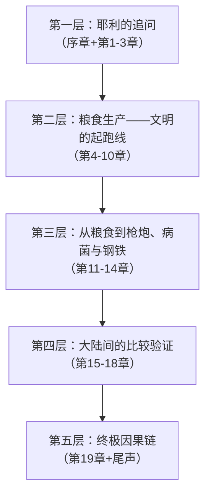
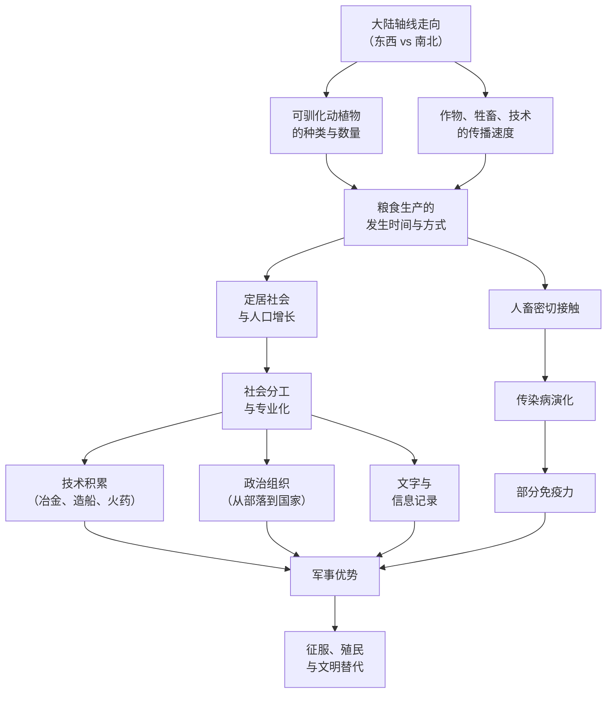

# 《枪炮、病菌与钢铁：人类社会的命运》深度拆解

## 一、科学坐标定位

> [!abstract] 速览
> 《枪炮、病菌与钢铁》（*Guns, Germs, and Steel: The Fates of Human Societies*）由贾雷德·戴蒙德（Jared Diamond）于1997年出版，1998年获普利策奖（非虚构类）。戴蒙德是加州大学洛杉矶分校（UCLA）地理学教授，同时具备生理学、进化生物学和生物地理学的跨学科背景。全书试图回答一个宏大问题：==为什么是欧亚大陆的人征服了美洲、非洲和澳大利亚，而不是反过来？==

你需要首先理解这本书在学术谱系中的位置。在它之前，对「为什么某些文明比另一些更强大」这个问题的主流回答大体分为两派：一派诉诸种族差异（即某些种族在智力或能力上天生优越），一派诉诸文化因素（即某些文化更具进取精神或创新能力）。戴蒙德对这两种解释都持根本性的反对态度。他的核心论点是：==人类社会发展轨迹的差异，根本原因在于各大陆的环境差异——尤其是可供驯化的动植物物种、大陆轴线的走向、以及地理屏障的分布==。

在学科交叉的版图上，本书横跨[[进化生物学]]、[[考古学]]、[[语言学]]、[[流行病学]]、[[地理学]]和[[人类学]]。它与威廉·麦克尼尔的《瘟疫与人》（1976）形成直接对话——麦克尼尔率先将传染病纳入历史解释，戴蒙德则将其整合进一个更宏大的环境决定论框架。与阿尔弗雷德·克罗斯比的《生态帝国主义》（1986）也有深层关联——克罗斯比关注欧洲人扩张过程中的生态武器（包括疾病和入侵物种），戴蒙德将这个视角向前推进，追问为什么欧洲人拥有这些生态武器。

值得注意的是，本书出版后引发了持久的学术争论。批评者认为戴蒙德的「地理决定论」过于简化，忽视了制度、文化和个体能动性的作用。但即便是批评者也承认，这本书成功地将==种族主义解释从严肃讨论中驱逐了出去==，并为理解人类历史提供了一个不可忽视的物质基础视角。

---

## 二、知识架构地图

全书分为四大部分、19章加尾声，逻辑上可提炼为**五个递进的论证层次**：

**核心命题**：你以为历史是由伟人、文化或种族决定的，但戴蒙德论证了一条更深层的因果链——==环境因素（地理、气候、可驯化物种的分布）→ 粮食生产的时间和方式 → 人口密度、技术积累、社会组织复杂化、病菌的演化 → 征服与被征服的格局==。

> [!important] 因果链全景
> 大陆轴线走向 + 可驯化动植物种类 → 粮食生产的率先发生 → 定居社会 → 人口增长 → 社会分层与专业化 → 技术发明（包括文字与冶金） + 密集人畜接触 → 传染病免疫 → 军事优势 → 征服

---

## 三、逐层深度拆解

### 第一层：耶利的追问——一个问题如何改变整部人类史

> [!tip] 对应章节：序章、第1-3章

**【布鲁姆认知阶梯】**

- **记忆**：1972年，戴蒙德在新几内亚做田野研究时，当地政治家耶利向他提出一个问题：「为什么你们白人制造了那么多货物并将它带到新几内亚来，但我们黑人却几乎没有属于自己的货物？」这个问题成为全书的出发点。
- **理解**：耶利的追问实质上是在问——为什么技术和物质财富在全球的分布如此不均？传统的种族主义回答是「因为白人更聪明」。戴蒙德认为这个回答不仅在道德上令人反感，在科学上也站不住脚。他在新几内亚的长期观察使他确信：新几内亚人在实际生存智慧和认知能力上丝毫不亚于欧洲人。
- **应用**：耶利的追问可以被推广为：为什么公元1500年前后，各大陆的技术和政治复杂性差异如此巨大？为什么是欧洲人殖民了美洲和澳大利亚，而不是美洲原住民殖民欧洲？
- **分析**：戴蒙德在前三章快速扫描了人类从5万年前（晚更新世）到公元1500年的发展轨迹，确立了一个关键事实——各大陆的发展差异在最近13000年中急剧扩大。这意味着答案不在基因（人类的生物进化在这个时间尺度上变化极小），而在13000年间发生的环境与文化过程。

**【第一性原理回溯】**

戴蒙德的第一性原理：==历史的终极因（ultimate cause）必须在环境条件中寻找，而非在种族特征、文化优越性或个人英雄主义中寻找==。他区分了「近因」（proximate cause）和「终极因」（ultimate cause）。枪炮、病菌和钢铁是西班牙人征服印加帝国的近因；但为什么西班牙人拥有这些而印加人没有？这才是需要回答的终极因问题。

**【费曼式类比】**

想象你组织一场长跑比赛。有的选手出发时穿着专业跑鞋、跑在平坦的柏油路上、顺风前行；有的选手赤脚、跑在崎岖的山路上、逆风前行。比赛结束后，穿跑鞋的选手赢了。你会得出结论说「赢的选手天生跑得快」吗？还是会先看看他们各自的起跑条件？戴蒙德说：人类文明的竞赛也是如此——在讨论谁「更优秀」之前，你必须先检查起跑条件。

---

### 第二层：粮食生产——文明的起跑线

> [!tip] 对应章节：第4-10章（全书论证的核心基石）

这是全书论证最密集、最关键的部分。戴蒙德用七章的篇幅论证了一个核心命题：==粮食生产（农业和畜牧业）是人类社会一切复杂性的源头，而粮食生产率先出现在哪里，取决于当地的野生动植物资源==。

#### 3.1 植物驯化：安娜·卡列尼娜原则的植物版

**【布鲁姆认知阶梯】**

- **记忆**：全球独立发展出粮食生产的地区屈指可数——新月沃地（约公元前8500年，最早）、中国（约公元前7500年）、中美洲（约公元前3500年）、美国东部、非洲萨赫勒地区、以及少数其他地区。而澳大利亚、加利福尼亚、南非开普等地在欧洲人到来之前从未独立发展出农业。
- **理解**：为什么只有这些地区？戴蒙德的回答是：不是因为那里的人更聪明或更勤劳，而是因为那里碰巧拥有==适合驯化的野生植物祖先==。全世界大型种子禾本科植物（谷物的祖先）共56种，其中32种集中在地中海气候区，尤其是新月沃地。而南美洲、撒哈拉以南非洲和澳大利亚的相应资源极为贫乏。
- **分析**：新月沃地的巨大优势不仅在于数量，还在于质量。那里的野生小麦和大麦已经具备大粒种子和自花授粉（有利于保持性状稳定）等特征，驯化相对容易。而许多其他地区的野生植物——如美洲的玉米祖先（大刍草/teosinte）——与最终驯化形态差异巨大，驯化过程更漫长、更困难。
- **评价**：你需要警惕一个常见的误解——粮食生产不是因为某些人「发明」了农业而出现的。更准确的描述是：当环境条件合适（野生植物资源丰富、气候稳定、采集效率下降）时，粮食生产几乎是一个必然的渐进过程。==农业不是被某个天才发明的，而是从采集活动中逐渐「长」出来的==。

**【第一性原理回溯】**

这里的第一性原理是：==你无法驯化不存在的物种==。一个地区缺乏可驯化的野生植物，不是因为居民懒惰或愚蠢，而是因为[[生物地理学]]的抽签结果。这就像一场扑克牌游戏——你的技术水平再高，如果发到手的牌全是2和3，你也很难赢。

**【费曼式类比】**

想象两个厨师比赛做菜。一个厨师的食材柜里有鲜鱼、牛排、香料和奶油；另一个厨师的食材柜里只有几根野草和一些苦涩的浆果。比赛结束后，食材丰富的厨师做出了精美的大餐。你会说「第一个厨师天赋更高」吗？还是先看看他们各自的食材柜？

#### 3.2 动物驯化：安娜·卡列尼娜原则

**【布鲁姆认知阶梯】**

- **记忆**：全世界体重超过45公斤的大型陆生哺乳动物候选者有148种，最终被成功驯化的仅14种，且其中13种的野生祖先分布在欧亚大陆。南美洲仅有骆马一种；撒哈拉以南非洲==没有任何==本土驯化的大型哺乳动物；澳大利亚同样为零。
- **理解**：戴蒙德借用托尔斯泰的名言提出了「安娜·卡列尼娜原则」——==驯化成功的动物都是相似的，驯化失败的动物各有各的失败原因==。一种动物要被成功驯化，必须同时满足多个条件：生长速度快、能在圈养环境中繁殖、性情温顺、不易惊恐、具有社会等级结构（便于人类取代其领导地位）、食性适合人类提供饲料。缺少其中任何一个条件，驯化就会失败。
- **分析**：斑马性情暴躁且无法被可靠骑乘；非洲水牛凶猛危险；河马攻击性极强；美洲野牛虽然体型合适但难以圈养繁殖。非洲和美洲的人并非不想驯化大型动物——而是==他们的大陆没有给他们合适的候选物种==。
- **评价**：驯化动物的意义远超食物供应。马和牛提供了畜力（耕田、运输）、皮革和骨骼制品，更关键的是——密集的人畜接触催生了从动物传染到人类的疾病。这些疾病最终成为欧洲人征服美洲和澳大利亚时最致命的武器。

**【概念网络】**

#### 3.3 大陆轴线假说：东西轴线 vs 南北轴线

**【布鲁姆认知阶梯】**

- **记忆**：欧亚大陆的主轴是东西走向的，美洲和非洲的主轴是南北走向的。
- **理解**：这个看似简单的地理事实产生了深远的影响。沿东西轴线传播的作物和牲畜可以保持在相似的纬度（即相似的气候和日照条件）下，传播阻力小、速度快。而沿南北轴线传播则必须穿越不同的气候带——热带雨林、沙漠、温带——每穿越一个气候带，作物就需要重新适应，传播速度大幅降低。
- **分析**：==新月沃地驯化的小麦和大麦在几千年内就传播到了整个欧亚大陆的温带地区（从爱尔兰到日本），但中美洲驯化的玉米花了数千年才传播到北美东部，而且很多安第斯作物根本没能传到中美洲==。同样，非洲萨赫勒的作物无法穿越赤道热带雨林传播到南非温带地区。
- **评价**：大陆轴线假说是本书最具原创性的论点之一。它将宏观地理学与微观农业史优雅地连接起来——一个大陆的形状和走向，竟然可以决定文明传播的速度，进而影响整个人类历史的走向。

**【第一性原理回溯】**

底层原理：==植物的生长受纬度（日照时长和强度）约束远大于经度约束==。在相同纬度上，温度和季节节律大致相似，作物可以直接移植。但跨越纬度意味着日照、温度和降水模式的根本改变，作物必须经过漫长的适应或重新驯化。

**【费曼式类比】**

想象你在一条东西走向的长走廊里传递消息——走廊里每个房间的温度都差不多，你只需要走过去敲门就行。但如果走廊是南北走向的，每走一步温度就变化五度——有些门被冰封住了，有些门热得烫手。同一条消息在东西走廊里几分钟就传到头了，在南北走廊里可能永远也传不到另一端。

---

### 第三层：从粮食到枪炮、病菌与钢铁——因果链的展开

> [!tip] 对应章节：第11-14章

粮食生产一旦确立，一系列连锁反应便不可阻挡地展开。戴蒙德在这几章中论证了粮食生产如何转化为征服的三大利器。

#### 4.1 病菌：无声的征服者

**【布鲁姆认知阶梯】**

- **记忆**：欧洲人征服美洲时，==天花、麻疹、流感、伤寒等传染病杀死的美洲原住民，数量远超死于枪炮的人数==。据估计，美洲原住民人口在欧洲人到来后的一两个世纪内减少了约95%，其中绝大部分死于传染病。
- **理解**：这些致命的传染病几乎全部起源于欧亚大陆的驯化动物。天花来自牛（牛痘病毒的近亲），麻疹来自牛瘟病毒，流感来自猪和禽类。密集的农业社会为病原体提供了足够大的宿主群体来维持传播链，而数千年的暴露使欧亚大陆人群逐渐演化出部分免疫力。美洲原住民因为缺乏大型驯化动物，从未经历过这些疾病的洗礼，==完全没有免疫力==。
- **分析**：为什么传染病的传播是单向的——从旧世界到新世界，而不是反过来？关键在于驯化动物的数量差异。欧亚大陆有牛、猪、羊、马、鸡等大量驯化动物，人畜长期密切共处为跨物种传播创造了条件。美洲唯一的大型驯化动物是骆马，且骆马没有被大规模圈养，人畜接触的密度远低于旧世界。
- **评价**：病菌这个论证环节是全书因果链中最具冲击力的一环。它揭示了一个反直觉的真相：==征服的最致命武器不是有意制造的，而是无意间携带的==。皮萨罗征服印加帝国时，天花已经在他到达之前传播到安第斯地区，杀死了印加皇帝瓦伊纳·卡帕克及其指定继承人，引发了继承战争，极大地削弱了印加帝国的抵抗能力。

**【苏格拉底追问】**

你可能会问：如果美洲也有大量驯化动物，美洲原住民是否也会发展出致命的传染病，并在接触欧洲人时反向传播？答案很可能是肯定的。梅毒可能就是为数不多的从新世界传回旧世界的疾病之一（尽管其起源仍有争议）。这个反事实推理恰恰支持了戴蒙德的核心论点——==决定性因素不是人，而是环境给予人的资源==。

#### 4.2 文字与技术：累积性优势

**【布鲁姆认知阶梯】**

- **记忆**：文字在人类历史上仅被独立发明了极少数次——确认的有苏美尔楔形文字（约公元前3400年）和中美洲文字（约公元前600年），中国文字和埃及象形文字是否完全独立发明仍有争议。其余所有文字系统都是从这些源头传播或受启发而来。
- **理解**：文字的发明与粮食生产直接相关。文字最早的用途不是记录诗歌或历史，而是==记录粮食库存和税收==。只有在产生了粮食盈余、需要管理复杂经济活动的社会中，文字才有存在的必要和发明的条件。同时，只有粮食盈余支撑的专业化分工（即不需要人人种地）才能供养全职的书吏阶层。
- **分析**：技术发明同样遵循类似的逻辑。戴蒙德反对「英雄发明家」的叙事。他认为大多数技术发明不是一个天才在灵光一闪中完成的，而是==无数小改进在大量人口和长时间跨度中累积的结果==。人口越多、社会越复杂、不同社会之间的交流越频繁，技术创新的速度就越快。欧亚大陆因为面积最大、人口最多、东西向交流通道最通畅，在技术积累上占据了压倒性优势。

**【第一性原理回溯】**

==技术发明是人口规模、社会复杂性和信息交流密度的函数==。这不是否认个人创造力的作用，而是指出：个人创造力在任何人群中的分布是大致相同的，差异在于有多少人有条件去实践创造力、他们的发明能多快地传播到其他社会。

**【费曼式类比】**

想象两个实验室。实验室A有100位科学家，他们的办公室相邻，每天在走廊里碰面交谈。实验室B有10位科学家，分散在被高山和沙漠隔开的不同建筑里，一年只能通信一次。哪个实验室的产出更多？答案显而易见。但你不会因此说实验室A的科学家更聪明——他们只是在一个更有利于协作和交流的环境中。

#### 4.3 政治组织：从族群到帝国

**【布鲁姆认知阶梯】**

- **记忆**：戴蒙德将人类社会的政治组织分为四个层次：族群（band，几十人）→ 部落（tribe，几百人）→ 酋邦（chiefdom，几千到几万人）→ 国家（state，五万人以上）。
- **理解**：每一次层级跃升都需要解决一个核心问题——如何让大量互不相识的人合作而非互相残杀。族群靠血缘纽带；部落靠亲属关系网络；酋邦靠再分配经济和宗教意识形态；国家靠官僚体系、法律和意识形态。而==支撑每一次组织升级的物质基础，都是粮食盈余==。
- **分析**：一个粮食不能自给的社会无法供养全职的官僚、士兵、祭司和工匠，因此无法发展出国家级别的组织。反过来，一旦国家形成，它就能更有效地组织资源、发动战争、传播宗教——这形成一个==正反馈循环==：粮食盈余 → 国家组织 → 更高效的粮食生产和资源获取 → 更强大的国家。

---

### 第四层：大陆间的比较验证——自然实验法

> [!tip] 对应章节：第15-18章

戴蒙德在建立了理论框架之后，用一系列「自然实验」来验证其论点。这些章节是全书论证力度最强的部分，因为它们将理论与具体历史案例一一对照。

#### 5.1 澳大利亚与新几内亚：同一起点，不同结局

**【布鲁姆认知阶梯】**

- **记忆**：澳大利亚和新几内亚在更新世时期是同一块大陆（称为「萨胡尔」大陆），直到约10000年前海平面上升才分离。分离后，新几内亚独立发展出了农业（高地的芋头和甘蔗），而澳大利亚始终停留在狩猎采集阶段。
- **理解**：这个对比堪称天然控制实验。同一块大陆上的人群在分离时基因组成几乎相同，随后的发展差异只能归因于环境。新几内亚有高地的热带作物；澳大利亚则极度干旱、土壤贫瘠，缺乏可驯化的植物和动物。
- **分析**：澳大利亚原住民在其恶劣环境中发展出了极为精巧的生存技术——控制性焚烧（火耕）、复杂的水源管理、对数百种野生植物的深入知识。==他们不是「落后」，而是在一个极其不利的环境中达到了接近最优的适应==。

#### 5.2 东亚与太平洋：扩张的引擎

**【布鲁姆认知阶梯】**

- **记忆**：南岛语族（Austronesian）的扩张是人类历史上最壮观的迁徙事件之一。从约公元前3500年的中国南方/台湾出发，南岛语族在3000年内扩散到整个太平洋，远至复活节岛、夏威夷和新西兰。
- **理解**：这次扩张的动力正是粮食生产。南岛语族掌握了水稻种植、猪和鸡的饲养、以及先进的航海技术。他们到达太平洋岛屿后，取代或同化了先前的狩猎采集居民。这是一个微缩版的「粮食生产者取代狩猎采集者」的故事。
- **分析**：你需要注意这里的一个关键细节——并非所有太平洋岛屿都适合农业。波利尼西亚的不同岛屿在大小、海拔、气候和隔离程度上差异巨大。戴蒙德指出，同一批殖民者到达不同岛屿后，社会发展轨迹出现了显著分化——从夏威夷的酋邦国家到查塔姆群岛莫里奥里人的退化回狩猎采集。==环境再次被证明是决定性变量==。

#### 5.3 非洲：被地理分割的大陆

**【布鲁姆认知阶梯】**

- **记忆**：非洲是人类物种的摇篮，智人在非洲演化了超过20万年。但到公元1500年，非洲的技术和政治组织总体上落后于欧亚大陆。
- **理解**：戴蒙德将此归因于几个相互交织的地理因素。第一，非洲的南北轴线阻碍了作物和牲畜的传播——撒哈拉沙漠和赤道热带雨林构成了两道几乎不可逾越的生态屏障。第二，撒哈拉以南非洲缺乏可驯化的大型动物（受「安娜·卡列尼娜原则」限制）。第三，非洲大陆的形状较窄，东西方向的面积远小于欧亚大陆，减少了同一纬度带内的交流和竞争机会。
- **分析**：班图人的扩张是非洲内部一个有力的验证案例。掌握了粮食生产和铁器的班图语族人群从西非出发，在约3000年内扩散到撒哈拉以南非洲的大部分地区，取代或同化了先前的科伊桑人（狩猎采集者）和俾格米人。==这与欧洲人征服美洲原住民的逻辑完全一致：粮食生产者拥有人口优势、技术优势和疾病优势==。

#### 5.4 美洲：断裂的大陆

**【布鲁姆认知阶梯】**

- **记忆**：美洲产生了两个独立的文明中心——中美洲（玉米、豆类、南瓜）和安第斯/亚马逊（马铃薯、骆马）。但这两个中心之间的交流极为有限。
- **理解**：中美洲和安第斯之间隔着巴拿马地峡——狭窄、多山、覆盖热带雨林。这道地理屏障阻碍了作物、技术和思想的传播。结果是：中美洲的文字系统没有传到南美；安第斯的骆马驯化没有传到中美洲；==两个文明中心各自为战，无法像欧亚大陆那样通过交流加速发展==。
- **分析**：更致命的是南北轴线问题。中美洲驯化的玉米需要数千年才传播到北美东部，而且必须经过漫长的品种适应。相比之下，新月沃地的小麦在几百年内就传遍了从西欧到东亚的整个温带走廊。

**【苏格拉底追问】**

你可能会问：如果美洲大陆是东西走向的，历史会不会完全不同？这正是戴蒙德论点的力量所在。他的框架做出了可验证的预测：在其他条件相似的情况下，东西走向的大陆上文明传播更快、技术积累更多、社会组织更复杂。欧亚大陆（东西向）vs. 美洲和非洲（南北向）的对比，以及新月沃地作物传播速度（东西向）vs. 中美洲作物传播速度（南北向）的对比，都支持这个预测。

---

### 第五层：终极因果链——将一切连接起来

> [!tip] 对应章节：第19章及尾声

**【布鲁姆认知阶梯】**

- **记忆**：在最后一章中，戴蒙德用一个案例来做终极示范——皮萨罗与阿塔瓦尔帕的对决（1532年西班牙征服印加帝国）。
- **理解**：皮萨罗带着168名士兵（配备钢铁武器、马匹和少量火枪）在卡哈马卡俘获了拥有80000士兵的印加皇帝阿塔瓦尔帕。这个结果看似荒谬，但戴蒙德将其分解为近因和终极因的完整链条：

> [!quote] 因果链的完整展开
> **近因**：钢铁武器 > 石器和青铜器；马匹提供机动性和冲击力；文字使西班牙人拥有关于先前征服的信息（科尔特斯征服阿兹特克的经验）；天花已在皮萨罗到达前传播到印加帝国并杀死了前任皇帝。
>
> **终极因**：欧亚大陆拥有更多可驯化的动植物 → 更早发展出粮食生产 → 更大的人口 → 更复杂的社会 → 更快的技术积累 → 枪炮与钢铁；密集的人畜接触 → 传染病 → 旧世界人群的部分免疫力；东西轴线 → 技术和作物的快速传播 → 更大范围的信息共享和竞争。

- **评价**：这条因果链的力量在于它的==系统性和非种族主义性==。它解释了同一个现象——欧洲人征服美洲——但完全不需要诉诸种族优越性。差异来自环境，而非基因。

**【完整因果链图】**

---

## 四、方法论反思——戴蒙德如何做科学论证

> [!note] 本书的方法论价值
> 戴蒙德的论证策略本身就值得认真学习。他使用了「自然实验」方法——利用历史上不同大陆、不同岛屿上的人群作为天然对照组，分析在不同环境条件下人类社会的发展差异。这是对历史学方法论的重要贡献。

**【布鲁姆认知阶梯——方法层面】**

- **记忆**：戴蒙德区分了「近因」和「终极因」。近因是直接导致某个事件的原因；终极因是导致近因存在的更深层原因。
- **理解**：这个区分源自进化生物学（Ernst Mayr 的经典区分），戴蒙德将其引入历史学。例如：「为什么皮萨罗打败了阿塔瓦尔帕？」近因是钢铁武器和天花。「为什么西班牙人有钢铁武器而印加人没有？」这就进入了终极因的层面。
- **应用**：你可以将这种思维方式应用于任何历史或社会问题。每当你看到一个现象，不要满足于第一层解释，而要继续追问：==为什么这个解释本身是成立的？它的前提条件是什么？这些前提条件又是如何形成的？==
- **评价**：戴蒙德的「自然实验」方法有其局限性。历史不是真正的受控实验——你无法固定所有变量只改变一个。不同大陆之间的差异是多维度的，很难严格地将效果归因于单一因素。但在无法做受控实验的领域中，自然实验是最接近科学验证的方法。

---

## 五、批判性审视——这本书的边界在哪里

> [!warning] 不可忽视的局限与争议

**1. 地理决定论的边界**

戴蒙德的理论在解释公元前8000年至公元1500年之间各大陆的发展差异时极有说服力。但它对公元1500年之后的历史——尤其是为什么是西欧（而非中国、印度或伊斯兰世界）率先实现工业革命——解释力明显不足。中国和欧洲处于同一条东西走廊上，拥有相似的地理优势，但从宋朝以后中国的技术进步减速而欧洲加速。==在地理条件相似的前提下，制度、文化和政治因素显然发挥了决定性作用==。

**2. 对制度和文化的忽视**

经济史学家达龙·阿西莫格鲁（Daron Acemoglu）和詹姆斯·罗宾逊（James Robinson）在《国家为什么会失败》中提出了截然不同的解释框架——制度（包容性制度 vs. 攫取性制度）才是经济发展差异的根本原因。他们认为戴蒙德的地理决定论无法解释为什么地理条件相似的国家（如南韩与朝鲜）会有天壤之别的经济表现。

**3. 简化的危险**

戴蒙德将13000年的复杂历史压缩进一个统一的因果框架，不可避免地进行了大量简化。许多区域历史学家指出，他对特定地区的描述存在不准确之处，对某些因果关系的归纳过于武断。例如，他对非洲历史的处理被批评为过于粗略，未能充分呈现非洲内部的多样性和复杂性。

**4. 戴蒙德自己的回应**

戴蒙德在后续版本的增补文章中承认，环境因素是「必要条件但非充分条件」。他的框架解释的是为什么某些地区拥有发展的先决条件，但拥有先决条件不等于必然实现发展。==环境设定了可能性的空间，但在这个空间内，制度、文化和偶然事件仍然起着重要作用==。

---

## 六、核心概念索引

| 概念 | 含义 | 出处章节 |
|------|------|---------|
| 终极因 vs 近因 | 区分直接原因和深层根本原因 | 序章、第19章 |
| 安娜·卡列尼娜原则 | 驯化成功需要同时满足多个条件，任一条件缺失即失败 | 第9章 |
| 大陆轴线假说 | 东西走向的大陆有利于作物和技术传播 | 第10章 |
| 粮食生产的先发优势 | 最早发展出农业的地区获得累积性发展优势 | 第4-8章 |
| 自然实验 | 利用不同环境中的人群作为天然对照组 | 贯穿全书 |
| 族群→部落→酋邦→国家 | 人类政治组织的四层演进模型 | 第14章 |

---

## 七、费曼式终极总结

如果你需要在五分钟内向一个朋友解释这本书的核心观点，你可以这样说：

> 想象13000年前，上帝把全世界的人随机分配到不同的大陆上。每块大陆就像一手扑克牌——有的大陆拿到了小麦、水稻、牛、马、猪这样的好牌，有的大陆只拿到了一些难以驯化的野草和凶猛的野兽。拿到好牌的人率先发展出农业，有了粮食盈余就有了专业化分工，有了分工就有了技术发明和复杂的社会组织，密集养殖又催生了传染病（但也带来了免疫力）。几千年后，当拿到好牌的人带着枪炮、病菌和钢铁登上拿到坏牌的人的海岸时，结局已经注定——==不是因为他们更聪明、更勤劳或更「优秀」，而是因为他们的大陆给了他们更好的牌==。

---

## 八、延伸阅读网络

- [[《瘟疫与人》]] — 威廉·麦克尼尔：传染病在人类历史中的角色，本书「病菌」论证的学术先驱
- [[《生态帝国主义》]] — 阿尔弗雷德·克罗斯比：欧洲人扩张的生态学维度
- [[《国家为什么会失败》]] — 阿西莫格鲁 & 罗宾逊：制度决定论视角，与戴蒙德形成辩论
- [[《西方将主宰多久》]] — 伊恩·莫里斯：用量化方法衡量东西方文明的消长
- [[《人类简史》]] — 尤瓦尔·赫拉利：从认知革命到科学革命的人类史叙事，受戴蒙德影响但视角更侧重文化
- [[《崩溃》]] — 贾雷德·戴蒙德：本书的姊妹篇，探讨文明衰落的环境因素

---

> [!summary] 一句话带走
> ==历史的不平等不是人种的不平等，而是大陆的不平等。==