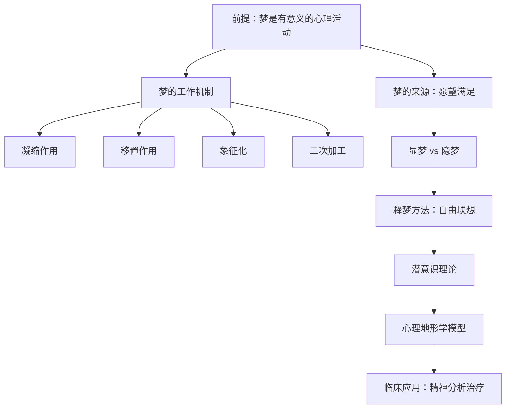

## 一、学科坐标定位

> [!abstract] 速览
> 《梦的解析》（*Die Traumdeutung*）是弗洛伊德于1899年出版的开创性著作（出版商将出版日期标为1900年），被公认为精神分析学的奠基之作。弗洛伊德在书中提出了一个革命性的核心命题：==梦是通往潜意识的皇家大道==（*Der Traum ist der Königsweg zur Kenntnis des Unbewußten im Seelenleben*）。

在此书之前，梦在科学界要么被视为纯粹的生理现象（大脑在睡眠中的随机放电），要么被视为超自然的预兆。弗洛伊德的贡献在于他首次系统性地论证：**梦是有意义的心理活动**，它遵循特定的规律，可以被科学地分析和解读。这一主张不仅改变了心理学的走向，也深刻影响了20世纪的文学、艺术和文化批评。

弗洛伊德在学科中的位置：他是精神分析学派的创始人，与荣格（后来分道扬镳）、阿德勒并称为深度心理学三大巨头。《梦的解析》与达尔文的《物种起源》、马克思的《资本论》并列为对20世纪人类自我认知影响最大的三部著作。

> [!warning] 阅读提示
> 本书成书于19世纪末，其中许多具体理论（如梦的性欲本质、俄狄浦斯情结的普适性）已在现代心理学中受到严重质疑或修正。阅读时应区分弗洛伊德开创性的方法论贡献与其具体理论结论的时代局限。

---

## 二、理论框架地图

> [!note] 全书逻辑结构
> 弗洛伊德的论证沿以下路径展开：

全书大致分为七章，核心论证链为：

1. **梦的文献综述**：回顾前人对梦的研究，指出其不足
2. **释梦方法论**：以"伊尔玛注射之梦"为范例，展示自由联想法
3. **梦是愿望的满足**：提出核心命题
4. **梦的伪装**：解释为什么梦看起来不像愿望满足
5. **梦的材料与来源**：梦的素材从何而来
6. **梦的工作**：全书理论核心——凝缩、移置、象征化、二次加工
7. **梦过程的心理学**：提出潜意识-前意识-意识的心理地形学模型

---

## 三、逐章深度拆解

### 主题一：梦是愿望的满足——核心命题

**DIKW四层提炼**

- **Data**：弗洛伊德分析了大量梦例（主要是自己的梦和患者的梦），发现每个梦在经过自由联想后，都可以追溯到一个被压抑的愿望。
- **Information**：梦不是随机的，它有一个隐藏的「意图」——满足做梦者在清醒状态下无法实现或不愿承认的愿望。
- **Knowledge**：梦是心理防御机制的产物。白天被压抑的愿望在睡眠时以伪装的形式浮现，因为审查机制（类似于心理的"守门人"）在睡眠中有所放松，但并未完全消失。
- **Wisdom**：人的心理生活远比意识层面所呈现的复杂得多。我们自以为了解自己，但大量的欲望、恐惧和记忆被压抑在潜意识中，梦是它们唯一的出口之一。

**费曼式解读**：想象你有一个严格的管家（审查机制），白天他守在门口，不让任何"不得体的客人"（被压抑的愿望）进入客厅（意识）。到了晚上管家打瞌睡了，这些客人就偷偷溜进来——但它们会乔装打扮（梦的伪装），穿上不同的衣服，这样即使管家半醒半睡地瞥一眼，也认不出它们来。这就是为什么梦看起来奇怪而混乱：不是因为梦没有意义，而是因为==意义被故意隐藏了==。

**反脆弱验证**：弗洛伊德的"所有梦都是愿望满足"这一命题在现代受到严重挑战。最明显的反例是**噩梦**和**创伤后应激障碍（PTSD）中的重复性创伤梦**——这些梦显然不是在满足愿望。弗洛伊德后来在《超越快乐原则》中引入了"死本能"概念来修补这一漏洞，但这一修补本身也饱受争议。现代神经科学研究（如Hobson的激活-合成假说）提供了完全不同的解释框架。

**类比迁移**：弗洛伊德的"梦是伪装的愿望"这个思路，可以迁移到日常生活中：人们的口误（弗洛伊德式口误）、"无意"的行为选择、甚至幽默和笑话，都可能暴露被压抑的真实意图。这一洞见即使在弗洛伊德的具体理论被修正之后，仍然具有启发价值。

---

### 主题二：显梦与隐梦——表象与本质的分离

**DIKW四层提炼**

- **Data**：弗洛伊德区分了"显梦"（manifest dream，你醒来后能回忆起的梦的内容）和"隐梦"（latent dream，隐藏在显梦背后的真实心理内容）。
- **Information**：显梦是隐梦经过"梦的工作"（dream-work）加工后的产物。释梦就是逆向工程——从显梦出发，通过自由联想还原隐梦。
- **Knowledge**：心理生活存在"表象-本质"的双层结构。我们所意识到的（无论是梦还是清醒时的想法）往往只是经过加工的表象，真正驱动行为的力量藏在表象之下。
- **Wisdom**：理解自我需要超越表面。"我做了一个奇怪的梦"不是终点，而是起点——奇怪的外表恰恰说明有什么东西在被隐藏。

**费曼式解读**：显梦和隐梦的关系就像**密码和明文**。你收到一封密码信（显梦），看起来一堆乱码。但如果你知道加密规则（梦的工作机制），就能把密码翻译回明文（隐梦）。弗洛伊德的贡献在于他声称自己找到了这套"加密规则"。

**反脆弱验证**：现代认知科学对"显梦/隐梦"的二分法持怀疑态度。有研究者认为梦不一定有"隐藏的意义"需要被解码，梦的内容可能就是大脑在整理白天信息时的副产品。但"人的心理存在多层结构"这一洞见在认知心理学中得到了不同形式的延续——内隐记忆、无意识偏见等概念都与此相呼应。

---

### 主题三：梦的工作——四大机制

这是全书理论含量最高的部分，弗洛伊德详细阐述了隐梦如何被转化为显梦的四种机制：

#### （一）凝缩作用（Condensation）

**DIKW四层提炼**

- **Data**：弗洛伊德发现，显梦通常比隐梦简短得多。一个简短的梦意象可能同时代表多个隐梦元素。
- **Information**：凝缩是指多个思想、人物、场景被"压缩"成一个单一的梦意象。
- **Knowledge**：心理活动具有高度的压缩性——一个符号可以承载多重含义。

**费曼式解读**：凝缩就像把几张不同的照片叠在一起透光看——你看到的是一个混合的影像，它同时包含了所有原始照片的信息，但没有一张照片被完整呈现。梦中出现的一个"陌生人"可能同时代表你的父亲、你的上司和你小时候的邻居。

#### （二）移置作用（Displacement）

**DIKW四层提炼**

- **Data**：梦中情感的强度往往与内容不匹配——真正重要的内容以无关紧要的方式出现，而不重要的细节反而情感强烈。
- **Information**：移置是审查机制的核心手段——通过转移注意力来隐藏真正的焦点。
- **Knowledge**：我们在清醒生活中也经常做类似的事：对真正让你愤怒的事无动于衷，却对一件小事大发雷霆。

**费曼式解读**：移置就像一个魔术师的手法——他让你盯着他的右手（梦中的显著细节），而真正的动作在左手（被压抑的愿望）。梦让你把注意力放在不重要的地方，好让真正重要的东西溜过审查。

#### （三）象征化（Symbolization）

**DIKW四层提炼**

- **Data**：弗洛伊德认为梦中存在一套相对固定的象征系统，尤其是与性相关的象征。
- **Information**：细长物体代表男性生殖器，容器和洞穴代表女性生殖器，上楼梯代表性行为，等等。
- **Knowledge**：象征化使得梦可以在不直接呈现被禁忌内容的情况下表达它。

> [!warning] 现代评价
> 弗洛伊德的象征体系是他理论中争议最大的部分。现代心理学普遍认为：梦的象征不是固定的、普遍的，而是高度个人化的。一个蛇在甲的梦中可能代表恐惧，在乙的梦中可能代表智慧，不能一刀切地套用弗洛伊德的性象征辞典。

#### （四）二次加工（Secondary Revision）

**DIKW四层提炼**

- **Data**：我们醒来后回忆梦时，会不自觉地把梦重新组织成一个"合理"的故事。
- **Information**：二次加工使梦看起来比它实际的状态更连贯、更"有逻辑"。
- **Knowledge**：人类有强烈的"叙事冲动"——即使面对混乱的材料，也要编一个说得通的故事。

**费曼式解读**：二次加工就像你拍了一段很混乱的视频，然后用剪辑软件把它整理成了一个"看起来有剧情"的短片。你以为你在回忆梦，其实你在==改编==梦。

---

### 主题四：梦的材料来源——日间残余与儿时记忆

**DIKW四层提炼**

- **Data**：弗洛伊德观察到，梦的素材主要来自两个来源：前一两天的经历（"日间残余"，Tagesreste）和遥远的儿时记忆。
- **Information**：日间残余提供了梦的"表面材料"，但真正的驱动力来自深层的、往往源自童年的愿望。日间残余只是"导火索"，童年愿望才是"火药"。
- **Knowledge**：当前的心理困扰往往与童年经历有深层联系。一个成年人对失败的焦虑，可能根植于儿时被父母否定的经历。

**费曼式解读**：日间残余就像电影的布景——它提供了梦的视觉素材（今天看到的人、去过的地方）。但电影的**剧本**来自更深的地方——你童年时未被满足的愿望、被压抑的恐惧。昨天路上看到的一条狗可能出现在你的梦里，但这条狗之所以出现，是因为它与你五岁时被狗咬的记忆产生了关联。

**反脆弱验证**：现代记忆研究（如"记忆巩固"理论）部分支持了弗洛伊德的观察——睡眠确实在处理白天的经历，将重要信息从短期记忆转入长期记忆。但"所有梦都根植于童年愿望"这一说法过于绝对，缺乏实证支持。

---

### 主题五：释梦方法——自由联想

**DIKW四层提炼**

- **Data**：弗洛伊德抛弃了此前流行的"象征辞典式"释梦法（查字典般地对照梦象与含义），转而使用"自由联想"（freie Assoziation）法。
- **Information**：具体操作是：将梦分解成若干元素，然后对每个元素进行自由联想——不加审查地说出脑海中浮现的一切想法。联想链条最终会通向被压抑的隐梦内容。
- **Knowledge**：自由联想的前提假设是：心理活动不是随机的，每一个联想都受潜意识力量的引导。
- **Wisdom**：理解自己需要放松控制。我们日常的思维受到太多社会规范和自我审查的约束，只有暂时放弃这些控制，才能接触到更深层的自我。

**费曼式解读**：自由联想就像在一个黑暗的迷宫里，你不看地图、不做计划，只是随意走。弗洛伊德的信念是：你的脚步不是随机的——你的潜意识知道出口在哪里，它会引导你的脚步，只要你不试图用理性去干预。

> [!tip] "伊尔玛注射之梦"
> 这是弗洛伊德在书中详细分析的第一个完整梦例，也是精神分析史上最著名的梦。弗洛伊德通过对这个梦的自由联想，展示了如何从一个看似无意义的梦中挖掘出与职业焦虑、人际关系和自我怀疑相关的深层心理内容。这个梦的分析过程是理解弗洛伊德方法论的最佳入口。

**反脆弱验证**：自由联想法的一个根本问题是**不可证伪性**——无论联想到什么，分析师都可以将其纳入解释框架。这使得精神分析在卡尔·波普尔眼中成为了"伪科学"的典型。此外，现代研究表明，自由联想的结果高度依赖于分析师的引导和患者的暗示感受性，其"客观性"值得怀疑。

---

### 主题六：心理地形学模型——潜意识、前意识、意识

**DIKW四层提炼**

- **Data**：弗洛伊德在全书最后一章提出了心理的"地形学模型"（topographical model），将心理活动分为三个层次：潜意识（Unconscious）、前意识（Preconscious）、意识（Conscious）。
- **Information**：潜意识是被压抑的内容的储存库，受"初级过程"（primary process）支配——不受逻辑和时间约束。意识是我们当下的觉知。前意识介于两者之间——内容不在当前意识中，但可以通过注意力调取。
- **Knowledge**：人的心理像一座冰山——意识只是露出水面的尖端，绝大多数心理活动发生在水面之下。
- **Wisdom**：自我认知的第一步是承认：==你不了解你自己==。

**费曼式解读**：想象你的大脑是一栋三层的房子。一楼（意识）灯火通明，你可以清楚看到里面的一切。二楼（前意识）灯是关的，但你随时可以上去打开灯——比如有人问你妈妈的名字，你一秒就能想起来。地下室（潜意识）的门被锁上了，你不仅看不到里面有什么，甚至不想知道里面有什么——因为那里存放着你最不愿面对的恐惧和欲望。梦就是地下室的东西趁你睡着时从门缝里溜上来。

**反脆弱验证**：弗洛伊德后来用"自我-本我-超我"的结构模型（structural model）取代了地形学模型。现代认知神经科学虽然不使用弗洛伊德的术语，但广泛接受了"大量认知加工发生在意识之外"这一基本观点——内隐学习、自动化加工、无意识决策等研究都证实了这一点。所以弗洛伊德的具体模型可能过时了，但"意识只是冰山一角"的核心洞见是经得起检验的。

---

### 主题七：梦与神经症——临床桥梁

**DIKW四层提炼**

- **Data**：弗洛伊德指出梦的工作机制与神经症症状的形成机制高度相似——两者都涉及压抑、伪装和象征性表达。
- **Information**：梦是"正常人的神经症"——每个人每天晚上都在做梦中已完成的事情，与神经症患者在清醒时做的事情（形成症状）本质相同。
- **Knowledge**：正常与异常之间没有截然的界限，只有程度的差异。

**费曼式解读**：如果说神经症是一场在白天进行的"不受控制的做梦"，那么真正的梦就是一场"安全的神经症"——它让你在睡眠的保护下体验和释放那些在清醒时会导致焦虑的心理内容。梦是心理的安全阀。

**反脆弱验证**：梦作为"心理安全阀"的说法缺乏直接的实证支持。现代睡眠研究更倾向于将REM睡眠（梦的主要阶段）与记忆巩固、情绪调节等功能联系起来，而非弗洛伊德式的"愿望满足"。但"正常与异常之间是连续谱"的观点已被现代心理学广泛接受。

---

## 四、认知偏差/效应清单

弗洛伊德在《梦的解析》中（虽然没有使用现代术语）实际上描述了多种认知现象：

| 弗洛伊德的描述 | 现代对应概念 |
|---------------|-------------|
| 审查机制对梦的伪装 | 认知失调与心理防御机制 |
| 二次加工使梦变"合理" | 叙事偏差（Narrative Bias） |
| 凝缩：一个意象代表多重含义 | 过度概括（Overgeneralization） |
| 移置：情感与内容错位 | 情感迁移（Affect Transfer） |
| 日间残余触发深层记忆 | 启动效应（Priming Effect） |
| 梦中不考虑逻辑矛盾 | 认知解离（在某些意识状态下逻辑功能减弱） |

---

## 五、自我诊断工具

> [!tip] 弗洛伊德式梦分析的简易实践

1. **记梦**：在床头放纸笔，醒来后立刻记录梦的内容，越详细越好（包括情绪）
2. **拆分元素**：将梦分解为单独的场景、人物、物品、动作
3. **自由联想**：对每个元素，不加审查地写下脑海中浮现的所有想法
4. **寻找日间残余**：梦中哪些元素与过去一两天的经历有关？
5. **识别情感核心**：梦中最强烈的情绪是什么？这种情绪在你近期的生活中是否被压抑了？
6. **不要急于"解读"**：弗洛伊德的固定象征系统不一定适用于你。关注联想过程本身，而非预设的象征含义。

---

## 六、批判性审视

> [!warning] 必须认真对待的批评

**科学方法论层面**：

1. **不可证伪性**：弗洛伊德的理论可以解释任何梦——如果梦看起来是愿望满足，那就是愿望满足；如果不是，那是因为愿望被伪装了。这种"怎么都对"的理论在科学哲学中是一个严重的缺陷（波普尔的批评）。
2. **样本偏差**：弗洛伊德的梦例主要来自自己和他的维也纳中产阶级患者，样本极不具代表性。
3. **实验验证的缺失**：弗洛伊德的大部分结论基于临床观察和自我分析，缺乏控制实验的验证。

**理论内容层面**：

4. **泛性论**：弗洛伊德对性的过度强调——几乎所有梦的象征都与性相关——即使在他的同时代人（如荣格、阿德勒）中也引起了强烈反对。
5. **文化偏见**：弗洛伊德的理论深深植根于19世纪末维也纳的文化背景——性压抑的中产阶级社会。将其普遍化到所有文化和时代是不恰当的。
6. **神经科学的挑战**：现代脑科学研究表明，梦的产生与脑干的激活、REM睡眠的生理过程密切相关。梦可能主要是神经活动的副产品，而非弗洛伊德所说的"心理意义"的载体。

**尽管如此**：弗洛伊德开创了"认真对待梦"的科学传统，提出了"潜意识"这一影响深远的概念，并发展出一套系统的（虽然有缺陷的）心理分析方法论。他的具体结论可能过时了，但他提出的==问题==——心理生活是否有隐藏的维度？——至今仍是心理学的核心命题。

---

## 七、行动改变指南

> [!note] 从《梦的解析》中可以提取的实用洞见

1. **重视你的梦**：即使不接受弗洛伊德的全部理论，关注梦的内容和情绪仍然是自我了解的有价值途径。
2. **警惕"二次加工"**：我们倾向于把混乱的经验编成合理的故事——不仅在梦中如此，在生活中也是如此。对自己的"合理化叙事"保持警觉。
3. **注意情感错位**：当你对一件小事反应过度时，考虑一下：这种情绪是否来自别处（移置）？
4. **练习"不审查"**：在写日记、头脑风暴或自我反思时，尝试暂时放弃"这个想法合不合适"的判断，让思维自由流动。
5. **承认复杂性**：你的心理生活比你以为的要复杂得多。"我不明白自己为什么这么做"不是无知，而是诚实。

---

## 八、费曼终极检验

> [!abstract] 一句话概括

如果用最简单的话解释《梦的解析》：

弗洛伊德说：你晚上做的梦不是乱七八糟的垃圾信号，而是你的内心在偷偷说话。白天你不敢想、不愿想、不允许自己想的东西，到了晚上会穿上"伪装"出现在你的梦里。你梦到的那些奇怪的画面——被追赶、在公众场合裸体、牙齿掉落——都不是随机的，它们各有各的含义，只是被"加密"了。

弗洛伊德认为自己找到了解密的方法（自由联想），并且认为密码几乎总是与性和童年有关。这后面这一点现代人不太买账了——但"你的内心比你知道的要复杂得多，梦是了解它的一个窗口"这个基本洞见，到现在仍然站得住脚。

简言之：==梦不是噪音，是信号。只是你需要学会听==。

---

## 延伸阅读路线图

> [!note] 推荐阅读路径

- [[《精神分析引论》]] — 弗洛伊德更通俗的入门著作，可作为《梦的解析》的补充
- [[《心理学与炼金术》]] — 荣格对梦的理解，与弗洛伊德形成重要对比（集体潜意识 vs 个人潜意识）
- [[《超越快乐原则》]] — 弗洛伊德后期修正梦理论的重要著作
- [[《我们为什么要睡觉》]] — 马修·沃克的现代睡眠科学科普，提供了关于梦的神经科学视角
- [[《思考，快与慢》]] — 卡尼曼的双系统理论与弗洛伊德的意识/潜意识模型有有趣的呼应
- [[《自卑与超越》]] — 阿德勒对梦的理解：梦是为未来做准备，而非回顾过去
