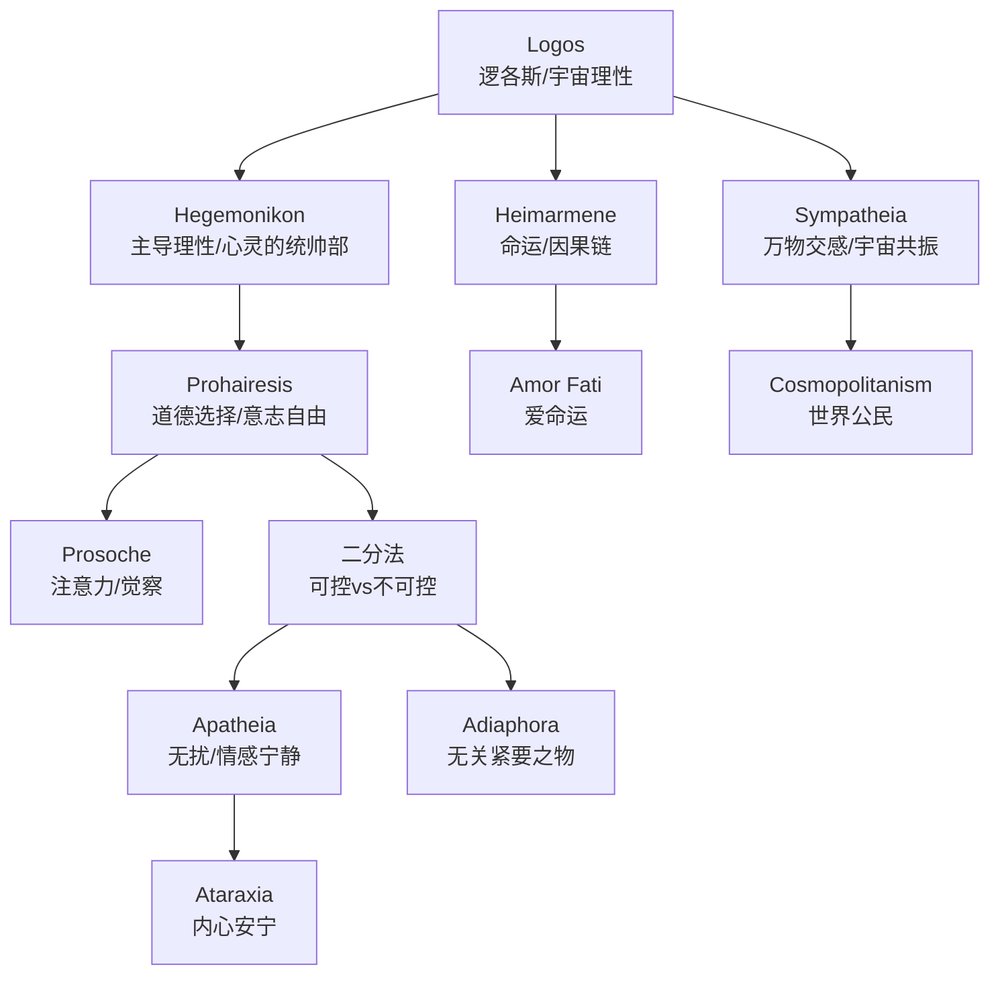
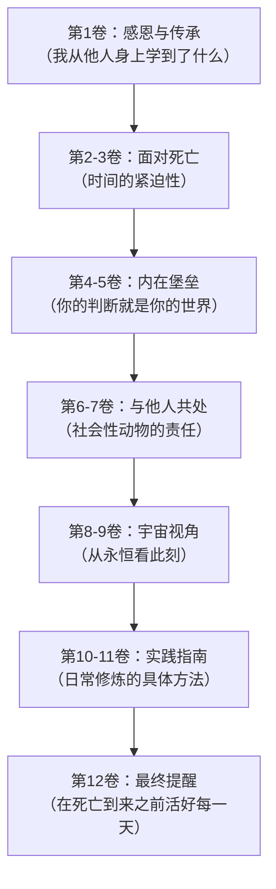
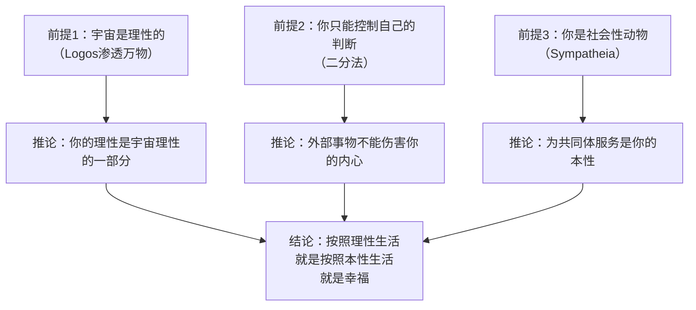
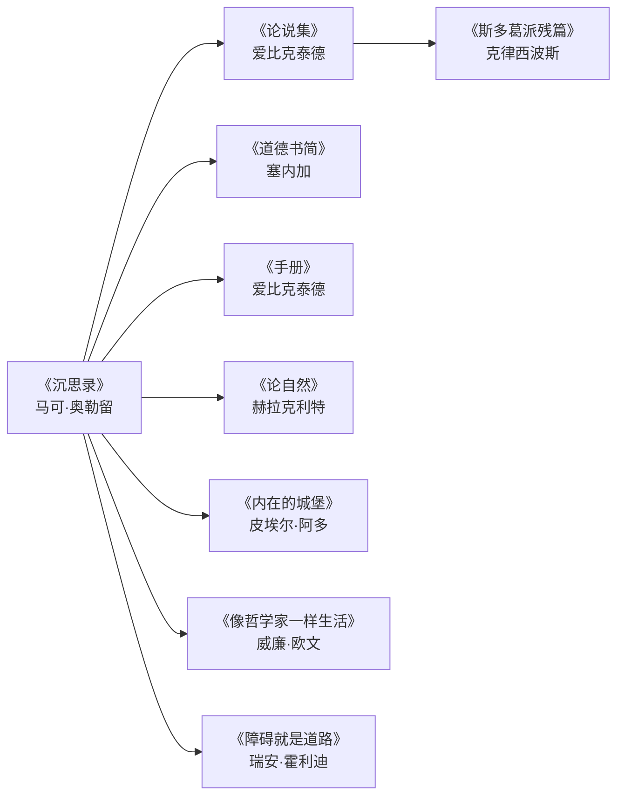

# 《沉思录》深度拆解

## 一、元信息速览

《沉思录》（*Ta eis heauton*，希腊文直译为"写给自己的东西"）是罗马帝国皇帝马可·奥勒留（公元121—180年）的私人哲学日记。这部作品从未打算出版——它是奥勒留在军营帐篷中、在帝国边境的战场旁、在瘟疫和叛乱的间隙写给自己的文字。正因为不是写给别人看的，它剥离了所有修辞上的虚荣，呈现出一种罕见的赤裸和诚实。

奥勒留是斯多葛学派（Stoicism）晚期最重要的实践者。斯多葛学派由芝诺（Zeno of Citium）于公元前三世纪在雅典创立，经由克利安西斯（Cleanthes）、克律西波斯（Chrysippus）发展，到罗马时代由塞内加（Seneca）、爱比克泰德（Epictetus）和奥勒留三人构成"罗马斯多葛"的核心三角。奥勒留的哲学老师是尤尼乌斯·鲁斯提库斯（Junius Rusticus），正是鲁斯提库斯将爱比克泰德的《论说集》介绍给他，对其思想形成了决定性影响。

==《沉思录》不是一本系统的哲学论著，而是一个人在与自身软弱、恐惧和欲望的持续搏斗中留下的战场记录。== 全书共十二卷，没有连贯的叙事线，没有章节标题——它是断片式的自我对话，同一个主题会反复出现，因为奥勒留需要反复提醒自己那些他知道但难以做到的事情。

**第一性原理追问**：
- **这本书试图回答的根本问题是什么？** ——一个人如何在无法控制外部世界的情况下，仍然活得正直、平静、有尊严？
- **这个问题为什么重要？** ——因为你面对的绝大多数痛苦，不是来自事件本身，而是来自你对事件的判断。如果你能改变判断，你就改变了痛苦。
- **它的答案的最底层假设是什么？** ——宇宙是理性的（logos），你的理性是宇宙理性的一部分，因此你有能力通过理性来掌控自己的内心世界，即使外部世界完全失控。

## 二、斯多葛哲学核心概念网络

在进入逐卷拆解之前，你需要先掌握斯多葛哲学的核心概念体系。这些概念构成了《沉思录》的底层操作系统——如果不理解它们，你只会把奥勒留的话当成"鸡汤"。

> [!abstract] 核心概念详解

### Logos（逻各斯）

**原始含义**：希腊文 *logos* 的语义极其丰富——言说、理性、比例、法则、宇宙秩序。赫拉克利特最早将它用于哲学，指称万物运行的根本法则。斯多葛学派继承并发展了这个概念，将 logos 理解为渗透宇宙一切的理性力量——它既是物理规律，也是道德法则，既是因，也是果。

**通俗解释**：你可以把 logos 理解为"宇宙的源代码"。所有事物——从星辰的运行到树叶的落下到你此刻的思考——都在这套源代码的驱动下运行。斯多葛哲学家认为，你的理性能力就是这套源代码在你身上的体现，因此你有能力"读懂"宇宙的运行逻辑，并与之协调。

### Hegemonikon（主导理性）

**原始含义**：希腊文意为"统帅的部分"，指灵魂中负责判断、同意和选择的核心机能。斯多葛学派认为灵魂是统一的（不像柏拉图分为理性、激情、欲望三部分），hegemonikon 是灵魂的指挥中心。

**通俗解释**：这是你大脑里的"最终审批人"。外部世界给你发来各种信息（有人侮辱你、天气很冷、你失去了一笔钱），这些信息到达你的 hegemonikon 之前，它们只是中性的数据。是你的 hegemonikon 盖上了"这是坏事"或"这是好事"的戳——==痛苦不在事件里，而在你的审批章里==。

### Prohairesis（道德选择）

**原始含义**：源自爱比克泰德的哲学，指人类特有的对自身判断、欲望和行为进行自由选择的能力。Prohairesis 是不可被外力剥夺的——你的身体可以被囚禁，你的财产可以被没收，但你对事物做出判断的自由始终在你手中。

**通俗解释**：这是你的"终极自由"。即使全世界都崩塌，你仍然可以选择如何看待这个崩塌。一个人打了你一拳，他控制了你的身体感受（疼痛），但他无法控制你如何回应——你可以愤怒，也可以平静；可以报复，也可以理解。这个选择的空间，就是 prohairesis。

### 二分法（Dichotomy of Control）

**原始含义**：爱比克泰德在《手册》开篇提出的根本区分——"有些事情在你的控制之内（eph' hemin），有些不在（ouk eph' hemin）"。在你控制之内的只有你的判断、欲望、厌恶和意志行为；不在你控制之内的包括身体、财产、名誉、地位——一切外在之物。

**通俗解释**：想象一个同心圆。内圈是你能控制的：你的想法、态度、努力、回应方式。外圈是你不能控制的：别人怎么看你、天气、经济形势、你是否生病。==斯多葛的核心实践就是把你全部的精力投注在内圈，对外圈的事情保持接纳而非对抗。==

### Apatheia（无扰）

**原始含义**：这个词经常被误译为"冷漠"（apathy），但含义完全不同。Apatheia 指的是不被 *pathē*（激情、冲动、非理性情感）所扰动的状态。斯多葛学派区分了 *pathē*（非理性的、基于错误判断的情感反应，如无节制的恐惧、盲目的贪欲、歇斯底里的悲伤）和 *eupatheiai*（良好的情感状态，如理性的喜悦、合理的谨慎、善意的愿望）。Apatheia 是消除前者，而非消除所有情感。

**通俗解释**：apatheia 不是让你变成石头，而是让你不再被情绪的飓风裹挟。你仍然会有感受——看到美景时的愉悦、失去朋友时的哀伤——但这些感受不会失控，不会驱使你做出你事后会后悔的事。==它是情感的清澈，不是情感的消灭。==

### Sympatheia（万物交感）

**原始含义**：斯多葛物理学的核心概念之一，指宇宙万物之间存在一种有机的联系和互相影响。宇宙不是散乱的碎片堆积，而是一个有机整体，每一部分都与其他部分相互关联。

**通俗解释**：你不是独立存在的个体，你是宇宙这张巨大网络中的一个节点。你的行为影响着网络中的其他节点，它们的变化也影响着你。理解这一点，你就不会把自己的利益与他人的利益对立起来——因为在根本层面上，你们是同一个系统的不同表达。

---

## 三、全书逻辑地图

==全书的根本论证可以压缩为一个三段式==：
1. 你无法控制外部世界（前提一）
2. 你可以完全控制自己的判断和回应（前提二）
3. 因此，你应该把全部精力放在掌控自己的内心，而非试图掌控外部世界（结论）

这个三段式在十二卷中被反复展开、从不同角度论证、用不同例子说明——因为奥勒留知道，==知道一个道理和活出这个道理之间，有一道深渊==。

---

## 四、逐卷深度拆解

### 第1卷：「感恩清单——你是所有影响过你的人的总和」

> [!tip] 一个人的哲学不是凭空产生的，它是所有他遇到的人、读过的书、经历过的事的结晶

**【核心论点】**

第1卷是一份详尽的感恩清单。奥勒留逐一列举了他从祖父、父亲、母亲、老师、朋友和神灵那里学到的品质。这不是礼节性的致谢——==它是奥勒留对自身人格形成的一次考古学挖掘==，追溯每一种美德的来源。

**【详细拆解】**

从祖父韦鲁斯（Verus），他学到了"良善的性格和不动怒"。从母亲，他学到了"虔诚、慷慨，不仅戒除恶行，而且戒除恶念"——注意这个递进：不做坏事是基础，不起坏念头才是更高要求。从老师鲁斯提库斯，他学到了"认识到自己的性格需要改进和训练"，以及"不炫耀学问"。从亚历山大（文法学家），他学到了"不挑剔别人的语言错误"。从弗朗托（修辞学老师），他学到了"注意到权力者身上的嫉妒、欺骗和虚伪"。

这份清单的哲学意义在于：它体现了斯多葛学派关于 sympatheia（万物交感）的信念——你不是一个孤立的原子，你是一张关系网络的产物。==承认你受惠于他人，不是谦虚的姿态，而是对事实的诚实认知。==

**【苏格拉底追问】**

- **追问1**：如果你的所有美德都来自他人，那"你自己"到底贡献了什么？
  - 斯多葛的回答是：你的贡献在于 *选择*。这些品质在你面前展示过，但你主动选择了去学习、去内化、去实践它们。prohairesis（道德选择）始终是你的。
- **追问2**：为什么要把感恩放在全书第一卷？
  - 因为感恩是对抗傲慢的解药。一个人如果认为自己的一切成就都是自己的功劳，他就会陷入自负——而自负会让他停止学习、停止改进。奥勒留在写这份清单的时候，已经是罗马帝国的最高统治者，世界上最有权力的人之一。即便如此，他仍然在提醒自己：你是站在别人肩膀上的。

**【金句/关键概念】**

> ==从我的祖父韦鲁斯那里，我学到了良善的性格和不动怒。==

> ==从我的母亲那里，我学到了虔诚和慷慨，不仅戒除恶行，而且戒除恶念；还有简朴的生活方式，远离富人的习气。==

---

### 第2-3卷：「死亡冥想——时间是最诚实的哲学老师」

> [!warning] 你可以推迟任何事情，除了死亡。而正是因为不能推迟，你才应该立刻开始做真正重要的事

**【核心论点】**

从第2卷开始，死亡成为贯穿全书的核心主题。奥勒留不断提醒自己：你随时可能死去。这不是悲观主义——==它是一种认知工具，用来剥除一切虚假的紧急性，暴露出什么才是真正重要的==。

**【详细拆解】**

奥勒留的死亡冥想有多个层次：

**第一层：死亡的必然性。** 亚历山大大帝死了，他的马夫也死了，他们最终去了同一个地方。奥古斯都的整个宫廷——侍从、医生、占卜师、将军——全都死了。庞贝城的居民在毫无预警的情况下被火山灰掩埋。==死亡不挑选对象，不接受贿赂，不给你准备时间。==

**第二层：死后的虚无。** 你死后，即使人们记得你，那份记忆本身也会消亡。记得你的人也会死去，记得他们的人也会死去。给你足够多的时间，一切痕迹都会被抹去。==即使是"永恒的荣耀"也不过是一个稍长一些的遗忘。==

**第三层：此刻的珍贵。** 既然死亡随时到来，既然死后一切归零，那么唯一真正属于你的就是此刻。不是昨天（已经过去），不是明天（不确定是否到来），只有现在。==你实际拥有的生命长度永远只有一个时刻。==

奥勒留在第2卷第4节写道："不要仿佛你将活一千年那样行事。死亡悬在你头上。趁你还活着，趁你还能够，成为一个好人。"

这里的"成为一个好人"不是抽象的道德劝诫，而是斯多葛实践的核心：按照你的理性本性（logos）生活，履行你作为社会成员的责任，不被激情所控制。

**【苏格拉底追问】**

- **追问1**：如果死后一切归零，那做好人还有什么意义？
  - 斯多葛的回答是：你做好人不是为了死后的奖赏（这不是基督教），而是因为做好人本身就是目的。理性地、有德性地生活，是你作为拥有 logos 的存在的自然功能——就像眼睛的功能是看，耳朵的功能是听，你作为理性存在的功能是理性地生活。你不需要问"看有什么意义"——看就是眼睛的存在方式。
- **追问2**：反复冥想死亡不会导致抑郁吗？
  - 对奥勒留来说恰恰相反。死亡冥想是一种==净化剂==——它把一切不重要的焦虑（名声、面子、争执）都溶解掉，只留下真正重要的东西。你不再为下周的会议焦虑，因为你可能活不到下周。这不是让你放弃一切，而是让你在确认"这件事真的值得我投入精力"之后，更全然地投入。

**【第一性原理分析】**

死亡冥想的底层逻辑是：==注意力是你最稀缺的资源，而死亡的确定性是帮你分配注意力的最可靠标准==。当你意识到时间有限，你自然会停止把时间浪费在无关紧要的事情上。这不需要任何信仰前提，不需要灵魂不朽的假设——它只需要你承认一个事实：你会死。

**【金句/关键概念】**

> ==不要仿佛你将活一千年那样行事。死亡悬在你头上。趁你还活着，趁你还能够，成为一个好人。==

> ==即使你能活三千年，活一万年，你也应该记住：没有人失去另一种生活，除了他正在过的这种；也没有人过另一种生活，除了他正在失去的这种。最长的生命和最短的生命最终是一样的。==

---

### 第4-5卷：「内在堡垒——你的判断就是你的整个世界」

> [!note] 斯多葛哲学的核心工程：在你的内心建造一座任何外力都无法攻破的堡垒

**【核心论点】**

这两卷集中阐述了《沉思录》最核心的哲学主张：==事物本身不会伤害你，你对事物的判断才会==。一个事件发生了——某人侮辱了你、你生了病、你失去了财产。事件本身是中性的（adiaphora，无关紧要之物）。让它变成"坏事"的，是你的 hegemonikon（主导理性）对它做出的判断。如果你能改变判断，你就改变了体验。

**【详细拆解】**

奥勒留在第4卷第3节提出了"内在堡垒"（*inner citadel*）的著名比喻——这个概念后来被皮埃尔·阿多（Pierre Hadot）发展为理解《沉思录》的核心框架。

奥勒留写道："人们寻求退隐之处——乡间、海滨、山区。你也常常渴望这样的退隐。但这完全是一种庸人的想法，因为你随时可以退隐到自己的内心。一个人没有比自己的内心更安静、更少烦扰的退隐之处了——尤其是当他的内心拥有这样的品质：只需注视它们，他就立即获得完全的安宁。"

这段话的哲学意义在于：==你不需要改变你所处的环境来获得平静，你需要改变的是你对环境的判断==。你在城市中感到焦虑，不是因为城市噪音太大，而是因为你判断"噪音是令人烦躁的"。如果你撤回这个判断，噪音就只是空气的振动——它不再有能力伤害你。

第5卷进一步展开了"判断"的机制。奥勒留区分了三个层次：

1. **印象（phantasia）**：外部世界给你的原始感官数据——你看到一个人皱眉、你听到一句话、你感到身体疼痛
2. **判断（hypolepsis）**：你对这个印象的解读——"他在对我皱眉因为他看不起我"、"那句话是在侮辱我"、"这个疼痛意味着我要死了"
3. **同意（synkatathesis）**：你的 hegemonikon 接受或拒绝这个判断

==斯多葛的修炼就发生在第2和第3步之间。== 印象是自动到来的，你无法阻止一个想法出现在你脑中。但你可以选择是否"同意"这个想法——是否接受它作为对现实的准确描述。当有人侮辱你时，"被侮辱了"的印象会自动出现，但你可以在"同意"之前按下暂停键，问自己："这个判断是真的吗？即使它是真的，它能伤害我的 prohairesis 吗？"

**【苏格拉底追问】**

- **追问1**：如果一切痛苦都来自判断，那身体的疼痛呢？你能通过改变判断来消除牙疼吗？
  - 斯多葛学派的回答是诚实的：你无法消除牙疼的感觉（那是身体层面的事，属于"不可控"的范畴），但你可以改变你对牙疼的态度——你可以不在身体疼痛之上再叠加"我怎么这么倒霉"、"这不公平"之类的精神痛苦。身体疼痛是一层；关于疼痛的痛苦是第二层。斯多葛试图消除的是第二层。
- **追问2**：这和"自欺欺人"有什么区别？
  - 区别在于方向。自欺欺人是用一个虚假的判断替换真实的判断（"我其实不疼"）。斯多葛的做法是==更准确地==判断——把"这件事太可怕了"修正为"这件事发生了，它不在我的控制之内，我能控制的只有我的回应"。这不是逃避现实，而是更精确地面对现实。
- **追问3**：如果所有外在事物都是 adiaphora（无关紧要的），那你还需要做任何事吗？
  - 这是对斯多葛学派最常见的误解。Adiaphora 不是说这些东西"不存在"或"不值得追求"，而是说它们不构成你的幸福的==必要条件==。健康、财富、声誉——这些是"优先选择的无关紧要之物"（preferred indifferents）。你可以合理地追求它们，但你不能把你的幸福绑定在获得它们之上。因为一旦你这样做，你就把自己的内心和平交给了运气。

**【金句/关键概念】**

> ==事物本身不触及灵魂，它们无法进入灵魂内部。灵魂的扰动只来自灵魂内部的判断。==

> ==你有权力支配你的心灵——而非外部事件。认识到这一点，你将找到力量。==

> ==如果你因为任何外在的东西而痛苦，困扰你的不是那个东西本身，而是你关于它的判断。而消除这个判断，此刻就在你的能力之内。==

> [!example] 实践练习：判断暂停术
> 当你感到愤怒、焦虑或沮丧时，尝试以下步骤：
> 1. 识别触发你的印象（phantasia）——具体发生了什么？
> 2. 识别你自动做出的判断（hypolepsis）——你告诉自己这意味着什么？
> 3. 追问这个判断：它是事实还是解读？它在你的控制之内吗？即使最坏的情况是真的，它能破坏你的理性和德性吗？
> 4. 如果答案是"不能"，撤回你的同意（synkatathesis），让印象只是印象。

---

### 第6-7卷：「社会性动物——你的责任不止于自身」

> [!important] 斯多葛不是隐士哲学，它要求你在人群中实践德性

**【核心论点】**

如果只读到第4-5卷，你可能以为斯多葛是一种"向内撤退"的哲学——只管好自己的内心就行了。第6-7卷纠正了这个理解。奥勒留反复强调：==人是社会性动物（*zoon politikon*），你天生就是为共同体服务而存在的==。退回内心不是为了逃避世界，而是为了更好地在世界中行动。

**【详细拆解】**

奥勒留的社会哲学建立在两个斯多葛信念之上：

**第一，sympatheia（万物交感）**。你不是一个独立的原子，你是宇宙有机体的一部分，就像手是身体的一部分。手如果说"我不关心身体的其他部分"，它就违背了自己的本性。同样，你如果说"我不关心其他人"，你就违背了你作为社会性存在的本性。

**第二，cosmopolitanism（世界公民主义）**。斯多葛学派创造了"世界公民"这个概念——你不仅仅属于你的城市或你的国家，你属于整个人类共同体。奥勒留作为罗马皇帝，统治着一个多民族、多文化的庞大帝国。他在第6卷第44节写道："我的城邦和我的祖国，作为安东尼努斯是罗马，作为人是整个世界。"

这两个信念直接导出一条实践原则：==当别人伤害你时，你的第一反应不应该是愤怒，而应该是理解==。奥勒留给出了一套处理人际冲突的系统方法：

1. **记住对方也有 logos**。他做出你不喜欢的行为，是因为他的 hegemonikon 做出了错误的判断——他真心认为自己做的是对的。无知不是罪恶，而是需要被纠正的认知错误。
2. **记住你自己也犯过类似的错误**。你有什么资格对别人的过失愤怒？你自己难道没有伤害过别人吗？
3. **记住对方的行为不在你的控制之内**。他怎么做是他的事，你怎么回应是你的事。把精力花在你能控制的部分。
4. **记住愤怒伤害的是你自己，不是对方**。当你对别人生气时，你的内心安宁已经被破坏了——而对方可能根本不知道你在生气。

奥勒留在第7卷第22节给出了一段极其精辟的分析："不以善意对待别人的人在做什么？他在伤害自己。一个做不义之事的人在做什么？他在对自己不义——因为他使自己变坏了。"

**【苏格拉底追问】**

- **追问1**：如果别人的行为"不在你的控制之内"，那你还需要阻止不义吗？
  - 当然需要。"不在你控制之内"不等于"你不应该尝试改变它"。奥勒留作为皇帝，每天都在做决策、发布法令、领导军队。他的意思不是"放任一切发生"，而是"尽你最大的努力去做正确的事，但不要把你的内心和平绑定在结果上"。你能控制的是你的努力，不是结果。
- **追问2**：反复提醒自己"不要生气"，会不会压抑情绪？
  - 斯多葛的目标不是压抑愤怒，而是==不产生==愤怒——或者更准确地说，不"同意"愤怒。当你真正理解了对方的行为是出于无知而非恶意时，你的愤怒自然消解——就像当你知道一个三岁小孩不是故意打翻你的咖啡时，你不需要"压抑"愤怒，因为愤怒根本不会生起。

**【金句/关键概念】**

> ==每天早晨对自己说：今天我将遇到干涉多事的人、忘恩负义的人、傲慢的人、欺诈的人、嫉妒的人、孤僻的人。他们之所以这样，是因为他们不能分辨善与恶。但我，已经认识到善的本性是美的，恶的本性是丑的，而做错事者的本性与我是同类的——不是同一种血统或种子，而是分享同一种理性和神性——我不可能被他们中的任何一个所伤害，因为没有人能把丑恶强加于我；我也不能对我的同类发怒或憎恨他。==

---

### 第8-9卷：「宇宙视角——从永恒的尺度看此刻」

> [!abstract] 当你把自己的烦恼放在宇宙的尺度上衡量，它们就自动缩小到了正确的比例

**【核心论点】**

这两卷中，奥勒留频繁使用一种思维技术，后人称之为"俯瞰视角"（*view from above*）——==想象自己从太空俯瞰地球，看到人类的一切活动、战争、欢庆、悲伤，在宇宙的尺度上不过是尘埃中的短暂涟漪==。这种视角转换不是让你轻视人生，而是帮你把当下的烦恼放在正确的比例中。

**【详细拆解】**

奥勒留的宇宙视角有三个维度：

**空间维度**：亚洲和欧洲不过是宇宙的角落。大海不过是一滴水。阿陀斯山不过是一粒土。整个当下时间不过是永恒中的一个点。一切都是微小的、不稳定的、正在消逝的。（第6卷第36节）

**时间维度**：想想有多少医生在给别人开过处方之后自己死了；有多少占星家在预言过别人的死期之后自己死了；有多少哲学家在无尽地讨论过死亡和不朽之后自己死了。想想整个战争——如此轰轰烈烈——然后是沉默。想想整个文明——诞生、繁荣、衰落、消亡。==你正在焦虑的那件事，在一百年后，将没有任何人记得它。==（第4卷第48节）

**本体维度**：一切事物都在变化之中。奥勒留大量引用了赫拉克利特的"万物流变"（*panta rhei*）思想：你无法踏入同一条河流两次，因为河流在变，你也在变。你此刻拥有的一切——身体、财产、关系、身份——都是暂时的形态，它们正在消散，正在回归到宇宙物质的循环之中。

这三个维度共同指向一个结论：==如果你能从足够远的距离、足够长的时间、足够深的层次来看待你此刻的困境，你就会发现它根本不值得你的 hegemonikon 为之动摇==。

**【第一性原理分析】**

俯瞰视角的底层原理是==比例校准==。你的大脑天生倾向于放大眼前的事物——系统1（用[[《思考，快与慢》]]的框架来说）会把当下的刺激当作最重要的信息。俯瞰视角是一种刻意的认知矫正——它强迫你的系统2介入，重新评估事件的真实重要性。你不是在否认问题的存在，你是在把它放在正确的比例尺上。

**【金句/关键概念】**

> ==在时间的河流中，一切有形之物不过是一场梦和一缕烟。==

> ==想想物质的深渊和时间的深渊，想想一切形式的短暂。==

> ==亚历山大大帝和他的马夫在死后进入了同样的状态。==

---

### 第10-12卷：「实践修炼——如何将哲学变成日常操作」

> [!tip] 哲学不是你读的东西，而是你做的东西

**【核心论点】**

最后三卷是奥勒留最密集的"实践指南"。他把前面九卷讨论的哲学原则转化为可操作的日常修炼。==哲学不是学术活动，而是一种生活方式——一套你每天早晨醒来、每个瞬间都需要实践的操作系统。==

**【详细拆解】**

奥勒留的实践体系可以归纳为以下几个核心修炼：

**修炼一：晨间预想（*praemeditatio malorum*）**

每天早晨起床时，预先想象你今天可能遇到的最坏情况：你会遇到粗鲁的人、你的计划会失败、你会听到坏消息。通过提前想象这些，你削弱了它们真正发生时对你的冲击力。==这不是悲观主义，而是心理上的防弹衣==。

**修炼二：客观描述术（*phantasia kataleptike*）**

当你面对一个让你动情的事物时，用最客观、最朴素的语言重新描述它。一道美味的菜肴？"这是一条鱼的尸体。"一件紫色的皇帝袍子？"这是沾了贝类动物血液的羊毛。"性行为？"两具身体的摩擦和一点液体的排出。"

这种"去魅"描述的目的不是让你厌恶一切，而是==训练你看穿事物表面的光环，看到它们的实质==。当你不再被表象迷惑，你就能做出更清醒的判断。

**修炼三：当下专注（*prosoche*）**

你唯一拥有的时间是此刻。不是昨天，不是明天，只有现在。奥勒留反复提醒自己：不要为过去的事后悔（它已不可改变），不要为未来的事焦虑（它尚未发生），把你全部的注意力集中在此刻的行动上。

**修炼四：夜间反省**

一天结束时，回顾你今天的行为：你在哪些时刻失去了内心的平静？你做出了哪些不当的判断？你在哪些地方可以做得更好？这不是自我鞭挞，而是==冷静的自我审计==——就像一个公正的第三方在检查你一天的账目。

**修炼五：死亡提醒（*memento mori*）**

在一天中的随机时刻提醒自己：你可能很快就会死去。你正在做的这件事，值得你用生命中仅剩的时间来做吗？如果答案是否定的，停下来，去做那件值得的事。

**【苏格拉底追问】**

- **追问1**：这些修炼是否只适合帝王或特权阶层？
  - 恰恰相反。斯多葛哲学在罗马时代最重要的三位代表中，爱比克泰德是一个奴隶。他被主人打断过腿。但他的哲学核心——prohairesis 不可被剥夺——正是在最极端的不自由中锻造出来的。这些修炼不需要任何外部条件：不需要钱、不需要时间、不需要安静的环境。你可以在通勤的地铁上做晨间预想，可以在排队等待时练习当下专注。
- **追问2**：客观描述术会不会让你丧失对美的感受？
  - 奥勒留自己在第3卷中给出了一段著名的反驳：他描述了面包在烘焙时表面裂开的纹路如何具有一种独特的美，成熟的橄榄在即将掉落前如何呈现最美的色泽，老人脸上的皱纹如何有自己的尊严。==客观描述术的目的是让你看穿虚假的美（社会建构的地位象征），而不是让你失去对真实之美的感受力。==

**【金句/关键概念】**

> ==不要把剩余的生命浪费在揣测别人身上，除非你能将这种揣测与某个共同利益联系起来。==

> ==做你正在做的最后一件事一样去做每一件事。==

> ==在你将要死去的时候，如果你已经不再把感官的享乐和痛苦当作终极善恶，也不再把未来看得比现在更重要，你就已经活够了。==

---

## 五、核心论证的第一性原理还原

让我们把《沉思录》的全部思想还原到最底层的几个前提：

> [!question] 苏格拉底式终极追问

**如果前提1是错的呢？** 如果宇宙不是理性的，而是混沌的、无意义的，斯多葛伦理学还成立吗？

奥勒留自己在第6卷第10节面对了这个问题。他给出了一个令人惊讶的回答：==即使宇宙只是原子的随机碰撞（伊壁鸠鲁学派的观点），你仍然应该按照理性和德性生活——因为这是你唯一能做的、有意义的事==。换句话说，斯多葛伦理学的核心主张——控制你能控制的，接纳你不能控制的——并不严格依赖于宇宙有一个理性秩序的形而上学前提。即使在一个无意义的宇宙中，你仍然可以选择有尊严地、理性地活着。

**如果前提2被推到极端呢？** 如果真的"只有判断在你的控制之内"，那一个正在被折磨的人，只要改变判断，就不痛苦了吗？

这是对斯多葛学派最尖锐的批评之一。现实的回答是：斯多葛的修炼是一种"渐近线"——你不断趋近完美的 apatheia，但可能永远无法完全到达。身体的剧烈疼痛确实会侵入你的意识，斯多葛哲人也会痛。区别在于：==训练过的心灵在痛苦中保持清醒和自由的时间更长，被击倒后重新站起来的速度更快==。

---

## 六、概念网络：《沉思录》与其他思想的对话

> [!info] 概念网络映射

### 与佛教的交叉

斯多葛的"判断产生痛苦"与佛教"无明生诸苦"高度相似。两者都认为痛苦的根源不在外部世界，而在你对外部世界的认知方式。但方向不同：佛教的终极目标是超越自我（涅盘），斯多葛的目标是==强化自我的理性核心==。佛教说"我"是幻象；斯多葛说"我"的理性是宇宙中最真实的东西。

与[[《悉达多》]]的比较尤为有趣：悉达多拒绝了所有现成的教义，认为智慧只能通过亲身体验获得。奥勒留则几乎完全建立在爱比克泰德的教义之上——他不是在寻找新的真理，而是在反复训练自己去实践已知的真理。==悉达多的问题是"什么是正确的道路"，奥勒留的问题是"我知道正确的道路，但如何让自己每天都走在上面"。==

### 与存在主义的交叉

萨特的"人是被抛入世界的"与斯多葛的"接受你无法控制的一切"有呼应。但萨特强调的是==绝对自由带来的焦虑==，奥勒留强调的是==接受限制带来的安宁==。存在主义者在自由面前感到眩晕，斯多葛者在必然性面前感到平静。

### 与认知行为疗法（CBT）的交叉

现代认知行为疗法的创始人亚伦·贝克（Aaron Beck）和阿尔伯特·埃利斯（Albert Ellis）都明确承认斯多葛哲学的影响。CBT的核心技术——识别自动思维、质疑认知扭曲、用更准确的判断替换不合理的判断——与奥勒留在第4-5卷中描述的"判断暂停术"几乎完全相同。==《沉思录》可以被视为人类历史上最早的认知行为治疗手册之一。==

### 与[[《穷查理宝典》]]的交叉

芒格的"反转思维"——不要想如何成功，先想如何避免失败——与斯多葛的 *praemeditatio malorum*（预想最坏情况）如出一辙。芒格本人也在多次演讲中引用过斯多葛哲学家的话。两者的共同点在于：==通过思考最坏的情况来减少你对最坏情况的恐惧，从而让你在实际操作中更加冷静和理性==。

---

## 七、终极提炼：如果只记住三句话

> [!success] 全书精髓的最终蒸馏

1. ==你有权力支配你的心灵——而非外部事件。认识到这一点，你将找到力量。==（二分法的核心）

2. ==不要仿佛你将活一千年那样行事。死亡悬在你头上。趁你还活着，趁你还能够，成为一个好人。==（死亡冥想的核心）

3. ==事物本身不触及灵魂。灵魂的扰动只来自灵魂内部的判断。==（内在堡垒的核心）

---

## 八、延伸阅读网络

---

*本笔记基于《沉思录》通行希腊文版本及多个中英文译本综合整理，核心概念以希腊文原文为准。方法论采用第一性原理还原、苏格拉底追问和概念网络映射三重框架。*
