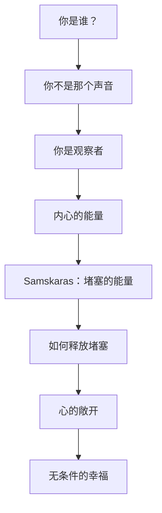
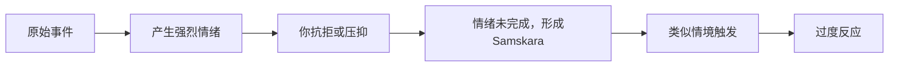
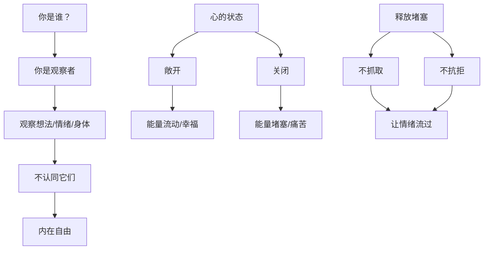

# 《清醒地活》深度拆解

## 一、心理学坐标定位（400字）

《清醒地活》（The Untethered Soul）是美国灵性作家迈克尔·辛格的代表作，2007年出版后成为《纽约时报》畅销书。这本书探讨的核心问题是：==你不是你的想法，你不是你的情绪，那么"你"到底是谁？==

> [!abstract] 核心主题
> 辛格的核心洞见是：**真正的"你"是那个观察想法和情绪的意识，而非想法和情绪本身**。当你认同了这一点，你就能从内心的噪音中解脱出来。

本书的核心框架：
- **内在的声音是什么**
- **为什么我们会被困住**
- **如何获得内在自由**
- **心的敞开与关闭**

> [!tip] 方法论选择
> 本书属于灵性成长/心理学类，采用==费曼学习法 + 苏格拉底追问 + DIKW金字塔==进行拆解，侧重认知转变和实践体验。

---

## 二、全书逻辑地图（500字）

**全书论证链条**：

1. **提出问题**：头脑里不断有声音在说话，那个声音是"你"吗？
2. **认识观察者**：真正的"你"是那个能观察到声音的意识
3. **理解能量**：情绪和想法都是能量，会流动或堵塞
4. **识别堵塞**：过去的创伤在内心形成"结"（Samskaras）
5. **释放之道**：不是压抑，而是让能量自然流过
6. **终极自由**：当心始终敞开，你就获得了无条件的幸福

---

## 三、逐章深度拆解

### 第一部分：「觉醒的意识」

#### 第一章：你头脑里的声音

**【核心论点】**

注意一下：你的头脑里几乎总是有一个"声音"在说话。它评论一切、担心未来、回忆过去。==问题是：那个声音是"你"吗？还是你能"听到"那个声音的存在？==

**【DIKW四层提炼】**

| 层级 | 内容 |
|------|------|
| Data | 闭上眼睛，你会发现头脑里有不断的内在对话 |
| Information | 这个声音评论一切，从不停止 |
| Knowledge | 如果你能听到这个声音，那么"你"和"声音"是分离的 |
| Wisdom | ==真正的"你"是那个观察者，不是那个声音== |

**【苏格拉底式追问】**

- 如果那个声音是"你"，那么谁在听那个声音？
- 如果你能观察到自己在思考，那么"思考者"和"观察者"哪个是真正的你？
- 那个声音真的代表真相吗？还是只是一种习惯性的噪音？

**【费曼式解读】**

想象你坐在电影院里看电影：
- **电影**是你的想法和情绪
- **观众（你）** 是那个看电影的意识

大多数人的问题是：他们==忘记了自己是观众，以为自己就是电影==。当电影里的角色悲伤时，他们就悲伤；当角色恐惧时，他们就恐惧。

但如果你记得"我是观众"，你就能看电影而不被电影控制。

---

#### 第二章：你真正的内在

**【核心论点】**

真正的"你"是==觉察本身==（awareness itself）。不是被觉察的对象，而是觉察的主体。

**【DIKW四层提炼】**

| 层级 | 内容 |
|------|------|
| Data | 你能观察到想法、情绪、身体感觉 |
| Information | 这些被观察的对象会变化 |
| Knowledge | 但"观察"本身不变 |
| Wisdom | ==你是那个不变的观察者，不是变化的对象== |

**【关键概念】**

> "你不是你的身体，因为你能观察身体。你不是你的情绪，因为你能观察情绪。你不是你的想法，因为你能观察想法。那么你是什么？你是那个在观察的。"

---

### 第二部分：「体验能量」

#### 第三章：谁在控制？

**【核心论点】**

内在的声音不断试图控制外部世界，让一切符合它的偏好。但这种控制是一种==监狱==，而非自由。

**【DIKW四层提炼】**

| 层级 | 内容 |
|------|------|
| Data | 我们花大量精力试图控制外界 |
| Information | 这是因为我们的幸福依赖于外界条件 |
| Knowledge | 但外界是不可控的，所以我们永远焦虑 |
| Wisdom | ==真正的自由是内在的，不依赖于外界== |

**【费曼式解读】**

想象你在一个房间里，房间的温度代表外界环境：
- **控制型的人**：不断调整空调，试图让温度永远完美。但空调总会出问题，所以他永远焦虑。
- **自由的人**：学会了无论温度如何，都能保持内在的平静。

==自由不是控制外界，而是不被外界控制==。

---

#### 第四章：无条件的幸福

**【核心论点】**

大多数人的幸福是"有条件的"——如果工作顺利我就幸福，如果感情顺利我就幸福。但真正的幸福是==无条件的==，它来自内在，而非外界。

**【DIKW四层提炼】**

| 层级 | 内容 |
|------|------|
| Data | 我们总是设定条件："等我...我就会幸福" |
| Information | 但条件满足后，我们又会设定新条件 |
| Knowledge | 有条件的幸福是一个永远追不上的目标 |
| Wisdom | ==幸福是一个决定，不是一个结果== |

> [!tip] 核心洞见
> 你可以现在就决定幸福。不是等外界条件符合预期，而是选择无论如何都敞开心扉。

---

### 第三部分：「释放自己」

#### 第五章：无限的能量

**【核心论点】**

你内在有无限的能量源泉（辛格称之为Shakti），但这个能量常常被堵塞。==当你敞开时，能量流动；当你关闭时，能量堵塞==。

**【DIKW四层提炼】**

| 层级 | 内容 |
|------|------|
| Data | 有时你感到充满活力，有时感到疲惫 |
| Information | 这与外界事件有关，但更与你的内在状态有关 |
| Knowledge | 当心敞开时，能量流动；当心关闭时，能量堵塞 |
| Wisdom | ==管理能量不是获取更多，而是停止堵塞== |

**【费曼式解读】**

想象你的内心是一个水管：
- **水源**是无限的能量
- **堵塞**是你的恐惧、执着、抗拒

问题不是水源不够，而是管道被堵了。==你不需要寻找能量，你需要清除堵塞==。

---

#### 第六章：心的创伤

**【核心论点】**

过去的创伤会在内心形成"结"（Samskaras）。这些结是==未完成的情绪体验==，它们存储在你的心理系统中，会被类似的情境触发。

**【DIKW四层提炼】**

| 层级 | 内容 |
|------|------|
| Data | 某些情境会莫名其妙地让你情绪激动 |
| Information | 这是因为它触发了过去的创伤 |
| Knowledge | 过去的情绪没有被完全经历，所以存储下来了 |
| Wisdom | ==释放创伤的方法是允许情绪完全流过== |

**【Samskaras 的形成】**

> [!warning] 常见误区
> 我们以为保护自己就是不让自己感受痛苦。但实际上，正是这种抗拒导致了能量堵塞。==让情绪流过，它就会消失；抗拒情绪，它就会存储==。

---

#### 第七章：放手与自由

**【核心论点】**

释放堵塞的方法不是分析、不是理解，而是==放手==。当不舒服的感觉升起时，不抓取、不抗拒，只是让它流过。

**【DIKW四层提炼】**

| 层级 | 内容 |
|------|------|
| Data | 当你感到不舒服时，你会做什么？ |
| Information | 大多数人会抗拒或转移注意力 |
| Knowledge | 但这样做只是延迟问题，不是解决问题 |
| Wisdom | ==真正的解决是放手——让感觉流过而不抓取== |

**【费曼式解读】**

想象情绪是河里的水：
- **抓取/抗拒**就像试图挡住水流，水会在你那里积聚
- **放手**就像让水自然流过，水来了又走了

==不是你要"做"什么来释放情绪，而是你要"停止做"那些阻碍情绪流动的事情==。

**【实践方法】**

> [!tip] 放手的步骤
> 1. 注意到不舒服的感觉升起
> 2. 放松身体，特别是心脏区域
> 3. 不分析、不判断、不抗拒
> 4. 让感觉存在，看着它自然消退

---

### 第四部分：「超越自我」

#### 第八章：让心保持敞开

**【核心论点】**

辛格用"心的敞开与关闭"来描述我们对生活的态度。==每一刻，你都在选择：敞开心扉还是关闭心扉==。

**【DIKW四层提炼】**

| 层级 | 内容 |
|------|------|
| Data | 有时你对生活充满热情，有时你麻木冷漠 |
| Information | 这与你的"心"是敞开还是关闭有关 |
| Knowledge | 心的敞开是一种选择，不是外界决定的 |
| Wisdom | ==无论发生什么，你都可以选择保持心的敞开== |

**【关键概念】**

> "你可以选择一生中心都敞开，或者一生中心都关闭。这与外面发生什么无关，完全取决于你。"

---

#### 第九章：死亡与永恒

**【核心论点】**

对死亡的意识可以==让你更清醒地活==。当你意识到生命有限，你会问：我真正想要的是什么？

**【DIKW四层提炼】**

| 层级 | 内容 |
|------|------|
| Data | 我们都会死 |
| Information | 但我们活得好像永远不会死 |
| Knowledge | 这让我们浪费时间在不重要的事情上 |
| Wisdom | ==死亡意识让你看清什么是真正重要的== |

**【费曼式解读】**

想象今天是你生命的最后一天：
- 你还会为那件小事生气吗？
- 你还会担心别人怎么看你吗？
- 你还会把时间花在不重要的事情上吗？

==死亡是生命的老师==。它提醒你什么是真正重要的。

---

## 四、核心框架提炼（800字）

### 辛格的内在自由模型

### 三个核心洞见

| 洞见 | 含义 | 实践 |
|------|------|------|
| **你是观察者** | 你不是想法，不是情绪，你是觉察本身 | 练习观察内在声音 |
| **敞开vs关闭** | 每一刻你都在选择心的状态 | 选择无论如何都敞开 |
| **放手** | 释放不是对抗，而是不抓取 | 让情绪流过而不执着 |

### 与其他思想体系的关联

> [!note] 跨传统的共鸣
> - **佛教**：类似于"无我"和"正念"的概念
> - **斯多葛哲学**：与"控制你能控制的"相呼应
> - **存在主义**：关于选择和自由的主题
> - **心理学**：与正念疗法、接纳承诺疗法有相似之处

---

## 五、批判性思考（800字）

### 优势与贡献

1. **深刻的认知转变**：从"我是我的想法"到"我是观察想法的意识"
2. **简洁有力**：复杂的灵性概念被表达得清晰易懂
3. **实用导向**：不只是理论，更是生活方式的指导

### 局限与反思

> [!warning] 需要审慎思考的问题
> 1. **过度简化**：心理创伤的处理可能需要更专业的支持
> 2. **灵性绕过**：可能被误用为逃避现实问题的借口
> 3. **文化背景**：源自东方灵性传统，需要适应不同文化语境

### 与心理学的对话

| 心理学概念 | 辛格的对应 |
|------------|------------|
| 认知脱钩 | "你不是那个声音" |
| 情绪调节 | "让能量流过" |
| 正念 | "做观察者" |
| 接纳 | "不抗拒" |

---

## 六、行动清单（500字）

### 立即可做（本周）

- [ ] **观察内在声音**：每天花5分钟，只是注意头脑里在说什么
- [ ] **练习不认同**：当有负面想法时，说"我注意到我在想..."
- [ ] **身体觉察**：注意情绪在身体中的感受位置

### 中期实践（本月）

- [ ] **敞开练习**：每当注意到心在关闭时，主动选择敞开
- [ ] **放手实验**：当不舒服的感觉升起时，尝试不抗拒、不分析，只是让它存在
- [ ] **死亡冥想**：每天问自己"如果今天是最后一天，我会做什么？"

### 长期修炼

- [ ] **无条件幸福**：练习在任何情境下选择敞开和幸福
- [ ] **持续觉察**：将"观察者"的意识融入日常生活
- [ ] **释放Samskaras**：耐心地允许旧的情绪模式释放

---

## 七、延伸阅读路线图（300字）

| 书籍 | 关联 |
|------|------|
| [[《当下的力量》]] | 埃克哈特·托利的正念经典，与本书理念相通 |
| [[《臣服实验》]] | 辛格的自传，展示他如何践行这些原则 |
| [[《正念的奇迹》]] | 一行禅师的入门指导 |
| [[《活出生命的意义》]] | 弗兰克尔关于超越苦难的洞见 |
| [[《被讨厌的勇气》]] | 阿德勒心理学，关于自我与自由 |

---

## 八、费曼终极检验（400字）

**如果用一句话向朋友解释这本书的核心观点：**

> 你不是你的想法，不是你的情绪——你是那个能观察到想法和情绪的意识。当你不再认同那些内在噪音时，你就自由了。

**这本书改变了什么认知：**

1. **关于"我"**：从"我是我的想法"转向"我是观察者"
2. **关于情绪**：从"控制/压抑"转向"让它流过"
3. **关于幸福**：从"有条件的"转向"无条件的选择"

**留下的思考：**

这本书的核心洞见——==你是观察者，不是被观察的对象==——看似简单，但真正体验它需要持续的练习。

最让我印象深刻的是辛格关于"心的敞开与关闭"的比喻。我们以为关闭心扉是在保护自己，但实际上，关闭只会让能量堵塞，让痛苦持续。==真正的保护是敞开——让一切流过，而不被任何东西困住==。

这本书不是要你变成一个冷漠的人，而是要你成为一个==能够完全体验生活、却不被生活困住的人==。
