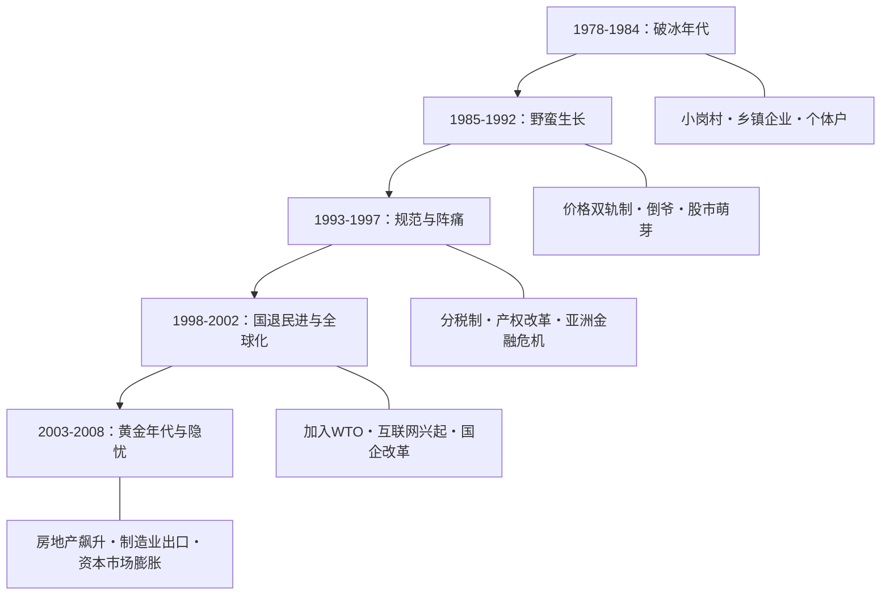
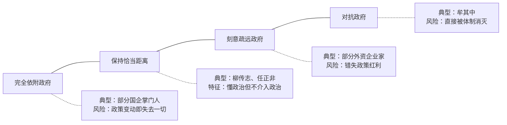
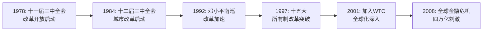
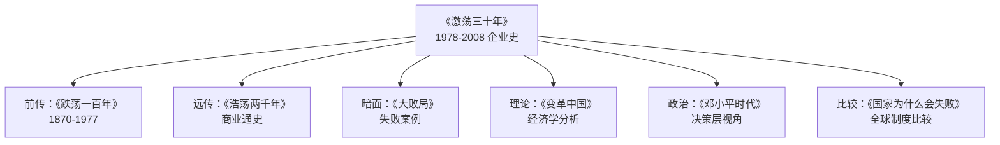

## 一、史学坐标定位

> [!abstract] 速览
> 《激荡三十年》是财经作家吴晓波的代表作，分上下两册，分别于2007年和2008年出版。上册覆盖1978—1992年，下册覆盖1993—2008年。全书以编年体的方式，逐年记录中国改革开放三十年间企业变革与经济制度演进的历程，是国内第一部系统性的当代中国企业史。

这本书的写作野心在于：==用企业和企业家的命运来折射一个国家的转型==。它不是一部宏观经济学著作，也不是一部政策分析文本，而是以「人」和「公司」为单位，编织出一张三十年的历史之网。吴晓波在序言中写道：「过去的三十年是如此的辉煌，特别对于沉默了百年的中华民族，它承载了太多人的光荣与梦想，它是几乎一代人共同成长的全部记忆。」

**在中国当代史写作中的位置**：在吴晓波之前，中国企业史的写作几乎是空白。官方史学侧重宏观政策，学术界聚焦经济增长数据，媒体关注热点事件。吴晓波做的事情是==将微观的企业命运嵌入宏观的制度变迁中==，让读者看到改革不是抽象的政策文件，而是一个个具体的人在具体的约束条件下做出的选择。

**可对话的著作**：本书可与[[《大败局》]]（同为吴晓波作品，聚焦失败案例）、黄仁宇的[[《万历十五年》]]（大历史视角）、费正清的《剑桥中国史》、科斯与王宁的《变革中国》（从产权经济学角度分析中国改革）形成对话。与科斯等经济学家的分析框架不同，吴晓波的叙事更贴近新闻纪实传统，强调故事性和画面感。

---

## 二、叙事结构地图

> [!note] 编年体架构
> 全书采用严格的编年体结构，以年份为章节单位，每年选取数个标志性企业事件或政策节点展开叙述。这种结构本身就是一种史学立场——它暗示改革是逐年推进的、渐进的、非线性的过程，而非一个顶层设计的线性展开。

吴晓波将三十年大致划分为几个阶段，虽未明言，但读者可以从叙事密度和情感基调中识别出来：

**编年体的优势与局限**：编年体让读者感受到历史的「现场感」——你跟着时间线走，不知道下一年会发生什么，这与身处其中的企业家的感受是一致的。但它的局限在于，一个贯穿多年的企业故事被切割到不同章节中，读者需要自行拼接（例如联想的故事散布在多个年份中）。吴晓波试图通过在每年开头的宏观综述和年末的总结来弥补这一结构性缺陷。

**叙事节奏的特征**：吴晓波擅长在宏大叙事与微观细节之间快速切换。一段话可能在谈中央政策文件，下一段就跳到某个温州农民如何偷偷开办工厂。这种切换制造出一种「==历史是在庙堂与江湖之间同时发生的==」的阅读感受。

---

## 三、核心主题深度拆解

### 主题一：制度变迁的「摸着石头过河」逻辑

> [!tip] DIKW 金字塔
> - **Data（数据）**：1978年中国GDP总量仅3679亿元人民币；2008年突破30万亿元。1978年城镇化率约17.9%；2008年接近46%。
> - **Information（信息）**：这些数字背后是一系列制度变革——农村联产承包责任制、经济特区、价格双轨制、分税制、国企改革、加入WTO等。每一项改革都不是一步到位的，而是在争议、试验、妥协中逐步推进。
> - **Knowledge（知识）**：中国改革的核心特征是「增量改革」——不直接触动既有利益格局，而是在边缘地带开辟新空间。乡镇企业是在国企体制之外生长的，经济特区是在计划经济体制之外划出的试验田，价格双轨制是在计划价格和市场价格之间找到的过渡方案。
> - **Wisdom（智慧）**：当你面对一个庞大的、惯性极强的存量系统时，直接改造它的代价可能是灾难性的（苏联的休克疗法是反面教材）。更智慧的做法是在边缘培育增量，让增量的活力逐渐侵蚀存量的惰性。这不是事先设计的最优路径，而是在约束条件下的务实选择。

**苏格拉底追问**：

- **追问一**：「摸着石头过河」究竟是一种智慧，还是一种无奈？吴晓波倾向于将其描述为一种务实的智慧，但你也可以追问：如果当时有更好的理论指导，是否可以减少改革中的浪费和牺牲？价格双轨制催生了大量寻租行为和腐败，这是不是「摸着石头过河」必须付出的代价？
- **追问二**：渐进式改革是否有「锁定效应」？某些早期的制度安排（如土地财政、户籍制度）在初期是合理的权宜之计，但随着时间推移变成了难以撼动的利益格局。吴晓波在书中对此有所触及，但未深入展开。
- **追问三**：谁是改革的主体？是中央决策者、地方官员、还是草根企业家？吴晓波的叙事暗示三者之间存在复杂的博弈关系——中央提供政策空间，地方官员选择性执行，草根企业家在灰色地带冒险试探。

**心智模型：「灰色地带」模型**

> [!important] 核心心智模型
> 理解中国改革的一把钥匙是「灰色地带」概念。在计划经济向市场经济转型的过程中，大量经济活动既不完全合法，也不完全非法，而是处于一种模糊的灰色状态。乡镇企业挂靠集体名义、私营企业戴「红帽子」、价格双轨制下的「倒爷」——这些都是在制度缝隙中生长出来的经济形态。这个灰色地带既是创新的温床（给了企业家行动的空间），也是腐败的温床（权力寻租在模糊中滋生）。

你可以用一个比喻来理解这个模型：想象一座老房子要翻新。你不能把住户赶出去推倒重建（那是休克疗法），于是你在旁边先搭一个临时棚屋（灰色地带），让一部分住户搬过去。棚屋不合建筑规范，但它解决了眼前的问题。随着新房子逐渐建成，棚屋被拆除，住户搬入新居。但问题是：有些棚屋住久了，住户不愿搬了，棚屋本身也形成了利益格局。

---

### 主题二：企业家群体的涌现与分化

> [!tip] DIKW 金字塔
> - **Data**：书中涉及的企业家超过百位，包括柳传志（联想）、张瑞敏（海尔）、任正非（华为）、鲁冠球（万向）、年广久（傻子瓜子）、牟其中、史玉柱等。
> - **Information**：这些企业家可以按出身、路径和结局进行分类——有从国企体制内创业的（柳传志、张瑞敏），有草根起家的（鲁冠球、年广久），有体制内下海的（陈东升），有灰色地带起步的（牟其中）。他们的命运分化极为剧烈：有的成为商业领袖，有的锒铛入狱，有的销声匿迹。
> - **Knowledge**：企业家命运的分化不完全取决于商业能力，更取决于他们与制度环境的互动方式。那些懂得在制度框架内寻找空间、与政府保持恰当距离的企业家（如柳传志、任正非），往往能长期存活；那些过于激进地挑战制度边界的（如牟其中），则往往折戟沉沙。
> - **Wisdom**：在一个制度环境不完善的转型经济体中，企业家的核心能力不仅仅是「做生意」，更是「==在不确定的制度环境中管理风险==」。这种能力在成熟市场经济体中不那么重要，但在中国语境下却生死攸关。

**苏格拉底追问**：

- **追问一**：吴晓波笔下的企业家形象是否过于英雄化？书中大量使用「枭雄」「草莽英雄」等词汇来描述早期企业家，这种叙事框架是否遮蔽了企业家行为中不那么光彩的一面——比如环境破坏、劳工剥削、偷税漏税？
- **追问二**：「企业家精神」在中国语境下意味着什么？在熊彼特的定义中，企业家是「创造性破坏」的执行者。但在吴晓波的叙事中，中国企业家的核心行动更像是「创造性适应」——他们不是在破坏旧制度，而是在旧制度的缝隙中找到生存之道。
- **追问三**：那些失败的企业家是否得到了公平的叙述？吴晓波在[[《大败局》]]中集中讨论了失败案例，但在《激荡三十年》中，失败者往往作为成功者的对照组出现，而非被当作独立的历史主体来分析。

**心智模型：「政商关系光谱」模型**

吴晓波的叙事反复印证一个模式：==在中国经商，最安全也最有效的位置是光谱上的B区——与政府保持恰当距离==。太近则受制于人，太远则错失机遇，对抗则自取灭亡。这并非吴晓波的价值判断，而是他从三十年企业史中归纳出的经验模式。

**我的评论**：这个模式揭示了中国商业环境的一个深层特征——企业家的自由度是有条件的、被框定的。你可以在框架内尽情发挥创造力，但框架本身不可挑战。这与美国硅谷「颠覆一切」的企业家文化形成了鲜明对比。理解这个差异，对于理解中国商业生态至关重要。

---

### 主题三：国有经济与民营经济的博弈

> [!tip] DIKW 金字塔
> - **Data**：1978年，国有经济占工业总产值的比重超过77%。到2008年，民营经济已贡献了超过60%的GDP。但在石油、电信、金融、铁路等领域，国有企业仍保持垄断地位。
> - **Information**：这三十年间，国有经济与民营经济的关系经历了多次反复——从最初民营经济被视为「补充」，到1990年代中期「抓大放小」的国企改革，再到2004年前后「国进民退」的争论。
> - **Knowledge**：中国经济体制的核心特征不是纯粹的市场经济，也不是纯粹的计划经济，而是一种==「混合所有制」结构==，国有经济和民营经济在不同领域、不同层面上并存、竞争、互补。
> - **Wisdom**：所有制问题不仅仅是经济效率问题，更是政治权力问题。国有经济的存在不仅是为了经济目标（如自然垄断行业的规模效应），更是为了政治目标（如维持国家对关键领域的控制力）。理解中国经济必须同时理解这两个维度。

**苏格拉底追问**：

- **追问一**：「国退民进」还是「国进民退」？吴晓波在下册中记录了2004年的「郎顾之争」（郎咸平质疑顾雏军在国企改制中侵吞国有资产），这场争论暴露了一个根本性问题：国有资产的产权如何界定？谁有权出售？以什么价格出售？这些问题至今未完全解决。
- **追问二**：民营企业的「原罪」问题。许多第一代民营企业家在创业初期都有程度不同的违规行为（因为当时的制度本身就是模糊的）。这些历史「原罪」是否应该被追究？如果追究，是否会打击后来者的创业信心？如果不追究，是否构成对公平的背叛？吴晓波记录了这一争论但未给出明确立场。

**多视角审视**：

| 视角 | 核心观点 | 代表人物/流派 |
|------|---------|-------------|
| 自由市场派 | 民营经济效率更高，国有经济应进一步退出竞争性领域 | 张维迎、茅于轼 |
| 新左派 | 国有经济是社会公平的保障，私有化导致贫富分化 | 郎咸平（部分立场） |
| 制度经济学派 | 关键不是所有制形式，而是产权是否清晰、治理结构是否完善 | 科斯、周其仁 |
| 吴晓波的隐含立场 | 倾向于肯定民营经济的活力，但承认国有经济在特定领域的必要性 | — |

**我的评论**：吴晓波在这个问题上的立场是谨慎的——他的叙事明显对民营企业家有更多的同情和敬意，但他没有走到主张全面私有化的地步。这种平衡可能是出于真诚的认知，也可能是出于出版环境的约束。作为读者，你需要意识到这种叙事倾向的存在。

---

### 主题四：全球化进程中的中国企业

> [!tip] DIKW 金字塔
> - **Data**：2001年12月11日中国正式加入WTO。加入WTO前，中国外贸总额约5098亿美元；到2008年，已超过2.56万亿美元，成为世界第三大贸易国。
> - **Information**：全球化对中国企业的影响是双向的——一方面，中国的廉价劳动力和制造能力吸引了大量外资和代工订单；另一方面，外资企业的进入也对国内企业形成了竞争压力，倒逼技术升级和管理改善。
> - **Knowledge**：中国的全球化路径是「==以开放促改革==」——通过引入外部竞争来打破内部的垄断和惰性。加入WTO的谈判过程本身就是一场国内利益的大重组。
> - **Wisdom**：全球化不是一个中性的技术过程，而是一场权力博弈。在全球价值链中，中国企业长期处于「微笑曲线」的底部——制造环节利润最薄，品牌和技术环节利润最厚。吴晓波在书中已经隐约感受到这个问题，但在2008年的时间节点上，这个问题尚未充分暴露。

**苏格拉底追问**：

- **追问一**：中国的「世界工厂」地位是一种成就还是一种陷阱？吴晓波在下册中记录了大量制造业企业的故事，它们以极低的利润率为全球品牌代工。这种模式创造了就业和外汇，但也锁定了中国企业在价值链低端的位置。
- **追问二**：全球化的「国内代价」是什么？环境污染、劳工权益、区域差距——这些是中国融入全球经济体系所付出的隐性成本。吴晓波对此有所提及，但叙事的主旋律仍然是积极的、向上的。

**心智模型：「压缩的现代化」模型**

> [!important] 核心概念
> 西方发达国家用两三百年完成的工业化、城市化、全球化进程，中国试图在三十年内压缩完成。这种「压缩的现代化」意味着：不同阶段的问题同时出现——你一边在解决温饱问题，一边在应对信息化挑战；一边在建设基础工业，一边在参与全球竞争。这种多重时间线的叠加，是理解中国改革复杂性的关键。

---

### 主题五：资本市场的野蛮生长

> [!tip] DIKW 金字塔
> - **Data**：1990年12月上海证券交易所成立，1991年7月深圳证券交易所正式运营。1992年深圳「8·10事件」——数十万人涌入深圳抢购股票认购证，引发骚乱。
> - **Information**：中国资本市场从一开始就带有强烈的行政色彩——上市名额由政府分配，股价受政策影响巨大，「政策市」特征明显。
> - **Knowledge**：资本市场的建立不仅仅是一个金融技术问题，更是一个制度信任问题。在缺乏完善法治和信息披露制度的环境下，资本市场容易沦为投机和寻租的工具。
> - **Wisdom**：一个健康的资本市场需要三个前提条件：清晰的产权制度、可靠的信息披露机制、有效的法律执行。中国在三十年内建立了资本市场的「形」，但这三个「神」的建设是滞后的。

**苏格拉底追问**：

- 吴晓波记录了早期股市的种种乱象——内幕交易、庄家操纵、上市公司造假。这些问题是「发展中的问题」（即时间会解决），还是「制度性的问题」（即不改变根本制度就无法解决）？从2008年回看，两种因素兼而有之。

---

## 四、历史模式识别

> [!abstract] 从三十年的叙事中，可以识别出以下反复出现的模式

**模式一：「试点—推广」循环**

几乎所有重大改革都遵循这个路径：先在局部地区试验（如经济特区、农村改革），成功后推广到全国，失败则悄然终止。这个模式的优势是降低风险，劣势是速度较慢且可能导致地区差异扩大。

**模式二：「危机驱动型改革」**

许多关键改革不是在形势一片大好时推出的，而是在危机倒逼下产生的。1978年的改革开放源于「文革」后的经济崩溃边缘；1994年的分税制改革源于中央财政的窘迫；1998年的国企改革源于大面积亏损和亚洲金融危机的冲击。==中国的改革往往是「逼出来的」，而非「想出来的」。==

**模式三：「让一部分人先富起来」的分配逻辑**

改革的红利从来不是均匀分配的。沿海先于内陆，城市先于农村，体制内先于体制外（在某些阶段），资本拥有者先于劳动力提供者。这种非均衡发展策略在初期加速了整体增长，但也埋下了贫富分化的种子。

**模式四：「每逢X年必有大事」的政治经济周期**

吴晓波的编年体叙事无意中揭示了一个模式：重大政策变动往往与政治周期（党代会、政府换届）相关联。企业家学会了「看政治日历做生意」。

**模式五：「先做后说」的行动逻辑**

吴晓波反复记录一种现象：很多改革是先有基层的自发实践，后有高层的政策追认。小岗村的包产到户、温州的私营经济、深圳的「三来一补」——都是先「做」了再「说」的。这种「先做后说」的逻辑与西方「先立法后执行」的制度建设路径截然不同。

**我的评论**：这些模式的识别帮助你建立一个理解中国改革的分析框架。但需要警惕的是，「模式」本身是后验的——当你知道了结果再回头看过程，总能找到规律。真正在历史中的人，面对的是无法预测的混沌。吴晓波的叙事有时过于强调「必然性」，而低估了「偶然性」在历史中的角色。

---

## 五、史学方法论审查

> [!warning] 方法论反思
> 作为读者，你需要对吴晓波的史学方法保持清醒的审视。

**1. 史料来源**

吴晓波的主要史料来源包括：公开出版物（报纸、杂志、年鉴）、企业家访谈、政策文件、个人观察。他在书中较少引用学术研究成果和统计数据的原始来源。这使得他的叙事生动可读，但在学术严谨性上有所欠缺。部分关键情节（特别是涉及政商互动的内容）的信源不够清晰，读者难以独立验证。

**2. 叙事偏向**

- **地域偏向**：书中对沿海地区（尤其是浙江、广东、北京）的企业故事着墨甚多，对中西部地区的关注明显不足。这既反映了改革的地理不均衡，也可能与吴晓波本人的信息网络（他长期居住在杭州）有关。
- **行业偏向**：制造业和商业零售领域的故事较多，金融、农业、能源等领域的覆盖相对薄弱。
- **性别偏向**：书中几乎没有女性企业家的身影。董明珠、张茵等人物在叙事中几乎缺席，这是一个显著的盲点。
- **阶层偏向**：叙事的主角是企业家和决策者，普通工人、农民工、消费者的声音几乎听不到。==改革的代价由谁承担==这个问题，在这本书中没有得到充分回答。

**3. 分析框架的局限**

吴晓波的分析框架偏重于「制度—企业家」的互动，对技术变迁、人口结构、国际地缘政治等因素的关注不够。例如，中国制造业的崛起不仅仅是制度改革和企业家精神的结果，还与全球产业链转移、人口红利、教育体系等因素密切相关。

**4. 与其他史学传统的比较**

| 维度 | 吴晓波 | 年鉴学派（如布罗代尔） | 科斯/诺斯（制度经济学） |
|------|--------|---------------------|---------------------|
| 核心关注 | 人与事件 | 长时段结构 | 制度与交易成本 |
| 叙事方式 | 新闻纪实 | 分析性叙述 | 理论建模 |
| 时间尺度 | 年 | 世纪 | 跨时代比较 |
| 优势 | 可读性强，画面感佳 | 揭示深层结构 | 逻辑严密 |
| 局限 | 分析深度有限 | 忽视个人能动性 | 抽象，远离现实 |

**我的评论**：吴晓波的定位更接近「优秀的商业记者」而非「经济史学家」。这不是贬义——他的价值恰恰在于他用记者的敏感和作家的文笔，让三十年的企业史变得「可读」。但你在阅读时需要意识到，这是一种特定视角下的历史叙述，而非全景式的学术研究。

---

## 六、以史鉴今

> [!quote] 吴晓波在书中写道
> 「所有的历史叙述本质上都是当代史。」

**鉴照一：制度与创新的关系**

三十年的企业史反复证明：==制度环境决定了创新的方向和形式==。在产权不清晰的环境下，企业家倾向于短期投机而非长期研发；在政策不确定的环境下，企业倾向于「赚快钱」而非「做品牌」。如果你希望理解当下中国企业为什么在某些领域创新活跃（如互联网应用）而在另一些领域进展缓慢（如基础科学、原创药物），回到制度环境的分析是必要的。

**鉴照二：周期性思维**

吴晓波的叙事揭示了中国经济的周期性特征——大约每隔几年就会出现一次调控与放开的摆动。理解这种周期性，对于你在商业决策中的时机选择有直接的参考价值。但需要注意的是，过去的周期不保证未来的重复——随着中国经济体量的增大和全球格局的变化，周期的形态和长度都可能发生变化。

**鉴照三：「灰色地带」的警示**

书中大量企业家在灰色地带中崛起，也有大量企业家在灰色地带中陨落。这提醒你：在制度不完善的环境中经商，短期的「灰色操作」可能带来超额收益，但长期来看，制度的完善是不可逆的趋势，早期的灰色行为可能成为日后的定时炸弹。

**鉴照四：全球化的双刃剑**

2008年全球金融危机的爆发恰好是本书的结尾。站在今天回看，全球化的风险在此后进一步显现——贸易摩擦、供应链脆弱性、技术脱钩等问题，都是吴晓波在书中已经隐约感知但未能充分展开的议题。

**鉴照五：企业家精神的时代性**

第一代企业家的核心能力是「胆量」——在制度空白中敢于行动。第二代企业家的核心能力是「管理」——在竞争加剧中提升效率。而当下的企业家可能需要第三种能力：「技术创新」——在全球竞争中建立不可替代的核心优势。吴晓波的叙事提醒你，==企业家精神不是一成不变的，它必须随制度环境的演化而进化==。

---

## 七、费曼终极检验

> [!success] 用最简单的语言复述核心内容

如果你只有五分钟向一个完全不了解这本书的人解释它，你可以这样说：

「1978年，中国还是一个几乎没有私营企业的计划经济国家。到2008年，它变成了世界第三大经济体，拥有数以百万计的私营企业。《激荡三十年》讲的就是这中间发生了什么。

这三十年发生了什么？简单说，就是一群人——从最高领导人到最底层的农民和小贩——在一个巨大的、不确定的、没有先例的转型过程中，各自寻找自己的出路。有人成功了，有人失败了，有人在灰色地带中游走。没有一个总设计师画好了蓝图让大家照着执行——更像是一群人在黑暗中摸索，互相碰撞，走出了一条谁都没有预见到的路。

这本书最有价值的地方，不是告诉你结果（结果你已经知道了——中国经济腾飞），而是让你看到过程——那些你以为理所当然的事情，在当时是多么不确定、多么冒险、多么充满争议。它让你理解：==改革不是一个决定，而是无数个决定的叠加==；经济增长不是一条直线，而是一条在政策、机遇、危机和人性之间反复震荡的曲线。」

**费曼式追问：如果你只能从这本书中带走一个观念，那应该是什么？**

==制度和人的互动塑造历史==。制度提供了约束和激励的框架，人在框架内（有时在框架外）行动。好的制度释放人的创造力，坏的制度压抑人的创造力。但制度本身也是人创造的——它不是从天而降的，而是在博弈、试错和妥协中逐渐形成的。理解这一点，你就理解了这三十年的核心逻辑。

---

## 八、延伸阅读路线图

> [!note] 根据你的兴趣方向选择延伸阅读

**如果你想更深入理解中国改革的经济学逻辑：**
- [[《变革中国》]] — 罗纳德·科斯 & 王宁：从产权经济学角度分析中国改革，提出「边缘革命」概念，与吴晓波的叙事形成理论互补。
- 《中国的经济制度》 — 张五常：从合约理论角度解释中国经济的运行机制。
- 《转轨经济学》 — 热若尔·罗兰：比较不同国家的经济转型路径。

**如果你想了解更多中国企业家的故事：**
- [[《大败局》]]（I & II）— 吴晓波：聚焦失败案例，是《激荡三十年》的「暗面」。
- 《联想风云》 — 凌志军：详细记录联想的创业与成长。
- 《下一个倒下的会不会是华为》 — 田涛 & 吴春波：从内部视角呈现华为的管理哲学。

**如果你想将中国改革放在全球比较的视野中：**
- 《国家为什么会失败》 — 德隆·阿西莫格鲁 & 詹姆斯·罗宾逊：从包容性制度与汲取性制度的框架理解不同国家的发展差异。
- 《枪炮、病菌与钢铁》 — 贾雷德·戴蒙德：从更长的时间尺度理解文明发展的差异。

**如果你想理解中国改革的政治维度：**
- 《邓小平时代》 — 傅高义：以邓小平为核心的改革史叙事，视角与吴晓波互补。
- 《中国国家治理的制度逻辑》 — 周雪光：从组织社会学角度分析中国的治理结构。

**如果你想跟踪吴晓波后续的写作：**
- 《跌荡一百年》 — 吴晓波：将视野拓展到1870—1977年的中国企业史，是《激荡三十年》的「前传」。
- 《浩荡两千年》 — 吴晓波：追溯到更久远的中国商业传统。

---

> [!quote] 最终反思
> 《激荡三十年》的价值不在于它是一部完美的历史著作——它不是——而在于它是中国第一次有人试图用编年体的方式、以企业和企业家为主角，系统地记录这场人类经济史上罕见的转型实验。它的缺陷（史料单薄、分析欠深、视角偏颇）恰恰标识了中国企业史研究尚待填补的空间。作为读者，你从这本书获得的最大收益不应该是「知道了什么」，而是==「学会了怎样提问」==——对改革、对制度、对企业家、对你自己所处的时代，提出更好的问题。
