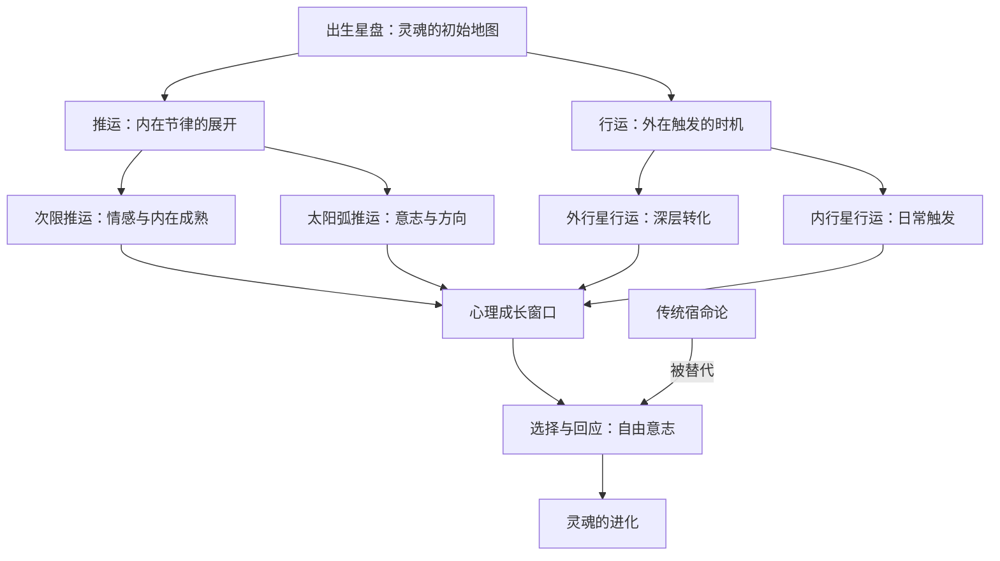

## 一、学科坐标定位

> [!info] 学科交叉位置
> 本书位于==进化占星学==的核心领域，是弗里斯特继《内在的天空》之后的进阶之作，专注于==推运==（Progressions）和==行运==（Transits）的解读方法论。

史蒂芬·弗里斯特是进化占星学派的代表人物之一。与传统宿命论占星学不同，进化占星学强调占星学是一种"选择的地图"而非"命运的蓝图"。本书的核心立场是：行运和推运揭示的不是"将要发生什么"，而是"灵魂在这个时期面临什么成长课题"。

在学科谱系中，弗里斯特继承了[[丹恩·鲁迪尔]]（Dane Rudhyar）开创的人本主义占星学传统，同时融入了当代心理学的成长导向思维。与[[丽兹·格林]]的心理占星学相比，弗里斯特更强调个体的主动选择和意志力量，较少强调无意识的深层动力。与传统预测占星学相比，弗里斯特完全放弃了"事件预测"的野心，将所有行星动态都转化为"心理-灵性成长机会"的语言。

本书适合已经掌握出生星盘基本解读能力、希望学习动态占星技术的读者。需要注意的是，弗里斯特写作风格富有诗意和灵性色彩，这使得他的文字极具感染力，但也可能模糊了某些论证的逻辑边界。

## 二、理论框架地图

弗里斯特的理论框架建立在几个关键前提上：

**前提一：出生星盘是起点而非终点。** 它描述的是灵魂此生选择的"初始设定"，但人如何回应这些设定，取决于个体的意识水平和选择。

**前提二：推运反映内在时钟。** ==次限推运==（Secondary Progressions）尤其是次限月亮的周期（约27.3年一个完整循环），标示着个体内在情感成熟的节律。==太阳弧推运==（Solar Arc Directions）则标示着意志和人生方向的演变。

**前提三：行运反映外在触发。** 行运行星（特别是==土星==、==天王星==、==海王星==、==冥王星==的行运）与本命星盘形成的相位，标示着外在环境向个体提出的成长挑战。

**前提四：自由意志是核心。** 同样一个冥王星行运过本命太阳的相位，可以表现为毁灭性的失控，也可以表现为深刻的自我转化——关键在于个体如何选择回应。

## 三、逐章深度拆解

### 第一部分：进化占星学的哲学基础

> [!note] DIKW四层提炼
> - **Data**：弗里斯特区分了三种占星学取向——宿命论（事件必然发生）、心理学取向（星盘反映心理模式）、进化论取向（星盘反映灵魂的成长课题）
> - **Information**：进化占星学假设意识可以成长，星盘描述的模式不是固定的，而是可以被提升的
> - **Knowledge**：进化占星学的核心操作是：将每一个占星配置都解读为一个从"低频表达"到"高频表达"的光谱，个体的任务是向高频端移动
> - **Wisdom**：占星学的真正价值不在于预测未来，而在于照亮当下的选择空间

**费曼式解读：** 想象你拿到一份城市地图。宿命论占星师会说"这张地图显示你必须沿着这条路走到这个目的地"。心理占星师会说"这张地图显示了你内心的道路模式"。弗里斯特作为进化占星师则说"这张地图显示了所有可能的路径，有些更容易走但通往平庸的地方，有些更艰难但通往更美的风景——你来选择"。关键词是==选择==。弗里斯特始终坚持：星盘不是判决书，而是选择菜单。

**反脆弱验证：** 弗里斯特的"进化"框架有一个内在的哲学优势：它在原则上不可能被生活事件"证伪"，因为任何困难都可以被解读为"成长机会"。但这也恰恰是它的认识论弱点——一个永远无法被否定的理论，也很难被视为严格意义上的"知识"。弗里斯特本人似乎意识到了这一点，他在书中反复强调这是一种"哲学选择"而非"科学证明"。

**类比迁移：** 弗里斯特的进化占星学与积极心理学有相似的精神气质——两者都拒绝将人视为被动的受害者，都强调个体的能动性和成长潜力。区别在于积极心理学有实证研究支撑，而进化占星学目前主要依赖个案叙事和哲学论证。

### 第二部分：推运——内在生命的节律

> [!note] DIKW四层提炼
> - **Data**：次限推运的技术原理是"一天等于一年"——出生后第30天的行星位置对应人生第30年的内在状态
> - **Information**：次限月亮约每2.5年换一个星座，约27.3年完成一个完整循环；次限太阳约30年换一个星座
> - **Knowledge**：次限月亮的星座和宫位变化标示着个体情感需求和安全感来源的周期性转变；次限太阳的变化标示着核心身份认同的缓慢演变
> - **Wisdom**：人的内在不是静止的，而是有自身节律的——理解这些节律有助于与自己的内在变化合作而非对抗

**费曼式解读：** 想象你出生时是一颗种子。这颗种子自带一个"生长时间表"——什么时候发芽、什么时候长叶、什么时候开花。推运就是这个时间表。它不取决于外界天气（那是行运的领域），而是种子自身的内在程序。

==次限月亮==是情感生命的"季节时钟"。它每2.5年左右换一个星座，这意味着你的情感需求、安全感来源、本能反应模式大约每2.5年会发生一次微妙但可感知的转变。比如，次限月亮从巨蟹座移入狮子座时，你可能会发现自己从一个"渴望安全和归属"的阶段转入一个"渴望表达和被看见"的阶段。

==次限太阳==的移动更缓慢（约30年换一个星座），它标示着你核心身份认同的长期演变。一个太阳在处女座的人，如果次限太阳移入天秤座，可能会发现自己逐渐从"关注细节和完善"转向"关注关系和平衡"。

**反脆弱验证：** 推运的"一天等于一年"规则在技术上是占星传统的约定，缺乏物理机制上的解释。为什么是"一天等于一年"而不是其他比例？弗里斯特没有回避这个问题，但他的回答本质上是实用主义的——"因为它在实践中有效"。这种实用主义立场可以被理解为一种认识论上的诚实，也可以被批评为回避了核心问题。

**类比迁移：** 推运的概念类似于发展心理学中的"阶段论"——如埃里克森的心理社会发展八阶段。两者都假设人的心理发展有内在的阶段性节律，只是推运用天文周期来标定这些节律，而发展心理学用实证观察。

### 第三部分：行运——外在世界的触发

> [!note] DIKW四层提炼
> - **Data**：行运指当前天空中行星的实际位置与出生星盘中行星位置之间形成的相位关系
> - **Information**：外行星（土星、天王星、海王星、冥王星）的行运持续时间长、影响深远；内行星行运短暂且频繁
> - **Knowledge**：每颗外行星的行运对应特定类型的心理挑战——土星对应责任与限制、天王星对应突破与解放、海王星对应溶解与灵性、冥王星对应死亡与重生
> - **Wisdom**：行运不是"降临到你头上的命运"，而是"灵魂为自己安排的课程表"

**费曼式解读：** 如果推运是种子自带的生长时间表，行运就是天气。天气不是你能控制的——暴风雨会来，阳光也会来。但你可以选择如何回应天气：暴风雨来了，你可以躲在屋里等它过去，也可以学会在风中起舞。

弗里斯特对四颗外行星行运的解读极具特色：

==土星行运==被比喻为"严厉的老师"。当土星过境你的本命金星时，你的关系领域会面临"考试"——不健康的关系可能结束，健康的关系需要更大的承诺和付出。弗里斯特强调，土星的课题不是惩罚，而是成熟。

==天王星行运==被比喻为"闪电"。它突然打破你以为稳固的结构，迫使你面对被压抑的自由需求。弗里斯特提醒：天王星不是混乱的制造者，而是真实性的要求者——它打碎的是你不再真实需要的东西。

==海王星行运==被比喻为"迷雾"。它溶解你的确定性和边界，让你感到迷茫和脆弱。弗里斯特认为这种溶解是必要的——只有当旧的确定性被溶解，新的灵性觉知才有空间生长。但他也警告：海王星行运期间容易出现自欺、逃避和成瘾。

==冥王星行运==被比喻为"火山"。它从深处翻出你最不愿面对的东西——被压抑的欲望、恐惧、创伤记忆。弗里斯特将冥王星行运视为最深刻的转化机会：你必须让旧的自我"死去"，才能让更真实的自我"重生"。

**反脆弱验证：** 弗里斯特对行星行运的心理学解读优美且具有临床启发性，但需注意几个问题：第一，同一颗行星的行运在不同人身上的表现差异极大，弗里斯特用"意识水平不同"来解释这种差异，但这使得理论难以预测。第二，"高频/低频表达"的区分标准往往带有价值判断，而这种价值判断是否应该属于占星学的领域，是值得商榷的。

**类比迁移：** 弗里斯特对外行星行运的描述，与存在主义心理学中的"极限处境"（boundary situations）概念有共鸣——雅斯贝尔斯认为，人只有在面对死亡、苦难、斗争等极限处境时，才能实现存在的飞跃。弗里斯特的外行星行运本质上就是占星语言表述的"极限处境"。

### 第四部分：推运与行运的整合

> [!note] DIKW四层提炼
> - **Data**：当推运和行运在同一时期指向本命星盘的同一区域时，该领域的人生议题会被高度激活
> - **Information**：解读的优先级应该是：先看推运（内在准备度），再看行运（外在触发），最后看两者的交汇点
> - **Knowledge**：推运代表"你内在已经准备好转变"，行运代表"外在环境推动你转变"，两者同时激活同一议题时，转变几乎不可避免——但转变的方向仍取决于选择
> - **Wisdom**：时机的艺术在于识别内在准备与外在触发的共振时刻

**费曼式解读：** 想象你体内有一个闹钟（推运），外部世界也有一个闹钟（行运）。大多数时候这两个闹钟各自运行。但当它们在同一时刻响起，指向同一个人生主题时——比如你的次限月亮正进入第七宫（内在开始渴望深度关系），同时土星正过境你的本命金星（关系领域被要求成熟）——你就进入了一个关系议题被"双重激活"的时期。这个时期你几乎一定会在关系领域经历重要的事件或内在转变。

弗里斯特的核心技术要点在于：不要孤立地解读单一的推运或行运，而要寻找它们之间的"汇合主题"（converging themes）。当多条独立的占星线索同时指向同一个人生领域时，那个领域就是当前灵魂进化的焦点。

**反脆弱验证：** "汇合主题"的方法在实践中确实提高了占星解读的聚焦度，但也存在确认偏误的风险——解读者可能在众多同时发生的推运和行运中，选择性地关注那些彼此"吻合"的线索，而忽略不吻合的。

**类比迁移：** 这种"多重线索汇合"的解读方法，类似于临床心理学中的"三角验证"（triangulation）——治疗师通过来自不同来源（自我报告、行为观察、投射测试）的一致性信息来确认诊断。

### 第五部分：人生大周期

> [!note] DIKW四层提炼
> - **Data**：几个关键的行星周期定义了人生的大节奏——土星回归（约29.5年）、天王星对分（约42岁）、凯龙回归（约50岁）、土星第二次回归（约59岁）
> - **Information**：每个大周期标志着一次身份认同的根本转型
> - **Knowledge**：这些周期是全人类共享的（因为每个人都会经历），但每个人的体验因本命星盘配置而不同
> - **Wisdom**：生命本身有自己的韵律和节奏，意识到这些节奏不是宿命论，而是一种深层的自我理解

**费曼式解读：** 每个人在大约29岁时都会经历==土星回归==——行运土星回到出生时土星所在的位置。弗里斯特将此描述为"第一次真正的成人礼"。在29岁前后，人们普遍面临"我之前的生活选择是真正属于我的，还是别人替我做的？"这个问题。许多人在这个年龄经历职业转变、关系重组或价值观重估。

约42岁时的==天王星对分==被弗里斯特称为"中年觉醒"——行运天王星与本命天王星形成180度对冲。这是所谓"中年危机"的占星学对应：你突然意识到生命已过半程，被压抑的自我需求和未实现的潜能开始强烈地要求表达。

弗里斯特的洞见在于：这些不是"危机"，而是"蜕变点"。关键不在于避免它们带来的动荡，而在于有意识地利用这些时期的能量进行自我更新。

**反脆弱验证：** 人生大周期的描述与发展心理学的实证发现有一定程度的吻合——例如"中年危机"确实是心理学研究中有据可查的现象，尽管其普遍性和表现形式比流行说法更加多样。但需注意，弗里斯特将这些现象归因于行星周期，而发展心理学归因于生物、心理和社会因素的综合作用。占星学的解释框架是否增加了额外的解释价值，还是只是用另一种语言重述了已知的发展规律，这是一个开放的问题。

**类比迁移：** 弗里斯特的人生大周期与丹尼尔·列文森（Daniel Levinson）的《人生四季》有显著的结构相似性——两者都将成人生活划分为有规律的季节性转换期。区别在于列文森用纵向实证研究来支持其理论，而弗里斯特用天文周期。

## 四、认知偏差/效应清单

> [!warning] 阅读本书时需警惕的认知偏差

1. **乐观偏误（Optimism Bias）**：弗里斯特的"进化"框架天然带有积极倾向，可能导致读者低估某些行运带来的真实困难和痛苦。"成长机会"的包装不应遮蔽苦难的真实性。

2. **巴纳姆效应（Barnum Effect）**：弗里斯特对行星行运的心理学描述足够宽泛，以至于大多数人在任何时期都可能觉得"说得准"。

3. **确认偏误（Confirmation Bias）**：在寻找"汇合主题"时，解读者容易只关注吻合的线索而忽略矛盾的信息。

4. **后见之明偏误（Hindsight Bias）**：回顾性地将过去的人生事件与当时的行运"对号入座"极为容易，但这不构成预测能力的证据。

5. **框架效应（Framing Effect）**：弗里斯特将所有困难都框架为"成长机会"，这种正面框架虽然在心理治疗中有价值，但也可能掩盖对结构性不公正的关注。

6. **叙事偏误（Narrative Bias）**：进化占星学擅长为人生事件编织有意义的故事，但有意义的故事不等于真实的因果解释。

7. **锚定效应（Anchoring Effect）**：一旦知道某个行运正在发生，读者可能将这个时期的所有体验都"锚定"在该行运的主题上。

8. **生存者偏差（Survivorship Bias）**：弗里斯特引用的案例往往是"成功转化"的故事，那些在困难行运中并未"成长"的案例较少被呈现。

## 五、自我诊断工具

> [!tip] 检测你对动态占星学的理解层次

- [ ] 你能否区分推运和行运的本质差异？（内在节律 vs. 外在触发）
- [ ] 你能否解释次限月亮和次限太阳各自标示着什么类型的内在变化？
- [ ] 你能否描述土星、天王星、海王星、冥王星行运各自的核心心理主题？
- [ ] 你能否解释"汇合主题"的概念，以及它在实际解读中如何运作？
- [ ] 你能否对弗里斯特的"自由意志"前提提出至少一个有力的质疑？

**自检标准：**
- 5个全能：你已经掌握了本书的核心框架和批判视角
- 3-4个：主要框架已建立，细节需巩固
- 1-2个：建议回顾推运与行运的基本区分
- 0个：需要先阅读弗里斯特的入门著作《内在的天空》

## 六、批判性审视

> [!danger] 本书的局限与可商榷之处

**优势：**
- 将占星学从宿命论中解放出来，赋予个体以能动性
- 对行星行运的心理学解读优美、深刻且具有临床启发性
- 写作风格富有感染力，能帮助读者建立与占星符号的直觉联系

**局限：**

1. **"进化"预设的不可证伪性。** 如果一切困难都是"成长机会"，那么什么算是进化占星学的失败案例？如果一个人在冥王星行运期间崩溃而没有"转化"，弗里斯特的框架会说"他还没有准备好"——这使得理论永远正确。

2. **自由意志的过度强调可能忽视结构性约束。** 弗里斯特强调"你可以选择如何回应行运"，但对于面临贫困、歧视、暴力等结构性困境的人来说，"选择"的空间可能远比弗里斯特所暗示的要小。

3. **灵性语言的精确度问题。** "灵魂""进化""高频/低频"等术语在书中频繁使用但从未被严格定义。这些词汇具有强大的修辞效果，但其认识论地位模糊。

4. **案例的选择性。** 书中的案例倾向于展示进化占星学框架的成功应用，对于框架不适用或解读失误的情况缺乏讨论。

5. **与心理学研究的脱节。** 弗里斯特对行星行运的心理学描述具有直觉说服力，但缺乏与当代心理学实证研究的系统对话。

## 七、行动改变指南

> [!success] 基于本书的实践建议

1. **绘制你的推运时间线：** 查找你当前的次限月亮所在星座和宫位，回顾过去2-3年你内在情感需求的变化，检验是否与次限月亮的移动有对应。

2. **识别当前行运主题：** 查看当前哪些外行星正在过境你本命星盘的敏感点，试着用弗里斯特的框架来理解你当前面临的人生课题。

3. **汇合主题练习：** 列出你当前所有活跃的推运和行运，寻找它们共同指向的人生领域，将该领域确定为当前关注焦点。

4. **"高频/低频"反思日志：** 对于你当前最活跃的行运，写下它的"低频表达"（被动反应、受害者模式）和"高频表达"（主动选择、成长模式），诚实地评估自己目前处于光谱的哪个位置。

5. **回顾土星回归：** 如果你已经过了29岁，回顾那段时期的人生变化，检验弗里斯特关于土星回归的描述是否与你的体验共鸣。

## 八、费曼终极检验

> [!abstract] 如果只用三段话向外行解释这本书

**第一段（是什么）：** 你的出生星盘像一张照片——它拍下了你出生那一刻天空的样子。但天空不会停止运动。行星继续走，它们当前的位置会与你出生时的"照片"形成新的角度关系。弗里斯特这本书教你如何解读这些持续变化的关系——在占星学中，这叫"行运"和"推运"。

**第二段（核心论点）：** 弗里斯特的独特之处在于，他拒绝把这些行星变化解读为"命运"。传统占星师可能说"土星过境你的金星，你的关系会出问题"。弗里斯特则说"土星过境你的金星，意味着你的关系领域正在接受一次'成熟度考试'——如果你愿意面对关系中不成熟的部分，这个时期可以成为关系深化的契机"。区别在于：传统占星学告诉你"会发生什么"，弗里斯特告诉你"你有机会成为什么"。

**第三段（为什么重要）：** 这本书重要是因为它示范了一种态度：面对人生的困难时期，你可以不把自己当作命运的受害者，而是将困难视为某种意义上的"邀请"——邀请你成长、变化、更深地认识自己。不管你是否相信占星学，这种态度本身就具有心理学价值。当然，这种"一切皆可成长"的态度也有其盲点——它可能低估了真实苦难的重量和结构性不公正的力量。
