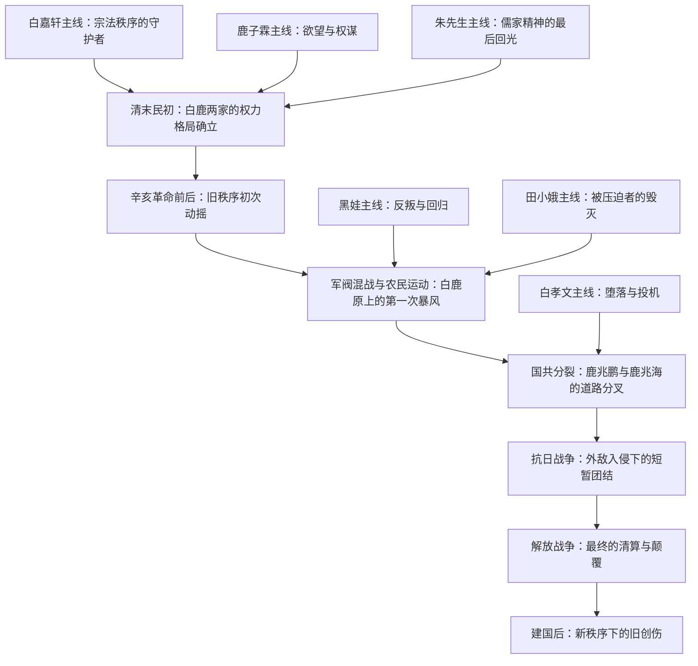
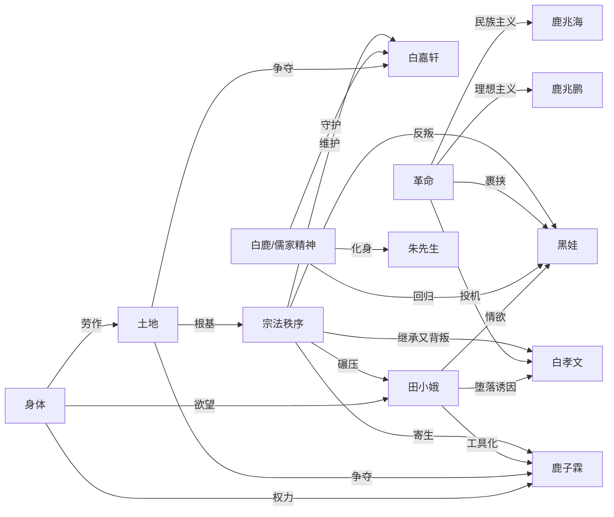

## 一、文学坐标定位

> [!abstract] 速览
> 《白鹿原》是陈忠实历时六年创作、1993年出版的长篇小说，全书约五十万字，以陕西关中平原上白鹿村为舞台，讲述白姓和鹿姓两大家族从清末到建国后近半个世纪的恩怨纠葛。小说以族长白嘉轩为轴心，围绕白孝文、鹿兆鹏、鹿兆海、黑娃（鹿兆谦）、田小娥等人物的命运展开，深度嵌入了辛亥革命、军阀混战、国共合作与分裂、抗日战争、解放战争等重大历史事件。1997年获第四届茅盾文学奖。

陈忠实曾说过，他要写一部「死后可以放在棺材里当枕头」的书。《白鹿原》正是这部作品。它在中国当代文学中的地位极为独特：它既不是伤痕文学的控诉，也不是寻根文学的怀旧，更不是先锋文学的形式实验——它是一部试图以==史诗规模==重新审视中国乡土文明的作品，带有强烈的文化反思意识。

在世界文学脉络中，《白鹿原》可以与[[《百年孤独》]]的家族史诗叙事、福克纳「约克纳帕塔法」系列的地方志书写、以及[[《静静的顿河》]]对历史洪流中个人命运的关注形成对话。但陈忠实的独特之处在于：他的叙事植根于==儒家宗法文化==的土壤，他关心的核心问题不是「人如何面对荒诞」，而是==一套延续了数百年的乡土伦理秩序，在现代革命的冲击下如何瓦解、变形、残存==。

《白鹿原》的文学野心不仅仅是讲述一个家族故事，而是试图为关中平原——乃至整个中国传统乡土社会——写一部「秘史」。陈忠实在题记中引用巴尔扎克的话：「小说被认为是一个民族的秘史。」这句题记是理解全书的第一把钥匙。

---

## 二、叙事结构解析

> [!note] 多线交织的史诗结构
> 小说不采用单一线性叙事，而是以白鹿两家的对抗与缠绕为经线，以近半个世纪的历史变迁为纬线，编织出一张密不透风的叙事网络。

陈忠实采用了一种可以称为「==年代记式全知叙事==」的方法。叙述者无所不知、无处不在，能够自由进入每一个人物的内心，也能跳出来俯瞰整个白鹿原的兴衰。这种叙事选择有其深刻的理由：

1. **全知视角的必要性**：白鹿原上的人物众多、关系复杂、利益纠葛交错，单一视角无法承载如此庞大的叙事。全知叙事让陈忠实能够同时展示白嘉轩的内心独白和鹿子霖的暗中算计，让读者看到表面平静的宗族秩序下涌动的暗流。

2. **历史与个人的交织方式**：历史事件（辛亥革命、国共分裂、抗战等）不是作为独立章节出现，而是通过人物的行动和命运自然嵌入叙事。鹿兆鹏加入共产党、鹿兆海参加国军、白孝文的堕落与翻身——这些个人选择都是历史洪流在白鹿原上的具体投射。

3. **「秘史」的叙事策略**：所谓「秘史」，意味着不是官方叙事，而是被正史遮蔽的民间真相。陈忠实通过密集的日常生活细节——种地、收粮、修祠堂、办丧事——建构了一个自足的世界，让历史的宏大叙事降落到泥土里。

> [!tip] 为什么这样写？
> 陈忠实选择了一种「慢」的叙事节奏——大量的日常生活铺陈、风俗描写、人物心理刻画。这种「慢」不是拖沓，而是在建构一个世界的质感。只有当你真正「住进」了白鹿原，你才能感受到这个世界被撕裂时的痛。如果叙事太快，历史变成了新闻；只有足够慢，历史才能变成命运。

---

## 三、主题与意象网络

### 主题一：宗法秩序——一座正在坍塌的大厦

> [!tip] 黄金圈拆解
> - **Why**：陈忠实为什么要书写宗法秩序？因为中国乡土社会的根基不是法律、不是宗教，而是以祠堂、族规、辈分、面子为核心的宗法伦理。要理解中国，你必须理解这套系统；要理解这套系统的瓦解，你必须先看到它运转时的样子。
> - **How**：通过白嘉轩这个「完美族长」的形象，展示宗法秩序在理想状态下的运作——公正、严厉、有效。然后通过一系列冲击（田小娥事件、白孝文堕落、革命运动），让这座大厦一块砖一块砖地松动、裂开。
> - **What**：一部关于中国乡土伦理体系如何在现代性冲击下瓦解的编年史。

**文本细读**：白嘉轩是宗法秩序的人格化身。他的「腰杆挺得太直」（小说的开篇意象）不仅是身体姿态，更是道德姿态。他按照《乡约》治理白鹿村，惩罚赌博、通奸、偷盗，主持祠堂仪式，维持着一种看似亘古不变的秩序。他的权威来源不是暴力（虽然他也使用暴力），而是==道德的自洽性==——他自己先做到了他要求别人做到的一切。

但陈忠实的高明之处在于，他让你看到了这套系统的==内在暴力==。白嘉轩对田小娥的处置——将她视为「淫妇」，不允许她进祠堂——表面上是维护道德，实质上是对一个弱势女性的系统性压迫。田小娥的悲剧不是因为某一个坏人，而是因为整套伦理体系没有给她留下任何生存空间。

**概念网络**：宗法秩序与「现代革命」构成了小说最核心的张力。鹿兆鹏代表的共产党革命、白孝文代表的投机主义、黑娃代表的底层反叛，都是从不同方向冲击这座大厦的力量。但有趣的是，即使大厦倒了，碎片仍然嵌在每个人的灵魂里——黑娃最终回归学习儒家经典，说明宗法文化的生命力不会因为政权更迭而消亡。

**苏格拉底追问**：白嘉轩的宗法秩序是「好」的吗？这个问题没有简答。从社会功能角度看，它维持了秩序、解决了纠纷、提供了意义系统；从个体自由角度看，它压制了女性、扼杀了异端、将一切非主流的生活方式视为不道德。陈忠实的态度是复杂的：他既敬佩白嘉轩的正直，又让你看到这种正直背后的残忍。这种==不做简单价值判断的态度==，是《白鹿原》超越一般历史小说的关键。

---

### 主题二：欲望与权力——鹿子霖的暗面

> [!tip] 黄金圈拆解
> - **Why**：如果白嘉轩代表了宗法秩序的「明面」，鹿子霖就代表了它的「暗面」。任何秩序都有表面的道德和底下的欲望，陈忠实通过白鹿两家的对照，揭示了中国乡土社会中权力运作的双重逻辑。
> - **How**：鹿子霖表面上是乡约副手、地方乡绅，实际上充满了对权力和女色的欲望。他的每一次行动——利用田小娥搞垮白孝文、在政治运动中投机——都是欲望驱动的权力游戏。
> - **What**：一个在道德面具下追逐私欲的典型中国乡绅形象。

**文本细读**：鹿子霖与白嘉轩的对比是小说最重要的结构性设计之一。白嘉轩是「阳」，鹿子霖是「阴」；白嘉轩追求的是名，鹿子霖追逐的是利；白嘉轩用道德统治人心，鹿子霖用手段操纵人事。但陈忠实没有简单地把白嘉轩写成好人、鹿子霖写成坏人——他让你看到，白嘉轩的「好」中有专制的成分，鹿子霖的「坏」中有人性的真实。

鹿子霖利用田小娥去勾引白孝文，这个情节是全书最阴暗的权力运作之一。他的目的不是田小娥本身，而是通过搞垮白嘉轩的长子来羞辱白家。==性在这里是权力斗争的武器，女性身体成了男性博弈的战场==。

**苏格拉底追问**：鹿子霖是「恶人」吗？还是他只是这个系统中更诚实的参与者——他不像白嘉轩那样用道德包装自己的权力欲，而是直接露出了人性中趋利避害的本能？陈忠实似乎暗示：宗法秩序的运转不是靠白嘉轩式的道德自律，而是靠白嘉轩和鹿子霖这一明一暗的合力。没有暗面，明面也无法成立。

---

### 主题三：田小娥——被侮辱与被损害的

> [!tip] 黄金圈拆解
> - **Why**：陈忠实为什么要创造田小娥这个角色？因为任何秩序的合法性，都可以通过它如何对待最弱势的成员来检验。田小娥是这套宗法体系中==最没有话语权的人==——一个女人、一个被买卖的妾、一个「不守妇道」的人。她的命运暴露了这个体系的全部残忍。
> - **How**：通过一个女性从被压迫到反抗再到毁灭的完整轨迹，让读者看到宗法体系对「异端」的绞杀机制。
> - **What**：一个被公公强暴、被丈夫利用、被族长排斥、最终被刺死的女性的悲惨命运。

**文本细读**：田小娥的人生轨迹是一条无处可逃的下行线。她先是被卖给年迈的举人郭秀才做妾，遭受公公的性侵。她与黑娃相爱，本以为找到了出路，但黑娃离开后她孤立无援。鹿子霖利用她，白嘉轩拒绝她进入祠堂，她在白鹿原上的每一条路都被堵死了。

> [!warning] 田小娥之死的象征意义
> 田小娥被鹿三（黑娃的父亲）用梭镖刺死。鹿三是白嘉轩最忠诚的长工，他杀田小娥不是出于个人仇恨，而是出于对宗法秩序的维护——在他看来，田小娥是败坏门风的祸害。这个杀人行为的伦理复杂性在于：鹿三主观上认为自己在做正确的事，客观上他杀死了一个无辜的受害者。这正是宗法秩序最可怕的地方——它能让被压迫者（长工鹿三）成为同样被压迫者（田小娥）的刽子手。

田小娥死后的「瘟疫事件」更具象征意义：白鹿原上爆发瘟疫，村民认为是田小娥的冤魂作祟。白嘉轩下令修建了一座六棱砖塔，将田小娥的遗骨压在塔下。这个细节揭示了一个惊人的逻辑：==活着的时候压迫你的身体，死了之后还要压制你的灵魂==。

**概念网络**：田小娥的命运与「白鹿」意象形成了隐秘的对照。传说中的白鹿是吉祥的象征，代表白鹿原的灵气与福泽。而田小娥可以被视为白鹿的暗面——她代表了这片土地上被压抑、被否认、被镇压的生命力。白鹿原的繁荣建立在对田小娥们的牺牲之上。

**苏格拉底追问**：陈忠实对田小娥的书写是否充分？有评论者指出，陈忠实虽然同情田小娥，但他的叙述仍然带有男性凝视的痕迹——田小娥的身体被反复描写，她的主体性仍然不足。这个批评有其道理：田小娥的反抗更多是被动的、本能的，而非自觉的。但也有人认为，这恰恰是历史真实——在那个时代，一个处于田小娥位置的女性，确实不可能拥有自觉的反抗意识。

---

### 主题四：革命——新秩序的诞生阵痛

> [!tip] 黄金圈拆解
> - **Why**：陈忠实要追问的是：推翻旧秩序的革命，是否真的带来了更好的世界？这个问题在他写作的1990年代——距离文革结束不到二十年——具有切肤之痛。
> - **How**：通过鹿兆鹏（共产党）、鹿兆海（国民党）、白孝文（投机者）、黑娃（底层反叛者）四条路线的交叉与对比，展示革命的多面性。
> - **What**：革命不是一个统一的叙事，而是无数个人选择、偶然事件和历史力量的纠缠。

**文本细读**：鹿兆鹏和鹿兆海兄弟分别走上了共产党和国民党的道路，这一设计本身就充满了历史的反讽。他们出身同一个家庭，接受了类似的教育，却走向了截然不同的政治阵营。陈忠实没有简单地将共产党写成正义、国民党写成邪恶——鹿兆海在抗日战争中英勇牺牲，他的死是高尚的；鹿兆鹏在地下工作中展现了理想主义者的坚定，但他抛弃不愿离婚的妻子（最终妻子自杀），也暴露了革命者在「大义」面前对个人伦理的冷酷。

> [!important] 白孝文——最复杂的人物弧光
> 白孝文的命运轨迹是全书最令人不安的。他从白嘉轩精心培养的继承人，堕落为与田小娥厮混的浪荡子，被逐出家门后沦为乞丐，然后在解放战争末期投机加入共产党，最终成为新政权的县长——并在建国后下令处决了曾经的战友黑娃。白孝文的故事揭示了一个残酷的真相：==在政治剧变中，最终胜出的往往不是最坚定的理想主义者，而是最善于投机的人==。

**概念网络**：「革命」在本书中与「宗法秩序」构成了一组核心对立。但陈忠实的深刻之处在于，他展示了两者之间的==暧昧关系==：革命声称要推翻旧秩序，但革命后建立的新秩序是否真的「新」？白孝文从族长之子变成了县长，权力的形式变了，权力的本质变了吗？黑娃从土匪变成了革命者又回归了儒学，最终被白孝文以新秩序的名义处决——旧仇在新制度下以合法的方式完成了清算。

**苏格拉底追问**：陈忠实对革命的态度是什么？这是一个敏感且复杂的问题。他显然不是反革命者——鹿兆鹏的理想主义被正面刻画。但他也不是革命的颂歌者——他让你看到了革命中的投机、背叛和残忍。可以说，陈忠实的态度是一种==哀伤的清醒==：他承认旧秩序必须被打破，但对新秩序能否避免旧秩序的弊病持深深的怀疑。

---

### 主题五：白鹿——文明的隐喻

> [!tip] 黄金圈拆解
> - **Why**：陈忠实为什么要用「白鹿」这个意象？因为他需要一个超越现实政治的象征符号，来承载他对这片土地更深层的思考。
> - **How**：白鹿作为传说中的灵物，贯穿全书，时隐时现，成为衡量白鹿原精神状态的隐喻——白鹿出现，则原上安泰；白鹿隐去，则灾祸降临。
> - **What**：白鹿是白鹿原文明精神的象征——那种融合了儒家伦理、乡土智慧和自然灵气的生活方式。

**文本细读**：小说中，白鹿的传说出现在叙事的关键节点。白嘉轩之所以用计换得鹿家的那块地，正是因为他发现那里有白鹿出没的迹象——在他看来，白鹿所在之处就是风水宝地。这个行为本身就充满了矛盾：白嘉轩是道德楷模，但他获取这块地的方式是一场精心策划的骗局。==白鹿原的根基从一开始就埋下了道德暧昧的种子==。

朱先生——白鹿原上最受尊敬的儒学大师——在某种意义上是白鹿精神的人格化身。他超越于白鹿两家的纷争之上，以学问和品德赢得所有人的敬重。他能以一人之力劝退军阀大军，也能预言白鹿原的未来。但朱先生最终也无力阻止历史的进程——他的学问在革命面前显得苍白，他的预言成了无人听从的空谷回音。

**概念网络**：白鹿意象与「朱先生」「祠堂」「乡约」共同构成了小说的精神内核。它们代表了一种正在消逝的文明形态。陈忠实对这种消逝的态度不是简单的怀旧，而是一种==含泪的审视==——他知道这种文明有其不可辩护的暴力面（对女性、对异端），但他也知道，随着这种文明的消逝，某些珍贵的东西——对天地的敬畏、对人伦的重视、对个人品德的追求——也一并失去了。

---

### 主题六：身体与土地——生命的双重根基

> [!tip] 黄金圈拆解
> - **Why**：陈忠实为什么如此执着于身体叙事和土地描写？因为对农耕文明中的人来说，身体和土地是存在的两个基本维度——身体是人与世界的界面，土地是人的根。
> - **How**：通过大量的身体描写（性、疾病、死亡、劳作）和土地描写（季节、收成、旱灾），建构了一个充满肉身感和泥土气的叙事世界。
> - **What**：白嘉轩娶了七个老婆（前六个都死了），小说开篇第一句话就是这个信息。性、生育、死亡——身体的基本事件——是故事的起点。

**文本细读**：小说的开篇极为大胆：「白嘉轩后来引以为豪壮的是一生里娶过七房女人。」这句话立刻将读者拉入了一个以身体为中心的叙事世界。白嘉轩的七房妻子，前六个都因各种原因死去，这在象征层面暗示了==生命本身的脆弱与顽强==——死亡不断发生，但生命（通过再婚、生育）不断延续。

土地在小说中不是背景，而是角色。白嘉轩和鹿子霖之间的核心矛盾之一，就是那块被白嘉轩用计换来的风水宝地。土地不仅意味着经济利益，更意味着家族的命运和尊严。白鹿原上的人为土地而活、为土地而斗、最终也被绑定在土地上无法挣脱。

**苏格拉底追问**：陈忠实对身体和性的大量书写，是否有过度之嫌？这个问题在小说出版时就引发了争议。一种解读是：身体叙事是对中国文学长期以来「无性」传统的纠偏，也是对宗法文化中压抑身体的一种文学反抗。另一种解读则认为：某些性描写确实带有猎奇色彩，特别是围绕田小娥的段落，在同情与窥视之间存在张力。

---

## 四、人物分析

### 白嘉轩——最后的族长

白嘉轩是《白鹿原》中塑造最为深厚的人物。他几乎具备了中国传统乡绅的一切美德：正直、勤劳、有担当、能忍耐。他挺直的腰杆是全书最重要的身体意象——那根腰杆代表了他的道德信念、他的家族尊严、他对宗法秩序的坚守。

但陈忠实没有把白嘉轩写成圣人。他用计骗取鹿家的风水地，展示了他精明算计的一面。他对田小娥的冷酷排斥，展示了他道德体系中非人性的一面。他对白孝文堕落后的决绝（将其逐出家门），展示了他在「家族名誉」与「父子亲情」之间毫不犹豫地选择了前者。

> [!quote] 关键追问
> 白嘉轩的腰杆在小说后半部分被黑娃打断了。这个情节是全书最重要的象征事件之一——==宗法秩序的脊梁被底层的反叛力量打断了==。但白嘉轩的腰虽然弯了，他的精神始终没有屈服。这个矛盾恰恰是陈忠实要表达的：宗法秩序作为制度已经无法维持，但作为精神遗产，它仍然顽强地存在于人心之中。

### 鹿子霖——欲望的人格化

鹿子霖与白嘉轩构成了小说中最核心的人物对照。如果白嘉轩是宗法秩序的「超我」，鹿子霖就是它的「本我」。他好色、贪权、善妒、工于心计，但他也不是纯粹的恶人——他对自己的儿子有真实的感情，他在某些时刻也表现出对白嘉轩道德权威的真诚敬服。

鹿子霖最终的结局是疯癫——在政治运动的反复冲击下精神崩溃。这个结局带有寓言色彩：那些在旧秩序和新秩序之间两面讨好的人，最终被两面夹击，碎成了精神的碎片。

### 朱先生——白鹿的化身

朱先生是小说中最理想化的人物，也是最具悲剧色彩的人物。他代表了儒家文明在最好状态下的样子：学识渊博、品德高洁、超越利害、关怀苍生。他一人退清兵的壮举是全书最具传奇色彩的段落。但朱先生最终死于新旧交替的时代缝隙中——他的学问、他的预言、他的道德典范，在革命的洪流中显得无力而苍凉。

> [!important] 朱先生临终前的预言
> 朱先生临死前留下了一副棺材里的对联，预言了未来的灾祸。这个细节暗示了一种知识分子的终极困境：==你能预见灾难，但你无法阻止灾难==。

### 黑娃——反叛与回归的悲剧

黑娃（鹿兆谦）是全书命运最曲折的人物。他是长工鹿三的儿子，天性自由、不服管教。他与田小娥的爱情是对宗法秩序最直接的挑战——一个长工的儿子爱上了一个被排斥的女人，这在白鹿原的伦理体系中是双重的越轨。

黑娃后来参加农民运动、当土匪、投靠保安团、最终加入共产党——他的人生轨迹是一条永远在寻找归属感的曲线。最耐人寻味的是他晚年拜朱先生为师、学习儒家经典——这个==从反叛者到回归者的弧线==暗示了宗法文化对人的深层塑造：你可以在行为上叛离它，但你的灵魂最终还是会被它召唤回来。

黑娃最终被白孝文以「反革命」的罪名处决。这个结局是全书最残忍的反讽之一：一个真诚的回归者被一个投机的叛离者以正义的名义杀死。

### 白孝文——最令人不安的人物

白孝文的人物弧光在某种意义上是全书最「现实」的——他展示了一个人如何在道德崩塌后彻底拥抱了实用主义。他从白嘉轩的骄傲变成了白嘉轩的耻辱，又在新政权中成为权力的执掌者。他的故事追问的是一个尖锐的问题：==在一个秩序崩塌的时代，道德虚无主义是否是最有效的生存策略？==

---

## 五、风格与语言

> [!note] 陈忠实的叙事语言
> 《白鹿原》的语言具有强烈的关中地域特色——大量的方言词汇、农事术语和民间口语赋予了小说不可替代的质地。但陈忠实也能在需要时切换到庄重、宏大的叙事声调，特别是在描写历史事件和朱先生的段落时。

陈忠实的叙事语言有两个显著特征：

1. **感官的密度**：他的描写充满了视觉、触觉、嗅觉的细节——麦子的颜色、泥土的气味、皮肤的触感。这种感官密度让白鹿原不是一个抽象的文学空间，而是一个你仿佛能触摸到的物理世界。

2. **叙事的节奏控制**：在日常生活的铺陈中，陈忠实保持了一种从容不迫的节奏；在重大事件爆发时（如农民运动、内战），节奏骤然加快，形成强烈的叙事张力。这种快慢交替模拟了历史本身的节奏——长时段的平静被短时段的剧变打断，周而复始。

> [!tip] 为什么用这种语言？
> 陈忠实的语言选择与他的主题高度统一。他要写的是==土地和土地上的人==，因此他的语言必须带有泥土的质感。如果用都市知识分子的雅致语言来写白鹿原，那个世界就会失去它的真实性。方言和民间口语不是装饰，而是叙事的有机组成部分。

---

## 六、文学批评多视角

**文化保守主义视角**：《白鹿原》可以被读作一曲对传统乡土文明的挽歌。白嘉轩和朱先生代表的儒家伦理体系虽然有其黑暗面，但它提供了一种稳定的意义系统和行为规范。革命打碎了这个系统，但并没有建立一个同样有说服力的替代品。从这个角度看，陈忠实对传统有着深切的眷恋。

**女性主义视角**：这可能是《白鹿原》最薄弱的环节。小说中的女性角色——田小娥、白嘉轩的七房妻子、鹿兆鹏被抛弃的妻子——在很大程度上是男性叙事的附属品。田小娥虽然是最复杂的女性角色，但她的主体性仍然不足，她更多是作为宗法秩序之暴力的「承受者」而非「行动者」存在。陈忠实的笔触在描写田小娥的身体时，有时难以区分同情与窥视。

**后殖民/现代性批判视角**：《白鹿原》可以被读作对中国现代性方案的反思。辛亥革命以来的各种「现代化」努力——共和、革命、建设——都在白鹿原上留下了破坏的痕迹。陈忠实似乎在暗示：中国的现代化不是一个从蒙昧走向文明的进步故事，而是一个==有所失也有所得==的痛苦转型。

**精神分析视角**：白嘉轩的「挺直的腰杆」可以被理解为一种心理防御机制——通过对道德纯洁性的极端追求来压抑内心的焦虑和欲望。他对田小娥的过度排斥、对白孝文的过度苛责，都可能源自他自身被压抑的欲望的投射。鹿子霖则代表了「本我」的释放——他活出了白嘉轩不敢活出的那个自我。

**存在主义视角**：黑娃的命运轨迹可以被读作一个存在主义式的寓言——一个人在不断的选择中寻找自己的本真存在。他反叛宗法（真实的冲动）、参加革命（寻找归属）、当土匪（被抛入荒诞）、回归儒学（寻求意义）、被处决（被他人的自由所毁灭）。他的悲剧在于：他终于找到了他想成为的人，却在那一刻被剥夺了继续存在的权利。

---

## 七、概念网络总图

---

## 八、跨时空共鸣

《白鹿原》写的是清末到建国后的故事，但它追问的问题在任何时代都成立：

**传统与现代的张力**：你所处的时代正在经历高速的技术变革和价值重构。许多你习以为常的观念——家庭结构、职业路径、人生意义——都在被重新定义。白嘉轩面对的困境，在本质上与今天每一个在传统价值和现代生活之间挣扎的人是相通的：==你无法完全守住旧的，也无法完全拥抱新的，你只能在裂缝中寻找自己的位置==。

**权力的本质**：白孝文的故事在当代语境中有着刺骨的现实感。在任何组织、任何制度中，都有白嘉轩式的理想主义者和白孝文式的投机者。制度更迭、口号变化，但权力的运作逻辑——谁能在变局中最快地调整自己的位置——往往惊人地一致。

**弱势者的命运**：田小娥的故事不只属于那个时代。在任何一套秩序中，都有被排斥在主流叙事之外的人。他们的声音被忽略、他们的痛苦被合理化、他们的反抗被污名化。田小娥的悲剧提醒你：==评判一个文明的标准，不是看它如何对待它的精英，而是看它如何对待它的弃儿==。

---

## 九、费曼终极检验

> [!abstract] 用最简单的话概括
> 如果你要向一个没读过《白鹿原》的朋友解释这本书，可以这样说：

在陕西关中平原上有一个叫白鹿原的地方，白家和鹿家在这里世代生活。白家的族长白嘉轩是个挺直腰杆做人的硬汉，按照老规矩治理村庄；鹿家的当家人鹿子霖精明狡诈，暗中与白家较劲。他们的下一代——有人参加了共产党，有人参加了国民党，有人当了土匪，有人从少爷沦为乞丐又爬上了县长的位子。还有一个叫田小娥的女人，她只是想好好活着，但这个世界容不下她。

从清朝末年到解放后，白鹿原上经历了革命、战争、饥荒、政治运动。旧的秩序碎了，新的秩序来了，但人性中那些最根本的东西——对权力的渴望、对尊严的坚守、对爱的追求、对弱者的压迫——从来没有变过。

这本书最厉害的地方在于：它不告诉你谁是好人谁是坏人，它让你看到每一个人都有自己的道理，而所有这些「道理」加在一起，构成了历史的悲剧。你读完之后不会恨任何一个角色，但你会对「正义」「秩序」「革命」这些大词产生深深的怀疑——因为你看到了，==每一个大词的下面都压着具体的人==。

---

## 十、苏格拉底终极追问

1. **关于写作动机**：陈忠实说要写一部「放在棺材里当枕头」的书。这个说法本身就带有强烈的宗法色彩——棺材里的枕头，是陪伴自己进入死亡的最重要之物。他是在用一种传统的语言来表达一个现代作家的终极野心。追问：==一个试图批判传统的作家，为什么用传统的意象来定义自己的使命？这是否说明传统对他的塑造比他自己意识到的更深？==

2. **关于叙事公正**：陈忠实对白嘉轩的刻画是否过于宽厚？他的道德缺陷（骗取风水地、压迫田小娥）在叙事中被他的正直所稀释。追问：==一个全知叙述者的同情心是否会扭曲历史真相？如果田小娥是叙述者，这个故事会完全不同。==

3. **关于历史观**：《白鹿原》呈现了一种近乎宿命论的历史观——个人在历史面前无能为力，白鹿原的兴衰是不可抗拒的命运。追问：==这种历史观是深刻的洞见，还是一种智识上的懒惰？如果所有的苦难都是「命运」，那追究责任还有意义吗？==

4. **关于文明的价值**：如果宗法秩序的瓦解是不可避免的，那么我们应该哀悼它还是庆祝它？陈忠实的态度是暧昧的——他同时展示了这套系统的美好与残忍。追问：==有没有可能保留宗法文化的精华（对人伦的重视、对品德的追求）而摒弃其糟粕（对女性的压迫、对异端的排斥）？还是精华与糟粕本就不可分割？==

---

## 延伸阅读路线图

> [!note] 推荐阅读路径

- [[《百年孤独》]] — 加西亚·马尔克斯的家族史诗，与《白鹿原》在家族叙事和历史书写上形成对话
- [[《静静的顿河》]] — 肖洛霍夫的哥萨克史诗，同样聚焦革命对传统社会的冲击
- [[《活着》]] — 余华的极简主义叙事，与陈忠实的史诗叙事形成方法论上的对照
- [[《平凡的世界》]] — 路遥的现实主义巨著，同为陕西作家的关中书写
- [[《废都》]] — 贾平凹的当代西安叙事，另一种陕西文学的面向
- [[《红高粱家族》]] — 莫言的家族传奇，在叙事策略和历史观上与《白鹿原》形成互文
- [[《古炉》]] — 贾平凹的文革叙事，聚焦政治运动对乡村社会的毁灭性冲击
