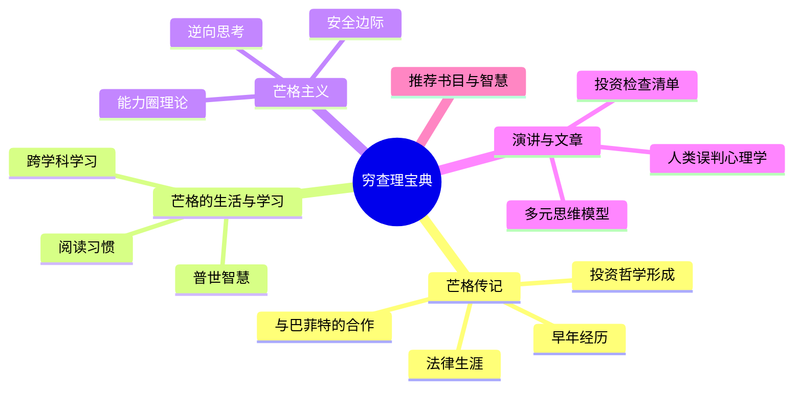
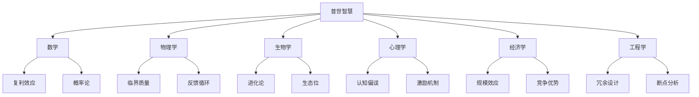
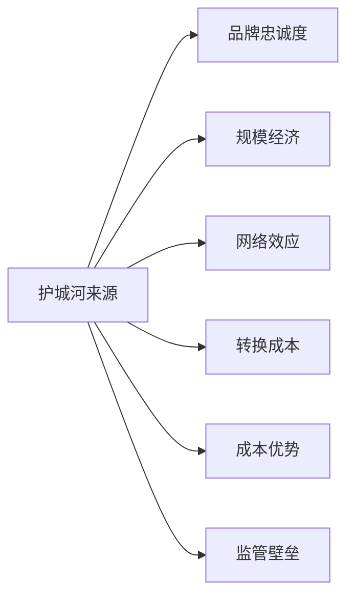
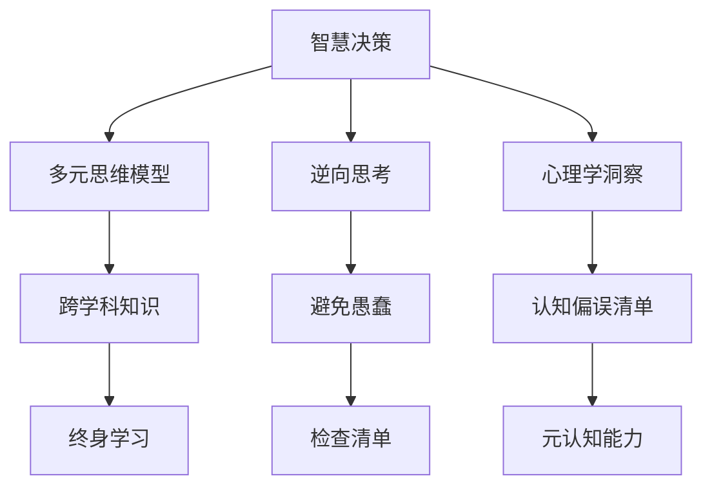

# 《穷查理宝典》深度拆解

## 一、元信息/坐标定位

### 作者背景
彼得·考夫曼是本书的编辑，而本书的真正主角是==查理·芒格==——沃伦·巴菲特长达半个世纪的合伙人，伯克希尔·哈撒韦公司的副董事长。芒格1924年出生于美国内布拉斯加州奥马哈，曾就读于密歇根大学和哈佛法学院。他从律师转型为投资家，与巴菲特共同打造了伯克希尔这个商业帝国。

### 写作背景
本书首次出版于2005年，是对芒格数十年智慧的系统整理。彼得·考夫曼花费数年时间，收集整理芒格的演讲、文章和访谈，试图呈现这位"行走的智慧图书馆"的完整思想体系。

### 学科定位
本书横跨==投资学、心理学、经济学、物理学、生物学==等多个学科，是一本典型的跨学科思维著作。它不仅是投资指南，更是一部关于如何正确思考的认知科学著作。

### 核心价值主张
> [!abstract] 核心观点
> 通过建立多元思维模型的"格栅理论"，培养跨学科思考能力，避免人类常见的心理偏误，从而做出更明智的人生和投资决策。

### 目标读者
投资者、企业管理者、终身学习者，以及任何希望提升决策质量和思维水平的人。

---

## 二、全书逻辑地图

本书的逻辑结构可以概括为==从人到思想，从思想到方法，从方法到实践==：

**第一层：认识芒格其人**——通过传记部分了解芒格的成长背景、性格特质和人生经历，理解其思想形成的土壤。

**第二层：芒格主义核心理念**——提炼芒格的核心投资和人生哲学，包括逆向思维、能力圈、安全边际等概念。

**第三层：多元思维模型**——这是全书的精华，系统阐述跨学科思维的重要性和具体模型。

**第四层：心理学洞察**——深入剖析人类25种常见的心理偏误，这是芒格思想体系中极具独创性的部分。

**第五层：实践应用**——通过具体案例和投资分析，展示如何将思维模型应用于实际决策。

> [!note] 阅读建议
> 建议先阅读演讲部分，尤其是"人类误判心理学"和"论基本的、普世的智慧"，这两篇是理解芒格思想的钥匙。

---

## 三、核心主题/逐章深度拆解

### 第一部分：查理·芒格传略

#### 1.1 早年岁月与家庭影响

芒格出生于大萧条前夕的奥马哈，这座城市后来也孕育了巴菲特。他的祖父是联邦法官，父亲是律师，家庭氛围充满了对知识和正直的尊重。

> [!tip] 关键洞察
> 芒格从小就接受到"延迟满足"的训练。他的祖父常说："拿走你理应得到的东西，然后安静地坐在那里继续阅读。"这种清教徒式的价值观深深影响了芒格的一生。

芒格在奥马哈中央高中表现优异，17岁进入密歇根大学学习数学。二战期间，他加入美国陆军航空队，被送往加州理工学院学习气象学。==这段科学训练为他后来的跨学科思维奠定了基础==。

#### 1.2 法律生涯与投资转型

战后，芒格进入哈佛法学院，尽管他没有本科学位（当时极为罕见）。毕业后，他在洛杉矶开设了自己的律师事务所。

在法律实践中，芒格逐渐认识到：==真正的财富不是通过出卖时间获得的，而是通过资本配置获得的==。这促使他开始研究投资。

1959年，芒格与巴菲特在奥马哈相识。两人一见如故，开始了长达半个多世纪的合作。芒格对巴菲特最大的影响是：说服他放弃"捡烟蒂"式的投资方法，转向购买"优质企业"。

> [!warning] 重要转变
> 巴菲特曾说："查理把我推向了另一个方向，他让我以合理的价格购买优质企业，而不是以便宜的价格购买平庸的企业。"这是巴菲特投资哲学的重大转折点。

#### 1.3 伯克希尔的黄金搭档

芒格加入伯克希尔后，两人形成了独特的合作模式。巴菲特负责日常运营和对外沟通，芒格则扮演"说不先生"的角色——他的工作是质疑、挑战、寻找漏洞。

两人的投资决策极为高效。一笔数十亿美元的投资，往往只需要几分钟的讨论就能决定。这种效率源于==数十年的思维磨合和共同的价值观基础==。

### 第二部分：芒格的生活、学习和决策方法

#### 2.1 "行走的书籍"

芒格是一个狂热的阅读者。他的孩子们开玩笑说他是"一本长着两条腿的书"。芒格的阅读范围极其广泛：传记、历史、科学、心理学、商业……

> [!note] 芒格的阅读哲学
> "我这辈子遇到的聪明人，没有不每天阅读的——没有，一个都没有。沃伦读书之多，我读书之多，可能会让你感到吃惊。"

芒格强调==阅读要跨学科，要建立知识的联系==。孤立的知识是没有力量的，只有当不同领域的知识相互印证、相互增强时，才能产生真正的智慧。

#### 2.2 跨学科思维的力量

芒格提出了著名的"普世智慧"概念：要真正理解世界，你需要掌握来自各个学科的核心思维模型。

芒格批评现代教育的学科割裂：=="如果你只有一把锤子，那么在你眼里，什么问题都像钉子。"==

真正的智慧需要一个工具箱，里面有来自各个学科的工具。面对问题时，你需要选择最合适的工具，而不是把所有问题都当作你熟悉领域的问题来处理。

#### 2.3 逆向思维的艺术

芒格最著名的思维方法之一是"逆向思考"（Inversion）。

> [!abstract] 逆向思维原则
> "如果你想知道如何帮助印度，首先问：什么会摧毁印度？然后避免那些事情。"

这种方法源于代数学：解决困难问题时，先把问题反过来。==与其问"如何成功"，不如问"如何避免失败"==。

芒格在投资中大量运用逆向思维：
- 不是问"这个投资会赚多少钱"，而是问"这个投资会如何让我赔钱"
- 不是问"这个企业的优点是什么"，而是问"这个企业会因为什么而失败"
- 不是问"市场为什么会涨"，而是问"市场为什么会崩溃"

### 第三部分：芒格主义——查理的即席谈话

#### 3.1 能力圈理论

芒格和巴菲特共同倡导"能力圈"（Circle of Competence）的概念：==你需要清楚地知道自己知道什么，更重要的是，知道自己不知道什么==。

> [!warning] 能力圈的边界
> "知道自己能力的边界比能力有多大更重要。如果你清楚边界在哪里，你就比那些能力比你强但不知道边界的人更安全。"

芒格建议投资者：
1. 只投资自己真正理解的领域
2. 承认自己有很多不懂的东西
3. 把那些复杂难懂的投资放到"太难"的篮子里
4. 宁可错过机会，也不要犯大错

#### 3.2 安全边际

借用格雷厄姆的概念，芒格强调安全边际的重要性：==买入价格要远低于内在价值，给自己留有犯错的空间==。

安全边际不仅适用于投资，也适用于人生的各种决策：
- 财务安排要留有余裕
- 时间规划要预留缓冲
- 人际关系要给予宽容

#### 3.3 护城河与竞争优势

芒格对"护城河"（Moat）的理解比大多数投资者更为深刻。真正的护城河来源于：

> [!tip] 护城河的动态性
> 芒格提醒我们，护城河不是静态的。世界在变化，竞争对手在进步，今天的护城河可能是明天的陷阱。投资者需要持续关注护城河是在加宽还是在收窄。

### 第四部分：查理十一讲

这是全书最精华的部分，包含芒格在各种场合发表的重要演讲。

#### 4.1 论基本的、普世的智慧

这篇演讲系统阐述了芒格的多元思维模型理论。

芒格指出，大约==80-90个思维模型==就能覆盖你需要的大部分智慧。这些模型来自不同学科：

**数学模型**：复利、排列组合、概率论、决策树
**物理学模型**：临界质量、反馈循环、均衡
**生物学模型**：进化论、生态位、红皇后效应
**心理学模型**：各种认知偏误（详见下节）
**经济学模型**：规模效应、边际效用、机会成本

> [!abstract] 模型的叠加效应
> "当几个模型联合起来解释同一个现象时，这种解释就特别有力。我称之为'Lollapalooza效应'——多种力量同向发挥作用，产生巨大的效果。"

#### 4.2 人类误判心理学

这是芒格最具独创性的贡献之一。他系统总结了==25种人类常见的心理偏误==：

**1. 奖励和惩罚超级反应倾向**
人类对激励机制的反应远超我们的想象。==永远不要低估激励的力量==。

> [!warning] 激励的双刃剑
> "永远不要问理发师你是否需要理发。"——利益冲突会扭曲判断。

**2. 喜爱/厌恶倾向**
我们倾向于忽视自己喜欢之人的缺点，放大自己厌恶之人的缺点。

**3. 避免怀疑倾向**
大脑厌恶不确定性，会快速形成结论以消除怀疑，即使证据不足。

**4. 避免不一致性倾向**
一旦做出决定，我们会抗拒改变，即使新证据表明应该改变。这是==沉没成本谬误==的心理根源。

**5. 好奇心倾向**
好奇心是人类进步的动力，但在错误方向上的好奇可能导致灾难。

**6. 康德式公平倾向**
人类有追求公平的内在需求，即使这种需求在经济上是非理性的。

**7. 羡慕/嫉妒倾向**
"驱动这个世界的不是贪婪，而是嫉妒。"——巴菲特

**8. 回馈倾向**
人类有强烈的以善报善、以恶报恶的倾向。这可以被利用，也可以被滥用。

**9. 受简单联想影响的倾向**
我们容易把不相关的事物联系在一起，形成错误的因果判断。

**10. 简单的、避免痛苦的心理否认**
当现实令人痛苦时，大脑会选择否认现实。

**11. 自视过高的倾向**
90%的人认为自己的驾驶技术高于平均水平——这在数学上是不可能的。

**12. 过度乐观倾向**
我们系统性地低估负面结果的概率。

**13. 被剥夺超级反应倾向**
==失去的痛苦大于得到的快乐==。这是行为经济学中"损失厌恶"的另一种表述。

**14. 社会认同倾向**
我们倾向于跟随他人的行为和观点，尤其是在不确定的情况下。

**15. 对比错误反应倾向**
我们的判断容易被对比物影响。一件商品在降价后显得更有价值，即使原价是虚假的。

**16. 压力影响倾向**
压力会改变我们的思维和行为方式，通常是变得更糟。

**17. 错误衡量易得性倾向**
我们过度依赖容易获得的信息，而忽视那些需要努力才能获得的重要信息。

**18. 不用就忘倾向**
技能需要练习才能保持。

**19. 化学物质错误影响倾向**
药物、酒精等化学物质会扭曲思维。

**20. 衰老-Loss倾向**
随着年龄增长，某些认知能力会下降。

**21. 权威-错误影响倾向**
我们倾向于服从权威，即使权威是错误的（米尔格拉姆实验）。

**22. 废话倾向**
人们喜欢听自己说话，但大部分话语是废话。

**23. 重视理由倾向**
我们需要理由来合理化行为，即使那个理由是荒谬的。

**24. Lollapalooza倾向**
当多种心理偏误同时作用时，效果会急剧放大。

**25. 组合效应**
上述偏误很少单独出现，通常是组合出现的。

> [!tip] 对抗偏误的方法
> 芒格建议：
> 1. 学习这些偏误，提高自我意识
> 2. 建立检查清单，强制自己考虑可能的偏误
> 3. 培养"双轨分析"习惯：先理性分析，再考虑心理因素

### 第五部分：文章、报告与评论

这部分收录了芒格的各类文章，包括他对一些投资案例的分析。

#### 5.1 所罗门公司危机

1991年，所罗门兄弟公司陷入债券丑闻。芒格和巴菲特临危受命，拯救了这家公司。这个案例展示了：
- 企业文化的重要性
- 监管套利的风险
- 领导者在危机时刻的责任

#### 5.2 关于可口可乐的分析

芒格展示了如何运用多元思维模型分析一家公司。他不仅分析了可口可乐的财务数据，还分析了其品牌心理学、分销网络、规模经济等多个维度。

---

## 四、核心框架提炼

### 芒格思维框架金字塔

### 框架一：多元思维模型格栅

| 学科 | 核心模型 | 投资应用 |
|------|----------|----------|
| 数学 | 复利效应 | 长期持有优质资产 |
| 物理 | 临界质量 | 行业集中度分析 |
| 生物 | 进化论 | 企业竞争力评估 |
| 心理 | 激励机制 | 管理层分析 |
| 经济 | 规模效应 | 护城河识别 |

### 框架二：投资检查清单

1. **业务理解**：我真的理解这个业务吗？
2. **护城河**：竞争优势的来源是什么？可持续吗？
3. **管理层**：管理层是否诚实、有能力？激励机制如何？
4. **估值**：价格与价值的关系如何？安全边际足够吗？
5. **风险**：什么会让我赔钱？最坏情况是什么？

### 框架三：反向检查清单

==问自己：如果我想投资失败，我应该怎么做？==

1. 投资自己不理解的东西
2. 跟风追热点
3. 过度杠杆
4. 忽视管理层的诚信问题
5. 在高估值时买入
6. 频繁交易

---

## 五、批判性思考

### 5.1 本书的优势

**系统性**：这是市面上对芒格思想最系统、最完整的整理。多元思维模型的概念对普通投资者极具启发性。

**实用性**：心理偏误清单可以直接用于投资和生活决策。

**深度**：与市面上大多数成功学书籍不同，本书有真正的智识深度。

### 5.2 本书的局限

> [!warning] 需要注意的问题

**幸存者偏差**：芒格是极其成功的投资者，但他的方法不一定适合所有人。我们没有看到那些使用类似方法但失败了的人。

**可复制性问题**：芒格的某些优势是普通投资者无法复制的——比如他可以直接与CEO对话，可以参与大型收购，可以长期持有不受赎回压力。

**时代局限性**：芒格的投资生涯主要在20世纪后半叶，那是美国经济的黄金时代。他的经验在不同的时代和地区可能需要调整。

**过度简化的风险**：思维模型是简化现实的工具。但现实比任何模型都复杂，过度依赖模型可能导致盲点。

### 5.3 与其他思想家的比较

与[[《思考，快与慢》 - 丹尼尔·卡尼曼]]相比，芒格的心理学分析更加实用导向，但学术严谨性不足。

与[[《原则》 - 瑞·达利欧]]相比，芒格的框架更加灵活开放，达利欧则更加系统化和算法化。

与[[《投资最重要的事》 - 霍华德·马克斯]]相比，两者有许多相似之处，但马克斯更专注于周期和风险控制。

---

## 六、行动清单

### 立即行动（本周）

- [ ] 制作一份个人投资检查清单，包含至少10个检查点
- [ ] 选择3种心理偏误，在日常决策中有意识地识别它们
- [ ] 开始记录"愚蠢日记"，记录自己犯过的思维错误

### 短期行动（1-3个月）

- [ ] 选择一个自己不熟悉的学科，阅读一本经典入门书
- [ ] 建立阅读习惯，每天至少阅读30分钟非虚构类书籍
- [ ] 定义自己的能力圈边界，列出自己真正理解的投资领域

### 长期行动（1年以上）

- [ ] 系统学习至少5个学科的核心思维模型
- [ ] 建立个人的多元思维模型清单，并在实践中不断完善
- [ ] 找到一个"思维伙伴"，定期讨论和质疑彼此的决策

---

## 七、延伸阅读路线图

### 第一层：芒格直接推荐的书籍
- [[《影响力》 - 罗伯特·西奥迪尼]] - 心理学经典
- [[《枪炮、病菌与钢铁》 - 贾雷德·戴蒙德]] - 跨学科思维典范
- [[《自私的基因》 - 理查德·道金斯]] - 进化论思维

### 第二层：投资哲学深化
- [[《投资最重要的事》 - 霍华德·马克斯]] - 风险与周期
- [[《聪明的投资者》 - 本杰明·格雷厄姆]] - 价值投资源头
- [[《证券分析》 - 格雷厄姆与多德]] - 专业深度

### 第三层：思维与决策科学
- [[《思考，快与慢》 - 丹尼尔·卡尼曼]] - 认知偏误的学术基础
- [[《超预测》 - 菲利普·泰洛克]] - 如何提高预测能力
- [[《反脆弱》 - 纳西姆·塔勒布]] - 不确定性下的生存智慧

---

## 八、费曼终极检验

> [!abstract] 如果要向一个10岁的孩子解释这本书的核心思想：

想象你在玩一个超级复杂的游戏。大多数人只学会了一种玩法，所以遇到不同的关卡就会卡住。

但是有一个老爷爷叫查理，他有一个秘密武器——一个装满各种工具的大箱子。数学工具、科学工具、心理学工具……遇到什么问题，他就从箱子里找合适的工具。

而且，这个老爷爷还发现了一件有趣的事：==人的大脑经常会骗人==。比如，大家都说一样东西好，你就会觉得它好（其实可能不是）。或者，你已经花了很多钱买了一样东西，就不愿意承认它是坏的。

所以查理老爷爷教我们：
1. 要学很多不同的知识，装满你的工具箱
2. 要知道大脑会骗你，所以做重要决定前要用清单检查
3. 与其想"怎么成功"，不如想"怎么避免失败"

==这就像过马路时，不是只看绿灯就冲过去，而是要左看看、右看看，确保没有危险再过==。这种"小心谨慎但又勇敢行动"的方法，让查理老爷爷变得非常非常有钱，但更重要的是，让他活得非常非常明白。
