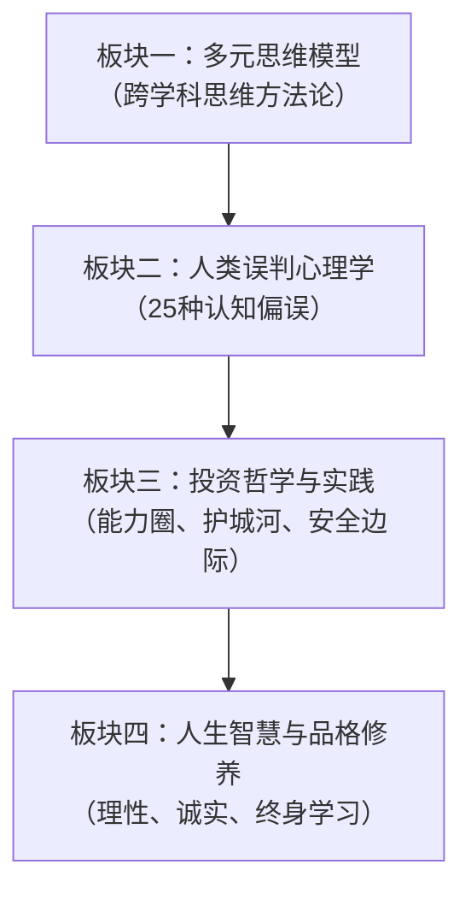
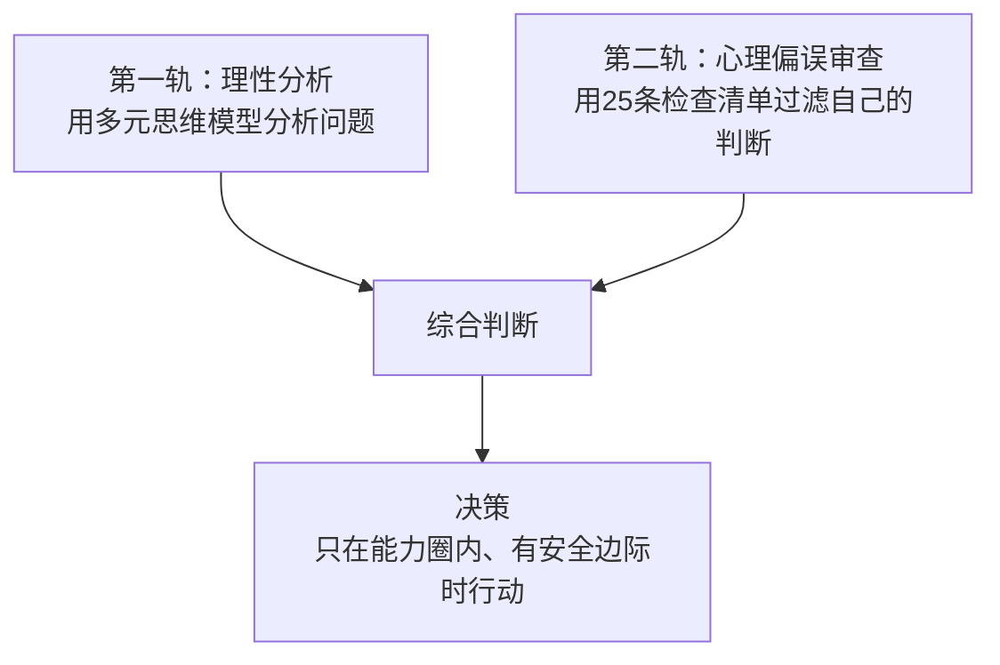

# 《穷查理宝典》深度拆解

## 一、商业坐标定位

《穷查理宝典》（*Poor Charlie's Almanack*）由彼得·考夫曼（Peter D. Kaufman）编辑整理，汇集了查理·芒格（Charlie Munger）的演讲、文章和思想精华。芒格是伯克希尔·哈撒韦公司副董事长、沃伦·巴菲特的长期合伙人，被巴菲特称为"我见过最聪明的人"。

本书不是一本传统意义上的"写作"，而是一部==思想合集==——收录了芒格最重要的11篇演讲（包括著名的"人类误判心理学"和"论学院派经济学"），以及他的生平传记、投资原则和生活智慧。它的核心不是教你怎么选股票，而是展示一种==跨学科的思维方式==：从物理学、生物学、心理学、数学、历史等多个学科中提取"大道理"，编织成一张思维之网，用于解决商业和人生中的一切问题。

与[[《价值》]]的张磊式系统化框架不同，芒格的思想更像是一座矿藏——散落各处但每一块都极其珍贵。与[[《思考快与慢》]]相比，芒格更注重实战应用而非学术体系。

## 二、商业逻辑地图

全书可提炼为**四大思想板块**：

**核心命题**：大多数人只用一个学科的思维模型看世界，就像"拿着锤子的人眼里只有钉子"。芒格的主张是：==你必须拥有来自多个学科的多种思维模型，把它们构建成一个「格栅」（latticework），才能真正理解现实世界的复杂问题==。

## 三、逐章深度拆解

### 主题一：「多元思维模型——拿着锤子的人」

> [!tip] 芒格思想的基石

**【核心论点】**

芒格最著名的主张：==如果你只有一个思维模型，你就会扭曲现实来适应你的模型，而不是用正确的模型来理解现实==。他称之为"铁锤人综合征"（To a man with a hammer, everything looks like a nail）。

**【详细拆解】**

芒格认为你需要的核心思维模型来自以下学科：

- **数学**：复利、排列组合、概率论、决策树。芒格说"不懂复利的人基本上就是在黑暗中走路"。
- **会计学**：理解企业财务报表的语言，但同时要知道会计是"一门不精确的学科"，数字可以被操纵。
- **工程学**：冗余设计（备份系统）、断裂点（系统崩溃的临界点）、质量控制。
- **物理学**：临界质量（积累到某个点就会爆发）、倾覆力矩（压死骆驼的最后一根稻草）。
- **生物学**：进化论（适者生存、自然选择）、生态系统思维。
- **心理学**：人类误判心理学（芒格自己总结的25条）。
- **经济学**：激励机制（"告诉我激励机制，我就能告诉你结果"）、规模效应、竞争优势。
- **哲学/历史**：从历史中学习人类反复犯的错误。

芒格强调这些模型不是独立使用的，而是要像==格栅（lattice）一样交织在一起==。真正的洞察力往往产生在两个或多个模型的交叉点——就像你同时用物理学的临界质量和心理学的社会证明来分析一次股市泡沫的形成。

**【费曼式解读】**

想象你是一个医生，但你只学过外科。每个来看病的人你都想给他做手术——因为手术是你唯一的工具。感冒？手术。头疼？手术。心情不好？手术。这显然荒谬。但芒格说，大多数专业人士在自己的领域里做的就是这件事——经济学家用经济学解释一切，心理学家用心理学解释一切。你需要做的是学习多个学科的基本工具，这样面对不同的"疾病"你才能选择正确的"治疗方案"。

**【金句/关键概念】**

> ==你必须知道重要学科的重要理论，并经常使用它们——全部都用上，而不是只用几个。大多数人都只用一个学科的模型——比如经济学——去解决所有问题。这就是那句老话所说的：「在手拿锤子的人看来，什么都像钉子。」==

---

### 主题二：「人类误判心理学——25种让你犯蠢的心理倾向」

> [!warning] 全书最具系统性的章节

**【核心论点】**

芒格花了数十年总结出25种人类常见的心理误判倾向。他认为这些倾向是进化留给人类的"出厂设置"——==在原始环境中帮助我们生存，但在现代复杂社会中经常导致严重的判断错误==。

**【详细拆解】**

芒格的25条中最核心的几条：

**1. 激励导致的偏见**
人的行为主要由激励机制驱动。芒格引用"FedEx案例"：联邦快递的夜班分拣员总是完不成工作，各种管理方法都不奏效。直到公司把计时工资改成计件工资——按完成量付费——问题立刻解决。芒格的名言：==永远不要低估激励机制的力量，也永远不要以为别人的行为不受激励机制影响==。

**2. 避免不一致倾向**
人脑天生抗拒改变已有的观点。一旦你形成了一个判断，你会不自觉地寻找支持这个判断的证据（确认偏误），忽略或反驳反面证据。芒格说这是"人类大脑的节能模式"——改变观点需要消耗大量认知能量，所以大脑默认选择"保持不变"。

**3. 社会认同倾向**
人在不确定时会模仿周围人的行为。这就是泡沫的心理根源——当所有人都在买某只股票时，你会觉得"大家都买一定有道理"。芒格指出，社会认同在两种情况下最危险：(a) 你自己感到困惑时，(b) 你周围的人与你相似时。

**4. 被剥夺超级反应倾向**
人对"失去"的痛苦远大于"得到"的快乐（损失厌恶的芒格版本）。这解释了为什么人们会在亏损的股票上死扛——卖出意味着承认损失，而大脑极度抗拒这种感觉。

**5. 权威影响倾向**
人天生服从权威，即使权威明显犯错。芒格引用了航空业的案例：副驾驶明知机长在犯致命错误，却因为权威影响而不敢纠正，导致飞机坠毁。

**6. lollapalooza效应**
芒格最独特的贡献：==当多种心理倾向同时作用于同一方向时，效果不是简单相加，而是指数级放大==。这就是"lollapalooza效应"。比如一次股市崩盘中，社会认同（别人都在卖）+被剥夺超级反应（我在亏钱）+压力影响+避免不一致（我之前就觉得不好）同时发力，导致恐慌性抛售。

**【费曼式解读】**

你的大脑就像一台出厂预装了一堆"bug"的电脑。这些bug在十万年前是"feature"——比如"看到别人跑就跟着跑"在遇到猛兽时能救命。但在今天，当别人都在疯狂买房时你也跟着买，这个"feature"就变成了真正的bug。芒格做的事情就是给你一份完整的bug列表，让你可以在每次做决策前对照检查。

**【金句/关键概念】**

> ==认识到你的心理倾向在什么时候会导致错误——这是你能做到的最有用的事情之一。==

---

### 主题三：「能力圈——知道自己不知道什么」

> [!note] 投资哲学的基石

**【核心论点】**

芒格和巴菲特的投资哲学核心之一：==知道自己知道什么，更重要的是知道自己不知道什么==。每个人都有一个"能力圈"（circle of competence），在圈内你有真正的专业知识，在圈外你只是业余者。成功的关键不是扩大能力圈，而是待在圈内。

**【详细拆解】**

能力圈原则的三层含义：

1. **诚实评估自己的能力边界**：大多数人高估自己的能力范围。你以为你懂科技股，但你真的理解半导体供应链的技术细节吗？你以为你懂房地产，但你真的了解一个区域未来十年的人口和政策趋势吗？
2. **在能力圈内做决策**：芒格说伯克希尔有一个"太难"的收件篮——如果一个投资机会超出了他们的理解范围，不管它看起来多好，都直接放进"太难"篮里。
3. **缓慢而审慎地扩展能力圈**：不是不能学新东西，但要通过深度研究而非表面学习。

**【费曼式解读】**

你是一个业余网球选手。你的正手很好（能力圈内），反手很差（能力圈外）。聪明的策略不是在比赛中不停用反手（假装自己什么都行），而是尽量用正手回球，同时在训练中慢慢练反手。大多数人在投资中做的是——明明反手很差，却因为"反手回球看起来很帅"而不停用反手，然后输掉比赛。

**【金句/关键概念】**

> ==你不需要成为每个公司的专家，甚至不需要成为很多公司的专家。你只需要能够评估在你能力圈范围内的公司。能力圈的大小不重要，知道它的边界在哪里才重要。==

---

### 主题四：「逆向思维——反过来想，总是反过来想」

> [!tip] 芒格的招牌思维工具

**【核心论点】**

芒格最爱引用数学家雅各比（Carl Jacobi）的名言：=="反过来想，总是反过来想！"（Invert, always invert!）==。如果你想知道如何过上幸福的生活，先研究什么会让生活悲惨，然后避免那些事情。

**【详细拆解】**

逆向思维的三种应用：

1. **投资中的逆向**：与其问"这家公司为什么会成功？"不如问"这家公司可能因为什么而失败？"如果你找不到它失败的原因，那它可能是一个好投资。
2. **人生中的逆向**：想要幸福？先列出所有让人不幸的行为——嫉妒、怨恨、自怜、成瘾、不诚实——然后系统性地避免它们。芒格说"避免愚蠢比追求聪明更容易"。
3. **商业中的逆向**：与其问"我们怎么赢得客户？"不如问"客户为什么会离开我们？"然后消除这些原因。

**【费曼式解读】**

你想做一个好吃的蛋糕。正向思维：研究什么配方最好。逆向思维：先列出所有做出难吃蛋糕的方法——盐放太多、烤过头、材料不新鲜——然后确保你不犯这些错误。结果是你可能做不出世界最好吃的蛋糕，但你一定能做出一个不难吃的蛋糕。在投资和人生中，"不犯大错"比"追求完美"更能保证长期成功。

**【金句/关键概念】**

> ==如果我知道我会死在哪里，我就永远不会去那个地方。==

---

### 主题五：「检查清单——飞行员式的纪律」

> [!note] 方法论落地

**【核心论点】**

芒格是"检查清单"方法的狂热倡导者。他认为==即使是最聪明的人，在做重要决策时也需要一份清单来避免遗漏==，就像飞行员起飞前必须逐项检查一样。

**【详细拆解】**

芒格的投资检查清单（核心要素）：

- **风险**：所有投资决策都必须从风险开始，而不是从回报开始。安全边际够不够？最坏情况是什么？
- **独立性**：这是我自己的判断还是在跟随人群？我是否受到了社会认同的影响？
- **准备**："赢的唯一方法是工作、工作、再工作，然后希望自己能获得一些洞察。"
- **谦虚**：承认自己不知道的东西。把超出能力圈的机会放进"太难"篮里。
- **严格分析**：使用科学方法——先收集事实，再形成假设，然后尝试证伪。
- **耐心**：等待好价格。"好的投资机会很少见，当它出现时你需要大胆行动。"

**【费曼式解读】**

外科医生做手术前有一份清单：器械消毒了吗？病人信息核对了吗？麻醉准备好了吗？这份清单看起来简单到侮辱智商——但研究证明，使用清单后手术事故率下降了35%以上。芒格说投资也一样——你的大脑在兴奋（发现好机会）或恐惧（市场暴跌）时会跳过很多步骤，只有清单能强制你保持纪律。

**【金句/关键概念】**

> ==聪明人也会犯愚蠢的错误，因为他们没有使用检查清单。==

---

### 主题六：「激励机制——理解世界的万能钥匙」

> [!abstract] 芒格反复强调的核心模型

**【核心论点】**

芒格认为理解人类行为的最强大工具就是激励机制：=="告诉我激励机制是什么，我就能告诉你结果是什么"==。

**【详细拆解】**

芒格对激励机制的分析层次：

- **个人层面**：人们做什么不取决于他们说什么，而取决于他们被如何激励。一个按手术数量拿提成的外科医生，会倾向于多做手术——不管手术是否必要。
- **组织层面**：企业文化的本质是激励结构。如果销售团队按短期业绩考核，他们就会牺牲长期客户关系来换取季度数字。
- **系统层面**：很多社会问题的根源是激励机制设计错误。芒格举例：美国的律师按小时收费，所以官司打得越久律师赚得越多——这种激励结构必然导致低效和过度诉讼。

芒格还强调了激励机制与心理偏误的叠加效应：当错误的激励机制与人类天生的心理倾向（如自利偏差、确认偏误）结合时，后果会被lollapalooza效应放大到惊人的程度。安然事件就是典型——管理层的股权激励（做大股价就赚钱）+ 审计公司的利益冲突（既做审计又做咨询）+ 分析师的激励错位（推荐买入才能拿到承销业务）= 系统性欺诈。

**【费曼式解读】**

你训练一只狗。你每次叫它坐下，它坐下了你就给零食——很快它学会了坐下。这就是激励机制。现在想象整个社会就是一群"狗"（无冒犯意思），每个人都在响应自己面前的"零食"。如果你想改变一个人、一个组织或一个社会的行为，不要去改变他们的"品格"或"价值观"——改变零食的发放规则。

**【金句/关键概念】**

> ==永远不要低估激励机制的力量，也永远不要以为别人的行为不是由激励机制驱动的。==

---

### 主题七：「护城河与好企业的特征」

> [!tip] 投资实践

**【核心论点】**

芒格对"好企业"的定义：==能够以合理的价格买入拥有持久竞争优势的企业，并且这个优势随着时间推移会增强而非减弱==。

**【详细拆解】**

芒格识别好企业的标准：

- **高资本回报率（ROIC）**：企业投入的每一块钱能赚回多少。持续高ROIC意味着企业有定价权或成本优势。
- **可持续的竞争优势**：品牌（可口可乐）、规模经济（沃尔玛）、网络效应（Visa支付网络）、专利/牌照（垄断性资源）。
- **优秀的管理层**：诚实、能干、以股东利益为导向。芒格说"如果你让一个不诚实的人管理一家好企业，最终你会得到一个不诚实的企业"。
- **简单可理解的商业模式**：如果你不能用两分钟向一个十岁的孩子解释清楚这家公司怎么赚钱，那你可能并不真正理解它。

芒格和巴菲特从"捡烟蒂"（买入廉价但平庸的公司）转向"以合理价格买入优秀公司"的转变，芒格起了关键推动作用。芒格的核心论点是：==一个平庸公司即使价格再低也不值得长期持有，而一个卓越公司即使价格略贵也值得买入并持有==。

**【费曼式解读】**

买股票就像买农场。你不会因为一块贫瘠的土地卖得便宜就买下它（捡烟蒂）。你更想找的是一块土壤肥沃、水源充足、位置好的良田——即使价格高一些，它每年的产出也能远超你的预期（买优秀企业）。而且好土地会越来越值钱（竞争优势随时间增强），烂土地可能种什么都不长。

**【金句/关键概念】**

> ==用合理的价格买入一家卓越的企业，远好过用低廉的价格买入一家平庸的企业。==

---

### 主题八：「人生智慧——芒格的生活哲学」

> [!abstract] 全书的精神底色

**【核心论点】**

芒格不仅是一个投资者，更是一个"应用哲学家"。他的人生智慧可以浓缩为一个核心信条：==通过持续学习和理性思考，做一个对自己诚实的人，长期来看好运会找到你==。

**【详细拆解】**

芒格的人生原则：

- **终身学习**：芒格说自己的成功秘诀是"每天睡前比醒来时聪明一点"。他是一台"学习机器"，每天大量阅读跨学科书籍。巴菲特说芒格"不是一个生意人碰巧热爱阅读，他是一个读书人碰巧做了生意"。
- **理性至上**：芒格把理性看作最高美德。"理性不是你天生就有的东西，它是你必须通过不断练习来获得的技能。"
- **推迟满足**：芒格一生节俭，不追求物质炫耀。他开旧车、住了几十年没换的房子。不是因为他买不起，而是因为他认为消费主义是一种心理弱点。
- **避免嫉妒**：芒格认为嫉妒是七宗罪中"最愚蠢的一个，因为它甚至不能给你带来一点快乐"。
- **诚实和正直**：芒格说做生意的最好方式是"值得别人信任"。你的声誉是你最重要的资产，一旦失去就再也回不来。

**【费曼式解读】**

芒格的人生哲学像是一个投资组合——他不是押注某一个"快速致富"的策略，而是建立了一个由理性、诚实、学习、耐心、节制组成的"人生资产组合"。每一项单独看起来都不性感，但它们组合在一起、复利积累几十年后，产生了不可思议的回报——不仅是财富，还有智慧、声誉和内心的平静。

**【金句/关键概念】**

> ==我这辈子遇到的聪明人，没有一个不是每天读书的。一个都没有。==

---

## 四、核心决策框架提炼

### 芒格决策框架：双轨分析

### 芒格的「不做清单」（比做什么更重要）

> [!warning] 芒格认为避免愚蠢比追求聪明更重要
> - 不投资自己不理解的东西
> - 不因为别人在做而做（社会认同）
> - 不在亏损头寸上加码（被剥夺超级反应）
> - 不忽略激励机制的影响
> - 不对自己的能力过度自信
> - 不嫉妒、不自怜、不怨恨
> - 不和不诚实的人做生意

## 五、幸存者偏差审查

> [!warning] 需要注意的局限

1. **时代特殊性**：芒格的投资生涯覆盖了美国经济的黄金时代（1960年代至今），美股长期牛市为价值投资提供了理想环境。在其他市场（如日本1990年后的长期低迷），同样的策略可能不会产生同样的结果。
2. **幸存者偏差**：我们只看到了芒格——一个成功的多元思维模型实践者。可能有很多人用了类似的方法但没有成功，只是我们不知道他们的名字。
3. **资本规模的特权**：伯克希尔·哈撒韦的资本规模让芒格和巴菲特能获得普通投资者无法获得的交易条件（如2008年金融危机时以优惠条件向高盛和通用电气注入资本）。
4. **演讲体裁的局限**：本书是演讲合集而非系统性著作，思想散布在多篇演讲中，缺乏统一的框架组织。同一个观点可能在不同演讲中重复出现。

## 六、时效性评估

| 论点 | 时效性 | 说明 |
|------|--------|------|
| 多元思维模型 | 永恒适用 | 跨学科思维方法，不受时代限制 |
| 25种心理偏误 | 永恒适用 | 人性不变，偏误不变 |
| 能力圈原则 | 永恒适用 | 知道自己不知道什么永远重要 |
| 逆向思维 | 永恒适用 | 避免愚蠢的方法论 |
| 具体投资案例 | 时效递减 | 可口可乐、吉列等案例属于特定时代 |
| 检查清单方法 | 高度适用 | 在AI时代可能需要更新清单内容 |

## 七、类比迁移实战指南

**芒格思维模型在日常中的应用**：

- **做职业决策时**：用逆向思维——先列出"什么会让我的职业生涯失败？"，然后系统性地避免那些行为
- **评估一个商业计划时**：用激励机制分析——这个计划中每个参与者的激励是什么？有没有人的激励与整体目标冲突？
- **做购买决策时**：用能力圈——我真的理解这个产品/投资吗？还是我在被社会认同（大家都在买）驱动？
- **处理人际冲突时**：用心理偏误清单——对方可能受了什么心理倾向的影响？我自己呢？
- **评估信息可靠性时**：问"信息提供者的激励机制是什么？"——如果分析师推荐买入一只股票，他的公司是否正在为这家公司做承销？

## 八、费曼终极检验

查理·芒格说了什么？一句话：==你的大脑出厂时自带一堆bug，你只学了一个专业所以只有一个工具，而这个世界复杂到需要至少十几种工具才能理解。所以你需要做两件事——第一，从多个学科学习核心思维模型，把它们编成一张网；第二，背一份心理偏误清单，每次做重要决策前对照检查，确保你不是在被自己的bug驱动==。然后还有一件更重要的事：知道自己不知道什么。不要假装自己什么都懂，把不懂的事情放进"太难"的篮子里。在你真正懂的领域里，耐心等待好机会，然后重拳出击。芒格一辈子就在做这件事——不断读书让自己的"工具箱"越来越大，不断用清单让自己少犯蠢，然后在自己最懂的领域里做出少数几个大决策。结果是，他成了世界上最有智慧的投资者之一。
