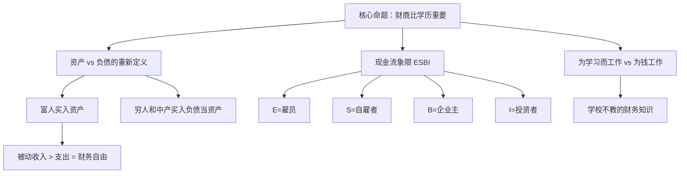

## 一、经济学坐标定位

> [!abstract] 速览
> 《穷爸爸，富爸爸》（*Rich Dad Poor Dad*）是罗伯特·清崎（Robert Kiyosaki）于1997年出版的个人理财书籍，全球销量超过4000万册，是史上最畅销的个人理财类书籍之一。书中以两个"爸爸"——作者的亲生父亲（"穷爸爸"，高学历的政府雇员）和好友的父亲（"富爸爸"，没有高学历但善于投资的企业家）——的对比来阐述关于金钱、投资和财务自由的核心理念。

本书在个人理财领域的地位：它是"财商教育"（Financial Literacy）运动的催化剂之一，在全球范围内改变了无数人对金钱和工作的看法。它不是一本技术性的投资指南，而是一本==观念革命==的书——它挑战了"好好读书、找份好工作、存钱养老"这一传统路径。

> [!warning] 阅读提示
> 本书的核心价值在于**思维框架的转变**，而非具体的投资建议。清崎的一些具体投资建议（如大量使用杠杆购买房地产）在不同的经济环境和国家法律框架下可能具有很大风险。清崎本人的商业生涯也存在争议（其公司曾申请破产保护）。读者应区分书中有启发性的理念和需要审慎对待的具体操作建议。

---

## 二、全书模型地图

> [!note] 核心框架

全书围绕"穷爸爸"与"富爸爸"的观念对比展开，核心论点链为：

1. **传统教育的缺陷**：学校教你为钱工作，不教你让钱为你工作
2. **资产与负债的重新定义**：把钱放进你口袋的是资产，从口袋拿走钱的是负债
3. **现金流的重要性**：关注现金流而非净资产
4. **ESBI象限**：从雇员/自雇者象限转向企业主/投资者象限
5. **财务自由公式**：被动收入 > 生活支出
6. **行动导向**：克服恐惧、懒惰和无知，开始投资

---

## 三、逐章深度拆解

### 主题一：「富人不为钱工作」——思维范式转换

**DIKW四层提炼**

- **Data**：清崎描述了"穷爸爸"的人生路径——努力读书、获得高学历、找到稳定的政府工作、一辈子为钱焦虑，最终没有留下多少财产。"富爸爸"则走了一条完全不同的路——早早开始做生意、投资房地产、让钱为自己工作。
- **Information**：两种人生路径的根本区别不在于智力或勤奋程度，而在于对金钱的==思维方式==不同。
- **Knowledge**：大多数人被困在"赚钱-消费-赚更多钱"的循环中（清崎称之为"老鼠赛跑"，Rat Race），是因为他们只学会了"为钱工作"，而没有学会"让钱为自己工作"。
- **Wisdom**：真正的财务教育不是学习如何赚更多工资，而是学习如何==改变你与金钱的关系==。

**第一性原理审查**：清崎的底层假设是"传统教育系统不教财务知识"。这个假设在大多数国家是基本成立的——中小学几乎不教个人理财、投资、税务等实用财务知识。但清崎由此推导出"学历不重要"则是一个过度简化——在很多行业和阶层，教育仍然是社会流动的重要通道。

**反脆弱压力测试**：清崎的叙事存在明显的幸存者偏差——他用"富爸爸"的成功来证明不走传统路径也能成功，但忽略了大量不走传统路径却失败的人。"穷爸爸"式的路径虽然不会让你成为富翁，但它提供了基本的生存保障和社会安全网，这对于风险承受能力低的人来说是合理选择。

**费曼式解读**：想象两只仓鼠。一只在转轮上拼命跑——跑得越快，轮子转得越快，但它永远待在原地（为钱工作的人）。另一只花时间研究了一下轮子的结构，找到了一个方法让轮子自己转（让钱为自己工作的人）。清崎的核心信息就是：==别只顾着跑，先想想轮子的结构==。

---

### 主题二：资产与负债的重新定义

**DIKW四层提炼**

- **Data**：清崎给出了一个极简的定义——==资产是把钱放进你口袋的东西，负债是把钱从你口袋拿走的东西==。
- **Information**：按照这个定义，很多人以为的"资产"其实是负债。最典型的例子：自住房产。传统观念认为买房是"投资"，但如果房子每月需要你支付房贷、税费、维护费，而不产生任何收入，那么按清崎的定义，它是负债，不是资产。
- **Knowledge**：财务决策的核心问题不是"我能不能买得起"，而是"它会给我带来正现金流还是负现金流"。
- **Wisdom**：==富人专注于积累产生正现金流的资产==（租金收入的房产、股息、版权收入、企业利润），而穷人和中产把大部分收入花在负债上（自住房贷、车贷、消费品），误以为自己在"投资"。

> [!tip] 三种现金流模式
> - **穷人**：收入 → 支出（月光）
> - **中产**：收入 → 负债（房贷、车贷）→ 支出
> - **富人**：资产 → 收入 → 再投资更多资产

**第一性原理审查**：清崎对"资产"和"负债"的定义与会计学的标准定义不同。在会计学中，房子不论是否产生收入，都被列为资产（因为它有市场价值）。清崎的定义是==现金流导向==的——他关注的不是资产负债表上的净值，而是每月的现金流方向。这个定义在个人理财的语境中有其实用价值，但不能简单套用到企业财务或正式的经济分析中。

**反脆弱压力测试**：清崎关于自住房产是"负债"的观点，在不同的经济环境下有不同的有效性。在房价长期上涨的市场（如过去几十年的中国一线城市），自住房产的增值可能远超持有成本，从"总回报"的角度看它仍然是好的投资。但在房价停滞或下跌的市场中，清崎的逻辑更有说服力。此外，自住房产提供的居住功能和心理安全感也有其价值——清崎过于纯粹地从现金流角度看待这个问题。

> [!warning] 注意
> 清崎的资产/负债定义是理解其思想的钥匙，但不要机械套用。它是一个思维工具，不是绝对标准。

---

### 主题三：现金流象限（ESBI模型）

**DIKW四层提炼**

- **Data**：清崎将所有获取收入的方式分为四个象限——E（Employee，雇员）、S（Self-employed，自雇者）、B（Business Owner，企业主）、I（Investor，投资者）。
- **Information**：左侧象限（E和S）是"用时间换钱"——你停止工作，收入就停止。右侧象限（B和I）是"用系统和金钱赚钱"——即使你不工作，收入也在流入。
- **Knowledge**：财务自由的关键不是赚更多的工资（在E象限跑得更快），而是==从左侧象限转移到右侧象限==。
- **Wisdom**：真正的自由来自于建立不依赖你个人时间的收入来源。

**第一性原理审查**：清崎的假设是"从E/S转到B/I是所有人应该追求的方向"。这个假设忽略了几个现实：
1. 很多人在E象限（如医生、工程师、高管）可以获得很高的收入和满足感
2. B象限的成功率极低——大多数创业以失败告终
3. I象限需要足够的本金——没有积蓄就无法有效投资

**反脆弱压力测试**：ESBI模型作为思维框架是有启发性的，但它过度简化了现实。现代经济中，很多角色模糊了象限的边界——比如一个有股权的创业公司员工同时处于E和I象限；一个做副业的上班族同时处于E和S象限。此外，互联网经济创造了很多新的收入模式（内容创作、在线教育等），不完全适用于清崎1997年的框架。

**费曼式解读**：想象四种果树。E象限的树，你摇一下出一个果子，不摇就没有。S象限的树，你精心照料出更多果子，但只有你自己会照料。B象限的树，你种好了之后雇人照料，果子自己掉下来。I象限是你用前面的果子买更多果树，让果树自己生果子。清崎说：==别一辈子只摇树，要学会种树==。

---

### 主题四：学校不教的财务知识

**DIKW四层提炼**

- **Data**：清崎指出传统教育系统培养的是"好雇员"——服从规则、追求稳定、害怕犯错。它不教你如何阅读财务报表、如何理解税法、如何评估投资、如何管理风险。
- **Information**：财务知识的缺失导致了"受过良好教育的穷人"——他们可能是优秀的工程师或医生，但在财务上是文盲，把大部分收入交给了税务和不必要的消费。
- **Knowledge**：清崎认为有四种核心财务技能——会计（理解数字）、投资（钱生钱的策略）、市场（供需关系）、法律（税务优惠和资产保护）。
- **Wisdom**：==不是你赚多少钱，而是你留下多少钱、如何让它为你工作==。

**第一性原理审查**：清崎对教育系统的批评有一定道理——大多数国家的中小学确实不教个人理财。但他由此推论"学历不重要"是过度延伸。教育提供的不仅是职业技能，还有批判性思维、学习能力、社交网络等，这些对财务成功同样重要。更准确的说法应该是："传统教育是必要但不充分的——你还需要自学财务知识。"

**反脆弱压力测试**：清崎的"四种财务技能"中，"法律"（尤其是税务优化）部分高度依赖于具体国家和地区的法律体系。美国的税法（如1031交换、折旧抵税）与中国、日本或欧洲国家的税法差异巨大。读者不应直接照搬清崎的具体税务策略，而应理解其底层逻辑：合法利用税法框架来保护和增长财富。

---

### 主题五：克服恐惧与开始行动

**DIKW四层提炼**

- **Data**：清崎列举了阻止人们迈向财务自由的五大障碍——恐惧（害怕亏损）、愤世嫉俗（"有钱人都是坏人"）、懒惰（不愿学习新东西）、坏习惯（先消费后储蓄）、傲慢（不愿承认自己的无知）。
- **Information**：这五大障碍本质上都是==心理障碍而非知识障碍==。大多数人不投资不是因为不懂，而是因为害怕。
- **Knowledge**：富人和穷人的区别不在于是否害怕——每个人都害怕亏钱——而在于他们如何处理恐惧。穷人让恐惧阻止行动，富人带着恐惧行动。
- **Wisdom**：==失败是学习的一部分==。清崎引用了一个类比：学骑自行车必须摔几次。投资也是一样——你不可能在不犯错的情况下学会投资。

**第一性原理审查**：清崎关于"恐惧阻止行动"的观察是有道理的——行为金融学大量研究证实了"损失厌恶"（Loss Aversion）的存在。但他由此推导出的"就要勇敢投资"有过度简化的风险。在行为金融学中，适度的损失厌恶是理性的——它防止你做出过度冒险的决定。清崎的建议更适合那些因过度保守而完全不投资的人，而不适合那些可能因为过度自信而承担过多风险的人。

**反脆弱压力测试**：清崎在书中多次强调"失败是最好的老师"，并分享了自己亏损的经历。但他没有充分讨论==有些失败是不可逆的==——比如用全部积蓄加杠杆投资失败，可能导致破产和家庭破裂。真正的风险管理不是"不怕失败"，而是"确保失败不会摧毁你"。

---

### 主题六：税务与法律——富人的游戏规则

**DIKW四层提炼**

- **Data**：清崎详细解释了美国税法如何有利于企业主和投资者——企业先赚钱、再花钱、最后交税，而雇员先赚钱、先交税、再用剩下的钱花。
- **Information**：这种税务结构意味着同样赚100万，企业主的实际可用资金远多于雇员——因为企业可以在税前扣除大量"合法"的费用（办公设备、差旅、车辆等）。
- **Knowledge**：富人不是在"逃税"，而是在==合法利用税法的激励机制==。税法的设计本身就倾向于鼓励创业和投资。
- **Wisdom**：不了解税法就是在多交不必要的税。税务知识是财务自由的重要组成部分。

> [!warning] 重要提醒
> 清崎的税务讨论完全基于美国税法。不同国家的税务体系差异极大。读者应理解的是**底层逻辑**（合法利用税法框架），而非具体操作。在任何国家进行税务规划都应咨询专业税务顾问。

**第一性原理审查**：清崎的底层假设是"税法的设计有利于企业主和投资者"。这在美国（以及很多资本主义国家）基本成立——政府通过税收优惠鼓励创业和投资。但这也引出了一个清崎没有深入讨论的公平性问题：这种税务结构在客观上加剧了贫富差距——有能力利用税法的人越来越富，而只有工资收入的人承担了更高比例的税负。

---

## 四、核心经济框架提炼

> [!note] 清崎思想的核心公式

**财务自由公式**：被动收入 > 生活支出

**现金流思维**：

| 维度 | 穷人/中产思维 | 富人思维 |
|------|-------------|---------|
| 收入来源 | 工资（主动收入） | 资产产生的被动收入 |
| 消费模式 | 赚多少花多少 | 先买资产，用资产收益消费 |
| 房产观念 | 自住房是最大的投资 | 产生租金的房产才是投资 |
| 教育观念 | 学历 = 好工作 = 安全 | 财务知识 = 财务自由 |
| 风险态度 | 回避风险 | 管理风险 |
| 金钱关系 | 为钱工作 | 让钱为自己工作 |

**核心行动模型**：
1. 先支付自己（Pay Yourself First）——收入的一部分先用于投资，再用于消费
2. 用资产收入购买奢侈品——而不是用工资收入
3. 持续学习财务知识——阅读、上课、实践
4. 从小额开始投资——不要等到"有足够的钱"才开始

---

## 五、预测与现实对照

清崎在1997年出版此书时的一些观点，与之后的现实对照：

| 清崎的观点 | 后续验证 |
|-----------|---------|
| 传统退休金制度不可靠 | 基本验证。全球养老金危机日益严重 |
| 房地产是好的投资工具 | 部分验证。2008年金融危机表明房地产投资也有巨大风险 |
| 财务教育缺失是根本问题 | 广泛认同。全球"财商教育"运动兴起 |
| 好工作不等于财务安全 | 基本验证。裁员、行业衰退、通胀侵蚀工资购买力 |
| 创业和投资是致富之路 | 部分验证。但创业失败率极高（约90%），投资也可能亏损 |

---

## 六、学派争鸣

> [!note] 不同声音

**支持者观点**：
- 清崎改变了数百万人对金钱的思维方式
- 他的"资产/负债"重新定义虽然不严谨，但具有极强的教育效果
- 他让普通人意识到"被动收入"的重要性

**批评者观点**：
- **约翰·里德**（房地产投资专家）指出清崎的很多具体投资建议过于简化，在实际操作中可能导致亏损
- **学术界**普遍认为清崎缺乏经济学和金融学的学术训练，他的理论框架过于粗糙
- **"富爸爸"的真实性**：有调查质疑"富爸爸"是否真实存在，清崎始终未公开此人的身份
- **清崎公司破产**：清崎名下的公司Rich Global LLC于2012年申请破产保护，这对一个教人"如何致富"的人来说颇具讽刺意味（尽管清崎解释这是法律策略而非个人破产）

**平衡看法**：==把《穷爸爸，富爸爸》当作一本观念启蒙书，而不是投资操作手册==。它最大的价值在于思维转换——让你开始思考被动收入、现金流、资产积累。但具体的投资决策需要更专业、更系统的学习。

---

## 七、实践决策指南

> [!tip] 可操作的行动步骤

1. **审计你的财务状况**：列出你所有的"资产"和"负债"，按清崎的定义（看现金流方向）而非传统会计定义来分类。看看你有多少真正产生正现金流的资产？

2. **计算你的"财务自由数字"**：每月生活支出 × 12 ÷ 投资年回报率 = 你需要的资产总额。例如月支出1万，年回报5%，则需要240万的投资资产。

3. **启动"先支付自己"**：每月收入到账后，先拿出10%-20%用于投资，剩下的才用于消费。

4. **学习一种投资方式**：不要什么都学，先精通一种——房地产、股票指数基金、或者创建副业。

5. **阅读财务报表**：学会阅读基本的资产负债表和利润表，至少要能看懂你自己的财务状况。

6. **建立应急基金**：在开始投资之前，先存够3-6个月生活费的应急基金。清崎没有强调这一点，但这是==投资之前的必要安全网==。

---

## 八、费曼终极检验

> [!abstract] 一句话概括

清崎的核心信息用一句话说就是：==别把所有时间都花在为别人赚钱上（打工），花点时间学习如何让钱为你赚钱（投资）==。

具体来说：
- 学校教你做好员工，但没教你做好投资者
- 大多数人以为的"资产"（自住房、车）其实在吃掉你的钱
- 真正的资产是能每月往你口袋里放钱的东西（出租房、股票分红、生意）
- 当你的被动收入超过你的生活支出时，你就自由了——不是因为你有很多钱，而是因为你不再需要为钱工作

这本书最大的价值不在于教你具体怎么投资（它在这方面其实很粗糙），而在于让你==重新思考你和金钱的关系==。如果它让你开始关注被动收入和现金流，它就已经完成了它的使命。至于具体怎么做，你需要去读更专业的书。

---

## 延伸阅读路线图

> [!note] 推荐阅读路径

- [[《穷查理宝典》]] — 查理·芒格的投资智慧，比清崎更有深度和学术基础
- [[《小狗钱钱》]] — 适合理财入门的寓言故事，比清崎更温和也更务实
- [[《思考，快与慢》]] — 了解影响你财务决策的认知偏差
- [[《投资最重要的事》]] — 霍华德·马克斯的投资哲学，提供了清崎缺乏的风险管理视角
- [[《漫步华尔街》]] — 对于普通投资者，指数基金可能比清崎推荐的房地产投资更适合
- [[《原则》]] — 达利欧的全面思维框架，将投资与人生决策结合
