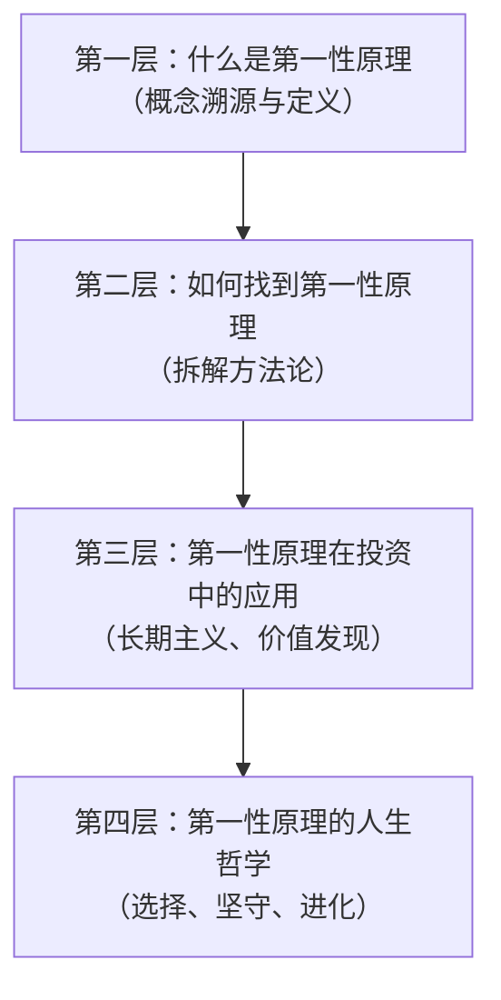
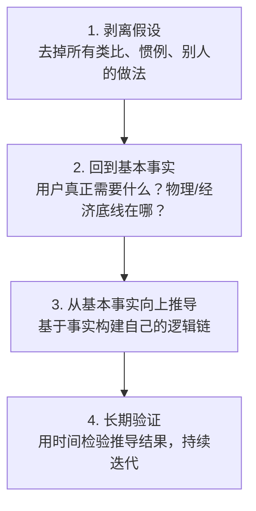

# 《第一性原理》深度拆解

## 一、商业坐标定位

《第一性原理》是高瓴资本创始人张磊的思想之作，脱胎于他在投资实践中形成的方法论体系。张磊管理的高瓴资本是亚洲最大的私募股权基金之一，早期投资了腾讯、京东、百度等企业。本书的核心不是教你怎么选股票，而是试图回答一个更底层的问题：==在一个充满不确定性的世界里，做决策的「第一块基石」是什么？==

本书处于投资哲学与思维方法论的交叉地带。它既不是巴菲特式的价值投资操作手册，也不是纯粹的哲学思辨，而是用「第一性原理」这个思维工具串联起投资、商业、人生的底层逻辑。与[[《价值》]]（张磊另一部著作）相比，本书更聚焦于思维方式而非投资案例；与[[《穷查理宝典》]]相比，它更系统化、更有框架感。

## 二、商业逻辑地图

全书逻辑可提炼为**四层递进结构**：

**核心命题**：大多数人的决策建立在类比、经验和惯例之上（"别人这么做，所以我也这么做"）。第一性原理要求你==剥离所有既有假设，回到最基本的事实，从那里重新推导==。这种思维方式在投资中意味着看穿泡沫、在商业中意味着找到护城河、在人生中意味着活出自主选择。

## 三、逐章深度拆解

### 主题一：「第一性原理的本源——从亚里士多德到马斯克」

> [!tip] 核心概念溯源

**【核心论点】**

「第一性原理」这个概念最早来自亚里士多德：==在每一个系统中，都存在一个最基本的命题或假设，它不能被违背或删除，也不能从其他命题推导出来==。张磊将这个哲学概念拉到商业语境中：做任何决策之前，先问"这件事最底层的事实是什么？去掉所有假设和类比之后，还剩下什么？"

**【详细拆解】**

张磊区分了两种思维模式：

- **类比思维**：别人做电商赚钱了，我也做电商。行业平均利润率是15%，所以我们的目标也是15%。这种思维安全但平庸，因为你永远在别人的框架里思考。
- **第一性原理思维**：用户真正需要的是什么？这个需求的物理/经济/人性底线在哪里？达到这个底线的最佳路径是什么？——不管别人怎么做，从基本事实出发重新推导。

张磊引用了马斯克造火箭的案例：传统思维是"火箭就是很贵的"，马斯克的第一性原理思维是"火箭的原材料成本只占售价的2%，那么贵的部分是什么？是一次性使用。如果火箭能回收，成本就能降低一个数量级。"

**【费曼式解读】**

你去市场买菜，看到西红柿标价10块一斤。类比思维：隔壁摊也卖10块，那就是这个价。第一性原理思维：西红柿的种植成本是多少？运输成本是多少？摊位租金分摊多少？合理利润是多少？——当你算完发现成本只有3块时，你就知道10块里有7块是可以被优化或挑战的空间。

**【金句/关键概念】**

> ==把问题拆解到最基本的真相，然后从那里向上推导，而不是通过类比来推理。==

---

### 主题二：「长期主义——时间是第一性原理的最佳检验者」

> [!note] 对应核心章节

**【核心论点】**

张磊认为，第一性原理在投资和商业中最重要的应用就是==长期主义==：当你回到最基本的事实——用户需求、技术趋势、人性规律——你会发现，真正有价值的东西都需要时间来积累，而短期波动只是噪音。

**【详细拆解】**

长期主义不是"买了不卖"的傻等，而是基于三个底层判断：

1. **复利效应是最强大的力量**：爱因斯坦称复利为"世界第八大奇迹"。张磊将此扩展到商业领域——知识复利、信任复利、品牌复利，都是指数级增长曲线，但前期增长极慢，只有长期持有才能享受到指数爆发。
2. **短期市场是投票机，长期市场是称重机**：这是格雷厄姆的经典论断。张磊将其深化——短期内市场受情绪驱动，价格和价值可以严重偏离；长期来看，价格终将回归价值。第一性原理思维帮你看到价值，长期主义让你有耐心等待价格回归。
3. **真正的护城河需要时间构建**：品牌认知、网络效应、规模经济、转换成本——所有持久的竞争优势都需要时间积累。短期暴富的方法往往没有护城河。

**【费曼式解读】**

想象你种了一棵竹子。前四年它几乎不长——地面上只有几厘米。但它在地下扎根，建立庞大的根系。第五年，它在六周内长到30米高。大多数人在前四年就放弃了，因为他们看不到地下的根。长期主义就是理解"根"的人。

**【金句/关键概念】**

> ==做时间的朋友，不做时间的敌人。长期主义不是慢，而是不可逆的积累。==

---

### 主题三：「价值发现——用第一性原理穿透表象」

> [!tip] 投资方法论的核心

**【核心论点】**

张磊的投资方法论本质上是：==用第一性原理找到被市场误定价的价值==。市场误定价的原因往往是大多数人在用类比思维——行业不行了、公司太小了、没人关注——而第一性原理思维让你穿透这些表象，看到底层的价值创造能力。

**【详细拆解】**

张磊提出了价值发现的三个维度：

- **行业的第一性原理**：这个行业存在的根本原因是什么？用户的底层需求是什么？这个需求会不会消失？比如，零售业的第一性原理是"让消费者以最低的交易成本获得想要的商品"——从百货商店到电商到直播带货，形式在变，但底层需求不变。
- **企业的第一性原理**：这家企业的核心竞争力到底是什么？剥离掉品牌光环、行业红利、运气成分，它真正做对了什么？这个"做对的事"能不能持续？
- **人的第一性原理**：创始人的底层驱动力是什么？是赚钱、是改变世界、还是证明自己？张磊认为最好的创始人是那些被使命驱动的人——因为只有使命感才能支撑长期的坚持和投入。

高瓴早期投资京东的逻辑：当时京东不赚钱、物流烧钱、被很多人看衰。但张磊用第一性原理分析：用户需要正品、需要快速配送、需要好的服务体验——京东的自建物流虽然短期烧钱，但长期来看构建了不可复制的竞争壁垒。

**【费曼式解读】**

大多数人看一家餐厅，看的是装修、菜单、价格。第一性原理看的是：厨师的手艺如何？供应链能不能稳定供应好食材？回头客比例高不高？位置有没有天然的人流？——前者是表象，后者是价值的根基。

**【金句/关键概念】**

> ==投资的本质不是选择风口，而是发现价值创造的根源。==

---

### 主题四：「研究驱动——深度理解是信念的基础」

> [!note] 方法论落地

**【核心论点】**

第一性原理不是空想，它需要==极致的研究深度==来支撑。张磊强调，高瓴的核心竞争力不是资金规模，而是研究能力——对行业、企业、人的深度理解。

**【详细拆解】**

张磊描述的研究方法论包括：

- **全景式研究**：不只研究一家公司，而是研究整个产业链——上游供应商、下游客户、竞争对手、替代品、互补品。只有理解了整个生态，才能判断一家企业在其中的位置是否牢固。
- **跨时间维度研究**：不只看财务报表的当下数据，而是追溯行业和企业的发展历史，理解"为什么走到了今天"。同时向前推演——未来三年、五年、十年，行业格局会怎么变？
- **与最聪明的人交流**：张磊强调与行业专家、创始人、一线员工的深度对话。书面材料是二手信息，一手信息来自与人的交流。
- **逆向思维验证**：每得出一个结论，都要问"这个结论在什么情况下会错？"——用反面论证来压力测试自己的判断。

**【费曼式解读】**

你要买一套房子。普通做法是看看周边房价、问问中介、实地逛逛。第一性原理的研究方法是：查这个区域的城市规划（未来会建什么？）、研究交通网络变化（会不会通地铁？）、了解学校和医院规划（配套会不会升级？）、分析人口流入趋势（需求会增长吗？）、甚至和住在那里的人聊聊真实的居住体验。做完这些，你的判断力和那些只看价格的人完全不在一个层次。

**【金句/关键概念】**

> ==研究的深度决定了信念的强度。只有真正理解了，才能在别人恐惧时贪婪、在别人贪婪时恐惧。==

---

### 主题五：「护城河思维——可持续竞争优势的底层逻辑」

> [!tip] 巴菲特框架的张磊式重构

**【核心论点】**

张磊继承了巴菲特的"护城河"概念，但做了重要升级：==护城河不是静态的，而是动态的==。真正的护城河不是你今天拥有什么，而是你持续创造价值的能力。

**【详细拆解】**

张磊区分了两种护城河：

- **静态护城河**（传统理解）：品牌、专利、牌照、网络效应、规模经济。这些是巴菲特和芒格强调的经典护城河。问题是，在技术变革加速的时代，静态护城河可能被颠覆——柯达有品牌和专利，但数码相机一来就崩了。
- **动态护城河**（张磊的升级）：持续创新的能力、组织学习的能力、适应变化的能力。张磊称之为"==疯狂地创造长期价值=="。他认为最好的护城河是企业不断进化的能力——就像亚马逊，它的护城河不是某一项业务，而是不断发现新增长点并快速执行的组织能力。

**【费曼式解读】**

中世纪城堡的护城河是一条水沟——敌人来了过不去。但如果敌人会飞呢？静态护城河就失效了。动态护城河更像是免疫系统——不管什么新病毒来，它都能学习、适应、产生新的抗体。你不知道下一个"病毒"是什么，但你知道你的"免疫系统"会应对。

**【金句/关键概念】**

> ==世界上只有一条真正的护城河，就是你持续疯狂地创造长期价值。==

---

### 主题六：「选择与坚守——人生决策的第一性原理」

> [!abstract] 从商业到人生

**【核心论点】**

张磊将第一性原理从投资延伸到人生：==人生最重要的决策——做什么行业、和谁合作、追求什么——也应该用第一性原理来思考==。不要因为别人在做而做，不要因为看起来赚钱而做，而是回到你自己最底层的特质、热情和能力，从那里向上推导。

**【详细拆解】**

张磊提出了人生选择的三个第一性原理：

1. **选择做自己热爱的事**：热爱是持久努力的燃料。类比思维让你选择"看起来好的"行业，第一性原理让你选择"你真正擅长且热爱的"方向。长期来看，只有热爱才能支撑你度过那些看不到回报的岁月。
2. **选择和优秀的人在一起**：人是环境的产物。张磊强调"与谁同行比去向何方更重要"——因为优秀的同伴会拉高你的标准、拓展你的认知边界、在你困难时提供支持。
3. **选择做有长期积累的事**：避免做"每天从零开始"的工作。优先选择知识、技能、声誉、关系能够复利积累的方向。

**【费曼式解读】**

你站在人生的岔路口，一条路是高薪但你不喜欢的金融分析师，一条路是收入不确定但你热爱的产品设计。类比思维说：选金融，因为别人都说赚钱。第一性原理说：先问你自己三个问题——10年后你更可能在哪个领域做到顶尖？哪个方向你愿意周末也研究？哪个领域你的天赋最能发挥？——答案往往指向热爱。

**【金句/关键概念】**

> ==选择比努力重要，而好的选择来自回到本源的思考。==

---

### 主题七：「生态型组织——用第一性原理构建企业」

> [!note] 组织方法论

**【核心论点】**

张磊认为，第一性原理不仅适用于投资决策，也适用于组织建设：==最好的企业不是机器，而是生态系统==。

**【详细拆解】**

张磊描述的理想组织形态：

- **使命驱动而非KPI驱动**：KPI是类比思维的产物（别的公司用KPI考核，我们也用）。第一性原理问：我们到底要解决什么问题？能不能让每个人都理解并认同这个使命，从而自驱？
- **学习型组织**：外部环境不断变化，组织的核心能力不是现有的知识存量，而是学习新知识的速度。张磊要求高瓴的团队保持"永远的求知者"心态。
- **容错与迭代**：第一性原理思维不等于不犯错，而是快速试错、快速学习。好的组织设计是让试错成本可控，同时让成功经验能快速扩散。

**【费曼式解读】**

一台精密机器效率很高，但一个零件坏了可能全部停转。一片森林看起来"效率低"——树木之间争夺阳光、根系互相竞争——但森林作为整体极其坚韧，火灾之后能重生，干旱之后能恢复。张磊想打造的组织更像森林，而非机器。

**【金句/关键概念】**

> ==组织的第一性原理是：让正确的人在正确的环境中自然生长。==

---

### 主题八：「知行合一——从思维到实践」

> [!abstract] 全书收束

**【核心论点】**

张磊在全书最后回到一个朴素的命题：==知道第一性原理不难，难的是在压力下坚持用它==。市场恐慌时、众人狂热时、短期看不到结果时——这些才是第一性原理思维真正受到考验的时刻。

**【详细拆解】**

张磊提出了"知行合一"的三个层次：

1. **知道**：理解第一性原理的概念——这是最容易的一步。
2. **相信**：通过深度研究建立信念，让第一性原理从"知识"变成"信仰"——这需要时间和实践积累。
3. **做到**：在最困难的时刻仍然坚持——当市场暴跌50%、当所有人都说你错了、当三年没有回报——你还能不能坚持自己的判断？

张磊认为高瓴能在竞争激烈的投资市场中脱颖而出，核心不是智力优势，而是纪律优势——在别人恐慌抛售时买入，在别人狂热追高时保持冷静。而这种纪律来自于第一性原理带来的深度信念。

**【费曼式解读】**

你知道每天锻炼有益健康——这是"知道"。你读了大量医学文献、理解了运动对心血管和大脑的具体机制——这是"相信"。你在下雨天、加班后、情绪低落时仍然坚持去跑步——这是"做到"。第一性原理思维的真正价值不在于你能在咖啡厅里谈论它，而在于你能在暴风雨中践行它。

**【金句/关键概念】**

> ==在最困难的时刻坚持第一性原理，这本身就是最大的竞争优势。==

---

## 四、核心决策框架提炼

### 张磊的决策框架可提炼为四步：

### 护城河评估模型：

| 维度 | 问什么 |
|------|--------|
| 需求基础 | 用户的底层需求是否真实且持久？ |
| 价值创造 | 企业解决了什么别人解决不了的问题？ |
| 竞争壁垒 | 这个优势能不能被轻易复制？为什么？ |
| 动态进化 | 企业有没有持续创新和自我更新的能力？ |
| 人的因素 | 创始人/团队的驱动力和学习能力如何？ |

### 逆向思维清单：

> [!warning] 每个结论都要过一遍
> 1. 这个结论在什么情况下会错？
> 2. 我是不是在做类比而非第一性原理思考？
> 3. 有没有幸存者偏差——我只看到了成功案例？
> 4. 如果市场条件发生根本性变化，这个判断还成立吗？
> 5. 有没有我忽略的反面证据？

## 五、幸存者偏差审查

> [!warning] 需要注意的局限

1. **高瓴的成功案例可能有选择性呈现**：书中列举的都是成功投资（京东、腾讯等），但高瓴必然也有失败案例。用成功案例论证方法论的正确性，存在幸存者偏差的风险。
2. **第一性原理的门槛被低估**：真正的第一性原理思考需要极深的行业知识和判断力。普通投资者可能以为自己在做第一性原理分析，实际上在做肤浅的类比。
3. **长期主义的特权性**：高瓴管理的是长期资本（LP锁定期长），普通投资者面临的流动性约束完全不同。"做时间的朋友"的前提是你有时间——这对很多人来说是奢侈品。
4. **事后归因的风险**：投资结果好 → 归功于方法论正确。但也可能是运气、时代红利或其他因素。方法论的因果贡献很难精确分离。

## 六、时效性评估

| 论点 | 时效性 | 说明 |
|------|--------|------|
| 第一性原理思维方法 | 永恒适用 | 哲学工具，不受时代限制 |
| 长期主义 | 高度适用 | 复利逻辑不变，但需要适配个人资本期限 |
| 动态护城河 | 高度适用 | 技术变革加速的时代反而更重要 |
| 具体投资案例 | 时效递减 | 京东、腾讯的案例属于特定历史阶段 |
| 中国市场判断 | 需更新 | 2020年后中国商业环境变化显著 |

## 七、类比迁移实战指南

**第一性原理在日常决策中的应用**：

- **职业选择**：不要问"什么行业最火"（类比思维），而要问"我的核心能力是什么？哪个方向能最大化我的独特优势？"（第一性原理）
- **学习策略**：不要问"别人学什么"（类比思维），而要问"我想解决什么问题？解决这个问题需要什么知识？"（第一性原理）
- **产品设计**：不要问"竞品怎么做的"（类比思维），而要问"用户未被满足的底层需求是什么？"（第一性原理）
- **团队管理**：不要问"大厂怎么管理的"（类比思维），而要问"我们团队要达成的目标到底是什么？什么样的协作方式最能服务这个目标？"（第一性原理）

## 八、费曼终极检验

你做决策的时候，大多数时候是在"抄作业"——看看别人怎么做、行业平均水平是多少、专家怎么说——然后跟着做。张磊这本书告诉你一种完全不同的思考方式：==把所有别人的做法、行业惯例、专家意见全部扔掉，回到最基本的事实：用户到底需要什么？物理和经济的底线在哪里？从这些不可压缩的事实出发，重新推导出你自己的答案==。这就是"第一性原理"。它在投资中帮你看穿泡沫、找到真正有价值的企业；在职业中帮你做出不随大流的选择；在人生中帮你活得更自主。当然，真正难的不是理解这个道理，而是在所有人都反对你的时候，还能坚持从第一性原理出发的判断。张磊管这叫"==做时间的朋友=="——因为短期内第一性原理可能让你显得格格不入，但时间会证明那些回到本质的人走得最远。
