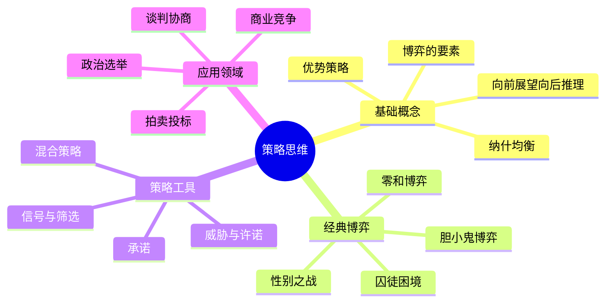
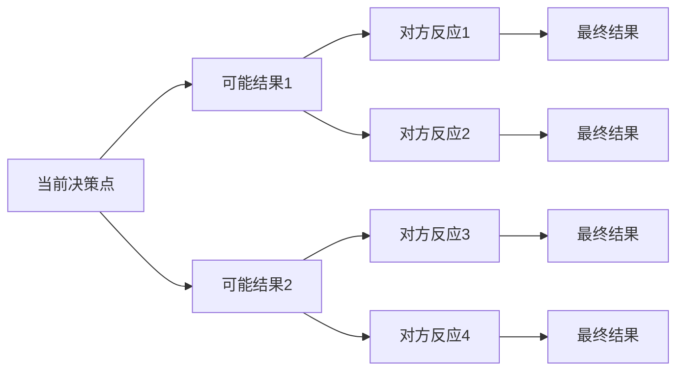
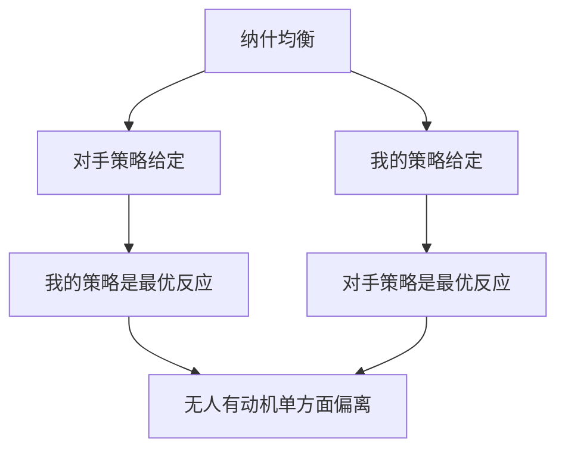
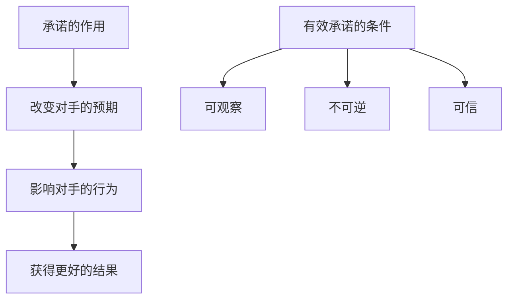
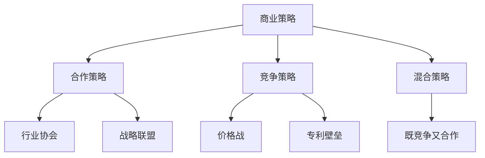
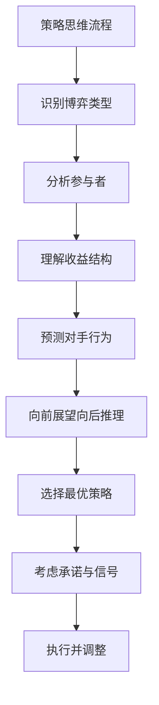

# 《策略思维》深度拆解

## 一、元信息/坐标定位

### 作者背景
==阿维纳什·迪克西特==（Avinash Dixit）是普林斯顿大学经济学教授，国际贸易和博弈论领域的顶级学者。==巴里·奈尔伯夫==（Barry Nalebuff）是耶鲁大学管理学院教授，专注于博弈论在商业中的应用。两位作者都是将复杂经济学理论通俗化的高手。

### 写作背景
本书英文原名《Thinking Strategically》，首次出版于1991年。它是第一本将博弈论从学术象牙塔带入大众视野的通俗读物，出版后成为畅销书，被翻译成多种语言，至今仍是博弈论入门的经典之作。

### 学科定位
本书属于==博弈论与决策科学==领域，是一本将博弈论应用于日常生活和商业决策的实用指南。它不使用复杂的数学公式，而是通过丰富的案例和故事来阐述博弈论的核心概念。

### 核心价值主张
> [!abstract] 核心观点
> 在互动情境中，你的最优决策取决于他人的决策，而他人的决策又取决于你的决策。理解这种相互依存性，学会"向前展望、向后推理"，是策略思维的核心。

### 目标读者
商业决策者、谈判者、政策制定者，以及任何希望在竞争与合作中做出更明智决策的人。

---

## 二、全书逻辑地图

本书的逻辑结构是==从基础到应用、从理论到实践==：

**第一层：建立基础**——什么是博弈，什么是策略思维，核心概念介绍。

**第二层：经典博弈分析**——通过囚徒困境、胆小鬼博弈等经典案例，理解不同类型博弈的特点。

**第三层：策略工具箱**——承诺、威胁、信号、混合策略等具体策略工具。

**第四层：现实应用**——商业、谈判、政治等领域的实际应用。

> [!note] 阅读建议
> 建议按顺序阅读，因为后面的章节建立在前面概念的基础上。每章结尾的案例和思考题非常有价值。

---

## 三、核心主题/逐章深度拆解

### 第一部分：博弈论基础

#### 1.1 什么是博弈

博弈是指存在==相互依存性==的决策情境：
- 你的决策影响他人的结果
- 他人的决策影响你的结果
- 双方都知道这种相互影响

> [!tip] 博弈的要素
> 1. **参与者**（Players）：做决策的主体
> 2. **策略**（Strategies）：每个参与者可选择的行动
> 3. **收益**（Payoffs）：不同策略组合下各方的结果
> 4. **信息**（Information）：参与者掌握的信息
> 5. **规则**（Rules）：博弈进行的顺序和约束

#### 1.2 向前展望，向后推理

这是本书最核心的思维方法：==从终点开始，倒推最优策略==。

> [!abstract] 向前展望，向后推理
> 1. **向前展望**：预测对手可能的反应
> 2. **向后推理**：从最终结果倒推，找出最优策略路径
> 3. **重复迭代**：在每个决策节点应用这个方法

#### 1.3 优势策略

==优势策略==是指无论对手怎么选，这个策略都是最好的。

> [!tip] 优势策略的分类
> - **严格优势策略**：无论对手如何选择，这个策略的收益都严格大于其他策略
> - **弱优势策略**：无论对手如何选择，这个策略的收益都不差于其他策略，且至少在某种情况下更好

如果你有优势策略，就使用它——这是博弈论最简单的建议。

#### 1.4 纳什均衡

==纳什均衡==是博弈论中最重要的概念之一：在这个状态下，==每个参与者都在做针对其他人策略的最优反应==，没有人有动机单方面改变自己的策略。

> [!warning] 纳什均衡的注意事项
> - 纳什均衡不一定是"最好"的结果（如囚徒困境）
> - 一个博弈可能有多个纳什均衡
> - 纳什均衡不一定会自然达成

### 第二部分：经典博弈分析

#### 2.1 囚徒困境

这是最著名的博弈：

|  | B合作 | B背叛 |
|--|------|------|
| **A合作** | (-1,-1) | (-10,0) |
| **A背叛** | (0,-10) | (-5,-5) |

> [!abstract] 囚徒困境的特点
> - **个体理性 vs 集体理性**：每个人的理性选择（背叛）导致对双方都不利的结果
> - **背叛是优势策略**：无论对方怎么选，背叛对自己都更好
> - **纳什均衡是双方背叛**：但这比双方合作更差

囚徒困境无处不在：
- 军备竞赛
- 价格战
- 公共资源过度开发
- 环境污染

> [!tip] 走出囚徒困境
> 1. **重复博弈**：如果博弈重复进行，合作可能成为均衡
> 2. **声誉机制**：关心长期声誉的人更倾向于合作
> 3. **外部执行**：引入第三方强制执行合作
> 4. **改变收益结构**：通过奖惩改变博弈的收益矩阵

#### 2.2 胆小鬼博弈（Chicken Game）

两辆车相向而行，看谁先转向：

|  | B直行 | B转向 |
|--|------|------|
| **A直行** | (-10,-10) | (1,-1) |
| **A转向** | (-1,1) | (0,0) |

> [!warning] 胆小鬼博弈的特点
> - **两个纳什均衡**：一方直行一方转向
> - **博弈的核心是"承诺"**：谁能让对方相信自己不会转向，谁就赢
> - **极端策略可能有效**：展示"不理性"可能是理性的

现实中的胆小鬼博弈：
- 劳资谈判
- 国际危机
- 商业谈判中的"掀桌子"

#### 2.3 性别之战（Battle of the Sexes）

夫妻选择晚上去看足球还是歌剧：

|  | 妻子：足球 | 妻子：歌剧 |
|--|---------|---------|
| **丈夫：足球** | (3,1) | (0,0) |
| **丈夫：歌剧** | (0,0) | (1,3) |

> [!note] 性别之战的特点
> - **两个纳什均衡**：都看足球或都看歌剧
> - **协调问题**：双方都希望在一起，但对活动有不同偏好
> - **需要协调机制**：如轮流选择、随机选择

#### 2.4 零和博弈

==零和博弈==是指一方所得恰好等于另一方所失。

> [!abstract] 零和博弈的特点
> - 没有共赢的可能
> - 纯粹的竞争关系
> - 最优策略是最小化最大损失（minimax）

大多数现实博弈不是严格的零和博弈——存在共赢或共输的可能。

### 第三部分：策略工具箱

#### 3.1 承诺的力量

==承诺==是限制自己未来选择的行为，但paradox地，它可以增强你的谈判地位。

> [!tip] 承诺的案例
> - **破釜沉舟**：断绝自己的退路
> - **签订合同**：用法律约束自己
> - **公开声明**：用声誉约束自己
> - **自动触发机制**：设置自动执行的条款

#### 3.2 威胁与许诺

==威胁==是承诺在对方不合作时惩罚对方。
==许诺==是承诺在对方合作时奖励对方。

> [!warning] 有效威胁的条件
> 1. **可信性**：对方相信你会执行威胁
> 2. **充分性**：威胁的后果足够严重
> 3. **清晰性**：对方明确知道什么行为会触发威胁

威胁的悖论：==真正有效的威胁是不需要执行的威胁==。如果威胁需要执行，说明它没有达到目的。

#### 3.3 信号与筛选

在信息不对称的情况下：
- ==信号==：知情方主动发送信息来证明自己的类型
- ==筛选==：不知情方设计机制来识别对方的类型

> [!abstract] 信号的有效性
> 有效的信号必须满足==分离条件==：
> - 对于"好"类型，发送信号的成本低于收益
> - 对于"坏"类型，发送信号的成本高于收益
> - 因此只有"好"类型会发送信号

信号的例子：
- 教育作为能力信号
- 质保作为质量信号
- 高价作为高品质信号

#### 3.4 混合策略

当纯策略无法找到稳定均衡时，==混合策略==可能是解决方案：以一定概率随机选择不同的策略。

> [!tip] 混合策略的逻辑
> 在混合策略均衡中，每个玩家的随机化使得对手对自己的每个纯策略都==无差异==。

混合策略的应用：
- 点球大战中的选择
- 检查员随机检查的时间
- 军事中的战术变化

### 第四部分：策略应用

#### 4.1 商业竞争

> [!abstract] 商业博弈的类型
> 1. **价格竞争**：往往是囚徒困境，导致价格战
> 2. **产量竞争**：古诺模型，双方产量互相影响
> 3. **差异化竞争**：通过产品差异避免正面竞争
> 4. **进入阻止**：在位者阻止新进入者

#### 4.2 谈判的艺术

> [!tip] 谈判的关键概念
> - **BATNA**：最佳替代方案（Best Alternative To Negotiated Agreement）
> - **谈判区间**：双方BATNA之间的空间
> - **锚定效应**：先出价可能影响最终结果

谈判策略：
1. **提高自己的BATNA**：增加谈判筹码
2. **降低对方的BATNA**：减少对方的选择
3. **承诺与威胁**：影响对方的预期
4. **信息控制**：选择性披露信息

#### 4.3 拍卖与投标

> [!abstract] 拍卖的类型
> - **英式拍卖**：公开叫价，价高者得
> - **荷兰式拍卖**：降价拍卖，首先接受者得
> - **密封投标**：一次出价，价高者得
> - **维克瑞拍卖**：密封投标，以第二高价成交

==赢家诅咒==：在共同价值拍卖中，赢家往往是高估价值最多的人。

#### 4.4 投票与政治

> [!warning] 投票的悖论
> - **康多塞悖论**：多数投票可能产生循环偏好
> - **Arrow不可能定理**：没有完美的投票制度
> - **策略投票**：理性选民可能不投自己最喜欢的候选人

政治策略：
- 议程设置的重要性
- 联盟的形成与瓦解
- 承诺与信誉在政治中的作用

---

## 四、核心框架提炼

### 策略思维框架

### 框架一：博弈分类矩阵

| 博弈类型 | 利益关系 | 信息结构 | 典型例子 |
|---------|---------|---------|---------|
| 零和博弈 | 纯竞争 | 完全信息 | 棋类游戏 |
| 囚徒困境 | 冲突为主 | 完全信息 | 价格战 |
| 协调博弈 | 合作为主 | 完全信息 | 标准制定 |
| 信号博弈 | 混合 | 不完全信息 | 招聘面试 |

### 框架二：策略选择清单

> [!abstract] 策略选择五步法
> 1. **有优势策略吗？**——有则使用
> 2. **对手有优势策略吗？**——假设他会使用
> 3. **有纳什均衡吗？**——分析可能的稳定状态
> 4. **需要承诺或威胁吗？**——考虑改变博弈结构
> 5. **存在信息不对称吗？**——考虑信号与筛选

### 框架三：谈判准备清单

1. **自我分析**
   - 我的目标是什么？
   - 我的BATNA是什么？
   - 我愿意接受的最低条件是什么？

2. **对手分析**
   - 对手的目标是什么？
   - 对手的BATNA是什么？
   - 对手的约束条件是什么？

3. **策略选择**
   - 我应该先出价还是后出价？
   - 我需要做出什么承诺？
   - 我应该透露什么信息？

---

## 五、批判性思考

### 5.1 本书的优势

**可读性强**：用丰富的故事和案例阐述抽象的博弈论概念，避免了数学公式的枯燥。

**实用性高**：每个概念都有现实应用的讨论，读者可以直接应用到工作生活中。

**系统性好**：从基础概念到高级策略，逐步深入，结构清晰。

### 5.2 本书的局限

> [!warning] 需要注意的问题

**理性假设**：博弈论假设参与者是理性的，但现实中人往往是有限理性的。

**简化模型**：现实博弈远比书中的例子复杂，参与者更多、信息更不完全、规则更模糊。

**执行困难**：知道理论和能够应用之间有很大差距，尤其是在情绪激动的谈判中。

**道德考量**：某些博弈论策略（如欺骗、威胁）可能涉及伦理问题。

### 5.3 与其他著作的比较

与[[《博弈论与经济行为》 - 冯·诺依曼]]相比，本书更通俗易懂，适合入门；那本书更数学化，适合专业学习。

与[[《合作的进化》 - 罗伯特·阿克塞尔罗德]]相比，本书涵盖更广，那本书专注于重复囚徒困境和合作的演化。

与[[《影响力》 - 罗伯特·西奥迪尼]]相比，本书更侧重策略分析，那本书更侧重心理影响。

---

## 六、行动清单

### 立即行动（本周）

- [ ] 回顾最近一次谈判或决策，分析其中的博弈结构
- [ ] 找一个正在进行的商业案例，用博弈论框架分析各方策略
- [ ] 思考你的"承诺"——你在什么情况下需要限制自己的选择来获得优势

### 短期行动（1-3个月）

- [ ] 在下一次重要谈判前，明确自己和对方的BATNA
- [ ] 练习"向前展望，向后推理"的思维方式
- [ ] 分析你所在行业的竞争格局，识别主要的博弈类型

### 长期行动（1年以上）

- [ ] 系统学习博弈论的进阶内容（如机制设计、拍卖理论）
- [ ] 建立策略思维的习惯，在重大决策前进行博弈分析
- [ ] 研究历史上著名的博弈案例（如古巴导弹危机、商业竞争史）

---

## 七、延伸阅读路线图

### 第一层：博弈论进阶
- [[《博弈论与经济行为》 - 冯·诺依曼]] - 博弈论的数学基础
- [[《合作的进化》 - 罗伯特·阿克塞尔罗德]] - 重复博弈与合作
- [[《拥抱竞争》 - 亚当·布兰登伯格]] - 商业中的合作竞争

### 第二层：谈判与影响
- [[《谈判力》 - 罗杰·费希尔]] - 原则性谈判
- [[《影响力》 - 罗伯特·西奥迪尼]] - 心理影响原理
- [[《绝不妥协》 - 克里斯·沃斯]] - FBI谈判专家的技巧

### 第三层：决策科学
- [[《思考，快与慢》 - 丹尼尔·卡尼曼]] - 认知偏误与决策
- [[《穷查理宝典》 - 彼得·考夫曼]] - 多元思维模型
- [[《超预测》 - 菲利普·泰洛克]] - 如何做出更好的预测

---

## 八、费曼终极检验

> [!abstract] 如果要向一个10岁的孩子解释这本书的核心思想：

想象你和朋友在玩石头剪刀布。

==第一个道理==：你出什么，要看你猜朋友会出什么。如果你猜他出剪刀，你就出石头。这就是"博弈"——你的选择取决于你对他选择的猜测。

==第二个道理==：聪明人会想得更远。如果朋友知道你会猜他出剪刀，他可能就改出布了。所以你要想："他知道我知道他可能出剪刀，所以他可能会出布，那我应该出剪刀！"这叫"向前展望，向后推理"。

==第三个道理==：有时候，限制自己的选择反而更好。比如，如果你提前大声宣布"我一定出石头！"然后真的出石头，下次别人就会相信你的话。这叫"承诺"——让别人相信你会做某件事。

==第四个道理==：有些游戏，你们可以一起赢或一起输。比如你和朋友一起搭积木，如果你们配合得好，塔就搭得高；如果你们抢积木，塔就会倒。这叫"合作博弈"——有时候合作比竞争更好。

==第五个道理==：但有时候，每个人都想赢，结果大家都输。比如两个人都想坐第一排，结果打起来了，老师让两个人都坐最后一排。这叫"囚徒困境"——个人的"理性"选择可能导致对大家都不好的结果。

**总结**：策略思维就是==在做决定之前，先想想别人会怎么做，然后选择对自己最好的应对方法==。就像下棋一样——好棋手不只看这一步，还要想到后面好几步。
