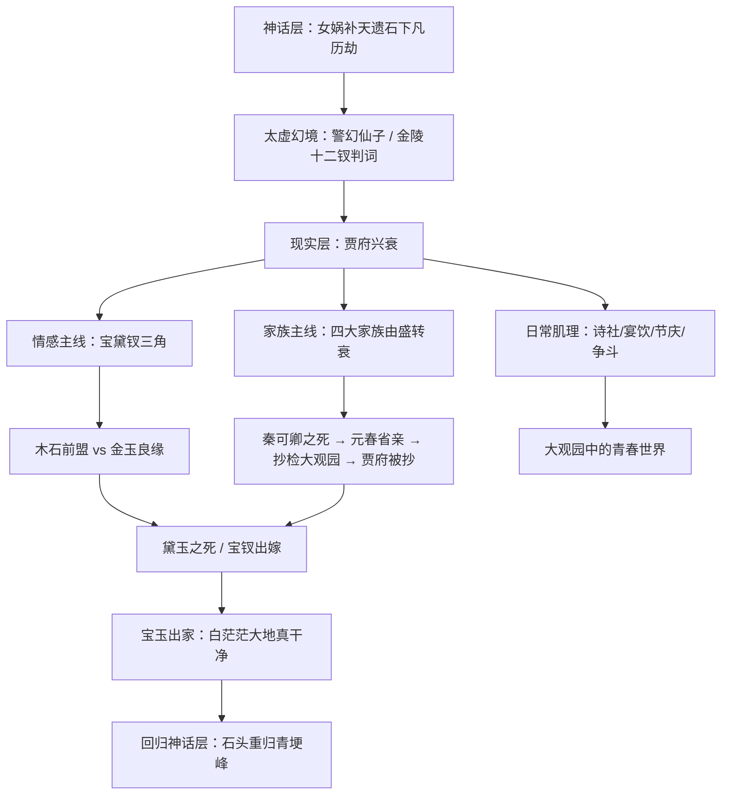
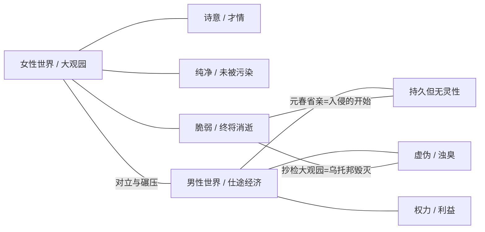
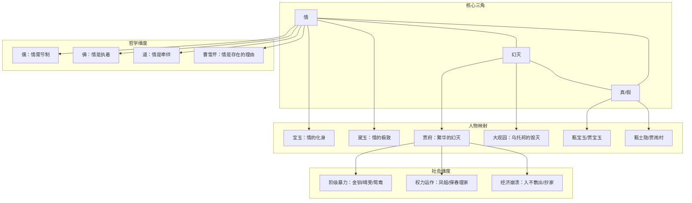

## 一、文学坐标定位

> [!abstract] 速览
> 《红楼梦》是中国文学史上最伟大的长篇小说，成书于十八世纪中叶清乾隆年间。全书以贾宝玉、林黛玉、薛宝钗的情感纠葛为主线，以贾府由盛到衰的命运为骨架，编织出一幅封建社会晚期的全景画卷。前八十回为曹雪芹所作，后四十回通行本为高鹗续补（亦有学者认为是无名氏续写、程伟元与高鹗整理），围绕这部作品的考证、研究已发展为一门专门学问——「红学」。

《红楼梦》在中国文学中的位置，怎样强调都不为过。它不仅是「四大名著」之冠，更是中国叙事文学从类型化走向==个人化、心理化、诗意化==的标志。在它之前，中国长篇小说的主流是《三国演义》式的历史演义、《水浒传》式的英雄传奇、《西游记》式的神魔寓言。《红楼梦》打破了这一切——它没有战场、没有妖怪、没有忠奸分明的道德框架，它写的是==日常生活中最幽微的情感波动、最不可捉摸的人性褶皱==。

在世界文学的坐标上，《红楼梦》常被与普鲁斯特《追忆似水年华》相提并论——两者都以极度细腻的笔触书写记忆、时间与失去；也被与托尔斯泰《安娜·卡列尼娜》对照——两者都在一个行将崩塌的社会中深入刻画个体命运。但《红楼梦》的独特之处在于它融汇了诗词、戏曲、佛道哲学、饮食器物、建筑园林、医药药方等庞大的文化体系，使之成为一部==百科全书式的文学作品==。

曹雪芹的家族背景是理解这部作品的关键钥匙之一。曹家曾任江宁织造，三代四人担任此职长达六十年，接驾康熙帝南巡四次，极尽荣华。雍正年间曹家被抄，家道中落。曹雪芹晚年「举家食粥酒常赊」，在穷困潦倒中写作此书，「披阅十载，增删五次」，未及完稿即去世。这段从「烈火烹油、鲜花着锦」到「白茫茫大地真干净」的家族经历，是《红楼梦》最直接的情感来源。

---

## 二、叙事结构解析

> [!note] 多重叙事框架
> 《红楼梦》的叙事结构极为复杂，至少包含三个层次：神话框架（女娲补天遗石 / 神瑛侍者与绛珠仙草）、现实框架（贾府兴衰）、以及贯穿其中的诗谶系统（判词、曲文、灯谜、诗社作品暗示人物命运）。

### 为什么要用神话框架？

这是一个值得深思的结构选择。曹雪芹为什么不直接写一个现实主义的家族故事，而要加上「女娲补天遗石」「神瑛侍者灌溉绛珠仙草」这一层神话？

第一，==神话为情感赋予了宇宙论的尺度==。宝黛之间的爱情不是偶然的男女之情，而是前世因缘——绛珠仙草为了报答神瑛侍者的灌溉之恩，下凡以一生眼泪偿还。这意味着黛玉的泪水、她的多愁善感、她与宝玉之间那种超越世俗的默契，都有了一个超验的解释。曹雪芹的高明在于：他提供了这个解释，但并不强迫你接受它——你完全可以在现实层面理解这段感情，神话只是多了一层意味。

第二，==石头的视角提供了一种「观照」的距离==。故事的记录者是那块被丢弃的补天遗石，它幻化为通灵宝玉随宝玉降生，经历了人间一切繁华幻灭后，又回到青埂峰下。这个框架暗示：你正在阅读的一切，是一块石头的「回忆录」——而石头是无情之物。用无情之物来记录最深情的故事，这种张力本身就是一种美学选择。

第三，==太虚幻境的判词系统构成了一个预叙结构==。在第五回，宝玉梦游太虚幻境，看到了金陵十二钗正册、副册、又副册的判词和曲文。这些判词以隐晦的诗歌形式预示了每一个主要女性角色的命运。这意味着：作为读者，你从第五回起就已经知道了结局——至少隐约知道。曹雪芹不在乎「悬念」，他在乎的是==你知道结局之后，怎样去体味过程中的每一个细节==。这与古希腊悲剧的美学一脉相承——真正的悲剧力量不来自意外，而来自命运的不可逃避。

### 回目对仗与结构节奏

《红楼梦》的回目本身就是一部对仗工整的骈文。比如第三回「贾雨村夤缘复旧职，林黛玉抛父进京都」，第五回「游幻境指迷十二钗，饮仙醪曲演红楼梦」。这种对仗不仅是形式上的优美，更是内容上的==互文与对照==：每一回的两个半句往往构成因果、并列或反讽关系，暗示着叙事的深层结构。

---

## 三、主题与意象网络

### 主题一：「情」——超越儒释道的第四维度

> [!tip] 黄金圈拆解
> - **Why**：曹雪芹为什么要把「情」作为整部作品的核心？因为在他看来，正统儒学把「情」归为需要节制的欲望，佛家把「情」视为需要断除的执着，道家把「情」看作需要超越的牵绊——但人之所以为人，恰恰在于「情」。曹雪芹要做的是为「情」正名，赋予它独立的哲学地位。
> - **How**：通过贾宝玉这个「情痴」「情种」式的人物，展示一种不受功利计算、不被道德规训、不为任何目的服务的「纯情」。
> - **What**：宝玉对黛玉的爱、对晴雯的惜、对秦钟的怜、对一切美好事物即将消逝的哀伤——这些构成了一个完整的「情」的谱系。

**文本细读**：第五回太虚幻境中，警幻仙子对宝玉说他是「天下古今第一淫人」——此处的「淫」不是肉欲之淫，而是「意淫」，即==以情感去感应万物的能力==。警幻仙子进一步解释：「如世之好淫者，不过悦容貌，喜歌舞，调笑无厌，云雨无时，恨不能尽天下之美女供我片时之趣兴，此皆皮肤淫滥之蠢物耳。」而宝玉之「淫」是「天分中生成一段痴情」。

这段话是理解整部《红楼梦》情感哲学的钥匙。曹雪芹明确区分了两种「情」：一种是占有式的、以满足自我为目的的「皮肤之淫」；另一种是感应式的、以体贴他者为核心的「意淫」。宝玉属于后者。他对女孩子们的关怀不是出于色欲，而是出于一种对美好事物的深切共情——他知道这些美好终将消逝（嫁人、老去、死亡），这种知道本身就构成了他最深的痛苦。

**概念网络**：「情」在《红楼梦》中辐射出多个维度——爱情（宝黛之间）、亲情（贾母对宝玉的溺爱）、友情（宝玉与秦钟、蒋玉菡）、物情（宝玉对花鸟鱼虫的怜惜）、以及一种更抽象的==对存在本身的悲悯==。这种无差别的、弥漫式的「情」，使宝玉成为中国文学中最独特的男性形象之一。

**苏格拉底追问**：宝玉的「情」是一种哲学立场还是一种性格特质？换言之，他是「选择」了有情，还是「天生」如此？曹雪芹似乎倾向于后者——「天分中生成一段痴情」暗示这是先天禀赋。但这就引出了另一个问题：如果情是天生的，那么那些「无情」的人（如贾政、王夫人对待下人的态度）是否应该被原谅？曹雪芹没有给出明确的答案，但他的叙事倾向是清楚的——==有情者在审美上高于无情者，但有情者注定要承受更多的痛苦==。

---

### 主题二：繁华与幻灭——「好」就是「了」

> [!tip] 黄金圈拆解
> - **Why**：曹雪芹为什么要如此精细地描绘繁华、然后摧毁它？因为他亲身经历了这一过程。他要你先看到鲜花是如何盛开的，才能让你体会到凋零的痛彻。
> - **How**：通过「好了歌」的哲学框架——「好便是了，了便是好」——将繁华与幻灭锁定为同一事物的两个面。你以为的「好」（繁华、美貌、权势、恩爱），最终都是「了」（结束、消散、幻灭）。
> - **What**：元春省亲的极致奢华、大观园的诗情画意、贾府日常的锦衣玉食——一切都在抄检大观园之后急转直下。

**文本细读**：第一回中跛足道人唱的「好了歌」，以及甄士隐作的「好了歌注」，堪称全书的哲学纲领：

> 陋室空堂，当年笏满床；衰草枯杨，曾为歌舞场。蛛丝儿结满雕梁，绿纱今又糊在蓬窗上。

这几句话浓缩了整部《红楼梦》的核心命题：==一切繁华都不过是幻灭的前奏==。但这不是一种轻飘飘的佛系感悟——甄士隐自己也是在经历了丧女、火灾、贫困之后才「悟」到这一点的。「悟」的代价是痛苦，而不是智慧。

元春省亲（第十七、十八回）是繁华书写的高潮。贾府为迎接封为贵妃的元春省亲，修建了大观园，耗费无数。省亲当晚灯火辉煌、歌舞升平，但元春本人的反应却是一再哭泣——「当日既送我到那不得见人的去处」。这个细节极为重要：==繁华的顶点恰恰是悲剧的起点==。元春在最荣耀的时刻说出了最悲伤的话，而贾府上下却只看到荣耀，看不到悲伤。这种视差构成了一种深刻的反讽。

**苏格拉底追问**：曹雪芹的「繁华即幻灭」是一种佛教式的虚无主义吗？这个问题需要谨慎回答。如果曹雪芹真的认为一切都是空的、一切都不值得，他就不会花那么大的力气去描写大观园中的每一首诗、每一道菜、每一件衣裳、每一次欢笑。他的写作本身就是对繁华的深情挽留。所以更准确的理解是：曹雪芹==既知道一切终将幻灭，又深深眷恋这一切==。这种矛盾不是逻辑上的缺陷，而是情感上的真实——也正是这种矛盾赋予了《红楼梦》无与伦比的感染力。

---

### 主题三：女性世界——「山中高士晶莹雪，世外仙姝寂寞林」

> [!tip] 黄金圈拆解
> - **Why**：曹雪芹为什么要在一个由男性统治的社会中、由一个男性作家写出一部以女性为核心的作品？因为在他眼中，女性代表了==人类精神中最纯净、最美好、也最脆弱的部分==。
> - **How**：通过大观园这个「女儿国」式的空间，创造了一个暂时隔绝于外部权力世界的乌托邦，让一群少女在其中展现各自的性格、才华与命运。
> - **What**：金陵十二钗的群像——黛玉的诗意与孤高、宝钗的端庄与圆融、探春的英气与无奈、湘云的豪爽与天真、妙玉的清高与压抑、凤姐的精明与狠辣……

**文本细读**：宝玉有一句著名的话：「女儿是水做的骨肉，男人是泥做的骨肉。我见了女儿，我便清爽；见了男子，便觉浊臭逼人。」这句话常被简单理解为「宝玉喜欢女孩子」，但它的内涵远不止于此。

在曹雪芹的价值体系中，「女儿」代表的是一种==未被功名利禄污染的存在状态==。「男子」之所以「浊臭」，不是因为生理性别，而是因为他们进入了仕途经济的世界，被权力、利益、虚伪所浸染。女儿们（尤其是未嫁的少女）暂时处于这个世界的边缘，保有一种天然的清洁与灵性。但曹雪芹也深知：这种状态是暂时的——一旦嫁人，女儿就会变成「死鱼眼睛」（宝玉语）。这种对「女儿」状态的珍视和对其不可持续性的哀伤，构成了整部作品最深层的情感基调之一。

大观园正是这种「女儿国」的空间化身——一个与外界污浊的权力世界隔开的理想空间。海棠诗社、菊花诗、芦雪庵联诗——这些活动赋予了大观园一种诗意乌托邦的性质。但乌托邦注定无法持续，抄检大观园（第七十四回）标志着外部权力对这个纯净空间的入侵和毁灭。

**概念网络**：

**苏格拉底追问**：曹雪芹对女性的「珍视」是否仍然是一种男性凝视？从当代视角看，把女性等同于「纯净」「美好」「脆弱」，本身就是一种理想化投射。但在十八世纪的语境中，曹雪芹对女性才智与人格的尊重，已经远超他的时代。更重要的是，《红楼梦》中的女性不是扁平的符号——王熙凤的权谋、探春的治家、宝钗的理性、黛玉的尖刻，都是立体的、复杂的人物塑造，而非简单的「美好」或「纯净」的化身。

---

### 主题四：真与假——「假作真时真亦假」

> [!tip] 黄金圈拆解
> - **Why**：曹雪芹为什么要在全书开篇就设定「真假」的哲学命题？因为他要解构的不是某个具体的真假问题，而是==存在本身的确定性==。
> - **How**：通过「甄士隐」（真事隐）和「贾雨村」（假语村言）的命名暗示，通过甄家与贾家的镜像对照，通过太虚幻境与现实世界的嵌套，层层瓦解「真」与「假」的边界。
> - **What**：甄宝玉与贾宝玉互为镜像；通灵宝玉是石头幻化；大观园是繁华的幻象；整部小说是石头上刻的故事。

**文本细读**：太虚幻境的对联「假作真时真亦假，无为有处有还无」，是全书哲学的浓缩。这两句话至少有三层含义：

1. **叙事层面**：这部小说本身就是「假」的（虚构），但它所写的情感是「真」的。当你被小说打动的时候，假已经变成了真。
2. **社会层面**：贾府表面的繁华是「真」的吗？那些恭维、那些排场、那些政治联盟，在崩溃的那一天都露出了「假」的底色。而那些被压抑的真情（宝黛之间的爱、晴雯对宝玉的忠诚）反而因为不被承认而成了「假」的。
3. **哲学层面**：如果整个世界都是大荒山无稽崖青埂峰下一块石头的记忆，那么「真实」和「虚幻」还有区别吗？

这种「真假互渗」的思维方式，使《红楼梦》超越了简单的现实主义小说或简单的寓言，成为一部==关于存在本身之虚实的哲学文本==。

---

### 主题五：阶级、权力与日常暴力

> [!tip] 黄金圈拆解
> - **Why**：曹雪芹虽然不是一个「社会批判」型作家，但他的写实笔法客观地呈现了封建等级制度下的日常暴力——不需要刻意批判，如实书写就已经是最大的批判。
> - **How**：通过主子与奴婢之间的关系（宝玉与袭人、晴雯、金钏；王夫人对晴雯的驱逐；贾赦强纳鸳鸯）、通过婚姻的政治性（宝钗嫁宝玉是家族利益的安排）、通过经济的细节（探春理家时发现的种种弊端），展示权力如何渗透日常生活的每一个角落。
> - **What**：金钏投井、晴雯被逐后病死、司棋撞墙、鸳鸯抗婚后的悲剧命运……

**文本细读**：金钏之死（第三十二回前后）是阶级暴力最触目的场景之一。金钏是王夫人的丫鬟，因与宝玉有一句轻浮的对话，被王夫人掌掴并逐出，随后投井自尽。这个事件中：宝玉是引发者但不是决定者；王夫人是执行者但认为自己理所当然；金钏是受害者但在等级制度中没有任何申诉的渠道。一条人命，就这样在「体面」和「规矩」的名义下被轻轻抹去。

晴雯之死更为深刻。晴雯是宝玉身边最伶俐、最美丽、也最有个性的丫鬟。她的「错」在于太出挑、太有脾气、太不像一个「安分」的奴婢。王夫人以「狐狸精」的名义将病重的晴雯从怡红院撵出，晴雯在贫病交加中死去。宝玉写了著名的《芙蓉女儿诔》悼念她——这是全书中最长、最用力的一篇文字，也是宝玉对等级制度==唯一一次明确的、以文学形式进行的抗议==。

**苏格拉底追问**：宝玉悼念晴雯的行为，是对不公正的抗议，还是贵族少爷的自我感动？这个问题尖锐但有价值。宝玉有能力写诔文、有闲暇去伤感，但他没有能力（或没有勇气）阻止晴雯被逐。他的「情」是真诚的，但他的「无力」同样是真实的。曹雪芹没有美化宝玉的局限性——这正是他作为作家的诚实。

---

## 四、核心人物分析

### 贾宝玉——石头、叛逆者与情的化身

贾宝玉是中国文学中最复杂的男性形象之一。他含玉而生，是贾府寄予厚望的继承人，但他厌恶仕途经济，鄙视「国贼禄鬼」，把科举功名视为「须眉浊物」的把戏。他温柔、多情、敏感，对身边的女孩子们怀有一种近乎宗教式的珍惜。

宝玉的核心矛盾在于：==他生在一个他无法认同的世界里，却又无力改变或离开这个世界==。他不像哈姆雷特那样有复仇的使命，也不像浮士德那样有追求知识的意志。他的「叛逆」是消极的——不是抗争，而是拒绝。他拒绝读书（圣贤书）、拒绝应酬、拒绝长大、拒绝成为「男人」。大观园是他最后的避难所，而大观园的毁灭意味着他再也无处可躲。

宝玉最终出家，这个结局可以从多个角度解读。从佛学角度看，这是「悟」——看破红尘、返璞归真。从心理角度看，这是一种==对不可承受之痛苦的极端逃避==。从社会角度看，这是一个不愿融入体制的个体唯一可能的出路。曹雪芹的深刻在于：他没有把出家写成一个「光明的结局」——宝玉的出家是带着无尽的遗憾和创伤的。

### 林黛玉——诗意、孤绝与泪

黛玉是曹雪芹笔下最具诗人气质的人物。她幼年丧母，寄居外祖母家，天生敏感多疑，体弱多病，但才华横溢。她的诗（「葬花吟」「秋窗风雨夕」等）不仅是她情感的外化，更是全书诗意浓度最高的段落。

黛玉之所以动人，在于她==绝不伪装==。她不会像宝钗那样劝宝玉「留意于孔孟之间」以获取长辈好感，不会像凤姐那样八面玲珑以维持权力，不会像袭人那样以温顺换取安全。她的真实是她最大的魅力，也是她最大的弱点——在一个需要圆滑才能生存的环境中，真实是一种危险的品质。

「黛玉葬花」（第二十七回）是全书最著名的场景之一。她将落花扫入锦囊、葬入花冢，吟出「花谢花飞花满天，红消香断有谁怜」。这不仅是对花的悼念，更是对自身命运的预感——她就是那朵无依无靠的落花，终将「一朝春尽红颜老，花落人亡两不知」。

**苏格拉底追问**：黛玉的「多疑」是性格缺陷还是现实主义？如果你是一个孤女，寄居在一个庞大的家族中，没有父母撑腰，你喜欢的人身边围绕着各种女孩子，你的情敌（宝钗）家境、性格、人缘都比你好——在这种处境下，不多疑才是不正常的。黛玉的「小性儿」不是无理取闹，而是一个==处于不安全境地的聪明人对威胁的敏锐感知==。

### 薛宝钗——另一种完美与另一种悲剧

宝钗常被简单化为「黛玉的对立面」，但她的复杂性不亚于黛玉。她博学多才、温柔敦厚、善于处世、深受长辈喜爱。如果说黛玉代表了「真」，宝钗代表的则是「周全」——她知道这个世界的规则并愿意遵守它。

但宝钗的「周全」是否出于自愿？「好风凭借力，送我上青云」——她写的柳絮词中流露出的野心，与她日常的端庄含蓄形成了微妙的裂缝。她劝宝玉读书上进，是出于真诚的关心，还是出于对「妻子应当如此」这一社会角色的内化？曹雪芹不回答这个问题，但他通过一个细节暗示了宝钗内心的压抑——==宝钗住的蘅芜苑「雪洞一般」，几乎没有任何装饰==。这种极端的朴素是自律还是压抑？是修行还是自我否定？

宝钗的悲剧不像黛玉那样外显——她最终嫁给了宝玉，但宝玉的心不在她身上。她得到了「金玉良缘」的名分，却失去了爱情的实质。用脂砚斋的话说，这是「虽离别亦能自安」的命运——但「能自安」三个字背后，是多少不被看见的寂寞？

### 王熙凤——权力的艺术与毁灭

王熙凤是《红楼梦》中最具戏剧性的人物。她美丽、聪明、泼辣、狠辣，是贾府的实际管家人。她的管理才能、人际手腕、口齿伶俐，在全书中无人能出其右。但她也放高利贷、逼死尤二姐、草菅人命，是一个==极度复杂的道德灰色人物==。

曹雪芹写凤姐的方式值得注意：他不做道德评判。他让你看到凤姐的精明能干（协理宁国府那几回的才能展示），也让你看到她的残忍（弄权铁槛寺、毒设相思局），但他从不跳出来说「凤姐是好人还是坏人」。这种克制使凤姐成为一个==真正的文学人物而非道德寓言==。

---

## 五、风格与语言

> [!note] 曹雪芹的叙事美学
> 《红楼梦》的语言是中国古典白话文的最高成就之一。它融合了文言的典雅、口语的鲜活、诗词的凝练、戏曲的节奏感，形成了一种==前无古人的叙事声音==。

### 白描与繁笔的辩证

曹雪芹的写人，最擅长的是「不写之写」。黛玉初进贾府时（第三回），曹雪芹对贾母、王夫人、凤姐的描写各有侧重，到宝玉出场时连用两首《西江月》，但对黛玉的外貌描写却极为克制——「两弯似蹙非蹙罥烟眉，一双似泣非泣含露目」，寥寥几笔，全用「似……非……」的模糊笔法，==让你永远无法在头脑中固定一个黛玉的形象==。这正是曹雪芹的用意：黛玉之美是一种不可定义的、流动的美。

而在写日常生活时，曹雪芹却不惜笔墨。刘姥姥进大观园时吃的那顿饭（第四十回前后）、贾母带众人游园时的路线和对话、中秋夜宴上的行酒令——这些「闲笔」看似与主要情节无关，却构成了小说最坚实的质地。它们的功能不是推进情节，而是==营造一个你可以走进去的世界==。

### 诗词的叙事功能

《红楼梦》中有大量诗词曲赋，它们不是装饰，而是叙事的有机组成部分。每个人物的诗作风格与其性格严格对应：黛玉的诗哀婉幽怨、宝钗的诗含蓄蕴藉、湘云的诗豪放洒脱、探春的诗英气逼人。

更重要的是，许多诗词暗含==谶语==功能——预示人物的命运。黛玉的「葬花吟」预示她的夭亡，宝钗的「好风凭借力，送我上青云」暗示她的命运与权势的关联，探春的「日边红杏倚云栽」暗示她远嫁的结局。曹雪芹将诗词变成了一套隐蔽的命运符码系统，使重读成为一种不断发现新意的体验。

---

## 六、文学批评多视角

> [!warning] 以下各视角均为分析工具，各有所见亦各有盲区

**自传说视角**（胡适开创的「新红学」）：《红楼梦》是曹雪芹的自传体小说，贾府即曹家，宝玉即曹雪芹本人。这一视角打开了历史考证的大门，但也容易将文学作品还原为个人经历，忽视了艺术虚构的自主性。曹雪芹的家族经历无疑是小说的重要素材来源，但《红楼梦》远不止于一部「家族回忆录」。

**阶级分析视角**：《红楼梦》可以被读作封建贵族阶级走向没落的挽歌。四大家族「一荣俱荣，一损俱损」的命运，揭示了封建体制内部的腐败与不可持续。但这种读法容易将丰富的人物塑造简化为阶级符号。

**女性主义视角**：《红楼梦》是中国古典文学中对女性最具同情和理解的作品。曹雪芹赋予女性角色以独立的才华、性格与精神世界，这在十八世纪的文学中极为罕见。但「清净女儿 vs 浊臭男子」的二元框架本身仍然是一种本质主义的性别观。同时，尽管曹雪芹珍视女性，女性在小说中的命运仍然完全由父权制度所决定——这究竟是批判还是无奈的呈现？

**存在主义视角**：宝玉的「出世」可以被视为一种存在主义式的选择——在一个不可能实现真正「情」的世界中，他选择了退出。他的整个人生历程可以被概括为：==遭遇荒诞（「好了歌」所揭示的存在之虚无）→ 寻找意义（在「情」中寻找存在的锚点）→ 意义崩塌（黛玉之死、大观园毁灭）→ 选择退出（出家）==。

**互文性视角**：《红楼梦》与《西厢记》《牡丹亭》构成了深层对话。宝黛共读《西厢记》（第二十三回）是两人感情的关键场景——他们通过阅读爱情文本来确认彼此的情感。而《牡丹亭》中「因情成梦、因梦成戏」的结构，与《红楼梦》中太虚幻境的梦境叙事形成互文。曹雪芹让他的人物阅读前代的爱情文学，使《红楼梦》成为一部==关于阅读和情感如何相互塑造的元小说==。

---

## 七、概念网络总图

---

## 八、前八十回与后四十回的问题

> [!warning] 续书争议
> 这是红学中最核心的问题之一，至今无定论。通行本后四十回是否为高鹗所续、是否背离了曹雪芹原意，学界有激烈争论。以下仅呈现主要观点。

关于后四十回，你需要知道几个关键分歧点：

1. **黛玉之死**：后四十回写黛玉在宝玉与宝钗成婚之际，焚稿断痴情、含恨而亡。许多学者认为这一处理过于简单粗暴——脂砚斋批语暗示曹雪芹原本的构想中，黛玉之死可能更为复杂，「泪尽而亡」的过程可能更为漫长与细腻。

2. **宝玉出家**：后四十回先写宝玉中举、然后出家。但前八十回中宝玉对科举的极度厌恶，使「中举后出家」这一安排显得前后矛盾。有学者认为曹雪芹原意中的宝玉出家应该更为决绝，不会有「中举」这个向世俗妥协的情节。

3. **贾府结局**：后四十回写贾府最终「兰桂齐芳」，有复兴之兆。但前八十回中「好了歌注」和各种判词暗示的结局是「白茫茫大地真干净」——一个彻底的、不可挽回的毁灭。后四十回的「大团圆」倾向，被认为违背了曹雪芹的悲剧美学。

无论你对续书持何种态度，一个不可否认的事实是：==前八十回的文学成就远高于后四十回==。前八十回中那种细腻入微的心理描写、精妙绝伦的结构设计、诗意与日常的完美融合，在后四十回中明显减弱。

---

## 九、跨时空共鸣

《红楼梦》之所以在两百多年后仍然被反复阅读、研究、争论，在于它触及了几个永恒的人类命题：

**关于爱情**：宝黛之间那种「我懂你、你懂我，但我们不能在一起」的悲剧模式，在任何时代都能引发共鸣。它指向的不是外部障碍的戏剧性（虽然也有），而是==人与人之间真正的理解终究无法对抗现实的力量==这一残酷事实。

**关于成长**：大观园的毁灭可以被视为一个关于「成长的代价」的寓言。每个人都曾有过一个「大观园」——一个纯净的、诗意的、不受成人世界侵扰的空间。长大意味着离开这个空间，而你永远无法回去。

**关于繁华与幻灭**：无论是个人层面（青春终将逝去）还是社会层面（帝国终将衰落），「盛极必衰」的规律从未改变。曹雪芹提供的不是一个答案，而是一种面对这一规律的==审美态度==——不逃避、不麻木，而是以最深的眷恋去注视即将消逝的一切。

**关于真实与表演**：在一个人人都在「表演」社会角色的世界中，黛玉式的真实与宝钗式的周全之间的张力，至今仍然是每一个人在社交生活中面临的核心困境。

---

## 十、费曼终极检验

> [!abstract] 用最简单的话概括
> 如果你要向一个完全不了解《红楼梦》的朋友解释这本书，可以这样说：

这本书写的是一个大家族从极其富贵到彻底完蛋的过程。但它不是一般的家族故事——它的主角是一个叫贾宝玉的少年，他含着一块玉出生，不爱读书不爱做官，只喜欢和家里的姐姐妹妹们在一起。他最爱的女孩叫林黛玉，是个才华绝世但体弱多病的孤女。还有一个叫薛宝钗的女孩，端庄大方，家族给她安排嫁给了宝玉。最后黛玉死了，宝玉出家了，整个家族也垮了。

但这本书真正厉害的地方不在故事情节。它厉害在：曹雪芹用了不可思议的笔力，把那个家族里每一个人——从主子到丫鬟，从老太太到小孩——都写成了==活的人==。你读完之后会觉得你真的认识这些人，真的在那个园子里住过。

更厉害的是：曹雪芹明明知道这一切都是「梦」，都要破灭的，但他还是花了毕生的心血，一笔一笔地把那些已经消失的人和事写下来。他不是在记录历史，他是在==用文字对抗时间==。他知道他会输，但他还是写了。

这就是《红楼梦》最深层的力量：==一个人用虚构的文字去挽留真实的记忆，用有限的生命去书写无限的深情==。

---

## 延伸阅读路线图

> [!note] 推荐阅读路径

- [[《脂砚斋重评石头记》]] — 带有脂砚斋批注的早期抄本，是理解曹雪芹原意最重要的文献
- [[《红楼梦》（程甲本/程乙本）]] — 通行本的两个版本，后四十回由此流传
- [[《追忆似水年华》]] — 普鲁斯特，与《红楼梦》在「记忆」「时间」「失去」主题上深度呼应
- [[《源氏物语》]] — 紫式部，日本古典文学巨著，同样书写贵族世界的繁华与幻灭
- [[《安娜·卡列尼娜》]] — 托尔斯泰，在社会与个体、爱情与体制的张力上与《红楼梦》形成对话
- [[《牡丹亭》]] — 汤显祖，「情至」理想的戏剧化呈现，是理解《红楼梦》情感哲学的重要参照
- [[《红楼梦辨》]] — 俞平伯的红学名著，开启了对后四十回续书问题的系统讨论
- [[《红楼梦的两个世界》]] — 余英时，从思想史角度解读「大观园内/外」的二元结构
