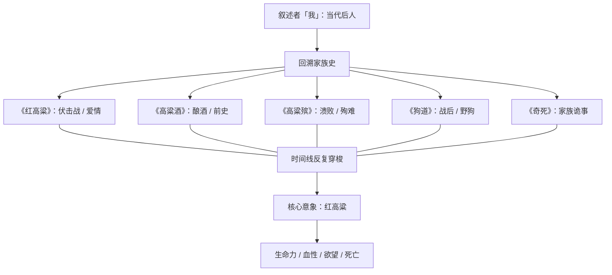
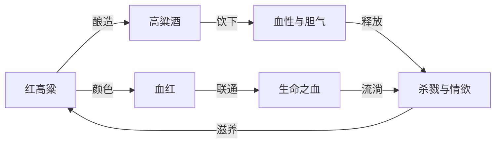
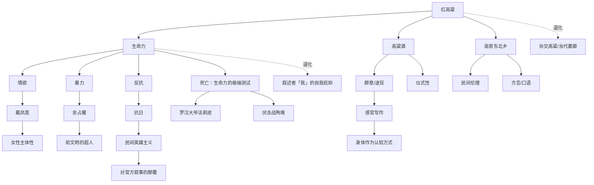

## 一、文学坐标定位

> [!abstract] 速览
> 《红高粱家族》是莫言于1986年发表的中篇小说集（后整合为长篇），由《红高粱》《高粱酒》《高粱殡》《狗道》《奇死》五个部分组成。小说以山东高密东北乡为舞台，讲述了"我爷爷"余占鳌与"我奶奶"戴凤莲在抗日战争前后那段血与火的生命传奇。这不是一部传统意义上的抗战小说——它是一部关于==生命力本身==的赞歌与挽歌。

莫言以这部作品在中国当代文坛投下了一颗炸弹。1980年代中期，中国文学正处于从"伤痕文学""反思文学"向"寻根文学""先锋文学"过渡的关键期。莫言的《红高粱》横空出世，以一种前所未有的叙事暴力和感官爆炸，打破了此前文学对历史的规训式书写。他不写"正确的"抗战，不塑造"高大全"的英雄，而是让一群土匪、酿酒女人、杀人放火的民间豪杰成为叙事的绝对主角。

在世界文学脉络中，《红高粱家族》可与福克纳的约克纳帕塔法世界、马尔克斯的马孔多、鲁尔福的科马拉形成对话。莫言公开承认福克纳和马尔克斯对他的影响——但他做的不是模仿，而是==将拉美魔幻现实主义的方法论嫁接到中国北方乡土经验上==，创造出一种独属于高密东北乡的文学宇宙。1987年张艺谋将《红高粱》改编为电影，获柏林电影节金熊奖，这是中国电影首次斩获欧洲三大电影节最高奖项，也让莫言和这片高粱地走向了世界。

2012年，莫言获得诺贝尔文学奖，授奖词中提到他"将魔幻现实主义与民间故事、历史和当代社会融为一体"，《红高粱家族》正是这一切的起点。

---

## 二、叙事结构解析

> [!note] 多声部的家族叙事
> 《红高粱家族》采用了一种极为复杂的叙事结构：以"我"（第三代后人）的视角回溯家族历史，但"我"并非全知叙述者——"我"时而依赖传闻，时而凭借想象，时而以一种近乎通灵的方式"看见"祖辈的生活。

这种叙事策略至少实现了四重功能：

1. **时间的自由跳跃**：小说的时间线不是线性的，而是在抗日战争的"当下"、余占鳌和戴凤莲的前史、以及"我"所处的当代之间反复穿梭。这种跳跃不是为了炫技，而是为了呈现==记忆本身的运作方式==——记忆从来不是按时间顺序排列的，它是以情感强度为索引的。

2. **不可靠叙事的魅力**：叙述者"我"不断提醒你，他的叙述是二手的、三手的，甚至是想象的。"据说""也许""我愿意相信"——这些词汇反复出现。这种不可靠性并非削弱了故事的真实感，反而==增强了它的神话感==。你读到的不是历史，而是传说；不是事实，而是一个家族的精神图谱。

3. **代际对话**：叙述者"我"作为当代人回望祖辈，不断发出感叹和追问。这种代际视角制造了一种张力：==后代的退化与祖辈的强悍形成对比==，当代的萎靡与过去的血性形成反差。莫言借"我"之口说出的那些对祖辈的崇拜，本质上是对当代精神状态的批判。

4. **五部曲的交织**：五个部分不是简单的顺序叙事，而是围绕同一组人物和事件的不同切面。《红高粱》聚焦抗日伏击战和余占鳌与戴凤莲的爱情；《高粱酒》回溯酿酒的前史；《高粱殡》写抗战失败后的溃败与殉难；《狗道》以战后野狗群为主体写战争的后遗症；《奇死》则处理家族中的诡异死亡。它们==不是五个故事，而是同一个生命场域的五个维度==。

**苏格拉底追问**：莫言为什么不用线性叙事来讲述这个故事？因为线性叙事隐含着一个假设——事件之间存在因果关系，历史是可以被理性整理的。但莫言要呈现的恰恰是：在高密东北乡这片土地上，生命不遵循逻辑，它遵循的是==激情、本能和命运的随机暴击==。非线性的叙事结构是对生命本身的模仿。

---

## 三、主题与意象网络

### 主题一：原始生命力——被文明压抑的野性

> [!tip] 黄金圈拆解
> - **Why**：莫言为什么要歌颂土匪式的暴力与情欲？因为他看到了1980年代中国社会和文学中的一种==生命力匮乏==。几十年的政治规训不仅压制了人的自由意志，还阉割了文学的血性。莫言需要一剂猛药。
> - **How**：通过塑造余占鳌和戴凤莲这样不受任何道德规训束缚的人物，让他们的杀人、饮酒、做爱、复仇都散发出一种粗犷的美感。不是美化暴力，而是呈现暴力中所蕴含的生命冲动。
> - **What**：余占鳌杀人不眨眼，与奶奶在高粱地里野合，拉起土匪队伍抗日——这一切构成了一幅关于原始生命力的全景图。

**文本细读**：小说开篇的高粱地野合场景，是中国当代文学中最大胆的段落之一。余占鳌把戴凤莲放倒在高粱地里，周围的高粱"齐刷刷地跪倒"为他们让出一块空地。莫言的写法既不色情也不浪漫——它是==仪式性的==。高粱的"跪倒"赋予了这个行为一种天地为证的庄严感。这不是偷情，这是两个生命在大地上的结合，是自然秩序对人类本能的认可。

你需要注意的是，这种生命力的书写始终伴随着==暴力==。余占鳌的爱与杀是一体两面的：他为了得到戴凤莲可以杀人（杀死单家父子），他为了保卫高密东北乡可以组织伏击战（打日本人），他甚至为了维护尊严可以杀自己的部下。莫言不做道德判断——他呈现的是一种前文明状态下的行为逻辑：在那个世界里，力量就是正义，敢爱敢杀就是英雄。

**概念网络**：「原始生命力」这个主题与「红高粱」「血」「酒」三个核心意象紧密相连。红高粱是生命力的植物性象征——它疯狂生长、占据大地、颜色血红。血是生命力的生理性象征——全书充斥着杀戮之血、月经之血、抗日之血。酒（高粱酒/十八里红）是生命力的文化性象征——酿酒需要高粱，饮酒激发胆气，酒是连接植物与人体的中介。

**苏格拉底追问**：莫言对暴力的美化是否危险？这个问题触及了文学伦理的核心。你需要区分两种暴力书写：一种是将暴力作为手段来达到快感（如某些通俗小说），另一种是将暴力作为==生命现象==来呈现其内在的能量结构。莫言属于后者。他笔下的暴力不是让你模仿的，而是让你==感受到自身体内被压抑的那股力量==。这种力量可以是破坏性的，也可以是创造性的——问题不在于它的存在，而在于它被引向何处。

---

### 主题二：红高粱——贯穿全书的超级意象

> [!tip] 黄金圈拆解
> - **Why**：莫言为什么选择高粱而不是小麦、玉米或其他作物？因为高粱本身的物理特性——高大、血红、密集、粗犷——与他要表达的生命观形成了天然的同构关系。高粱不是精致的作物，它是北方大地上最蛮横的植物。
> - **How**：高粱在小说中不是背景，而是==参与者==。它为野合提供场地，为伏击战提供掩护，为酿酒提供原料，为死亡提供墓地。它是舞台，也是演员。
> - **What**：从开篇到结尾，高粱的颜色、气味、声响贯穿全书，成为高密东北乡精神气质的物质化身。

**文本细读**：莫言描写高粱的笔法本身就值得仔细品读。他不是简单地写"一片高粱地"，而是赋予高粱以人格、情感甚至意志。高粱会"跪倒"，会"发出悲伤的呻吟"，会"骄傲地挺立"。这种拟人化处理不是修辞上的装饰，而是莫言世界观的体现——==在高密东北乡，人与植物、动物之间的界限是模糊的==。人有植物性的一面（像高粱一样野蛮生长），植物也有人格性的一面（像人一样有尊严地死去）。

小说结尾处，"我"对高粱的退化发出哀叹：曾经高大血红的高粱如今被矮小的杂交品种取代，就像曾经血性充沛的祖辈被萎靡不振的后代取代。这个类比将植物学的退化与人类精神的退化并置，==高粱的命运就是人的命运==。

**概念网络**：红高粱作为超级意象，辐射出多层含义：

| 维度 | 高粱的属性 | 对应的人类/主题含义 |
|------|------------|---------------------|
| 颜色 | 血红 | 血性、激情、暴力、生命 |
| 形态 | 高大密集 | 民间力量的浓密与不可穿透 |
| 气味 | 浓烈 | 感官性、肉体性、大地性 |
| 用途 | 酿酒 | 从自然到文化的转化 |
| 退化 | 杂交矮化 | 当代生命力的丧失 |

---

### 主题三：历史的民间重写——谁有权讲述抗战？

> [!tip] 黄金圈拆解
> - **Why**：莫言为什么要用土匪来打日本人，而不是正规军？因为他要挑战的是==官方历史叙事对抗战记忆的垄断==。在正统叙事中，抗战是在党的领导下、由人民军队完成的伟业。莫言说：不，在高密东北乡，打日本人的是一群土匪、酒鬼和村妇。
> - **How**：通过让余占鳌——一个杀人犯、酒鬼、土匪头子——成为抗日英雄，莫言将英雄主义从道德完美性中解放出来。英雄不需要是好人，英雄只需要==在关键时刻敢于用命去搏==。
> - **What**：墨水河伏击战中，余占鳌的土匪队伍伏击日军车队，几乎全军覆没。这场战斗没有战略价值，没有上级指示，甚至谈不上什么民族大义——它是一群人用最原始的勇气对入侵者的回应。

**文本细读**：墨水河伏击战是全书叙事的高潮之一。你需要注意莫言处理这场战斗的方式：他没有按照传统战争小说的模式来写（英雄如何运筹帷幄、如何英勇杀敌），而是将大量篇幅用于描写==战斗中的混乱、恐惧和生理反应==。子弹击中人体时的声音、肠子流出来的触感、血液的气味——莫言用几乎病态的精确度描写了战争的感官层面。这不是为了猎奇，而是为了==把战争从抽象概念还原为肉体经验==。

更值得注意的是伏击战中奶奶戴凤莲的死。她在给战士送饭的途中被流弹击中，临死前她不是在想国家大义，而是在回忆自己的一生——她的情欲、她的遗憾、她对生命的眷恋。莫言给了她一段极为华丽的内心独白，让一个即将死去的女人在最后时刻与天地万物进行对话。这段独白的文学意义在于：==死亡不是为了某个崇高目的的牺牲，而是一个丰沛生命的终结==。

**苏格拉底追问**：莫言的"民间重写"是否在解构英雄主义？恰恰相反——他是在==重建==一种更原始、更真实的英雄主义。官方叙事中的英雄是意识形态的产物，而莫言笔下的英雄是生命本能的产物。余占鳌打日本人不是因为他理解了抗日的政治意义，而是因为日本人侵入了他的地盘、杀了他的人——这是一种==领地性的、动物性的反抗==，但正因为如此，它比任何主义都更真实、更有力量。

---

### 主题四：女性——大地母亲与情欲主体

> [!tip] 黄金圈拆解
> - **Why**：莫言为什么赋予戴凤莲如此强大的主体性？因为在他的生命观中，女性不是被动的承受者，而是==生命力的源头==。男性的暴力与血性需要女性的情欲与生育来激活和延续。
> - **How**：戴凤莲不是传统文学中的贤妻良母，也不是被压迫的弱者。她主动选择自己的性伴侣，经营酒坊成为一方豪强，在战争中冲上前线——她的力量不逊于任何男性，甚至更为持久。
> - **What**：戴凤莲在高粱地里与余占鳌的结合、经营十八里红酒坊、最终死在战场上——她的人生轨迹构成了一条从情欲到权力到牺牲的完整弧线。

**文本细读**：戴凤莲出嫁的场景是理解这个人物的关键。她被父亲嫁给了麻风病人单扁郎——一个令人厌恶的安排。在花轿里，她的愤怒和绝望几乎要冲破文字。但当轿夫余占鳌在高粱地里放倒她时，她没有反抗——不是因为软弱，而是因为==她的身体和意志在那一刻达成了一致==：与其嫁给一个麻风病人过行尸走肉的生活，不如在高粱地里与一个强壮的男人结合。这是一个被压迫者的主体性选择。

莫言写戴凤莲临死前的内心独白时，用了一种接近祈祷的语气。她对天说话，回顾自己的一生，不回避自己的情欲和"不贞"。她说自己"什么都不怕""什么都不后悔"。这种坦荡是莫言赋予这个角色的最大礼物——==在一个要求女性忠贞顺从的文化中，戴凤莲活出了完全属于自己的生命==。

**概念网络**：戴凤莲与红高粱之间存在深层的象征对应。她的身体是大地，她的血液是高粱酒，她的死亡是高粱的倒伏。莫言通过这种女性/大地的同构，实现了一种中国式的"大地母亲"原型书写——但不同于西方文学中常见的母性崇拜，莫言笔下的大地母亲是==带有攻击性的、情欲充沛的、不可驯服的==。

---

### 主题五：感官写作——身体作为认知方式

> [!tip] 黄金圈拆解
> - **Why**：莫言为什么要如此密集地调动视觉、嗅觉、味觉、触觉和听觉？因为在他的文学观中，==思想是廉价的，感觉才是真实的==。你可以用理性来伪装历史、歪曲记忆，但身体的感觉不会说谎。
> - **How**：通过大量的通感、拟人和超现实的感官描写，让读者的身体（而不仅仅是头脑）参与到阅读中。
> - **What**：血的气味、高粱的颜色、酒的灼热、尸体的腐臭、子弹穿透肉体的声音——这些感官信息构成了小说最厚重的质地。

**文本细读**：莫言的感官写作在中国当代文学中几乎无人能及。以嗅觉为例——全书充满了各种气味的描写：高粱的腥甜味、高粱酒发酵时的醇厚味、血液的铁锈味、尸体腐烂的臭味、日本人身上的异族气味。这些气味不是附带性的修饰，而是==叙事的驱动力==。在很多段落中，是气味引发了记忆，是气味区分了敌我，是气味标记了生与死的边界。

莫言对颜色的运用同样值得关注。全书的主色调是==红色==——高粱的红、血的红、太阳的红、火的红、高粱酒的红。这种红色的密集铺排不仅是视觉效果，更是一种==情绪基调==：灼热、激烈、浓稠、不可调和。在红色的底色上，偶尔出现的绿色（高粱叶）和黑色（夜晚、死亡）形成了一种压迫性的色彩对比。

**苏格拉底追问**：莫言的感官写作是否过于浓烈以至于失去了节制？这是对莫言最常见的批评之一。你可以认为他的写作"过度"，但你也需要理解：==这种过度本身就是他的美学主张==。中国传统文学崇尚含蓄、节制、留白，莫言要做的恰恰是反叛这种传统——他要用感官的轰炸来打破文雅的外壳，让文学回到身体、回到大地、回到前文明的野蛮能量中。

---

### 主题六：死亡与殉葬——生命的另一种形态

> [!tip] 黄金圈拆解
> - **Why**：莫言为什么要写这么多死亡，而且每一种死亡都如此详尽、如此触目惊心？因为在他的生命观中，==死亡不是生命的反面，而是生命的另一种强度==。
> - **How**：通过各种极端的、仪式性的死亡方式（活剥皮、枪决、流弹、饿死、被狗撕咬），将死亡从"自然终结"提升为"存在事件"。
> - **What**：罗汉大爷被日军活剥皮的场景、伏击战中的集体阵亡、《狗道》中战后尸体被野狗啃食——每一种死亡都是一面镜子，映照出活着的意义。

**文本细读**：罗汉大爷被日军活剥皮的段落是中国当代文学中最令人难以忍受的场景之一。莫言以几乎冷静到残忍的笔触，一刀一刀地描写了剥皮的过程——皮肤如何被切开、肌肉如何暴露、血液如何涌出。但在这个极端暴力的场景中，莫言写了一个非凡的细节：罗汉大爷在被剥皮的过程中==一直在骂日本人==。他骂到最后一口气，骂到声音变成气泡从血肉中涌出。

你需要问自己：莫言为什么要这样写？不是为了展示日军的残暴（虽然客观上确实如此），而是为了展示==一个普通中国农民在极端痛苦中的不屈==。罗汉大爷不是英雄，他只是一个酒坊的伙计，但他在死亡面前展现出的生命力——那种即使皮肉分离也要继续辱骂敌人的力量——正是莫言所歌颂的高密东北乡精神的极致体现。

《狗道》中战后野狗啃食尸体的场景则提供了另一种死亡视角。人死后，身体回归自然，成为动物的食物。莫言用大量篇幅写野狗如何撕扯尸体、如何因为吃了太多人肉而变得疯狂。这种书写的意义在于：==它消解了死亡的神圣性，将死亡还原为一个纯粹的生物学事件==。在莫言的世界里，没有灵魂升天、没有来世轮回，只有肉体的分解和物质的循环。

**概念网络**：死亡与生命力在本书中构成一种悖论性的关系——==越是惨烈的死亡，越凸显出生命力的强度==。一个平静老死的人不会让你感受到生命的力量，但一个被活剥皮还在骂人的人会。莫言通过极端死亡来测量生命力的极限值。

---

### 主题七：高密东北乡——文学地理的建构

> [!tip] 黄金圈拆解
> - **Why**：莫言为什么要反复书写同一个地方？因为对他来说，文学需要一个==根据地==。福克纳有约克纳帕塔法县，马尔克斯有马孔多，莫言需要高密东北乡。一个作家只有深深扎根在一块具体的土地上，才能生长出普遍性的枝叶。
> - **How**：通过在多部作品中反复描写高密东北乡的地理、风物、人情、语言，让这个地方从一个真实的山东村庄变成一个==文学的精神地标==。
> - **What**：高密东北乡在《红高粱家族》中不仅是故事发生的地点，更是一种文明形态——它有自己的伦理（弱肉强食）、自己的美学（血红浓烈）、自己的宗教（对生命力的崇拜）。

**文本细读**：小说中对高密东北乡地理的描写是功能性的，不是风景画式的。墨水河不只是一条河——它是伏击战的战场、是余占鳌杀人后洗手的地方、是分隔生死的界线。高粱地不只是农田——它是野合的温床、是土匪藏身的丛林、是尸体腐烂的墓园。==每一处地理都是叙事的器官，承担着故事的生理功能==。

莫言在建构高密东北乡时，刻意模糊了真实与虚构的边界。他在小说中明确说"我"来自高密东北乡，他自己也确实出生在山东高密。但小说中的高密东北乡已经远远超出了真实地理的范畴——它被充填了传说、想象和寓言，成为一个==既具体又抽象的文学空间==。

---

## 四、人物分析

### 余占鳌——被文明驱逐的超人

余占鳌是莫言文学世界中最具爆发力的男性形象。他是轿夫出身，杀人后成为土匪头子，在抗战中组织民间武装，一生杀人无数、女人无数、酒无数。他不是传统意义上的"好人"，甚至不符合任何一种道德标准——但他是一个==在生命强度上达到极致的人==。

> [!warning] 余占鳌不是道德榜样
> 你不应该试图用善恶二元论来评判余占鳌。莫言创造这个角色的目的不是让你模仿他，而是让你感受到一种==文明社会已经丧失的生命形态==。余占鳌是前文明的、前道德的、前理性的。他的行动逻辑不是"这样做对不对"，而是"我想这样做，我就这样做"。

余占鳌最核心的特质是==不犹豫==。他要一个女人，就在高粱地里把她放倒；他要杀一个人，就拿刀割了他的喉咙；他要打日本人，就在路边挖坑埋土雷。这种不犹豫不是鲁莽——它是一种==身体与意志完全合一==的状态，是人类在被教育、被规训、被社会化之前的原始行动模式。

### 戴凤莲——红高粱的人格化身

戴凤莲是中国现当代文学中最复杂的女性形象之一。她既是"我奶奶"——一个家族长辈，又是一个情欲自主的独立女性；既是酒坊的女掌柜——一个精明的经营者，又是抗日战场上的殉道者。她身上==集合了母亲、情人、女王和烈士四种角色==，而这四种角色之间不存在矛盾——它们共同构成了一个完整的、丰沛的生命。

戴凤莲最动人的特质是她的==坦荡==。她不为自己的任何选择感到羞耻——不为在高粱地里与余占鳌的结合，不为后来与其他男性的关系，不为自己的权力欲望。在一个要求女性"三从四德"的文化中，她活出了一种==超越性别规训的自由==。

### "我"——退化的后代与不可靠的叙述者

叙述者"我"在小说中的功能不仅是讲述者，更是一面==当代之镜==。他反复感叹自己这一代人的萎靡和退化，将自己与祖辈进行不利于自己的比较。这种自我贬抑不是作秀，而是莫言通过"我"表达的一种文化焦虑：==现代化、城市化、文明化的过程是否同时也是一个去势的过程？==

"我"的不可靠叙事也值得深思。他说"据说""也许""我愿意相信"，这些词汇暴露了一个事实：关于祖辈的故事已经无法被完整地还原，它们在传播中被夸大、被神话化、被注入了后人的想象和愿望。==故事的真相不重要，重要的是后人需要这些故事来定义自己的来处==。

---

## 五、风格与语言

> [!note] 莫言的语言特征
> 莫言的语言风格可以用四个词概括：==汹涌、浓稠、感官化、不节制==。他的句子往往很长，充满了各种感官细节的堆叠，读起来像一条浑浊而有力的河流。

### 语言的狂欢性

莫言的语言具有巴赫金所说的"狂欢"品质。他不追求精确和节制（这是余华和苏童的路线），而是追求==过剩和泛滥==。他写一个气味，会用三四个比喻来形容；他写一个场景，会从视觉、嗅觉、触觉、听觉多个维度同时轰炸。这种写法的风险是显而易见的——容易流于冗赘。但莫言的天才在于：他的冗赘本身具有一种==压迫性的美感==，就像你站在一片无边无际的高粱地里，四面八方都是红色，你无处逃避，只能被淹没。

### 方言与口语的渗透

莫言大量使用山东高密方言和北方口语，使小说的语言具有强烈的地域性和肉体感。这些方言词汇在普通话语境中显得粗砺、不雅，但正是这种粗砺感赋予了文本一种==不可替代的质地==——它提醒你，这个故事不是从书斋里写出来的，而是从泥土里长出来的。

### 魔幻与现实的缝合

莫言在叙事中经常不加预警地从现实滑入魔幻。人可以和鬼对话，高粱可以有意识地行动，死者的灵魂可以被活人感知。这种转换是无缝的——莫言不用"突然""奇怪的是"这类提示语来标记魔幻的边界，因为在他的世界观中，==现实与魔幻之间根本没有边界==。对于高密东北乡的人来说，鬼魂是日常，神灵是邻居，超自然事件是生活的一部分。

---

## 六、文学批评多视角

**后殖民视角**：《红高粱家族》可以被读作一种文化民族主义的表达——它强调中国民间的原始力量，对抗的不仅是日本侵略者的物理暴力，也是西方现代性对中国传统文化的精神殖民。余占鳌的形象可以被视为一种"本土英雄"的建构——他的力量不来自现代教育或西方武器，而来自==土地本身==。

**精神分析视角**：小说中的暴力与情欲的紧密缠绕，可以从弗洛伊德的Eros（生本能）与Thanatos（死本能）的角度来分析。余占鳌的杀人和做爱是同一种驱力的两种表达——他在战场上和床上使用的是同一种能量。莫言通过这种书写，暴露了文明社会试图压抑的那个事实：==爱与暴力在人类心理的最深层是同源的==。

**生态批评视角**：红高粱的退化可以被读作一种生态寓言。杂交品种取代了原生高粱，正如工业化农业取代了传统农耕。莫言的哀叹不仅是对人类精神退化的感伤，也是对==生物多样性丧失和自然被技术驯服==的忧虑。

**新历史主义视角**：莫言对官方抗战叙事的颠覆，体现了新历史主义的核心主张——==历史不是客观事实的记录，而是权力话语的产物==。通过让土匪成为英雄、让官方话语缺席，莫言暴露了"正史"的建构性，并提供了一种来自民间的、身体化的、充满矛盾的替代性历史叙事。

**比较文学视角**：将莫言与福克纳进行比较是文学批评界的常见议题。两者的相似性显而易见：对特定地域的执着书写、对家族史的迷恋、非线性叙事结构、对暴力和种族/民族创伤的正视。但差异同样重要：福克纳的叙事充满了==南方的衰败感和自我意识的挣扎==，而莫言的叙事更多的是一种==向上的爆发力和感官的狂欢==。福克纳写的是一个文明的黄昏，莫言写的是野蛮的正午。

---

## 七、概念网络：全书核心概念的关系图谱

---

## 八、苏格拉底终极追问

> [!question] 五层追问

**第一层：莫言想说什么？**
他想说：在中国北方的土地上，曾经存在过一种野蛮的、血腥的、但充满生命力的存在方式。这种方式正在消亡。

**第二层：他为什么觉得这种方式值得书写？**
因为在他看来，现代文明在赋予人类安全和秩序的同时，也==阉割了人类最本质的生命能量==。高密东北乡的人是粗暴的、无知的、甚至是残忍的，但他们是活着的——真正意义上的活着，而不是当代人那种半死不活的存在。

**第三层：这种对原始生命力的崇拜是否浪漫化了暴力和愚昧？**
确实存在这个风险。莫言笔下的余占鳌杀人如麻，戴凤莲的自由很大程度上建立在暴力的保护之下。如果你把小说中的逻辑搬到现实中，结果将是灾难性的。但文学不是道德说教——==莫言呈现的不是应然，而是一种被压抑的生命可能性==。

**第四层：那么莫言提供了什么替代方案？他认为当代人应该怎样活？**
他没有提供替代方案。这正是《红高粱家族》的诚实之处——它只负责诊断，不负责开药。"我"在小说结尾的哀叹是绝望的：杂交高粱取代了纯种高粱，当代人已经回不到祖辈的生命状态了。这种不可逆的丧失，才是全书最深层的悲剧。

**第五层：如果生命力的丧失是不可逆的，那么书写它还有什么意义？**
意义恰恰在于书写本身。当现实中的高粱已经矮化，文学中的高粱还可以保持血红和高大。==文学是对抗退化的最后防线==——它不能改变现实，但它可以保存一种记忆、一种想象、一种可能性。每一个读到《红高粱家族》的人，体内那股被压抑的生命力都会被短暂地激活。这就是文学的功能。

---

## 九、费曼终极检验

> [!abstract] 用最简单的话概括
> 如果你要向一个没读过《红高粱家族》的朋友解释这本书，可以这样说：

想象山东有一大片高粱地，高粱长得比人还高，红得像血。在这片高粱地里，有一个土匪和一个酿酒的女人，他们杀人、喝酒、做爱、打日本人。他们不是什么好人，但他们活得比谁都猛、比谁都真。

莫言写这本书不是为了讲一个抗战故事，也不是为了歌颂英雄。他是要告诉你：==人可以活成这样——像一棵高粱一样，不管不顾地往天上长，红得耀眼，直到被砍倒的那一刻==。

然后他话锋一转说：但是现在的高粱都矮了，现在的人也矮了。那种疯狂的、不讲道理的生命力，在文明社会里已经找不到了。你读这本书的时候，那种热血冲头的感觉——那就是你体内还残留的那一点点高粱的基因。

这本书最厉害的地方在于：你读完之后不会变成余占鳌，但你会感觉到自己身体里有某种东西被唤醒了。那种东西平时被教养、礼貌、规则压在最底下，但它从来没有消失。莫言把它挖了出来，让你看了一眼。

---

## 十、延伸阅读路线图

> [!note] 推荐阅读路径

- [[《丰乳肥臀》]] — 莫言的另一部史诗巨作，以母亲形象为核心，覆盖百年中国历史
- [[《檀香刑》]] — 莫言将感官暴力推向极致的作品，以晚清酷刑为题材
- [[《生死疲劳》]] — 莫言最具魔幻色彩的长篇，以六道轮回的结构展开
- [[《白鹿原》]] — 陈忠实的家族史诗，可与《红高粱家族》形成关中/山东的地域对照
- [[《百年孤独》]] — 加西亚·马尔克斯的杰作，莫言自述深受其影响
- [[《喧哗与骚动》]] — 福克纳的代表作，与莫言的叙事策略和地域执着形成对话
- [[《佩德罗·巴拉莫》]] — 鲁尔福的中篇，拉美魔幻现实主义的源头之一
- [[《活着》]] — 余华的极简主义杰作，可与莫言的繁复风格形成互文
