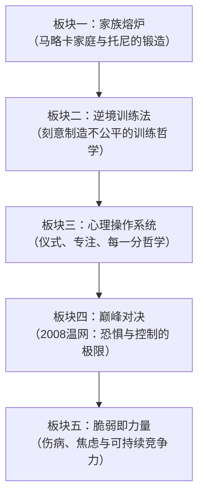

# 《纳达尔宝典》深度拆解

## 一、元信息速览

《纳达尔宝典》（*Rafa: My Story*，2011）是网球传奇拉斐尔·纳达尔的自传，由英国记者约翰·卡林（John Carlin）协助撰写。全书以2008年温布尔登决赛——纳达尔击败费德勒、被誉为"史上最伟大的网球比赛"——为叙事主线，穿插纳达尔从马略卡岛童年到登顶世界第一的完整成长历程。

这不是一本简单的冠军自传或成功学读物。它的核心价值在于==剖析一个顶级竞技者的内在心理操作系统==——恐惧如何被驯化为燃料、纪律如何压制天赋的傲慢、仪式如何成为专注力的锚点、家族系统如何塑造一个冠军的底层人格。与[[《刻意练习》]]聚焦方法论不同，纳达尔提供的是==来自战壕的第一手心理战报告==。与[[《心流》]]的理论视角互补，本书展示了一个运动员如何在极端压力下人工构建心流状态。

## 二、全书逻辑地图

全书可提炼为**五大心智板块**：

**核心命题**：顶级竞技的决定性因素不是天赋、不是技术、不是体能，而是==在极端压力下控制自己内心的能力==。纳达尔的整个职业生涯就是这一命题的持续证明——他不是那个最有天赋的人，但他是那个在最关键的一分上最不会崩溃的人。

## 三、逐章深度拆解

### 主题一：「家族熔炉——马略卡岛的纳达尔家族」

> [!note] 冠军不是从真空中产生的

**【核心论点】**

纳达尔的竞技人格不是在网球场上单独塑造的，而是在一个==紧密团结、纪律严明的马略卡家族==中被整体铸造的。家族的集体主义文化从根本上决定了纳达尔后来的竞技风格——谦逊、服务于团队、永远不把自己看得太重。

**【详细拆解】**

纳达尔出生在马略卡岛的马纳科尔（Manacor），一个中产阶级家庭。他的家族在当地经营家具和玻璃生意，几代人生活在同一片区域，关系极其亲密。在纳达尔的叙述中，家族不是背景板，而是他竞技人格的地基。

叔叔托尼·纳达尔（Toni Nadal）从纳达尔三四岁起就开始带他接触网球。但比网球技术更重要的是，托尼和整个家族传递给纳达尔的一套价值观：你不比任何人更特别；你的成就属于帮助你的所有人；无论你赢了多少冠军，回到家你和每个人一样。

纳达尔的父亲塞巴斯蒂安（Sebastián）是成功的商人，但在家中强调的从不是财富或地位，而是家庭成员之间的责任和相互支持。纳达尔回忆说，即使在他成为世界冠军之后，回到马略卡他依然要遵守家庭的规矩，依然是那个需要被长辈教导的年轻人。

这种家族文化有一个关键效果：==它让纳达尔免疫于成功带来的自我膨胀==。在职业体育中，无数天才因为过早的成功而失去方向——他们开始相信自己是不可战胜的，然后在第一次真正的挫折面前崩溃。纳达尔的家族系统像一个恒温器，无论外界温度如何变化，始终将他的自我认知调回"你只是一个努力工作的普通人"。

**【费曼式解读】**

想象一棵树。你看到的是地面以上的部分——树干、枝叶、果实，那是纳达尔的冠军头衔和赛场表现。但真正决定这棵树能长多高、能抗多大风的，是你看不到的根系——那就是他的家族。根系越深越广，树就越稳。很多天才运动员像是没有根系的漂亮盆栽——在温室里光彩夺目，一阵大风就倒了。纳达尔是一棵扎根在马略卡岩石里的树，风越大他站得越稳。

**【金句/关键概念】**

> ==网球是我做的事情，但不是我的全部。我的家庭才是我的全部。==

---

### 主题二：「托尼的教育哲学——用不公平铸造韧性」

> [!warning] 全书最具争议也最具洞察力的部分

**【核心论点】**

托尼·纳达尔的训练哲学建立在一个反直觉的第一性原理之上：==比赛中的条件永远不会公平，所以训练中越不公平越好==。他刻意在训练中制造劣势、压制自信、拒绝表扬，目的是让年幼的纳达尔在真正的比赛中感觉"条件已经比训练好多了"。

**【详细拆解】**

托尼的训练方法在外人看来近乎残酷。他会让年幼的纳达尔用破旧的球拍训练，而不是给他最好的装备。他会在训练中故意做出不公平的判罚——明明是纳达尔的好球，他判出界；明明是对手的出界球，他判有效。他的理由是：在真正的比赛中，你会遇到糟糕的判罚、恶劣的天气、不利的场地条件、对手的挑衅——如果你在训练中没有学会在这些不公平中保持专注，你在比赛中一定会崩溃。

更关键的是托尼对"表扬"的态度。他几乎从不表扬纳达尔。打出一个漂亮的制胜球，托尼的反应不是"干得好"，而是"你的脚步移动太慢了"或者干脆沉默。纳达尔在书中坦承这在童年时让他非常痛苦，但他后来理解了托尼的逻辑：==过度的表扬会让你满足于当前的水平，而满足是进步的敌人==。

托尼还坚持一个原则：永远不要找借口。场地不好？不是借口。身体不适？不是借口。裁判不公？不是借口。在托尼的世界里，借口是一种心理毒药——一旦你开始找借口，你就把自己的命运交给了外部因素，你就不再是自己命运的主人。

托尼的另一个核心原则是尊重——对对手的尊重、对球场的尊重、对比赛本身的尊重。他不允许纳达尔摔球拍、发脾气或表现出对对手的不敬。这不仅仅是礼貌问题，而是一种==竞技实用主义==：当你发脾气时，你在消耗宝贵的精神能量；当你不尊重对手时，你在低估他们，这会让你放松警惕。

**【费曼式解读】**

想象你要训练一支消防队。传统做法是在模拟场景中训练——温度可控、有安全网、火势不大。托尼的做法是什么？他把模拟火场的温度调得比真实火场还高，把安全网拿走，把水压故意调低。消防员们在训练中叫苦连天，觉得教官疯了。但当他们走进真正的火场时，他们的第一反应是："这比训练轻松多了。"纳达尔在比赛中的那种超乎寻常的镇定，正是这个逻辑的产物——真实的比赛条件几乎从未超过他在训练中忍受过的极限。

**【金句/关键概念】**

> ==托尼总是说："比赛中你没有权利抱怨任何事情。你唯一的权利就是战斗。"==

---

### 主题三：「每一分都是新的开始——纳达尔的专注力哲学」

> [!tip] 纳达尔竞技心理学的核心操作系统

**【核心论点】**

纳达尔将比赛中的专注力管理归结为一个极简原则：==每一分都是独立事件==。不回顾上一分的失误，不预想下一分的结果，不计算离胜利还有多远——只关注此刻这一分你需要做什么。

**【详细拆解】**

这个原则听起来简单到几乎是陈词滥调，但纳达尔在书中详细展示了执行这一原则的真实难度和他的具体方法。

在一场大满贯决赛中，你可能需要打200多分。每一分之间有大约25秒的间隔。在这25秒里，你的大脑会做什么？如果你刚刚犯了一个低级失误——比如一个简单的正手打下网——你的大脑会开始自我攻击："你怎么能犯这种错误？""你在最关键的时刻掉链子了。""你在观众面前丢脸了。"如果你刚刚打出一个漂亮的制胜球，你的大脑会得意："你太强了。""对手不是你的对手。""这场比赛已经赢定了。"

纳达尔说，这两种心理状态都是致命的。前者让你带着自我怀疑进入下一分，后者让你带着轻敌进入下一分。他的解决方案是一套严格的==心理重置程序==：每打完一分，他通过一系列固定的身体动作（擦汗、整理球拍线、调整衣服）来清空大脑，让自己回到"零状态"。这些动作不是迷信，而是经过多年训练形成的==条件反射式的专注力锚点==。

纳达尔还提到了一个更深层的维度：不计算比分的心理距离。当你在一场五盘大战中以两盘领先，你的大脑会不自觉地开始想"我只要再赢一盘就赢了"。这种想法看似合理，实际上极其危险——因为它把你的注意力从"这一分"转移到了"最终结果"。纳达尔说他在比赛中会刻意阻止自己进行这种计算，强迫自己只看眼前的一分。

这个原则的另一面是对失败的处理。纳达尔承认他在比赛中会犯很多错误——没有任何网球选手能避免失误。但他和普通选手的区别在于：==他能在犯错后15秒内完成心理重置，而大多数人需要好几局甚至一整盘才能从一个失误中恢复过来==。

**【费曼式解读】**

想象你在开车穿越一段很长的山路。如果你一直盯着终点在哪里、还剩多远、后面有没有车追你、刚才那个弯是不是转得太急了——你注意力分散，一定会出事故。最安全的驾驶方式是什么？只看眼前这个弯道，只处理此刻这个路况。上一个弯不管了，下一个弯还没到。纳达尔在网球场上做的就是这件事——他不是一个打五盘比赛的人，他是一个连续打200多个"只有一分的比赛"的人。

**【金句/关键概念】**

> ==我不是在打一场比赛，我是在打这一分。这一分就是整个世界。==

---

### 主题四：「赛前仪式——不是迷信，是心理工程」

> [!abstract] 将混沌的内心世界转化为可控流程

**【核心论点】**

纳达尔那些被外界视为"怪癖"甚至"强迫症"的赛前仪式和比赛中的固定行为（水瓶的摆放位置、毛巾的使用顺序、进场前的固定步骤），实质上是一套==精心设计的心理控制工具==，功能是在高压环境中创造一个可预测、可控制的微观世界。

**【详细拆解】**

纳达尔的仪式包括但不限于：两瓶水必须以特定角度摆放在椅子旁边、标签面朝向球场；每次换边休息时用毛巾的固定顺序和方式擦汗；进入球场时绝不踩线；发球前固定次数地拉裤子、摸鼻子、整理头发。

这些行为在外人看来毫无逻辑，但纳达尔在书中给出了清晰的解释：==它们的功能是创造一种「秩序感」==。在一场大满贯决赛中，几乎所有外部因素都是不可控的——对手的状态、观众的情绪、天气的变化、裁判的判罚。纳达尔无法控制这些，但他可以控制自己的水瓶怎么放、毛巾怎么擦、发球前的动作顺序。

这种"微观控制"产生的心理效果是：在一个充满不确定性的环境中，你建立了一个属于自己的"确定性岛屿"。每次你完成一个固定仪式，你就在向自己的大脑发送一个信号："一切都在掌控中。"虽然你知道并非一切都在掌控中，但这个信号足以降低你的焦虑水平，让你把精神能量集中到真正重要的事情——打好下一分——上面。

纳达尔也坦诚地指出，他知道这些仪式本身不会影响比赛结果——水瓶朝哪个方向不会让他的正手更好。但他需要的不是魔法，而是==一个将自己切换进"比赛模式"的可靠开关==。

**【费曼式解读】**

想象一个飞行员在起飞前必须完成的检查清单：检查油量、检查仪表、检查襟翼、确认跑道。这些动作每次飞行都一样，看起来机械重复。但它们的作用不仅是确保飞机安全——更重要的是让飞行员进入一种"我准备好了"的心理状态。如果飞行员跳过检查清单直接起飞，即使飞机一切正常，他也会在起飞后感到一种隐隐的不安。纳达尔的赛前仪式就是他的"起飞检查清单"——它让他确认自己已经准备好进入战斗。

**【金句/关键概念】**

> ==这些仪式不是为了改变外部世界——而是为了整理我的内部世界。==

---

### 主题五：「2008年温布尔登决赛——恐惧与控制的极限实验」

> [!warning] 全书的叙事高潮与心理学集大成

**【核心论点】**

2008年温布尔登决赛（纳达尔 vs 费德勒）不仅是网球史上最伟大的比赛之一，也是纳达尔全部心理训练的==终极压力测试==。在书中对这场比赛的逐分回忆中，你看到的不是一个冷静无畏的冠军，而是一个==与恐惧、自我怀疑和生理极限持续搏斗的人==。

**【详细拆解】**

温布尔登的草地球场是费德勒的领地。在草地上，球速更快、弹跳更低，这有利于费德勒的进攻型打法，而不利于纳达尔以上旋和防守见长的风格。在此之前，费德勒已经连续五年赢得温网冠军。纳达尔要在对手最擅长的战场上击败他。

纳达尔在书中详细描述了比赛前夜的心理状态：他几乎无法入睡，脑海中反复回放各种可能的比赛场景。他承认自己感到恐惧——不是那种模糊的紧张，而是具体的、尖锐的恐惧：害怕在全世界面前失败，害怕证明自己永远无法在草地上击败费德勒。

但纳达尔随后展示了他处理恐惧的方式：==不是消除恐惧，而是承认恐惧的存在，然后把恐惧转化为专注力的燃料==。他告诉自己：恐惧说明你在乎这场比赛，说明这场比赛值得你全力以赴。一个不感到恐惧的运动员，可能只是一个不够在乎的运动员。

比赛本身跌宕起伏。纳达尔在第三盘和第四盘被费德勒扳平，比赛进入决胜盘。在第五盘中，纳达尔描述了一种极其危险的心理状态：当你距离胜利如此之近，你的大脑开始提前庆祝——它开始想象你举起奖杯的画面，开始计算"我只要再赢几分"。纳达尔说这种心理状态比任何对手都危险，因为它把你从"当下"拉到了"未来"。

他在关键时刻的心理策略是：==把每一个关键分拆解为具体的技术任务==。不去想"这是冠军点"，而是想"我要把发球发到他的反手位，深一点，然后准备正手斜线"。把宏大的意义感压缩为具体的、可执行的微小动作。

最终纳达尔以9-7赢得第五盘，获得了他的第一个温网冠军。比赛结束后，因为雨水延误，天色已经暗了下来。纳达尔描述自己在获胜的那一刻感到的不是狂喜，而是一种==巨大的释放——所有积压的恐惧、紧张和自我怀疑在一瞬间排空==。

**【费曼式解读】**

想象你在走一条横跨峡谷的钢丝。如果你往下看——看到那个令人眩晕的深渊——你就会冻住或掉下去。如果你抬头看终点——计算还剩多远——你也会失去平衡。唯一安全的做法是什么？只看脚下这一步。只想你的脚此刻应该放在钢丝的哪个位置。纳达尔在温网决赛第五盘做的就是这件事：不看深渊（失败的恐惧），不看终点（冠军的渴望），只看脚下（这一分的技术执行）。

**【金句/关键概念】**

> ==恐惧是我比赛的一部分。不恐惧才可怕——那意味着你不在乎了。==

---

### 主题六：「伤病与脆弱——冠军的裂缝与修复」

> [!note] 反脆弱的真实案例

**【核心论点】**

纳达尔一生都在与身体的脆弱性搏斗。他患有先天性足部问题（舟状骨发育异常），导致他的膝盖长期承受不正常的压力。他的强大不是因为身体不会坏，而是因为==他学会了在身体持续报警的状态下依然发挥出接近最高水平==。

**【详细拆解】**

纳达尔的打法本身就是对身体的消耗——他在每一分中投入全部的体力，从不在任何一分上"节省体力"。这种打法产生了巨大的身体代价：他的膝盖从职业生涯早期就开始出现问题，足部的先天性结构异常意味着他每次奔跑都在加速关节的磨损。

纳达尔在书中没有回避伤病带来的心理痛苦。他描述了那些被迫停训的日子里的挫败感和恐惧——不是对疼痛的恐惧，而是对"也许我再也无法回到最高水平"的恐惧。对于一个以网球为生命意义的人来说，伤病威胁的不仅是他的职业，而是他的身份认同。

但纳达尔也展示了他处理伤病的策略。首先是接受：他不否认疼痛的存在，不逞强，不假装没事。其次是适应：他和他的医疗团队不断调整训练方式、比赛策略、恢复方案，在身体允许的范围内最大化竞技表现。最后是重新定义"强大"：==真正的强大不是永远不受伤，而是受伤之后还能回来，而且每次回来都证明你依然属于最高水平==。

纳达尔在2009年父母离婚期间经历了一段特别艰难的时期，心理和身体的双重压力让他在几场重要比赛中状态低迷。他在书中坦诚地将这段经历呈现出来，展示了即使是世界第一也会有精神层面的脆弱时刻。

**【费曼式解读】**

在日本有一种修复碎裂瓷器的艺术叫做"金缮"（Kintsugi）——不是把裂缝藏起来，而是用金粉填充裂缝，让修复后的器物比完好时更美。纳达尔的职业生涯就是一件金缮作品：每一次伤病、每一次低谷，都在他身上留下了裂缝，但他用纪律、韧性和适应力填充了这些裂缝，最终这些"修复"使他变得比没有经历过这些挫折的自己更强。

**【金句/关键概念】**

> ==你无法选择身体是否受伤，但你可以选择如何回应伤病。==

---

### 主题七：「情绪管理——带着恐惧上战场」

> [!tip] 颠覆"冠军无畏"的流行叙事

**【核心论点】**

纳达尔在书中反复强调一个与"冠军心态"流行叙事截然相反的真相：==他是一个极度紧张和焦虑的人==。他的强大不在于"不紧张"，而在于他发展出了一套在紧张状态下依然高水平执行的能力。

**【详细拆解】**

纳达尔描述了自己赛前的典型状态：胃部痉挛、想要呕吐、失眠、反复在脑海中预演最坏的场景。这不是偶尔发生的——这是几乎每场重要比赛前的常态。在外界看来，走上球场的纳达尔是一个自信、强势、斗志昂扬的战士。但在他的内心叙述中，走上球场前的他是一个与焦虑搏斗、试图控制生理紧张反应的普通人。

纳达尔对紧张的处理方式分为几个层面。在认知层面，他重新定义了紧张的意义：紧张不是软弱的表现，而是身体在为即将到来的战斗做准备——就像一个弓箭手拉满弓弦，弦越紧箭射得越远。在行为层面，他通过前面提到的固定仪式来创造秩序感，降低焦虑水平。在策略层面，他把比赛拆分为一个个独立的"微任务"，避免宏大的压力感把自己压垮。

特别值得注意的是纳达尔对"自信"的理解。他不认为自信是一种先验的信念（"我相信我一定会赢"），而是一种==基于充分准备的理性评估==（"我已经尽了一切努力来准备这场比赛，所以我有资格站在这里竞争"）。这种自信更加稳固，因为它不依赖于结果，而是依赖于过程。

纳达尔还谈到了他在赛场之外的情绪困境。他是一个不善于表达感情的人，经常在社交场合感到不自在。但他学会了接受这一点——不是每个人都需要成为社交明星，你可以在自己擅长的领域（球场上）充分表达自己，在不擅长的领域保持沉默。

**【费曼式解读】**

很多人以为勇敢的消防员是"不怕火"的人。事实恰恰相反——一个真正优秀的消防员是"非常怕火但依然冲进火场"的人。不怕火的消防员是危险的，因为他低估了火的威力，迟早会因为大意而送命。纳达尔就是那个"非常怕火"的消防员——他的恐惧让他保持警惕，他的训练让他在恐惧中依然能执行任务。

**【金句/关键概念】**

> ==最大的谎言就是"冠军不会紧张"。冠军会紧张，只是他们不让紧张控制自己的行为。==

---

### 主题八：「对手与尊重——纳达尔-费德勒的伟大对抗」

> [!abstract] 竞争的最高形态

**【核心论点】**

纳达尔与费德勒的对抗被认为是网球史上最伟大的rivalry。纳达尔在书中展示了一种==将对手视为自我提升工具而非需要摧毁的敌人==的竞技心态。

**【详细拆解】**

纳达尔对费德勒的描述充满了真诚的敬意。他称费德勒是"我见过的最伟大的网球选手"，承认在纯粹的天赋和技术美感方面，费德勒可能是无与伦比的。但在赛场上，这种敬意会被暂时搁置——纳达尔把费德勒视为一个必须被击败的对手，而不是一个需要仰望的偶像。

这种"场上对手、场下朋友"的关系不是做作的公关话术。纳达尔详细描述了两人之间的几次私下互动——在更衣室、在颁奖典礼上、在那些只有他们两人理解的瞬间——显示出一种基于相互尊重的真实连接。

更重要的是，纳达尔意识到费德勒的存在==迫使他不断进化==。如果没有费德勒这个标杆，纳达尔也许不会如此拼命地改进自己的发球、网前技术和草地打法。一个伟大的对手不是你成功的障碍，而是你成长的催化剂。

纳达尔也谈到了比赛中面对费德勒时的具体心理策略。他知道费德勒在关键分上有超凡的得分能力，所以他的策略不是试图在华丽的回合中击败费德勒，而是==通过自己标志性的高强度上旋和深区回球来最大限度地延长每一分的长度==，用体能和意志力来消耗费德勒的精力和耐心。

**【费曼式解读】**

在生物学中有一个概念叫"军备竞赛"（arms race）——捕食者和猎物在进化中互相推动对方变得更强。猎豹跑得快，逼得羚羊跑得更快，然后猎豹又进化得更快。纳达尔和费德勒就是网球世界的猎豹和羚羊（或者说两只互相追逐的猎豹）——每一次对决都迫使双方进化，结果是两人都达到了各自单独永远无法达到的高度。

**【金句/关键概念】**

> ==费德勒让我变得更好。我相信我也让他变得更好。这就是伟大对抗的意义。==

---

### 主题九：「团队与支撑系统——没有独行侠冠军」

> [!note] 解构个人英雄主义的迷思

**【核心论点】**

网球看起来是最"个人"的运动——场上只有你一个人。但纳达尔反复强调：==他的成功是一个系统的产物，而不是个人英雄主义的成就==。他的团队——教练、体能师、理疗师、经纪人、家人——是这个系统不可分割的部分。

**【详细拆解】**

纳达尔的团队核心包括：叔叔托尼（战术教练和精神导师）、体能教练拉法埃尔·马伊莫（Rafael Maymó，也是他的理疗师）、经纪人卡洛斯·科斯塔（Carlos Costa）、以及始终在幕后提供稳定支持的父母和家人。

纳达尔描述了这个团队的运作方式：它不是一个等级分明的命令体系，而是一个==以信任和坦诚为基础的协作网络==。每个人都有权在自己的专业领域内对纳达尔提出建议甚至批评，而纳达尔的角色是倾听所有人的意见，然后做出最终决定。

特别值得注意的是纳达尔对"依赖"的坦诚态度。在竞技体育文化中，"独立"和"自主"被高度推崇。但纳达尔毫不掩饰他对团队的依赖——他需要托尼在战术上的指导，需要理疗师每天对他身体的维护，需要家人在情感上的支撑。他认为==承认自己需要帮助不是软弱的表现，而是一种成熟的自我认知==。

纳达尔还强调了团队稳定性的重要性。他的核心团队成员几乎没有大的变动，这在职业网球中是罕见的——很多选手频繁更换教练和团队。纳达尔认为这种稳定性本身就是一种竞争优势：一个磨合了多年的团队理解你的每一个细微变化，能在你自己还没意识到问题之前就发现问题。

**【费曼式解读】**

一架飞机在空中飞行时，你只看到飞行员在驾驶舱里操作。但这架飞机之所以能安全飞行，背后有机械师检修引擎、空管人员规划航路、气象员提供天气预报、乘务员保障客舱安全。飞行员是唯一"上场"的人，但他的每一次成功着陆都是一整个系统协作的结果。纳达尔在球场上独自战斗，但他每一次举起奖杯的背后，都是一个完整团队多年磨合的成果。

**【金句/关键概念】**

> ==网球是个人运动中最像团队运动的。我一个人打比赛，但我从来不是一个人。==

---

## 四、核心框架提炼

从纳达尔的竞技生涯中可以提炼出一套**「逆境卓越系统」**——适用于任何需要在高压环境下持续高水平表现的场景：

| 维度 | 纳达尔的原则 | 第一性原理 |
|------|-------------|-----------|
| 心理基础 | 谦逊、不膨胀 | ==自我膨胀是系统崩溃的前兆== |
| 训练哲学 | 在劣势条件下训练 | ==训练难度应高于实战难度== |
| 专注力 | 每一分都是独立事件 | ==注意力的最小有效单位== |
| 情绪管理 | 带着恐惧战斗 | ==恐惧是燃料而非障碍== |
| 仪式系统 | 固定行为创造秩序感 | ==微观可控感对冲宏观不确定性== |
| 伤病应对 | 接受-适应-重新定义 | ==脆弱性是系统进化的输入== |
| 对手关系 | 尊重+竞争共生 | ==对手是成长的催化剂== |
| 支撑系统 | 信任团队、承认依赖 | ==冗余和协作胜过个人英雄主义== |

**纳达尔心智模型的核心公式**：

> ==逆境训练 + 微观专注 + 恐惧燃料化 + 团队冗余 = 可持续的卓越表现==

这个公式的深层逻辑是：卓越不是一种天赋状态，而是一种==工程产品==——通过正确的输入（逆境训练）、正确的注意力分配（微观专注）、正确的情绪处理（恐惧转化）和正确的系统设计（团队支撑），任何人都可以在自己的领域中逼近自己的极限。

## 五、批判性思考

**1. 幸存者偏差的可能性**

纳达尔的故事是一个成功者的回顾性叙事。托尼那种极端严苛的训练方式在纳达尔身上产生了冠军，但同样的方法在另一个孩子身上可能产生的是心理创伤和对运动的终身厌恶。你在阅读时需要区分"这个方法在这个特定个体身上起作用了"和"这个方法具有普遍适用性"——前者是事实，后者是未经验证的推论。

**2. 回忆的建构性**

这本书是纳达尔在2011年（25岁）时对自己过去经历的回忆。认知心理学研究表明，人的记忆不是录像带，而是每次回忆时重新建构的叙事。纳达尔描述的那些比赛中的"逐分心理状态"，可能并不完全是当时的真实感受，而是事后赋予了更清晰的逻辑和意义。这并不意味着这些描述没有价值——它们展示了纳达尔如何理解自己的经验，这本身就极具启发性。

**3. 特殊身体条件的前提**

纳达尔的方法论建立在一个前提之上：他拥有顶级的身体天赋（力量、速度、协调性、耐力）。他的叙述倾向于强调心理和纪律的重要性、淡化身体天赋的角色。但事实上，没有那个身体基础，再强的心理素质也无法让他成为大满贯冠军。你在学习他的方法时，需要把"心理方法论"和"身体前提"分开看待。

**4. 文化和家庭环境的不可复制性**

马略卡岛的那个紧密家族、叔叔恰好是网球教练、家庭经济条件足以支持一个孩子专注于网球训练——这些条件是特殊的、不可复制的。纳达尔的方法论可以被学习，但他的环境条件不能被复制。

**5. 代笔写作的透明度问题**

虽然约翰·卡林是一位受人尊敬的记者，但自传始终是一种经过编辑和选择性呈现的叙事形式。你看到的是纳达尔选择让你看到的部分，而不是完整的画面。

## 六、行动清单

基于纳达尔的方法论，以下是可以在日常工作和生活中实践的行动：

1. **建立你自己的"赛前仪式"** — 在每天开始重要工作前，设计一套固定的3-5步骤的准备流程（整理桌面、关闭通知、写下今天最重要的三件事），将自己切换进"工作模式"
2. **练习"每一分"思维** — 在工作中遇到多个任务时，强迫自己只关注当前这一个任务，完成后再看下一个，不让大脑在任务之间跳跃
3. **主动制造训练中的逆境** — 在准备重要演讲或项目时，故意在更苛刻的条件下排练（比如时间减半、听众更挑剔、设备更差），让真正的执行感觉"比练习轻松"
4. **重新定义紧张** — 下次你在重要场合感到紧张时，不要告诉自己"别紧张"，而是告诉自己"紧张说明我在乎，这是好事"
5. **建立你的支撑团队** — 识别你工作和生活中的"托尼"（坦诚给你反馈的人）、"理疗师"（帮你恢复精力的人）、"家人"（无条件支持你的人），主动维护这些关系
6. **练习"不找借口"** — 连续一周，在任何事情没有达到预期时，不在心里或口头上给出任何外部归因，只问"在现有条件下，我还能做什么"

## 七、延伸阅读路线图

- [[《刻意练习》]] — 安德斯·艾利克森：系统化理解"有效训练"的科学框架，与托尼的训练哲学形成理论-实践互补
- [[《心流》]] — 米哈里·契克森米哈赖：理解纳达尔"每一分"专注状态背后的心理学理论
- [[《反脆弱》]] — 纳西姆·塔勒布：纳达尔的伤病应对策略是"反脆弱"概念的完美运动案例
- [[《原则》]] — 雷·达利欧：另一个将个人方法论系统化的案例，可与纳达尔的方法论做对比
- [[《遗产》]] — 詹姆斯·科尔：新西兰全黑队的团队文化，与纳达尔家族文化的比较
- [[《思考，快与慢》]] — 丹尼尔·卡尼曼：理解纳达尔为什么需要用仪式来对抗大脑的"系统一"自动反应

## 八、费曼终极检验

如果你要向一个从未看过网球比赛的朋友解释这本书的核心智慧，你会这样说：

想象你要参加一场很重要的考试。大多数人的策略是：尽量让自己平静下来、相信自己能赢、靠灵感和天赋在考场上发挥。纳达尔的策略完全不同：他在备考时故意把练习题调得比真题更难，让真正考试时觉得"这比练习简单多了"；他不试图消除紧张，而是告诉自己"紧张说明我在乎"；他不去想"还有多少题没做"，而是只看"我现在面前这一道题"；他不是一个人备考，而是有一个团队帮他分析弱点、维护身体、提供情感支持；当他考砸了一道题，他在15秒内重置心态开始下一道，而不是花半小时懊悔。

==纳达尔教给你的不是如何成为天才，而是如何最大限度地使用你已经拥有的一切——然后在所有人都崩溃的时刻，依然站在那里。==
