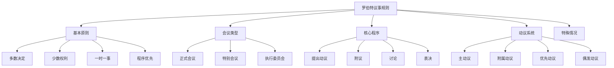
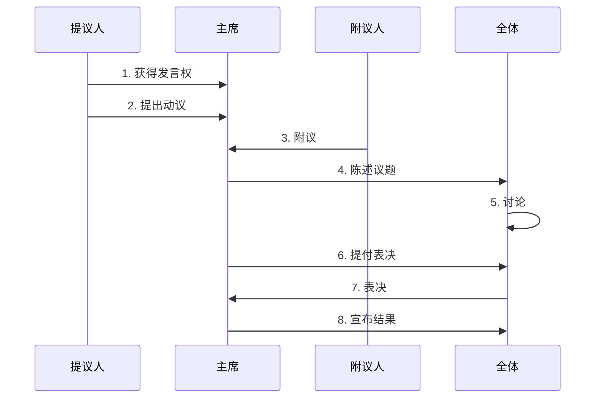
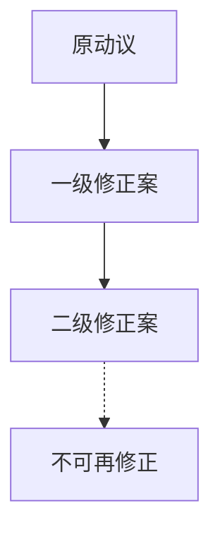
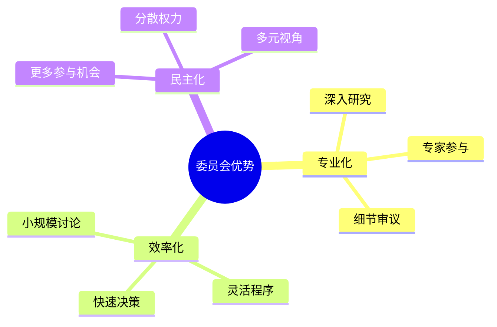
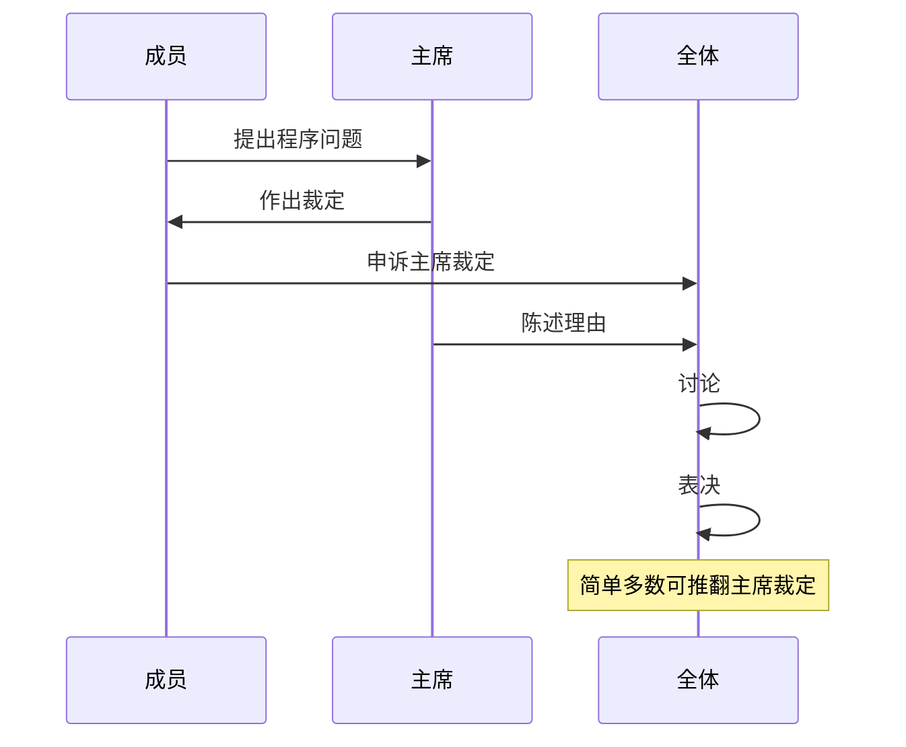
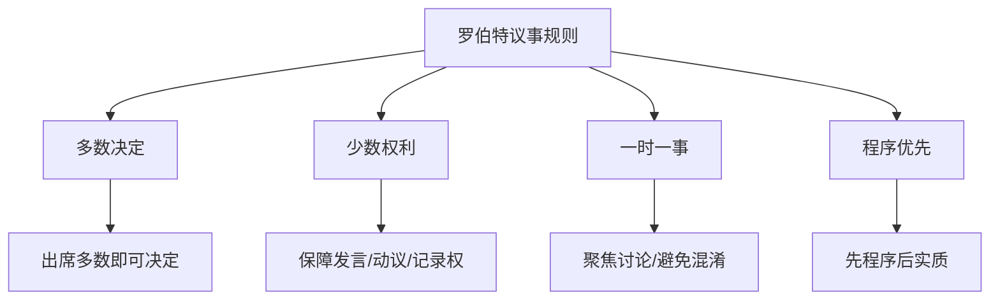

# 《罗伯特议事规则》深度读书笔记

## 一、元信息/坐标定位

### 作者背景
亨利·马丁·罗伯特（Henry Martyn Robert, 1837-1923）是美国陆军工程兵上将。1876年，他在主持一次教会会议时深感缺乏统一的议事规则，于是参考英国议会程序，编写了这本《议事规则袖珍手册》（Pocket Manual of Rules of Order）。此后历经多次修订，成为英语世界最权威的议事规则指南，==被称为"民主程序的圣经"==。

### 写作背景
19世纪的美国社会充满了各种自愿性组织——教会、俱乐部、协会、政党等。这些组织需要一套通用的会议规则来确保讨论有序、决策公正。罗伯特议事规则应运而生，填补了这一空白。

### 学科定位
本书属于**程序法/议事程序学**领域，是一部实用的工具书。但它背后蕴含着深刻的政治哲学——==如何在尊重多数的同时保护少数、如何在效率与公正之间取得平衡==。

### 核心问题域
- 会议如何才能有序进行？
- 如何确保每个人都有发言的机会？
- 如何防止少数人操控会议？
- 如何在分歧中达成有效的集体决策？

### 阅读价值
对于任何需要主持或参与会议的人——无论是企业管理者、社团负责人、还是基层组织者——这本书都是必备的工具书。它不仅教你怎么开会，更教你理解==民主决策的程序正义==。

---

## 二、全书逻辑地图

全书的逻辑结构可以概括为**"原则—程序—动议—特例"**四个层次：

**第一层（原则）**：阐述议事规则的根本原则——多数决定、少数权利、一时一事、程序优先。

**第二层（程序）**：详细说明一个标准动议从提出到表决的完整流程。

**第三层（动议）**：系统介绍各类动议（主动议、附属动议、优先动议、偶发动议）的规则和优先顺序。

**第四层（特例）**：处理各种特殊情况——如何修改章程、如何处理程序争议、如何应对突发状况。

核心论点：==议事规则的目的不是限制自由，而是保障自由——保障每个人说话的权利、保障少数不被多数压制、保障组织能够做出真正代表集体意志的决策==。

---

## 三、核心主题/逐章深度拆解

### 第一章：基本原则——民主程序的哲学基础

> [!abstract] 章节主旨
> 本章阐述议事规则的四大根本原则，这些原则贯穿整个规则体系。

#### 1.1 多数决定原则

> [!note] 核心原则
> ==多数的意志就是组织的意志==。除非规则另有规定，否则出席并投票的多数即可决定问题。

但"多数决定"不是简单的"51%压制49%"。罗伯特规则通过以下方式使多数决定更具合法性：

- **法定人数（Quorum）**：必须有足够的人出席，决策才有效
- **事先通知**：重大事项必须提前通知，避免突袭
- **充分讨论**：在表决前确保各方意见都能表达

#### 1.2 少数权利原则

> [!warning] 关键平衡
> 保护少数权利与尊重多数决定同等重要。==没有少数权利的保护，今天的多数明天就可能成为被压制的少数==。

少数的基本权利包括：
- **发言权**：有权表达反对意见
- **知情权**：有权了解议题和相关信息
- **动议权**：有权提出程序性动议
- **保留权**：有权记录在案自己的异议

保护少数的具体机制：

| 机制 | 作用 | 需要的票数 |
|------|------|-----------|
| 休会动议 | 防止被迫立即表决 | 简单多数 |
| 搁置动议 | 暂缓争议性议题 | 简单多数 |
| 修正案 | 改进原提案 | 简单多数 |
| 重新审议 | 纠正仓促决定 | 简单多数 |
| 点名表决 | 记录各人立场 | 1/5成员要求 |

#### 1.3 一时一事原则

> [!tip] 程序效率
> ==会议同一时间只讨论一件事==。这避免了议题混淆、讨论失焦。

这一原则的体现：
- 必须有一个"待决议题"（Pending Question）在场
- 新动议不能打断当前动议的讨论（除非是优先动议）
- 通过动议的优先顺序来处理多个议题

#### 1.4 程序优先原则

程序问题优先于实质问题。这意味着：
- 对程序的质疑必须立即处理
- 程序合规是决策有效的前提
- ==先解决"怎么做"，再解决"做什么"==

### 第二章：会议的基本流程

> [!abstract] 章节主旨
> 本章介绍一个标准会议从开始到结束的完整流程。

#### 2.1 会议的开始

标准的会议开场顺序：

> [!note] 法定人数
> 法定人数（Quorum）是进行有效决策所需的最低出席人数。通常为全体成员的半数以上。==没有法定人数，会议只能讨论，不能表决==。

#### 2.2 议程的标准结构

一个典型的会议议程包括：

1. **宣布开会**
2. **宣读并批准上次会议记录**
3. **执行官员报告**
4. **委员会报告**
5. **特别委员会报告**
6. **未完事项**（上次会议遗留）
7. **新事项**
8. **宣布休会**

> [!tip] 议程的灵活性
> 议程可以根据需要调整，但需要经过表决同意。==主席不能单方面改变议程顺序==。

#### 2.3 主席的角色

主席的职责：
- 宣布会议开始和结束
- 宣布议题和动议
- 认可发言者
- 维持秩序
- 宣布表决结果

> [!warning] 主席的中立性
> 主席应保持中立，不参与讨论。==如果主席想表达个人意见，必须暂时离开主席位置，由副主席主持==。

### 第三章：动议——议事的核心工具

> [!abstract] 章节主旨
> 本章是全书的核心，详细介绍各类动议的规则。

#### 3.1 动议的基本流程

一个动议从提出到完成的标准流程：

#### 3.2 动议的四大类别

罗伯特规则将所有动议分为四大类：

**（一）主动议（Main Motions）**

主动议是提出新事项供会议考虑的动议。特点：
- 必须在没有其他动议待决时才能提出
- 优先级最低
- 可以被修正
- 需要简单多数通过

例如："我动议，本组织向希望小学捐款5000元。"

**（二）附属动议（Subsidiary Motions）**

附属动议用于处理主动议。按优先级从高到低：

| 附属动议 | 作用 | 可否讨论 | 所需票数 |
|----------|------|----------|----------|
| 搁置 | 暂时放下议题 | 否 | 简单多数 |
| 结束辩论 | 立即表决 | 否 | 2/3多数 |
| 限制/延长辩论 | 调整讨论规则 | 否 | 2/3多数 |
| 推迟到指定时间 | 延后处理 | 可 | 简单多数 |
| 交付委员会 | 交给小组研究 | 可 | 简单多数 |
| 修正 | 修改原动议内容 | 可 | 简单多数 |
| 推迟无限期 | 否决议题 | 可 | 简单多数 |

> [!tip] 理解附属动议
> 附属动议是"处理动议的动议"。==它不是讨论事情本身，而是讨论如何讨论这件事==。

**（三）优先动议（Privileged Motions）**

优先动议涉及会议本身的紧急事务，优先级高于所有实质性动议：

| 优先动议 | 作用 | 可否讨论 | 所需票数 |
|----------|------|----------|----------|
| 修定下次开会时间 | 安排下次会议 | 否 | 简单多数 |
| 休会 | 结束会议 | 否 | 简单多数 |
| 休息 | 短暂暂停 | 否 | 简单多数 |
| 权利问题 | 解决个人权益 | 否 | 主席裁定 |
| 会议程序问题 | 指出程序违规 | 否 | 主席裁定 |

**（四）偶发动议（Incidental Motions）**

偶发动议处理与待决议题相关的程序问题，没有固定的优先顺序：

- **程序问题（Point of Order）**：指出违规
- **申诉（Appeal）**：挑战主席裁定
- **暂缓执行规则（Suspend the Rules）**：临时搁置某条规则
- **反对议题审议（Objection to Consideration）**：阻止讨论不当议题
- **分开议题（Division of the Question）**：将复合动议拆分表决
- **请求与查询（Requests and Inquiries）**：寻求信息或许可

#### 3.3 动议的优先级

> [!note] 优先级规则
> ==高优先级的动议可以打断低优先级的动议==。这是罗伯特规则最复杂但也最重要的部分。

简化的优先级顺序（从高到低）：
1. 修定下次开会时间
2. 休会
3. 休息
4. 权利问题
5. 会议程序问题
6. 附属动议（按上表顺序）
7. 主动议

### 第四章：表决——集体意志的形成

> [!abstract] 章节主旨
> 本章介绍各种表决方式及其适用情况。

#### 4.1 表决方式

| 表决方式 | 适用情况 | 特点 |
|----------|----------|------|
| 口头表决 | 非争议性议题 | 最快捷 |
| 举手表决 | 需要清点的情况 | 较准确 |
| 起立表决 | 需要更准确计数 | 比举手更清晰 |
| 点名表决 | 需要记录个人立场 | 有记录 |
| 书面表决 | 选举或敏感议题 | 匿名 |

> [!warning] 表决的时机
> 主席在宣布开始表决后、宣布结果前，不得阻止任何人投票。==表决一旦开始，就必须让所有人有机会表达意志==。

#### 4.2 不同的票数要求

并非所有决议都只需简单多数：

| 事项 | 所需票数 | 理由 |
|------|----------|------|
| 一般决议 | 简单多数 | 常规事务 |
| 结束辩论 | 2/3多数 | 限制发言权需更高门槛 |
| 暂缓执行规则 | 2/3多数 | 修改规则需谨慎 |
| 修改章程 | 2/3多数或更高 | 根本性变更需广泛共识 |
| 取消成员资格 | 2/3多数 | 保护成员权利 |

> [!tip] 票数要求的逻辑
> ==越是限制成员权利或改变组织根本规则的决定，需要的票数门槛越高==。这体现了保护少数权利的原则。

### 第五章：修正与重议——纠错机制

> [!abstract] 章节主旨
> 本章介绍如何修改待决议题和已通过决议的机制。

#### 5.1 修正案（Amendments）

修正案是最常用的程序工具，用于修改动议的内容。

修正案的类型：
- **插入**：添加新内容
- **删除**：移除现有内容
- **删除并插入**：替换内容
- **代替案**：用全新版本替换原动议

> [!note] 修正案的层级
> 可以对修正案提出修正案（二级修正），但==不能对二级修正案再提修正案==。这是为了防止讨论无限复杂化。

#### 5.2 重新审议（Reconsider）

重新审议动议允许会议重新考虑已经表决的议题。

限制条件：
- 必须在同一次会议或下一次会议提出
- 只能由==上次表决中赢方的一员==提出
- 同一议题只能重新审议一次

> [!warning] 防止滥用
> 这些限制是为了防止失败方不断要求重新表决，使会议无法前进。

#### 5.3 取消或修改已通过决议

如果错过了重新审议的时间窗口，仍可通过以下方式改变已通过决议：

- **取消动议（Rescind）**：完全废除已通过决议
- **修改已通过内容（Amend Something Previously Adopted）**：部分修改

这些动议通常需要：
- 有事先通知的情况下，简单多数通过
- 无事先通知，需2/3多数或全体成员的多数

### 第六章：委员会——分工与协作

> [!abstract] 章节主旨
> 本章介绍委员会的设置与运作。

#### 6.1 委员会的类型

- **常设委员会（Standing Committees）**：长期存在，处理特定类别事务
- **特别委员会（Special/Ad Hoc Committees）**：为特定任务临时设立
- **全体委员会（Committee of the Whole）**：全体成员作为委员会讨论

#### 6.2 委员会的优势

> [!tip] 何时使用委员会
> 当议题复杂、需要详细研究、或全体会议规模太大不便深入讨论时，应当使用委员会。

#### 6.3 委员会的程序特点

委员会的议事规则比全体会议更灵活：
- 不需要附议即可讨论
- 发言次数限制更宽松
- 可以非正式讨论
- 表决方式更随意

==委员会的灵活性是为了便于深入讨论，但其决定仍需提交全体会议批准==。

### 第七章：主席的艺术

> [!abstract] 章节主旨
> 本章探讨主席如何有效主持会议。

#### 7.1 主席的基本职责

- **宣布议题**：清楚陈述每个待决议题
- **认可发言**：决定谁有权发言
- **维持秩序**：确保讨论遵守规则
- **宣布结果**：正确宣布表决结果
- **解答程序问题**：就规则问题作出裁定

#### 7.2 主席的中立性

> [!warning] 核心准则
> 主席必须保持中立。==主席的权力来自其公正性；一旦失去中立，就失去了主持的合法性==。

如果主席想表达个人观点：
1. 暂时离开主席位置
2. 由副主席或临时主席主持
3. 发言结束后，该议题结束前不得返回主席位

#### 7.3 主席的裁定与申诉

主席对程序问题有裁定权，但成员可以提出申诉：

---

## 四、核心框架提炼

### 框架一：议事规则的四大支柱

### 框架二：动议处理流程

| 阶段 | 动作 | 责任方 |
|------|------|--------|
| 1. 获得发言权 | 举手/站立，获主席认可 | 提议人 |
| 2. 提出动议 | 明确说"我动议..." | 提议人 |
| 3. 附议 | 明确说"我附议" | 附议人 |
| 4. 陈述议题 | 重复动议内容，宣布开始讨论 | 主席 |
| 5. 讨论 | 轮流发言，遵守规则 | 全体 |
| 6. 提付表决 | 询问是否准备表决 | 主席 |
| 7. 表决 | 选择适当方式表决 | 全体 |
| 8. 宣布结果 | 宣布通过或否决 | 主席 |

### 框架三：票数要求速查

| 事项类型 | 所需票数 |
|----------|----------|
| 一般决议 | 简单多数 |
| 结束辩论 | 2/3多数 |
| 限制辩论时间 | 2/3多数 |
| 暂缓执行规则 | 2/3多数 |
| 修改章程（有通知） | 2/3多数 |
| 修改章程（无通知） | 全体成员的多数 |
| 取消成员资格 | 2/3多数 |

---

## 五、批判性思考

### 本书的贡献

1. **标准化**：为民主议事提供了一套通用语言和标准程序，使不同组织之间可以相互理解。

2. **平衡智慧**：在效率与公正、多数与少数之间找到了精妙的平衡。

3. **可操作性**：规则详尽具体，几乎覆盖了所有可能遇到的情况。

### 可商榷之处

> [!warning] 批判性反思

1. **复杂性门槛**：完整的罗伯特规则极其复杂，普通人难以完全掌握。这可能导致"规则专家"主导会议，形成新的不平等。

2. **文化适用性**：规则源于英美议会传统，强调对抗式辩论。在强调和谐、共识的文化中，可能需要调整。

3. **形式主义风险**：过度关注程序可能导致"为程序而程序"，忽视了实质性的讨论和共识建设。

4. **规模局限**：规则主要针对几十到几百人的会议设计。对于更大规模的公众参与，需要其他机制补充。

### 与其他议事传统的对话

- 与**共识决策（Consensus Decision-Making）**：罗伯特规则强调多数表决，共识决策强调所有人同意。各有利弊。
- 与**德尔菲法（Delphi Method）**：德尔菲法通过匿名反复征询达成共识，避免了面对面会议的权力动态。
- 与**中国传统"会议"**：传统中国政治中的"朝议"、"廷议"有不同的逻辑，强调等级和谏言而非平等表决。

---

## 六、行动清单

### 作为会议主持人

- [ ] 学习并熟记基本的动议处理流程
- [ ] 准备一份简化版规则提示卡
- [ ] 会前准备好议程并提前发送
- [ ] 练习保持中立，避免表达个人观点
- [ ] 学会使用"议题已经在场"等标准表述

### 作为会议参与者

- [ ] 了解自己的基本权利（发言、动议、表决）
- [ ] 学会正确提出动议的格式
- [ ] 了解如何提出程序问题和申诉
- [ ] 会前阅读议程，准备发言要点

### 作为组织管理者

- [ ] 为组织制定适合的议事规则（可简化）
- [ ] 培训关键成员掌握基本规则
- [ ] 指定一位"议事顾问"在会议中提供指导
- [ ] 定期评估会议效率，调整规则

### 对于学习者

- [ ] 先掌握简化版，再逐步学习完整版
- [ ] 观察真实会议中规则的应用
- [ ] 找机会实践主持小型会议
- [ ] 阅读案例分析，理解规则的实际应用

---

## 七、延伸阅读路线图

### 议事规则入门
- [[《罗伯特议事规则简明版》]] - 官方简化版，适合入门
- [[《可操作的民主》]] - 寇延丁，中国语境下的议事规则普及

### 民主理论
- [[《民主与不信任》]] - 约翰·伊利，程序民主的哲学基础
- [[《协商民主》]] - 詹姆斯·菲什金，超越投票的民主形式
- [[《论民主》]] - 罗伯特·达尔，民主的基本原则

### 会议管理实务
- [[《高效会议》]] - 如何设计和主持有效的会议
- [[《引导的秘诀》]] - 专业引导师的技巧
- [[《决策与判断》]] - 群体决策的心理学

### 组织治理
- [[《董事会议事规则》]] - 公司治理中的议事程序
- [[《非营利组织治理》]] - 社会组织的治理实践

---

## 八、费曼终极检验

**如果要向一个高中生解释这本书的核心内容，我会这样说：**

"想象一下，你们班要决定秋游去哪里。每个人都有自己的想法，有人想去游乐园，有人想去爬山，还有人想去博物馆。怎么办？

最简单的方法是投票。但如果只是简单投票，可能会出问题：

1. 有人嗓门大，一直说话，别人没机会说
2. 班长直接拍板，不管大家意见
3. 讨论了一小时，什么都没决定
4. 少数人的意见完全被无视

《罗伯特议事规则》就是为了解决这些问题而发明的一套"开会的规矩"。

**它的核心思想是：**

==第一，多数说了算，但少数有说话的权利==。你可能投票输了，但你至少能表达意见，而且你的反对意见要被记录下来。

==第二，一次讨论一件事==。先讨论"去哪里"，等这个决定了，再讨论"怎么去"。不能东一句西一句。

==第三，发言要先举手，得到主持人认可才能说话==。这样才能保证每个人都有机会，而不是谁嗓门大谁说了算。

==第四，程序比内容重要==。如果有人违反了规矩，要先处理这个违规，再继续讨论。

这套规则听起来很复杂，但它的目的很简单：==让每个人都有说话的机会，让集体能做出真正代表大多数人意志的决定，同时不让少数人被欺负==。

这就像球赛需要裁判和规则一样。没有规则，打球就会变成打架。开会也是一样——没有规则，讨论就会变成吵架，最后什么都决定不了，或者只有声音最大的人说了算。"

---

> [!tip] 最终感悟
> 罗伯特议事规则不只是一本工具书，它蕴含着一种深刻的信念：==人们能够通过理性的讨论达成公正的决定，只要有合理的程序保障==。这种信念是民主社会的基石。学习议事规则，就是在学习如何成为一个合格的公民。
