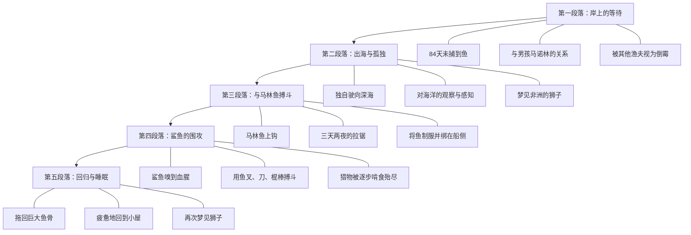
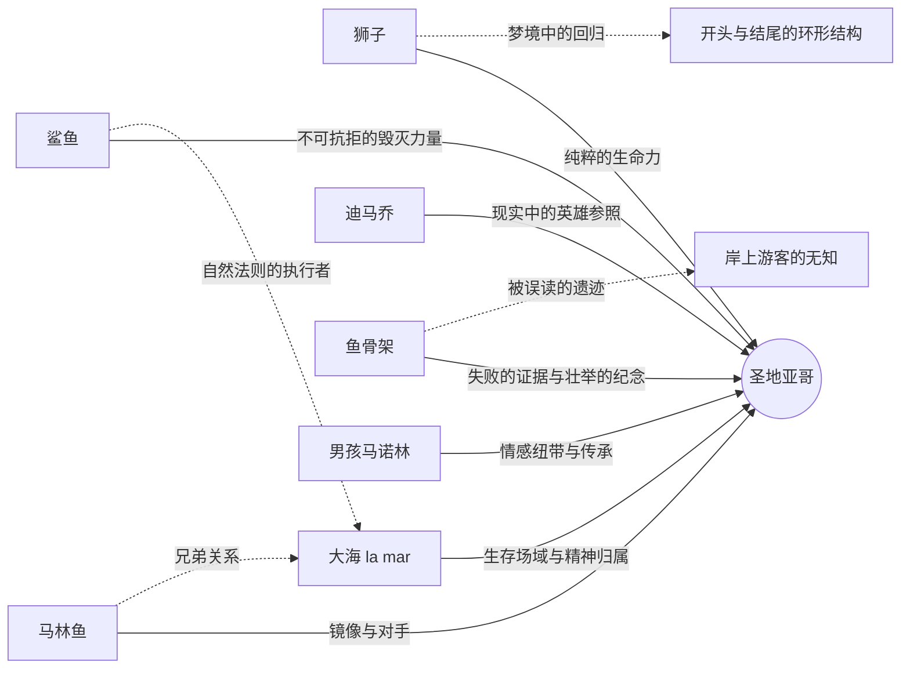
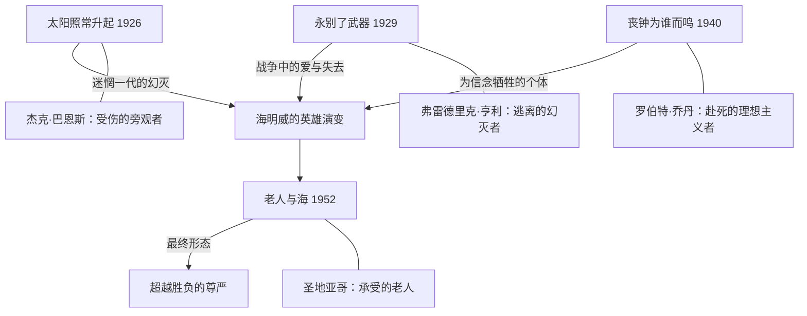

## 一、文学坐标定位

> [!abstract] 速览
> 《老人与海》（*The Old Man and the Sea*）是欧内斯特·海明威于1952年发表的中篇小说，也是他生前出版的最后一部重要小说。全书仅约两万七千字，讲述古巴老渔夫圣地亚哥在连续八十四天没有捕到鱼之后，独自驾船出海，在远离海岸的深海与一条巨大的马林鱼搏斗三天两夜，终于将其制服，却在返航途中被鲨鱼群不断啃食猎物，最终只带回一副巨大的鱼骨架。

这部作品是海明威文学生涯的集大成之作。1952年发表于《生活》杂志时引起轰动，两天内售出五百三十万份。1953年获普利策小说奖，1954年海明威凭此作及其整体文学成就获诺贝尔文学奖。瑞典文学院在授奖词中特别提到了他「精通现代叙事艺术」。

在海明威的创作脉络中，《老人与海》标志着一种回归与升华。经历了《丧钟为谁而鸣》（1940）之后长达十余年的创作低潮——其间《过河入林》（1950）遭到评论界几乎一致的差评——海明威用这部简短有力的作品证明了自己的叙事才华并未枯竭。如果说早期的《太阳照常升起》和《永别了，武器》展示了==迷惘一代的幻灭==，《老人与海》则在幻灭之后呈现了一种更深沉的东西：==在失败中不被摧毁的尊严==。

在世界文学脉络中，《老人与海》可以与梅尔维尔的[[《白鲸》]]形成对话——同样是人与海洋生物的搏斗，但海明威剔除了梅尔维尔的百科全书式的庞杂，只保留了最纯粹的对抗；也可以与[[《活着》]]中福贵的生存韧性构成跨文化呼应——尽管圣地亚哥的「不被打败」与福贵的「只是活着」在精神内核上有微妙的差异。

---

## 二、叙事结构解析

> [!note] 极简结构中的史诗感
> 《老人与海》的叙事结构近乎古典的简洁：一个人，一条船，一片海，一条鱼。没有次要情节线（subplot），没有闪回蒙太奇，没有多视角切换。海明威将小说的叙事要素压缩到了极限，但恰恰因此获得了史诗般的纵深感。

全书的叙事可以划分为五个清晰的段落：

**为什么海明威选择这种线性结构？** 这个问题触及了他的核心美学信念。海明威不信任复杂的叙事技巧——他认为真正有力量的故事不需要结构上的花招来制造张力。张力应该来自事件本身的重量和语言的精确。线性叙事将读者锁定在圣地亚哥的时间流中，你无法跳出去获得「上帝视角」，你必须跟他一起一分钟一分钟地熬过那三天两夜。这种叙事策略把阅读本身变成了一种==身体性的体验==。

**时间的处理方式**值得细究。海明威对出海前的岸上生活只用了很少的篇幅，但出海后的三天，时间被拉长、放大。每一次鱼线的拉扯、每一次手部的抽筋、每一次日出日落，都被赋予了极高的叙事密度。这种时间处理暗示了一个深层判断：==真正的生命不在日常中，而在极限处境中==。你是谁，不取决于你八十四天空手而归时如何表现，而取决于你在深海与巨鱼对峙时如何选择。

> [!tip] 苏格拉底追问
> 海明威为什么不从第八十五天早上出海直接开始叙事，而要用前面的篇幅铺垫岸上的生活？因为岸上的部分建立了两个关键要素：一是圣地亚哥的「倒霉」状态——八十四天的空白使这次出海具有了「最后一搏」的悲壮感；二是他与男孩马诺林的关系——这段关系是全书中唯一的温情纽带，也是结尾老人回归后情感落点的锚。

---

## 三、主题与意象网络

### 主题一：「不被打败」——海明威式的英雄主义

> [!tip] 黄金圈拆解
> - **Why**：海明威为什么要塑造一个在失败中「不被打败」的英雄？因为他一生都在思考一个问题：在一个没有确定性、没有救赎承诺的世界中，人的尊严从何而来？他的回答是：尊严不来自胜利的结果，而来自面对失败的姿态。
> - **How**：通过让圣地亚哥在「物质上彻底失败」（鱼被鲨鱼吃光）的同时在「精神上保持不屈」（从未放弃搏斗），海明威将胜利与失败的传统定义彻底拆解。
> - **What**：一个老渔夫捕到了一条大鱼，但最终只带回了鱼骨架。

**文本细读**：全书最著名的一句话——「一个人可以被毁灭，但不能被打败」（A man can be destroyed but not defeated）——是圣地亚哥在与马林鱼搏斗期间的内心独白。这句话的力量在于它区分了两种不同的「失败」：==身体的毁灭==与==精神的溃败==。身体可以被毁灭，这是物质世界的法则，人力无法对抗自然的绝对力量。但精神的溃败——放弃、投降、丧失尊严——是一个人自己的选择。圣地亚哥在整个搏斗过程中，从未有过放弃的念头。即使在鲨鱼一口一口啃食他的马林鱼时，他仍然用鱼叉、用刀、用船桨、用舵柄去搏斗，直到没有任何武器可用。

这种英雄主义与古典英雄主义有本质不同。古典英雄（阿喀琉斯、奥德修斯）通过胜利来证明自己的伟大；现代文学中的反英雄（卡夫卡的K，贝克特的等待者）则在无力中展示荒诞。海明威的英雄处于两者之间：他==承认失败的不可避免，但拒绝接受失败对尊严的剥夺==。这是一种后宗教时代的英雄主义——没有上帝的奖赏，没有命运的眷顾，只有一个人在空旷的宇宙中维持自身的完整。

**概念网络**：「不被打败」与「孤独」「骄傲」「衰老」三个概念紧密相连。圣地亚哥是孤独的——他独自出海，独自搏斗，独自承受失败，没有人见证他的壮举；他是骄傲的——即使八十四天没有捕到鱼，他也拒绝接受怜悯和施舍；他正在衰老——他的手抽筋、背疼痛、身体在不断发出衰退的信号。这三者共同构成了他「不被打败」的语境：正因为孤独，他的坚持没有观众，因而更为纯粹；正因为骄傲，他无法允许自己被击倒；正因为衰老，他的每一次搏斗都可能是最后一次，因而更加悲壮。

**苏格拉底追问**：圣地亚哥的「不被打败」是一种真正的精神胜利，还是一种自我欺骗？如果他最终只带回一副骨架，那他的搏斗在实际效果上与没有搏斗有什么区别？海明威的回答藏在叙事中：区别不在于结果，而在于过程。经历过那三天两夜的搏斗后，圣地亚哥是一个不同于出发前的人——不是因为他获得了什么，而是因为他证明了自己能够承受什么。

> [!warning] 深层张力
> 你可以注意到一个微妙的矛盾：圣地亚哥说「不能被打败」，但他同时也在不断自问「也许我不该走那么远」。这不是软弱，而是海明威的诚实——真正的英雄不是没有怀疑的人，而是带着怀疑仍然前行的人。海明威拒绝把圣地亚哥写成一个没有裂痕的钢铁硬汉，这正是这个角色超越了通俗文学中「硬汉」形象的地方。

---

### 主题二：人与自然——敬意中的搏斗

> [!tip] 黄金圈拆解
> - **Why**：海明威为什么要把人与自然的关系设定为既搏斗又尊重？因为他深知人类与自然不是单纯的征服与被征服关系，而是一种更复杂的共在——人必须从自然中获取生存资源，但这种获取不应抹杀对自然力量的敬畏。
> - **How**：通过圣地亚哥对马林鱼、对大海、对鲨鱼的复杂情感——既是对手又是兄弟，既要杀死又心怀尊重——来呈现这种关系的多层次性。
> - **What**：老人在搏斗中不断称马林鱼为「兄弟」，对它的力量和高贵表达由衷的敬意。

**文本细读**：圣地亚哥与马林鱼之间的关系是文学史上最微妙的「对手关系」之一。他在搏斗中不断对鱼说话：「鱼啊，我爱你，非常尊敬你。但是今天天黑以前我一定要把你杀死。」这种既爱且杀的态度不是矛盾，而是一种原始的、前文明的生存伦理——猎人对猎物的敬意。这与工业文明中对自然的冷漠榨取形成了鲜明对比。

圣地亚哥称大海为「la mar」（阴性，带有亲昵意味），而不是「el mar」（阳性，更正式）。海明威特意指出，年轻渔夫们把大海当作一个竞争者或一个场所（el mar），而老人把大海当作一个有生命的存在（la mar）。这个细节揭示了圣地亚哥与自然之间关系的本质：他不是大海的征服者，而是大海的一部分。

**概念网络**：「人与自然」在本书中与「生存链」「命运」「公平」三个概念交织。马林鱼吃小鱼，圣地亚哥捕马林鱼，鲨鱼抢圣地亚哥的猎物——这是一条完整的生存链，没有谁对谁错。圣地亚哥不恨鲨鱼（至少在最初），正如马林鱼不恨圣地亚哥——这是自然的法则，每个参与者都在执行自己的角色。但海明威同时让你感受到这个法则的残酷：==公平不意味着仁慈，自然的公正中没有怜悯的位置==。

**苏格拉底追问**：圣地亚哥对马林鱼的「尊重」是否只是一种人类中心主义的投射——将人类的高贵品质赋予一条鱼，以此来抬高自己的对手、从而抬高自己？这个问题没有确定的答案，但海明威的叙事暗示了另一种可能：圣地亚哥的尊重不是投射，而是识别——他在马林鱼的力量、耐久和尊严中看到了与自己相同的品质，这种识别是跨物种的。

---

### 主题三：孤独——创造性的独处

> [!tip] 黄金圈拆解
> - **Why**：海明威为什么要让圣地亚哥独自出海、独自面对这一切？因为孤独是海明威式英雄的必要条件——只有在彻底的孤独中，一个人才能触碰到自身最深处的力量或软弱，没有任何社会角色的遮掩。
> - **How**：通过剥夺圣地亚哥的所有社会联系——男孩不在身边、其他渔夫无法看到他、岸上的人不知道他的处境——海明威创造了一种实验室般的纯粹情境来测试「一个人究竟能承受什么」。
> - **What**：圣地亚哥在海上独自一人，与鱼搏斗，与自己对话，在极端孤独中维持清醒和意志。

**文本细读**：圣地亚哥在海上的独白是全书最具深度的段落之一。他与自己的手说话（「手啊，你怎么了」），与鱼说话，与鸟说话，与星星说话。这些独白不是疯癫的表现，而是一种==在孤独中维持人类性的策略==。当你身边没有任何人时，语言——即使是对自己说的语言——是你保持「人」这个身份的最后工具。

海明威曾说：「写作在本质上是孤独的。」圣地亚哥的海上独处可以被读作一个隐喻：创造性的劳动（无论是捕鱼还是写作）在最深层面上是一个人的事。没有人能替你拉住那条鱼线，没有人能替你写出那个句子。而这种孤独不是诅咒，而是==创造的前提条件==。

**概念网络**：孤独与「自我对话」「意志力」「梦境」形成一个内在的意象群。圣地亚哥在独处中进行的自我对话是意志力的外化——他通过对话来督促自己不要放弃；而他反复梦见的非洲海滩上的狮子，则是孤独中灵魂的避风港——在最疲惫的时刻，意识退回到了最纯净的记忆中。

---

### 主题四：衰老与尊严——时间中的抗争

> [!tip] 黄金圈拆解
> - **Why**：海明威为什么选择一个老人作为主角？因为衰老将「不被打败」的主题推到了极限——年轻人的搏斗可以靠体力和冲劲，而老人的搏斗只能靠经验、意志和对自身衰退的坦然接受。
> - **How**：通过反复描写圣地亚哥的身体状况——手上的老伤疤、抽筋的左手、疲惫的背部——海明威让你时刻意识到这是一个正在与时间赛跑的肉体。
> - **What**：一个老人用衰老的身体完成了年轻人都难以完成的壮举，但身体的衰老也注定了他无法在鲨鱼的围攻中保住猎物。

**文本细读**：海明威写圣地亚哥的身体写得极为具体。他的手因为常年拉鱼线而布满了老伤疤，「像无鱼可打的沙漠中被侵蚀的地貌」；他在搏斗中左手抽筋，不得不用右手和身体的其他部分来分担鱼线的拉力；他吃生金枪鱼来补充体力，即使恶心也强迫自己吃下去。

这些身体细节不是闲笔，而是海明威的核心叙事策略。他让你==通过身体来理解精神==。圣地亚哥的意志力不是一个抽象概念，而是具体地体现在他如何应对每一次肉体的痛楚中。他的伟大不在于他不疼——他疼，他知道自己疼——而在于他不让疼痛成为放弃的理由。

**苏格拉底追问**：海明威本人在写作《老人与海》时已经五十多岁，经历了两次飞机失事、多次受伤，身体状况急剧恶化。圣地亚哥是否是他的自画像——一个感到自己正在衰老的创作者，用最后的力量搏出了一部杰作，却深知自己可能无法保住此后的创作力量？这种传记学的解读虽不可过度推演，但确实为文本增添了一层苍凉的回声。

---

### 主题五：失败与超越——骨架的象征

> [!tip] 黄金圈拆解
> - **Why**：海明威为什么要让圣地亚哥最终只带回一副鱼骨架？因为他要彻底瓦解「成功=获得战利品」的世俗逻辑。骨架是失败的物证，但同时也是搏斗的证据——它证明那条鱼曾经存在过、曾经被征服过。
> - **How**：通过让鲨鱼一步步吃掉马林鱼，海明威制造了一个渐进的丧失过程，迫使读者和圣地亚哥一起接受「你可以做到一切该做的事，但仍然可能一无所获」这个残酷的真理。
> - **What**：巨大的鱼骨架被拖上岸边，游客以为是鲨鱼骨，而不知道它的故事。

**文本细读**：小说结尾有一个极为精妙的细节——港口的游客看到绑在圣地亚哥船旁的巨大鱼骨，问服务员那是什么。服务员用英语说是鲨鱼（tiburon/shark），游客便不再关心。这个误读蕴含了深刻的讽刺：==真正的壮举发生在没有观众的深海，而岸上的人们甚至无法正确辨认它的遗迹==。这呼应了一个更广泛的人生真理——你最深刻的经历、最艰难的搏斗，往往是别人无从理解的。

骨架作为象征物具有双重意义。从世俗角度看，它是彻底的失败——一条巨大的鱼只剩下骨头，没有任何经济价值。但从精神角度看，它是壮举的纪念碑——它的巨大尺寸证明了圣地亚哥所对抗的是多么强大的对手，也证明了他的确曾经做到了不可能的事。

**概念网络**：骨架与「证据」「记忆」「虚无」构成一组意象关系。骨架是证据——证明圣地亚哥没有在吹牛，他真的捕到了一条大鱼；骨架是记忆的物质载体——它让那三天两夜的搏斗留下了可触摸的痕迹；但骨架同时也指向虚无——当骨架最终也被潮水冲走或腐烂后，什么都不会留下，除了男孩和老人之间无需言说的理解。

---

## 四、核心意象解析

### 狮子

圣地亚哥反复梦见年轻时在非洲海滩上看到的狮子。这个意象出现在小说的开头和结尾，形成了一个完美的环形结构。

狮子象征着什么？不是力量，不是野性，而是==纯粹的、无目的的生命力==。海明威笔下的狮子不在捕猎，不在搏斗，它们只是在黄昏的海滩上玩耍。这个意象之所以反复出现在圣地亚哥的梦中，是因为它代表了一种他在清醒时无法企及的状态——一种不需要证明什么的存在方式。在搏斗的间隙，在疲惫至极时，圣地亚哥的潜意识退回到了这个原初的意象：生命本身的美丽和自足。

> [!question] 为什么是狮子而不是其他动物？
> 狮子在西方文化中是力量和高贵的象征，但海明威的狮子不是猎杀中的狮子，而是嬉戏中的狮子。这个选择至关重要——它暗示着真正的力量不在于搏斗，而在于搏斗之外的那种自在。圣地亚哥在海上拼尽全力，但他的灵魂向往的是海滩上无忧无虑的狮子。这构成了全书最深层的张力。

### 大海（la mar）

大海在本书中不是布景，而是一个活的存在。海明威赋予它阴性特征（la mar），将其与月亮、潮汐、生育联系在一起。大海既给予（提供鱼），也夺取（带来鲨鱼）；既温柔（平静的水面），也残酷（无情的风浪）。

大海是圣地亚哥的生存场域，也是他的精神归属。他不像年轻渔夫那样把大海当作需要征服的对象，而是把自己视为大海的一部分。这种态度使他的搏斗具有了不同的伦理意味——他不是在侵入一个异己的领域，而是在自己的领域中执行自己的角色。

### 马林鱼

马林鱼是圣地亚哥的镜像。它的特征——力量、耐久、尊严、孤独——与圣地亚哥完全对应。当圣地亚哥终于看到马林鱼从水面跃出时，他被它的巨大和美丽所震撼。这一刻，对手变成了令人敬畏的存在。

海明威从未详细描写马林鱼的「内心」——它始终是一个沉默的、被人类意识投射的对象。但正是这种沉默赋予了它一种超越语言的尊严。马林鱼不说话，不投降，不哀嚎，它只是==一直在那里，拉着线，游向深海，直到力竭==。

### 棒球与迪马乔

圣地亚哥在搏斗中反复想到棒球名将乔·迪马乔（Joe DiMaggio），特别是迪马乔在脚跟长了骨刺的情况下仍然坚持打球这件事。这个看似突兀的现实细节其实精准地嵌入了主题网络：迪马乔是圣地亚哥在现实世界中的参照系——一个==在身体受限的情况下仍然卓越的人==。

棒球的引入还具有另一层功能：它将圣地亚哥锚定在具体的社会现实中，防止他的形象过度象征化。他不是一个抽象的「人类意志的化身」，他是一个喜欢棒球、关心比赛结果、用迪马乔来激励自己的普通老人。正是这种日常性使他的壮举更加动人——伟大不属于神话中的英雄，而属于那些会为棒球比分兴奋的普通人。

---

## 五、人物分析

### 圣地亚哥

圣地亚哥是海明威塑造的最纯粹的「硬汉」形象，但也是最柔软的。与杰克·巴恩斯（《太阳照常升起》）的疲惫和罗伯特·乔丹（《丧钟为谁而鸣》）的悲壮不同，圣地亚哥身上有一种==近乎宗教性的平静==。他不愤怒、不怨恨，他只是做他该做的事，然后接受结果。

他的人物弧光不是传统意义上的「变化」——他在出海前和回来后本质上是同一个人。他的弧光体现在==显示==而非==变化==：三天两夜的搏斗将他一直存在但不可见的品质——耐力、尊严、谦逊中的骄傲——淋漓尽致地展示了出来。

圣地亚哥身上最容易被忽视的特质是他的==谦逊==。他说自己「不够聪明」，他承认自己走得太远了，他感谢男孩的帮助。这种谦逊与他的骄傲并不矛盾——他知道自己不是万能的，但在自己能力范围内，他拒绝做任何有损尊严的事。这种「有限度的骄傲」比无限的自信更加真实，也更加动人。

### 马诺林（男孩）

马诺林在叙事中的存在是功能性的但绝非可有可无。他是圣地亚哥与人类社会之间的==唯一连接点==。如果没有马诺林，圣地亚哥就只是一个孤独的老疯子在海上搏斗——男孩的爱和信任赋予了老人的行为以人间的温度。

马诺林代表的是「传承」。他的存在暗示着圣地亚哥的精神不会随他的死亡而消失——男孩已经从老人身上学到了如何成为一个渔夫、一个男人。小说结尾，男孩在老人床边哭泣，然后为他送来咖啡。这个简单的行为——哭泣与照料——是全书中最接近「救赎」的时刻。

> [!note] 关于马诺林的父母
> 马诺林的父母让他离开圣地亚哥，跟其他更「幸运」的渔夫出海。这个细节很重要：它代表了世俗的实用主义对精神忠诚的否定。男孩被迫在实际利益（跟幸运的船出海）和精神归属（跟老人学习）之间做出选择。他选择了服从父母，但心始终在老人那里。

---

## 六、风格与语言——冰山理论的极致实践

> [!note] 冰山理论
> 海明威在《午后之死》中提出了著名的「冰山理论」：如果一个作家对他所写的东西心里有数，那么他可以省略他所知道的东西，读者仍然能强烈地感觉到他所省略的一切，就好像作家已经把它们写出来了一样。冰山运动之所以雄伟壮观，是因为它只有八分之一露出水面。

《老人与海》是冰山理论最彻底的实践。全书几乎没有心理描写（传统意义上的），没有景物抒情，没有说教评论。海明威只写圣地亚哥做了什么、看到了什么、说了什么，而将「这一切意味着什么」完全交给读者去填充。

**为什么这种风格在这部作品中特别有效？** 因为主题本身——一个人在极限处境中的坚持——不需要被解释，只需要被==展示==。任何解释都会减弱它的力量。当海明威写圣地亚哥在暗夜中一个人拉着鱼线、手被勒出血、背部剧痛时，他不需要加一句「他多么坚强啊」——那种坚强已经在动作本身中了。

海明威的句子以短句为主，很少使用从句，几乎没有形容词的堆砌。这种语言风格与内容的匹配是精确的：简洁的语言对应简洁的行动，朴素的用词对应朴素的人物，==语言的克制与人物的克制同构==。

**与其他作家的比较**：如果说[[《白鲸》]]的梅尔维尔是将大海写成了一部百科全书，那么海明威是将大海写成了一首俳句。如果说福克纳用语言的迷宫来呈现意识的复杂性，海明威则用语言的极简来呈现行动的纯粹性。两种路径都是伟大的，但它们对读者的要求不同：福克纳要求你在语言中迷失，海明威要求你在语言的空白中==自行填充==。

> [!tip] 苏格拉底追问
> 冰山理论是否有其局限？省略和留白需要读者具有足够的经验和敏感性来填充空白。对于缺乏相关生命经验的读者，海明威的文本可能只是一个「老人捕鱼」的简单故事，水面下的八分之七可能完全不被感知。这是不是一种「精英主义」的写作？海明威可能会回答：好的文学不负责向每个人解释自己，它只负责忠实地呈现。

---

## 七、文学批评多视角

**存在主义视角**：圣地亚哥可以被视为加缪所说的「荒诞英雄」的变体。与西西弗斯的对比最为直接——两人都在做一件注定没有持久结果的事（推石头/捕鱼），但两人的态度有微妙差异。加缪说「我们应该想象西西弗斯是快乐的」，但海明威不谈快乐，他谈的是==尊严==。圣地亚哥不需要快乐来证明搏斗的价值，搏斗本身就是价值。这种立场比加缪更为冷峻，也更不依赖主观感受。

**基督教象征主义视角**：许多批评家指出了圣地亚哥身上的基督意象：他在船上的姿态（手被鱼线勒伤，如同钉痕）、他扛着桅杆上山坡（如同背负十字架）、他在小屋里摊开手掌睡去（如同受难后的安息）。海明威本人对这种解读态度暧昧——他既没有否认也没有肯定。值得注意的是，如果接受这种解读，那么圣地亚哥的「受难」是==没有救赎承诺的受难==——没有复活，没有天堂，只有一副鱼骨架和沉沉的睡眠。这使得基督教象征被挪用到了一个后基督教的语境中，受难的意义被保留，但超自然的补偿被移除。

**马克思主义视角**：圣地亚哥是一个彻底的无产者——他不拥有生产资料（他的船和工具已经破旧），他依靠体力劳动谋生，他的劳动成果（马林鱼）被更强大的力量（鲨鱼，可类比为资本的掠夺性力量）所剥夺。从这个角度看，《老人与海》可以被读作一个关于==劳动异化==的寓言：劳动者付出了一切，但最终一无所获。然而，海明威对这种解读可能不以为然——他关心的不是经济结构，而是个体的精神状态。

**后殖民视角**：故事设在古巴，主人公是一个古巴渔民，但叙事是由一个美国作家书写的。海明威是否在某种程度上将古巴渔民浪漫化了？圣地亚哥的「高贵」是否是一种美国作家投射在第三世界劳动者身上的审美想象？这个问题值得思考，但也应注意到海明威在古巴生活了二十多年，他对古巴渔民的了解不是旅游式的浮光掠影，而是长期观察和交往的结果。

**生态批评视角**：在当代语境中，《老人与海》引发了一个新的问题——人类与海洋生物的关系是否应该被重新审视？圣地亚哥对马林鱼的「尊重」是否足以正当化他的捕杀行为？海明威写作时生态意识尚未成为主流话语，但他笔下人与自然的复杂关系为今天的生态反思提供了丰富的文本基础。

---

## 八、写作技法拆解——为什么这样写

### 技法一：限制性第三人称

海明威选择了第三人称但几乎完全限制在圣地亚哥的视角中。为什么不用第一人称？因为第一人称的「我」在海明威的语境中意味着过多的自我意识和内省——那是菲茨杰拉德的领域，不是海明威的。第三人称的「他」创造了一个微妙的距离，让读者既能感受圣地亚哥的感知，又不被完全吸入他的主观世界。这种距离是海明威客观叙事美学的核心——他要你==看见==圣地亚哥，而不是==成为==他。

### 技法二：动作即性格

海明威不告诉你圣地亚哥是什么样的人，他只给你看圣地亚哥做了什么。这是海明威从新闻写作中继承的核心原则：==删掉所有可以通过行动推断出来的说明==。当圣地亚哥在手抽筋时强迫自己吃生金枪鱼、对自己的手说话督促它恢复，你不需要被告知他是一个「坚韧的人」——这个判断已经在行动中了。

### 技法三：重复与节奏

全书中某些句式和动作被反复出现：梦见狮子、想到迪马乔、与鱼说话、看天空的变化。这种重复不是冗余，而是==节奏的建构==。它模拟了真实时间中的体验——在三天两夜的搏斗中，时间是缓慢的、重复的、渐变的，而不是戏剧性地跳跃的。重复也具有催眠般的效果，将读者带入一种接近冥想的阅读状态。

### 技法四：省略终极情感

海明威在全书中最大的省略是什么？是==圣地亚哥对失败的最终感受==。当鲨鱼吃光了马林鱼后，海明威没有写圣地亚哥崩溃、哭泣或愤怒。他只是写老人继续驾船回港，回到小屋，倒在床上睡着了，然后又梦见了狮子。这个省略是全书最强有力的「冰山」——圣地亚哥在失败后的沉默，比任何悲痛的描写都更为震撼。因为你知道那个沉默下面有什么，但海明威拒绝把它挖出来给你看。

---

## 九、与海明威其他作品的对话

从杰克·巴恩斯到圣地亚哥，海明威笔下的英雄经历了一个清晰的演变轨迹。巴恩斯是==受了伤却无法表达==的人（战争的创伤、性无能的隐喻）；亨利是==选择逃离==的人（对战争的「单独媾和」）；乔丹是==选择死亡==的人（为了信念炸桥并牺牲）。而圣地亚哥是这一系列的终点：他==既不逃离也不赴死，他只是坚持==。他代表了海明威英雄哲学的最终形态——不再需要某个伟大的「原因」来支撑行动，行动本身就是原因。

---

## 十、跨时空共鸣

《老人与海》之所以在七十多年后仍然被阅读，是因为它触及的问题超越了特定的时代和文化：==当你竭尽全力后仍然失败了，你如何面对自己？==

在当代语境中，这个问题可能比海明威的时代更加紧迫。你生活在一个将「成功」量化为可见指标（收入、粉丝、影响力）的时代，而圣地亚哥的故事告诉你另一种衡量标准：==你的价值不在于你得到了什么，而在于你在争取的过程中展现了什么==。鱼骨架没有市场价值，但三天两夜的搏斗具有存在的价值。

这也是为什么《老人与海》常常在人生的不同阶段给人不同的感受。年轻时读它，你可能觉得这只是一个「老人捕鱼」的简单故事。在经历过努力、失败、失去之后再读它，你会在圣地亚哥的沉默中听到自己的回声——那种「我已经做了我能做的一切」的坦然，是人在失败之后能给予自己的最好的安慰。

---

## 十一、费曼终极检验

> [!abstract] 用最简单的话概括
> 如果你要向一个没读过《老人与海》的朋友解释这本书，可以这样说：

有一个古巴老渔夫，八十四天没捕到鱼了，所有人都觉得他倒霉透顶。第八十五天，他独自驾小船去了很远的深海，钓到了一条比他的船还大的马林鱼。他跟那条鱼搏斗了三天两夜，终于把它制服了。但在返航途中，鲨鱼一群一群地来，把鱼肉吃光了。他拼命搏斗，用鱼叉、用刀、用棍子，什么都用了，但没用。最后他拖着一副巨大的鱼骨架回到港口，走回自己的小屋，倒在床上睡着了，梦见了年轻时在非洲看到的狮子。

这本书最厉害的地方不在于写了什么，而在于==没有写什么==。海明威没有告诉你圣地亚哥是英雄还是失败者，没有告诉你他的挣扎有没有意义，没有告诉你这一切说明了什么。他只是把事情摆在你面前：一个老人，一条大鱼，一片空旷的海。然后你自己去感受。

如果你读完之后觉得心里沉甸甸的、但说不出为什么——那就对了。那个「说不出为什么」的部分，就是海明威省略的八分之七。

---

## 延伸阅读路线图

> [!note] 推荐阅读路径

- [[《太阳照常升起》]] — 海明威的成名作，迷惘一代的精神肖像，理解海明威英雄观的起点
- [[《永别了，武器》]] — 战争与爱情的毁灭，海明威早期的悲剧美学
- [[《丧钟为谁而鸣》]] — 西班牙内战中个人信念与牺牲的故事
- [[《白鲸》]] — 梅尔维尔的大海史诗，与《老人与海》在主题上形成宏大的对话
- [[《活着》]] — 余华笔下的中国式坚韧，与圣地亚哥的「不被打败」构成跨文化共鸣
- [[《局外人》]] — 加缪的荒诞英雄，与海明威的存在主义立场形成参照
- [[《午后之死》]] — 海明威的非虚构作品，「冰山理论」的原始表述
- [[《流动的盛宴》]] — 海明威的巴黎回忆录，理解他文学风格形成的背景
