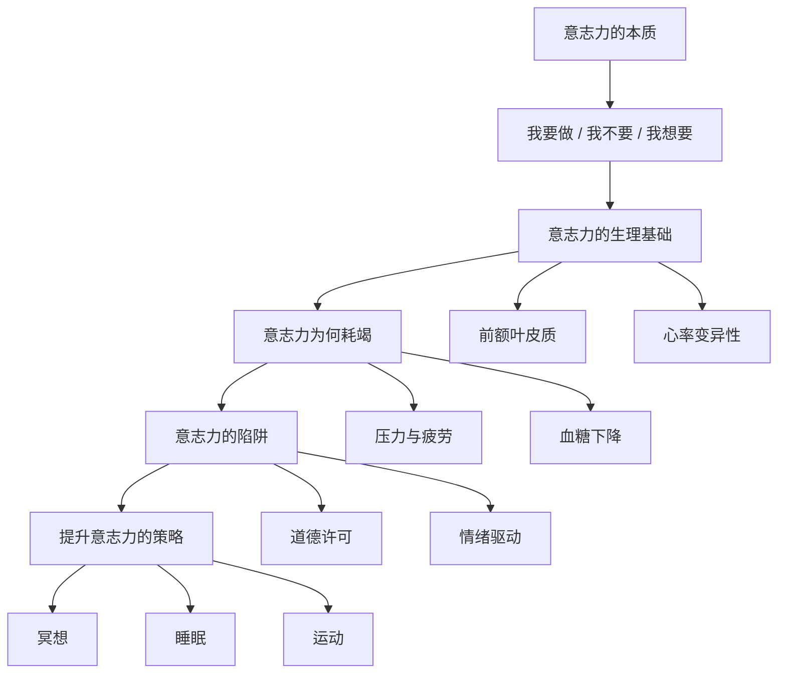
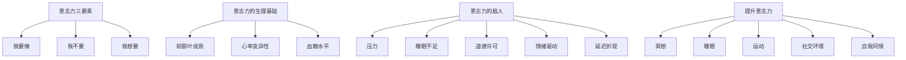

# 《自控力》深度拆解

## 一、心理学坐标定位（400字）

《自控力》是斯坦福大学心理学家凯利·麦格尼格尔的代表作，基于她在斯坦福开设的广受欢迎的"意志力科学"课程。这本书的核心目标是：==用科学的方法理解意志力，并提供可操作的策略来提升自控力==。

> [!abstract] 核心主题
> 麦格尼格尔的核心洞见是：**意志力不是一种道德品质，而是一种可以被理解、训练和管理的生理机制**。理解意志力的科学原理，比单纯的"努力坚持"更有效。

本书的核心框架：
- **意志力是什么**（神经科学基础）
- **意志力为何会失败**（常见陷阱）
- **如何提升意志力**（科学策略）

> [!tip] 方法论选择
> 本书属于心理学/自我管理类，采用==费曼学习法 + DIKW金字塔 + 反脆弱思维==进行拆解，侧重实验验证和认知纠偏。

---

## 二、全书逻辑地图（500字）

**全书论证链条**：

1. **定义问题**：意志力包含三种能力——"我要做"、"我不要"、"我想要"
2. **神经科学基础**：前额叶皮质是意志力的生理基础
3. **意志力耗竭**：意志力像肌肉一样会疲劳，但也可以锻炼
4. **常见陷阱**：道德许可、压力释放、未来折现等心理机制会破坏自控
5. **科学策略**：通过冥想、睡眠、运动等方式提升意志力储备

---

## 三、逐章深度拆解

### 第一章：「我要做、我不要、我想要」

**【核心论点】**

意志力不是单一的能力，而是三种不同的能力：
- **我要做**：面对困难也要完成任务
- **我不要**：抵抗诱惑
- **我想要**：记住长期目标

==这三种能力都由前额叶皮质控制==。

**【DIKW四层提炼】**

| 层级 | 内容 |
|------|------|
| Data | 前额叶皮质损伤的患者会失去自控能力 |
| Information | 前额叶皮质是意志力的"总部" |
| Knowledge | 意志力有明确的生理基础，不只是"品德问题" |
| Wisdom | ==提升意志力 = 锻炼前额叶皮质== |

**【费曼式解读】**

想象大脑是一家公司：
- **前额叶皮质**是CEO，负责战略决策和长期规划
- **边缘系统**是销售部，只想"立刻成交"
- **脑干**是后勤部，负责基本运转

当CEO精力充沛时，公司按战略执行。当CEO疲惫时，销售部就会接管，公司开始短视行事。

**【关键概念】**

> "每次你面临诱惑时，你的大脑都在进行一场内战——自控的你 vs 冲动的你。"

---

### 第二章：「意志力的本能——身体为何要阻止你」

**【核心论点】**

意志力不只是心理现象，==它有明确的生理指标：心率变异性（HRV）==。HRV越高，意志力储备越充足。

**【DIKW四层提炼】**

| 层级 | 内容 |
|------|------|
| Data | 高HRV的人在诱惑面前更容易保持自控 |
| Information | HRV反映了身体的"战斗-逃跑"反应与"暂停-计划"反应的平衡 |
| Knowledge | 压力会降低HRV，削弱意志力 |
| Wisdom | ==管理压力就是管理意志力== |

**【战斗-逃跑 vs 暂停-计划】**

> [!note] 两种反应模式
> - **战斗-逃跑**：面对外部威胁时启动，让身体进入高能量状态
> - **暂停-计划**：面对内部诱惑时启动，让身体冷静下来

有趣的是，这两种反应是相互竞争的。==当你处于压力状态时，战斗-逃跑反应占主导，暂停-计划反应就被抑制==。

**【费曼式解读】**

想象你的身体是一辆车：
- **战斗-逃跑**是油门，让你快速行动
- **暂停-计划**是刹车，让你停下来思考

压力就像一直踩着油门。在这种状态下，你很难踩刹车。这就是为什么压力大的时候更容易失控。

---

### 第三章：「累到无力抵抗」

**【核心论点】**

意志力像肌肉一样会疲劳，这就是著名的"自我损耗"（ego depletion）理论。但==好消息是，像肌肉一样，意志力也可以通过锻炼变得更强==。

**【DIKW四层提炼】**

| 层级 | 内容 |
|------|------|
| Data | 抵抗诱惑后，人们在后续任务中的自控力下降 |
| Information | 意志力是一种有限的资源 |
| Knowledge | 意志力消耗后需要恢复 |
| Wisdom | ==聪明地分配意志力，而非一味消耗== |

**【意志力训练方法】**

> [!tip] 提升意志力储备的方法
> 1. **冥想**：每天5分钟的专注呼吸练习
> 2. **充足睡眠**：睡眠不足会严重削弱意志力
> 3. **运动**：有氧运动可以增加前额叶皮质的灰质
> 4. **小任务练习**：用非惯用手刷牙、记录开支等

**【费曼式解读】**

如果意志力是手机电池：
- 每次做困难决定就消耗电量
- 睡眠是充电
- 压力是"后台运行的App"，持续耗电
- 冥想是"优化系统"，让电池更耐用

---

### 第四章：「容忍罪恶——为何善行之后会有恶行」

**【核心论点】**

这一章揭示了一个反直觉的现象：==做了好事之后，人们更容易做坏事==。这叫做"道德许可"（moral licensing）。

**【DIKW四层提炼】**

| 层级 | 内容 |
|------|------|
| Data | 运动后的人更可能选择高热量食物作为"奖励" |
| Information | 我们用善行来"抵消"恶行 |
| Knowledge | 这是因为我们把自控当作"道德记账" |
| Wisdom | ==不要把目标道德化，把它当作身份认同== |

**【道德许可的陷阱】**

> [!warning] 常见陷阱
> - "我今天运动了，所以可以吃块蛋糕"
> - "我工作很努力，所以周末可以放纵一下"
> - "我平时很节俭，所以偶尔奢侈一下没关系"

**【费曼式解读】**

想象你有一个"道德账户"：
- 做好事是存款
- 做坏事是取款
- 人们会不自觉地想要"花掉"存款

问题是，这种记账方式会让你永远在原地踏步。==真正的解决方案是把目标变成身份认同==："我是一个健康的人"而非"我今天要少吃"。

---

### 第五章：「大脑的弥天大谎——为何我们误把渴望当幸福」

**【核心论点】**

多巴胺不是"快乐激素"，而是=="渴望激素"==。它让你想要某样东西，但得到之后并不一定让你快乐。

**【DIKW四层提炼】**

| 层级 | 内容 |
|------|------|
| Data | 赌博、购物、刷手机都会刺激多巴胺分泌 |
| Information | 多巴胺驱动的是"追求"，不是"满足" |
| Knowledge | 我们常常误把"想要"当作"需要" |
| Wisdom | ==学会区分多巴胺驱动的渴望和真正的满足感== |

**【费曼式解读】**

多巴胺就像广告：
- 它告诉你"买了这个你就会幸福"
- 但买了之后，幸福感很快消失
- 然后多巴胺又指向下一个目标

这就是为什么刷手机停不下来：每次滑动都有新内容的"承诺"，多巴胺不断分泌，但你刷完之后并不觉得满足。

**【关键概念】**

> "大脑对'奖励的承诺'的反应，比对奖励本身的反应更强烈。"

---

### 第六章：「"那又如何"——情绪如何影响自控」

**【核心论点】**

压力、焦虑、罪恶感等负面情绪不会帮你自控，反而会==触发"情绪性进食"等自我安慰行为==。

**【DIKW四层提炼】**

| 层级 | 内容 |
|------|------|
| Data | 感到压力时，人们更容易暴饮暴食、冲动购物 |
| Information | 负面情绪会触发"战斗-逃跑"反应，削弱自控 |
| Knowledge | 自我批评会让情况更糟，而非更好 |
| Wisdom | ==自我同情比自我批评更有效== |

**【"那又如何"效应】**

> [!warning] 恶性循环
> 1. 违反了自控目标（比如吃了一块蛋糕）
> 2. 感到罪恶和自责
> 3. 为了缓解负面情绪，继续放纵
> 4. "反正已经破戒了，那又如何"

**【费曼式解读】**

想象你在减肥，不小心吃了一块蛋糕：
- **自我批评的人**："我真是太糟糕了，完全没有自控力。算了，反正已经破戒了，再吃几块也一样。"
- **自我同情的人**："没关系，每个人都会有失控的时候。一块蛋糕不会毁掉一切，下一餐继续健康饮食就好。"

研究表明，==自我同情的人在失控后更容易恢复自控==。

---

### 第七章：「出售未来——及时享乐的经济学」

**【核心论点】**

人类天生会高估即时奖励、低估未来奖励，这叫做"延迟折现"（delay discounting）。==这是意志力失败的核心机制之一==。

**【DIKW四层提炼】**

| 层级 | 内容 |
|------|------|
| Data | 大多数人宁愿今天拿50美元，也不愿下周拿100美元 |
| Information | 我们的大脑对"现在"和"未来"的估值不同 |
| Knowledge | 即时诱惑会压倒长期目标 |
| Wisdom | ==让未来变得更"真实"可以改变决策== |

**【对抗延迟折现的策略】**

> [!tip] 实用策略
> 1. **想象未来的自己**：研究表明，看到自己老年照片的人会更愿意为退休储蓄
> 2. **预先承诺**：提前做出限制选择的决定
> 3. **等待10分钟**：在冲动消费前等待，让理性有机会介入

**【费曼式解读】**

对大脑来说，"未来的你"几乎是个陌生人。所以你很容易把困难的事情推给"未来的你"——反正受苦的不是"现在的我"。

但如果你能让未来变得更真实——比如想象退休后的生活、想象完成目标后的感觉——大脑就会开始把"未来的你"当作"现在的你"来对待。

---

### 第八章：「传染——意志力会传染吗」

**【核心论点】**

意志力（和意志力的缺乏）都是会传染的。==你身边人的行为会影响你的自控力==。

**【DIKW四层提炼】**

| 层级 | 内容 |
|------|------|
| Data | 如果你的朋友变胖了，你变胖的概率也会增加 |
| Information | 社会规范会影响个人行为 |
| Knowledge | 我们会无意识地模仿身边的人 |
| Wisdom | ==选择你的社交圈就是选择你的默认行为== |

**【费曼式解读】**

想象自控力是一种"氛围"：
- 在健身房里，你更容易想运动
- 在酒吧里，你更容易想喝酒
- 在图书馆里，你更容易专注学习

你的社交圈就是你最常待的"氛围"。如果你想改变行为，有时候最简单的方法是改变环境。

---

### 第九章：「别读这章——"讽刺性反弹"的诅咒」

**【核心论点】**

越是试图压抑某个想法，那个想法就越会反弹回来。这就是"白熊效应"——==当你努力不去想一只白熊时，你会不停地想到白熊==。

**【DIKW四层提炼】**

| 层级 | 内容 |
|------|------|
| Data | 被要求不要想白熊的人，想白熊的次数反而更多 |
| Information | 思想压抑会导致"讽刺性反弹" |
| Knowledge | 与其对抗想法，不如接受它的存在 |
| Wisdom | ==接受诱惑的存在，但不必服从它== |

**【"冲浪"诱惑】**

> [!tip] 冲浪技巧
> 当诱惑出现时：
> 1. **注意到它**：承认"我现在想吃巧克力"
> 2. **接受它**：不要自责，这是正常的
> 3. **呼吸**：关注身体感受，而非想法本身
> 4. **等待**：诱惑像波浪一样，会自然消退

**【费曼式解读】**

诱惑就像海浪：
- 如果你试图阻挡它，会被冲倒
- 如果你学会"冲浪"——随着波浪起伏但不被卷走——你就能安全度过

关键不是消灭诱惑（这不可能），而是==学会与诱惑共处而不被它控制==。

---

### 第十章：「最终的意志力实验」

**【核心论点】**

全书的总结：意志力科学的核心洞见是==自我认知==。当你理解了大脑的运作方式，你就不再是它的奴隶。

**【DIKW四层提炼】**

| 层级 | 内容 |
|------|------|
| Data | 了解意志力科学的人，自控表现更好 |
| Information | 知识本身就是一种力量 |
| Knowledge | 意识到自己的弱点是改变的第一步 |
| Wisdom | ==自我观察比自我控制更重要== |

**【关键概念】**

> "意志力的终极秘密不在于完美的自控，而在于理解自己为何失控。"

---

## 四、核心框架提炼（800字）

### 意志力的科学模型

### 意志力失败的五大陷阱

| 陷阱 | 机制 | 对策 |
|------|------|------|
| **道德许可** | 善行后放纵 | 不要把目标道德化 |
| **多巴胺驱动** | 把渴望当幸福 | 区分"想要"和"需要" |
| **情绪驱动** | 用放纵缓解负面情绪 | 自我同情而非自我批评 |
| **延迟折现** | 高估即时奖励 | 让未来更"真实" |
| **思想压抑** | 越压抑越反弹 | 接受而非对抗 |

### 提升意志力的核心策略

> [!abstract] 四大支柱
> 1. **生理基础**：睡眠、运动、减压
> 2. **认知重构**：理解大脑的运作方式
> 3. **环境设计**：选择有利于自控的环境和社交圈
> 4. **自我同情**：失控后快速恢复

---

## 五、批判性思考（800字）

### 优势与贡献

1. **科学基础扎实**：每个观点都有实验支持
2. **颠覆常识**：揭示了意志力的反直觉真相
3. **可操作性强**：提供了具体的训练方法

### 局限与反思

> [!warning] 需要审慎思考的问题
> 1. **自我损耗争议**：近年来"自我损耗"理论受到挑战，复制实验结果不一致
> 2. **个体差异**：书中策略可能对不同人效果不同
> 3. **简化风险**：复杂行为难以简化为"意志力"单一因素

### 与其他理论的对话

| 理论 | 与本书的关系 |
|------|--------------|
| **习惯理论** | 习惯可以减少意志力消耗，是互补关系 |
| **动机理论** | 内在动机可以减少对意志力的依赖 |
| **正念冥想** | 麦格尼格尔推荐的核心训练方法 |

---

## 六、行动清单（500字）

### 立即可做（本周）

- [ ] **5分钟冥想**：每天花5分钟专注呼吸
- [ ] **充足睡眠**：保证7-8小时睡眠
- [ ] **识别诱惑**：记录本周让你失控的具体情境

### 中期目标（本月）

- [ ] **建立运动习惯**：每周3次有氧运动
- [ ] **设计环境**：减少诱惑物的可及性
- [ ] **练习自我同情**：失控后不自责，快速恢复

### 长期修炼

- [ ] **选择社交圈**：与有良好习惯的人为伍
- [ ] **身份认同**：把目标变成"我是谁"而非"我要做什么"
- [ ] **持续学习**：理解自己的行为模式

---

## 七、延伸阅读路线图（300字）

| 书籍 | 关联 |
|------|------|
| [[《习惯的力量》]] | 习惯可以减少对意志力的依赖 |
| [[《原子习惯》]] | 更系统的习惯养成方法 |
| [[《思考，快与慢》]] | 理解大脑的双系统模型 |
| [[《当下的力量》]] | 正念冥想的深入探索 |
| [[《自控力2：瑜伽实操篇》]] | 本书的续作，更多实操方法 |

---

## 八、费曼终极检验（400字）

**如果用一句话向朋友解释这本书的核心观点：**

> 意志力不是道德品质，而是像肌肉一样可以锻炼的生理机制——理解大脑的运作方式，比"硬撑"更有效。

**这本书改变了什么认知：**

1. **关于意志力**：从"品德问题"转向"生理机制"
2. **关于自我批评**：从"严厉要求自己"转向"自我同情"
3. **关于诱惑**：从"压抑"转向"接受并冲浪"

**留下的思考：**

这本书最大的价值是==把意志力从道德领域拉回到科学领域==。当你意识到失控不是因为"你不够好"，而是因为大脑有其运作规律时，你就能更客观地对待自己，也更有策略地改善自己。

但我也在想：如果一切都是"科学"，个人责任在哪里？或许答案是：==责任不在于"完美自控"，而在于"持续学习如何更好地自控"==。
