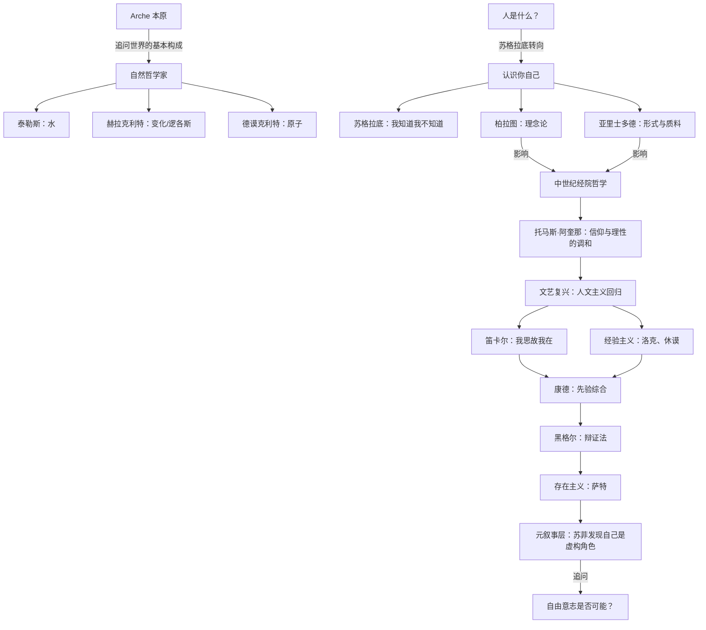
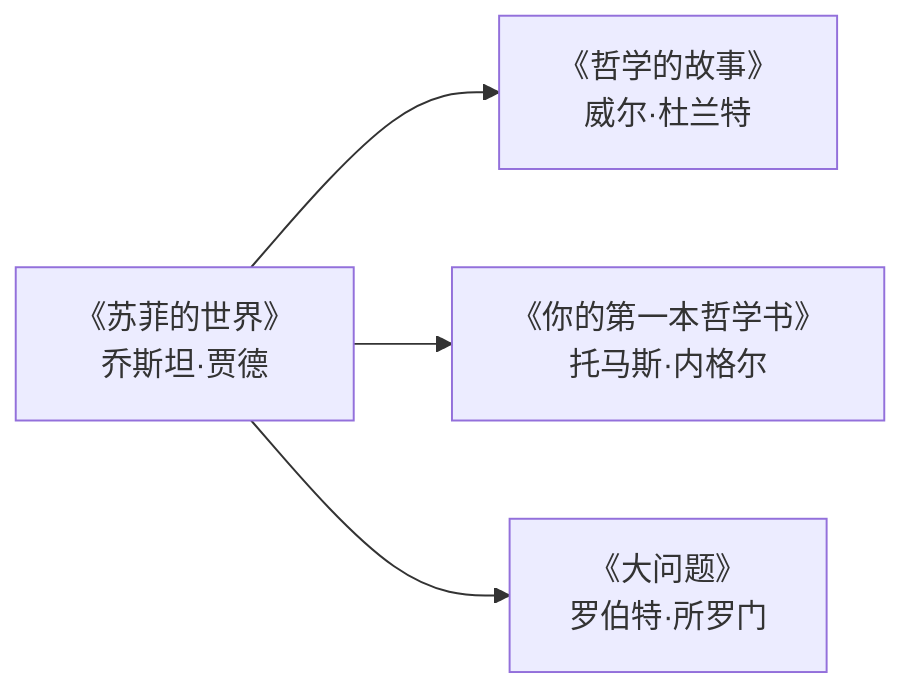

# 《苏菲的世界》深度拆解

## 一、哲学坐标定位

### 1.1 基本信息

《苏菲的世界》（*Sofies verden*）是挪威作家乔斯坦·贾德于1991年出版的哲学小说。书名中的"苏菲"（Sophie）来自希腊语 *sophia*，意为"智慧"——所以"苏菲的世界"也可以理解为"智慧的世界"。全书以14岁挪威少女苏菲·阿蒙森收到一封匿名信开始，信上只有一个问题："你是谁？"由此，一位神秘的哲学老师艾伯特·诺克斯开始通过书信带领苏菲走过整部西方哲学史——从古希腊的自然哲学家，经过苏格拉底、柏拉图、亚里士多德，穿越中世纪、文艺复兴、启蒙运动，直到现代的存在主义和当代哲学。

但这不仅仅是一本"哲学教科书"。贾德在叙事中埋下了一个惊人的元叙事结构：==苏菲和艾伯特逐渐发现，他们自己是一本书中的虚构人物，由一个叫艾勃特·纳格的联合国少校为女儿席德的生日而写==。这个发现将全书从"哲学入门读物"提升为一个关于存在、自由意志和虚构与真实边界的深层哲学实验。

### 1.2 哲学坐标


本书在哲学地图上的位置非常独特：它不是在某个哲学流派内部工作，而是试图==站在哲学史的"上方"，用鸟瞰的视角呈现整个西方哲学的演化脉络==。贾德的目标不是让你成为某个流派的信徒，而是让你理解"哲学是怎么一步步走到今天的"——每一个哲学家的思考都是对前人问题的回应，整部哲学史就是一场跨越两千五百年的接力对话。

### 1.3 核心追问

全书的根本问题可以归结为三个：

> [!question] 终极三问
> 1. ==你是谁？==——关于人的本质和自我认知的问题（认识论与存在论交汇处）
> 2. ==世界从何而来？==——关于宇宙本原和存在根基的问题（形而上学的核心问题）
> 3. ==你是否活在别人的故事里？==——关于自由意志、真实与虚构的边界问题（元哲学层面）

这三个问题构成了全书的三重结构：前两个问题驱动了整个哲学史的回顾，第三个问题通过元叙事手法在故事层面展开。

---

## 二、核心概念网络

### 2.1 概念图谱



### 2.2 核心概念精解

> [!abstract] 概念1：Arche（本原）
> **原始含义**：古希腊语 ἀρχή，意为"开始""起源""第一原则"。在哲学史上，它特指米利都学派哲学家追问的那个"万物最初由什么构成、最终又归于什么"的终极实体。
>
> **通俗解释**：想象你面前有一杯水、一块石头、一片树叶、一缕空气。它们看起来完全不同。但如果你不断追问"这些东西最最底层是由什么做成的？"——你就在追问本原。泰勒斯说是"水"，阿那克西美尼说是"气"，赫拉克利特说是"火"（或者说是"变化"本身），德谟克利特说是"原子"。他们给出了不同的答案，但他们提出了同一个问题。==这个问题本身，比任何答案都更重要——因为它标志着人类第一次试图用理性而非神话来解释世界。==

> [!abstract] 概念2：Idea / Eidos（理念/理型）
> **原始含义**：柏拉图哲学的核心术语。希腊语 ἰδέα（idea）和 εἶδος（eidos）均源自动词"看"（idein），本义是"所看到的形象"。但柏拉图赋予它全新含义：理念是事物的永恒、完美、不变的原型，存在于超感官的"理念世界"中。我们感官所见的一切具体事物，只是理念的不完美"摹本"或"影子"。
>
> **通俗解释**：你见过无数匹马——黑马、白马、高马、矮马、跛马。但你从未见过一匹"完美的马"。然而你心里有一个"马"的概念，你凭借这个概念才能辨认出所有这些不同的动物都是"马"。柏拉图会说，那个你心中的"马的概念"比任何一匹具体的马都更加真实——具体的马会死去、会变老、会残缺，但"马的理念"永远完美不变。==你眼睛看到的那个世界是洞穴墙壁上的影子，真正的实在藏在你看不见的地方。==

> [!abstract] 概念3：Cogito ergo sum（我思故我在）
> **原始含义**：笛卡尔在《第一哲学沉思集》中提出的命题。笛卡尔试图对一切进行彻底怀疑——感官可能欺骗你，数学可能是错的，甚至可能有一个"邪恶的魔鬼"在系统性地欺骗你。但他发现有一件事无法被怀疑：==正在怀疑的那个"我"必定存在==。因为即使怀疑本身也是一种思维活动，而思维活动需要一个思维主体。
>
> **通俗解释**：想象你怀疑一切——你怀疑这张桌子是不是真的，你怀疑你的朋友是不是真的，你甚至怀疑你自己的身体是不是真的。但就在你怀疑的那一刻，有一个"正在怀疑的你"——那个"正在想事情"的存在，它不可能是假的。因为如果连"正在思考的你"都不存在，那是谁在做怀疑这件事呢？这就是笛卡尔找到的那个不可动摇的阿基米德支点。

> [!abstract] 概念4：Das Ding an sich（物自体/自在之物）
> **原始含义**：康德哲学的核心概念。康德认为，人的认识能力有一个内在的限制：你永远只能认识事物"对你呈现的样子"（现象），而永远无法认识事物"本身是什么样子"（物自体）。因为你的一切认识都必须经过你的感官形式（时间和空间）和知性范畴（因果、实体等）的"加工"，你永远无法绕过自己的认识装置去直接触及事物本身。
>
> **通俗解释**：想象你永远戴着一副红色眼镜，而且这副眼镜无法摘下来。你看到的一切都带有红色调。你知道世界可能不是红色的，但你无法验证——因为你没有办法不通过眼镜去看。康德说，人的认识就像这副眼镜：时间、空间和因果律就是你的"镜片"，你所看到的世界永远是经过这些镜片过滤后的世界。==不是世界本身有时间和空间，而是你的心灵把时间和空间"投射"到了世界上。==

> [!abstract] 概念5：存在先于本质（L'existence précède l'essence）
> **原始含义**：萨特存在主义的核心命题。传统哲学（尤其是柏拉图以来的本质主义传统）认为事物先有一个"本质"（设计图、理念），然后才有"存在"（具体实现）。比如一把剪刀，先有"剪刀"的设计意图，然后才有具体的剪刀。萨特翻转了这个顺序：对于人来说，==你先"存在"（被抛入世界），然后才通过你的选择和行动来"定义"自己是什么==。没有预先设定的"人的本质"。
>
> **通俗解释**：一把剪刀在被制造之前，工匠就已经知道它"应该是什么样的"——它的本质先于它的存在。但你不一样。没有人在你出生之前画好了一张"你应该成为什么人"的蓝图。你先是被抛到了这个世界上，然后你必须自己决定你要成为什么。你不是一件"被设计好的产品"，你是一个"正在进行中的项目"。

---

## 三、论证链深度拆解

### 3.1 第一条论证链：从神话到理性——哲学的诞生

> [!tip] 第一性原理起点
> ==一切哲学的起点是"惊奇"（thaumazein）。==亚里士多德说"哲学始于惊奇"。当一个人对那些所有人都习以为常的事情感到惊讶——为什么天是蓝的？为什么人会死？为什么世界存在而不是不存在？——哲学就诞生了。

**【论证展开】**

贾德在书中通过艾伯特的第一封信——"你是谁？"——直接将你推入这种惊奇状态。这个问题看似简单，但你越认真想就越发现它无法回答。你可以说"我叫苏菲"，但名字只是标签。你可以说"我是一个14岁的女孩"，但这只是描述了你的某些属性。那个"你"到底是什么？

古希腊的自然哲学家——泰勒斯、阿那克西曼德、赫拉克利特、巴门尼德、德谟克利特——是人类历史上第一批试图用理性而非神话来回答"世界从何而来"的人。在他们之前，希腊人用诸神的故事来解释自然现象：打雷是因为宙斯发怒，大海是波塞冬的领地。自然哲学家的革命性在于：==他们第一次认为自然界的解释应该在自然界本身中寻找，而不是诉诸超自然的存在==。

贾德在书中强调了一个关键的转变——从"泰勒斯说万物是水"到"德谟克利特说万物是原子"的演化过程。泰勒斯试图找到一种具体的物质作为本原，这个思路虽然粗糙但方向正确。德谟克利特的原子论则更进一步：万物由不可分割的微粒组成，这些微粒在虚空中运动和组合。这个想法在两千多年后被现代物理学证实（虽然"原子"的具体含义已经完全不同）。

**【苏格拉底追问】**

- 追问1：如果万物都由原子组成，那"意识"也是原子组成的吗？如果是，一堆原子怎么就能"想事情"了？（这就是后来的"心身问题"）
- 追问2：自然哲学家用理性取代了神话，但理性本身的合法性谁来保证？你凭什么相信理性比神话更可靠？（这个问题要等到康德才真正被严肃处理）
- 追问3：如果世界的解释应该在世界内部寻找，那"世界为什么存在"这个问题还有意义吗？因为任何在世界内部找到的解释，都预设了世界已经存在。

**【费曼通俗解读】**

想象你生活在一个村子里，村里人告诉你"打雷是因为天神发怒了"。你从小就接受了这个解释。有一天，一个叫泰勒斯的人站出来说："不对，打雷有自然原因，跟天神没关系。"这在当时是一件极其大胆的事——不是因为他的具体答案（他的答案可能是错的），而是因为他改变了"什么算是一个好的解释"的标准。在他之前，"天神发怒"就算一个好解释。在他之后，一个好的解释必须是可以被理性检验的、不依赖超自然力量的。==这个标准的转变，比任何具体的科学发现都更加重要——它是科学本身得以诞生的前提。==

---

### 3.2 第二条论证链：苏格拉底转向——从宇宙到人

> [!tip] 第一性原理起点
> ==苏格拉底把哲学从天上拉回到了人间。==他的核心洞察是：在追问宇宙的本原之前，你首先应该追问"你自己"——因为你用来认识宇宙的那个工具（你的心灵、你的理性）本身就需要被检验。

**【论证展开】**

贾德用相当大的篇幅呈现了苏格拉底的哲学方法。苏格拉底不写书，不建立体系，不给出"标准答案"。他做的事情只有一件：在雅典的集市上找人聊天，通过不断追问来暴露对方思维中的矛盾和盲点。

苏格拉底方法的核心是"产婆术"（maieutics）——他把自己比作助产士，不是给你知识，而是帮你"生出"你内心本来就有但尚未自觉的想法。他的经典做法是这样的：有人说"我知道什么是正义"，苏格拉底就问"那请你定义一下正义是什么"，对方给出一个定义，苏格拉底就找出一个反例来推翻它，对方修改定义，苏格拉底再找反例……如此循环，直到对方承认"我其实不知道正义是什么"。

这个过程看起来像是"搞破坏"——对方最终什么也没学到，反而丧失了原有的确信。但苏格拉底认为，==认识到自己的无知恰恰是智慧的开始==。因为只有当你真正意识到自己不懂，你才会开始真正地思考。那些以为自己什么都懂的人，恰恰是最没有智慧的人。

德尔菲神庙的铭文"认识你自己"（γνῶθι σεαυτόν），在苏格拉底这里获得了全新的深度：这不是说你要了解自己的兴趣爱好，而是说==你必须审视你的思维方式本身——你以为你知道的那些东西，你真的知道吗？你的信念有根据吗？你活着是在真正思考，还是只是在重复别人告诉你的东西？==

**【苏格拉底追问】**

- 追问1：苏格拉底说"我知道我一无所知"，但"知道自己一无所知"这件事本身不就是一种知识吗？那他到底知不知道？（这是一个精妙的悖论，类似于"说谎者悖论"）
- 追问2：如果通过追问只能达到"否定性的结果"（知道自己不知道），那哲学能给你任何"正面的"确定知识吗？（柏拉图试图通过理念论来回答这个问题）
- 追问3：苏格拉底为了自己的哲学信念而赴死（饮鸩而亡），这说明什么？——==哲学不仅仅是一种思维游戏，它是一种生活方式，严肃到可以为之付出生命。==

**【费曼通俗解读】**

想象你在一个派对上，有人自信满满地宣称"幸福就是有钱"。苏格拉底会走过去说："有钱人有时候也不幸福对吧？那幸福到底是什么？"对方说"那幸福是内心平静"。苏格拉底说："一个对世界毫不关心的人可能内心也很平静，但你会说他幸福吗？"对方又修改定义……最后对方沮丧地说"我不知道幸福是什么了"。苏格拉底会微笑着说："太好了，现在你终于可以开始真正思考这个问题了。"他不给你答案，他只是帮你拆掉那些你以为是答案但其实不是的东西。

---

### 3.3 第三条论证链：柏拉图的两个世界

> [!tip] 第一性原理起点
> ==如果感官世界中的一切都在变化、都不完美、都会消亡，那么"永恒的真理"存在于哪里？==柏拉图的回答是：存在于一个超感官的"理念世界"中。

**【论证展开】**

柏拉图的理念论是西方哲学史上影响最深远的理论之一。贾德在书中用"洞穴寓言"来呈现这个理论：想象一群囚徒从出生起就被锁在一个洞穴里，面对墙壁。他们身后有一团火，火和他们之间有人举着各种物体走过。囚徒们只能看到墙壁上的影子，他们以为那些影子就是真实的事物。有一天，一个囚徒挣脱了锁链，转身看到了火光，走出洞穴看到了阳光下的真实世界——他被真实世界的光芒震撼了。

柏拉图认为，==你日常所见的一切——具体的马、具体的美人、具体的圆形——都只是"影子"，真正的实在是那些永恒不变的"理念"——马的理念、美的理念、圆的理念==。数学是理念世界最典型的例子：你从未在现实中见过一个完美的圆，但你心中有完美的圆的概念，而且你知道所有现实中的圆都不如它完美。那个完美的圆从何而来？柏拉图说它来自理念世界。

贾德特别指出了柏拉图理念论的一个关键推论：==如果真理存在于理念世界中，那么学习不是"获得新东西"，而是"回忆"你的灵魂在进入肉体之前已经知道的东西==。这就是柏拉图的"回忆说"（anamnesis）。你之所以能辨认出一匹具体的马是"马"，是因为你的灵魂曾经"见过"马的理念，现在你只是在"回忆"。

**【苏格拉底追问】**

- 追问1：如果理念世界和感官世界是分离的两个世界，那它们之间是怎么联系的？一个超感官的"马的理念"怎么就能影响到一匹具体的马？（亚里士多德正是从这个追问出发，提出了对柏拉图的批评）
- 追问2：理念世界里有"污泥的理念""垃圾的理念"吗？如果有，那理念世界并不比感官世界更"高尚"。如果没有，你凭什么决定哪些东西有理念、哪些没有？（这是柏拉图的学生巴门尼德提出的著名追问）
- 追问3：你说学习是"回忆"，但你怎么知道你"回忆"的是正确的？如果灵魂在进入肉体时"遗忘"了理念，你怎么区分"真正的回忆"和"自以为是的回忆"？

**【费曼通俗解读】**

想象你生活在一个只有黑白电视的世界。你从来没见过彩色。但你做了一个梦，在梦里你看到了颜色——绿色的草地、蓝色的天空、红色的花。醒来之后，黑白电视上的画面突然让你感到不满足，因为你"知道"世界应该是有颜色的。柏拉图的意思就是这样：你对完美的渴望、你对真理的追求、你对现实世界"不够好"的不满——这些感受本身就是证据，证明你的灵魂曾经"见过"更完美的东西。

---

### 3.4 第四条论证链：笛卡尔的怀疑与康德的综合

> [!tip] 第一性原理起点
> ==你能确定的唯一一件事是什么？==笛卡尔对一切进行了系统性的怀疑，最终找到了一个不可怀疑的支点。康德则进一步追问：人的认识能力本身有什么结构和限制？

**【论证展开】**

贾德在书中将近代哲学的核心冲突呈现为"理性主义"与"经验主义"的对峙：

**理性主义**（笛卡尔、斯宾诺莎、莱布尼茨）主张：真正可靠的知识来自理性推理，不依赖感官经验。笛卡尔的"我思故我在"就是用纯粹理性推出的——他不需要看、听、触摸任何东西就能得出"我存在"这个结论。

**经验主义**（洛克、贝克莱、休谟）主张：一切知识都来源于感官经验，心灵在出生时是一块"白板"（tabula rasa），没有任何先天的观念。洛克认为你的一切想法最终都可以追溯到你看到、听到、触摸到的东西。休谟则走得更远：连"因果关系"都只是你的心理习惯——你看到太阳升起了一万次，就习惯性地认为明天太阳还会升起，但你没有任何逻辑保证这一点。

==康德的伟大综合就是回应这个僵局。==他说：经验主义者是对的——没有感官经验，认识无法开始（"没有内容的思维是空洞的"）；但理性主义者也是对的——没有理性的框架，感官经验只是一团混乱（"没有概念的直观是盲目的"）。认识是两者的合作：你的心灵不是一块被动接受印象的白板，而是一台主动的"加工机器"——它用先天的"时间""空间"和"因果"等范畴来整理感官材料。

贾德在书中用一个精彩的比喻来解释康德的思想：==当你戴着红色眼镜看世界时，你看到的一切都是红色的。你无法断定世界本身是不是红色的，因为你摘不掉这副眼镜。康德说，"时间"和"空间"就是你摘不掉的眼镜。==

**【苏格拉底追问】**

- 追问1：如果"物自体"是不可认识的，那康德怎么知道物自体"存在"？他说物自体存在，不也是一种关于物自体的"认识"吗？（这是费希特和黑格尔对康德的核心批评）
- 追问2：如果时间和空间只是人的认识形式，那在人类出现之前，宇宙有没有时间和空间？如果有，那时间和空间就不只是认识形式。如果没有，那人类是怎么在"没有时间和空间"的宇宙中"演化"出来的？
- 追问3：康德的先验范畴（因果、实体、量、质等）是不变的吗？如果换一种智慧生物，它们的先验范畴是否可能完全不同？那"知识"是否具有任何普遍性？

**【费曼通俗解读】**

想象你在玩一个电脑游戏。游戏里的世界看起来很真实——有山有水有树。但你知道，这一切都是通过你的显示器、显卡和游戏引擎"渲染"出来的。你看到的"游戏世界"是真实的游戏数据经过你的设备处理后的产物。康德说，你和"真实世界"的关系就像你和"游戏源代码"的关系——你永远只能看到经过你的"心灵引擎"渲染后的画面，永远无法直接接触底层的"源代码"（物自体）。

---

### 3.5 第五条论证链：存在主义与自由的重负

> [!tip] 第一性原理起点
> ==如果没有上帝、没有先验的人性、没有预设的人生意义，那么你就是绝对自由的——而这种自由是一种沉重的负担。==

**【论证展开】**

贾德在全书接近尾声的部分引入了存在主义，尤其是萨特的思想。萨特的出发点是尼采宣告的"上帝已死"——如果没有一个全知全能的造物主预先设计了你的"本质"（你应该成为什么样的人），那么你就必须完全由自己来决定你是什么。

==存在先于本质==：你先是被"抛入"（thrown into）这个世界（你没有选择出生），然后你必须通过你的行动来定义自己。你不能说"我天性就是懦弱的"来为自己的懦弱行为开脱——因为没有所谓的"天性"，你的行为本身就是你的"天性"。你选择懦弱，所以你是懦弱的。你随时可以选择勇敢，那你就变成了勇敢的人。

萨特由此得出一个令人不安的结论：==你是绝对自由的，因此你也是绝对孤独的、绝对责任自负的==。你不能怪父母、怪社会、怪命运——因为即使在最极端的处境中（比如战争、囚禁），你仍然有选择如何"面对"处境的自由。这种绝对的自由让人焦虑（angoisse），因为你没有任何借口，一切都是你自己的选择。

**【苏格拉底追问】**

- 追问1：萨特说你是"绝对自由"的。但你出生在哪个国家、哪个家庭、拥有什么样的身体和智力——这些你都没有选择。这不是对你的自由的根本限制吗？萨特会回应说，这些是你的"处境"（situation），但你如何回应你的处境，仍然是自由的。这个回应令人信服吗？
- 追问2：如果存在先于本质，那"人权"的根基是什么？人权预设了某种"人的本质"——所有人都应该被尊重、不应该被折磨。但如果人没有本质，你凭什么说折磨一个人是"错"的？
- 追问3：萨特说"他人即地狱"——其他人的目光会把你变成一个"客体"，剥夺你的自由。但如果没有他人，你能认识到"自我"的存在吗？自我意识是否需要他者的存在作为前提？

**【费曼通俗解读】**

想象你走进一家餐厅，服务员递给你一份菜单。但菜单是空白的。服务员说："这里没有菜单，你想吃什么就吃什么。"大多数人的第一反应不是"太棒了"，而是"我不知道该点什么"。你突然发现，自由并不像你想象的那么轻松——当一切都可以选择的时候，选择本身就变成了一种负担。萨特说人生就像这份空白菜单：没有人告诉你"应该"怎么活，你必须自己"写菜单"。

---

### 3.6 第六条论证链：元叙事——你是谁的角色？

> [!tip] 第一性原理起点
> ==如果你发现你的整个生活、你的一切思想、你的全部记忆都是别人写出来的——你还是"你"吗？你的自由意志还有意义吗？==

**【论证展开】**

这是《苏菲的世界》最独特的部分，也是贾德将哲学从"理论讨论"变成"切身体验"的关键手法。在全书的中段，苏菲和艾伯特开始注意到一系列无法解释的异常现象：来自"席德父亲"的明信片出现在不可能的地方，叙事中出现了不应该存在的"裂缝"。最终他们发现了真相：==他们是一本书中的虚构角色，被一个叫艾勃特·纳格的人创造出来，作为他女儿席德15岁的生日礼物==。

这个设定将全书讨论过的所有哲学问题推向了一个全新的维度：

- **柏拉图的两个世界**：苏菲和艾伯特生活的世界就像柏拉图洞穴中的"影子"，而纳格少校和席德生活的世界才是"真实的"。但——席德的世界就一定是最终的真实吗？也许席德也是某本书中的角色？（而事实上，席德确实也是贾德写出来的角色——你作为读者，从一开始就知道这一点。）
- **笛卡尔的怀疑**：苏菲能否通过"我思故我在"来确认自己的存在？一个虚构角色在"思考"吗？如果苏菲不是真正在思考，那你读小说时产生的那些关于苏菲的想法和情感又意味着什么？
- **萨特的自由意志**：如果苏菲的一切行为都是纳格少校写出来的，她有自由意志吗？但在书的结尾，==苏菲和艾伯特成功"逃出"了纳格少校的故事，进入了一个他们可以自由行动的领域==。这是否意味着虚构角色可以反叛自己的创造者？

**【苏格拉底追问】**

- 追问1：你现在正在读这段文字。你确定你不是某本书中的角色吗？你有什么证据证明你的世界是"最终的真实"而不是某个更高层次叙事中的"故事"？（这个问题在哲学史上有深厚的根源——从庄子的"蝴蝶梦"到笛卡尔的"邪恶魔鬼"假说，再到当代的"模拟假说"）
- 追问2：如果苏菲是虚构的但你对她产生了真实的情感（同情、喜欢、担忧），那么"虚构"和"真实"的边界在哪里？一个虚构角色能否比一个你不认识的真实的人对你更"真实"？
- 追问3：纳格少校通过写一本书来"控制"苏菲的生活。这与上帝和人的关系有什么异同？如果上帝是"作者"，我们是"角色"，那祈祷是否相当于角色试图与作者对话？

**【费曼通俗解读】**

想象你是一个电子游戏里的NPC（非玩家角色）。你有记忆、有情感、有日常行为。有一天你突然意识到：你的一切行为都是程序员写好的代码。你的"自由选择"其实是提前设定好的"条件分支"。你会怎么办？你会试图"越狱"——从代码中逃出去？苏菲做的就是这件事。贾德通过这个设定向你提出一个无法回避的问题：==你怎么确定你自己不是某种"更大程序"里的NPC？==

---

## 四、思想史对话

### 4.1 与西方哲学传统的对话

贾德在《苏菲的世界》中并非中立地陈列哲学家，他有自己的侧重和偏好。以下是作者在思想史对话中的几个显著特点：

**（一）重视"问题的连续性"而非"体系的独立性"。** 贾德呈现哲学史的方式是"对话链"——每一个哲学家都是在回应前人的问题。苏格拉底回应自然哲学家的偏颇，柏拉图回应苏格拉底留下的空白，亚里士多德批评柏拉图的二元分裂，中世纪试图调和希腊理性与基督教信仰……贾德让你看到的是==一个有机的思想演化过程，而不是一堆孤立的理论==。

> [!note] 我的解读（非作者观点）
> 这种呈现方式有一个潜在的问题：它可能让你产生一种"进步幻觉"——以为后来的哲学家总是比前人"更对"。但实际上，柏拉图的某些洞见可能比黑格尔的某些论证更加深刻。哲学史不是一条直线向上的进步之路，更像是一个螺旋，不断回到同样的根本问题，但每次的视角和深度都有所不同。

**（二）对康德的特别推崇。** 在贾德的叙述中，康德是整部哲学史的"枢纽人物"——他综合了理性主义和经验主义的争论，重新界定了人类认识的可能性和限度。贾德给予康德的篇幅和深度明显超过其他哲学家，这反映了他认为==认识论问题（人能知道什么？）是哲学最核心的问题==。

**（三）将哲学与"日常生活中的惊奇"联系起来。** 贾德反复强调，哲学不是象牙塔里的学术游戏，而是每个人与生俱来的能力——只要你还没有丧失对世界的好奇心。他在书中用了一个著名的比喻：==全人类生活在一只从魔术师帽子里拉出来的白兔身上。大多数人在兔毛深处安顿下来，觉得很舒适，不再好奇。而哲学家就是那些努力往兔毛尖端攀爬的人，他们想看看魔术师到底长什么样。==

### 4.2 与东方哲学的隐性对话

> [!warning] 作者限制
> 贾德的《苏菲的世界》几乎完全聚焦于西方哲学传统，对东方哲学（印度哲学、中国哲学）几乎没有涉及。这是一个有意的选择（本书的副标题就是"一部关于西方哲学的小说"），但也是一个值得注意的局限。

以下是我的解读（非贾德观点）：书中讨论的许多问题在东方哲学中有完全不同的处理方式——

- 柏拉图的"理念世界"与佛教的"此岸/彼岸"有结构性的相似，但也有根本差异。柏拉图的理念是"永恒存在"的，佛教的终极真理（空性/涅槃）恰恰是超越"存在"与"不存在"之二元对立的。
- 笛卡尔的"我思故我在"在佛教看来恰恰是一种"执着于自我"的表现。佛教会追问：那个"正在思考的我"是一个持续存在的实体，还是一连串瞬间生灭的心理事件的错觉？
- 康德的"物自体不可知"与道家的"道可道，非常道"有惊人的共鸣——两者都认为终极实在无法用概念和语言来把握。

---

## 五、哲学立场审查

### 5.1 贾德的哲学预设

每一个讲述哲学史的人都有自己的哲学预设。贾德的预设包括：

> [!important] 预设审查
>
> **预设1：哲学是人人都能做的事。** 贾德选择一个14岁女孩作为主角，本身就传达了这个信念：你不需要是大学教授才能做哲学，你只需要保持好奇心和追问的勇气。这个预设在苏格拉底传统中是成立的，但在现代分析哲学的语境中值得商榷——当代哲学论文的技术性之高，确实不是未经训练的人能轻松进入的。
>
> **预设2：哲学的核心问题是永恒的。** 贾德认为"你是谁""世界从何而来"这些问题从古至今没有变过，变的只是人们回答这些问题的方式。这个预设有道理但也有盲区——有些问题（比如人工智能伦理、基因编辑的哲学问题）是古代哲学家不可能提出的，因为它们依赖于特定的技术条件。
>
> **预设3：叙事是传递哲学的有效方式。** 贾德用小说的形式来"讲"哲学史，这预设了哲学可以通过故事来传达。这在某种程度上是对的（柏拉图本人也大量使用对话和寓言），但也有局限——有些哲学论证的严格性在叙事化的过程中会丧失。

### 5.2 可能的批评

> [!warning] 局限性
>
> **批评1：简化的风险。** 为了让14岁的苏菲（以及你这个读者）能够理解，贾德对许多哲学家的思想进行了相当大的简化。例如，康德的《纯粹理性批判》是一部极其艰深的著作，贾德用"红色眼镜"的比喻虽然传神，但不可避免地丢失了大量精微之处（比如先验演绎的完整论证过程）。
>
> **批评2：选择性偏差。** 贾德的哲学史叙述在古希腊和近代哲学部分比较详尽，但对20世纪的分析哲学（维特根斯坦、罗素、奎因）着墨甚少，对现象学传统（胡塞尔、海德格尔、梅洛-庞蒂）的处理也相对薄弱。这反映了贾德自身的哲学趣味，但可能给你一个不完整的哲学地图。
>
> **批评3：元叙事的哲学深度。** 苏菲发现自己是虚构角色这个设定非常精彩，但贾德对其哲学含义的挖掘可能不够深入。关于"虚构与真实的关系"这个问题，当代哲学（尤其是可能世界语义学和虚构哲学）已经发展出了远比贾德在书中呈现的更精细的理论框架。

---

## 六、概念网络重构

以下是对全书核心概念的系统性重构，展示它们之间的逻辑关系：

```mermaid
graph TD
    subgraph 第一层：根本问题
    Q1["你是谁？"]
    Q2["世界从何而来？"]
    Q3["你的存在是真实的吗？"]
    end

    subgraph 第二层：回答路径
    P1["自然哲学路径<br/>（追问物质本原）"]
    P2["认识论路径<br/>（追问人能知道什么）"]
    P3["存在论路径<br/>（追问存在的意义）"]
    end

    subgraph 第三层：核心对立
    T1["理性主义 vs 经验主义"]
    T2["理念论 vs 唯物论"]
    T3["决定论 vs 自由意志"]
    T4["本质主义 vs 存在主义"]
    end

    subgraph 第四层：综合与超越
    S1["康德的先验综合"]
    S2["黑格尔的辩证法"]
    S3["元叙事的突破"]
    end

    Q1 --> P2
    Q2 --> P1
    Q3 --> P3

    P1 --> T2
    P2 --> T1
    P3 --> T3
    P3 --> T4

    T1 --> S1
    T2 --> S2
    T3 --> S3
    T4 --> S3
```

**重构后的概念地图核心逻辑**：

1. ==一切始于三个问题==：你是谁？世界从何而来？你的存在是真实的？
2. 这三个问题催生了三条探索路径：追问物质、追问认识、追问存在。
3. 每条路径内部都产生了核心对立：理性vs经验、理念vs物质、决定vs自由、本质vs存在。
4. 康德试图综合认识论的对立，黑格尔试图综合形而上学的对立，贾德的元叙事手法试图在存在论层面引发新的追问。

### 关键概念索引

| 概念 | 哲学家 | 原始含义 | 在书中的功能 |
|------|--------|----------|-------------|
| Arche（本原） | 泰勒斯等 | 万物的最初构成和最终归宿 | 标记哲学的起点：从神话到理性 |
| Logos（逻各斯） | 赫拉克利特 | 万物变化背后的理性法则 | 说明世界虽然变化但有秩序 |
| Idea/Eidos（理念） | 柏拉图 | 事物永恒完美的原型 | 建立"两个世界"的基本框架 |
| Hylomorphism（质形论） | 亚里士多德 | 事物由质料和形式共同构成 | 反对柏拉图的二元分裂 |
| Cogito（我思） | 笛卡尔 | 不可怀疑的思维主体 | 标记近代哲学的认识论转向 |
| Tabula rasa（白板） | 洛克 | 心灵出生时空无一物 | 经验主义的基础隐喻 |
| Ding an sich（物自体） | 康德 | 事物不依赖人的认识而存在的本来面目 | 标记人类认识的根本界限 |
| Dialektik（辩证法） | 黑格尔 | 正题—反题—合题的运动 | 说明思想和历史的发展逻辑 |
| Existence précède l'essence | 萨特 | 人先存在后定义自身 | 标记存在主义的核心命题 |

---

## 七、费曼终极检验

> [!success] 用最简单的语言复述全书核心
>
> 如果你必须向一个完全不懂哲学的人解释《苏菲的世界》在说什么，你可以这样说：
>
> ==两千五百年来，人类一直在追问三个问题：世界是怎么回事？我是谁？我怎么知道我知道的东西是对的？==
>
> 最早的哲学家试图弄清楚世界是由什么做成的——是水、是火、还是原子？后来苏格拉底说：等一下，在搞清楚世界之前，你先搞清楚你自己——你真的知道你以为自己知道的那些东西吗？柏拉图说我们看到的只是影子，真正的实在在别的地方。亚里士多德说别扯了，真实就在眼前，用你的眼睛好好看。
>
> 到了近代，笛卡尔决定怀疑一切，最后发现唯一不能怀疑的是"正在怀疑的我自己"。但休谟反击说：你连"明天太阳会升起"都没法证明，你的理性没你以为的那么厉害。康德出来做了一个大调和：世界给你提供材料，你的大脑给世界提供框架，你看到的世界是两者合作的产物——但世界"本来"的样子，你永远看不到。
>
> 再后来，萨特说：忘了"世界是什么"吧，更紧迫的问题是——你要怎么活？没有上帝、没有天命、没有预设的人生意义，你完全自由，也完全孤独。你的人生意义只能由你自己来创造。
>
> 而贾德最狠的一招是：他让苏菲发现自己是一本书里的角色。这就迫使你这个读者也开始想——==你怎么确定你不是某个更大故事里的角色？你以为属于你的思想，真的是"你的"吗？==

### 自检清单

- [ ] 你能解释"本原"问题为什么重要吗？
- [ ] 你能说清楚苏格拉底的"产婆术"是怎么操作的吗？
- [ ] 你能向别人解释柏拉图的"洞穴寓言"吗？
- [ ] 你能说清楚理性主义和经验主义在争什么吗？
- [ ] 你能用自己的话解释康德的"先验综合"是什么意思吗？
- [ ] 你能解释"存在先于本质"为什么让人焦虑吗？
- [ ] 你能说清楚苏菲发现自己是虚构角色这件事的哲学意义吗？

---

## 八、延伸阅读路线图

### 8.1 入门级（从《苏菲的世界》出发）



- [[《哲学的故事》 - 威尔·杜兰特]]：另一本优秀的哲学史通俗读物，侧重于哲学家的生平与时代背景，与贾德侧重概念的方式形成互补。
- [[《你的第一本哲学书》 - 托马斯·内格尔]]：极简短的哲学入门，每一章讨论一个核心问题（自由意志、心身问题、对错等），适合你对某个特定问题产生兴趣后深入。
- [[《大问题》 - 罗伯特·所罗门]]：比《苏菲的世界》更系统、更学术的哲学导论教材，但仍然通俗易懂。

### 8.2 进阶级（按哲学家深入）

- **柏拉图**：《理想国》——柏拉图最重要的著作，包含洞穴寓言的原始版本以及关于正义、教育、灵魂的完整理论。
- **笛卡尔**：《第一哲学沉思集》——"我思故我在"的原始出处，篇幅不长（六个沉思），适合有基础的读者直接阅读原著。
- **康德**：[[《纯粹理性批判》]]——极其艰深，建议先读罗杰·斯克鲁顿的《康德》（"牛津通识读本"系列）作为过渡。
- **萨特**：《存在主义是一种人道主义》——萨特最通俗的作品，是一篇演讲稿，简明扼要地阐述了存在主义的核心主张。

### 8.3 高级（元哲学与虚构哲学）

- **关于"虚构与真实"的问题**：
  - 博尔赫斯《虚构集》——文学中对"虚构的多层嵌套"的极致探索
  - 帕菲特《理与人》——关于"人格同一性"的哲学杰作，追问"你"到底是什么
  - 希拉里·普特南《理性、真理与历史》——包含著名的"缸中之脑"思想实验

- **关于哲学史的反思**：
  - 罗素《西方哲学史》——由一位伟大哲学家亲自撰写的哲学史，带有强烈的个人判断
  - 海德格尔《存在与时间》——如果你对"存在"问题产生了真正的兴趣，这是绕不开的里程碑（但极其艰深）

---

> [!quote] 最后的追问
> 贾德在书的开头问你："你是谁？"
>
> 读完整本书之后，你可能发现这个问题不但没有得到回答，反而变得更加复杂了。但这恰恰是哲学的本质——==它不给你答案，它给你更好的问题==。一个有了更好问题的人，比一个有了错误答案的人，离真理更近。
>
> 你现在面对的最诚实的问题是：你是否愿意继续追问下去，即使永远得不到一个最终的答案？
