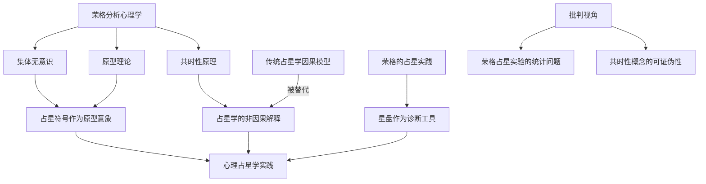

## 一、学科坐标定位

> [!info] 学科交叉位置
> 本书位于==荣格分析心理学==与==传统占星学==的交叉地带，是理解心理占星学思想源头的关键文献。

玛吉·海德是英国占星学研究者，长期关注荣格思想与占星实践之间的理论桥梁。本书的核心议题是：荣格本人究竟如何看待占星学？他的理论工具——特别是==共时性==（Synchronicity）、==原型==（Archetype）和==集体无意识==（Collective Unconscious）——能否为占星学提供一个不依赖因果机制的合理解释框架？

在学科谱系中，本书上承荣格晚年对超心理学现象的探索（尤其是1952年发表的共时性专论），下接[[丽兹·格林]]、[[霍华德·萨司波塔斯]]等人在伦敦心理占星学中心发展出的心理占星学派。海德的独特贡献在于，她没有简单地将荣格理论"嫁接"到占星学上，而是细致追溯了荣格本人对占星学态度的复杂性与矛盾性——荣格既在私人通信和临床实践中使用星盘，又在公开学术场合对占星学保持谨慎距离。

本书适合已经具备基础占星知识和荣格心理学入门知识的读者。它不是一本"如何解读星盘"的技术手册，而是一部思想史与认识论层面的探讨。对于想要理解"占星学为什么可能有效"这一根本问题的读者，本书提供了迄今最系统的荣格视角分析。

## 二、理论框架地图

本书的理论框架可以概括为三层递进结构：

**第一层：历史考古**——海德梳理了荣格与占星学的实际接触史，包括荣格为患者绘制星盘、与占星师的通信、以及他在《论共时性》中那个著名的（也是争议性的）占星统计实验。

**第二层：概念桥接**——书中系统论证了荣格理论中三个核心概念如何与占星学产生关联：==集体无意识==提供了占星符号的心理学根基；==原型==解释了行星符号为何具有跨文化的心理意义；==共时性==则为占星学提供了一种替代因果律的解释模式。

**第三层：批判反思**——海德没有止步于建立联系，而是诚实地审视了这一理论嫁接的局限：共时性概念本身的模糊性、荣格占星实验的方法论缺陷、以及将个人心理原型投射到宇宙尺度上的哲学风险。

## 三、逐章深度拆解

### 第一部分：荣格与占星学的历史关系

> [!note] DIKW四层提炼
> - **Data（数据）**：荣格在大量私人信件中讨论占星学，为患者绘制出生星盘，在红书中记录与占星意象相关的主动想象
> - **Information（信息）**：荣格对占星学的态度是双重的——私下使用、公开谨慎
> - **Knowledge（知识）**：这种双重态度反映了荣格作为科学家与神秘主义探索者之间的身份张力
> - **Wisdom（智慧）**：任何试图在主流学术框架内为边缘知识体系辩护的思想家，都不可避免地面临这种"公开/私下"的分裂

**费曼式解读：** 想象你是一位大学教授，你私下相信某种非主流的治疗方法确实有效，因为你在临床中反复观察到了效果。但你知道，如果公开宣称这一点，你的同事会质疑你的科学素养。你会怎么做？荣格选择的策略是：在实践中使用占星学作为辅助诊断工具，但在理论表述中将其包裹在"共时性"这个更具学术合法性的概念框架里。海德的贡献在于，她把荣格这种"包裹"的过程透明化了。

**反脆弱验证：** 这部分内容的可靠性较高，因为海德引用了大量一手文献（荣格书信集、未公开手稿等）。但需注意，对荣格"真实态度"的解读不可避免地带有诠释性，不同学者可能从同样的文献中得出不同结论。

**类比迁移：** 这种"私下实践、公开谨慎"的模式，类似于许多量子物理学家对"意识与量子测量"问题的态度——在茶余饭后愿意讨论，在正式论文中避而不谈。

### 第二部分：共时性——占星学的理论基石

> [!note] DIKW四层提炼
> - **Data**：荣格1952年发表《论共时性：一个非因果关联原理》，其中包含一个以占星学为对象的统计实验
> - **Information**：共时性指"有意义的巧合"——两个事件之间无因果联系，但存在意义上的对应关系
> - **Knowledge**：共时性为占星学提供了一种解释路径：星体位置与人类事件之间不需要物理因果链，只需要"意义上的共振"
> - **Wisdom**：共时性的深层启示是对西方科学因果一元论的挑战——世界的秩序可能不完全由因果律支配

**费曼式解读：** 因果律说的是"A导致B"。共时性说的是"A和B同时发生，而且它们之间存在一种意义上的呼应，但A并没有导致B"。举个例子：你正在想一个多年未联系的朋友，手机突然响了，正是那个朋友打来的。因果律无法解释这件事（你的想法不可能让对方拿起电话），但共时性说：这不是巧合，而是一种"有意义的对应"，它揭示了心灵与外部世界之间的某种深层联系。荣格认为占星学的运作机制类似于此——行星的位置并没有"导致"你的性格，但行星的排列与你出生那一刻的心灵状态之间存在一种共时性的对应。

**反脆弱验证：** 共时性概念面临一个严重的认识论问题：它很难被证伪。如果一个"有意义的巧合"发生了，它被视为共时性的证据；如果没有发生，可以说"条件不具备"。海德在书中承认了这一困难，这是本书的诚实之处。此外，荣格的占星统计实验在方法论上存在明显缺陷（样本量不足、统计方法不严谨），海德也对此进行了详细讨论。

**类比迁移：** 共时性概念与中国哲学中的==感应论==有相似之处——《易经》的占卜原理同样不依赖因果律，而是基于"天人感应"的宇宙观。事实上，荣格本人就是从为《易经》英译本撰写序言的过程中，进一步发展了共时性理论。

### 第三部分：原型与占星符号

> [!note] DIKW四层提炼
> - **Data**：荣格定义的原型是集体无意识中先天存在的心理结构模式，行星在不同文化中反复被赋予相似的象征意义
> - **Information**：占星符号（如火星对应攻击性、金星对应爱与美）可以被理解为原型的文化投射
> - **Knowledge**：原型理论为占星符号的跨文化一致性提供了心理学解释——这些符号之所以在不同文明中呈现相似含义，是因为它们植根于人类共同的心理结构
> - **Wisdom**：占星符号不是对外在天体力量的描述，而是人类内在心理原型的镜像

**费曼式解读：** 为什么几乎所有文化都把火星与战争和攻击联系在一起？传统解释是"因为火星是红色的，像血"。但荣格的原型理论提供了一个更深的解释：人类心灵中先天存在一个"战士原型"（一种推动攻击、竞争、征服的心理能量模式），这个原型需要找到外在的"钩子"来投射自身，而火星——那颗红色的、运动剧烈的星球——恰好成为了这个原型的理想投射对象。不是火星"决定"了你好斗，而是你心灵中的战士原型通过火星这个符号找到了表达自己的语言。

**反脆弱验证：** 原型理论的解释力很强，但也有其弱点：它倾向于事后解释而非事前预测。无论某个文化把什么含义赋予火星，原型理论都可以在事后找到"对应的原型"来解释。这使得理论的可证伪性较弱。海德在书中对此有所触及，但坦率地说，她在这一部分的批判力度不如讨论共时性时那么充分。

**类比迁移：** 原型与占星符号的关系，类似于[[荣格]]所说的原型与神话的关系。约瑟夫·坎贝尔在《千面英雄》中论证世界各地的神话共享相同的深层结构，其解释机制也是原型理论。占星符号可以被视为一套"活的神话"——它用行星和星座的语言讲述人类心灵的永恒故事。

### 第四部分：荣格的占星实验

> [!note] DIKW四层提炼
> - **Data**：荣格收集了483对已婚夫妇的出生星盘数据，检验占星传统中关于婚姻相位的说法
> - **Information**：初步结果似乎支持占星假设（月亮与月亮的合相在已婚夫妇中出现频率高于偶然水平），但后续批次的数据未能复制
> - **Knowledge**：荣格将实验结果本身解释为共时性的表现——实验者的期望与数据之间产生了共时性关联
> - **Wisdom**：当一个理论将反面证据也纳入自身解释框架时，我们需要警惕它是否已经失去了可证伪性

**费曼式解读：** 这是全书最精彩也最具争议性的部分。荣格做了一个占星学实验，第一批数据看起来支持占星学——他很兴奋。但第二批、第三批数据都没能重复这个结果。大多数科学家会说"实验失败了，占星假设不成立"。但荣格做了一个惊人的转向：他说，第一批数据之所以"成功"，不是因为占星学在统计学上成立，而是因为实验者（荣格本人）对结果的强烈期望与数据产生了共时性关联。换句话说，荣格把实验的失败变成了共时性理论的证据。这在逻辑上是危险的，但在思想史上是迷人的。

**反脆弱验证：** 海德在这部分的分析相当出色。她既没有回避荣格实验的统计缺陷，也没有简单否定荣格的共时性解释。她指出：荣格的实验不能证明占星学在统计学意义上有效，但它确实揭示了一个有趣的认识论问题——观察者的心理状态是否会影响他所"发现"的模式？这个问题在量子力学的观察者效应讨论中同样存在。

**类比迁移：** 这与物理学中的"实验者效应"问题有共鸣。在超心理学研究中，一些实验者反复得到正面结果，而另一些实验者在相同条件下总是得到负面结果，这被称为"实验者效应"。荣格的占星实验可以被视为这一现象的早期案例。

### 第五部分：心理占星学的哲学基础

> [!note] DIKW四层提炼
> - **Data**：海德梳理了从柏拉图的"宇宙灵魂"到新柏拉图主义的"万物感应"，再到荣格"世界灵魂"（Anima Mundi）概念的哲学脉络
> - **Information**：心理占星学的深层预设是某种形式的"万物有灵论"或"宇宙心灵一元论"
> - **Knowledge**：如果接受荣格关于集体无意识超越个体的观点，那么心灵与宇宙之间的对应关系就不再是神秘主义玄想，而是一种关于心灵本质的理论假设
> - **Wisdom**：心理占星学最终挑战的不是天文学，而是现代西方关于"心灵仅存在于个体头脑中"这一基本假设

**费曼式解读：** 现代科学的默认假设是：你的心灵只存在于你的大脑中。你的想法、感受、记忆，都是神经元活动的产物。在这个框架下，行星不可能"影响"你的心灵，因为你的心灵是一个封闭系统。但荣格的集体无意识概念暗示：心灵不完全是个人的、封闭的——有一个更深的心理层面是全人类共享的。如果心灵本身就具有某种"宇宙维度"，那么心灵与宇宙之间的对应关系就不再需要物理因果链来解释。这不是在说"星星控制你"，而是在说"你的心灵与宇宙的结构之间存在某种同构关系"。

**反脆弱验证：** 这一部分进入了形而上学领域，严格来说超出了经验科学的证伪范围。海德对此有自觉，她将其定位为"哲学探讨"而非"科学论证"。读者需要意识到，这里的论述属于思辨哲学而非实证科学。

**类比迁移：** 这种"宇宙与心灵同构"的思想，在东方哲学中有深厚传统。印度教的"梵我一如"（Atman is Brahman）和道家的"天人合一"都表达了类似的直觉。海德的工作可以被视为用西方心理学的语言重新表述了这一古老洞见。

## 四、认知偏差/效应清单

> [!warning] 阅读本书时需警惕的认知偏差

1. **确认偏误（Confirmation Bias）**：读者可能倾向于只注意书中支持占星学有效性的论述，而忽略海德提出的批判性观点。海德本人虽然同情占星学，但她的批判段落同样值得仔细阅读。

2. **巴纳姆效应（Barnum Effect）**：占星描述往往足够模糊，以至于几乎任何人都觉得"说得准"。在阅读书中关于原型与占星符号的对应关系时，需要警惕这种效应的干扰。

3. **权威效应（Authority Bias）**：荣格的名望可能导致读者不加批判地接受他的所有观点。海德在书中明确指出了荣格占星实验的方法论缺陷，这种对"大师"的批判性审视值得赞赏。

4. **叙事偏误（Narrative Bias）**：将荣格的生平事件与其理论发展编织成一个连贯故事的冲动，可能遮蔽历史的偶然性和复杂性。

5. **光环效应（Halo Effect）**：如果读者对荣格心理学整体印象良好，可能会不加审查地接受其在占星领域的应用。

6. **可得性启发（Availability Heuristic）**：书中引用的生动案例可能让读者高估共时性事件在日常生活中的频率。

7. **后见之明偏误（Hindsight Bias）**：占星学的事后解读（"哦，难怪那段时间你经历了变化，当时冥王星正在过境你的上升点"）尤其容易受到这种偏误的影响。

8. **动机性推理（Motivated Reasoning）**：已经认同占星学的读者可能将本书视为"荣格也支持占星学"的证据，而忽略荣格态度的复杂性。

## 五、自我诊断工具

> [!tip] 你对占星学的认知处于哪个层级？

**用以下问题检测你的理解深度：**

- [ ] 你能否区分"占星学有效是因为星体力量影响人类"与"占星学有效是因为共时性原理"这两种完全不同的解释？
- [ ] 你能否向一个完全不了解荣格的朋友解释什么是"原型"，以及它与占星符号的关系？
- [ ] 你能否列举至少两个荣格占星实验的方法论缺陷？
- [ ] 你能否解释为什么共时性理论可能面临"不可证伪"的批评？
- [ ] 你能否区分"集体无意识"作为一种隐喻和作为一种存在论主张的不同含义？

**评分标准：**
- 5个全能回答：你对本书的核心论点有深入理解
- 3-4个：你掌握了主要框架但某些细节需要回顾
- 1-2个：建议重读相关章节
- 0个：建议先补充荣格心理学基础知识，再阅读本书

**深度自检：**
阅读本书后，你是更倾向于"相信"占星学了，还是更能够"批判性地思考"占星学了？如果是前者，你可能只读取了书中的一半信息。海德的真正贡献不是为占星学辩护，而是展示了如何对一个边缘知识体系进行严肃的思想史分析。

## 六、批判性审视

> [!danger] 本书的局限与可商榷之处

**优势：**
- 一手文献功夫扎实，对荣格与占星学关系的历史考证迄今最为详尽
- 对荣格占星实验的批判分析公允且深入
- 没有将荣格理论简单化为占星学的"科学背书"

**局限：**
1. **共时性概念的模糊性未被充分解决。** 海德承认了这个问题，但未能提供比荣格本人更清晰的界定。共时性到底是一个可以操作化的科学概念，还是一个哲学隐喻？本书倾向于后者，但没有明确表态。

2. **对占星学有效性的实证研究述评不够全面。** 除了荣格的实验，还有高奎林（Gauquelin）的"火星效应"等后续研究，海德虽有提及但篇幅有限。

3. **选择偏差的可能。** 海德选取的荣格文本倾向于展示荣格对占星学的正面态度。其他学者（如荣格学派内部的批评者）可能会选取不同的文本来支持相反的叙事。

4. **缺乏与当代认知科学的对话。** 原型理论在当代认知科学和进化心理学中的地位是有争议的，本书没有充分涉及这些当代批评。

5. **"意义"概念的循环论证风险。** 共时性依赖于"有意义的巧合"这一判断，但"什么算有意义"最终取决于解读者的主观判断，这可能导致理论的自我确证。

## 七、行动改变指南

> [!success] 基于本书的实践建议

1. **建立双重视角：** 下次你解读星盘时，尝试同时从两个角度思考——"如果这是因果性的影响，意味着什么？""如果这是共时性的对应，意味着什么？"注意两种视角带来的不同感受和解读。

2. **原型日志实践：** 每天记录你观察到的"原型时刻"——你或他人表现出某个行星原型特质的时刻。一个月后，回顾日志，检验你是否在"发现"原型还是在"投射"原型。

3. **共时性记录：** 连续记录30天你遇到的所有"有意义的巧合"。月底统计：有多少事后仍然觉得有意义？有多少只是普通概率事件？这个练习有助于校准你对共时性的敏感度。

4. **费曼测试练习：** 每读完一章，合上书，用自己的话向想象中的外行人解释这一章的核心论点。如果你无法用简单语言表达，说明你的理解还不够深入。

5. **跨学科阅读：** 将本书与[[生命四元素]]、[[土星：从新观点看老恶魔]]搭配阅读，形成心理占星学的完整知识网络。

## 八、费曼终极检验

> [!abstract] 如果只用三段话向外行解释这本书

**第一段（是什么）：** 荣格是20世纪最重要的心理学家之一，他提出了"集体无意识"和"原型"等概念。他还提出了一个叫"共时性"的理论——有些事情同时发生并且彼此呼应，但它们之间没有因果关系。玛吉·海德这本书探讨的就是：荣格的这些理论，能不能用来解释占星学为什么"看起来有效"？

**第二段（核心论点）：** 海德的回答是"有限度地能"。占星学不需要假设星球"发射"某种力量来影响你——这种物理因果解释在现代科学面前站不住脚。但如果把占星学理解为一种"象征语言"，而行星符号对应的是人类心灵深处的原型模式，那么星盘就不是在描述外在力量对你的控制，而是在用宇宙的语言映射你内心的心理结构。这种映射通过共时性实现，而非通过因果律。

**第三段（为什么重要）：** 这本书重要不是因为它"证明"了占星学，而是因为它展示了一种严肃的思考方式。面对一个在主流科学看来不可信、但在人类实践中存续了几千年的知识体系，我们是否只能在"盲信"和"全盘否定"之间选择？海德通过荣格的理论框架开辟了第三条路：不把占星学当作科学事实，也不把它视为纯粹迷信，而是将其作为一种关于心灵与宇宙关系的象征性探索来认真对待。
