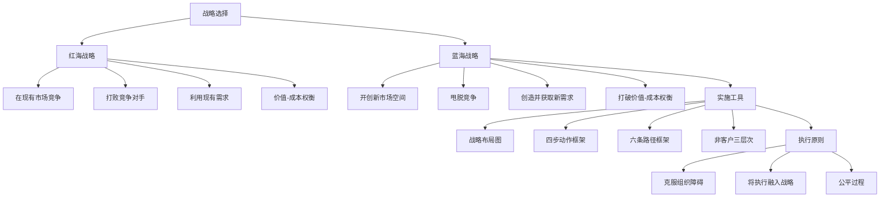
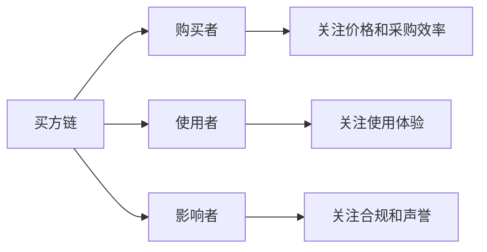
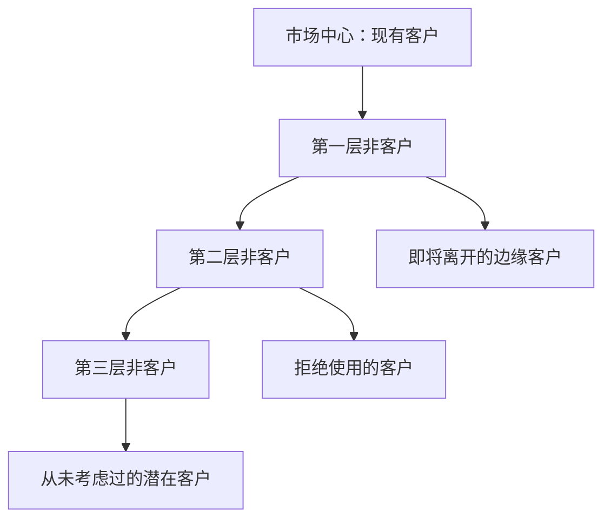
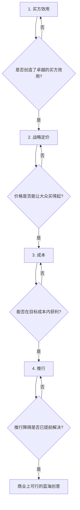
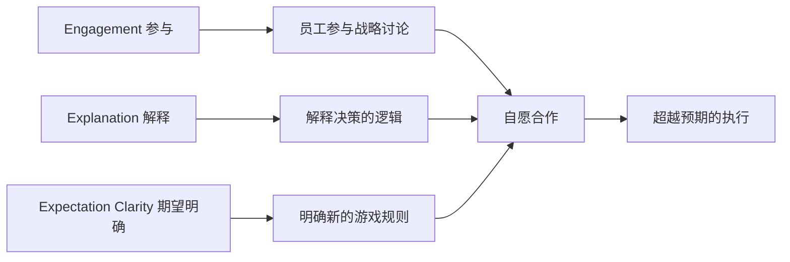
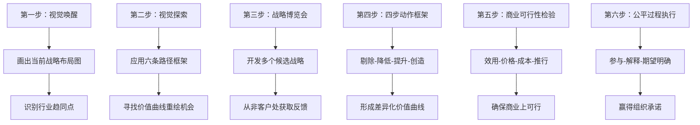
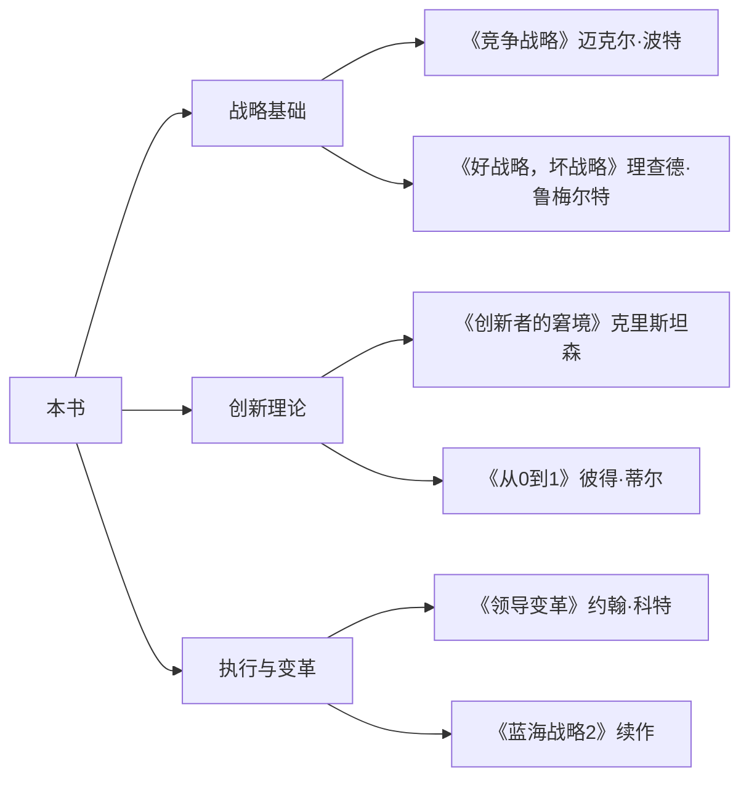

# 《蓝海战略》深度拆解

## 一、元信息/坐标定位

### 作者背景
W·钱·金（W. Chan Kim）和勒妮·莫博涅（Renée Mauborgne）是欧洲工商管理学院（INSEAD）战略学教授，也是INSEAD蓝海战略研究所的联合创始人。两人合作研究战略与创新超过30年，是全球最具影响力的管理思想家之一。钱·金出生于韩国，莫博涅来自美国，他们的跨文化合作为蓝海战略带来了独特的全球视角。

### 写作背景与问题意识
本书初版于2005年，正值全球化竞争加剧、行业边界模糊、产品同质化严重的时期。作者的核心问题意识是：==当所有企业都在同一个市场空间中你死我活地竞争时，利润空间越来越薄，如何才能跳出这种"红海"困境？==

### 学科定位
本书是战略管理领域的革命性著作，它挑战了波特竞争战略的基本假设（竞争是战略的核心），提出了一种全新的战略范式——通过价值创新开创无人竞争的新市场空间。它是21世纪最有影响力的商业书籍之一。

### 核心贡献
- 提出"蓝海"与"红海"的经典隐喻，重构了战略思维框架
- 建立了系统的蓝海战略分析工具（战略布局图、四步动作框架、六条路径等）
- 用150年跨越30个行业的案例研究，证明了蓝海战略的普遍适用性
- 将"价值创新"确立为战略的核心，而非"竞争优势"

> [!abstract] 一句话定位
> 这是一本教你如何跳出血腥竞争、开创无人之境的战略创新圣经。

## 二、全书逻辑地图

全书遵循"概念→工具→执行"的逻辑主线。首先，作者通过红海与蓝海的对比，建立了一种全新的战略思维框架。其次，作者提供了一整套实用工具，帮助企业系统性地发现和开创蓝海。最后，作者讨论了如何克服组织障碍、确保蓝海战略的成功执行。整体框架既有理论高度，又有操作性，是战略管理领域少见的"知行合一"之作。

## 三、核心主题/逐章深度拆解

### 第一部分：蓝海战略的概念框架

#### 第1章：开创蓝海

> [!tip] 核心命题
> 商业世界由两种截然不同的空间构成——红海和蓝海。红海是所有现存行业，蓝海是所有尚未开创的行业。在红海中，企业为争夺有限的市场份额而血腥厮杀；在蓝海中，企业通过创造新需求而使竞争变得无关紧要。

作者开篇就用太阳马戏团的案例说明蓝海战略的威力。当传统马戏团行业陷入价格战和明星战时，太阳马戏团通过重新定义马戏的价值主张——去掉动物表演和明星演员，融入戏剧和艺术元素——开创了一个全新的娱乐品类，其利润率是传统马戏团的数十倍。

**红海与蓝海的对比：**

| 维度 | 红海战略 | 蓝海战略 |
|------|----------|----------|
| 市场空间 | 现有市场 | 新创市场 |
| 竞争焦点 | 打败对手 | 使竞争无关 |
| 需求来源 | 现有客户 | 非客户 |
| 价值主张 | 价值-成本权衡 | 打破权衡 |
| 战略逻辑 | 选择差异化或成本领先 | 同时追求差异化和低成本 |

==蓝海战略的核心洞见是：最佳的竞争方式是不竞争。==与其在现有市场与对手搏杀，不如开创一片没有对手的新天地。

#### 第2章：分析工具与框架

这一章介绍了蓝海战略的核心分析工具——战略布局图（Strategy Canvas）。

**战略布局图的构成：**
- 横轴：行业竞争的关键要素
- 纵轴：各要素的投入/表现水平
- 曲线：企业的价值曲线

> [!note] 战略布局图的价值
> 战略布局图让你一眼看出：你的企业与竞争对手在哪些要素上趋同（红海），在哪些要素上有差异化空间（潜在蓝海）。

**传统红酒行业的战略布局图示例：**

传统高端酒庄在以下要素上大量投入：
- 葡萄酒术语和奖项宣传
- 复杂的口感层次
- 酒庄历史和传承
- 橡木桶陈酿
- 高端定价

这导致所有高端酒庄的价值曲线高度趋同——它们在相同的要素上竞争，用相似的方式取悦相似的客户。

**黄尾袋鼠（Yellow Tail）的蓝海突破：**

黄尾袋鼠通过重新绘制价值曲线开创了蓝海：
- ==剔除==：葡萄酒术语、橡木桶陈酿、复杂口感
- ==降低==：酒庄历史强调、品种繁多
- ==提升==：易饮性、趣味性
- ==创造==：简单易选、品牌个性

结果是一条与整个行业截然不同的价值曲线，吸引了大量原本不喝葡萄酒的消费者。

### 第二部分：制定蓝海战略

#### 第3章：重建市场边界

这一章是全书的方法论核心，提出了发现蓝海的"六条路径框架"。

**路径一：跨越他择行业**

> [!tip] 核心洞见
> 企业不仅与同行业对手竞争，还与提供替代功能的其他行业竞争。跨越行业边界思考，往往能发现蓝海机会。

案例：NetJets开创了"部分飞机所有权"市场，横跨在商业航空与私人飞机两个行业之间。它提供私人飞机的便利性，却只需支付部分所有权的成本。

**路径二：跨越战略集团**

在同一行业内，往往存在多个战略集团（如汽车行业的豪华车、经济车、家用车）。跨越战略集团的边界，可以发现新机会。

案例：Curves健身房跨越了传统健身房和家庭健身之间的边界，创造了"15分钟快速健身"的新品类。

**路径三：跨越买方链**

大多数企业只关注买方链中的一环。改变关注对象，可能发现全新的价值主张。

案例：诺和诺德（Novo Nordisk）从关注医生转向关注糖尿病患者本人，开发了便携式胰岛素注射笔，开创了患者友好型糖尿病护理的蓝海。

**路径四：跨越互补性产品与服务**

产品很少孤立使用。考虑产品使用前、中、后的完整体验，可能发现价值创新机会。

案例：北美运输集团（NABI）不仅卖公交车，还考虑公交车运营的全生命周期成本。通过使用玻璃纤维材料，大幅降低维护成本，虽然售价更高，但总拥有成本更低。

**路径五：跨越功能与情感诉求**

有些行业主打功能诉求（理性），有些主打情感诉求（感性）。切换诉求类型可能开创蓝海。

案例：Swatch将手表从纯功能产品转变为时尚配饰，开创了平价时尚表的蓝海。

**路径六：跨越时间**

> [!warning] 关键洞见
> 不是预测未来，而是洞察正在形成中的趋势，并思考：如果这个趋势走向极端，行业会变成什么样？

案例：苹果洞察到音乐数字化和宽带普及的趋势，在盗版猖獗时推出iTunes，开创了合法数字音乐的蓝海。

#### 第4章：关注全景而非数字

这一章讨论战略规划的方法论，强调应该先画战略布局图，再做详细分析。

**传统战略规划的问题：**
- 过度依赖数字和分析
- 陷入现有行业边界的思维定式
- 产出厚重的文档却缺乏战略洞见

**蓝海战略规划的四步骤：**

1. ==视觉唤醒==：画出当前战略布局图，与竞争对手比较
2. ==视觉探索==：通过六条路径框架，寻找重绘价值曲线的可能
3. ==视觉战略博览会==：向非客户和客户展示多个候选战略，获取反馈
4. ==视觉沟通==：用一页纸的战略布局图取代繁琐的战略文档

> [!tip] 一页纸战略的威力
> 如果你的战略不能用一张战略布局图清晰表达，说明你还没有真正理解自己的战略。

#### 第5章：超越现有需求

传统战略聚焦于现有客户，蓝海战略则关注"非客户"——那些尚未使用本行业产品的人群。

**非客户的三个层次：**

| 层次 | 描述 | 特征 |
|------|------|------|
| 第一层 | 边缘客户 | 勉强使用，随时可能离开 |
| 第二层 | 拒绝客户 | 知道产品但选择不用 |
| 第三层 | 未开发客户 | 从未考虑过使用 |

> [!note] 最大的蓝海往往在第三层
> 那些"从未考虑过"的人群，往往代表着最大的未被满足的需求。但他们也是最难触达和理解的。

案例：JCDecaux发现从未使用户外广告的零售商（第三层非客户）需要的是市中心的曝光，而非高速公路广告牌。于是它在市中心建立公共设施（公交站亭、自行车租赁点），换取免费广告位，开创了"街道家具广告"的蓝海。

#### 第6章：遵循合理的战略顺序

有了价值创新的想法后，需要用正确的顺序来检验其商业可行性。

**蓝海战略顺序框架：**

**买方效用地图：**

| 购买阶段 | 生产率 | 简便性 | 便利性 | 风险 | 乐趣/形象 | 环保 |
|----------|--------|--------|--------|------|-----------|------|
| 购买 | | | | | | |
| 配送 | | | | | | |
| 使用 | | | | | | |
| 补充 | | | | | | |
| 维护 | | | | | | |
| 处置 | | | | | | |

==在这36个格子中，找到尚未被开发的效用空间，就是价值创新的起点。==

**战略定价的艺术：**

> [!warning] 定价原则
> 蓝海战略的定价逻辑是"由外而内"——先确定能让大众接受的价格，再倒推成本结构。而非传统的"成本加成定价"。

三步定价法：
1. 识别主流价格带（不同形式的替代品）
2. 在主流价格带内选择一个位置
3. 根据模仿难度决定高端还是低端定价

### 第三部分：执行蓝海战略

#### 第7章：克服关键组织障碍

即使有了出色的蓝海战略，执行中也会遇到四大组织障碍：

**四大障碍：**

1. ==认知障碍==：员工和管理者不认为需要改变
2. ==资源障碍==：认为没有足够的资源执行新战略
3. ==动力障碍==：员工缺乏改变的积极性
4. ==政治障碍==：来自既得利益者的反对

**引爆点领导法：**

传统变革管理要求"大规模动员全员"，但这耗时耗力且效果有限。蓝海战略主张"引爆点领导法"——找到最关键的少数人、最关键的行动、最关键的时刻，集中资源实现突破。

> [!tip] 引爆点领导的核心
> 不是均匀用力，而是找到杠杆点。用20%的资源影响80%的结果。

案例：纽约市警察局长布拉顿用引爆点领导法大幅降低了犯罪率：
- 认知障碍：让警官亲自乘坐地铁体验犯罪现实
- 资源障碍：重新调配现有警力，而非申请更多预算
- 动力障碍：公开表扬改革先锋
- 政治障碍：与关键支持者结盟

#### 第8章：将执行融入战略

蓝海战略强调"公平过程"（Fair Process）——在战略制定过程中让员工参与，以换取他们在执行中的承诺。

**公平过程的三个E原则：**

> [!note] 公平过程的心理学基础
> 人们对结果的接受程度，不仅取决于结果本身，还取决于达成结果的过程是否公平。即使最终决定对某些人不利，如果过程公平，他们也更可能接受和支持。

**公平过程与传统管理的对比：**

| 维度 | 传统管理 | 公平过程 |
|------|----------|----------|
| 决策方式 | 高层决定，向下传达 | 参与讨论，充分解释 |
| 员工角色 | 执行者 | 参与者 |
| 心理契约 | 交换（工资换劳动） | 承诺（认同愿景） |
| 执行效果 | 被动服从 | 主动投入 |

### 第四部分：蓝海战略的可持续性

#### 第9章：蓝海战略的动态演进

蓝海终究会变成红海。竞争对手会模仿，客户需求会变化。企业必须持续创新，开创新的蓝海。

**蓝海战略的生命周期：**

1. ==开创期==：无竞争，高利润
2. ==模仿期==：竞争者进入，利润下降
3. ==红海期==：充分竞争，利润摊薄
4. ==更新期==：开创新蓝海，重启循环

> [!warning] 护城河思维的局限
> 蓝海战略与护城河思维不同。护城河强调"防止竞争"，蓝海战略强调"持续创新"。长期来看，没有任何护城河是永久的，唯一的可持续竞争优势是创新能力本身。

**延长蓝海寿命的策略：**

1. 持续监测价值曲线，发现被追赶的迹象
2. 在现有蓝海成熟前，启动下一个价值创新
3. 建立"价值创新"的组织文化和流程
4. 保持对非客户的关注，而非只服务现有客户

## 四、核心框架提炼

### 蓝海战略实施框架

### 四步动作框架（ERRC）

| 动作 | 问题 | 目的 |
|------|------|------|
| ==剔除（Eliminate）== | 哪些行业习以为常的要素应该剔除？ | 削减成本，去除无价值的复杂性 |
| ==降低（Reduce）== | 哪些要素应该降低到行业标准以下？ | 进一步削减成本 |
| ==提升（Raise）== | 哪些要素应该提升到行业标准以上？ | 创造差异化价值 |
| ==创造（Create）== | 哪些行业从未提供的要素应该创造？ | 开辟新的价值空间 |

### 核心公式

==价值创新 = 差异化 + 低成本==

传统战略认为差异化和低成本是非此即彼的选择。蓝海战略的核心突破是：通过"剔除-降低-提升-创造"的组合，==同时==实现差异化和低成本。

## 五、批判性思考

### 理论贡献

1. **重构战略思维范式**：从"如何打败对手"转向"如何使竞争无关"
2. **提供系统的方法论**：六条路径、四步动作框架、战略布局图等工具具有很强的操作性
3. **实证基础扎实**：基于150年跨越30个行业的案例研究，而非纯理论推演
4. **整合价值与创新**：将"为客户创造价值"置于战略的核心，而非"打败竞争对手"

### 理论局限

> [!warning] 需要注意的局限性

1. **生存者偏差**：书中案例都是成功的蓝海战略，但有多少失败的"蓝海尝试"被忽略了？

2. **可复制性存疑**：成功开创蓝海需要洞察力、时机和运气，这些很难系统传授

3. **忽视竞争现实**：对于大多数企业，不可能完全"甩脱竞争"。在蓝海变红之前，如何应对竞争仍是关键问题

4. **执行难度低估**：书中对组织变革的讨论相对薄弱。实际上，多数蓝海战略失败于执行而非概念

5. **行业适用性差异**：某些行业（如公用事业、基础材料）开创蓝海的空间极其有限

### 与其他理论的对话

**与波特竞争战略的关系：**

蓝海战略常被视为对波特的"反叛"，但更准确的理解是"互补"：
- 波特回答：在现有市场如何竞争
- 蓝海战略回答：如何开创新市场

成熟的战略思考应该两者兼顾：在红海中有竞争策略，同时探索蓝海机会。

**与颠覆式创新的关系：**

克里斯坦森的颠覆式创新理论与蓝海战略有相似之处（都关注创造新市场），但侧重点不同：
- 颠覆式创新强调从低端或边缘市场切入
- 蓝海战略强调通过价值创新吸引大众市场

### 适用边界

蓝海战略最适用于：
- 行业成熟、竞争激烈、利润率下降的情况
- 拥有创新能力和冒险意愿的企业
- 愿意重新思考行业边界的领导团队

不太适用于：
- 高度监管的行业
- 技术变革缓慢的行业
- 资源极其有限的小企业

## 六、行动清单

### 战略诊断清单

- [ ] **画出战略布局图**：你的价值曲线与竞争对手是否高度重合？
- [ ] **识别非客户**：你是否清楚三个层次非客户的需求？
- [ ] **检验价值主张**：你是在与对手竞争，还是在创造新价值？
- [ ] **评估蓝海程度**：用六条路径框架检查是否存在蓝海机会

### 蓝海探索清单

- [ ] **路径一**：是否可以跨越他择行业？
- [ ] **路径二**：是否可以跨越战略集团？
- [ ] **路径三**：是否可以关注买方链的其他环节？
- [ ] **路径四**：是否可以整合互补性产品/服务？
- [ ] **路径五**：是否可以切换功能/情感诉求？
- [ ] **路径六**：是否可以洞察正在形成的趋势？

### 执行准备清单

- [ ] **效用检验**：新战略是否创造了卓越的买方效用？
- [ ] **价格检验**：定价是否能让大众买得起？
- [ ] **成本检验**：能否在目标成本内获利？
- [ ] **推行检验**：主要推行障碍是否已识别和解决？
- [ ] **公平过程**：是否让关键员工参与了战略制定？

## 七、延伸阅读路线图

### 推荐阅读顺序

1. **理论对照**：[[《竞争战略》]] - 理解蓝海战略的"对手"
2. **创新深化**：[[《创新者的窘境》]] - 从另一个角度理解市场创造
3. **执行补充**：[[《领导变革》]] - 弥补蓝海战略在变革管理上的不足
4. **思维升级**：[[《从0到1》]] - 彼得·蒂尔对"竞争是失败者的游戏"的深刻阐述

## 八、费曼终极检验

> 如果要向一个完全不懂商业的朋友解释这本书，我会这样说：

想象商业世界是一片大海。大多数企业都挤在一小块水域里捕鱼——这里鱼很多，但渔船更多。大家你争我抢，海水都被鲜血染红了，所以叫"红海"。

==蓝海战略告诉你：别在红海里挤了，去找一片没人去过的蓝色海域。==

怎么找呢？书里给了很多方法。最核心的一条是：不要只想着"怎么比对手做得更好"，而要想"怎么做出不一样的东西，让那些原本不买这类产品的人也想买"。

举个例子：太阳马戏团。传统马戏团都在比谁的动物多、谁的明星演员厉害。太阳马戏团干脆不要动物、不要明星，把马戏变成了一场艺术秀。结果呢？那些本来不看马戏的成年人开始买票了，而且票价比传统马戏贵好几倍。

这本书的核心观点是：==最好的竞争是不竞争。==与其在现有市场里打价格战、打功能战，不如开辟一个新天地，让竞争变得毫无意义。

当然，找到蓝海只是第一步。书里还讲了怎么检验这个想法是否可行，怎么说服公司里的人支持你，怎么执行新战略。但最重要的还是那个思维转变：从"打败对手"到"创造价值"。
