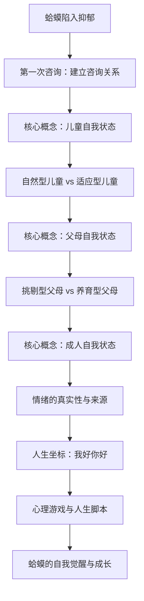
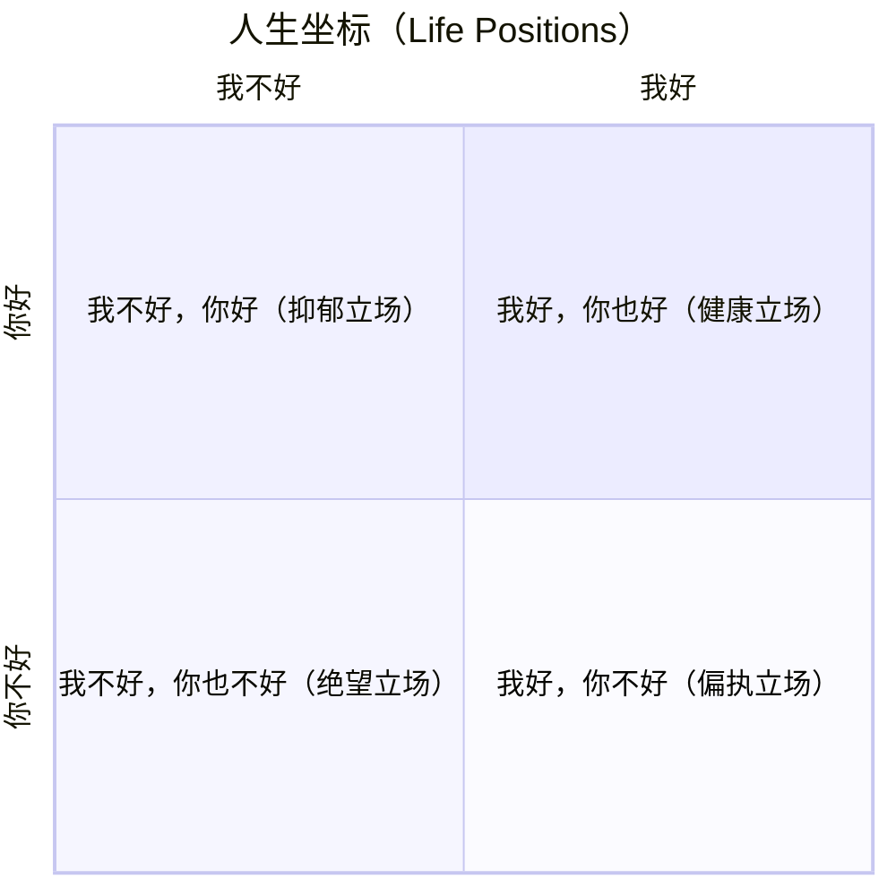

## 一、学科坐标定位

> [!abstract] 速览
> 《蛤蟆先生去看心理医生》（*Counselling for Toads: A Psychological Adventure*）是英国心理学家罗伯特·戴博德（Robert de Board）于1Mo997年出版的心理咨询入门读物。戴博德借用肯尼斯·格雷厄姆经典童话《柳林风声》中的角色蛤蟆（Toad），以寓言故事的形式，完整呈现了一个人从==抑郁到康复==的心理咨询全过程。

这本书的学科坐标非常明确：它属于**心理咨询/心理治疗**领域，具体来说是[[TA沟通分析|沟通分析]]（Transactional Analysis，简称TA）学派的科普读本。沟通分析由美国精神科医生艾瑞克·伯恩（Eric Berne）在20世纪50年代创立，核心理论包括**自我状态模型**（父母、成人、儿童三种状态）、**人生脚本**理论和**心理游戏**理论。戴博德本人在塔维斯托克诊所（Tavistock Clinic）接受过专业训练，同时也是一位管理学教授，这使他兼具临床与通俗写作的双重能力。

这本书在心理学普及领域的地位相当独特：它既不是学术著作，也不是纯粹的自助书，而是通过故事化的方式，让你"旁观"了十次完整的心理咨询。你可以把它理解为一部**心理咨询的沉浸式教学剧**。它在中文世界引进后迅速成为畅销书，很大程度上是因为蛤蟆的困境——讨好型人格、压抑情绪、童年创伤——精准击中了当代读者的心理痛点。

> [!warning] 阅读提示
> 本书是TA沟通分析理论的入门科普，并非该理论的系统阐述。书中呈现的是简化后的TA模型，实际的TA理论体系远比书中所展现的复杂。此外，TA只是众多心理治疗流派之一，书中的观点不代表心理学的全部共识。

---

## 二、理论框架地图

> [!note] 全书逻辑结构
> 全书以蛤蟆的十次心理咨询为主线，理论逐步展开：

全书的逻辑线是一条清晰的治疗进程：**呈现症状 -> 探索童年 -> 认识自我状态 -> 理解情绪来源 -> 建立新的人生坐标 -> 获得改变的勇气**。戴博德将TA理论中最核心的几个概念——自我状态模型、人生坐标、心理游戏、人生脚本——嵌入到蛤蟆的咨询故事中，让理论不再是干燥的定义，而是活生生的体验。

这本书的独特之处在于，它不仅展示了"心理咨询在谈什么"，还展示了"心理咨询是怎么起作用的"——咨询师苍鹭（Heron）不是在给蛤蟆灌输道理，而是通过提问、倾听和引导，让蛤蟆自己抵达领悟。这本身就是心理咨询最核心的工作方式。

---

## 三、逐章深度拆解

### 第一阶段：蛤蟆的崩溃与咨询的开始（第1-3章）

**DIKW四层提炼**

- **Data**：蛤蟆陷入严重抑郁，不再出门，不再穿那件标志性的黄绿色运动衫。朋友们——鼹鼠、河鼠和獾——前来探望，发现他状态极差，决定帮他寻求专业帮助。
- **Information**：蛤蟆的抑郁不是突然发生的，而是长期积累的情绪问题的爆发。他一直用浮夸的行为掩盖内心的空虚和低价值感。
- **Knowledge**：书中呈现了一个关键的咨询原则——==来访者必须是自愿的==。苍鹭在第一次见面时明确告诉蛤蟆：咨询只有在你自己想要改变的时候才有效。獾代替蛤蟆做决定、替他安排咨询的行为，恰恰是蛤蟆人生问题的一个缩影——他总是让别人替自己做主。
- **Wisdom**：==没有人能替你成长==。心理咨询不是被动接受治疗，而是主动参与自我探索。改变的责任始终在你自己手中。

**费曼式解读**：想象你的朋友觉得你应该学游泳，于是把你扛到泳池边扔了下去。你觉得你能学会吗？大概率不行——因为==学习必须出于内在动机==。苍鹭一开始就问蛤蟆"你是为自己来的，还是因为别人让你来的"，这不是在摆架子，而是在检验治疗能否生效的先决条件。如果蛤蟆只是被獾"押送"来的，那咨询就变成了另一次"别人替你做决定"的重复，治疗还没开始就已经失败了。

> [!tip] 关键洞见
> 獾对蛤蟆的态度——居高临下、指手画脚、"都是为你好"——恰恰代表了一种==挑剔型父母状态==。这在后面的章节中会被正式讨论。

**反脆弱验证**：关于"来访者必须自愿"这一原则，现代心理咨询领域基本达成共识。但也存在一些特殊情境，如法院强制要求的心理咨询（针对家暴施加者等），在这些情境中，非自愿的来访者也可能在过程中逐渐转变为自愿参与者。因此，"自愿性"与其说是一个非此即彼的开关，不如说是一个可以在咨询过程中被逐步建立的条件。

---

### 第二阶段：儿童自我状态的探索（第4-6章）

**DIKW四层提炼**

- **Data**：苍鹭引导蛤蟆回顾童年。蛤蟆描述了一个情感冷漠的父亲和一个温顺但无法保护他的母亲。父亲严厉、控制欲强，从未对蛤蟆表达过认可或温暖。蛤蟆从小学会了两种应对策略：==讨好==和==叛逆==。
- **Information**：苍鹭引入了TA的核心概念——**儿童自我状态**（Child Ego State）。每个人内心都住着一个"内在小孩"，它保存着你童年时期的情感模式和行为反应。
- **Knowledge**：儿童自我状态分为两种：
  - **自然型儿童**（Natural Child）：自发的、本能的情感表达——好奇、快乐、愤怒、恐惧，不经过任何过滤。
  - **适应型儿童**（Adapted Child）：为了应对养育环境而发展出的行为模式——顺从、讨好、退缩、或者反向的叛逆。这些模式在童年时帮助你生存，但在成年后可能变成束缚。
- **Wisdom**：==你今天的情绪反应模式，很可能是童年时代的"生存策略"在自动运行==。蛤蟆的讨好行为不是因为他天生"好脾气"，而是因为他小时候发现讨好是避免父亲批评的唯一方式。

**费曼式解读**：想象你小时候家里有一只脾气暴躁的大狗。你发现只要你蹲下来、说话声音小小的、不做任何突然的动作，大狗就不会对你吼。于是"蹲下来、声音小小的"变成了你的默认行为。问题是：你长大后换了一个环境，身边根本没有大狗了，但你还是习惯性地蹲着说话。==你以为这是你的"性格"，其实这是你童年的"防御程序"还在自动运行==。蛤蟆的讨好、蛤蟆的故作欢乐，都是这种童年防御程序的成年版本。

> [!example] 书中案例
> 蛤蟆在描述童年时提到，他被送到寄宿学校，感到极度孤独和被抛弃。他学会了用搞笑和夸张的行为来赢得同学的注意——这是"适应型儿童"应对孤独的策略。成年后，蛤蟆继续用浮夸的冒险和挥霍来吸引关注，本质上是同一种模式的延续。

**类比迁移**：适应型儿童的概念可以迁移到职场中理解。那个开会时从不反驳领导的同事，可能不是因为他真的同意一切，而是因为他内心的"适应型儿童"在自动运行——他童年学会了"顺从权威才能安全"。那个总在朋友圈里晒加班的人，可能不是真的热爱工作，而是他内心的"适应型儿童"还在用"表现好"来换取被认可的感觉。

---

### 第三阶段：父母自我状态的认识（第7-8章）

**DIKW四层提炼**

- **Data**：苍鹭引入第二个核心概念——**父母自我状态**（Parent Ego State）。蛤蟆意识到，獾对他的态度——教训、批评、"我都是为你好"——让他感到极度不舒服，但他又无法反抗。
- **Information**：父母自我状态是你内化的养育者的声音和态度。它同样分为两种：
  - **挑剔型父母**（Critical Parent）：批评、控制、设立规则、审判。其核心信息是"你不够好"。
  - **养育型父母**（Nurturing Parent）：关怀、保护、支持。其核心信息是"我来照顾你"。
- **Knowledge**：关键洞见在于——==你不仅从外部接收父母状态的对待，你也会内化它，变成自己对待自己的方式==。蛤蟆不仅在外部遭受獾的批评，他内心也有一个"内在的批评者"在不断否定自己。
- **Wisdom**：==你对自己最严厉的审判，往往来自你内化的父母的声音==。那些"我不够好""我总是搞砸""我不配"的想法，不是客观事实，而是你童年时从养育者那里学来的剧本在自动播放。

**费曼式解读**：想象你的大脑里有一台录音机，从小就在录制父母对你说的话。"你怎么这么笨""你看看别人家的孩子""你能不能安静点"——这些话录进去之后，即使你长大了、父母不在身边了，这台录音机还在反复播放。==你以为是"你自己"在批评自己，其实是那台老录音机还在转==。苍鹭帮蛤蟆做的事情之一，就是让他意识到这台录音机的存在——你可以选择按下暂停键。

> [!important] 獾与蛤蟆的互动模式
> 书中的獾是"挑剔型父母状态"的典型代表。他对蛤蟆的态度看似是"关心"，实则充满了控制和评判。而蛤蟆面对獾时自动切换到"适应型儿童状态"——顺从、沉默、内心愤怒但不敢表达。这组互动完美展示了TA理论中的==互补沟通==：一方进入父母状态，另一方就自动进入儿童状态，形成锁死的模式。

**反脆弱验证**：TA的"自我状态"概念在学术心理学中的地位存在争议。主流认知心理学和神经科学并未采用"父母-成人-儿童"的三分模型。但这一模型的实用价值在于它提供了一套直觉友好的自我观察框架——即使你不接受它作为严格的科学模型，它作为一种"自我觉察工具"仍然非常有效。

---

### 第四阶段：成人自我状态与情绪地图（第9-11章）

**DIKW四层提炼**

- **Data**：苍鹭介绍了第三种自我状态——**成人自我状态**（Adult Ego State），并绘制了一张"情绪地图"帮助蛤蟆理解自己的情感模式。
- **Information**：成人自我状态是理性的、基于现实的、不被过去的情感模式绑架的状态。它不是"没有情感"，而是==能够在感受情感的同时，理性地审视这些情感==。
- **Knowledge**：苍鹭帮助蛤蟆区分了"基本情感"和"扭曲情感"（racket feelings）。基本情感——快乐、愤怒、悲伤、恐惧——是自然的、健康的情绪反应。扭曲情感是你用来替代真实情感的"替身"。比如，蛤蟆在愤怒的时候不敢表达愤怒（因为童年经验告诉他"愤怒是危险的"），于是他用==内疚==或==自我贬低==来替代愤怒——这就是扭曲情感。
- **Wisdom**：==你感受到的情绪未必是你真正的情绪==。如果你发现自己总是感到内疚、总是在道歉、总是觉得"都是我的错"，那很可能不是因为你真的做错了什么，而是你在用内疚来替代另一种你不敢面对的情绪——比如愤怒。

**费曼式解读**：想象你身体不舒服去看医生，你说"我头疼"。但医生检查后发现你头疼其实是因为肩膀肌肉严重紧张——头疼只是"转移性疼痛"。情绪也一样。你以为你"内疚"，但内疚可能只是"转移性情绪"——你真正的情绪可能是愤怒（对不公平的待遇），但你从小学会了"不可以生气"，于是愤怒被自动翻译成了内疚。苍鹭帮蛤蟆做的，就是帮他找到==情绪的原发病灶==，而不是只治疗转移性症状。

> [!tip] 成人自我状态的本质
> 成人自我状态不是"没有感情的机器人"。它的核心能力是**元认知**——你能在体验情绪的同时，退后一步观察这个情绪："我现在在生气，但我为什么在生气？这个愤怒是针对当下的情境，还是我童年模式的自动反应？"这种"体验+观察"的双重能力，就是成人自我状态的精髓。

---

### 第五阶段：人生坐标——我好你好（第12-13章）

**DIKW四层提炼**

- **Data**：苍鹭向蛤蟆介绍了TA理论中的"人生坐标"（Life Positions）模型——一个二维矩阵，横轴是"你对自己的看法"（我好/我不好），纵轴是"你对他人的看法"（你好/你不好）。
- **Information**：由此产生四种基本人生立场：
  1. ==我好，你也好==（健康的立场）
  2. **我不好，你好**（抑郁的立场——蛤蟆的默认状态）
  3. **我好，你不好**（偏执的立场——獾的典型模式）
  4. **我不好，你也不好**（绝望的立场）
- **Knowledge**：这些立场不是固定不变的，但每个人都有一个"默认立场"，是在童年早期形成的。蛤蟆的默认立场是"我不好，你好"——他总觉得自己不够好，别人比自己强，自己配不上好的对待。
- **Wisdom**：==你的人生坐标决定了你解读一切经历的方式==。如果你的默认立场是"我不好，你好"，那么别人的一个皱眉你会解读为"他讨厌我"，一次工作失误你会解读为"我果然是个废物"。你不是在客观感知现实，而是==在用你的人生坐标过滤现实==。

**费曼式解读**：想象你戴着一副有色眼镜。如果镜片是灰色的（"我不好，你好"），你看到的整个世界都是灰蒙蒙的——不是因为世界真的是灰色的，而是因为你的镜片。蛤蟆一直觉得"我做什么都不行"，不是因为他真的什么都不行（他其实有蛤蟆庄园、有朋友、有资源），而是因为他的"灰色镜片"把所有的正面信息都过滤掉了，只留下负面的证据来确认自己的信念。苍鹭帮蛤蟆做的，就是让他==意识到自己戴着有色眼镜==，进而有可能选择摘掉它。

---

### 第六阶段：心理游戏与人生脚本（第14-15章）

**DIKW四层提炼**

- **Data**：苍鹭向蛤蟆解释了"心理游戏"（Psychological Games）和"人生脚本"（Life Script）的概念。蛤蟆意识到，自己一生中反复上演同样的模式：先是兴高采烈地投入某件事（买车、冒险），然后搞砸，然后被人批评和嘲笑，然后陷入自我否定。
- **Information**：心理游戏是一种==无意识的、重复性的人际互动模式==，表面上看有一个社交层面的理由，但底层隐藏着另一种心理需求。蛤蟆的"游戏"可以概括为：先做出冲动行为（自然型儿童的释放），然后被惩罚（激活他人的挑剔型父母），然后退回到"我不好"的位置（确认他的人生坐标）。
- **Knowledge**：人生脚本是你在童年早期"写下"的关于"我的人生会怎么样"的剧本。蛤蟆的脚本可能是："我是一个注定会失败的人，我不配被认真对待。"这个脚本在他每一次冲动-失败-被批评的循环中得到强化。
- **Wisdom**：==你可能正在不自觉地重复一个自我实现的预言==。如果你的脚本是"我不配被爱"，你会无意识地做出破坏亲密关系的行为，然后当关系真的破裂时，你会对自己说"看吧，我就知道我不配"。你以为命运在捉弄你，其实是你的脚本在==导演==你的命运。

**费曼式解读**：想象你是一部电影的主角，但你不知道这部电影的剧本是你5岁时自己写的。那时候你太小了，对世界的理解非常有限，但你根据当时的有限经验写下了"我的人生故事大纲"。问题是——==你现在30岁了，还在按照5岁时写的剧本演出==。这就是人生脚本的力量：它写得太早了，早到你根本记不得自己写过它，所以你以为"事情本来就是这样"。苍鹭帮蛤蟆做的，就是把那个旧剧本从潜意识里翻出来，让蛤蟆看到它，然后问他："你现在还要按这个剧本演下去吗？"

---

### 第七阶段：改变与告别（第16章及尾声）

**DIKW四层提炼**

- **Data**：蛤蟆在最后几次咨询中展现了显著的变化。他开始对獾说"不"，开始表达真实的愤怒（而不是用内疚和自我贬低来替代），开始做出自己的决定而不是等别人替他决定。
- **Information**：蛤蟆最终决定卖掉蛤蟆庄园，彻底改变自己的生活方式。这个决定的意义不在于"卖房子"本身，而在于==这是他第一次真正从"成人自我状态"出发做出的人生决策==——不是为了讨好谁，不是为了叛逆谁，而是基于对自己真实需求的理性评估。
- **Knowledge**：苍鹭在最后阶段强调了一个重要的心理咨询原则——==改变不是一蹴而就的顿悟，而是逐步积累的觉察==。蛤蟆不是在某一次咨询中突然"想通了"，而是在十次咨询中逐渐建立了观察自己、理解自己、选择回应方式的能力。
- **Wisdom**：==真正的心理成长不是变成一个"没有问题"的人，而是变成一个能够觉察自己问题、并主动选择如何回应的人==。蛤蟆的"内在小孩"没有消失，他的"内在批评者"也没有被消灭——但他现在有了一个强大的"成人自我"来主持大局。

> [!quote] 核心启示
> 苍鹭帮助蛤蟆达到的终点，不是"永远快乐"，而是==情感的真实性和选择的自主性==。你可以悲伤，但你知道你为什么悲伤；你可以愤怒，但你选择如何表达愤怒；你可以脆弱，但你不再为脆弱而羞耻。

---

## 四、认知偏差/效应清单

本书虽未使用认知心理学的术语，但蛤蟆的心理历程涉及多种可识别的认知模式和效应：

**1. 确认偏误（Confirmation Bias）与人生坐标**
蛤蟆的"我不好，你好"人生坐标本质上就是一种确认偏误的运作机制。一旦你确立了"我不好"的信念，你会自动筛选证据来证实它——记住每一次失败，忽略每一次成功。通俗类比：这就像你决定"今天运气不好"，然后整天只注意不顺利的事情，完全忽略顺利的部分。

**2. 习得性无助（Learned Helplessness）**
蛤蟆在抑郁状态中表现出典型的习得性无助——他觉得自己做什么都没用，所以干脆什么都不做。这种模式可以追溯到他童年面对强势父亲时的无力感：无论他怎么做都无法获得认可，于是他学会了"放弃尝试"。通俗类比：一头小象被绳子拴在木桩上，挣脱不了；长大后即使力气足够挣断绳子，它也不会再尝试了，因为它已经"学会"了自己挣脱不了。

**3. 情感推理（Emotional Reasoning）**
蛤蟆的思维模式中存在典型的情感推理——"我感到内疚，所以我一定做错了什么""我感到没价值，所以我一定是个没价值的人"。苍鹭帮助他认识到：==感受不等于事实==。你可以感到内疚但并没有做错什么——那个内疚感来自你的"适应型儿童"，不来自客观现实。

**4. 投射（Projection）**
书中獾对蛤蟆的批评部分体现了投射——獾把自己的控制需求和优越感投射到对蛤蟆的"关心"中，表面上是"为你好"，实际上是满足自己的"挑剔型父母"需要。通俗类比：你对朋友说"你应该减肥"，可能真正焦虑体重的人是你自己。

**5. 强迫性重复（Repetition Compulsion）**
蛤蟆反复陷入同样的行为循环——冲动、失败、被批评、自我否定——这是弗洛伊德提出的"强迫性重复"的典型表现。TA理论将其解释为"心理游戏"和"人生脚本"的作用。通俗类比：你总是被同一类型的人吸引，总是在关系中遇到同样的问题——不是因为你"运气差"，而是因为你的无意识脚本在反复导演同一出戏。

**6. 移情（Transference）**
虽然书中没有大量展开，但蛤蟆对苍鹭的情感反应（有时渴望获得苍鹭的认可，有时对苍鹭的沉默感到愤怒）包含移情的成分——他把对父亲的情感模式投射到了咨询关系中。这也是心理咨询中重要的工作材料。

---

## 五、自我诊断工具

> [!danger] 声明
> 以下工具仅供自我觉察参考，不能替代专业心理评估。如果你正在经历严重的情绪困扰，请寻求专业心理咨询师或精神科医生的帮助。

### 自我状态觉察清单

根据书中苍鹭教给蛤蟆的框架，你可以用以下问题进行自我觉察：

**1. 识别你的"适应型儿童"**
- 你是否经常在说"对不起"，即使事情不是你的错？
- 你是否很难对别人说"不"？
- 面对权威人物（老板、长辈），你是否会自动变得顺从或紧张？
- 你是否经常压抑愤怒，然后用自我批评来替代？

**2. 识别你的"挑剔型内在父母"**
- 你内心是否有一个声音经常说"你不够好"？
- 你是否对自己的标准远高于对别人的标准？
- 当你犯错时，你的第一反应是自我攻击还是自我理解？
- 你是否经常用"应该""必须"这些词来要求自己？

**3. 识别你的人生坐标**
- 你对自己的整体评价倾向于正面还是负面？
- 你对他人的整体评价倾向于正面还是负面？
- 你是否觉得别人比你更有价值/更能干/更值得被爱？
- 你是否觉得自己比大多数人更正确/更有道德？

**4. 识别你的心理游戏**
- 你的人际冲突是否有重复的模式？
- 每次冲突结束后，你是否都有一种"熟悉的"负面感受？
- 这种负面感受是否跟你童年的某种感受非常相似？

> [!tip] 使用建议
> 做这个觉察练习时，尝试进入"成人自我状态"——不带评判地观察自己，就像一个好奇的科学家在观察一种有趣的现象。目的不是给自己贴标签，而是增加对自己模式的觉知。

---

## 六、批判性审视

### 本书的价值与贡献

1. **降低了心理咨询的门槛**：对于从未接触过心理学的读者，这本书提供了一个极其友好的入口。通过故事而非术语来传递概念，使读者在不知不觉中理解了心理咨询的工作方式和基本原理。

2. **呈现了咨询关系的真实面貌**：书中的咨询过程并不是一帆风顺的——蛤蟆有抗拒、有退步、有对苍鹭的不满。这种真实性对于消除人们对心理咨询的不切实际的期待是有价值的。

3. **将TA理论的核心概念做了有效的通俗化**：自我状态、人生坐标、心理游戏这些概念在书中变得可感知、可应用。

### 本书的局限与需要警惕的地方

1. **理论的简化风险**：TA理论在书中被大幅简化。实际的TA体系包含更多的概念和更复杂的分析框架。读者如果仅凭本书就认为自己"懂了TA"，那是一种错觉。TA的创始人伯恩写了多部专著来阐述这套理论，本书只是冰山一角。

2. **单一学派视角的局限**：本书完全从TA的视角来解释心理现象。但心理咨询有众多流派——认知行为疗法（CBT）、精神分析、人本主义、存在主义等——每个流派对同样的现象会有不同的解释和不同的治疗策略。读者不应将TA的解释视为唯一正确的解释。

3. **过度强调童年决定论的倾向**：书中的叙事暗示蛤蟆的所有问题都可以追溯到童年经历，特别是父母的养育方式。虽然童年经历确实重要，但现代心理学也强调生物因素（基因、神经化学）、社会文化因素、以及成年后的重大生活事件对心理健康的影响。将一切归因于"原生家庭"是一种过度简化。

4. **咨询效果的理想化**：书中蛤蟆在十次咨询后获得了显著改变。现实中，心理咨询的效果因人而异，许多深层的人格模式可能需要数年的持续工作才会发生根本性改变。读者不应期待"十次咨询治愈一切"。

5. **文化适用性问题**：TA理论产生于西方文化背景，其对"自主性""个体化"的强调可能与东亚文化中强调"关系""和谐""集体"的价值观存在张力。在应用时需要考虑文化差异。

---

## 七、行动改变指南

基于本书的核心洞见，以下是可落地的行动方向：

**第一步：建立"自我状态日志"**
每天花五分钟回顾当天的情绪波动，尝试识别：这个情绪来自我的"儿童状态""父母状态"还是"成人状态"？不需要分析对错，只是观察和记录。坚持两周后你会开始发现自己的模式。

**第二步：练习"暂停按钮"**
当你发现自己正在自动进入"适应型儿童"模式（比如不自觉地道歉、讨好、压抑愤怒）时，给自己一个物理性的"暂停"——深呼吸三次，然后问自己："我现在是在回应当下的现实，还是在重演童年的剧本？"

**第三步：练习表达真实情感**
从安全的关系开始（信任的朋友、伴侣），练习表达你以前会压抑的情感。比如，当你感到不公平时，练习说出"我觉得这不公平"，而不是自动说"没关系"。注意：表达情感不等于情绪失控，目标是==诚实而有分寸的自我表达==。

**第四步：审视你的"人生坐标"**
问自己：在大多数情况下，我对自己的基本评价是"我好"还是"我不好"？对他人的基本评价呢？如果你发现自己长期停留在"我不好，你好"的位置，意识到这一点本身就是改变的开始。

**第五步：识别你的"重复剧本"**
回顾你人生中反复出现的模式——特别是人际关系中的痛苦模式。你是否总是在关系中扮演同一种角色？这个角色跟你在原生家庭中的角色有什么相似之处？

> [!warning] 重要提示
> 以上练习是自我觉察的起点，不是治疗。如果你在自我探索中触及了深层的情绪创伤，或者发现自己无法独自处理涌现的情绪，请寻求专业心理咨询师的帮助。自我觉察是重要的，但==在安全的关系中被看见和理解==同样重要——这正是心理咨询的价值所在。

---

## 八、费曼终极检验

如果你要用最简单的话向一个从未读过这本书的朋友解释它的核心内容，你可以这样说：

"每个人心里都住着三个角色：一个小孩（你童年时的情感模式），一个家长（你内化的父母的声音），和一个成年人（你理性、清醒的那个部分）。很多时候你以为是'你'在做决定、在感受情绪，其实是那个'内在小孩'或'内在家长'在自动运行——你只是在重演童年时学会的剧本。心理咨询做的事情，就是帮你看清这三个角色，让那个'成年人'真正掌握方向盘。蛤蟆的故事就是这个过程：他从一个被'内在小孩'和'内在批评者'控制的人，变成了一个能够自主选择、真实感受的成年人。"

更简洁的一句话版本：==你的很多痛苦不是因为现实太糟糕，而是因为你还在用童年时的老程序来处理成年后的新问题==。

这就是这本书要告诉你的核心信息。

---

## 延伸阅读路线图

**入门巩固**（理解TA理论的更多细节）：
- [[《人间游戏》]] — 艾瑞克·伯恩：TA理论创始人的代表作，系统阐述了"心理游戏"的概念
- 《我好你也好》（*I'm OK, You're OK*）— 托马斯·哈里斯：TA理论最成功的通俗著作

**横向拓展**（其他流派对相似问题的解读）：
- [[《被讨厌的勇气》]] — 岸见一郎：阿德勒心理学视角下的"讨好型人格"问题
- 《身体从未忘记》（*The Body Keeps the Score*）— 范德科尔克：从身体和神经科学角度理解童年创伤
- [[《梦的解析》 - 弗洛伊德]]：精神分析的源头文献，理解TA理论的思想背景

**深度进阶**（专业方向）：
- 《TA Today》— 伊恩·斯图尔特 & 范恩·琼斯：TA理论的系统教材，适合想深入学习的读者
- 《心理咨询与治疗的理论及实践》— 杰拉尔德·科里：涵盖多个治疗流派的教科书级著作

**实践方向**：
- 如果这本书引发了你对自我探索的兴趣，最有效的"延伸阅读"不是再读一本书，而是==找一位专业的心理咨询师，开始你自己的"蛤蟆之旅"==。
